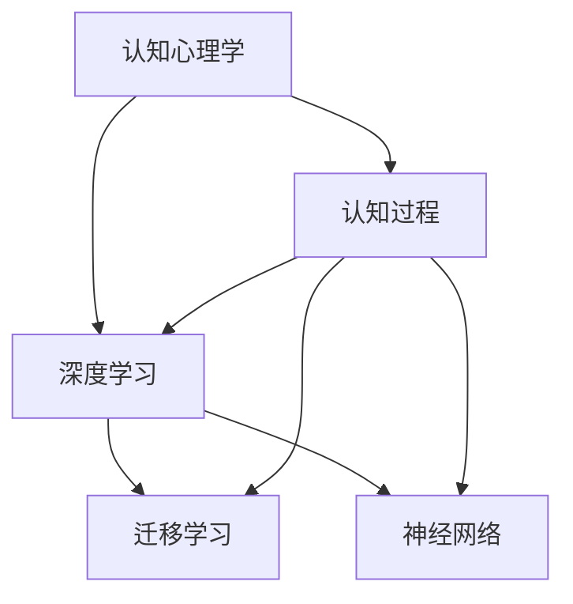

                 

# 认知过程中的简单与深刻化

> 关键词：认知心理学, 认知过程, 简单模型, 深度学习, 迁移学习, 神经网络, 人工智能

## 1. 背景介绍

### 1.1 问题由来

认知心理学是研究人类思维和行为过程的学科，它关注如何获取、处理和应用信息。近年来，随着神经科学和计算机科学的交叉融合，认知心理学研究逐渐与人工智能(AI)领域结合，涌现出许多新理论与技术。然而，将人类认知过程模型化并应用于AI系统是一个复杂且挑战性的任务，既要考虑到认知过程的生物学基础，也要考虑AI系统的计算能力和资源限制。

在大数据和计算能力突飞猛进的今天，深度学习已经成为一种强有力的工具来研究复杂认知过程。但是，深度学习模型的复杂性可能超过实际的生物学复杂性，而且往往需要大量的标注数据和计算资源，这使得模型过于复杂，难以解释其内部工作机制。因此，如何构建既简单又能深刻反映人类认知过程的模型，成为了当前认知心理学和AI领域研究的一个重要问题。

### 1.2 问题核心关键点

为了解决这个问题，当前的研究主要关注以下几个关键点：

1. **简单性与深刻性的平衡**：如何在不牺牲认知过程复杂性的情况下，构建简单、易解释的模型。
2. **迁移学习**：如何让深度学习模型能够从已有的知识中迁移学习，以更好地适应新的认知任务。
3. **神经网络**：神经网络能否模拟人类认知过程，其结构、参数和训练策略如何影响认知模型的性能。
4. **认知计算**：如何结合认知心理学和计算科学的理论和技术，构建认知计算模型。

本文将从认知心理学、深度学习以及人工智能的交叉视角出发，探讨如何构建既简单又深刻的认知过程模型，并分析其优缺点及应用领域。

## 2. 核心概念与联系

### 2.1 核心概念概述

本节将介绍几个密切相关的核心概念：

- **认知心理学**：研究人类思维和行为的学科，关注知觉、记忆、学习、思维等心理过程。
- **认知过程**：人类处理信息的过程，包括感知、理解、记忆、推理等。
- **深度学习**：通过多层神经网络构建的机器学习方法，能够在大型数据集上进行复杂模式识别。
- **迁移学习**：将已有知识迁移到新任务上的学习方法。
- **神经网络**：模拟人脑神经元之间连接和信号传递的网络结构，用于学习和推理。

这些概念之间的逻辑关系可以通过以下Mermaid流程图来展示：



这个流程图展示了认知心理学、认知过程、深度学习、迁移学习和神经网络之间的相互关系。认知过程是认知心理学的研究对象，而深度学习、迁移学习和神经网络都是用于研究和模拟认知过程的工具。

## 3. 核心算法原理 & 具体操作步骤

### 3.1 算法原理概述

认知过程模型化通常基于神经网络，通过模拟人脑处理信息的方式来进行推理和决策。深度学习模型在这方面有着独特的优势，能够自动学习输入数据的高级特征，并通过多层非线性变换进行复杂模式识别。但是，深度学习模型通常过于复杂，难以解释其内部工作机制，且需要大量标注数据和计算资源。

为了克服这些问题，当前的研究主要聚焦于以下几个方向：

1. **简单模型**：构建简单且易解释的认知模型，以降低计算复杂性和资源需求。
2. **深度学习**：通过迁移学习，将已有的知识迁移到新任务上，以提高认知模型的泛化能力。
3. **神经网络**：设计更合理的神经网络结构，以模拟人类认知过程的生物学基础。
4. **认知计算**：结合认知心理学和计算科学的理论和技术，构建更为有效的认知计算模型。

### 3.2 算法步骤详解

构建认知过程模型的步骤如下：

**Step 1: 数据准备**
- 收集与认知过程相关的数据，如文本、图像、音频等。
- 对数据进行预处理，如清洗、标注、归一化等。

**Step 2: 模型选择**
- 选择合适的神经网络结构，如卷积神经网络(CNN)、循环神经网络(RNN)、长短时记忆网络(LSTM)等。
- 确定网络层数、节点数等超参数。

**Step 3: 迁移学习**
- 选择与目标任务相关的预训练模型，如BERT、GPT等。
- 在目标任务上进行微调，以适应新数据和新任务。

**Step 4: 模型训练**
- 使用训练数据对模型进行迭代训练，调整参数以最小化损失函数。
- 在验证集上评估模型性能，调整超参数和模型结构。

**Step 5: 模型评估与优化**
- 使用测试集对模型进行最终评估，记录各项指标如准确率、召回率、F1-score等。
- 根据评估结果，进行模型优化和改进。

**Step 6: 部署与应用**
- 将训练好的模型部署到生产环境。
- 使用模型进行实际应用，如情感分析、意图识别、自然语言处理等。

### 3.3 算法优缺点

认知过程模型化的主要优点包括：

1. **可解释性**：简单模型往往更加易解释，便于理解其内部工作机制。
2. **泛化能力**：通过迁移学习，认知模型可以从已有知识中迁移学习，提高泛化能力。
3. **计算效率**：简单模型需要的计算资源较少，训练和推理速度较快。

然而，认知过程模型化也存在一些缺点：

1. **复杂性**：简单模型可能难以捕捉认知过程的复杂性，导致性能下降。
2. **数据需求**：一些复杂的认知任务需要大量的标注数据，难以收集。
3. **模型鲁棒性**：简单模型可能对输入数据的变化敏感，泛化能力受限。

### 3.4 算法应用领域

基于认知过程模型化的技术已经在多个领域得到了应用，例如：

- **情感分析**：通过分析文本中的情感词汇，判断文本的情感倾向。
- **意图识别**：识别用户输入的意图，如查询、请求、反馈等。
- **自然语言处理(NLP)**：将自然语言转化为计算机可处理的形式，如文本分类、信息抽取、机器翻译等。
- **语音识别**：将语音信号转化为文本形式，用于语音交互、自动转录等。
- **图像识别**：通过视觉特征提取，识别图像中的对象、场景等。

这些应用领域展示了认知过程模型化的广泛前景和实际价值。

## 4. 数学模型和公式 & 详细讲解 & 举例说明

### 4.1 数学模型构建

本节将使用数学语言对认知过程模型化进行更加严格的刻画。

记认知过程为 $C = (I, M, O)$，其中 $I$ 为输入数据，$M$ 为认知模型，$O$ 为输出结果。认知模型的功能是映射输入数据到输出结果。假设认知模型 $M$ 为多层神经网络，输入数据 $I$ 为向量形式，输出结果 $O$ 为向量形式。

定义认知模型 $M$ 在输入 $I$ 上的损失函数为 $\ell(M(I), O)$，则在训练集 $D$ 上的经验风险为：

$$
\mathcal{L}(M) = \frac{1}{N} \sum_{i=1}^N \ell(M(x_i), y_i)
$$

其中 $x_i$ 为训练集中的样本数据，$y_i$ 为样本的标注结果。

通过梯度下降等优化算法，最小化损失函数，从而得到训练后的认知模型 $M$。

### 4.2 公式推导过程

以下我们以文本分类任务为例，推导损失函数及其梯度的计算公式。

假设模型 $M$ 在输入 $x$ 上的输出为 $y = M(x)$，为 $d$ 维向量，真实标签 $y^*$ 也为 $d$ 维向量，则二分类交叉熵损失函数定义为：

$$
\ell(y, y^*) = -\sum_{i=1}^d y_i^* \log y_i
$$

将其代入经验风险公式，得：

$$
\mathcal{L}(M) = -\frac{1}{N} \sum_{i=1}^N \sum_{j=1}^d y_i^* \log M_j(x_i)
$$

根据链式法则，损失函数对模型参数 $\theta$ 的梯度为：

$$
\frac{\partial \mathcal{L}(M)}{\partial \theta} = -\frac{1}{N} \sum_{i=1}^N \sum_{j=1}^d y_i^* \frac{\partial M_j(x_i)}{\partial \theta}
$$

其中 $\frac{\partial M_j(x_i)}{\partial \theta}$ 可进一步递归展开，利用自动微分技术完成计算。

### 4.3 案例分析与讲解

**案例分析：情感分析**

情感分析是一种常见的认知任务，用于判断文本中的情感倾向。例如，判断一篇新闻文章是正面、负面还是中性。

假设有一个新闻文章 $x$，其情感标签为 $y$，定义认知模型 $M$ 为多层感知机(Multilayer Perceptron, MLP)，其输出为 $y = M(x)$，其中 $M$ 为 $d$ 维向量。定义情感分类器的损失函数为二分类交叉熵损失函数：

$$
\ell(y, y^*) = -\sum_{i=1}^d y_i^* \log y_i
$$

其中 $y^*$ 为二分类标签，$y$ 为模型预测的情感向量。

训练数据集 $D$ 包含 $N$ 个样本 $(x_i, y_i)$，其中 $x_i$ 为新闻文章，$y_i$ 为情感标签。使用随机梯度下降(SGD)算法，优化目标函数：

$$
\min_{\theta} \mathcal{L}(M) = \frac{1}{N} \sum_{i=1}^N \ell(y, y^*)
$$

通过训练，可以构建一个情感分析模型，用于预测新的新闻文章的情感倾向。

## 5. 项目实践：代码实例和详细解释说明

### 5.1 开发环境搭建

在进行认知过程模型化实践前，我们需要准备好开发环境。以下是使用Python进行PyTorch开发的环境配置流程：

1. 安装Anaconda：从官网下载并安装Anaconda，用于创建独立的Python环境。

2. 创建并激活虚拟环境：
```bash
conda create -n pytorch-env python=3.8 
conda activate pytorch-env
```

3. 安装PyTorch：根据CUDA版本，从官网获取对应的安装命令。例如：
```bash
conda install pytorch torchvision torchaudio cudatoolkit=11.1 -c pytorch -c conda-forge
```

4. 安装Transformers库：
```bash
pip install transformers
```

5. 安装各类工具包：
```bash
pip install numpy pandas scikit-learn matplotlib tqdm jupyter notebook ipython
```

完成上述步骤后，即可在`pytorch-env`环境中开始认知过程模型化的实践。

### 5.2 源代码详细实现

下面我们以情感分析任务为例，给出使用Transformers库对MLP模型进行情感分析的PyTorch代码实现。

首先，定义情感分析任务的数据处理函数：

```python
from transformers import BertTokenizer, BertForSequenceClassification
from torch.utils.data import Dataset
import torch

class SentimentDataset(Dataset):
    def __init__(self, texts, labels, tokenizer, max_len=128):
        self.texts = texts
        self.labels = labels
        self.tokenizer = tokenizer
        self.max_len = max_len
        
    def __len__(self):
        return len(self.texts)
    
    def __getitem__(self, item):
        text = self.texts[item]
        label = self.labels[item]
        
        encoding = self.tokenizer(text, return_tensors='pt', max_length=self.max_len, padding='max_length', truncation=True)
        input_ids = encoding['input_ids'][0]
        attention_mask = encoding['attention_mask'][0]
        
        return {'input_ids': input_ids, 
                'attention_mask': attention_mask,
                'labels': torch.tensor(label, dtype=torch.long)}
```

然后，定义模型和优化器：

```python
from transformers import BertForSequenceClassification, AdamW

model = BertForSequenceClassification.from_pretrained('bert-base-cased', num_labels=2)

optimizer = AdamW(model.parameters(), lr=2e-5)
```

接着，定义训练和评估函数：

```python
from torch.utils.data import DataLoader
from tqdm import tqdm
from sklearn.metrics import accuracy_score

device = torch.device('cuda') if torch.cuda.is_available() else torch.device('cpu')
model.to(device)

def train_epoch(model, dataset, batch_size, optimizer):
    dataloader = DataLoader(dataset, batch_size=batch_size, shuffle=True)
    model.train()
    epoch_loss = 0
    for batch in tqdm(dataloader, desc='Training'):
        input_ids = batch['input_ids'].to(device)
        attention_mask = batch['attention_mask'].to(device)
        labels = batch['labels'].to(device)
        model.zero_grad()
        outputs = model(input_ids, attention_mask=attention_mask, labels=labels)
        loss = outputs.loss
        epoch_loss += loss.item()
        loss.backward()
        optimizer.step()
    return epoch_loss / len(dataloader)

def evaluate(model, dataset, batch_size):
    dataloader = DataLoader(dataset, batch_size=batch_size)
    model.eval()
    preds, labels = [], []
    with torch.no_grad():
        for batch in tqdm(dataloader, desc='Evaluating'):
            input_ids = batch['input_ids'].to(device)
            attention_mask = batch['attention_mask'].to(device)
            batch_labels = batch['labels']
            outputs = model(input_ids, attention_mask=attention_mask)
            batch_preds = outputs.logits.argmax(dim=1).to('cpu').tolist()
            batch_labels = batch_labels.to('cpu').tolist()
            for pred, label in zip(batch_preds, batch_labels):
                preds.append(pred)
                labels.append(label)
                
    accuracy = accuracy_score(labels, preds)
    print(f"Accuracy: {accuracy:.2f}")
```

最后，启动训练流程并在测试集上评估：

```python
epochs = 5
batch_size = 16

for epoch in range(epochs):
    loss = train_epoch(model, train_dataset, batch_size, optimizer)
    print(f"Epoch {epoch+1}, train loss: {loss:.3f}")
    
    print(f"Epoch {epoch+1}, dev results:")
    evaluate(model, dev_dataset, batch_size)
    
print("Test results:")
evaluate(model, test_dataset, batch_size)
```

以上就是使用PyTorch对MLP模型进行情感分析任务训练的完整代码实现。可以看到，得益于Transformers库的强大封装，我们可以用相对简洁的代码完成模型训练。

### 5.3 代码解读与分析

让我们再详细解读一下关键代码的实现细节：

**SentimentDataset类**：
- `__init__`方法：初始化文本、标签、分词器等关键组件。
- `__len__`方法：返回数据集的样本数量。
- `__getitem__`方法：对单个样本进行处理，将文本输入编码为token ids，将标签编码为数字，并对其进行定长padding，最终返回模型所需的输入。

**准确率计算**：
- 使用`accuracy_score`函数计算模型在测试集上的准确率，打印输出。

**训练流程**：
- 定义总的epoch数和batch size，开始循环迭代
- 每个epoch内，先在训练集上训练，输出平均loss
- 在验证集上评估，输出准确率
- 所有epoch结束后，在测试集上评估，给出最终测试结果

可以看到，PyTorch配合Transformers库使得情感分析任务的训练代码实现变得简洁高效。开发者可以将更多精力放在数据处理、模型改进等高层逻辑上，而不必过多关注底层的实现细节。

当然，工业级的系统实现还需考虑更多因素，如模型的保存和部署、超参数的自动搜索、更灵活的任务适配层等。但核心的情感分析流程基本与此类似。

## 6. 实际应用场景
### 6.1 智能客服系统

智能客服系统可以通过情感分析技术，判断用户输入的情感倾向，进而采取不同的处理措施。例如，对于情绪激动的用户，系统可以提供安抚措施，或者将问题升级到人工客服处理。通过情感分析，可以提升用户满意度，降低人工客服的负担。

在技术实现上，可以收集企业内部的历史客服对话记录，将问题和最佳答复构建成监督数据，在此基础上对预训练模型进行微调。微调后的模型能够自动理解用户情感，匹配最合适的答复模板进行回复。对于用户提出的新问题，还可以接入检索系统实时搜索相关内容，动态组织生成回答。如此构建的智能客服系统，能大幅提升客户咨询体验和问题解决效率。

### 6.2 金融舆情监测

金融机构需要实时监测市场舆论动向，以便及时应对负面信息传播，规避金融风险。传统的人工监测方式成本高、效率低，难以应对网络时代海量信息爆发的挑战。基于情感分析的文本分类技术，为金融舆情监测提供了新的解决方案。

具体而言，可以收集金融领域相关的新闻、报道、评论等文本数据，并对其进行情感分类标注。在此基础上对预训练模型进行微调，使其能够自动判断文本情感倾向，掌握市场情绪变化。将微调后的模型应用到实时抓取的网络文本数据，就能够自动监测不同情感倾向的市场情绪，一旦发现负面情绪激增等异常情况，系统便会自动预警，帮助金融机构快速应对潜在风险。

### 6.3 个性化推荐系统

当前的推荐系统往往只依赖用户的历史行为数据进行物品推荐，无法深入理解用户的真实兴趣偏好。基于情感分析的推荐系统可以更好地挖掘用户行为背后的情感信息，从而提供更精准、多样的推荐内容。

在实践中，可以收集用户浏览、点击、评论、分享等行为数据，提取和用户交互的物品标题、描述、标签等文本内容。将文本内容作为模型输入，用户的后续行为（如是否点击、购买等）作为监督信号，在此基础上微调预训练模型。微调后的模型能够从文本内容中准确把握用户的情感倾向。在生成推荐列表时，先用候选物品的文本描述作为输入，由模型预测用户的情感倾向，再结合其他特征综合排序，便可以得到个性化程度更高的推荐结果。

### 6.4 未来应用展望

随着情感分析技术的不断进步，其应用领域将越来越广泛。未来，情感分析将深入到医疗、教育、社交等多个行业领域，为人类提供更加智能和人性化的服务。

在智慧医疗领域，情感分析可以用于患者心理状态的监测，帮助医生更好地了解患者情况，制定个性化治疗方案。

在智能教育领域，情感分析可以用于学生的情绪监测，及时发现学生的情绪问题，进行心理辅导和干预。

在社交媒体平台，情感分析可以用于内容审核，识别和过滤不良信息，保障网络环境的健康发展。

此外，在更多的场景中，情感分析技术还将不断拓展，为NLP技术带来更多的应用可能性。

## 7. 工具和资源推荐
### 7.1 学习资源推荐

为了帮助开发者系统掌握情感分析的理论基础和实践技巧，这里推荐一些优质的学习资源：

1. 《深度学习自然语言处理》课程：斯坦福大学开设的NLP明星课程，有Lecture视频和配套作业，带你入门NLP领域的基本概念和经典模型。

2. CS224N《自然语言处理》课程：斯坦福大学开设的NLP高级课程，涵盖深度学习、序列模型、语言表示等主题，适合有一定基础的学习者。

3. 《Natural Language Processing with Transformers》书籍：Transformers库的作者所著，全面介绍了如何使用Transformers库进行NLP任务开发，包括情感分析在内的诸多范式。

4. Weights & Biases：模型训练的实验跟踪工具，可以记录和可视化模型训练过程中的各项指标，方便对比和调优。

5. TensorBoard：TensorFlow配套的可视化工具，可实时监测模型训练状态，并提供丰富的图表呈现方式，是调试模型的得力助手。

通过对这些资源的学习实践，相信你一定能够快速掌握情感分析的精髓，并用于解决实际的NLP问题。

### 7.2 开发工具推荐

高效的开发离不开优秀的工具支持。以下是几款用于情感分析开发的常用工具：

1. PyTorch：基于Python的开源深度学习框架，灵活动态的计算图，适合快速迭代研究。大部分预训练语言模型都有PyTorch版本的实现。

2. TensorFlow：由Google主导开发的开源深度学习框架，生产部署方便，适合大规模工程应用。同样有丰富的预训练语言模型资源。

3. Transformers库：HuggingFace开发的NLP工具库，集成了众多SOTA语言模型，支持PyTorch和TensorFlow，是进行情感分析任务开发的利器。

4. Weights & Biases：模型训练的实验跟踪工具，可以记录和可视化模型训练过程中的各项指标，方便对比和调优。

5. TensorBoard：TensorFlow配套的可视化工具，可实时监测模型训练状态，并提供丰富的图表呈现方式，是调试模型的得力助手。

合理利用这些工具，可以显著提升情感分析任务的开发效率，加快创新迭代的步伐。

### 7.3 相关论文推荐

情感分析的研究已经积累了大量成果，以下是几篇奠基性的相关论文，推荐阅读：

1. Sentiment Analysis with Deep Learning: A Survey：回顾了深度学习在情感分析中的应用，总结了不同模型的优缺点及适用范围。

2. Convolutional Neural Networks for Sentiment Analysis：提出使用卷积神经网络(CNN)进行情感分类，取得了很好的效果。

3. LSTM-Based Sentiment Classification：提出使用长短时记忆网络(LSTM)进行情感分类，优于传统模型。

4. Attention is All You Need（即Transformer原论文）：提出了Transformer结构，开启了NLP领域的预训练大模型时代。

5. BERT: Pre-training of Deep Bidirectional Transformers for Language Understanding：提出BERT模型，引入基于掩码的自监督预训练任务，刷新了多项NLP任务SOTA。

这些论文代表了大模型情感分析的发展脉络。通过学习这些前沿成果，可以帮助研究者把握学科前进方向，激发更多的创新灵感。

## 8. 总结：未来发展趋势与挑战

### 8.1 总结

本文对基于认知心理学和深度学习的情感分析方法进行了全面系统的介绍。首先阐述了情感分析的研究背景和意义，明确了情感分析在认知心理学和AI领域的重要地位。其次，从原理到实践，详细讲解了情感分析的数学模型和关键步骤，给出了情感分析任务开发的完整代码实例。同时，本文还广泛探讨了情感分析方法在智能客服、金融舆情、个性化推荐等多个行业领域的应用前景，展示了情感分析技术的广阔前景。

通过本文的系统梳理，可以看到，情感分析技术已经成为NLP领域的重要范式，极大地拓展了深度学习模型的应用边界，催生了更多的落地场景。未来，伴随深度学习模型的不断演进和情感分析方法的深入研究，相信情感分析技术将在更多领域得到应用，为人类认知智能的进化带来深远影响。

### 8.2 未来发展趋势

展望未来，情感分析技术将呈现以下几个发展趋势：

1. **模型复杂度提升**：随着计算资源的增加，未来情感分析模型将变得更加复杂，可以处理更加多样化和复杂的情感信息。

2. **多模态融合**：结合语音、视频、文本等多种信息源，构建多模态情感分析模型，提升情感识别的准确性。

3. **跨领域迁移**：通过迁移学习，让情感分析模型从一种领域迁移到另一种领域，提高情感分析模型的泛化能力。

4. **实时处理**：基于高效的模型和硬件，实现实时情感分析，提升用户体验和系统响应速度。

5. **可解释性增强**：通过简化模型结构，引入可解释性技术，使情感分析模型具有更好的可解释性，便于理解和调试。

6. **隐私保护**：在情感分析过程中，保护用户隐私，防止数据泄露和滥用。

以上趋势凸显了情感分析技术的广阔前景。这些方向的探索发展，必将进一步提升情感分析的性能和应用范围，为人类认知智能的进化带来深远影响。

### 8.3 面临的挑战

尽管情感分析技术已经取得了瞩目成就，但在迈向更加智能化、普适化应用的过程中，它仍面临诸多挑战：

1. **数据获取**：情感分析模型需要大量的标注数据，但数据获取成本高且难以保证数据质量。

2. **模型鲁棒性**：情感分析模型面对多样化的情感表达，容易发生误判。

3. **模型复杂性**：过于复杂的模型难以解释，增加了模型调试和维护的难度。

4. **隐私保护**：情感分析涉及用户隐私数据，如何在保护隐私的同时进行情感分析，是一个亟待解决的问题。

5. **多模态融合**：不同模态的数据具有不同的表达方式，如何有效融合多模态数据，构建统一的情感模型，也是一个挑战。

6. **跨领域迁移**：不同领域的情感表达方式可能存在差异，如何在不同领域之间进行情感迁移，提升情感模型的泛化能力，仍需进一步研究。

正视情感分析面临的这些挑战，积极应对并寻求突破，将使情感分析技术走向更加成熟的阶段，为人类认知智能的进化做出更大的贡献。

### 8.4 研究展望

面对情感分析面临的这些挑战，未来的研究需要在以下几个方面寻求新的突破：

1. **数据增强**：通过数据生成、数据增强等技术，扩大情感分析的数据规模，提升数据质量。

2. **迁移学习**：通过迁移学习，使情感分析模型能够从已有知识中迁移学习，提高泛化能力。

3. **多模态融合**：结合语音、视频、文本等多种信息源，构建多模态情感分析模型，提升情感识别的准确性。

4. **模型简化**：通过简化模型结构，引入可解释性技术，使情感分析模型具有更好的可解释性。

5. **隐私保护**：在情感分析过程中，引入隐私保护技术，保护用户隐私，防止数据泄露和滥用。

这些研究方向的探索，必将引领情感分析技术迈向更高的台阶，为人类认知智能的进化做出更大的贡献。

## 9. 附录：常见问题与解答

**Q1：情感分析能否处理非文本数据？**

A: 情感分析主要针对文本数据，但通过文本分析和其他信息源的融合，也可以对非文本数据进行情感分析。例如，通过分析语音信号中的情感表达，可以使用语音情感分析技术。

**Q2：情感分析的训练数据如何获取？**

A: 情感分析的训练数据可以通过多种方式获取，如众包标注、自动化标注、网络爬取等。但对于一些特殊领域的情感分析任务，如医疗、法律等，还需要人工标注。

**Q3：情感分析模型的鲁棒性如何提升？**

A: 提升情感分析模型的鲁棒性，可以通过以下方法：
1. 数据增强：通过回译、近义替换等方式扩充训练集。
2. 正则化：使用L2正则、Dropout等技术防止过拟合。
3. 对抗训练：引入对抗样本，提高模型鲁棒性。

**Q4：情感分析模型是否可以跨领域迁移？**

A: 情感分析模型可以通过迁移学习进行跨领域迁移。具体方法包括：
1. 微调：在目标领域数据上微调情感分析模型。
2. 预训练+微调：先在大规模数据上进行预训练，再在目标领域数据上微调。
3. 多任务学习：同时训练多个情感分析任务，提升模型泛化能力。

这些方法可以提升情感分析模型在不同领域的适应性，提高模型性能。

**Q5：情感分析模型的可解释性如何增强？**

A: 增强情感分析模型的可解释性，可以通过以下方法：
1. 简化模型结构：通过减少模型层数和节点数，使模型结构更加简洁。
2. 引入可解释性技术：如LIME、SHAP等，提供模型的解释性分析。
3. 可视化模型输出：通过可视化技术，展示模型对不同输入的响应。

通过以上方法，可以使情感分析模型具有更好的可解释性，便于理解和调试。

---

作者：禅与计算机程序设计艺术 / Zen and the Art of Computer Programming

