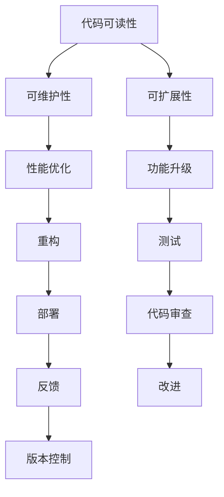

                 

# 论代码洁癖：追求极致和完美

## 1. 背景介绍

代码洁癖是一种追求代码极致完美的软件开发习惯，它不仅仅是对代码格式化和规范化的要求，更是对代码可读性、可维护性和可扩展性的极致追求。随着软件工程的发展，代码洁癖已经成为软件开发不可或缺的一部分。本文将深入探讨代码洁癖的核心理念和实践方法，并结合实例分析其在实际开发中的应用。

## 2. 核心概念与联系

### 2.1 核心概念概述

代码洁癖的核心概念包括：
- **代码可读性**：指代码易于理解、易于维护，便于后续开发者阅读和修改。
- **代码可维护性**：指代码在修改、扩展、重构时，影响最小、成本最低。
- **代码可扩展性**：指代码在功能升级、性能优化时，扩展容易、兼容性高。

### 2.2 核心概念原理和架构的 Mermaid 流程图



此图展示了代码洁癖的几个关键点：
- 可读性是可维护性和可扩展性的基础。
- 可维护性和可扩展性直接关系到性能优化、功能升级和重构的难度。
- 代码审查和版本控制是确保代码整洁的重要手段。

## 3. 核心算法原理 & 具体操作步骤

### 3.1 算法原理概述

代码洁癖的实现基于以下几个算法原理：

- **代码格式化规范**：定义一套统一的代码格式规范，如缩进风格、命名约定、注释习惯等，以提升代码可读性和可维护性。
- **代码重构**：通过修改代码结构，使其更加简洁、清晰、高效，提升代码可维护性和可扩展性。
- **代码审查**：通过团队成员的代码审查，及时发现和修正代码中的问题，确保代码质量和一致性。
- **版本控制**：使用版本控制系统，如Git，记录代码变更历史，方便回溯和协作。

### 3.2 算法步骤详解

#### 3.2.1 代码格式化规范

1. **定义规范**：根据团队的技术栈和项目需求，定义一套统一的代码规范，如Google的Python规范。
2. **工具支持**：使用代码格式化工具，如Clang-Format、Prettier等，自动格式化代码。
3. **持续集成**：将代码格式化作为CI/CD流程的一部分，自动在每次代码提交后执行格式化，保证代码规范一致。

#### 3.2.2 代码重构

1. **识别问题**：通过代码审查和静态分析工具，如SonarQube、ESLint等，识别代码中的问题，如重复代码、命名不规范、函数过长等。
2. **重构代码**：根据识别出的问题，进行代码重构，如提取函数、重命名变量、使用设计模式等。
3. **单元测试**：重构后，添加或修改单元测试，确保重构不会引入新的问题。

#### 3.2.3 代码审查

1. **代码提交**：团队成员提交代码后，发起代码审查请求。
2. **代码评审**：代码审查由其他团队成员完成，检查代码规范、重构效果、功能实现等。
3. **提出建议**：评审过程中，提出改进建议，如改进代码风格、优化算法、修正错误等。
4. **代码修改**：根据评审建议，修改代码，并再次提交审查。

#### 3.2.4 版本控制

1. **创建仓库**：在Git上创建代码仓库，记录项目历史。
2. **提交变更**：每个开发任务完成后，提交代码变更，并添加提交信息。
3. **分支管理**：使用分支管理功能，如Git Flow，进行功能开发、测试、合并等。
4. **合并代码**：在代码审查通过后，合并分支到主分支，发布新版本。

### 3.3 算法优缺点

#### 3.3.1 优点

- **提升代码质量**：规范化的代码格式和重构可以显著提升代码质量，减少代码漏洞。
- **便于团队协作**：统一的代码规范和审查机制，可以提升团队协作效率，减少沟通成本。
- **降低维护成本**：清晰的代码结构和规范化的代码风格，可以降低后续维护和扩展的难度。

#### 3.3.2 缺点

- **开发效率降低**：规范化、重构和审查可能会在初期增加开发时间，影响项目进度。
- **灵活性降低**：固定的规范和严格的审查机制，可能会限制开发者的自由度，影响创新。

### 3.4 算法应用领域

代码洁癖的实践在软件开发的不同阶段都有广泛的应用：

- **需求分析**：清晰的文档和规范化的代码有助于准确理解需求。
- **设计阶段**：统一的设计规范和代码风格，有助于构建模块化和可扩展的系统架构。
- **开发阶段**：代码格式化、重构和审查，可以提升代码质量和开发效率。
- **测试阶段**：规范化的代码和良好的测试习惯，有助于发现和修正代码中的问题。
- **部署阶段**：统一的代码规范和版本控制，有助于顺利发布和回溯代码变更。

## 4. 数学模型和公式 & 详细讲解 & 举例说明

### 4.1 数学模型构建

假设代码质量由三个因素决定：代码可读性 $R$、代码可维护性 $M$ 和代码可扩展性 $E$。

定义代码质量模型如下：
$$
Q = f(R, M, E)
$$

其中，$f$ 是一个非线性函数，表示三个因素的综合作用。

### 4.2 公式推导过程

根据以上假设，可以构建代码质量模型的数学公式：
$$
Q = \alpha R^a + \beta M^b + \gamma E^c
$$

其中，$\alpha, \beta, \gamma$ 是权重系数，$a, b, c$ 是影响因子。

### 4.3 案例分析与讲解

#### 案例1：Google的代码重构实践

Google的团队在每次代码审查时，会检查代码规范、重构效果和功能实现。对于不符合规范的代码，会提出改进建议。在代码审查通过后，开发人员根据建议进行重构，并再次提交审查。

#### 案例2：Facebook的代码审查实践

Facebook采用代码审查作为其开发流程的核心部分，每个代码提交都需要经过两次代码审查，以确保代码质量。同时，Facebook使用版本控制系统，记录代码变更历史，方便回溯和协作。

## 5. 项目实践：代码实例和详细解释说明

### 5.1 开发环境搭建

- **安装Git**：安装Git，配置用户名和邮箱。
- **克隆仓库**：使用 `git clone` 命令克隆代码仓库到本地。
- **创建分支**：使用 `git checkout -b <branch_name>` 命令创建分支。
- **代码提交**：使用 `git commit -m "<commit_message>"` 命令提交代码变更。
- **合并代码**：使用 `git merge <branch_name>` 命令合并分支到主分支。

### 5.2 源代码详细实现

以下是一个简单的Python代码示例，展示如何规范化代码格式和进行重构：

```python
# 规范化代码格式
def calculate_area(length, width):
    area = length * width
    return area

# 重构代码
def get_rectangle_area(length, width):
    return length * width

# 单元测试
def test_rectangle_area():
    assert get_rectangle_area(3, 4) == 12
    assert get_rectangle_area(5, 7) == 35
```

### 5.3 代码解读与分析

- **代码格式化**：使用Prettier格式化代码，提升代码可读性。
- **函数重构**：将原代码中的重复计算和冗余代码去除，使代码更加简洁。
- **单元测试**：添加测试用例，确保重构不会引入新的问题。

### 5.4 运行结果展示

在代码格式化、重构和测试通过后，提交代码变更，并发起代码审查请求。审查通过后，合并代码，发布新版本。

## 6. 实际应用场景

### 6.1 大型软件项目

大型软件项目通常有多个开发人员协作，代码洁癖在保证代码一致性和质量方面发挥了重要作用。通过规范化的代码格式和严格的代码审查，可以显著提升团队协作效率，减少代码漏洞和维护成本。

### 6.2 开源社区

开源社区注重代码质量和可维护性，代码洁癖的实践有助于提升代码质量和社区声誉。通过统一的代码规范和审查机制，可以确保开源代码的高质量和高可扩展性。

### 6.3 企业应用

企业应用需要保证代码的高质量和稳定性，代码洁癖的实践可以有效提升代码质量，降低维护成本。同时，规范化的代码和持续的代码审查，有助于快速响应和解决代码问题，提升用户满意度。

## 7. 工具和资源推荐

### 7.1 学习资源推荐

- **《Clean Code: A Handbook of Agile Software Craftsmanship》**：Robert C. Martin著，介绍代码整洁的12种原则和19种重构技巧，是代码洁癖实践的必读之作。
- **《Code Complete: A Practical Handbook of Software Construction》**：Steve McConnell著，介绍软件开发的全面指南，包含代码规范和重构的详细方法。
- **Google的Python规范**：Google开发的Python代码规范，详细定义了Python代码的格式化、命名和注释规范。
- **Facebook的代码审查规范**：Facebook的代码审查流程和规范，可以帮助开发者提高代码质量和协作效率。

### 7.2 开发工具推荐

- **Clang-Format**：Google开发的代码格式化工具，支持多种编程语言，自动格式化代码。
- **Prettier**：基于ATS的代码格式化工具，支持多种编程语言，自动格式化代码。
- **ESLint**：静态代码分析工具，可以检测代码中的问题，并提供改进建议。
- **SonarQube**：代码质量管理工具，可以检测代码中的问题，并生成质量报告。
- **Git**：版本控制系统，可以记录代码变更历史，方便回溯和协作。

### 7.3 相关论文推荐

- **《Clean Code: A Handbook of Agile Software Craftsmanship》**：Robert C. Martin著，介绍代码整洁的12种原则和19种重构技巧。
- **《Code Complete: A Practical Handbook of Software Construction》**：Steve McConnell著，介绍软件开发的全面指南。
- **《A Survey of Software Design Models and Design Languages》**：Lehman, A., & Keene, B. W.著，综述了软件设计模型和设计语言的研究。
- **《Design Patterns: Elements of Reusable Object-Oriented Software》**：Erich Gamma, Richard Helm, Ralph Johnson, John Vlissides著，介绍常用的设计模式和设计原则。

## 8. 总结：未来发展趋势与挑战

### 8.1 研究成果总结

代码洁癖的实践已经在软件开发领域得到了广泛应用，并取得了显著的成果。通过规范化的代码格式、严格的重构和审查，提升了代码质量，降低了维护成本，提高了团队协作效率。

### 8.2 未来发展趋势

未来，代码洁癖的实践将进一步发展：

- **自动化工具**：代码格式化、重构和审查的自动化工具将更加普及，提升开发效率。
- **AI辅助代码审查**：使用AI技术辅助代码审查，自动识别和修复代码中的问题。
- **持续集成和交付**：将代码洁癖实践融入持续集成和持续交付流程，保证代码一致性和稳定性。
- **社区和开源**：开源社区和企业将进一步推广代码洁癖的实践，提升代码质量和社区声誉。

### 8.3 面临的挑战

尽管代码洁癖的实践在提升代码质量方面取得了显著成果，但在推广和实践过程中也面临以下挑战：

- **开发成本增加**：规范化、重构和审查可能会在初期增加开发时间，影响项目进度。
- **开发者自由度受限**：严格的规范和审查机制，可能会限制开发者的自由度，影响创新。
- **技术栈复杂性**：不同的技术栈有不同的规范和工具，需要开发者进行学习和适应。

### 8.4 研究展望

未来的研究需要在以下几个方面进行探索：

- **自动化工具的优化**：开发更加高效、易用的自动化工具，提升代码洁癖的实践效率。
- **AI辅助工具的应用**：研究使用AI技术辅助代码审查的方法，提升代码审查的准确性和效率。
- **持续集成和交付的改进**：将代码洁癖实践融入持续集成和持续交付流程，实现代码自动化审查和交付。
- **跨技术栈的规范统一**：研究跨技术栈的代码规范和工具，提升代码洁癖实践的普适性和可操作性。

## 9. 附录：常见问题与解答

**Q1: 代码洁癖会降低开发效率吗？**

A: 规范化的代码格式和重构可能会在初期增加开发时间，但长远来看，可以提升代码质量，降低后续维护和扩展的难度，最终提升开发效率。

**Q2: 如何进行代码审查？**

A: 代码审查通常由团队成员进行，通过代码审查工具（如Gerrit、Phabricator等）提交代码审查请求，并提出改进建议。

**Q3: 如何处理代码审查中的分歧？**

A: 当代码审查中存在分歧时，可以组织代码审查会议，讨论和解决问题，达成一致意见后修改代码。

---

作者：禅与计算机程序设计艺术 / Zen and the Art of Computer Programming

