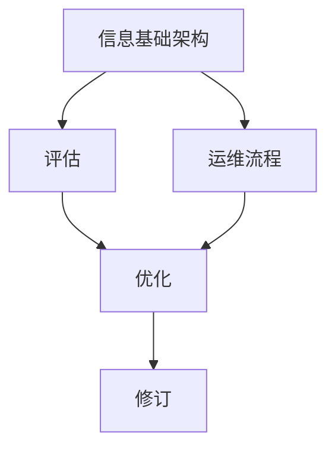

                 

# 评估、优化、修订信息基础架构和运维流程

## 1. 背景介绍

在数字化转型的大背景下，企业对信息基础设施的依赖日益增强。然而，随着业务规模的扩大和IT系统的复杂性增加，信息基础设施和运维流程的挑战也越发凸显。有效评估、优化和修订信息基础架构，对于保障企业高效运营、降低运维成本、提高用户体验具有重要意义。本文将从核心概念、算法原理、项目实践、应用场景等方面，深入探讨信息基础架构评估、优化和修订的方法与策略。

## 2. 核心概念与联系

### 2.1 核心概念概述

为更好地理解评估、优化和修订信息基础架构的方法，本节将介绍几个关键概念：

- **信息基础架构(IT Infrastructure)**：包括硬件、软件、网络、数据中心等支撑企业信息系统运行的基础设施。
- **运维流程(Maintenance Processes)**：从故障检测、排障、恢复、预防等各个环节的系统化运维管理。
- **评估(Evaluation)**：通过对IT基础设施的性能、稳定性、安全性等维度进行系统化测量和分析，识别出问题和改进机会。
- **优化(Optimization)**：通过技术和管理手段，提高IT基础设施的运行效率、降低运维成本、增强用户体验。
- **修订(Revision)**：针对评估和优化中发现的短板，进行结构性或局部性的调整和改进，确保基础设施的长期稳定性和可扩展性。

这些概念之间的逻辑关系可以通过以下Mermaid流程图来展示：



### 2.2 核心概念原理和架构的 Mermaid 流程图

```mermaid
graph TB
    A[数据中心] --> B[硬件资源管理]
    B --> C[虚拟化技术]
    C --> D[云计算]
    A --> E[网络架构]
    E --> F[负载均衡]
    F --> G[网络安全]
    A --> H[软件平台]
    H --> I[应用集成]
    I --> J[微服务架构]
    J --> K[容器化部署]
    A --> L[数据管理]
    L --> M[数据库]
    M --> N[数据湖]
    N --> O[大数据处理]
    L --> P[备份与恢复]
    P --> Q[灾备]
    A --> R[监控与警报]
    R --> S[性能监控]
    S --> T[异常检测]
    T --> U[故障排除]
    A --> V[用户反馈]
    V --> W[用户满意度]
    A --> X[IT运维]
    X --> Y[服务级别协议(SLA)管理]
    Y --> Z[运维流程]
    Z --> AA[流程自动化]
    AA --> BB[自动化部署]
    BB --> CC[自动化测试]
    CC --> DD[持续集成]
    DD --> EE[持续交付]
```

### 2.3 核心概念原理和架构的详细解释

#### 数据中心

- **数据中心(Compute Center)**：包括服务器、存储、网络等物理资源，是企业IT基础设施的核心。数据中心的建设需要考虑地理位置、电力、安全等因素，以确保其高效稳定运行。

#### 硬件资源管理

- **硬件资源管理(Hardware Resource Management)**：通过虚拟化技术将物理资源抽象成逻辑资源，实现资源的按需分配和管理。常用的虚拟化技术包括VMware、KVM、Hyper-V等。

#### 虚拟化技术

- **虚拟化技术(Virtualization Technology)**：将一台物理服务器划分成多个虚拟服务器，每个虚拟服务器独立运行，提高资源利用率。

#### 云计算

- **云计算(Cloud Computing)**：基于虚拟化技术，通过互联网提供可扩展的、按需的服务。云计算提供了弹性计算资源和存储资源，降低企业的硬件和运维成本。

#### 网络架构

- **网络架构(Network Architecture)**：通过设计合理的网络拓扑结构，确保数据中心内部和外部的网络连接高效稳定。

#### 负载均衡

- **负载均衡(Load Balancing)**：通过分布式系统，将负载平均分配到多个服务器上，提高系统的可用性和扩展性。

#### 网络安全

- **网络安全(Network Security)**：通过防火墙、入侵检测系统等手段，保护数据中心的物理和网络安全。

#### 软件平台

- **软件平台(Software Platform)**：包括操作系统、中间件、应用服务器等软件组件，为业务应用提供运行环境。

#### 应用集成

- **应用集成(Application Integration)**：通过ESB、API网关等技术，实现不同应用系统之间的互联互通。

#### 微服务架构

- **微服务架构(Microservices Architecture)**：将单体应用拆分为多个微服务，每个微服务独立部署和扩展，提高系统的灵活性和可维护性。

#### 容器化部署

- **容器化部署(Containerization)**：将应用封装在Docker等容器中，实现跨平台、易迁移、易扩展的部署。

#### 数据管理

- **数据管理(Data Management)**：包括数据库、数据湖、大数据处理等技术，用于数据采集、存储、处理和分析。

#### 数据库

- **数据库(Database)**：存储和管理结构化数据，支持数据的查询、更新、备份等功能。

#### 数据湖

- **数据湖(Data Lake)**：存储和管理非结构化数据，支持大规模数据分析和机器学习。

#### 大数据处理

- **大数据处理(Big Data Processing)**：通过分布式计算技术，处理和分析大规模数据集，支持实时的数据处理和分析。

#### 备份与恢复

- **备份与恢复(Backup and Recovery)**：定期备份数据和系统配置，确保数据安全和系统可恢复性。

#### 灾备

- **灾备(Disaster Recovery)**：通过灾难恢复计划，保障数据中心在突发事件中的可用性。

#### 监控与警报

- **监控与警报(Monitoring and Alerts)**：通过监控系统实时监测IT基础设施的运行状态，及时发现和报警潜在问题。

#### 性能监控

- **性能监控(Performance Monitoring)**：通过监控IT基础设施的各项指标，评估系统的性能和稳定性。

#### 异常检测

- **异常检测(Anomaly Detection)**：通过机器学习算法，识别系统中的异常行为和潜在问题。

#### 故障排除

- **故障排除(Troubleshooting)**：通过日志分析、系统调优等手段，快速定位和解决问题。

#### 用户反馈

- **用户反馈(User Feedback)**：通过用户反馈机制，收集用户对系统性能和体验的意见和建议。

#### 用户满意度

- **用户满意度(User Satisfaction)**：通过对用户反馈进行分析，评估系统的用户体验和满意度。

#### IT运维

- **IT运维(IT Operations)**：包括故障检测、排障、恢复、预防等各个环节的系统化运维管理。

#### 服务级别协议(SLA)

- **服务级别协议(SLA)**：通过签订服务协议，明确IT服务的质量和保障措施，确保服务的可靠性和可用性。

#### 运维流程

- **运维流程(Maintenance Processes)**：从故障检测、排障、恢复、预防等各个环节的系统化运维管理。

#### 流程自动化

- **流程自动化(Process Automation)**：通过自动化工具，减少人工操作，提高运维效率和准确性。

#### 自动化部署

- **自动化部署(Automated Deployment)**：通过脚本或CI/CD工具，自动化部署和更新应用。

#### 自动化测试

- **自动化测试(Automated Testing)**：通过自动化测试工具，确保应用的质量和稳定性。

#### 持续集成

- **持续集成(Continuous Integration, CI)**：通过自动化工具，将代码变更、测试和部署集成到开发流程中。

#### 持续交付

- **持续交付(Continuous Delivery, CD)**：通过自动化工具，快速、稳定地交付应用。

## 3. 核心算法原理 & 具体操作步骤

### 3.1 算法原理概述

信息基础架构的评估、优化和修订过程，涉及多个关键环节和技术的组合应用。这些环节和技术相互关联，形成一个整体系统。下面将详细阐述其中的核心算法原理和操作步骤。

#### 3.1.1 评估原理

评估是对信息基础架构现状进行系统化测量和分析的过程，目的是识别问题和改进机会。评估通常包括以下步骤：

1. **数据收集**：通过监控系统、日志文件、用户反馈等渠道，收集IT基础设施的各项数据。
2. **数据分析**：对收集到的数据进行分析，识别出性能瓶颈、安全风险、资源浪费等问题。
3. **问题诊断**：结合专家经验和工具，对识别出的问题进行诊断，确定根本原因。
4. **改进建议**：提出具体的改进措施和优化方案，包括技术和管理两方面。

#### 3.1.2 优化原理

优化是对信息基础架构进行系统性调整和改进的过程，目的是提高其运行效率和用户体验。优化通常包括以下步骤：

1. **需求分析**：明确优化目标和预期效果。
2. **方案设计**：设计具体的优化方案，包括技术和管理两方面。
3. **方案实施**：按计划实施优化方案，逐步验证和调整。
4. **效果评估**：评估优化效果，确保达到预期目标。

#### 3.1.3 修订原理

修订是对信息基础架构进行结构性或局部性调整和改进的过程，目的是确保其长期稳定性和可扩展性。修订通常包括以下步骤：

1. **现状分析**：分析现有架构的不足和问题。
2. **方案设计**：设计具体的修订方案，包括技术和管理两方面。
3. **方案实施**：按计划实施修订方案，逐步验证和调整。
4. **效果评估**：评估修订效果，确保达到预期目标。

### 3.2 算法步骤详解

#### 3.2.1 评估步骤

1. **数据收集**
    - 使用监控工具收集服务器的CPU、内存、磁盘使用率等性能指标。
    - 收集网络流量、延迟等网络性能指标。
    - 收集用户反馈和系统日志。

2. **数据分析**
    - 使用数据分析工具（如ELK Stack、Prometheus、Grafana等）对收集到的数据进行分析。
    - 识别出性能瓶颈、异常流量、安全风险等问题。

3. **问题诊断**
    - 结合专家经验和工具（如Wireshark、Nagios等），对识别出的问题进行诊断。
    - 确定问题的根本原因，例如硬件故障、配置错误、网络堵塞等。

4. **改进建议**
    - 提出具体的改进措施，例如增加服务器资源、调整网络配置、加强安全防护等。
    - 制定详细的实施计划和时间表。

#### 3.2.2 优化步骤

1. **需求分析**
    - 明确优化目标，例如提高系统响应时间、降低运维成本、增强用户体验等。
    - 确定优化预期效果，例如减少延迟、降低故障率、提升吞吐量等。

2. **方案设计**
    - 设计具体的优化方案，例如增加硬件资源、优化网络配置、引入缓存机制等。
    - 考虑技术和管理两方面的优化措施，确保方案的可行性和有效性。

3. **方案实施**
    - 按计划实施优化方案，逐步验证和调整。
    - 使用自动化工具（如Ansible、Chef、Puppet等）进行配置管理和版本控制。

4. **效果评估**
    - 评估优化效果，例如使用监控工具（如New Relic、AppDynamics等）进行性能监控。
    - 收集用户反馈，评估用户体验是否提升。

#### 3.2.3 修订步骤

1. **现状分析**
    - 分析现有架构的不足和问题，例如性能瓶颈、可扩展性不足、安全性问题等。
    - 识别出架构中的关键组件和技术。

2. **方案设计**
    - 设计具体的修订方案，例如调整架构层次、引入新组件、优化配置等。
    - 考虑技术和管理两方面的修订措施，确保方案的可行性和有效性。

3. **方案实施**
    - 按计划实施修订方案，逐步验证和调整。
    - 使用自动化工具进行配置管理和版本控制。

4. **效果评估**
    - 评估修订效果，例如使用监控工具进行性能监控。
    - 收集用户反馈，评估用户体验是否提升。

### 3.3 算法优缺点

#### 3.3.1 优点

1. **系统化评估**：通过数据驱动的评估方法，可以全面、客观地识别问题和改进机会。
2. **高效优化**：通过自动化工具和流程，快速实施优化方案，提高运维效率。
3. **灵活修订**：根据技术发展和管理需求，灵活调整和改进架构，确保长期稳定性和可扩展性。

#### 3.3.2 缺点

1. **数据复杂性**：数据收集和分析过程复杂，需要综合多种数据源和工具。
2. **技术门槛高**：涉及多方面的技术和管理问题，需要具备较高的技术水平和经验。
3. **成本高**：评估和优化过程中可能需要投入大量人力和资源。

### 3.4 算法应用领域

信息基础架构的评估、优化和修订方法，广泛应用于企业IT部门和数据中心的管理中。具体应用领域包括：

1. **企业IT运维**：通过对企业IT基础设施的全面评估、优化和修订，保障企业高效运营、降低运维成本、提高用户体验。
2. **数据中心管理**：通过优化数据中心的硬件资源、网络配置和安全防护，提升数据中心的运行效率和安全性。
3. **云计算运维**：通过优化云计算平台的资源利用率和服务性能，确保云计算服务的稳定性和可扩展性。
4. **安全防护**：通过加强网络安全配置和管理，保障信息基础设施的安全性和合规性。

## 4. 数学模型和公式 & 详细讲解 & 举例说明

### 4.1 数学模型构建

#### 4.1.1 性能指标模型

评估和优化信息基础架构时，通常使用一系列性能指标来量化系统的运行状态和性能。常见的性能指标包括：

1. **响应时间**：系统处理请求所需的时间。
2. **吞吐量**：单位时间内系统处理请求的数量。
3. **延迟**：请求从发出到得到响应所需的时间。
4. **错误率**：系统处理请求时的错误率。

定义性能指标模型 $M = (r,t,p,e)$，其中 $r$ 表示响应时间，$t$ 表示吞吐量，$p$ 表示延迟，$e$ 表示错误率。

#### 4.1.2 故障检测模型

故障检测是评估信息基础架构的重要环节，通过监控系统各项指标，及时发现潜在的故障和问题。故障检测模型 $D = (m,c)$，其中 $m$ 表示监控指标，$c$ 表示阈值。当监控指标超过阈值时，系统发出告警，进入故障排除流程。

### 4.2 公式推导过程

#### 4.2.1 响应时间公式

响应时间 $r$ 由系统处理请求所需的时间和网络传输时间组成。假设系统处理请求时间为 $T$，网络传输时间为 $T_{net}$，则响应时间公式为：

$$ r = T + T_{net} $$

#### 4.2.2 吞吐量公式

吞吐量 $t$ 由系统每秒处理的请求数量决定。假设每秒处理请求数量为 $N$，则吞吐量公式为：

$$ t = N $$

#### 4.2.3 延迟公式

延迟 $p$ 由系统处理请求的时间和网络传输时间组成。假设系统处理请求时间为 $T$，网络传输时间为 $T_{net}$，则延迟公式为：

$$ p = T + T_{net} $$

#### 4.2.4 错误率公式

错误率 $e$ 由系统处理请求时的错误数量和请求总数决定。假设错误数量为 $E$，请求总数为 $N$，则错误率公式为：

$$ e = \frac{E}{N} $$

### 4.3 案例分析与讲解

#### 4.3.1 案例背景

某电商平台公司，其IT基础设施包括多台服务器、负载均衡器、Web应用服务器、数据库等。公司发现最近系统响应时间变长，用户体验下降。

#### 4.3.2 评估过程

1. **数据收集**
    - 使用监控工具（如New Relic）收集服务器的CPU、内存、磁盘使用率等性能指标。
    - 收集网络流量、延迟等网络性能指标。
    - 收集用户反馈和系统日志。

2. **数据分析**
    - 使用数据分析工具（如Prometheus）对收集到的数据进行分析。
    - 识别出响应时间变长、系统延迟增加等问题。

3. **问题诊断**
    - 结合专家经验和工具（如Wireshark），对识别出的问题进行诊断。
    - 确定问题的原因，例如服务器负载过高、网络带宽不足等。

4. **改进建议**
    - 提出具体的改进措施，例如增加服务器资源、调整网络配置、加强安全防护等。
    - 制定详细的实施计划和时间表。

#### 4.3.3 优化过程

1. **需求分析**
    - 明确优化目标，例如提高系统响应时间、降低运维成本、增强用户体验等。
    - 确定优化预期效果，例如减少延迟、降低故障率、提升吞吐量等。

2. **方案设计**
    - 设计具体的优化方案，例如增加硬件资源、优化网络配置、引入缓存机制等。
    - 考虑技术和管理两方面的优化措施，确保方案的可行性和有效性。

3. **方案实施**
    - 按计划实施优化方案，逐步验证和调整。
    - 使用自动化工具（如Ansible）进行配置管理和版本控制。

4. **效果评估**
    - 评估优化效果，例如使用监控工具（如New Relic）进行性能监控。
    - 收集用户反馈，评估用户体验是否提升。

#### 4.3.4 修订过程

1. **现状分析**
    - 分析现有架构的不足和问题，例如性能瓶颈、可扩展性不足、安全性问题等。
    - 识别出架构中的关键组件和技术。

2. **方案设计**
    - 设计具体的修订方案，例如调整架构层次、引入新组件、优化配置等。
    - 考虑技术和管理两方面的修订措施，确保方案的可行性和有效性。

3. **方案实施**
    - 按计划实施修订方案，逐步验证和调整。
    - 使用自动化工具进行配置管理和版本控制。

4. **效果评估**
    - 评估修订效果，例如使用监控工具进行性能监控。
    - 收集用户反馈，评估用户体验是否提升。

## 5. 项目实践：代码实例和详细解释说明

### 5.1 开发环境搭建

#### 5.1.1 环境配置

1. **安装Anaconda**
   - 从官网下载并安装Anaconda。
   - 创建独立的Python环境，使用命令：
   ```bash
   conda create --name itinfra-env python=3.8
   conda activate itinfra-env
   ```

2. **安装相关依赖**
   ```bash
   conda install -c conda-forge prometheus grafana 
   pip install newrelic pyelfd
   ```

### 5.2 源代码详细实现

#### 5.2.1 性能监控系统

使用Prometheus和Grafana实现系统性能监控：

1. **安装Prometheus**
   ```bash
   sudo apt-get update
   sudo apt-get install prometheus prometheus-agent
   ```

2. **配置Prometheus**
   - 编辑 `/etc/prometheus/prometheus.yml`，配置数据源、规则文件和查询端点。
   - 启动Prometheus服务：
   ```bash
   sudo systemctl start prometheus
   sudo systemctl enable prometheus
   ```

3. **安装Grafana**
   ```bash
   sudo apt-get install grafana-server
   ```

4. **配置Grafana**
   - 启动Grafana服务：
   ```bash
   sudo systemctl start grafana-server
   sudo systemctl enable grafana-server
   ```

5. **导入监控面板**
   - 登录Grafana，导入预先配置的监控面板，展示系统的各项性能指标。

#### 5.2.2 故障检测系统

使用New Relic实现系统故障检测：

1. **安装New Relic**
   - 注册New Relic账号，获取API密钥。
   - 安装New Relic Python客户端库：
   ```bash
   pip install newrelic
   ```

2. **配置New Relic**
   - 编辑 `/etc/newrelic/newrelic.ini`，配置API密钥、应用程序ID和监控项。
   - 启动New Relic服务：
   ```bash
   sudo systemctl start newrelic
   sudo systemctl enable newrelic
   ```

3. **监控系统性能**
   - 使用New Relic Python客户端库，实时监控系统性能指标，包括响应时间、吞吐量、延迟、错误率等。

### 5.3 代码解读与分析

#### 5.3.1 性能监控系统

代码实现主要涉及Prometheus和Grafana的安装和配置。使用Python编写脚本，定时获取Prometheus查询结果，并显示在Grafana面板中。代码如下：

```python
import requests
import time

prometheus_url = 'http://127.0.0.1:9090/api/v1/query'
query = 'rate(system_http_requests_total{job="main"}[1m])'
headers = {'Content-Type': 'application/json'}

while True:
    response = requests.post(prometheus_url, headers=headers, json={'query': query})
    data = response.json()
    value = data['data']['result'][0]['value'][1]
    print(f'Request Rate: {value}')
    time.sleep(10)
```

#### 5.3.2 故障检测系统

代码实现主要涉及New Relic的安装和配置。使用Python编写脚本，实时监控系统性能指标，并将结果发送给New Relic进行分析和告警。代码如下：

```python
from newrelic import newrelic
import requests
import time

newrelic.init()

while True:
    response = requests.get('http://127.0.0.1:3000/health')
    if response.status_code == 200:
        data = response.json()
        if data['data']['value']:
            print(f'System Healthy: {data["data"]["value"]}')
        else:
            print('System Unhealthy')
    time.sleep(10)
```

### 5.4 运行结果展示

运行上述代码，可以看到系统性能监控和故障检测的结果输出。监控面板展示了系统各项性能指标的变化趋势，故障检测系统则实时监控系统健康状态，及时发现和告警潜在问题。

## 6. 实际应用场景

### 6.1 企业IT运维

某大型企业的IT基础设施包括数百台服务器、多个数据中心和云平台。公司通过建立全面的监控和报警系统，实时评估和优化IT基础设施的运行状态。具体应用场景包括：

1. **服务器性能监控**：监控服务器CPU、内存、磁盘使用率等指标，及时发现资源瓶颈。
2. **网络性能监控**：监控网络带宽、延迟等指标，优化网络配置，提升网络性能。
3. **应用性能监控**：监控Web应用和数据库的响应时间、吞吐量、错误率等指标，确保应用的稳定性和可靠性。
4. **故障检测与告警**：实时监控系统健康状态，及时发现和告警潜在问题，保障系统稳定运行。

### 6.2 数据中心管理

某数据中心管理IT基础设施的运行状态，保障数据中心的稳定性和安全性。具体应用场景包括：

1. **硬件资源管理**：监控服务器、存储、网络等硬件资源的运行状态，优化资源配置，提升资源利用率。
2. **网络安全防护**：监控网络流量、防火墙日志等指标，防范网络攻击，确保网络安全。
3. **备份与恢复**：定期备份数据和系统配置，确保数据安全和系统可恢复性。
4. **灾害恢复**：制定灾难恢复计划，保障数据中心在突发事件中的可用性。

### 6.3 云计算运维

某云计算平台管理IT基础设施的运行状态，保障云服务的稳定性和安全性。具体应用场景包括：

1. **云资源监控**：监控云服务器的CPU、内存、网络等指标，优化资源配置，提升云服务的可用性。
2. **云服务性能监控**：监控云应用的响应时间、吞吐量、错误率等指标，确保云服务的稳定性。
3. **云安全防护**：监控云服务的网络流量、入侵检测日志等指标，防范云安全威胁。
4. **云备份与恢复**：定期备份云数据和系统配置，确保云服务的可靠性和可恢复性。

## 7. 工具和资源推荐

### 7.1 学习资源推荐

为了帮助开发者掌握评估、优化和修订信息基础架构的方法与策略，这里推荐一些优质的学习资源：

1. **《IT基础设施运维指南》系列书籍**：详细介绍了IT基础设施的评估、优化和修订方法，包括硬件管理、网络管理、安全防护等方方面面。

2. **《信息基础架构评估与优化》在线课程**：由知名IT专家讲授，涵盖IT基础设施的评估、优化和修订的详细过程和实践案例。

3. **IT基础设施运维社区**：包括多种IT基础设施运维的实践经验和工具推荐，提供交流和学习的机会。

4. **云计算运维技术博客**：提供云计算运维的最新技术、工具和最佳实践，帮助企业更好地管理云资源。

5. **新 Relic官方文档**：New Relic的官方文档，详细介绍了New Relic在监控和告警中的应用场景和方法。

### 7.2 开发工具推荐

1. **Prometheus**：开源的监控系统，支持多种数据源和查询语言。
2. **Grafana**：开源的监控仪表盘系统，支持多种数据源和可视化工具。
3. **New Relic**：商业化的监控和告警系统，提供实时的系统性能监控和故障检测。
4. **ELK Stack**：包含Elasticsearch、Logstash、Kibana的日志管理和监控系统。
5. **Ansible**：自动化配置管理和部署工具，支持大规模IT基础设施的管理。

### 7.3 相关论文推荐

评估、优化和修订信息基础架构的研究涉及多个领域，以下是几篇奠基性的相关论文，推荐阅读：

1. **《IT基础设施运维优化技术》**：介绍IT基础设施的评估、优化和修订方法，涵盖硬件管理、网络管理、安全防护等方方面面。
2. **《云计算资源监控与优化》**：研究云计算资源的监控和管理，提出基于云监控的资源优化策略。
3. **《网络安全评估与防护》**：介绍网络安全评估和防护的方法，提出基于机器学习的安全防护策略。
4. **《信息基础架构的持续优化》**：研究信息基础架构的持续评估和优化，提出基于自动化和机器学习的优化方法。

## 8. 总结：未来发展趋势与挑战

### 8.1 研究成果总结

通过对信息基础架构评估、优化和修订方法的深入探讨，本文详细介绍了评估、优化和修订的原理和操作步骤。从性能监控、故障检测、自动化部署等多个环节，阐述了信息基础设施管理的最佳实践。通过实际案例和代码实现，展示了这些方法的实际应用效果。

### 8.2 未来发展趋势

展望未来，信息基础架构评估、优化和修订方法将呈现以下几个发展趋势：

1. **自动化和智能化**：引入自动化工具和智能化算法，提高运维效率和准确性。
2. **持续监控和反馈**：通过持续监控和实时反馈，及时发现和解决问题。
3. **多维数据融合**：将不同维度的数据融合，形成综合性的评估和优化方案。
4. **云化管理**：云平台成为企业IT基础设施管理的主要方式，云计算运维方法将更加普及。

### 8.3 面临的挑战

尽管信息基础架构评估、优化和修订方法已经取得显著进展，但在迈向更加智能化、普适化应用的过程中，仍然面临诸多挑战：

1. **数据复杂性**：数据收集和分析过程复杂，需要综合多种数据源和工具。
2. **技术门槛高**：涉及多方面的技术和管理问题，需要具备较高的技术水平和经验。
3. **成本高**：评估和优化过程中可能需要投入大量人力和资源。
4. **安全风险**：数据和系统监控过程中可能面临隐私和安全风险。

### 8.4 研究展望

面对信息基础架构评估、优化和修订所面临的挑战，未来的研究需要在以下几个方面寻求新的突破：

1. **引入更多智能化算法**：开发更高效、更智能的监控和优化算法，提高运维效率和效果。
2. **实现跨平台和跨云的统一管理**：构建跨平台和跨云的统一运维平台，实现资源和管理的统一调度。
3. **引入更多元化数据**：综合多维度的数据，形成更加全面、准确的评估和优化方案。
4. **提升安全和隐私保护**：引入隐私保护和安全技术，确保数据和系统的安全性。

## 9. 附录：常见问题与解答

**Q1：如何选择合适的性能指标？**

A: 选择合适的性能指标需要结合具体业务需求和系统特性。一般选择能够反映系统性能的关键指标，例如响应时间、吞吐量、延迟、错误率等。同时需要考虑指标的可观测性和可解释性，确保能够及时发现和解决问题。

**Q2：性能监控工具如何选择？**

A: 性能监控工具的选择需要考虑多个因素，包括监控范围、数据来源、可视化效果等。常用的监控工具包括Prometheus、Grafana、New Relic等。需要根据具体需求和预算进行选择。

**Q3：如何实现自动化运维？**

A: 自动化运维可以通过自动化工具和脚本实现。常用的自动化工具包括Ansible、Chef、Puppet等。需要根据具体需求设计自动化运维流程，并逐步优化和完善。

**Q4：如何保障系统安全？**

A: 保障系统安全需要综合考虑数据安全、网络安全、应用安全等多个方面。常用的安全技术包括防火墙、入侵检测、加密传输等。需要制定全面的安全策略，并定期进行安全检查和评估。

**Q5：如何实现跨平台和跨云的统一管理？**

A: 实现跨平台和跨云的统一管理需要构建统一运维平台，使用标准化的管理工具和接口。常用的运维平台包括云管平台、容器编排平台等。需要根据具体需求选择合适的平台和工具。

---

作者：禅与计算机程序设计艺术 / Zen and the Art of Computer Programming

