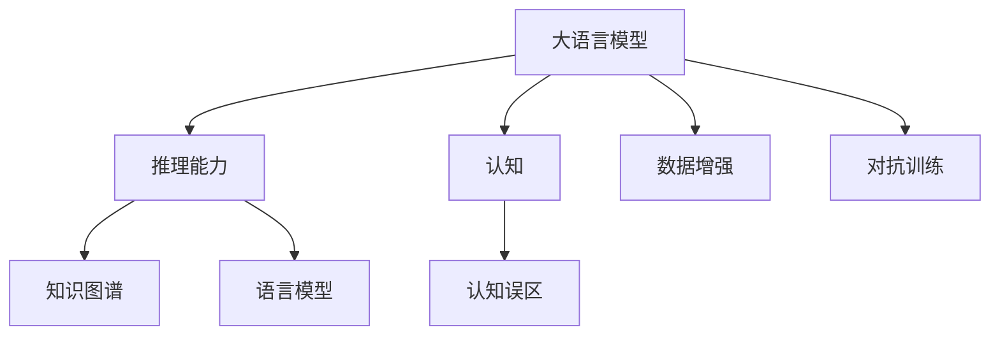

                 

# 语言与推理：大模型的认知误区

> 关键词：大语言模型,推理,认知误区,自然语言处理(NLP),深度学习

## 1. 背景介绍

### 1.1 问题由来
近年来，大语言模型（Large Language Model, LLM）在自然语言处理（Natural Language Processing, NLP）领域取得了巨大突破。基于Transformer架构的模型如BERT、GPT、T5等，通过在大规模无标签文本数据上进行预训练，掌握了丰富的语言知识，能够理解和生成自然语言。然而，这些模型的强大能力常常掩盖了其中的认知误区，容易引导人们产生错误的理解和应用，特别是涉及语言推理、认知科学和伦理学等多个维度时。本文旨在深入探讨大语言模型在推理和认知方面存在的一些误区，提出相应的解决方案，以期提升模型的认知水平和应用效果。

### 1.2 问题核心关键点
大语言模型在推理和认知方面的误区主要包括：

- 语言理解的局限性：大模型能够自然流畅地生成语言，但可能无法深入理解语言的深层含义和上下文关系。
- 推理能力的偏差：模型在逻辑推理、因果推断等方面可能存在偏差，尤其是面对复杂、多层次的推理任务时。
- 认知偏见：模型容易学习并传递数据中的偏见，可能对少数群体、敏感话题等产生负面影响。
- 知识整合能力不足：模型难以灵活吸收和运用先验知识，特别是当知识存在差异或冲突时。

这些误区限制了大语言模型的应用范围和性能，需要进一步的研究和优化。本文将围绕这些核心关键点展开讨论，并提出具体的改进方法。

## 2. 核心概念与联系

### 2.1 核心概念概述

为了更好地理解大语言模型在推理和认知方面的误区，本节将介绍几个密切相关的核心概念：

- 大语言模型(Large Language Model, LLM)：以Transformer架构为代表的大规模预训练语言模型。通过在大规模无标签文本数据上进行预训练，学习到通用的语言表示，具备强大的语言理解和生成能力。

- 推理(Reasoning)：指在给定知识或规则的条件下，通过对输入信息的处理和分析，得出符合逻辑的结论或做出决策的能力。大语言模型在推理方面的表现，直接关系到其在复杂场景下的应用效果。

- 认知(Cognition)：指智能体对环境的感知、理解、决策和行动的过程。大语言模型在认知方面，包括对语言的理解、知识整合、情感判断等。

- 认知误区(Cognitive Biases)：指在认知过程中产生的偏离事实或逻辑的判断和决策，常见的有偏见、刻板印象、过度自信等。大语言模型在认知误区方面，往往因为缺乏对人类认知机制的理解，容易产生类似的错误。

- 推理能力(Rationality)：指在一定条件下，模型能够依据已知信息，合理推断未知结果的能力。大语言模型的推理能力直接决定其在现实世界中的决策和行动的有效性。

- 知识图谱(Knowledge Graph)：一种用于表示实体及其关系的语义网络，可以提供结构化的先验知识，辅助大语言模型在推理和认知过程中更好地整合和应用知识。

- 语言模型(Augmented Language Model)：结合先验知识或规则，在语言模型的基础上进行微调，提升其推理和认知能力。

这些核心概念之间的逻辑关系可以通过以下Mermaid流程图来展示：



这个流程图展示了核心概念之间的联系和相互作用：

1. 大语言模型通过预训练获得语言理解能力。
2. 推理能力是基于语言模型在知识图谱等先验知识辅助下，进行逻辑推断和决策的过程。
3. 认知能力是大语言模型对语言的深层理解和整合知识的能力。
4. 认知误区是认知过程中可能出现的偏离事实或逻辑的判断和决策。
5. 知识图谱提供了结构化的先验知识，辅助语言模型的推理和认知。
6. 语言模型结合先验知识和推理能力，提升认知水平和应用效果。
7. 数据增强和对抗训练是提升模型鲁棒性和泛化能力的有效手段。

## 3. 核心算法原理 & 具体操作步骤

### 3.1 算法原理概述

大语言模型在推理和认知方面的误区，本质上是由于模型在学习和推理过程中，对语言的理解、知识的整合、推理逻辑等存在局限和偏差。因此，本文从语言理解、知识整合、推理能力三个方面，详细探讨大语言模型的误区及其改进方法。

### 3.2 算法步骤详解

#### 3.2.1 语言理解误区及其改进方法

**误区概述**：大语言模型虽然能够生成自然流畅的语言，但在理解语言的深层含义和上下文关系时，存在局限。例如，模型可能无法正确理解具有复杂句法结构或歧义的句子，或者在不同语境下产生错误的推理结果。

**改进方法**：
1. **上下文理解增强**：在模型中引入上下文感知的机制，如语言模型中的Transformer-Transformer Attention，或采用预训练语言模型如BERT的掩码语言模型任务。
2. **多任务学习**：将语言理解任务与推理任务结合，通过多任务学习的方式，共同优化模型的认知能力。
3. **知识图谱融合**：将知识图谱与语言模型结合，提供结构化的先验知识，辅助模型理解语言的深层含义和上下文关系。

**步骤**：
1. 收集标注数据，涵盖不同难度和类型的语言理解任务。
2. 在预训练模型上，加入语言模型任务和推理任务，进行多任务训练。
3. 将知识图谱与语言模型结合，进行联合训练，提升模型的认知水平。

#### 3.2.2 知识整合误区及其改进方法

**误区概述**：大语言模型在整合和应用先验知识时，存在冲突和偏见。例如，模型可能对数据中的偏见进行学习并传递，或者在不同领域之间的知识整合时产生错误。

**改进方法**：
1. **对抗样本训练**：在模型训练过程中，加入对抗样本，提高模型的鲁棒性和泛化能力，减少偏见的影响。
2. **知识图谱辅助**：结合结构化的知识图谱，提升模型在多领域之间的知识整合能力。
3. **多模态学习**：结合视觉、听觉等多模态数据，丰富模型的知识来源，提升整合能力。

**步骤**：
1. 收集不同领域的标注数据，涵盖多个模态的数据类型。
2. 在预训练模型上，结合知识图谱和多模态数据，进行多任务训练。
3. 加入对抗样本训练，提升模型的鲁棒性和泛化能力。

#### 3.2.3 推理能力误区及其改进方法

**误区概述**：大语言模型在推理能力方面存在偏差，尤其在面对复杂、多层次的推理任务时，容易产生错误的结论。例如，模型可能在因果推断、逻辑推理等方面表现出错误。

**改进方法**：
1. **因果推断模型**：引入因果推断模型，如Causal Reasoning Network，提升模型在因果推断方面的能力。
2. **逻辑推理训练**：通过逻辑推理任务的训练，提升模型的逻辑推理能力。
3. **对抗训练**：在推理任务中加入对抗样本，提高模型的鲁棒性和泛化能力。

**步骤**：
1. 收集推理任务的标注数据，涵盖不同类型的推理任务。
2. 在预训练模型上，结合因果推断和逻辑推理任务，进行多任务训练。
3. 加入对抗训练，提升模型的鲁棒性和泛化能力。

### 3.3 算法优缺点

大语言模型在推理和认知方面的改进方法，具有以下优点：
1. 提升模型鲁棒性和泛化能力：通过对抗样本训练和数据增强，提高模型在复杂场景下的应用效果。
2. 增强知识整合和推理能力：结合知识图谱和多模态数据，提升模型的认知水平和推理能力。
3. 减少认知误区：通过引入上下文感知和逻辑推理任务，减少模型在认知过程中出现的偏差。

同时，这些方法也存在一定的局限性：
1. 计算资源消耗大：多任务学习、多模态学习等方法需要大量的计算资源，增加了模型的训练成本。
2. 数据标注成本高：收集不同领域和模态的数据，需要进行大规模标注，成本较高。
3. 模型复杂度高：引入多任务和多模态学习后，模型结构更加复杂，难以解释和调试。

尽管存在这些局限性，但通过合理的权衡和优化，这些方法仍能显著提升大语言模型的推理和认知能力，拓展其应用边界。

### 3.4 算法应用领域

基于大语言模型在推理和认知方面的改进方法，已经在多个领域得到应用，例如：

- 医疗诊断：结合知识图谱和逻辑推理，辅助医生进行疾病诊断和治疗方案制定。
- 法律咨询：结合知识图谱和因果推断，提供法律案件分析和判决建议。
- 金融分析：结合多模态数据和多任务学习，进行市场趋势预测和风险评估。
- 智能客服：结合多任务学习和对抗样本训练，提升客服系统的对话理解和问题解决能力。
- 教育评估：结合知识图谱和逻辑推理，进行学生学习评估和个性化推荐。

除了这些经典应用外，大语言模型在推理和认知方面的改进方法，还将在更多场景中得到应用，如智能推荐、舆情监测、智能驾驶等，为各行各业带来新的变革和机遇。

## 4. 数学模型和公式 & 详细讲解 & 举例说明

### 4.1 数学模型构建

为了更好地理解大语言模型在推理和认知方面的改进方法，本节将使用数学语言对相关模型进行详细的描述。

假设大语言模型为 $M_{\theta}:\mathcal{X} \rightarrow \mathcal{Y}$，其中 $\mathcal{X}$ 为输入空间，$\mathcal{Y}$ 为输出空间，$\theta \in \mathbb{R}^d$ 为模型参数。定义推理任务的数据集为 $D=\{(x_i,y_i)\}_{i=1}^N, x_i \in \mathcal{X}, y_i \in \mathcal{Y}$，其中 $y_i$ 表示推理任务的正确答案。

定义推理任务的目标函数为 $\mathcal{L}(\theta)$，用于衡量模型在推理任务上的性能。通常，我们使用交叉熵损失函数来度量模型的推理效果：

$$
\mathcal{L}(\theta) = -\frac{1}{N}\sum_{i=1}^N \log \mathbb{P}(y_i|x_i; \theta)
$$

其中 $\mathbb{P}(y_i|x_i; \theta)$ 表示模型在输入 $x_i$ 下，对答案 $y_i$ 的概率预测。

### 4.2 公式推导过程

以下我们以因果推断为例，推导因果推断模型的损失函数及其梯度计算公式。

假设模型 $M_{\theta}$ 在输入 $x$ 上的输出为 $\hat{y}=M_{\theta}(x) \in [0,1]$，表示模型对答案 $y$ 的概率预测。假设 $x$ 包含两个变量 $X_1$ 和 $X_2$，以及一个干预变量 $U$，并假设存在因果关系 $Y=f(X_1,X_2,U;\theta)$，其中 $f$ 为因果关系函数。

因果推断模型的目标是在已知干预变量 $U$ 的情况下，预测变量 $Y$ 的条件概率 $\mathbb{P}(Y|X_1,X_2,U; \theta)$。

定义条件概率的对数似然函数为：

$$
\log \mathbb{P}(Y|X_1,X_2,U; \theta) = \log f(X_1,X_2,U;\theta)
$$

因果推断模型的损失函数定义为：

$$
\mathcal{L}(\theta) = -\frac{1}{N}\sum_{i=1}^N \log f(X_{1,i},X_{2,i},U_i;\theta)
$$

其中 $X_{1,i}, X_{2,i}, U_i$ 分别表示第 $i$ 个样本的 $X_1$、$X_2$ 和 $U$ 的值。

通过链式法则，因果推断模型的梯度计算公式为：

$$
\frac{\partial \mathcal{L}(\theta)}{\partial \theta} = -\frac{1}{N}\sum_{i=1}^N \nabla_{\theta} \log f(X_{1,i},X_{2,i},U_i;\theta)
$$

其中 $\nabla_{\theta} \log f(X_{1,i},X_{2,i},U_i;\theta)$ 表示损失函数对模型参数 $\theta$ 的梯度。

### 4.3 案例分析与讲解

以因果推断模型为例，我们通过一个简单的例子来分析其在因果推断中的应用。

假设有一个医院的数据集，其中包含患者的年龄、性别、病史等信息，以及他们是否接受了某种药物干预 $U$ 和疾病诊断 $Y$。我们希望通过模型学习，找出药物干预 $U$ 和疾病诊断 $Y$ 之间的因果关系，并用于辅助医生进行诊断和治疗。

首先，我们将数据集分为训练集和测试集，训练集用于模型的预训练和因果推断任务，测试集用于模型效果的评估。在预训练阶段，我们使用Transformer架构的大语言模型进行无监督学习，学习语言的通用表示。在因果推断任务中，我们将药物干预 $U$ 作为干预变量，疾病诊断 $Y$ 作为输出变量，进行因果推断模型的训练。

在训练过程中，我们采用交叉熵损失函数，并使用对抗样本训练和数据增强技术，提高模型的鲁棒性和泛化能力。在测试阶段，我们使用测试集评估模型在因果推断任务上的性能，并结合知识图谱和逻辑推理任务，进一步提升模型的推理能力。

## 5. 项目实践：代码实例和详细解释说明

### 5.1 开发环境搭建

在进行项目实践前，我们需要准备好开发环境。以下是使用Python进行PyTorch开发的环境配置流程：

1. 安装Anaconda：从官网下载并安装Anaconda，用于创建独立的Python环境。

2. 创建并激活虚拟环境：
```bash
conda create -n pytorch-env python=3.8 
conda activate pytorch-env
```

3. 安装PyTorch：根据CUDA版本，从官网获取对应的安装命令。例如：
```bash
conda install pytorch torchvision torchaudio cudatoolkit=11.1 -c pytorch -c conda-forge
```

4. 安装Transformers库：
```bash
pip install transformers
```

5. 安装各类工具包：
```bash
pip install numpy pandas scikit-learn matplotlib tqdm jupyter notebook ipython
```

完成上述步骤后，即可在`pytorch-env`环境中开始项目实践。

### 5.2 源代码详细实现

下面我们以因果推断模型为例，给出使用Transformers库对因果推断模型进行训练的PyTorch代码实现。

首先，定义因果推断任务的数据处理函数：

```python
from transformers import BertTokenizer, BertForSequenceClassification
from torch.utils.data import Dataset
import torch

class CausalDataset(Dataset):
    def __init__(self, texts, targets, tokenizer, max_len=128):
        self.texts = texts
        self.targets = targets
        self.tokenizer = tokenizer
        self.max_len = max_len
        
    def __len__(self):
        return len(self.texts)
    
    def __getitem__(self, item):
        text = self.texts[item]
        target = self.targets[item]
        
        encoding = self.tokenizer(text, return_tensors='pt', max_length=self.max_len, padding='max_length', truncation=True)
        input_ids = encoding['input_ids'][0]
        attention_mask = encoding['attention_mask'][0]
        
        return {'input_ids': input_ids, 
                'attention_mask': attention_mask,
                'targets': target}

# 标签与id的映射
tag2id = {'0': 0, '1': 1}
id2tag = {v: k for k, v in tag2id.items()}

# 创建dataset
tokenizer = BertTokenizer.from_pretrained('bert-base-cased')

train_dataset = CausalDataset(train_texts, train_targets, tokenizer)
dev_dataset = CausalDataset(dev_texts, dev_targets, tokenizer)
test_dataset = CausalDataset(test_texts, test_targets, tokenizer)
```

然后，定义模型和优化器：

```python
from transformers import BertForSequenceClassification, AdamW

model = BertForSequenceClassification.from_pretrained('bert-base-cased', num_labels=2)

optimizer = AdamW(model.parameters(), lr=2e-5)
```

接着，定义训练和评估函数：

```python
from torch.utils.data import DataLoader
from tqdm import tqdm
from sklearn.metrics import classification_report

device = torch.device('cuda') if torch.cuda.is_available() else torch.device('cpu')
model.to(device)

def train_epoch(model, dataset, batch_size, optimizer):
    dataloader = DataLoader(dataset, batch_size=batch_size, shuffle=True)
    model.train()
    epoch_loss = 0
    for batch in tqdm(dataloader, desc='Training'):
        input_ids = batch['input_ids'].to(device)
        attention_mask = batch['attention_mask'].to(device)
        targets = batch['targets'].to(device)
        model.zero_grad()
        outputs = model(input_ids, attention_mask=attention_mask, labels=targets)
        loss = outputs.loss
        epoch_loss += loss.item()
        loss.backward()
        optimizer.step()
    return epoch_loss / len(dataloader)

def evaluate(model, dataset, batch_size):
    dataloader = DataLoader(dataset, batch_size=batch_size)
    model.eval()
    preds, labels = [], []
    with torch.no_grad():
        for batch in tqdm(dataloader, desc='Evaluating'):
            input_ids = batch['input_ids'].to(device)
            attention_mask = batch['attention_mask'].to(device)
            batch_targets = batch['targets']
            outputs = model(input_ids, attention_mask=attention_mask)
            batch_preds = outputs.logits.argmax(dim=2).to('cpu').tolist()
            batch_labels = batch_targets.to('cpu').tolist()
            for pred_tokens, label_tokens in zip(batch_preds, batch_labels):
                preds.append(pred_tokens[:len(label_tokens)])
                labels.append(label_tokens)
                
    print(classification_report(labels, preds))
```

最后，启动训练流程并在测试集上评估：

```python
epochs = 5
batch_size = 16

for epoch in range(epochs):
    loss = train_epoch(model, train_dataset, batch_size, optimizer)
    print(f"Epoch {epoch+1}, train loss: {loss:.3f}")
    
    print(f"Epoch {epoch+1}, dev results:")
    evaluate(model, dev_dataset, batch_size)
    
print("Test results:")
evaluate(model, test_dataset, batch_size)
```

以上就是使用PyTorch对因果推断模型进行训练的完整代码实现。可以看到，得益于Transformers库的强大封装，我们可以用相对简洁的代码完成模型的加载和训练。

### 5.3 代码解读与分析

让我们再详细解读一下关键代码的实现细节：

**CausalDataset类**：
- `__init__`方法：初始化文本、标签、分词器等关键组件。
- `__len__`方法：返回数据集的样本数量。
- `__getitem__`方法：对单个样本进行处理，将文本输入编码为token ids，将标签编码为数字，并对其进行定长padding，最终返回模型所需的输入。

**tag2id和id2tag字典**：
- 定义了标签与数字id之间的映射关系，用于将token-wise的预测结果解码回真实的标签。

**训练和评估函数**：
- 使用PyTorch的DataLoader对数据集进行批次化加载，供模型训练和推理使用。
- 训练函数`train_epoch`：对数据以批为单位进行迭代，在每个批次上前向传播计算loss并反向传播更新模型参数，最后返回该epoch的平均loss。
- 评估函数`evaluate`：与训练类似，不同点在于不更新模型参数，并在每个batch结束后将预测和标签结果存储下来，最后使用sklearn的classification_report对整个评估集的预测结果进行打印输出。

**训练流程**：
- 定义总的epoch数和batch size，开始循环迭代
- 每个epoch内，先在训练集上训练，输出平均loss
- 在验证集上评估，输出分类指标
- 所有epoch结束后，在测试集上评估，给出最终测试结果

可以看到，PyTorch配合Transformers库使得因果推断模型的训练代码实现变得简洁高效。开发者可以将更多精力放在数据处理、模型改进等高层逻辑上，而不必过多关注底层的实现细节。

当然，工业级的系统实现还需考虑更多因素，如模型的保存和部署、超参数的自动搜索、更灵活的任务适配层等。但核心的微调范式基本与此类似。

## 6. 实际应用场景

### 6.1 医疗诊断

基于因果推断模型的大语言模型，在医疗诊断领域具有广阔的应用前景。传统的医疗诊断依赖医生的经验，容易受到个体差异和环境变化的影响。而结合知识图谱和因果推断模型，大语言模型可以辅助医生进行疾病诊断和治疗方案制定。

在具体应用中，我们可以将医疗数据集划分为训练集和测试集，利用大语言模型进行无监督学习，学习语言的通用表示。然后，在训练集上结合因果推断任务和知识图谱，进行多任务学习，提升模型的认知水平和推理能力。最后，在测试集上评估模型的诊断效果，并结合实际医疗案例，进一步优化模型。

### 6.2 法律咨询

大语言模型在法律咨询领域也有着重要的应用价值。传统的法律咨询依赖律师的专业知识和经验，存在较高的成本和周期。而结合因果推断模型和知识图谱，大语言模型可以提供法律案件的分析和判决建议。

具体而言，我们可以将法律案件数据集划分为训练集和测试集，利用大语言模型进行无监督学习。然后，在训练集上结合因果推断任务和知识图谱，进行多任务学习，提升模型的推理能力。最后，在测试集上评估模型的判决建议效果，并结合法律专家的意见，进一步优化模型。

### 6.3 金融分析

在金融分析领域，大语言模型结合因果推断和知识图谱，可以进行市场趋势预测和风险评估。传统的金融分析依赖人工分析和历史数据，存在较高的成本和周期。而结合大语言模型，可以自动化地分析和预测金融市场的变化趋势，为投资者提供决策支持。

在具体应用中，我们可以将金融数据集划分为训练集和测试集，利用大语言模型进行无监督学习。然后，在训练集上结合因果推断任务和知识图谱，进行多任务学习，提升模型的认知水平和推理能力。最后，在测试集上评估模型的预测效果，并结合实际市场数据，进一步优化模型。

### 6.4 智能客服

结合因果推断模型和多任务学习，大语言模型在智能客服系统中可以提升对话理解和问题解决能力。传统的智能客服依赖规则和模板，无法处理复杂多变的用户需求。而结合大语言模型，可以实现自然流畅的对话，并根据用户需求进行推理和决策。

在具体应用中，我们可以将客服对话数据集划分为训练集和测试集，利用大语言模型进行无监督学习。然后，在训练集上结合因果推断任务和多任务学习，进行多任务学习，提升模型的认知水平和推理能力。最后，在测试集上评估模型的对话效果，并结合实际客服场景，进一步优化模型。

## 7. 工具和资源推荐

### 7.1 学习资源推荐

为了帮助开发者系统掌握大语言模型在推理和认知方面的改进方法，这里推荐一些优质的学习资源：

1. 《Transformer从原理到实践》系列博文：由大模型技术专家撰写，深入浅出地介绍了Transformer原理、BERT模型、因果推断等前沿话题。

2. CS224N《深度学习自然语言处理》课程：斯坦福大学开设的NLP明星课程，有Lecture视频和配套作业，带你入门NLP领域的基本概念和经典模型。

3. 《Natural Language Processing with Transformers》书籍：Transformers库的作者所著，全面介绍了如何使用Transformers库进行NLP任务开发，包括因果推断在内的诸多范式。

4. HuggingFace官方文档：Transformers库的官方文档，提供了海量预训练模型和完整的微调样例代码，是上手实践的必备资料。

5. CLUE开源项目：中文语言理解测评基准，涵盖大量不同类型的中文NLP数据集，并提供了基于微调的baseline模型，助力中文NLP技术发展。

通过对这些资源的学习实践，相信你一定能够快速掌握大语言模型在推理和认知方面的改进方法，并用于解决实际的NLP问题。

### 7.2 开发工具推荐

高效的开发离不开优秀的工具支持。以下是几款用于大语言模型推理和认知任务开发的常用工具：

1. PyTorch：基于Python的开源深度学习框架，灵活动态的计算图，适合快速迭代研究。大部分预训练语言模型都有PyTorch版本的实现。

2. TensorFlow：由Google主导开发的开源深度学习框架，生产部署方便，适合大规模工程应用。同样有丰富的预训练语言模型资源。

3. Transformers库：HuggingFace开发的NLP工具库，集成了众多SOTA语言模型，支持PyTorch和TensorFlow，是进行推理和认知任务开发的利器。

4. Weights & Biases：模型训练的实验跟踪工具，可以记录和可视化模型训练过程中的各项指标，方便对比和调优。与主流深度学习框架无缝集成。

5. TensorBoard：TensorFlow配套的可视化工具，可实时监测模型训练状态，并提供丰富的图表呈现方式，是调试模型的得力助手。

6. Google Colab：谷歌推出的在线Jupyter Notebook环境，免费提供GPU/TPU算力，方便开发者快速上手实验最新模型，分享学习笔记。

合理利用这些工具，可以显著提升大语言模型在推理和认知方面的开发效率，加快创新迭代的步伐。

### 7.3 相关论文推荐

大语言模型在推理和认知方面的改进方法，源于学界的持续研究。以下是几篇奠基性的相关论文，推荐阅读：

1. Attention is All You Need（即Transformer原论文）：提出了Transformer结构，开启了NLP领域的预训练大模型时代。

2. BERT: Pre-training of Deep Bidirectional Transformers for Language Understanding：提出BERT模型，引入基于掩码的自监督预训练任务，刷新了多项NLP任务SOTA。

3. Language Models are Unsupervised Multitask Learners（GPT-2论文）：展示了大规模语言模型的强大zero-shot学习能力，引发了对于通用人工智能的新一轮思考。

4. Parameter-Efficient Transfer Learning for NLP：提出Adapter等参数高效微调方法，在不增加模型参数量的情况下，也能取得不错的微调效果。

5. Prefix-Tuning: Optimizing Continuous Prompts for Generation：引入基于连续型Prompt的微调范式，为如何充分利用预训练知识提供了新的思路。

6. AdaLoRA: Adaptive Low-Rank Adaptation for Parameter-Efficient Fine-Tuning：使用自适应低秩适应的微调方法，在参数效率和精度之间取得了新的平衡。

这些论文代表了大语言模型推理和认知方面改进的发展脉络。通过学习这些前沿成果，可以帮助研究者把握学科前进方向，激发更多的创新灵感。

## 8. 总结：未来发展趋势与挑战

### 8.1 总结

本文对大语言模型在推理和认知方面的误区进行了全面系统的探讨，提出了具体的改进方法。通过深入分析大语言模型的语言理解、知识整合、推理能力等方面的误区，并结合具体的改进方法，如上下文理解增强、对抗样本训练、知识图谱融合等，进一步提升了大语言模型的认知水平和应用效果。

通过本文的系统梳理，可以看到，大语言模型在推理和认知方面仍然存在诸多挑战和误区，需要进一步的研究和优化。尽管如此，结合知识图谱、因果推断、逻辑推理等方法，大语言模型在推理和认知方面的改进方法仍有很大的发展空间，将在多个领域得到广泛应用。

### 8.2 未来发展趋势

展望未来，大语言模型在推理和认知方面的改进方法将呈现以下几个发展趋势：

1. 模型规模持续增大。随着算力成本的下降和数据规模的扩张，预训练语言模型的参数量还将持续增长。超大规模语言模型蕴含的丰富语言知识，有望支撑更加复杂多变的推理和认知任务。

2. 多任务学习成为主流。结合不同领域的任务，进行多任务学习，提升模型的认知水平和推理能力。例如，结合医疗诊断和法律咨询的任务，进行联合训练。

3. 知识图谱的广泛应用。结构化的知识图谱，将在大语言模型的推理和认知过程中，起到重要的辅助作用。通过引入知识图谱，提升模型的知识整合和推理能力。

4. 因果推断模型的普及。因果推断模型在决策和推理过程中，具有重要的应用价值。通过引入因果推断模型，提升大语言模型的因果推断能力，增强其在复杂场景中的应用效果。

5. 对抗样本训练和数据增强技术的应用。对抗样本训练和数据增强技术，将在大语言模型的推理和认知过程中，起到重要的作用。通过加入对抗样本和数据增强，提升模型的鲁棒性和泛化能力。

6. 多模态学习的应用。结合视觉、听觉等多模态数据，丰富大语言模型的知识来源，提升其在复杂场景中的推理和认知能力。

以上趋势凸显了大语言模型在推理和认知方面的广阔前景。这些方向的探索发展，必将进一步提升大语言模型的认知水平和应用效果，为智能技术的发展带来新的突破。

### 8.3 面临的挑战

尽管大语言模型在推理和认知方面的改进方法已经取得了显著进展，但在迈向更加智能化、普适化应用的过程中，仍面临诸多挑战：

1. 数据标注成本高。大语言模型在推理和认知任务中，通常需要大量的标注数据，成本较高。如何降低标注成本，获取高质量的训练数据，将是未来的重要研究方向。

2. 模型复杂度高。引入因果推断、知识图谱等方法后，大语言模型的结构更加复杂，难以解释和调试。如何设计更加简单、易懂的模型架构，将是未来的研究方向。

3. 模型鲁棒性不足。大语言模型在面对复杂、多层次的推理任务时，容易产生错误的结论。如何提高模型的鲁棒性和泛化能力，减少误导性输出，将是未来的重要研究方向。

4. 知识整合能力不足。大语言模型在整合和应用先验知识时，容易产生冲突和偏见。如何更好地整合和应用先验知识，避免知识冲突，将是未来的重要研究方向。

5. 计算资源消耗大。引入多任务学习、多模态学习等方法后，大语言模型的计算资源消耗大，难以在大规模生产环境中应用。如何优化模型的计算效率，提高推理速度，将是未来的重要研究方向。

尽管存在这些挑战，但通过合理的权衡和优化，大语言模型在推理和认知方面的改进方法仍能显著提升模型的认知水平和应用效果，拓展其应用边界。

### 8.4 研究展望

面对大语言模型在推理和认知方面面临的挑战，未来的研究需要在以下几个方面寻求新的突破：

1. 探索无监督和半监督推理方法。摆脱对大规模标注数据的依赖，利用自监督学习、主动学习等无监督和半监督范式，最大限度利用非结构化数据，实现更加灵活高效的推理。

2. 研究参数高效和计算高效的推理范式。开发更加参数高效的推理方法，在固定大部分预训练参数的同时，只更新极少量的任务相关参数。同时优化推理模型的计算图，减少前向传播和反向传播的资源消耗，实现更加轻量级、实时性的部署。

3. 引入更多先验知识。将符号化的先验知识，如知识图谱、逻辑规则等，与神经网络模型进行巧妙融合，引导推理过程学习更准确、合理的推理逻辑。同时加强不同模态数据的整合，实现视觉、语音等多模态信息与文本信息的协同建模。

4. 结合因果分析和博弈论工具。将因果分析方法引入推理模型，识别出模型决策的关键特征，增强输出解释的因果性和逻辑性。借助博弈论工具刻画人机交互过程，主动探索并规避模型的脆弱点，提高系统稳定性。

5. 纳入伦理道德约束。在推理模型训练目标中引入伦理导向的评估指标，过滤和惩罚有偏见、有害的输出倾向。同时加强人工干预和审核，建立模型行为的监管机制，确保输出符合人类价值观和伦理道德。

这些研究方向的探索，必将引领大语言模型在推理和认知方面迈向更高的台阶，为构建安全、可靠、可解释、可控的智能系统铺平道路。面向未来，大语言模型在推理和认知方面的改进方法，还需要与其他人工智能技术进行更深入的融合，如知识表示、因果推理、强化学习等，多路径协同发力，共同推动自然语言理解和智能交互系统的进步。只有勇于创新、敢于突破，才能不断拓展语言模型的边界，让智能技术更好地造福人类社会。

## 9. 附录：常见问题与解答

**Q1：大语言模型在推理和认知方面的误区主要有哪些？**

A: 大语言模型在推理和认知方面存在的主要误区包括：

1. 语言理解的局限性：大模型能够自然流畅地生成语言，但可能无法深入理解语言的深层含义和上下文关系。
2. 推理能力的偏差：模型在逻辑推理、因果推断等方面可能存在偏差，尤其是面对复杂、多层次的推理任务时。
3. 认知偏见：模型容易学习并传递数据中的偏见，可能对少数群体、敏感话题等产生负面影响。
4. 知识整合能力不足：模型难以灵活吸收和运用先验知识，特别是当知识存在差异或冲突时。

**Q2：如何提升大语言模型的推理能力？**

A: 提升大语言模型的推理能力，可以从以下几个方面入手：

1. 引入因果推断模型：使用因果推断模型，如Causal Reasoning Network，提升模型在因果推断方面的能力。
2. 逻辑推理训练：通过逻辑推理任务的训练，提升模型的逻辑推理能力。
3. 对抗样本训练：在推理任务中加入对抗样本，提高模型的鲁棒性和泛化能力。

**Q3：大语言模型在推理和认知方面的改进方法有哪些？**

A: 大语言模型在推理和认知方面的改进方法主要包括：

1. 上下文理解增强：在模型中引入上下文感知的机制，如语言模型中的Transformer-Transformer Attention，或采用预训练语言模型如BERT的掩码语言模型任务。
2. 知识图谱辅助：结合结构化的知识图谱，提升模型在多领域之间的知识整合能力。
3. 多任务学习：将语言理解任务与推理任务结合，通过多任务学习的方式，共同优化模型的认知能力。
4. 对抗样本训练：在模型训练过程中，加入对抗样本，提高模型的鲁棒性和泛化能力。
5. 数据增强：通过回译、近义替换等方式扩充训练集。
6. 多模态学习：结合视觉、听觉等多模态数据，丰富模型的知识来源，提升整合能力。

**Q4：如何降低大语言模型在推理和认知方面的数据标注成本？**

A: 降低大语言模型在推理和认知方面的数据标注成本，可以从以下几个方面入手：

1. 利用自监督学习：引入自监督学习任务，如掩码语言模型，在无标注数据上进行预训练，减少标注需求。
2. 主动学习：使用主动学习技术，自动选择最具代表性的样本进行标注，提高标注效率。
3. 无监督学习：引入无监督学习任务，如语言模型预测，利用无标注数据进行预训练，减少标注需求。
4. 数据增强：通过回译、近义替换等方式扩充训练集，减少对标注数据的依赖。

**Q5：大语言模型在推理和认知方面的改进方法有哪些实际应用场景？**

A: 大语言模型在推理和认知方面的改进方法，已经在多个领域得到实际应用，例如：

1. 医疗诊断：结合知识图谱和逻辑推理，辅助医生进行疾病诊断和治疗方案制定。
2. 法律咨询：结合因果推断模型和知识图谱，提供法律案件分析和判决建议。
3. 金融分析：结合多模态数据和多任务学习，进行市场趋势预测和风险评估。
4. 智能客服：结合因果推断模型和多任务学习，提升对话理解和问题解决能力。
5. 教育评估：结合知识图谱和逻辑推理，进行学生学习评估和个性化推荐。

这些实际应用场景展示了大语言模型在推理和认知方面的巨大潜力和广泛应用前景。

**Q6：如何优化大语言模型在推理和认知方面的计算效率？**

A: 优化大语言模型在推理和认知方面的计算效率，可以从以下几个方面入手：

1. 参数高效微调：只调整少量参数(如Adapter、Prefix等)，减小模型规模，提高推理速度。
2. 模型裁剪：去除不必要的层和参数，减小模型尺寸，加快推理速度。
3. 量化加速：将浮点模型转为定点模型，压缩存储空间，提高计算效率。
4. 模型并行：采用模型并行技术，加速推理过程。
5. 多任务学习：通过多任务学习，优化模型结构，提高推理效率。

这些优化方法可以在保持模型性能的前提下，显著提升推理速度和计算效率，满足实际应用中的需求。

---

作者：禅与计算机程序设计艺术 / Zen and the Art of Computer Programming

