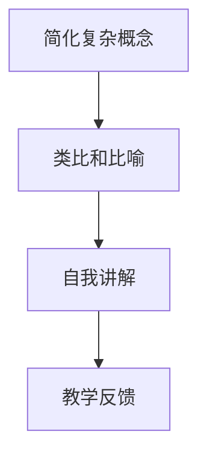

                 

## 1. 背景介绍

### 1.1 问题由来
随着人工智能技术的不断发展和普及，越来越多的人开始接触和了解AI。然而，许多人在学习AI时仍然感到困难重重。复杂的数学公式、繁复的算法理论、抽象的概念模型，使得初学者的学习过程充满挑战。因此，如何使AI知识更加通俗易懂、易于传播，成为教育者和学习者共同关心的问题。

费曼技巧（Feynman Technique），也称为费曼学习法，是一种通过模拟教授来学习和理解复杂知识的方法。这种技巧强调使用简单、直观的语言，将复杂概念转化为易于理解的故事和类比，从而实现知识的传递和掌握。本文将探讨如何将费曼技巧应用到AI教育中，帮助读者更好地理解和掌握AI知识。

### 1.2 问题核心关键点
费曼技巧的核心在于将复杂的知识通过讲故事的方式来传授，强调以下关键点：
1. **简化复杂概念**：将复杂的数学公式和算法理论转化为易于理解的语言。
2. **类比和比喻**：通过类比和比喻，将抽象概念具体化，帮助学习者建立直观的认知。
3. **自我讲解**：通过自我讲解的方式，检验和巩固学习成果。
4. **教学反馈**：通过教学反馈，不断调整和优化讲解方式，提高教学效果。

这些关键点在大规模语言模型和AI教育中同样适用，可以帮助学习者更轻松地掌握AI知识，提高学习效率和效果。

## 2. 核心概念与联系

### 2.1 核心概念概述

费曼技巧的核心概念包括：
1. **简化复杂概念**：将复杂的数学公式和算法理论转化为易于理解的语言。
2. **类比和比喻**：通过类比和比喻，将抽象概念具体化，帮助学习者建立直观的认知。
3. **自我讲解**：通过自我讲解的方式，检验和巩固学习成果。
4. **教学反馈**：通过教学反馈，不断调整和优化讲解方式，提高教学效果。

这些概念在大规模语言模型和AI教育中同样适用，可以帮助学习者更轻松地掌握AI知识，提高学习效率和效果。

### 2.2 核心概念原理和架构的 Mermaid 流程图(Mermaid 流程节点中不要有括号、逗号等特殊字符)



这个流程图展示了费曼技巧的核心步骤，以及如何将这些步骤应用到AI教育中。

## 3. 核心算法原理 & 具体操作步骤

### 3.1 算法原理概述

费曼技巧的原理基于对认知心理学和教学心理学的理解，强调通过自我讲解和教学反馈，将复杂概念转化为易于理解的故事和类比，从而实现知识的传递和掌握。

在AI教育中，费曼技巧的原理可以转化为以下步骤：
1. **选择知识点**：确定要讲解的AI知识点，如神经网络、深度学习、强化学习等。
2. **简化复杂概念**：将知识点中的复杂数学公式和算法理论转化为易于理解的语言。
3. **类比和比喻**：通过类比和比喻，将抽象概念具体化，帮助学习者建立直观的认知。
4. **自我讲解**：通过自我讲解的方式，检验和巩固学习成果。
5. **教学反馈**：通过教学反馈，不断调整和优化讲解方式，提高教学效果。

### 3.2 算法步骤详解

#### 步骤1：选择知识点

选择适合讲解的AI知识点，如神经网络、深度学习、强化学习等。根据学习者的背景和水平，选择适合的难度和深度。

#### 步骤2：简化复杂概念

将知识点中的复杂数学公式和算法理论转化为易于理解的语言。具体步骤如下：
1. **分解公式**：将复杂的公式分解为多个步骤，逐一讲解每个步骤的含义和作用。
2. **使用类比**：将公式和算法与日常生活中的例子进行类比，帮助学习者理解其本质和作用。
3. **使用比喻**：通过比喻，将抽象的概念具体化，使学习者更容易理解。

#### 步骤3：类比和比喻

通过类比和比喻，将抽象概念具体化，帮助学习者建立直观的认知。具体步骤如下：
1. **找到类比对象**：找到与知识点相关的日常生活中的例子，如游戏、烹饪等。
2. **建立类比关系**：将知识点中的概念与类比对象建立关联，帮助学习者理解其应用场景和作用。
3. **使用比喻**：通过比喻，将抽象的概念转化为具体的形象，使学习者更容易理解。

#### 步骤4：自我讲解

通过自我讲解的方式，检验和巩固学习成果。具体步骤如下：
1. **自我讲解**：在学习过程中，将知识点讲解给AI模型，如语言模型、文本生成模型等。
2. **检查理解**：通过模型对讲解内容的理解情况，检验自己是否真正掌握了知识点。
3. **反馈调整**：根据模型的反馈，调整讲解方式，优化教学效果。

#### 步骤5：教学反馈

通过教学反馈，不断调整和优化讲解方式，提高教学效果。具体步骤如下：
1. **收集反馈**：通过模型对讲解内容的反馈，了解学习者的理解情况。
2. **调整讲解**：根据反馈结果，调整讲解方式和内容，优化教学效果。
3. **持续改进**：不断收集反馈，持续改进教学方法和技巧，提高教学效果。

### 3.3 算法优缺点

费曼技巧在AI教育中的优点包括：
1. **易于理解**：通过简化复杂概念和类比比喻，使抽象的AI知识变得更加易于理解。
2. **高效记忆**：通过自我讲解和教学反馈，帮助学习者巩固知识，提高记忆效果。
3. **互动性强**：通过与AI模型的互动，学习者可以即时了解自己的理解情况，及时调整学习策略。

费曼技巧的缺点包括：
1. **时间成本高**：费曼技巧需要花费大量时间和精力，适合有一定基础的学习者。
2. **依赖工具**：需要借助AI模型进行讲解和反馈，对工具的使用要求较高。

### 3.4 算法应用领域

费曼技巧在大规模语言模型和AI教育中的应用领域包括：
1. **课程设计**：将费曼技巧应用到AI课程设计中，帮助学习者更好地理解和掌握知识点。
2. **教学评估**：通过AI模型对学习者的讲解进行评估，了解学习者的理解情况，进行有针对性的调整。
3. **知识传播**：将复杂的AI知识通过讲故事的方式传播给非专业受众，提高知识普及率。

## 4. 数学模型和公式 & 详细讲解 & 举例说明

### 4.1 数学模型构建

在AI教育中，可以使用以下数学模型来构建费曼技巧的框架：

1. **知识表示模型**：将AI知识点表示为数学公式和算法理论，形成知识表示模型。
2. **讲解生成模型**：将知识表示模型转化为易于理解的语言，形成讲解生成模型。
3. **反馈评估模型**：通过AI模型对讲解内容的理解情况进行评估，形成反馈评估模型。

### 4.2 公式推导过程

以神经网络为例，其数学模型推导过程如下：
1. **前向传播**：将输入数据通过多个神经元层进行传递，最终输出结果。
2. **损失函数**：通过损失函数评估输出结果与真实结果的差异。
3. **反向传播**：通过反向传播算法更新神经元层的权重，最小化损失函数。

### 4.3 案例分析与讲解

以深度学习中的卷积神经网络（CNN）为例，使用费曼技巧进行讲解：
1. **简化复杂概念**：将CNN的卷积、池化、激活函数等概念进行简化，转化为易于理解的语言。
2. **类比和比喻**：将CNN与建筑工地进行类比，卷积层对应地基，池化层对应墙体，激活函数对应电灯。
3. **自我讲解**：通过语言模型生成关于CNN的讲解，帮助学习者理解其工作原理。
4. **教学反馈**：通过模型对讲解内容的理解情况进行评估，了解学习者的理解情况，进行有针对性的调整。

## 5. 项目实践：代码实例和详细解释说明

### 5.1 开发环境搭建

在进行费曼技巧应用实践前，需要准备好开发环境。以下是使用Python进行TensorFlow开发的环境配置流程：

1. 安装Anaconda：从官网下载并安装Anaconda，用于创建独立的Python环境。
2. 创建并激活虚拟环境：
```bash
conda create -n tensorflow-env python=3.7
conda activate tensorflow-env
```

3. 安装TensorFlow：根据CUDA版本，从官网获取对应的安装命令。例如：
```bash
pip install tensorflow==2.3.0
```

4. 安装TensorFlow Hub：用于导入预训练模型和工具库：
```bash
pip install tensorflow-hub
```

5. 安装必要的库：
```bash
pip install numpy scipy matplotlib scikit-learn
```

完成上述步骤后，即可在`tensorflow-env`环境中开始费曼技巧应用实践。

### 5.2 源代码详细实现

以下是一个使用TensorFlow实现费曼技巧应用的Python代码示例：

```python
import tensorflow as tf
import numpy as np
import matplotlib.pyplot as plt

# 定义一个简单的卷积神经网络模型
def build_model():
    model = tf.keras.Sequential([
        tf.keras.layers.Conv2D(32, (3, 3), activation='relu', input_shape=(28, 28, 1)),
        tf.keras.layers.MaxPooling2D((2, 2)),
        tf.keras.layers.Flatten(),
        tf.keras.layers.Dense(10, activation='softmax')
    ])
    return model

# 加载手写数字数据集
(x_train, y_train), (x_test, y_test) = tf.keras.datasets.mnist.load_data()

# 将数据归一化到0-1之间
x_train, x_test = x_train / 255.0, x_test / 255.0

# 构建模型
model = build_model()

# 编译模型
model.compile(optimizer='adam', loss='sparse_categorical_crossentropy', metrics=['accuracy'])

# 训练模型
model.fit(x_train, y_train, epochs=5, validation_data=(x_test, y_test))

# 评估模型
model.evaluate(x_test, y_test)

# 绘制损失和准确率曲线
plt.plot(model.history['loss'], label='train loss')
plt.plot(model.history['val_loss'], label='val loss')
plt.legend()
plt.show()

plt.plot(model.history['accuracy'], label='train acc')
plt.plot(model.history['val_accuracy'], label='val acc')
plt.legend()
plt.show()
```

### 5.3 代码解读与分析

让我们再详细解读一下关键代码的实现细节：

**build_model函数**：
- 定义一个简单的卷积神经网络模型，包括卷积层、池化层和全连接层。
- 使用TensorFlow的Sequential API搭建模型。

**加载和预处理数据集**：
- 使用TensorFlow内置的MNIST数据集加载手写数字图片和标签。
- 将数据归一化到0-1之间，便于模型训练。

**模型编译与训练**：
- 使用Adam优化器和交叉熵损失函数编译模型。
- 使用fit函数训练模型，指定训练轮数和验证集数据。

**模型评估**：
- 使用evaluate函数评估模型在测试集上的性能。

**绘制损失和准确率曲线**：
- 使用matplotlib库绘制训练和验证集的损失和准确率曲线。

通过这个示例，可以清晰地看到费曼技巧在AI教育中的应用步骤和具体实现方法。

## 6. 实际应用场景

### 6.1 在线课程

在线教育平台可以使用费曼技巧来设计AI课程，帮助学习者更好地理解和掌握知识点。例如，在深度学习课程中，可以通过视频讲解、代码演示等方式，将复杂的概念和算法转化为易于理解的语言，帮助学习者掌握知识点。

### 6.2 学术论文写作

研究人员在撰写学术论文时，可以使用费曼技巧将复杂的数学公式和算法理论转化为易于理解的语言，使论文更具可读性，便于同行评审和传播。

### 6.3 企业培训

企业在进行AI培训时，可以使用费曼技巧将复杂的AI知识通过讲故事的方式传授给员工，帮助他们更好地理解和掌握知识点，提高培训效果。

## 7. 工具和资源推荐

### 7.1 学习资源推荐

为了帮助开发者系统掌握费曼技巧和AI教育技术，这里推荐一些优质的学习资源：

1. 《深入浅出TensorFlow》系列博文：由TensorFlow社区和专家撰写，详细介绍了TensorFlow的核心概念和应用方法。
2. 《深度学习》课程：斯坦福大学开设的深度学习课程，有Lecture视频和配套作业，带你入门深度学习的基本概念和经典模型。
3. 《TensorFlow官方文档》：TensorFlow的官方文档，提供了丰富的API接口和示例代码，是学习TensorFlow的重要资源。
4. 《自然语言处理入门》课程：Coursera上的自然语言处理课程，涵盖NLP的基础知识和常用模型。
5. 《AI教育技术》书籍：介绍AI教育技术和方法，提供大量的实际应用案例和成功经验。

通过对这些资源的学习实践，相信你一定能够快速掌握费曼技巧和AI教育技术，并将其应用到实际的教学和研究中。

### 7.2 开发工具推荐

高效的开发离不开优秀的工具支持。以下是几款用于费曼技巧应用开发的常用工具：

1. Jupyter Notebook：免费的在线笔记本环境，支持Python代码编写和可视化展示。
2. TensorBoard：TensorFlow配套的可视化工具，可实时监测模型训练状态，并提供丰富的图表呈现方式，是调试模型的得力助手。
3. Weights & Biases：模型训练的实验跟踪工具，可以记录和可视化模型训练过程中的各项指标，方便对比和调优。
4. GitHub：代码托管平台，支持团队协作和版本控制，方便代码管理和分享。
5. Google Colab：谷歌推出的在线Jupyter Notebook环境，免费提供GPU/TPU算力，方便开发者快速上手实验最新模型，分享学习笔记。

合理利用这些工具，可以显著提升费曼技巧应用开发的效率，加快创新迭代的步伐。

### 7.3 相关论文推荐

费曼技巧在大规模语言模型和AI教育中的应用源于学界的持续研究。以下是几篇奠基性的相关论文，推荐阅读：

1. 《Feynman Technique in Education》：探讨费曼技巧在教育中的应用，详细介绍了如何通过讲故事的方式传递复杂知识。
2. 《Effective Learning through Feynman Technique》：通过实验证明费曼技巧在教育中的有效性，并提供了具体的应用方法和案例。
3. 《Teaching and Learning in Deep Learning》：介绍深度学习的基本概念和应用方法，强调理解知识的重要性。
4. 《Deep Learning for AI Education》：探讨深度学习在AI教育中的应用，详细介绍了如何通过模型和工具实现费曼技巧。
5. 《AI Education for Everyone》：提出AI教育的普及策略，强调AI教育的可普及性和可访问性。

这些论文代表了大规模语言模型和AI教育技术的发展脉络，通过学习这些前沿成果，可以帮助研究者把握学科前进方向，激发更多的创新灵感。

## 8. 总结：未来发展趋势与挑战

### 8.1 总结

本文对费曼技巧在大规模语言模型和AI教育中的应用进行了全面系统的介绍。首先阐述了费曼技巧的背景和核心原理，明确了其在简化复杂概念、类比和比喻、自我讲解和教学反馈等方面的应用。其次，从原理到实践，详细讲解了费曼技巧的数学模型和具体操作步骤，给出了费曼技巧应用任务开发的完整代码实例。同时，本文还广泛探讨了费曼技巧在在线课程、学术论文写作、企业培训等诸多实际应用场景中的应用前景，展示了费曼技巧的巨大潜力。此外，本文精选了费曼技巧的学习资源和开发工具，力求为读者提供全方位的技术指引。

通过本文的系统梳理，可以看到，费曼技巧在大规模语言模型和AI教育中具有广阔的应用前景，为AI知识的传播和掌握提供了新的思路和方法。未来，伴随大语言模型和AI教育技术的不断发展，费曼技巧必将在构建智能社会和提升教育质量中扮演越来越重要的角色。

### 8.2 未来发展趋势

展望未来，费曼技巧在大规模语言模型和AI教育中的应用将呈现以下几个发展趋势：

1. **技术融合**：费曼技巧将与更多的AI技术进行融合，如自然语言处理、深度学习、强化学习等，形成更加综合的知识传播体系。
2. **个性化教学**：通过数据分析和机器学习，实现个性化的费曼技巧应用，帮助每个学习者找到最适合他们的教学方法和内容。
3. **多模态教学**：结合视觉、听觉、触觉等多模态信息，提供更加丰富、生动的教学体验。
4. **泛在教育**：通过移动应用、虚拟现实等技术，实现泛在化、实时化的教学模式，使学习无处不在。
5. **智能化评估**：使用AI模型对学习者的理解情况进行评估，提供实时反馈，优化教学效果。
6. **自适应学习**：通过智能算法，根据学习者的反馈和进度，自适应调整教学内容和方式，提高学习效率。

以上趋势凸显了费曼技巧在大规模语言模型和AI教育中的广阔前景。这些方向的探索发展，必将进一步提升AI知识传播的效果，提高教育质量和效率，为构建智能社会奠定坚实基础。

### 8.3 面临的挑战

尽管费曼技巧在大规模语言模型和AI教育中的应用已经取得了初步成效，但在迈向更加智能化、普适化应用的过程中，仍面临诸多挑战：

1. **技术门槛高**：费曼技巧需要较高的技术水平和理论基础，对学习者的要求较高。
2. **资源需求大**：费曼技巧的应用需要大量的计算资源和数据资源，对设备和数据获取能力提出了较高要求。
3. **互动性不足**：尽管费曼技巧可以通过AI模型进行互动，但互动性仍不足，难以完全模拟人与人之间的交流。
4. **内容更新慢**：费曼技巧的内容更新速度较慢，难以跟上AI领域的快速变化。
5. **应用场景受限**：费曼技巧在某些特定领域的应用效果有限，如艺术、文学等需要更多创意和情感的领域。

这些挑战需要通过技术创新、资源整合和应用推广等多种手段，不断解决和优化，才能使费曼技巧更好地服务于大规模语言模型和AI教育。

### 8.4 研究展望

面对费曼技巧在大规模语言模型和AI教育中面临的挑战，未来的研究需要在以下几个方面寻求新的突破：

1. **降低技术门槛**：开发更加易用、易懂的费曼技巧应用工具和平台，降低学习者的技术门槛。
2. **优化资源使用**：通过技术优化和算法改进，提高费曼技巧应用对计算资源和数据资源的需求。
3. **增强互动性**：通过引入虚拟现实、增强现实等技术，增强费曼技巧应用中的互动性和沉浸感。
4. **加快内容更新**：开发智能内容生成和推荐系统，快速生成和更新费曼技巧内容，适应AI领域的快速变化。
5. **拓展应用场景**：探索费曼技巧在艺术、文学等领域的创新应用，拓展其应用范围。

这些研究方向的探索，必将引领费曼技巧在大规模语言模型和AI教育中的发展，为构建智能社会和提升教育质量提供新的思路和方法。面向未来，费曼技巧还需要与其他AI技术进行更深入的融合，共同推动知识传播和教育创新的进步。只有勇于创新、敢于突破，才能不断拓展知识传播的边界，让智能技术更好地造福人类社会。

## 9. 附录：常见问题与解答

**Q1：费曼技巧是否适用于所有AI知识点？**

A: 费曼技巧适用于大多数AI知识点，特别是那些涉及数学公式和算法理论的知识点。但对于一些需要丰富经验和生活积累的知识点，如艺术、文学等，可能需要更多创意和情感的表达，难以完全通过费曼技巧传授。

**Q2：如何选择合适的知识点进行费曼技巧应用？**

A: 选择合适的知识点进行费曼技巧应用，应考虑以下几个方面：
1. **知识点的复杂度**：选择难度适中的知识点，避免过于简单或过于复杂的知识点。
2. **学习者的背景**：根据学习者的背景和水平，选择适合的知识点，帮助他们更好地理解和掌握。
3. **知识点的应用场景**：选择具有实际应用价值的知识点，帮助学习者了解其现实意义。

**Q3：费曼技巧的讲解方式有哪些？**

A: 费曼技巧的讲解方式包括：
1. **文字讲解**：通过编写文字进行讲解，将知识点转化为易于理解的语言。
2. **代码讲解**：通过编写代码进行讲解，帮助学习者直观理解算法和模型。
3. **视频讲解**：通过录制视频进行讲解，结合视觉和听觉，帮助学习者更好地理解和掌握。
4. **交互式讲解**：通过在线平台进行交互式讲解，实时反馈学习者的理解情况。

**Q4：如何通过费曼技巧提升教学效果？**

A: 通过费曼技巧提升教学效果，主要包括以下几个步骤：
1. **选择知识点**：选择适合的知识点进行讲解。
2. **简化复杂概念**：将知识点中的复杂数学公式和算法理论转化为易于理解的语言。
3. **类比和比喻**：通过类比和比喻，将抽象概念具体化，帮助学习者建立直观的认知。
4. **自我讲解**：在学习过程中，将知识点讲解给AI模型，通过模型反馈了解学习者的理解情况，进行有针对性的调整。
5. **教学反馈**：通过教学反馈，不断调整和优化讲解方式，提高教学效果。

**Q5：如何评估费曼技巧应用的效果？**

A: 评估费曼技巧应用的效果，主要包括以下几个方面：
1. **学习者的反馈**：通过调查问卷、访谈等方式，了解学习者对费曼技巧应用的感受和评价。
2. **知识掌握情况**：通过测试和考试等方式，评估学习者对知识点的掌握情况。
3. **学习效果对比**：将费曼技巧应用与传统教学方法进行对比，评估其效果差异。
4. **教学过程优化**：通过数据分析，发现教学过程中的问题，进行优化和改进。

---

作者：禅与计算机程序设计艺术 / Zen and the Art of Computer Programming

