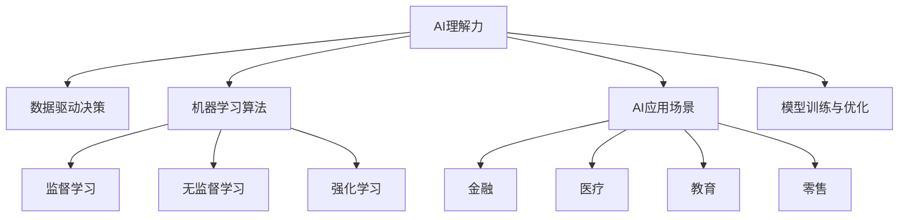

                 

# 贾扬清建议：培养团队AI理解力，应用AI于业务

## 1. 背景介绍

### 1.1 问题由来
随着人工智能(AI)技术的快速发展和广泛应用，越来越多的企业开始重视AI技术在业务中的落地。然而，AI不仅仅是数据和算法的堆砌，更是一个涉及数据理解、算法设计、模型训练、业务应用等多个环节的综合工程。如何在企业中有效培养和提升团队对AI的理解力，应用AI技术解决实际业务问题，成为摆在许多企业面前的重要课题。

### 1.2 问题核心关键点
AI技术的成功应用，依赖于团队对AI技术的深入理解和综合应用能力。因此，本文章将从AI理解力的培养、AI在业务中的应用实践、AI技术面临的挑战与未来趋势等多个方面进行探讨，以期为企业在AI技术的应用上提供更全面的指导和建议。

### 1.3 问题研究意义
深入理解和应用AI技术，不仅能提升企业的竞争力和创新能力，还能带来业务的转型和升级。AI的理解力和应用能力成为企业在激烈的市场竞争中突围的重要资本。通过提升团队AI理解力，结合AI技术优化业务流程、提升效率、创造价值，企业将在未来的数字化转型中占据先机。

## 2. 核心概念与联系

### 2.1 核心概念概述

为更好地理解如何培养团队AI理解力及应用AI技术，本节将介绍几个关键概念：

- AI理解力(AI Literacy)：指团队成员对AI技术和方法的深刻理解，包括AI的基本原理、关键技术、应用场景及面临的挑战。
- 数据驱动决策(Data-Driven Decision Making)：通过数据分析和机器学习技术，基于数据而非直觉进行决策的过程。
- 机器学习算法(Machine Learning Algorithms)：实现数据驱动决策的核心技术，包括监督学习、无监督学习、强化学习等。
- AI应用场景(AI Use Cases)：AI技术在各个业务领域的实际应用，如金融、医疗、教育、零售等。
- 模型训练与优化(Model Training & Optimization)：通过训练机器学习模型，不断优化模型参数，提升模型性能的过程。

这些核心概念之间的逻辑关系可以通过以下Mermaid流程图来展示：



这个流程图展示了AI理解力与数据驱动决策、机器学习算法、AI应用场景及模型训练与优化之间的内在联系：

1. AI理解力是数据驱动决策的基础，提供科学决策的数据支持。
2. 机器学习算法是数据驱动决策的核心工具，通过算法实现数据的分析、处理和建模。
3. AI应用场景是数据驱动决策的具体应用，覆盖金融、医疗、教育、零售等多个领域。
4. 模型训练与优化是提升数据驱动决策精准度的关键环节，通过不断优化模型，提升决策效果。

这些概念共同构成了AI技术应用的基本框架，通过理解这些概念，可以更好地把握AI技术的应用方法和优化方向。

## 3. 核心算法原理 & 具体操作步骤
### 3.1 算法原理概述

AI理解力及应用AI技术，涉及多个核心算法原理。以下我们将详细讲解其中的关键部分。

- 监督学习(Supervised Learning)：通过标注数据训练模型，使其能够预测新数据的标签。常见算法包括线性回归、逻辑回归、决策树等。
- 无监督学习(Unsupervised Learning)：不需要标注数据，通过数据自身的内在结构和规律进行学习。常见算法包括聚类、降维、关联规则等。
- 强化学习(Reinforcement Learning)：通过与环境的交互，最大化累积奖励，实现自主学习。常见算法包括Q-learning、策略梯度等。
- 神经网络(Neural Networks)：一种基于多层非线性变换的算法，广泛应用于图像、语音、自然语言处理等领域。

这些算法原理彼此独立但又相互补充，共同构成了AI技术的核心。以下是各个算法的详细步骤详解：

### 3.2 算法步骤详解

#### 3.2.1 监督学习

**步骤一：数据预处理**
1. 收集数据集：从业务系统、第三方数据源等获取数据。
2. 数据清洗：去除重复、缺失、异常数据，确保数据质量。
3. 特征提取：选择合适的特征进行编码和归一化，如使用词袋模型、TF-IDF等处理文本数据。

**步骤二：模型训练**
1. 划分数据集：将数据集划分为训练集、验证集和测试集。
2. 选择模型：根据业务需求选择合适的监督学习模型。
3. 训练模型：使用训练集数据训练模型，最小化损失函数。
4. 验证调整：在验证集上评估模型性能，根据结果调整模型参数。

**步骤三：模型评估**
1. 评估指标：选择合适的评估指标，如准确率、召回率、F1-score等。
2. 测试集测试：在测试集上评估模型性能，确保模型泛化能力。

#### 3.2.2 无监督学习

**步骤一：数据预处理**
1. 收集数据集：从业务系统、第三方数据源等获取数据。
2. 数据清洗：去除重复、缺失、异常数据，确保数据质量。
3. 特征提取：选择合适的特征进行编码和归一化，如使用PCA、K-Means等处理数据。

**步骤二：模型训练**
1. 划分数据集：将数据集划分为训练集和测试集。
2. 选择模型：根据业务需求选择合适的无监督学习模型。
3. 训练模型：使用训练集数据训练模型，最小化损失函数。
4. 验证调整：在测试集上评估模型性能，根据结果调整模型参数。

**步骤三：模型评估**
1. 评估指标：选择合适的评估指标，如聚类质量、降维后的数据稀疏性等。
2. 应用场景：在实际业务场景中应用模型，优化决策过程。

#### 3.2.3 强化学习

**步骤一：环境设计**
1. 定义环境：描述业务场景中的状态和动作空间。
2. 设计奖励函数：定义业务目标和奖励规则，如最大化收益、最小化损失等。

**步骤二：模型训练**
1. 选择模型：根据业务需求选择合适的强化学习模型。
2. 训练模型：使用奖励函数和环境模拟，训练模型学习最优策略。
3. 探索与利用：平衡模型对环境的探索和利用，以优化策略。

**步骤三：模型应用**
1. 应用场景：在实际业务场景中应用模型，优化决策过程。
2. 实时监控：实时监控模型表现，根据反馈调整模型参数。

### 3.3 算法优缺点

**监督学习**
- 优点：数据驱动，易于理解和实现，适用于分类、回归等任务。
- 缺点：需要大量标注数据，模型易过拟合，难以处理非线性关系。

**无监督学习**
- 优点：不需要标注数据，可以发现数据的内在结构和规律，适用于聚类、降维等任务。
- 缺点：结果解释性差，模型选择和参数调整复杂。

**强化学习**
- 优点：能够自主学习最优策略，适用于复杂决策场景。
- 缺点：模型训练复杂，环境设计困难，不稳定。

### 3.4 算法应用领域

AI技术在多个领域都有广泛应用，以下列举几个典型应用场景：

#### 3.4.1 金融领域
1. 风险管理：通过监督学习模型预测客户信用风险，使用无监督学习对市场数据进行聚类分析。
2. 高频交易：使用强化学习模型进行策略优化，实时调整交易策略。

#### 3.4.2 医疗领域
1. 疾病预测：使用监督学习模型预测疾病发生概率，使用无监督学习对基因数据进行聚类分析。
2. 医疗影像分析：使用卷积神经网络进行图像分类和分割。

#### 3.4.3 教育领域
1. 个性化推荐：使用协同过滤、内容推荐等算法推荐个性化学习资源。
2. 智能辅导：使用自然语言处理技术进行智能答疑和作业批改。

#### 3.4.4 零售领域
1. 客户分析：使用聚类算法对客户进行分类，实现精准营销。
2. 库存管理：使用强化学习算法优化库存策略，减少成本。

## 4. 数学模型和公式 & 详细讲解 & 举例说明

### 4.1 数学模型构建

为了更好地理解AI技术的数学模型和算法原理，以下将详细讲解其中的关键模型和公式。

#### 4.1.1 线性回归模型

线性回归模型用于预测连续型变量的值，表达式为：

$$
y = \theta_0 + \theta_1 x_1 + \theta_2 x_2 + ... + \theta_n x_n
$$

其中，$y$ 为预测值，$x_i$ 为特征变量，$\theta_i$ 为模型参数。

### 4.2 公式推导过程

#### 4.2.1 线性回归模型推导

在线性回归模型的训练过程中，我们通过最小化均方误差损失函数来拟合模型：

$$
L(\theta) = \frac{1}{2N} \sum_{i=1}^N (y_i - \hat{y_i})^2
$$

其中，$N$ 为样本数，$y_i$ 为真实标签，$\hat{y_i}$ 为模型预测值。

通过梯度下降算法，求解最小化损失函数的$\theta_i$：

$$
\theta_i \leftarrow \theta_i - \eta \frac{1}{N} \sum_{i=1}^N (y_i - \hat{y_i}) x_i
$$

其中，$\eta$ 为学习率。

### 4.3 案例分析与讲解

#### 4.3.1 线性回归模型在金融风险管理中的应用

以信用风险预测为例，收集客户的各项特征数据（如年龄、收入、还款记录等）和信用评分数据。通过监督学习模型训练得到线性回归模型，用于预测客户的信用风险。在模型训练过程中，需要选择合适的特征和模型参数，最小化损失函数，确保模型的泛化能力。

## 5. 项目实践：代码实例和详细解释说明

### 5.1 开发环境搭建

在项目实践中，我们需要搭建合适的开发环境。以下是Python和TensorFlow搭建开发环境的详细步骤：

1. 安装Python：从官网下载并安装Python，建议选择3.8及以上版本。
2. 安装虚拟环境：使用virtualenv或conda创建虚拟环境，如`virtualenv venv`或`conda create -n myenv`。
3. 激活虚拟环境：`source venv/bin/activate`或`conda activate myenv`。
4. 安装TensorFlow：使用pip安装TensorFlow，如`pip install tensorflow`。
5. 安装相关库：安装其他必要的库，如numpy、pandas、matplotlib等，如`pip install numpy pandas matplotlib`。

### 5.2 源代码详细实现

以下是一个基于TensorFlow的线性回归模型的实现示例，以金融风险预测为例：

```python
import tensorflow as tf
import numpy as np

# 定义数据
X = np.array([[1, 2, 3], [4, 5, 6], [7, 8, 9]])
y = np.array([1, 0, -1])

# 定义模型
model = tf.keras.Sequential([
    tf.keras.layers.Dense(units=1, input_shape=[3])
])

# 定义损失函数和优化器
model.compile(optimizer=tf.keras.optimizers.SGD(learning_rate=0.1), loss='mean_squared_error')

# 训练模型
model.fit(X, y, epochs=100, verbose=0)

# 预测数据
X_test = np.array([[10, 11, 12]])
print(model.predict(X_test))
```

### 5.3 代码解读与分析

#### 5.3.1 数据预处理

在项目实践中，数据预处理是至关重要的环节。以金融风险预测为例，数据预处理包括以下几个步骤：

1. 收集数据：从金融系统中收集客户的各项特征数据（如年龄、收入、还款记录等）和信用评分数据。
2. 数据清洗：去除重复、缺失、异常数据，确保数据质量。
3. 特征提取：选择合适的特征进行编码和归一化，如使用词袋模型、TF-IDF等处理文本数据。

#### 5.3.2 模型训练

在模型训练过程中，我们通过最小化均方误差损失函数来拟合模型：

```python
model.compile(optimizer=tf.keras.optimizers.SGD(learning_rate=0.1), loss='mean_squared_error')
```

其中，`optimizer`为优化器，`learning_rate`为学习率，`loss`为损失函数。

#### 5.3.3 模型评估

在模型训练完成后，我们通过测试集评估模型的泛化能力：

```python
X_test = np.array([[10, 11, 12]])
print(model.predict(X_test))
```

以上代码展示了如何通过TensorFlow实现线性回归模型的训练和预测。在实际项目中，我们需要根据具体任务调整模型参数和训练过程，确保模型效果。

## 6. 实际应用场景

### 6.1 金融风险管理

金融风险管理是AI技术的重要应用场景之一。通过机器学习模型预测客户的信用风险，能够帮助金融机构及时发现潜在风险，规避金融风险。

### 6.2 医疗影像分析

医疗影像分析是AI技术的另一个重要应用场景。通过卷积神经网络(CNN)模型，可以实现对医疗影像的分类和分割，辅助医生进行疾病诊断和治疗。

### 6.3 零售客户分析

零售客户分析是AI技术的典型应用场景。通过聚类算法对客户进行分类，实现精准营销，提高客户满意度和销售转化率。

### 6.4 未来应用展望

随着AI技术的不断发展，AI技术在更多领域的应用前景广阔。以下列举几个未来可能的应用场景：

#### 6.4.1 智能客服

基于AI的智能客服系统能够7x24小时不间断服务，快速响应客户咨询，提升客户体验。通过微调BERT等预训练模型，可以实现智能客服系统对客户咨询的快速理解和响应。

#### 6.4.2 智能推荐

智能推荐系统能够根据用户的历史行为数据，推荐个性化的商品和服务，提升用户满意度和转化率。通过协同过滤、内容推荐等算法，实现精准推荐。

#### 6.4.3 智能决策

智能决策系统能够基于大数据和机器学习算法，辅助企业进行业务决策。通过强化学习等算法，优化决策过程，提升决策效率和精准度。

## 7. 工具和资源推荐

### 7.1 学习资源推荐

为了帮助开发者系统掌握AI技术的应用方法和实践技巧，以下是几个优秀的学习资源：

1. 《深度学习》课程：斯坦福大学开设的深度学习课程，涵盖了深度学习的基础理论和前沿技术。
2. 《TensorFlow官方文档》：TensorFlow的官方文档，提供了详细的API参考和使用示例。
3. 《机器学习实战》书籍：详细介绍了机器学习算法和实践案例，适合初学者入门。
4. Kaggle平台：提供丰富的机器学习竞赛和数据集，可以帮助开发者实践和提升技能。

### 7.2 开发工具推荐

在AI技术的开发和应用过程中，选择合适的工具是提高效率的关键。以下是几个常用的开发工具：

1. Jupyter Notebook：交互式的Python开发环境，支持代码运行和结果展示。
2. TensorBoard：TensorFlow的可视化工具，用于监控模型训练状态和性能指标。
3. Visual Studio Code：功能强大的代码编辑器，支持Python和TensorFlow的开发。
4. PyCharm：专业的Python IDE，提供全面的开发支持和调试功能。

### 7.3 相关论文推荐

以下是几篇经典的相关论文，推荐阅读：

1. "Deep Learning"（Goodfellow等）：全面介绍了深度学习的基础理论和应用方法，是深度学习领域的经典教材。
2. "Natural Language Processing with Transformers"（Zhang等）：详细介绍了Transformer模型的原理和应用，是NLP领域的经典书籍。
3. "Neural Network and Deep Learning"（Goodfellow等）：介绍了神经网络的基本原理和深度学习算法，适合初学者学习。

## 8. 总结：未来发展趋势与挑战

### 8.1 总结

本文对AI技术的理解力和应用方法进行了全面系统的介绍。首先阐述了AI理解力的培养、AI在业务中的应用实践、AI技术面临的挑战与未来趋势等多个方面，明确了AI技术在企业中的重要价值。

### 8.2 未来发展趋势

展望未来，AI技术的应用将更加广泛和深入，以下是几个发展趋势：

1. AI技术将更加普及：随着AI技术的成熟和应用成本的降低，越来越多的企业将采用AI技术，推动AI的普及。
2. 数据驱动决策将更加重要：基于数据驱动的决策将成为企业决策的主流方式，AI技术将提供更加科学的决策支持。
3. 机器学习算法将更加多样化：随着算法研究和应用的不断深入，机器学习算法将更加多样化和高效。
4. 人工智能与业务的融合将更加深入：AI技术将深入融合到各个业务领域，实现业务的智能化和自动化。
5. 实时计算和智能决策将更加普遍：实时计算和智能决策将成为企业业务的核心能力，AI技术将提供高效的支持。

### 8.3 面临的挑战

尽管AI技术的应用前景广阔，但在实施过程中仍面临诸多挑战：

1. 数据隐私和安全问题：AI技术依赖于大量数据，数据隐私和安全问题将愈发突出。
2. 模型解释性和透明性问题：AI模型的黑盒特性将导致其解释性和透明性不足，难以满足业务需求。
3. 模型性能和稳定性问题：AI模型的性能和稳定性需不断优化和提升，以应对复杂多变的环境。
4. 算法公平性和偏见问题：AI模型可能存在算法偏见和歧视，需要解决这些问题以确保公平性。
5. 数据质量和标注问题：AI模型的训练和优化依赖于高质量的数据和标注，数据质量和标注问题将限制模型性能。

### 8.4 研究展望

面对AI技术应用中的挑战，未来的研究需要在以下几个方面寻求新的突破：

1. 数据隐私和安全保护：研究数据隐私保护技术，确保数据安全和隐私。
2. 模型解释性和透明性提升：研究模型解释和透明技术，提升模型解释性。
3. 模型性能和稳定性优化：研究模型性能优化技术，提升模型稳定性和鲁棒性。
4. 算法公平性和偏见纠正：研究算法公平性和偏见纠正技术，确保模型公平性。
5. 数据质量和标注方法改进：研究高质量数据获取和标注方法，确保数据质量和标注质量。

这些研究方向的探索，将引领AI技术迈向更加成熟和高效的应用阶段，为构建安全、可靠、可解释、可控的智能系统提供支撑。

## 9. 附录：常见问题与解答

### 9.1 如何提高团队AI理解力？

**Q1：如何提高团队AI理解力？**

A: 提高团队AI理解力需要从多个方面入手，以下是几个关键步骤：

1. 组织培训：定期组织AI相关的培训课程，涵盖基础知识、核心算法、实践案例等，提升团队AI知识水平。
2. 实际项目实践：通过实际项目实践，让团队成员亲身体验AI技术的应用和优化过程，提升实战能力。
3. 定期交流：定期组织团队交流和分享，分享经验和心得，共同解决实际问题。
4. 引入专家：邀请AI领域的专家进行讲座和指导，提升团队AI理解力和应用能力。

### 9.2 如何应用AI技术提升业务效率？

**Q2：如何应用AI技术提升业务效率？**

A: 应用AI技术提升业务效率需要从多个环节入手，以下是几个关键步骤：

1. 数据驱动决策：通过数据分析和机器学习技术，基于数据而非直觉进行决策，提升决策效率和精准度。
2. 业务场景应用：选择适合的AI技术，应用于业务场景中，实现自动化和智能化。
3. 实时监控与调整：实时监控AI模型表现，根据反馈调整模型参数，确保模型效果。
4. 持续优化与改进：持续优化AI模型，提升模型性能和鲁棒性，确保模型长期有效。

### 9.3 如何保证AI模型的公平性？

**Q3：如何保证AI模型的公平性？**

A: 保证AI模型的公平性需要从多个方面入手，以下是几个关键步骤：

1. 数据处理：确保数据集的代表性，避免数据偏见和歧视。
2. 算法选择：选择公平性友好的算法，避免算法偏见和歧视。
3. 模型监控：实时监控模型输出，检测和纠正模型偏见和歧视。
4. 伦理审查：建立AI模型的伦理审查机制，确保模型符合伦理规范。

### 9.4 如何保证AI模型的透明性和可解释性？

**Q4：如何保证AI模型的透明性和可解释性？**

A: 保证AI模型的透明性和可解释性需要从多个方面入手，以下是几个关键步骤：

1. 模型解释技术：使用模型解释技术，如LIME、SHAP等，生成模型解释结果，提升模型透明性。
2. 可视化工具：使用可视化工具，如TensorBoard、ONNX等，可视化模型训练过程和输出结果，提升模型可解释性。
3. 透明性协议：建立透明性协议，明确模型开发和应用过程中的透明要求，提升模型透明性。
4. 用户反馈：收集用户反馈，不断改进模型，提升模型可解释性。

### 9.5 如何应对AI技术应用中的数据隐私和安全问题？

**Q5：如何应对AI技术应用中的数据隐私和安全问题？**

A: 应对AI技术应用中的数据隐私和安全问题需要从多个方面入手，以下是几个关键步骤：

1. 数据加密：使用数据加密技术，确保数据传输和存储的安全性。
2. 隐私保护技术：研究数据隐私保护技术，如差分隐私、联邦学习等，保护数据隐私。
3. 访问控制：建立严格的访问控制机制，确保数据访问权限的安全性。
4. 合规管理：遵循数据隐私和安全相关法律法规，确保合规性。

---

作者：禅与计算机程序设计艺术 / Zen and the Art of Computer Programming

