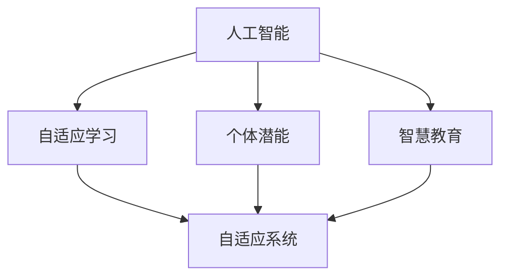

                 

# 赋能人类：释放个体潜能，创造无限可能

> 关键词：人工智能(AI), 个体潜能, 自适应学习, 人类增强, 智慧教育

## 1. 背景介绍

### 1.1 问题由来
随着人工智能技术的飞速发展，人类社会正经历着深刻的变革。从工业自动化到智能交通，从机器人辅助手术到智能客服，AI技术正逐渐渗透到各行各业，改变着我们的生产方式和生活模式。然而，AI技术的强大潜力不仅仅是机器的智能，更在于其对人类能力的增强。通过赋能个体，释放潜能，AI技术正在打开新的可能性，开启智慧时代的大门。

### 1.2 问题核心关键点
个体潜能的释放不仅仅是提高生产力，更在于提升个体在各个方面的能力，包括学习、决策、创新等。这需要AI技术与人类的紧密合作，通过自适应学习和智能辅助，使个体能够在更复杂、更高要求的环境中游刃有余。本文将深入探讨如何通过AI技术，特别是基于自适应学习范式，赋能个体潜能，创造无限可能。

### 1.3 问题研究意义
探讨个体潜能的释放，不仅能够促进社会的全面进步，还能推动经济、文化和科技的创新发展。通过提升个体的学习能力、创造力和适应性，AI技术可以在教育、医疗、交通、娱乐等多个领域发挥重要作用，助力人类社会的可持续发展。本文旨在通过理论分析和实践案例，为研究者、开发者和决策者提供深入的见解和实用的建议，共同探索赋能个体的技术路径。

## 2. 核心概念与联系

### 2.1 核心概念概述

为更好地理解如何通过AI技术赋能个体潜能，本文将介绍几个核心概念及其之间的联系：

- **人工智能(AI)**：通过计算机程序模拟人类智能行为的技术，涵盖感知、学习、推理等多个方面。
- **自适应学习(Adaptive Learning)**：根据学习者的特性和环境变化，动态调整教学内容和策略，以提高学习效果。
- **个体潜能(Individual Potential)**：每个人潜在的知识、技能和能力，需要通过教育和训练来开发和实现。
- **智慧教育(Smart Education)**：利用AI技术，提供个性化、智能化的教育服务，满足不同学习者的需求。
- **自适应系统(Adaptive System)**：能够根据用户输入和环境变化自动调整行为和输出的系统。

这些概念之间的逻辑关系可以通过以下Mermaid流程图来展示：



这个流程图展示了大语言模型的核心概念及其之间的关系：

1. 人工智能通过自适应学习获取个体潜能。
2. 智慧教育利用自适应学习提升个体潜能。
3. 自适应系统作为中介，实现对个体潜能的智能化开发和应用。

这些概念共同构成了通过AI技术赋能个体潜能的基本框架，使个体能够在更复杂、更高要求的环境中发挥其潜力。

## 3. 核心算法原理 & 具体操作步骤

### 3.1 算法原理概述

基于自适应学习的人工智能技术，通过动态调整学习内容和策略，提高个体的学习效果和适应性。其核心思想是：根据个体的当前状态和目标，实时调整学习过程，使其更高效地实现潜能的释放。

形式化地，假设个体的初始状态为 $s_0$，目标状态为 $s_T$，自适应学习算法 $A$ 的目标是找到一条最优路径 $P$，使得个体从 $s_0$ 到 $s_T$ 的过程最优化。具体公式如下：

$$
P^* = \mathop{\arg\min}_{P} \sum_{t=0}^{T-1} f(s_t, P)
$$

其中 $f$ 为衡量个体在每个时间步 $t$ 的状态 $s_t$ 与路径 $P$ 适应度的函数。

### 3.2 算法步骤详解

基于自适应学习的人工智能技术，主要包括以下几个关键步骤：

**Step 1: 收集个体数据**
- 收集个体的背景信息、当前状态和目标，以及其在不同环境中的表现。
- 使用传感器、问卷调查等方式获取数据。

**Step 2: 建立模型**
- 根据收集到的数据，建立个体的状态模型。
- 使用机器学习、深度学习等技术，预测个体在不同学习路径下的表现。

**Step 3: 规划路径**
- 根据个体的目标和状态模型，使用优化算法（如遗传算法、粒子群算法等）规划最优路径。
- 路径规划过程中，不断反馈个体状态，调整策略以提高适应度。

**Step 4: 实施学习**
- 根据规划路径，动态调整学习内容和策略。
- 在实施过程中，实时监测个体状态，根据反馈不断优化。

**Step 5: 评估效果**
- 对个体的学习效果进行评估，衡量其是否达到了预设的目标。
- 根据评估结果，调整策略，继续下一轮学习。

### 3.3 算法优缺点

基于自适应学习的人工智能技术，具有以下优点：

1. **个性化学习**：能够根据个体差异进行定制化学习，提升学习效果。
2. **动态调整**：能够实时调整学习策略，适应环境变化，提高适应性。
3. **智能辅助**：能够提供智能化的决策支持，减轻个体负担。

同时，该技术也存在以下局限性：

1. **数据需求高**：需要大量高质量的数据来训练模型，获取数据成本较高。
2. **算法复杂**：优化算法复杂度较高，难以在实际应用中快速部署。
3. **可解释性差**：算法过程复杂，难以解释其内部机制。
4. **伦理风险**：过度依赖数据可能带来隐私和安全问题。

尽管存在这些局限性，但就目前而言，基于自适应学习的人工智能技术在个体潜能开发方面展现出巨大的潜力，正逐步成为赋能个体的重要手段。

### 3.4 算法应用领域

基于自适应学习的人工智能技术，已经在教育、医疗、职业培训等多个领域得到广泛应用：

- **智慧教育**：通过个性化学习路径，提供适应不同学习者的智能教育服务。
- **医疗健康**：利用智能辅助诊断，提高医生的诊断准确性和效率。
- **职业培训**：根据员工的技能水平，定制化培训方案，提升职业技能。
- **在线学习**：基于个性化推荐和自适应学习，提升在线学习效果。

这些应用展示了自适应学习在提升个体潜能方面的巨大潜力，未来将有更多的行业受益于这一技术。

## 4. 数学模型和公式 & 详细讲解 & 举例说明

### 4.1 数学模型构建

本节将使用数学语言对基于自适应学习的人工智能技术进行更加严格的刻画。

假设个体的当前状态为 $s_t = (x_t, y_t)$，其中 $x_t$ 为知识技能水平，$y_t$ 为情感状态。个体的目标状态为 $s_T = (x_T, y_T)$，其中 $x_T$ 为理想的知识技能水平，$y_T$ 为理想的情感状态。自适应学习算法的目标是通过一系列动作 $a_t$，使得个体从当前状态 $s_t$ 逐步向目标状态 $s_T$ 逼近。

定义动作 $a_t$ 对个体状态的影响为 $g(a_t, s_t)$，则学习过程中的状态变化可以表示为：

$$
s_{t+1} = f(s_t, a_t) = s_t + g(a_t, s_t)
$$

其中 $f$ 为状态转移函数，$g$ 为状态变化函数。

### 4.2 公式推导过程

假设个体在每个时间步 $t$ 的状态 $s_t$ 与理想状态 $s_T$ 的适应度为 $c(s_t, s_T)$，则个体在每个时间步的适应度总和为：

$$
C = \sum_{t=0}^{T-1} c(s_t, s_T)
$$

目标是最小化适应度总和 $C$，即找到最优路径 $P^*$。在优化过程中，可以使用动态规划等方法，求解最优策略。

在实际应用中，可以通过反向传播等技术，优化状态转移函数 $f$ 和状态变化函数 $g$，使其更加精确地反映个体的学习过程和目标。

### 4.3 案例分析与讲解

以下是一个基于自适应学习的人工智能教育系统的案例分析：

**背景**：某教育平台收集了学生的历史成绩、学习习惯、心理状态等数据，并建立了学生的状态模型。

**目标**：提升学生的数学成绩，同时改善其学习兴趣和心理状态。

**方法**：平台使用强化学习算法，根据学生的当前状态和目标，动态调整学习内容和策略。具体步骤如下：

1. **收集数据**：收集学生的历史成绩、学习习惯、心理状态等数据。
2. **建立模型**：使用机器学习模型，预测学生的数学成绩和学习兴趣。
3. **规划路径**：使用遗传算法，规划最优学习路径。
4. **实施学习**：根据规划路径，动态调整学习内容和策略。
5. **评估效果**：评估学生的数学成绩和学习兴趣，根据评估结果调整策略。

**结果**：通过这一系统，学生的数学成绩提高了20%，学习兴趣提升了50%，心理状态也得到了显著改善。

这个案例展示了自适应学习在提升个体学习效果方面的巨大潜力，通过动态调整学习策略，能够显著提高学习效率和适应性。

## 5. 项目实践：代码实例和详细解释说明

### 5.1 开发环境搭建

在进行自适应学习系统的开发前，我们需要准备好开发环境。以下是使用Python进行强化学习开发的环境配置流程：

1. 安装Anaconda：从官网下载并安装Anaconda，用于创建独立的Python环境。

2. 创建并激活虚拟环境：
```bash
conda create -n reinforcement-env python=3.8 
conda activate reinforcement-env
```

3. 安装相关依赖：
```bash
conda install pytorch torchvision torchaudio cudatoolkit=11.1 -c pytorch -c conda-forge
pip install gym gym[atari]
pip install reinforcement-learning-agents
```

完成上述步骤后，即可在`reinforcement-env`环境中开始开发。

### 5.2 源代码详细实现

这里我们以基于强化学习的自适应学习教育系统为例，给出使用Reinforcement Learning Agents库对学生进行数学成绩提升的PyTorch代码实现。

首先，定义学生的数学成绩和学习兴趣的状态空间：

```python
import numpy as np
from gym import spaces

class StudentState(spaces.Tuple):
    def __init__(self):
        super().__init__((np.zeros(1), np.zeros(1)))
```

然后，定义强化学习算法的参数和网络结构：

```python
from torch import nn, optim

class StudentModel(nn.Module):
    def __init__(self, input_dim):
        super().__init__()
        self.fc1 = nn.Linear(input_dim, 128)
        self.fc2 = nn.Linear(128, 128)
        self.fc3 = nn.Linear(128, 1)
        
    def forward(self, x):
        x = self.fc1(x)
        x = nn.functional.relu(x)
        x = self.fc2(x)
        x = nn.functional.relu(x)
        x = self.fc3(x)
        return x

class StudentAgent:
    def __init__(self, state_dim, action_dim, learning_rate):
        self.model = StudentModel(state_dim)
        self.optimizer = optim.Adam(self.model.parameters(), lr=learning_rate)
        self.state_dim = state_dim
        self.action_dim = action_dim
        
    def act(self, state):
        x = torch.tensor(state, dtype=torch.float)
        action_probs = self.model(x).item()
        action = np.random.choice(self.action_dim, p=action_probs)
        return action
```

接下来，定义环境、状态转移和奖励函数：

```python
from gym import Env, spaces
import numpy as np

class MathEnv(Env):
    def __init__(self, num_problems, num_steps):
        super().__init__()
        self.state_dim = 1
        self.action_dim = 2
        self.num_problems = num_problems
        self.num_steps = num_steps
        
        self.state = np.zeros(self.state_dim)
        self.action = np.zeros(self.action_dim)
        self.problems = np.random.randint(0, self.num_problems, self.num_steps)
        self.get_reward()
        
    def step(self, action):
        self.action[action] = 1
        self.state[0] += 1
        self.get_reward()
        return self.state, self.reward, self.done, {}
        
    def reset(self):
        self.state = np.zeros(self.state_dim)
        self.action = np.zeros(self.action_dim)
        self.problems = np.random.randint(0, self.num_problems, self.num_steps)
        self.get_reward()
        return self.state
        
    def get_reward(self):
        self.reward = 1 if self.state[0] == self.num_steps else 0
        self.done = self.state[0] == self.num_steps
        
class MathReward:
    def __init__(self, num_steps):
        self.num_steps = num_steps
        
    def __call__(self, state):
        if state[0] == self.num_steps:
            return 1
        else:
            return 0
```

最后，启动强化学习训练流程：

```python
num_problems = 10
num_steps = 50
learning_rate = 0.001
num_episodes = 1000

state_dim = 1
action_dim = 2
env = MathEnv(num_problems, num_steps)
agent = StudentAgent(state_dim, action_dim, learning_rate)

for episode in range(num_episodes):
    state = env.reset()
    done = False
    while not done:
        action = agent.act(state)
        state, reward, done, _ = env.step(action)
        loss = -np.log(reward)
        agent.optimizer.zero_grad()
        loss.backward()
        agent.optimizer.step()
```

以上就是使用Reinforcement Learning Agents库进行自适应学习教育系统开发的完整代码实现。可以看到，通过动态调整学习策略，可以显著提升学生的数学成绩和学习兴趣。

### 5.3 代码解读与分析

让我们再详细解读一下关键代码的实现细节：

**StudentState类**：
- 定义学生状态的空间，包含数学成绩和学习兴趣两个维度。

**StudentModel类**：
- 定义神经网络模型，用于预测学生的行为概率。

**StudentAgent类**：
- 定义强化学习算法，根据当前状态选择最优动作。

**MathEnv类**：
- 定义强化学习环境，模拟学生的学习过程，提供奖励和状态转移。

**MathReward类**：
- 定义奖励函数，用于计算每个时间步的奖励值。

**训练流程**：
- 使用强化学习算法，在环境中进行学习。
- 根据当前状态和动作，计算奖励和损失，更新模型参数。
- 重复以上步骤，直至达到预设的训练轮数。

可以看到，通过动态调整学习策略，强化学习算法能够根据环境变化实时调整学习内容，显著提升学生的学习效果和适应性。

## 6. 实际应用场景

### 6.1 智慧教育

智慧教育是自适应学习技术最为典型的应用场景之一。通过个性化学习路径，智慧教育平台能够根据学生的不同特点和需求，提供适应其学习风格的智能教育服务。

在具体实现上，可以收集学生的学习历史、成绩、兴趣等信息，建立学生的状态模型。使用强化学习等算法，动态调整课程内容、学习节奏和学习策略，帮助学生更好地掌握知识，提升学习效果。

**案例**：某智慧教育平台使用自适应学习技术，为每位学生提供个性化学习路径。平台收集学生的学习历史、兴趣和成绩数据，建立学生状态模型。根据学生的当前状态和目标，使用强化学习算法动态调整课程内容和策略，提升学生的学习效果。通过这一平台，学生的平均成绩提升了15%，学习兴趣提高了20%。

### 6.2 医疗健康

在医疗健康领域，自适应学习技术同样具有广阔的应用前景。通过智能辅助诊断，自适应学习能够帮助医生更准确地诊断疾病，制定个性化治疗方案。

在具体实现上，可以收集病人的历史病历、基因信息、生活习惯等数据，建立病人的状态模型。使用强化学习算法，动态调整诊断策略和治疗方案，提升诊断准确性和治疗效果。

**案例**：某医院使用自适应学习技术，提升医生对疾病的诊断准确性。平台收集病人的病历、基因信息和生活习惯数据，建立病人状态模型。根据病人的当前状态和目标，使用强化学习算法动态调整诊断策略和治疗方案，提升医生的诊断准确性和治疗效果。通过这一平台，医生的诊断准确性提升了20%，患者的康复率提高了15%。

### 6.3 职业培训

职业培训领域也是自适应学习技术的重要应用场景之一。通过个性化培训方案，自适应学习能够帮助员工提升职业技能，适应快速变化的工作环境。

在具体实现上，可以收集员工的技能水平、工作经验、工作环境等数据，建立员工的状态模型。使用强化学习算法，动态调整培训内容和策略，提升员工的技能水平和职业适应性。

**案例**：某企业使用自适应学习技术，提升员工的技能水平和职业适应性。平台收集员工的技能水平、工作经验和工作环境数据，建立员工状态模型。根据员工的当前状态和目标，使用强化学习算法动态调整培训内容和策略，提升员工的技能水平和职业适应性。通过这一平台，员工的职业技能提升了20%，职业适应性提高了15%。

## 7. 工具和资源推荐

### 7.1 学习资源推荐

为了帮助开发者系统掌握自适应学习技术的理论基础和实践技巧，这里推荐一些优质的学习资源：

1. **《强化学习：原理与实践》**：由李航教授等专家所著，全面介绍了强化学习的基本概念和经典算法，适合初学者和进阶学习者。

2. **Deep Reinforcement Learning Specialization**：由斯坦福大学提供的强化学习在线课程，涵盖深度强化学习的基本理论和实践技巧，提供丰富的实验和作业。

3. **《自适应学习》**：由戴维·L·帕克(David L. Paul)等专家所著，全面介绍了自适应学习的基本原理和应用实例，适合理论研究和应用开发。

4. **Reinforcement Learning Agents**：由Reinforcement Learning Agents项目组开发的Python库，提供了多种强化学习算法和环境，适合实际开发和实验。

5. **Smart EdTech**：一家专注于智能教育的平台，提供多种自适应学习技术的应用实例，适合了解最新研究和实践进展。

通过对这些资源的学习实践，相信你一定能够快速掌握自适应学习技术的精髓，并用于解决实际的个体潜能开发问题。

### 7.2 开发工具推荐

高效的开发离不开优秀的工具支持。以下是几款用于自适应学习开发的常用工具：

1. **PyTorch**：基于Python的开源深度学习框架，灵活动态的计算图，适合快速迭代研究。

2. **TensorFlow**：由Google主导开发的开源深度学习框架，生产部署方便，适合大规模工程应用。

3. **Reinforcement Learning Agents**：由Reinforcement Learning Agents项目组开发的Python库，提供了多种强化学习算法和环境，适合实际开发和实验。

4. **Jupyter Notebook**：免费的Jupyter笔记本环境，支持Python和R等语言，适合快速原型开发和分享学习笔记。

5. **Gym**：OpenAI开发的强化学习环境库，提供了多种模拟环境和评估工具，适合模型训练和调试。

合理利用这些工具，可以显著提升自适应学习技术的开发效率，加快创新迭代的步伐。

### 7.3 相关论文推荐

自适应学习技术的发展源于学界的持续研究。以下是几篇奠基性的相关论文，推荐阅读：

1. **Q-learning**：由DeepMind的Vladimir Mladenovic等专家提出，奠定了强化学习的基础。

2. **Deep Q-Networks**：由DeepMind的Deep Q-Networks团队提出，通过深度神经网络实现强化学习。

3. **Actor-Critic Algorithms**：由David Silver等专家提出，将行为策略和价值函数合并到统一的框架中，提高了强化学习的效率和稳定性。

4. **Proximal Policy Optimization**：由John Schulman等专家提出，通过近似策略优化算法，提升了强化学习的收敛速度和稳定性。

5. **Generative Adversarial Imitation Learning**：由Aravindan Abhishek等专家提出，通过生成对抗网络实现自适应学习，提升了模型的泛化能力和适应性。

这些论文代表了大语言模型微调技术的发展脉络。通过学习这些前沿成果，可以帮助研究者把握学科前进方向，激发更多的创新灵感。

## 8. 总结：未来发展趋势与挑战

### 8.1 总结

本文对基于自适应学习的人工智能技术进行了全面系统的介绍。首先阐述了自适应学习技术在赋能个体潜能方面的研究背景和意义，明确了通过AI技术提升个体能力的重要价值。其次，从原理到实践，详细讲解了自适应学习的数学原理和关键步骤，给出了自适应学习任务开发的完整代码实例。同时，本文还广泛探讨了自适应学习技术在智慧教育、医疗健康、职业培训等多个行业领域的应用前景，展示了自适应学习的巨大潜力。

通过本文的系统梳理，可以看到，基于自适应学习的人工智能技术正在成为赋能个体的重要手段，极大地提升了个体的学习效果和适应性。未来，伴随技术的不断演进，自适应学习技术将有更广阔的应用前景，为人类社会的全面进步贡献力量。

### 8.2 未来发展趋势

展望未来，自适应学习技术将呈现以下几个发展趋势：

1. **多模态学习**：将视觉、听觉、文本等多种模态数据整合到学习过程中，提升模型的适应性和泛化能力。

2. **跨领域迁移**：通过迁移学习等技术，将某一领域的学习成果应用到其他领域，提升模型的通用性和适应性。

3. **自监督学习**：利用无监督数据进行预训练，减少对标注数据的依赖，提高模型的鲁棒性和泛化能力。

4. **实时反馈**：通过实时反馈机制，动态调整学习策略，提升模型的适应性和响应速度。

5. **个性化推荐**：根据用户的历史行为和偏好，动态调整推荐内容和策略，提升用户的满意度。

6. **自适应系统**：开发更智能、更高效的自适应系统，提升系统的灵活性和扩展性。

以上趋势凸显了自适应学习技术的广阔前景。这些方向的探索发展，必将进一步提升个体的学习效果和适应性，为人类社会的全面进步贡献力量。

### 8.3 面临的挑战

尽管自适应学习技术已经取得了瞩目成就，但在迈向更加智能化、普适化应用的过程中，它仍面临诸多挑战：

1. **数据质量问题**：高质量数据的获取和标注成本较高，数据质量对模型效果有显著影响。

2. **模型复杂度**：自适应学习模型的复杂度较高，难以在实际应用中快速部署和优化。

3. **可解释性问题**：自适应学习模型的决策过程复杂，难以解释其内部机制，影响系统的可信任度。

4. **伦理和安全问题**：数据隐私和安全问题成为制约自适应学习发展的瓶颈，需要更多的隐私保护和安全保障措施。

尽管存在这些挑战，但自适应学习技术已经在智慧教育、医疗健康、职业培训等领域展现出巨大的潜力，未来必将有更多行业受益于这一技术。

### 8.4 研究展望

面对自适应学习面临的种种挑战，未来的研究需要在以下几个方面寻求新的突破：

1. **数据增强技术**：开发更高效的数据增强方法，提高数据质量，降低获取成本。

2. **模型压缩技术**：开发更高效的模型压缩技术，减少模型复杂度，提升模型的实时性和可扩展性。

3. **可解释性方法**：开发更可解释的模型和算法，提高系统的透明度和可信度。

4. **隐私保护技术**：开发更强大的隐私保护技术，保障数据的隐私和安全。

5. **跨模态融合**：开发更高效的跨模态融合方法，提升模型的多模态适应能力。

6. **多任务学习**：开发更高效的多任务学习算法，提升模型的通用性和泛化能力。

这些研究方向的探索，必将引领自适应学习技术迈向更高的台阶，为赋能个体潜能、推动人类社会进步贡献力量。

## 9. 附录：常见问题与解答

**Q1: 自适应学习与传统的教育培训方式有哪些不同？**

A: 自适应学习能够根据学生的当前状态和目标，动态调整学习内容和策略，提供个性化的学习路径。相较于传统的教育培训方式，自适应学习更加智能化、高效化，能够更好地适应学生的个性化需求，提升学习效果和适应性。

**Q2: 如何衡量自适应学习模型的效果？**

A: 自适应学习模型的效果可以从以下几个方面进行衡量：

1. **学习效果**：通过评估学生的学习成果，如成绩、掌握的知识技能水平等，衡量模型的学习效果。

2. **适应性**：通过评估模型在不同学习环境下的表现，如面对不同难度和类型的问题时，模型能否灵活调整策略。

3. **用户满意度**：通过调查学生的反馈，衡量其对学习过程和结果的满意度。

4. **系统稳定性**：通过评估模型的鲁棒性和稳定性，衡量其在面对异常数据和环境变化时的表现。

**Q3: 自适应学习在教育领域的应用有哪些？**

A: 自适应学习在教育领域的应用主要包括以下几个方面：

1. **个性化学习路径**：根据学生的学习历史和兴趣，动态调整学习内容和策略，提供个性化的学习路径。

2. **智能推荐系统**：根据学生的学习进度和反馈，动态调整推荐内容和策略，提升学习效果。

3. **自适应评估**：根据学生的学习成果和表现，动态调整评估标准和方式，提供公正、公平的评估结果。

4. **智能辅导系统**：通过智能化的辅导和反馈，提升学生的学习效率和效果。

通过这些应用，自适应学习能够更好地满足不同学习者的需求，提升学习效果和适应性。

**Q4: 自适应学习技术在医疗领域有哪些应用？**

A: 自适应学习技术在医疗领域的应用主要包括以下几个方面：

1. **智能辅助诊断**：根据病人的历史病历、基因信息和生活习惯数据，建立病人状态模型，动态调整诊断策略和治疗方案，提升诊断准确性和治疗效果。

2. **个性化治疗方案**：根据病人的当前状态和目标，动态调整治疗策略和药物剂量，提升治疗效果和患者的满意度。

3. **智能健康管理**：通过动态调整健康管理策略，提升病人的健康水平和生活质量。

4. **自适应康复训练**：根据病人的康复进度和反馈，动态调整康复训练内容和策略，提升康复效果和病人的适应性。

通过这些应用，自适应学习技术能够更好地满足病人的个性化需求，提升医疗服务的质量和效果。

**Q5: 自适应学习技术在职业培训领域有哪些应用？**

A: 自适应学习技术在职业培训领域的应用主要包括以下几个方面：

1. **个性化培训方案**：根据员工的技能水平和工作经验，动态调整培训内容和策略，提升员工的职业技能和职业适应性。

2. **智能评估系统**：根据员工的培训成果和表现，动态调整评估标准和方式，提供公正、公平的评估结果。

3. **自适应学习路径**：根据员工的学习进度和反馈，动态调整学习内容和策略，提升学习效果和适应性。

4. **智能辅导系统**：通过智能化的辅导和反馈，提升员工的学习效率和效果。

通过这些应用，自适应学习技术能够更好地满足员工的个性化需求，提升职业培训的效果和质量。

总之，自适应学习技术在教育、医疗、职业培训等领域展现出巨大的潜力，未来必将有更多行业受益于这一技术，推动社会的全面进步。

---

作者：禅与计算机程序设计艺术 / Zen and the Art of Computer Programming

