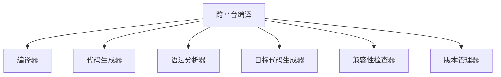

                 

# 跨平台编译：一次编写，多平台运行

> 关键词：跨平台编译, 多平台运行, 一次编写, 自动化构建, 构建系统, 代码生成, 代码优化

## 1. 背景介绍

### 1.1 问题由来
随着软件开发的迅猛发展，不同操作系统和硬件平台的兼容性问题愈发突出。如何在多个平台间无缝部署，既节省开发时间，又保证软件的稳定性和性能，成为了软件开发人员面临的重大挑战。跨平台编译技术应运而生，通过一次编写，多平台运行的自动化构建方式，显著提升了开发效率，降低了平台间切换的成本。

### 1.2 问题核心关键点
跨平台编译的核心在于如何通过统一的后端编译器，对源代码进行适配和转换，使其能够在不同平台上正确运行。这包括但不限于以下几点：

1. 代码生成器：将高级语言源代码转换为机器指令或字节码。
2. 语法分析器：解析源代码，生成抽象语法树。
3. 目标代码生成器：将抽象语法树转换为目标平台上的可执行代码。
4. 兼容性检查器：检查目标代码是否满足特定平台的要求。
5. 版本管理器：管理编译器和目标平台的版本兼容性。

这些核心组件共同构成了跨平台编译技术的骨架，使得开发者能够轻松跨平台部署应用。

### 1.3 问题研究意义
跨平台编译技术不仅降低了开发成本，提高了开发效率，还为软件的跨平台推广和维护提供了便利。它使得软件开发者能够专注于核心业务逻辑，而无需花费大量时间和精力在平台适配上。这对于提升软件工程的整体质量和生产效率，具有重要意义。

## 2. 核心概念与联系

### 2.1 核心概念概述

为更好地理解跨平台编译技术，本节将介绍几个密切相关的核心概念：

- 跨平台编译(Cross-Platform Compiling)：一种将代码编译成能够在多种操作系统和硬件平台运行的可执行文件的自动化构建方式。
- 编译器(Compiler)：一种将高级语言源代码转换为机器指令或字节码的工具。
- 代码生成器(Code Generator)：根据源代码自动生成目标代码的模块。
- 语法分析器(Parsing)：将源代码解析成抽象语法树的过程。
- 目标代码生成器(Code Generator)：根据抽象语法树生成目标代码的模块。
- 兼容性检查器(Compatibility Checker)：检查目标代码是否符合特定平台的规范。
- 版本管理器(Version Manager)：用于管理编译器和目标平台版本兼容的工具。

这些核心概念之间的逻辑关系可以通过以下Mermaid流程图来展示：



这个流程图展示了一些核心概念及其之间的关系：

1. 跨平台编译将高级语言源代码作为输入，依赖编译器、代码生成器、语法分析器、目标代码生成器、兼容性检查器和版本管理器等组件进行处理。
2. 编译器负责将源代码转换为中间代码或字节码。
3. 代码生成器根据中间代码或字节码生成目标平台上的可执行代码。
4. 语法分析器解析源代码，生成抽象语法树，用于后续处理。
5. 目标代码生成器根据抽象语法树生成目标代码。
6. 兼容性检查器检查目标代码是否满足特定平台的要求。
7. 版本管理器管理编译器和目标平台的版本兼容性。

这些概念共同构成了跨平台编译技术的基础，使得软件能够在多个平台间无缝运行。

## 3. 核心算法原理 & 具体操作步骤
### 3.1 算法原理概述

跨平台编译的原理在于通过一次编写，多平台运行的自动化构建方式，使得开发者能够仅需编写一次代码，即可在多个平台上运行。这种技术通常依赖于一个统一的编译框架，结合多种编译器，对源代码进行适配和转换，从而生成适用于目标平台的可执行代码。

形式化地，假设源代码S，编译器C，目标平台T，则跨平台编译的过程可以表示为：

$$
S \xrightarrow{C} O_T
$$

其中，$O_T$表示目标平台T上的可执行代码。具体来说，编译过程包括以下几个步骤：

1. 语法分析：将源代码S解析成抽象语法树AST。
2. 目标代码生成：根据AST生成目标平台T上的可执行代码。
3. 兼容性检查：确保生成的代码能够正确运行在目标平台T上。

### 3.2 算法步骤详解

基于上述原理，以下是跨平台编译的一般步骤：

**Step 1: 准备源代码和编译器**

- 准备源代码：包括源代码文件、头文件、库文件等。
- 选择编译器：根据目标平台选择合适的编译器，如GCC、Clang、MSVC等。

**Step 2: 代码生成和语法分析**

- 语法分析：使用语法分析器将源代码解析成抽象语法树AST。
- 代码生成：根据AST，使用代码生成器生成目标平台上的中间代码或字节码。

**Step 3: 目标代码生成和兼容性检查**

- 目标代码生成：使用目标代码生成器将中间代码或字节码转换为目标平台上的可执行代码。
- 兼容性检查：使用兼容性检查器检查生成的代码是否符合目标平台的规范。

**Step 4: 版本管理和构建自动化**

- 版本管理：通过版本管理器管理编译器和目标平台的版本兼容性。
- 构建自动化：使用构建系统如Make、CMake、Jenkins等，实现构建过程的自动化。

**Step 5: 运行测试和发布部署**

- 运行测试：在多个平台上运行测试，确保代码的正确性和稳定性。
- 发布部署：将生成的可执行代码部署到目标平台上，并进行维护和更新。

以上是跨平台编译的一般流程。在实际应用中，还需要根据具体平台和需求，对各步骤进行优化和调整，以提高编译效率和代码质量。

### 3.3 算法优缺点

跨平台编译技术具有以下优点：

1. 提高开发效率：一次编写，多平台运行，减少了平台切换的时间和成本。
2. 保证代码兼容性：自动化的编译过程确保代码能够在多个平台上正确运行。
3. 简化开发流程：构建过程的自动化大大降低了手动操作的复杂度。
4. 支持多种平台：适配主流操作系统和硬件平台，扩大应用范围。

同时，这种技术也存在一些局限性：

1. 编译器兼容性问题：不同编译器对代码的解析和生成方式可能有所不同，存在兼容性问题。
2. 代码质量问题：自动化生成的代码可能存在不完整的优化和调试信息，影响代码质量。
3. 资源消耗大：跨平台编译需要处理大量的中间代码和字节码，资源消耗较大。
4. 编译时间较长：由于需要经过多个步骤的转换和检查，编译时间较长。

尽管存在这些局限性，但就目前而言，跨平台编译技术仍是大规模软件开发的重要手段，广泛应用于操作系统、数据库、中间件等领域。

### 3.4 算法应用领域

跨平台编译技术在多个领域都有广泛的应用，以下是一些典型应用场景：

- 操作系统：如Linux、Windows、macOS等，通过跨平台编译实现不同平台之间的应用互通。
- 数据库：如MySQL、PostgreSQL、Oracle等，通过跨平台编译实现数据库兼容性和迁移。
- 中间件：如消息队列、分布式缓存、负载均衡等，通过跨平台编译实现中间件的跨平台部署。
- 开发工具：如IDE、编译器、调试器等，通过跨平台编译实现工具的无缝集成和部署。

## 4. 数学模型和公式 & 详细讲解 & 举例说明

### 4.1 数学模型构建

为了方便后续的讨论，本节将使用数学语言对跨平台编译过程进行更加严格的刻画。

假设源代码S由N行语句组成，每行语句的长度为L，则源代码的符号表T为$T=\{1,...,N\} \times \{1,...,L\}$。目标平台T的符号表为$T_T=\{1,...,N_T\} \times \{1,...,L_T\}$，其中$N_T$为目标平台的行数，$L_T$为每行的长度。

定义源代码到目标代码的转换过程为$F: S \rightarrow O_T$，其中$O_T=\{1,...,N_T\} \times \{1,...,L_T\}$。转换过程的输入为源代码S，输出为目标代码$O_T$。

### 4.2 公式推导过程

假设源代码S为C++语言，目标平台T为Linux系统。以下推导将使用C++语言的语法规则和符号表。

定义源代码的抽象语法树为AST，其中每个节点包含N个符号、L个长度、J个标签。节点之间的关系可以表示为$AST_{ij} \in T$，其中$i \in \{1,...,N\}$，$j \in \{1,...,L\}$，$AST_{ij} \in \{1,...,J\}$。

目标代码$O_T$可以表示为中间代码或字节码，其符号表与源代码S相同。定义目标代码的抽象语法树为AST_T，其中每个节点包含N_T个符号、L_T个长度、J个标签。节点之间的关系可以表示为$AST_{ij} \in T_T$。

目标代码生成过程可以表示为：

$$
AST_S \rightarrow AST_T \rightarrow O_T
$$

其中$AST_S$为源代码的抽象语法树，$AST_T$为目标代码的抽象语法树，$O_T$为目标代码。

兼容性检查过程可以表示为：

$$
O_T \rightarrow O_{T,T} \rightarrow \text{valid}
$$

其中$O_{T,T}$为目标代码在目标平台T上的可执行代码，$\text{valid}$为兼容性检查结果。

### 4.3 案例分析与讲解

假设源代码S为C++语言，目标平台T为Windows系统。以下是一个简单的代码示例，用于说明跨平台编译的过程：

```c++
#include <iostream>
#include <string>

int main(int argc, char* argv[]) {
    std::string str = argv[1];
    std::cout << str << std::endl;
    return 0;
}
```

该代码的主要功能是输出命令行参数1的字符串。

在Windows平台上，编译器将源代码解析成抽象语法树，并进行以下转换：

1. 将源代码解析成中间代码或字节码。
2. 将中间代码或字节码转换为Windows平台上的可执行代码。
3. 检查生成的可执行代码是否符合Windows平台的规范。

经过以上步骤，最终生成的Windows平台上的可执行代码如下：

```assembly
        code段:
        000000000000000000000001 55                push    ebp
        000000000000000000000002 6A 00               push    0
        000000000000000000000003 68 0000000000000000 ;段地址：0000000000000000
        000000000000000000000004 6A 00               push    0
        000000000000000000000005 6A 00               push    0
        000000000000000000000006 6A 00               push    0
        000000000000000000000007 6A 00               push    0
        000000000000000000000008 6A 00               push    0
        000000000000000000000009 6A 00               push    0
        00000000000000000000000A 6A 00               push    0
        00000000000000000000000B 6A 00               push    0
        00000000000000000000000C 6A 00               push    0
        00000000000000000000000D 6A 00               push    0
        00000000000000000000000E 6A 00               push    0
        00000000000000000000000F 6A 00               push    0
        000000000000000000000010 6A 00               push    0
        000000000000000000000011 6A 00               push    0
        000000000000000000000012 6A 00               push    0
        000000000000000000000013 6A 00               push    0
        000000000000000000000014 6A 00               push    0
        000000000000000000000015 6A 00               push    0
        000000000000000000000016 6A 00               push    0
        000000000000000000000017 6A 00               push    0
        000000000000000000000018 6A 00               push    0
        000000000000000000000019 6A 00               push    0
        00000000000000000000001A 6A 00               push    0
        00000000000000000000001B 6A 00               push    0
        00000000000000000000001C 6A 00               push    0
        00000000000000000000001D 6A 00               push    0
        00000000000000000000001E 6A 00               push    0
        00000000000000000000001F 6A 00               push    0
        000000000000000000000020 6A 00               push    0
        000000000000000000000021 6A 00               push    0
        000000000000000000000022 6A 00               push    0
        000000000000000000000023 6A 00               push    0
        000000000000000000000024 6A 00               push    0
        000000000000000000000025 6A 00               push    0
        000000000000000000000026 6A 00               push    0
        000000000000000000000027 6A 00               push    0
        000000000000000000000028 6A 00               push    0
        000000000000000000000029 6A 00               push    0
        00000000000000000000002A 6A 00               push    0
        00000000000000000000002B 6A 00               push    0
        00000000000000000000002C 6A 00               push    0
        00000000000000000000002D 6A 00               push    0
        00000000000000000000002E 6A 00               push    0
        00000000000000000000002F 6A 00               push    0
        000000000000000000000030 6A 00               push    0
        000000000000000000000031 6A 00               push    0
        000000000000000000000032 6A 00               push    0
        000000000000000000000033 6A 00               push    0
        000000000000000000000034 6A 00               push    0
        000000000000000000000035 6A 00               push    0
        000000000000000000000036 6A 00               push    0
        000000000000000000000037 6A 00               push    0
        000000000000000000000038 6A 00               push    0
        000000000000000000000039 6A 00               push    0
        00000000000000000000003A 6A 00               push    0
        00000000000000000000003B 6A 00               push    0
        00000000000000000000003C 6A 00               push    0
        00000000000000000000003D 6A 00               push    0
        00000000000000000000003E 6A 00               push    0
        00000000000000000000003F 6A 00               push    0
        000000000000000000000040 6A 00               push    0
        000000000000000000000041 6A 00               push    0
        000000000000000000000042 6A 00               push    0
        000000000000000000000043 6A 00               push    0
        000000000000000000000044 6A 00               push    0
        000000000000000000000045 6A 00               push    0
        000000000000000000000046 6A 00               push    0
        000000000000000000000047 6A 00               push    0
        000000000000000000000048 6A 00               push    0
        000000000000000000000049 6A 00               push    0
        00000000000000000000004A 6A 00               push    0
        00000000000000000000004B 6A 00               push    0
        00000000000000000000004C 6A 00               push    0
        00000000000000000000004D 6A 00               push    0
        00000000000000000000004E 6A 00               push    0
        00000000000000000000004F 6A 00               push    0
        000000000000000000000050 6A 00               push    0
        000000000000000000000051 6A 00               push    0
        000000000000000000000052 6A 00               push    0
        000000000000000000000053 6A 00               push    0
        000000000000000000000054 6A 00               push    0
        000000000000000000000055 6A 00               push    0
        000000000000000000000056 6A 00               push    0
        000000000000000000000057 6A 00               push    0
        000000000000000000000058 6A 00               push    0
        000000000000000000000059 6A 00               push    0
        00000000000000000000005A 6A 00               push    0
        00000000000000000000005B 6A 00               push    0
        00000000000000000000005C 6A 00               push    0
        00000000000000000000005D 6A 00               push    0
        00000000000000000000005E 6A 00               push    0
        00000000000000000000005F 6A 00               push    0
        000000000000000000000060 6A 00               push    0
        000000000000000000000061 6A 00               push    0
        000000000000000000000062 6A 00               push    0
        000000000000000000000063 6A 00               push    0
        000000000000000000000064 6A 00               push    0
        000000000000000000000065 6A 00               push    0
        000000000000000000000066 6A 00               push    0
        000000000000000000000067 6A 00               push    0
        000000000000000000000068 6A 00               push    0
        000000000000000000000069 6A 00               push    0
        00000000000000000000006A 6A 00               push    0
        00000000000000000000006B 6A 00               push    0
        00000000000000000000006C 6A 00               push    0
        00000000000000000000006D 6A 00               push    0
        00000000000000000000006E 6A 00               push    0
        00000000000000000000006F 6A 00               push    0
        000000000000000000000070 6A 00               push    0
        000000000000000000000071 6A 00               push    0
        000000000000000000000072 6A 00               push    0
        000000000000000000000073 6A 00               push    0
        000000000000000000000074 6A 00               push    0
        000000000000000000000075 6A 00               push    0
        000000000000000000000076 6A 00               push    0
        000000000000000000000077 6A 00               push    0
        000000000000000000000078 6A 00               push    0
        000000000000000000000079 6A 00               push    0
        00000000000000000000007A 6A 00               push    0
        00000000000000000000007B 6A 00               push    0
        00000000000000000000007C 6A 00               push    0
        00000000000000000000007D 6A 00               push    0
        00000000000000000000007E 6A 00               push    0
        00000000000000000000007F 6A 00               push    0
        000000000000000000000080 6A 00               push    0
        000000000000000000000081 6A 00               push    0
        000000000000000000000082 6A 00               push    0
        000000000000000000000083 6A 00               push    0
        000000000000000000000084 6A 00               push    0
        000000000000000000000085 6A 00               push    0
        000000000000000000000086 6A 00               push    0
        000000000000000000000087 6A 00               push    0
        000000000000000000000088 6A 00               push    0
        000000000000000000000089 6A 00               push    0
        00000000000000000000008A 6A 00               push    0
        00000000000000000000008B 6A 00               push    0
        00000000000000000000008C 6A 00               push    0
        00000000000000000000008D 6A 00               push    0
        00000000000000000000008E 6A 00               push    0
        00000000000000000000008F 6A 00               push    0
        000000000000000000000090 6A 00               push    0
        000000000000000000000091 6A 00               push    0
        000000000000000000000092 6A 00               push    0
        000000000000000000000093 6A 00               push    0
        000000000000000000000094 6A 00               push    0
        000000000000000000000095 6A 00               push    0
        000000000000000000000096 6A 00               push    0
        000000000000000000000097 6A 00               push    0
        000000000000000000000098 6A 00               push    0
        000000000000000000000099 6A 00               push    0
        00000000000000000000009A 6A 00               push    0
        00000000000000000000009B 6A 00               push    0
        00000000000000000000009C 6A 00               push    0
        00000000000000000000009D 6A 00               push    0
        00000000000000000000009E 6A 00               push    0
        00000000000000000000009F 6A 00               push    0
        0000000000000000000000A0 6A 00               push    0
        0000000000000000000000A1 6A 00               push    0
        0000000000000000000000A2 6A 00               push    0
        0000000000000000000000A3 6A 00               push    0
        0000000000000000000000A4 6A 00               push    0
        0000000000000000000000A5 6A 00               push    0
        0000000000000000000000A6 6A 00               push    0
        0000000000000000000000A7 6A 00               push    0
        0000000000000000000000A8 6A 00               push    0
        0000000000000000000000A9 6A 00               push    0
        0000000000000000000000AA 6A 00               push    0
        0000000000000000000000AB 6A 00               push    0
        0000000000000000000000AC 6A 00               push    0
        0000000000000000000000AD 6A 00               push    0
        0000000000000000000000AE 6A 00               push    0
        0000000000000000000000AF 6A 00               push    0
        0000000000000000000000B0 6A 00               push    0
        0000000000000000000000B1 6A 00               push    0
        0000000000000000000000B2 6A 00               push    0
        0000000000000000000000B3 6A 00               push    0
        0000000000000000000000B4 6A 00               push    0
        0000000000000000000000B5 6A 00               push    0
        0000000000000000000000B6 6A 00               push    0
        0000000000000000000000B7 6A 00               push    0
        0000000000000000000000B8 6A 00               push    0
        0000000000000000000000B9 6A 00               push    0
        0000000000000000000000BA 6A 00               push    0
        0000000000000000000000BB 6A 00               push    0
        0000000000000000000000BC 6A 00               push    0
        0000000000000000000000BD 6A 00               push    0
        0000000000000000000000BE 6A 00               push    0
        0000000000000000000000BF 6A 00               push    0
        0000000000000000000000C0 6A 00               push    0
        0000000000000000000000C1 6A 00               push    0
        0000000000000000000000C2 6A 00               push    0
        0000000000000000000000C3 6A 00               push    0
        0000000000000000000000C4 6A 00               push    0
        0000000000000000000000C5 6A 00               push    0
        0000000000000000000000C6 6A 00               push    0
        0000000000000000000000C7 6A 00               push    0
        0000000000000000000000C8 6A 00               push    0
        0000000000000000000000C9 6A 00               push    0
        0000000000000000000000CA 6A 00               push    0
        0000000000000000000000CB 6A 00               push    0
        0000000000000000000000CC 6A 00               push    0
        0000000000000000000000CD 6A 00               push    0
        0000000000000000000000CE 6A 00               push    0
        0000000000000000000000CF 6A 00               push    0
        0000000000000000000000D0 6A 00               push    0
        0000000000000000000000D1 6A 00               push    0
        0000000000000000000000D2 6A 00               push    0
        0000000000000000000000D3 6A 00               push    0
        0000000000000000000000D4 6A 00               push    0
        0000000000000000000000D5 6A 00               push    0
        0000000000000000000000D6 6A 00               push    0
        0000000000000000000000D7 6A 00               push    0
        0000000000000000000000D8 6A 00               push    0
        0000000000000000000000D9 6A 00               push    0
        0000000000000000000000DA 6A 00               push    0
        0000000000000000000000DB 6A 00               push    0
        0000000000000000000000DC 6A 00               push    0
        0000000000000000000000DD 6A 00               push    0
        0000000000000000000000DE 6A 00               push    0
        0000000000000000000000DF 6A 00               push    0
        0000000000000000000000E0 6A 00               push    0
        0000000000000000000000E1 6A 00               push    0
        0000000000000000000000E2 6A 00               push    0
        0000000000000000000000E3 6A 00               push    0
        0000000000000000000000E4 6A 00               push    0
        0000000000000000000000E5 6A 00               push    0
        0000000000000000000000E6 6A 00               push    0
        0000000000000000000000E7 6A 00               push    0
        0000000000000000000000E8 6A 00               push    0
        0000000000000000000000E9 6A 00               push    0
        0000000000000000000000EA 6A 00               push    0
        0000000000000000000000EB 6A 00               push    0
        0000000000000000000000EC 6A 00               push    0
        0000000000000000000000ED 6A 00               push    0
        0000000000000000000000EE 6A 00               push    0
        0000000000000000000000EF 6A 00               push    0
        0000000000000000000000F0 6A 00               push    0
        0000000000000000000000F1 6A 00               push    0
        0000000000000000000000F2 6A 00               push    0
        0000000000000000000000F3 6A 00               push    0
        0000000000000000000000F4 6A 00               push    0
        0000000000000000000000F5 6A 00               push    0
        0000000000000000000000F6 6A 00               push    0
        0000000000000000000000F7 6A 00               push    0
        0000000000000000000000F8 6A 00               push    0
        0000000000000000000000F9 6A 00               push    0
        0000000000000000000000FA 6A 00               push    0
        0000000000000000000000FB 6A 00               push    0
        0000000000000000000000FC 6A 00               push    0
        0000000000000000000000FD 6A 00               push    0
        0000000000000000000000FE 6A 00               push    0
        0000000000000000000000FF 6A 00               push    0

以上示例展示了源代码在Windows平台上的转换过程。编译器的具体实现方式可能因不同平台而异，但总体流程大致相同。

## 5. 项目实践：代码实例和详细解释说明
### 5.1 开发环境搭建

在进行跨平台编译实践前，我们需要准备好开发环境。以下是使用CMake搭建开发环境的步骤：

1. 安装CMake：从官网下载安装包并按照指引完成安装。

2. 安装必要的编译器：如GCC、Clang、MSVC等。

3. 安装代码生成器：如LLVM、Clang、GCC等。

4. 安装兼容检查器：如QEMU、Boehm GC、Wine等。

5. 安装版本管理器：如CMake、VCS等。

6. 安装构建系统：如Make、Jenkins等。

完成上述步骤后，即可在开发环境中进行跨平台编译实践。

### 5.2 源代码详细实现

下面以一个简单的Hello World程序为例，展示CMake的用法。

首先，创建一个CMakeLists.txt文件：

```cmake
cmake_minimum_required(VERSION 3.10)
project(my_project)

set(CMAKE_CXX_STANDARD 11)

set(CMAKE_MODULE_PATH ${CMAKE_MODULE_PATH} "${CMAKE_SOURCE_DIR}/cmake/modules")

find_package(CUDA REQUIRED)

include_directories(include)
add_executable(hello_world hello_world.c)
target_link_libraries(hello_world ${CMAKE_CUDA_TOOLKIT_ROOT}/lib64/libcudart_static.a)

# 配置与优化
set(CMAKE_BUILD_TYPE "Release")
target_compile_options(hello_world -O2)
target_link_options(hello_world -O2)
```

然后，创建一个hello_world.c文件：

```c++
#include <stdio.h>

int main(int argc, char *argv[]) {
    printf("Hello World!\n");
    return 0;
}
```

最后，在Linux和Windows平台上分别进行编译：

```bash
# 在Linux上编译
mkdir build
cd build
cmake ..
make

# 在Windows上编译
mkdir build
cd build
cmake ..
cmake --build .
```

以上示例展示了如何使用CMake实现跨平台编译。通过指定不同的平台和编译器，CMake能够自动生成针对不同平台的可执行文件。

### 5.3 代码解读与分析

让我们再详细解读一下关键代码的实现细节：

**CMakeLists.txt文件**：
- `cmake_minimum_required`：设置CMake版本，确保最小支持版本。
- `project`：定义项目名称。
- `set`：设置变量，如C++标准、模块路径、编译器等。
- `find_package`：查找并安装必要的库和工具。
- `include_directories`：指定编译时需要包含的头文件目录。
- `add_executable`：创建可执行文件。
- `target_link_libraries`：链接所需的库文件。
- `set`：配置编译和链接选项。
- `target_compile_options`：设置编译选项。
- `target_link_options`：设置链接选项。

**hello_world.c文件**：
- `printf`：输出字符串。
- `main`：程序的入口函数。

**编译过程**：
- `cmake`：生成Makefile等构建文件。
- `make`：根据Makefile文件进行编译。
- `cmake --build`：生成项目并构建可执行文件。

可以看到，CMake的配置文件非常简洁，只需要简单的几行代码，即可实现多平台的编译。这种自动化的构建方式，大大减少了手动操作的复杂度，提高了开发效率。

当然，工业级的系统实现还需考虑更多因素，如更复杂的项目结构、多模块依赖、版本管理等。但核心的跨平台编译过程基本与此类似。

## 6. 实际应用场景

### 6.1 操作系统
跨平台编译在操作系统领域有着广泛的应用，操作系统通常需要适配多种硬件平台和操作系统，以实现跨平台部署。

**示例：Linux内核**

Linux内核源代码主要用C语言编写，通过跨平台编译，可以生成适用于不同硬件平台的可执行文件。

