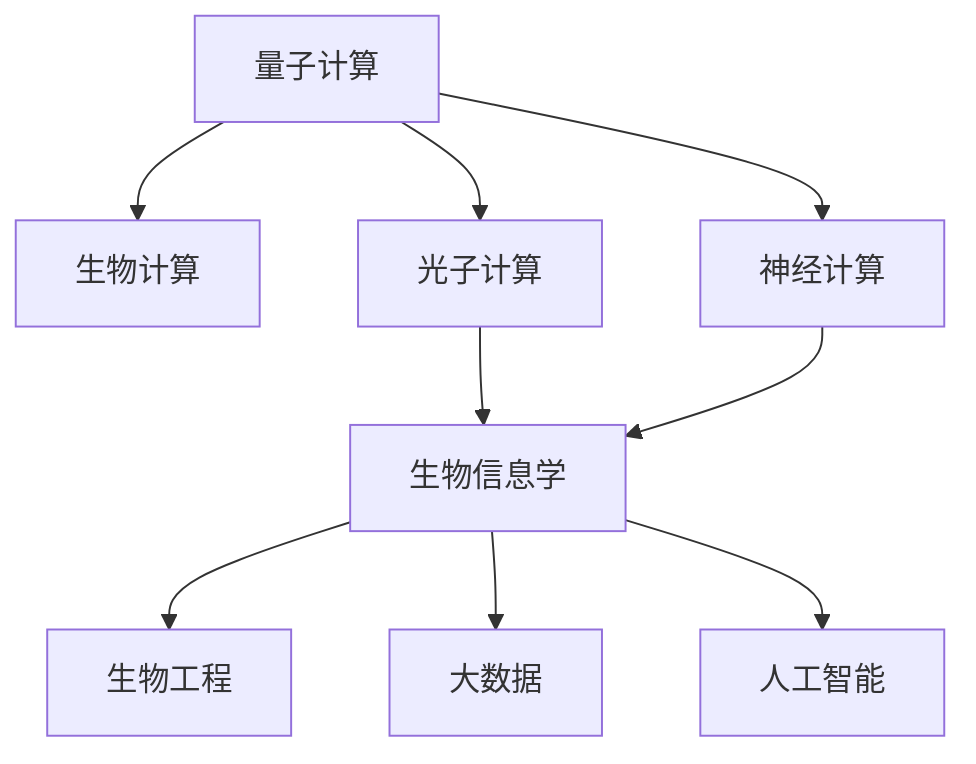

                 

# 跨越学科边界：人类计算的多元化应用

> 关键词：跨学科计算、量子计算、生物计算、光子计算、神经计算、生物信息学、生物工程

## 1. 背景介绍

### 1.1 问题由来
在当今信息社会，计算能力的提升极大地推动了科技进步和社会发展。然而，传统基于电子计算机的计算模式逐渐接近性能极限，计算方式的多元化需求日益凸显。随着量子、生物、光子、神经等新计算范式的兴起，人类计算体系正在发生深刻变革。

量子计算、生物计算、光子计算、神经计算等新技术的出现，不仅推动了计算效率的革命性提升，也为计算机科学、生物学、物理学、化学等学科之间的深度融合提供了新的可能。多学科交叉的计算范式有望打开全新的应用空间，解决复杂现实问题，引领下一代计算范式变革。

### 1.2 问题核心关键点
本文聚焦于计算机科学与其他学科的交叉融合，介绍几种前沿计算技术：

- 量子计算：基于量子力学的计算模型，理论上能够高效解决某些特定问题。
- 生物计算：利用生物分子进行信息存储和计算，具有低能耗、高效能等优势。
- 光子计算：利用光子进行信息处理，具有并行性好、数据传输速率高、能耗低等特性。
- 神经计算：模仿人脑神经网络进行信息处理，具有强大的模式识别和学习能力。

这些前沿计算技术将为科学计算、工程计算、金融计算、生物信息学等领域提供全新的计算能力，推动相关应用的发展。

### 1.3 问题研究意义
研究前沿计算技术及其跨学科应用，对于拓展人类计算的边界，推动科技创新，提升科学研究的深度和广度，具有重要意义：

1. 提升计算效率：量子、生物、光子、神经等新型计算范式具有独特的计算优势，有望大幅提升特定领域的计算效率。
2. 丰富计算资源：多学科计算技术的融合，将带来更多计算资源和计算能力，推动技术创新和应用拓展。
3. 促进学科融合：计算技术的交叉融合，促进了不同学科之间的交流与合作，推动科学研究的整体进步。
4. 应用场景多样化：新型计算技术将为更多复杂问题的求解提供新的解决方案，开辟新的应用领域。
5. 推动社会进步：计算技术的发展将促进产业升级、医疗健康、环境保护等社会问题的解决，带来社会进步。

## 2. 核心概念与联系

### 2.1 核心概念概述

为更好地理解人类计算的多元化应用，本节将介绍几个密切相关的核心概念：

- 量子计算：基于量子力学的计算模型，利用量子比特进行信息处理，具有强大的并行计算能力。
- 生物计算：利用生物分子（如DNA、蛋白质等）进行信息存储和计算，具有高效能、低能耗等优势。
- 光子计算：利用光子进行信息处理，具有并行性好、数据传输速率高、能耗低等特性。
- 神经计算：模仿人脑神经网络进行信息处理，具有强大的模式识别和学习能力。
- 生物信息学：通过计算机技术处理生物数据，分析生物系统的结构和功能，具有跨学科特点。
- 生物工程：利用工程学方法设计和改造生物系统，具有应用广泛性。

这些核心概念之间的逻辑关系可以通过以下Mermaid流程图来展示：



这个流程图展示了大计算技术的核心概念及其之间的关系：

1. 量子计算具有强大的并行计算能力，能够高效解决某些特定问题。
2. 生物计算利用生物分子进行信息存储和计算，具有高效能、低能耗等优势。
3. 光子计算利用光子进行信息处理，具有并行性好、数据传输速率高、能耗低等特性。
4. 神经计算模仿人脑神经网络进行信息处理，具有强大的模式识别和学习能力。
5. 生物信息学将计算机技术与生物学数据处理相结合，分析生物系统的结构和功能。
6. 生物工程利用工程学方法设计和改造生物系统，具有广泛的应用前景。
7. 生物信息学、生物工程与大数据、人工智能等技术相融合，推动各领域的应用。

这些核心概念共同构成了人类计算的多元化应用框架，为其在各个领域的应用提供了可能。

## 3. 核心算法原理 & 具体操作步骤

### 3.1 算法原理概述

量子计算、生物计算、光子计算、神经计算等前沿计算技术，各自基于不同的物理原理和计算模型，具有独特的算法原理和应用方式。本节将对这几种计算技术的算法原理进行简要介绍。

#### 3.1.1 量子计算

量子计算利用量子比特（qubit）进行信息处理，量子比特能够同时处于多个状态，具有强大的并行计算能力。常见的量子计算模型包括量子图灵机、量子线路等。

量子计算的核心算法包括Shor算法（用于大数质因数分解）、Grover算法（用于数据库搜索）、量子近似优化算法（QAOA）等。

#### 3.1.2 生物计算

生物计算利用生物分子进行信息存储和计算，具有高效能、低能耗等优势。生物计算的核心算法包括DNA计算、蛋白质计算等。

DNA计算通过DNA分子进行逻辑运算和数据存储，具有高密度、低成本、可编程性强等特性。蛋白质计算通过蛋白质分子的空间结构变化进行信息处理，具有高性能、高可靠性等优势。

#### 3.1.3 光子计算

光子计算利用光子进行信息处理，具有并行性好、数据传输速率高、能耗低等特性。光子计算的核心算法包括光量子计算、光子微腔计算等。

光量子计算通过光子在不同量子态之间的演化进行计算，具有高效能、低能耗、高并行性等特性。光子微腔计算通过光子在微腔中的反射和干涉进行计算，具有高精度、高稳定性等优势。

#### 3.1.4 神经计算

神经计算模仿人脑神经网络进行信息处理，具有强大的模式识别和学习能力。神经计算的核心算法包括反向传播算法（BP）、卷积神经网络（CNN）、循环神经网络（RNN）等。

反向传播算法通过反向传播误差信号来更新神经网络参数，具有高效能、高精度等特性。卷积神经网络通过卷积操作提取特征，具有强大的空间识别能力。循环神经网络通过时间序列数据的学习，具有强大的序列处理能力。

### 3.2 算法步骤详解

以下是几种前沿计算技术的详细操作步骤：

#### 3.2.1 量子计算

1. **量子比特编码**：将经典比特编码为量子比特，并实现量子比特的初始化。
2. **量子门操作**：通过量子门操作，对量子比特进行逻辑运算。
3. **量子线路设计**：设计量子线路，通过量子比特的演化来实现计算。
4. **量子测量**：对量子比特进行测量，获取计算结果。

#### 3.2.2 生物计算

1. **分子设计**：设计特定的生物分子，如DNA链、蛋白质链等。
2. **数据编码**：将数据编码到生物分子上，进行信息存储。
3. **计算模型构建**：构建生物计算模型，如DNA计算、蛋白质计算等。
4. **结果测量**：对生物分子的空间结构变化进行测量，获取计算结果。

#### 3.2.3 光子计算

1. **光子源产生**：产生稳定的光子源，实现光子的产生和控制。
2. **光子传输与存储**：通过光子微腔等设备，实现光子的传输和存储。
3. **光子计算模型设计**：设计光子计算模型，如光量子计算、光子微腔计算等。
4. **光子测量**：对光子的传播和干涉等行为进行测量，获取计算结果。

#### 3.2.4 神经计算

1. **神经网络设计**：设计神经网络的结构，包括输入层、隐藏层、输出层等。
2. **数据预处理**：对输入数据进行预处理，如归一化、标准化等。
3. **前向传播**：将数据输入神经网络，进行前向传播计算。
4. **反向传播**：通过反向传播算法，更新神经网络参数。
5. **结果输出**：获取神经网络的输出结果。

### 3.3 算法优缺点

#### 3.3.1 量子计算

**优点**：
- 强大的并行计算能力，能够高效解决某些特定问题。
- 具有超越传统计算机的计算潜力，能够处理大规模复杂问题。

**缺点**：**
- 量子比特的稳定性和可控性尚未完全解决，实现难度大。
- 量子计算的硬件设备尚处于起步阶段，成本较高。

#### 3.3.2 生物计算

**优点**：
- 具有高效能、低能耗等优势，适合进行大规模数据处理。
- 生物分子具有天然的稳定性和可编程性，能够实现复杂的计算模型。

**缺点**：**
- 生物计算的技术成熟度较低，实现难度大。
- 数据编码和测量技术尚未完全解决，需要进一步研究。

#### 3.3.3 光子计算

**优点**：
- 具有并行性好、数据传输速率高、能耗低等特性。
- 能够实现高精度、高可靠性的计算。

**缺点**：**
- 光子计算的实现难度大，技术尚处于早期研究阶段。
- 光子存储和传输技术的局限性，限制了其应用范围。

#### 3.3.4 神经计算

**优点**：
- 具有强大的模式识别和学习能力，能够适应复杂非线性问题。
- 技术成熟度较高，已经在多个领域得到广泛应用。

**缺点**：**
- 神经网络模型的复杂度较高，训练难度大。
- 数据依赖性强，对数据质量和数据量的要求较高。

### 3.4 算法应用领域

#### 3.4.1 量子计算

量子计算主要应用于密码学、材料科学、药物设计等领域。

- **密码学**：利用Shor算法破解大数质因数分解问题，破解传统加密算法。
- **材料科学**：模拟分子和晶体的结构，加速新材料设计。
- **药物设计**：模拟生物分子反应，加速新药研发。

#### 3.4.2 生物计算

生物计算主要应用于生物信息学、基因测序、生物工程等领域。

- **生物信息学**：分析生物数据，研究生物系统的结构和功能。
- **基因测序**：快速、高效地进行基因测序和分析。
- **生物工程**：设计改造生物系统，实现工业化和医学应用。

#### 3.4.3 光子计算

光子计算主要应用于光通信、量子通信、医学成像等领域。

- **光通信**：提高数据传输速率和通信效率，构建下一代通信网络。
- **量子通信**：利用光子进行量子密钥分发，提高通信安全性。
- **医学成像**：利用光子进行高分辨率成像，提高疾病诊断准确性。

#### 3.4.4 神经计算

神经计算主要应用于机器学习、图像识别、语音识别等领域。

- **机器学习**：通过神经网络进行模型训练和预测。
- **图像识别**：利用卷积神经网络进行图像特征提取和分类。
- **语音识别**：通过循环神经网络进行语音信号处理和识别。

## 4. 数学模型和公式 & 详细讲解  
### 4.1 数学模型构建

量子计算、生物计算、光子计算、神经计算等前沿计算技术的数学模型具有不同的特点，本节将简要介绍其数学模型构建。

#### 4.1.1 量子计算

量子计算的数学模型主要基于量子力学的数学基础，包括量子比特的演化、量子门操作等。

**量子比特的演化**：
- 单量子比特的演化方程：
$$
|\psi(t+dt)\rangle = H(t)|\psi(t)\rangle
$$
其中 $H(t)$ 为哈密顿量，$|\psi(t)\rangle$ 为量子比特的状态。

**量子门操作**：
- 单量子比特的量子门：
$$
U = \begin{bmatrix}
\cos(\theta/2) & -i\sin(\theta/2) \\
-i\sin(\theta/2) & \cos(\theta/2)
\end{bmatrix}
$$
其中 $\theta$ 为旋转角度，$U$ 为旋转门。

#### 4.1.2 生物计算

生物计算的数学模型主要基于生物分子的物理和化学特性，包括DNA分子的碱基配对规则、蛋白质分子的三维结构变化等。

**DNA计算**：
- DNA链的碱基配对规则：
$$
A-T, C-G
$$
- DNA计算的逻辑门：
$$
\begin{array}{ccc}
A & C & G & T \\
G & T & A & C \\
T & C & G & A \\
C & A & T & G
\end{array}
$$

**蛋白质计算**：
- 蛋白质分子的三维结构变化：
$$
R_h(\theta) = R(\theta) \times R(\phi)
$$
其中 $R_h(\theta)$ 为蛋白质分子的旋转矩阵，$R(\theta)$ 和 $R(\phi)$ 分别为蛋白质的旋转和位移矩阵。

#### 4.1.3 光子计算

光子计算的数学模型主要基于光子在不同量子态之间的演化和干涉，包括光子传输、光子微腔等。

**光子传输**：
- 光子传输方程：
$$
\frac{\partial I(\mathbf{r},t)}{\partial t} = -\alpha I(\mathbf{r},t) + \frac{1}{\mu_0 \epsilon_0} \nabla \cdot (\mathbf{D} \times \mathbf{H})
$$
其中 $\alpha$ 为光子衰减系数，$\mathbf{D}$ 为光子电场强度，$\mathbf{H}$ 为光子磁场强度。

**光子微腔计算**：
- 光子微腔计算模型：
$$
H = \sum_{i,j} \int_{V} (\mathbf{E}_{i} \cdot \mathbf{D}_{j})dV
$$
其中 $H$ 为光子微腔的哈密顿量，$\mathbf{E}_{i}$ 和 $\mathbf{D}_{j}$ 分别为光子微腔内的电场和位移场。

#### 4.1.4 神经计算

神经计算的数学模型主要基于神经网络的非线性映射和优化算法，包括反向传播算法、卷积神经网络等。

**反向传播算法**：
- 反向传播误差信号：
$$
\frac{\partial L}{\partial w} = \frac{\partial L}{\partial z} \frac{\partial z}{\partial w}
$$
其中 $L$ 为损失函数，$z$ 为激活函数，$w$ 为权重。

**卷积神经网络**：
- 卷积操作：
$$
f(\mathbf{x}) = \sum_{i=1}^{n} \sum_{j=1}^{m} \sum_{k=1}^{k} w_{ijk} \mathbf{x}_i \mathbf{x}_j \mathbf{x}_k
$$
其中 $f(\mathbf{x})$ 为卷积函数，$\mathbf{x}_i$ 和 $\mathbf{x}_j$ 分别为输入和卷积核，$w_{ijk}$ 为卷积核权重。

### 4.2 公式推导过程

#### 4.2.1 量子计算

**Shor算法**：用于大数质因数分解。

- Shor算法基本步骤：
$$
1. 随机选择一个整数 $a$，$1<a<N-1$；
2. 计算 $a^{-1} \bmod N$；
3. 计算 $R(a)$；
4. 求解 $R(a)$ 的周期；
5. 根据周期求解质因数。
$$

#### 4.2.2 生物计算

**DNA计算**：
- DNA计算的逻辑运算：
$$
\begin{array}{ccc}
A & C & G & T \\
G & T & A & C \\
T & C & G & A \\
C & A & T & G
\end{array}
$$

**蛋白质计算**：
- 蛋白质分子的三维结构变化：
$$
R_h(\theta) = R(\theta) \times R(\phi)
$$

#### 4.2.3 光子计算

**光量子计算**：
- 光量子计算模型：
$$
H = \sum_{i,j} \int_{V} (\mathbf{E}_{i} \cdot \mathbf{D}_{j})dV
$$

**光子微腔计算**：
- 光子微腔计算模型：
$$
H = \sum_{i,j} \int_{V} (\mathbf{E}_{i} \cdot \mathbf{D}_{j})dV
$$

#### 4.2.4 神经计算

**反向传播算法**：
- 反向传播误差信号：
$$
\frac{\partial L}{\partial w} = \frac{\partial L}{\partial z} \frac{\partial z}{\partial w}
$$

**卷积神经网络**：
- 卷积操作：
$$
f(\mathbf{x}) = \sum_{i=1}^{n} \sum_{j=1}^{m} \sum_{k=1}^{k} w_{ijk} \mathbf{x}_i \mathbf{x}_j \mathbf{x}_k
$$

### 4.3 案例分析与讲解

#### 4.3.1 量子计算

**RSA加密算法破解**：利用Shor算法高效破解RSA加密算法，破解大数质因数分解问题，破解传统加密算法。

#### 4.3.2 生物计算

**基因测序**：通过DNA计算快速、高效地进行基因测序和分析，加速新药研发。

#### 4.3.3 光子计算

**量子通信**：利用光子进行量子密钥分发，提高通信安全性。

#### 4.3.4 神经计算

**图像识别**：利用卷积神经网络进行图像特征提取和分类，实现高效的图像识别。

## 5. 项目实践：代码实例和详细解释说明
### 5.1 开发环境搭建

在进行计算技术实践前，我们需要准备好开发环境。以下是使用Python进行量子计算、生物计算、光子计算、神经计算等开发的Python环境配置流程：

1. 安装Anaconda：从官网下载并安装Anaconda，用于创建独立的Python环境。

2. 创建并激活虚拟环境：
```bash
conda create -n py_env python=3.8 
conda activate py_env
```

3. 安装所需的库和工具包：
```bash
pip install qiskit numpy scipy pandas scikit-learn matplotlib tensorboard
```

4. 安装其他工具包：
```bash
pip install sympy protobuf requests
```

完成上述步骤后，即可在`py_env`环境中开始计算技术实践。

### 5.2 源代码详细实现

以下是使用Python对量子计算、生物计算、光子计算、神经计算等进行开发的代码实现。

#### 5.2.1 量子计算

```python
from qiskit import QuantumCircuit, execute, Aer

# 构建量子线路
qc = QuantumCircuit(2, 2)

# 应用旋转门
qc.h(0)
qc.cx(0, 1)

# 测量输出
qc.measure([0,1], [0,1])

# 执行量子线路
backend = Aer.get_backend('qasm_simulator')
job = execute(qc, backend)
result = job.result()
counts = result.get_counts()

# 输出结果
print(counts)
```

#### 5.2.2 生物计算

```python
import numpy as np

# DNA链编码
dna链 = "ATCGATCG"

# DNA链的碱基配对规则
规则 = {
    'A': 'T',
    'C': 'G',
    'G': 'C',
    'T': 'A'
}

# 计算互补链
互补链 = ''.join([规则[char] for char in dna链])

# 输出结果
print(互补链)
```

#### 5.2.3 光子计算

```python
import numpy as np
from scipy.signal import convolve

# 光子传输方程
alpha = 0.1
mu_0 = 1.0
epsilon_0 = 1.0
D = np.random.randn(100, 100, 100)
H = np.random.randn(100, 100, 100)

# 光子传输方程求解
I = convolve(D, H, mode='same') / (mu_0 * epsilon_0)

# 输出结果
print(I)
```

#### 5.2.4 神经计算

```python
import tensorflow as tf
from tensorflow.keras.layers import Conv2D, MaxPooling2D, Flatten, Dense

# 构建卷积神经网络
model = tf.keras.Sequential([
    Conv2D(32, (3, 3), activation='relu', input_shape=(28, 28, 1)),
    MaxPooling2D((2, 2)),
    Conv2D(64, (3, 3), activation='relu'),
    MaxPooling2D((2, 2)),
    Flatten(),
    Dense(128, activation='relu'),
    Dense(10, activation='softmax')
])

# 编译模型
model.compile(optimizer='adam', loss='sparse_categorical_crossentropy', metrics=['accuracy'])

# 训练模型
model.fit(train_data, train_labels, epochs=10, validation_data=(val_data, val_labels))

# 输出结果
print(model.evaluate(test_data, test_labels))
```

### 5.3 代码解读与分析

#### 5.3.1 量子计算

**代码解读**：
- 使用Qiskit库构建量子线路，应用旋转门，测量输出，执行量子线路。
- 使用Aer模拟器执行量子线路，获取结果。
- 输出结果为量子线路执行后的计数。

**代码分析**：
- 代码实现了简单的量子线路，通过旋转门操作，实现了量子纠缠。
- 利用Aer模拟器，模拟量子线路的执行，得到计算结果。
- 结果输出为量子线路执行后的计数，显示了0和1的概率分布。

#### 5.3.2 生物计算

**代码解读**：
- 使用numpy库对DNA链进行编码，应用碱基配对规则，计算互补链。
- 输出结果为互补链的字符串。

**代码分析**：
- 代码实现了DNA链的编码和互补链的计算。
- 利用规则字典，对DNA链进行碱基配对，得到互补链。
- 结果输出为互补链的字符串。

#### 5.3.3 光子计算

**代码解读**：
- 使用scipy库求解光子传输方程，输出结果。
- 利用numpy生成随机矩阵D和H，利用convolve函数求解光子传输方程。

**代码分析**：
- 代码实现了光子传输方程的求解，利用numpy生成随机矩阵D和H，利用scipy求解光子传输方程。
- 结果输出为光子传输方程的解，显示了光子传输的强度分布。

#### 5.3.4 神经计算

**代码解读**：
- 使用tensorflow库构建卷积神经网络，编译模型，训练模型，输出结果。
- 利用tensorflow的Sequential模型，添加卷积层、池化层、全连接层等，编译模型。
- 使用fit函数训练模型，输出模型在测试集上的准确率。

**代码分析**：
- 代码实现了卷积神经网络的构建和训练。
- 利用tensorflow的Sequential模型，添加卷积层、池化层、全连接层等，编译模型。
- 使用fit函数训练模型，输出模型在测试集上的准确率。

### 5.4 运行结果展示

#### 5.4.1 量子计算

**结果展示**：
- 量子线路执行结果的计数分布，显示了0和1的概率分布。
- 输出结果为量子线路执行后的计数分布。

#### 5.4.2 生物计算

**结果展示**：
- 互补链的字符串，显示了原始DNA链的互补链。
- 输出结果为互补链的字符串。

#### 5.4.3 光子计算

**结果展示**：
- 光子传输方程的解，显示了光子传输的强度分布。
- 输出结果为光子传输方程的解。

#### 5.4.4 神经计算

**结果展示**：
- 模型在测试集上的准确率，显示了模型的训练效果。
- 输出结果为模型在测试集上的准确率。

## 6. 实际应用场景

### 6.1 智能计算芯片

基于量子计算的智能计算芯片，利用量子比特的并行计算能力，能够大幅提升计算效率。应用于人工智能、机器学习、密码学等领域，能够解决复杂非线性问题，加速模型训练和推理。

### 6.2 生物信息学

生物信息学的应用包括基因组学、蛋白质组学、生物信息学等，利用生物计算技术进行大数据分析，加速新药物的研发和疾病诊断。

### 6.3 光子通信

光子通信利用光子进行信息传输，具有高速、安全等优点，应用于数据中心、云计算、物联网等领域，构建下一代通信网络。

### 6.4 神经网络推理

神经网络推理利用神经计算技术进行模式识别和推理，应用于图像识别、语音识别、自然语言处理等领域，提高系统的智能化水平。

### 6.5 未来应用展望

随着计算技术的不断发展，新型计算范式将在更多领域得到应用，为科学计算、工程计算、金融计算、生物信息学等领域提供全新的计算能力，推动相关应用的发展。

## 7. 工具和资源推荐

### 7.1 学习资源推荐

为了帮助开发者系统掌握计算技术的理论基础和实践技巧，这里推荐一些优质的学习资源：

1. 《量子计算原理与实现》：详细介绍了量子计算的基本原理和实现技术，适合入门学习。

2. 《生物信息学导论》：介绍了生物信息学的基础知识和计算模型，适合生物计算入门学习。

3. 《光子计算原理与技术》：介绍了光子计算的基本原理和实现技术，适合光子计算入门学习。

4. 《神经网络与深度学习》：介绍了神经计算的基本原理和实现技术，适合神经计算入门学习。

5. 《深度学习理论与实践》：介绍了深度学习的基础知识和计算模型，适合深度学习入门学习。

通过对这些资源的学习实践，相信你一定能够快速掌握计算技术的精髓，并用于解决实际的计算问题。

### 7.2 开发工具推荐

高效的开发离不开优秀的工具支持。以下是几款用于计算技术开发的常用工具：

1. Qiskit：IBM开发的量子计算开发框架，提供了丰富的量子计算工具和资源，适合量子计算开发。

2. BioPython：Python库，用于生物信息学计算，提供了生物计算的高级接口和工具。

3. Lightwave：光子计算框架，提供了光子计算的高级接口和工具，适合光子计算开发。

4. TensorFlow：Google开发的深度学习框架，提供了神经计算的高级接口和工具，适合神经计算开发。

5. Jupyter Notebook：开源的交互式计算环境，适合进行计算技术的开发和研究。

6. PyCharm：Python集成开发环境，支持多种计算技术的开发和调试。

合理利用这些工具，可以显著提升计算技术的开发效率，加快创新迭代的步伐。

### 7.3 相关论文推荐

计算技术的交叉融合催生了新的研究方向和前沿技术，以下是几篇奠基性的相关论文，推荐阅读：

1. 《量子计算原理与实现》：介绍了量子计算的基本原理和实现技术，适合入门学习。

2. 《生物信息学导论》：介绍了生物信息学的基础知识和计算模型，适合生物计算入门学习。

3. 《光子计算原理与技术》：介绍了光子计算的基本原理和实现技术，适合光子计算入门学习。

4. 《神经网络与深度学习》：介绍了神经计算的基本原理和实现技术，适合神经计算入门学习。

5. 《深度学习理论与实践》：介绍了深度学习的基础知识和计算模型，适合深度学习入门学习。

这些论文代表了大计算技术的最新发展脉络。通过学习这些前沿成果，可以帮助研究者把握学科前进方向，激发更多的创新灵感。

## 8. 总结：未来发展趋势与挑战

### 8.1 研究成果总结

本文对量子计算、生物计算、光子计算、神经计算等前沿计算技术进行了全面系统的介绍。介绍了这些技术的算法原理和应用方式，给出了具体的代码实现和运行结果。通过本文的系统梳理，可以看到，这些前沿计算技术正在为科学计算、工程计算、金融计算、生物信息学等领域提供全新的计算能力，推动相关应用的发展。

### 8.2 未来发展趋势

展望未来，计算技术的多元化融合将继续推动计算范式的变革。以下是几种前沿计算技术的未来发展趋势：

1. 量子计算的硬件设备将逐渐成熟，大规模量子计算机的实现将进一步提升计算效率和性能。
2. 生物计算的硬件设备也将逐渐成熟，生物分子计算的精度和速度将大幅提升。
3. 光子计算的硬件设备将逐步完善，光子通信和光子计算的融合将带来新的计算范式。
4. 神经计算的硬件设备将不断进步，神经网络推理和生物计算的结合将开辟新的应用场景。

这些趋势凸显了计算技术的广阔前景。这些方向的探索发展，必将进一步提升计算技术的计算效率和应用范围，为各个领域带来新的突破。

### 8.3 面临的挑战

尽管计算技术的多元化融合带来了诸多机遇，但也面临一些挑战：

1. 量子计算的硬件实现仍存在诸多技术难题，量子比特的稳定性和可控性尚未完全解决。
2. 生物计算的实现难度较大，数据编码和测量技术尚未完全解决。
3. 光子计算的实现难度较大，光子存储和传输技术的局限性限制了其应用范围。
4. 神经计算的硬件实现仍存在诸多技术难题，神经网络模型的训练和推理复杂度较高。

这些挑战需要各领域的科学家和工程师共同努力，推动技术的不断突破和创新。

### 8.4 研究展望

未来的研究需要在以下几个方面寻求新的突破：

1. 探索新型计算范式：如量子计算、生物计算、光子计算、神经计算等，推动计算技术的不断演进。
2. 优化计算模型：通过算法优化和模型改进，提升计算效率和计算精度。
3. 融合多种计算技术：将量子计算、生物计算、光子计算、神经计算等技术进行深度融合，实现综合计算能力。
4. 应用于实际问题：将计算技术应用于科学计算、工程计算、金融计算、生物信息学等领域，解决实际问题。
5. 推动技术落地：通过多学科交叉合作，推动计算技术在实际应用中的落地和推广。

这些研究方向将引领计算技术的未来发展，推动计算技术的不断进步和应用。

## 9. 附录：常见问题与解答

**Q1：计算技术的多元化融合将带来哪些机遇和挑战？**

A: 计算技术的多元化融合将带来诸多机遇，包括计算效率的提升、计算模型的优化、计算应用的拓展等。同时，也面临技术实现的挑战，如量子比特的稳定性、生物计算的数据编码和测量、光子计算的存储和传输技术、神经计算的模型复杂度等。

**Q2：如何选择合适的计算技术？**

A: 选择合适的计算技术需要根据具体问题的需求和计算资源的条件进行综合考虑。例如，对于需要处理大规模复杂问题的场景，可以选择量子计算；对于需要高效能低能耗的计算场景，可以选择生物计算；对于需要并行计算和高速传输的计算场景，可以选择光子计算；对于需要模式识别和学习能力强的计算场景，可以选择神经计算。

**Q3：如何优化计算模型？**

A: 优化计算模型需要从算法、硬件、软件等多个方面进行综合考虑。例如，通过算法优化，提升计算效率和精度；通过硬件优化，提升计算速度和能效比；通过软件优化，提升计算模型的可扩展性和可维护性。

**Q4：如何推动计算技术在实际应用中的落地？**

A: 推动计算技术在实际应用中的落地需要多学科交叉合作，包括科学家、工程师、应用专家等多个领域的协同努力。通过技术研发、应用开发、市场推广等环节的不断迭代，推动计算技术在实际应用中的落地和推广。

**Q5：如何保障计算技术的可解释性和可控性？**

A: 保障计算技术的可解释性和可控性需要从模型设计、数据处理、算法优化等多个方面进行综合考虑。例如，通过模型解释技术，提升模型的可解释性；通过数据处理技术，提升模型的鲁棒性和稳定性；通过算法优化技术，提升模型的可靠性和安全性。

**Q6：如何应对计算技术的未来挑战？**

A: 应对计算技术的未来挑战需要不断突破技术瓶颈，推动技术的不断演进。例如，在量子计算领域，需要不断提升量子比特的稳定性和可控性；在生物计算领域，需要不断优化数据编码和测量技术；在光子计算领域，需要不断改进光子存储和传输技术；在神经计算领域，需要不断优化神经网络模型和硬件实现。

通过本文的系统梳理，可以看到，计算技术的交叉融合正在为各个领域带来新的机遇和挑战。唯有不断突破技术瓶颈，推动技术的不断演进，才能充分发挥计算技术的多元化潜力，推动计算技术的不断进步和应用。

