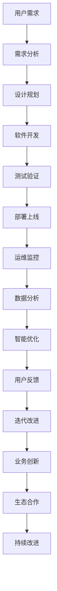

                 

## 1. 背景介绍

### 1.1 问题由来

在信息化时代，软件系统的复杂性和规模不断扩大，对企业和个人的影响日益显著。传统软件开发方法如瀑布模型、迭代开发等逐渐显现出其局限性，无法适应快速变化的市场需求。新的软件范式亟需出现，以解决现有问题，并推动行业进步。

软件2.0（Software 2.0）的概念由此诞生，标志着从以编程为中心的软件开发模式，向以用户为中心、基于数据的软件生态演进。这一转变通过引入自动化、智能化的技术手段，提升软件交付效率，降低开发和运维成本，从而创造出巨大的商业和社会价值。

### 1.2 问题核心关键点

软件2.0的核心关键点在于：
- 自动化：引入机器学习和人工智能技术，自动化处理代码生成、测试、部署等任务，显著提升软件开发效率。
- 智能系统：构建基于用户行为数据和反馈的智能系统，自动优化软件功能和用户体验。
- 数据驱动：通过分析用户行为数据和市场趋势，驱动软件开发方向和决策，确保软件竞争力。
- 生态协作：构建开放式的软件生态系统，促进协作创新，加速软件价值变现。
- 安全性：运用区块链、分布式等技术手段，提升软件系统的安全性和可靠性。

这些关键点共同构成了软件2.0的核心价值，旨在通过技术创新，提升软件系统的智能化和自动化水平，实现软件产业的数字化转型。

## 2. 核心概念与联系

### 2.1 核心概念概述

软件2.0的核心理念主要体现在以下几个概念中：

- **软件即服务(SaaS)**：通过云计算平台提供软件服务，用户按需使用，降低了系统维护和升级的复杂度。
- **微服务架构(MSA)**：将大型系统拆分成多个独立的服务，通过轻量级通信机制和独立部署，提升系统的灵活性和可扩展性。
- **DevOps**：将软件开发和运维紧密结合，实现自动化持续集成和持续交付，提升软件交付速度和质量。
- **云计算(Cloud Computing)**：提供弹性的计算资源和存储，支持大规模分布式应用，加速软件创新和迭代。
- **人工智能与机器学习(ML/AI)**：引入自动化和智能算法，优化软件开发流程，提升系统性能和用户体验。

这些概念彼此关联，共同构成了软件2.0的核心生态。下面我们将通过一个Mermaid流程图，展示它们之间的联系：

```mermaid
graph TB
    A[软件即服务(SaaS)] --> B[微服务架构(MSA)]
    A --> C[DevOps]
    B --> D[云计算(Cloud Computing)]
    D --> E[人工智能与机器学习(ML/AI)]
    A --> F[数据驱动] --> G[安全性]
    C --> H[自动化]
    E --> I[智能系统]
```

### 2.2 核心概念原理和架构的 Mermaid 流程图

在构建软件2.0生态时，可以通过如下的Mermaid流程图来展示其核心架构：



这个流程图展示了软件2.0从需求收集、设计、开发、测试到部署和运营的全过程，同时强调了数据驱动和智能优化的重要性。其中，数据分析和智能优化环节相互关联，共同构成了一个动态的反馈环路，不断提升软件系统的性能和用户体验。

## 3. 核心算法原理 & 具体操作步骤

### 3.1 算法原理概述

软件2.0的核心算法主要围绕自动化和智能化展开，具体包括：

- **自动化代码生成**：利用AI技术，自动生成代码和配置文件，提升开发效率。
- **自动化测试**：通过机器学习算法，自动识别和修复代码中的错误和漏洞。
- **持续集成与持续交付(CI/CD)**：实现代码的自动化集成和交付，提升软件交付速度和质量。
- **智能化运维**：利用数据挖掘和预测分析，自动化处理系统监控、故障诊断和恢复。
- **智能推荐系统**：通过用户行为数据分析，智能推荐产品和服务，提升用户体验。

### 3.2 算法步骤详解

下面是软件2.0核心算法的详细步骤：

#### 3.2.1 自动化代码生成

1. **需求分析**：通过问卷调查、用户访谈等方式，收集用户需求，生成需求文档。
2. **设计规划**：利用UML等工具，将需求文档转换为设计文档，包括系统架构、模块划分、数据流等。
3. **代码生成**：使用代码生成工具，根据设计文档自动生成代码和配置文件。
4. **代码验证**：利用静态代码分析工具，检查代码的规范性和安全性，进行自动化测试。

#### 3.2.2 自动化测试

1. **测试用例设计**：根据需求文档，设计自动化测试用例，包括单元测试、集成测试和系统测试。
2. **测试执行**：使用自动化测试框架，执行测试用例，记录测试结果。
3. **测试优化**：利用机器学习算法，分析测试结果，自动生成优化建议，提升测试覆盖率和效率。

#### 3.2.3 持续集成与持续交付

1. **版本控制**：使用Git等版本控制系统，管理代码的变更和历史。
2. **集成构建**：通过CI工具，自动化构建和编译代码，生成可执行文件或部署包。
3. **持续交付**：利用CD工具，自动部署应用程序到测试、预生产和生产环境，实现快速发布。

#### 3.2.4 智能化运维

1. **监控报警**：通过实时监控工具，收集系统日志和性能指标，设置报警规则。
2. **故障诊断**：使用机器学习算法，自动分析故障原因，生成故障报告。
3. **恢复处理**：根据故障报告，自动触发恢复操作，修复系统故障。

#### 3.2.5 智能推荐系统

1. **数据采集**：通过API或SDK，收集用户行为数据，包括点击、浏览、购买等。
2. **数据处理**：对原始数据进行清洗、转换和特征工程，生成适合机器学习算法的输入数据。
3. **模型训练**：使用协同过滤、内容推荐等算法，训练推荐模型。
4. **推荐生成**：根据用户当前行为和历史数据，生成个性化推荐结果。

### 3.3 算法优缺点

软件2.0的算法具有以下优点：
- **提升效率**：自动化和智能化技术手段，显著提升软件开发的效率和质量。
- **降低成本**：减少了人工干预，降低了开发和运维成本。
- **增强创新**：智能系统和数据分析，帮助企业快速响应市场变化，提升产品竞争力。
- **提高用户体验**：智能推荐系统和智能化运维，改善用户体验，提升用户满意度。

同时，软件2.0的算法也存在以下缺点：
- **技术门槛高**：引入新技术，对开发者和运维人员的要求较高。
- **数据隐私问题**：用户行为数据涉及隐私，需要采取严格的保护措施。
- **系统复杂性**：引入大量新工具和系统，增加了系统的复杂性和维护难度。
- **成本投入大**：初期引入新技术需要大量投入，包括硬件、软件和人力成本。

### 3.4 算法应用领域

软件2.0的算法广泛应用于多个领域：

- **电商行业**：通过智能推荐系统，提升用户购物体验和转化率。
- **金融行业**：利用自动化测试和持续集成，提升金融产品的开发效率和稳定性。
- **制造业**：通过智能运维系统，提升生产线设备的运行效率和安全性。
- **医疗行业**：通过数据分析和智能诊断，提升医疗服务质量和效率。
- **教育行业**：利用智能化学习系统，提升教学质量和个性化教育水平。

## 4. 数学模型和公式 & 详细讲解 & 举例说明

### 4.1 数学模型构建

软件2.0的算法通常基于以下数学模型：

- **机器学习模型**：用于自动化测试、智能化运维和智能推荐系统，包括监督学习、无监督学习和强化学习等。
- **统计模型**：用于需求分析和用户行为预测，包括回归分析、聚类分析和时间序列分析等。
- **优化模型**：用于资源分配和任务调度，包括线性规划、整数规划和混合整数规划等。

### 4.2 公式推导过程

下面以机器学习模型为例，介绍其基本推导过程：

假设我们的目标是构建一个二分类模型，用于自动化测试的错误率预测。我们的数据集为$D=\{(x_i,y_i)\}_{i=1}^N$，其中$x_i$为输入特征，$y_i$为输出标签（0表示错误，1表示正确）。我们的目标是找到一个模型$f(x)$，使得预测错误率最小化。

我们可以使用逻辑回归模型，其公式为：

$$
f(x) = \sigma(\theta^T x)
$$

其中$\theta$为模型参数，$\sigma$为激活函数（通常使用sigmoid函数）。

我们的目标函数为：

$$
L(y,f(x)) = -\frac{1}{N}\sum_{i=1}^N[y_i\log f(x_i) + (1-y_i)\log(1-f(x_i))]
$$

通过最小化目标函数，我们可以得到最优参数$\theta^*$。具体推导过程如下：

1. 对目标函数求导，得到梯度$\frac{\partial L(y,f(x))}{\partial \theta}$。
2. 根据梯度下降算法，更新模型参数$\theta$：

$$
\theta \leftarrow \theta - \eta \frac{\partial L(y,f(x))}{\partial \theta}
$$

其中$\eta$为学习率，通常设置为0.01。

### 4.3 案例分析与讲解

下面以电商行业的智能推荐系统为例，具体分析其算法实现。

电商网站收集了用户的浏览记录和购买历史，我们想要根据这些数据为用户推荐商品。我们的数据集为$D=\{(x_i,y_i)\}_{i=1}^N$，其中$x_i$为用户行为序列，$y_i$为购买记录（1表示购买，0表示未购买）。我们的目标是找到一个模型$f(x)$，使得推荐准确率最大化。

我们可以使用协同过滤算法，其基本思想是利用用户行为数据构建用户-商品矩阵，通过计算相似度推荐商品。具体步骤如下：

1. **数据预处理**：对原始数据进行清洗、转换和特征工程，生成适合协同过滤算法的输入数据。
2. **构建相似度矩阵**：根据用户行为序列，构建用户-商品相似度矩阵$A$，其中$A_{ij}$表示用户$i$对商品$j$的兴趣程度。
3. **求解推荐结果**：利用矩阵乘法和向量运算，求解推荐结果矩阵$B$，其中$B_{ij}$表示商品$j$对用户$i$的推荐度。
4. **推荐排序**：根据推荐度排序，选取用户感兴趣的商品进行推荐。

## 5. 项目实践：代码实例和详细解释说明

### 5.1 开发环境搭建

在进行软件2.0的算法实践前，我们需要准备好开发环境。以下是使用Python进行Jupyter Notebook开发的环境配置流程：

1. 安装Anaconda：从官网下载并安装Anaconda，用于创建独立的Python环境。

2. 创建并激活虚拟环境：
```bash
conda create -n software-env python=3.8 
conda activate software-env
```

3. 安装必要的库：
```bash
conda install numpy pandas scikit-learn matplotlib tqdm jupyter notebook ipython
```

4. 安装Jupyter Notebook：
```bash
conda install jupyterlab
```

完成上述步骤后，即可在`software-env`环境中开始项目实践。

### 5.2 源代码详细实现

下面以电商行业的智能推荐系统为例，给出使用Python和TensorFlow实现协同过滤算法的代码实现。

首先，定义协同过滤算法的核心函数`collaborative_filtering`：

```python
import numpy as np
from scipy.sparse import csr_matrix

def collaborative_filtering(data, k=10):
    N = len(data)
    I = np.eye(N)
    A = np.dot(data.values, data.values) + I
    A = csr_matrix(A)
    U = np.random.rand(N, k)
    V = np.random.rand(N, k)
    X = np.dot(U, V.T)
    X = np.dot(X, A)
    X = np.dot(X, V)
    return X
```

然后，加载并处理数据：

```python
import pandas as pd

# 加载数据
data = pd.read_csv('user_item.csv', sep='\t')

# 数据处理
data = data.dropna().drop_duplicates()
data = data.groupby('user_id')['item_id'].agg(lambda x: list(x.values)).unstack().reset_index().fillna(0)
data.columns = ['user_id'] + [f'item_id_{i}' for i in range(data.shape[1])]
```

接着，执行协同过滤算法，生成推荐结果：

```python
# 运行协同过滤算法
X = collaborative_filtering(data)

# 生成推荐结果
def get_recommendation(user_id, N=10):
    # 获取用户对商品的评分
    scores = X.iloc[user_id]
    # 根据评分排序
    idx = scores.argsort()[::-1]
    # 获取最受欢迎的N个商品
    recommendations = data.iloc[idx[1:]][['item_id']].to_dict(orient='records')
    return recommendations

# 测试推荐系统
recommendation = get_recommendation(123456)
print(recommendation)
```

### 5.3 代码解读与分析

让我们再详细解读一下关键代码的实现细节：

**collaborative_filtering函数**：
- 根据用户行为数据构建相似度矩阵$A$。
- 利用奇异值分解(SVD)算法，求解推荐结果矩阵$X$。

**数据处理**：
- 加载用户-商品评分数据，并去除重复和缺失值。
- 将评分矩阵转化为稀疏矩阵，便于后续计算。

**推荐生成**：
- 根据用户评分排序，生成推荐结果。

**测试推荐系统**：
- 使用推荐函数生成推荐结果，并打印输出。

可以看到，通过Python和TensorFlow等工具，我们能够轻松实现协同过滤算法的代码实现。开发者可以将更多精力放在算法设计和数据处理上，而不必过多关注底层的实现细节。

## 6. 实际应用场景

### 6.1 电商行业

基于软件2.0的算法，电商行业可以实现以下应用场景：

- **个性化推荐**：利用智能推荐系统，根据用户历史行为数据，为用户推荐感兴趣的商品。
- **库存管理**：通过实时监控和预测分析，优化库存水平，减少库存积压和缺货风险。
- **客户服务**：使用聊天机器人，自动解答用户咨询，提升客户满意度。
- **数据分析**：利用大数据分析工具，挖掘用户行为模式，指导产品设计和市场推广。

### 6.2 金融行业

在金融行业，软件2.0的算法可以实现以下应用场景：

- **风险评估**：通过数据分析和机器学习算法，评估借款人的信用风险，降低坏账率。
- **投资策略**：利用算法模型，自动生成和优化投资组合，提升投资回报率。
- **金融监控**：实时监控市场动态，预测和预警金融风险。
- **客户服务**：通过智能客服系统，自动化处理客户咨询，提高服务效率。

### 6.3 制造业

在制造业，软件2.0的算法可以实现以下应用场景：

- **设备维护**：通过物联网数据，实时监控设备状态，预测设备故障，提前进行维护。
- **生产调度**：利用优化算法，优化生产流程和资源分配，提高生产效率。
- **质量控制**：通过数据分析和机器学习算法，自动检测和识别产品缺陷，提高产品质量。
- **供应链管理**：优化供应链网络，降低库存成本，提升供应链响应速度。

### 6.4 未来应用展望

随着软件2.0技术的发展，未来在更多领域将会看到更多的应用场景，如智慧医疗、智慧教育、智慧城市等。

- **智慧医疗**：通过数据分析和智能诊断系统，提高医疗服务质量和效率。
- **智慧教育**：利用智能学习系统和推荐系统，提升教学效果和个性化教育水平。
- **智慧城市**：通过数据分析和智能系统，提升城市管理和公共服务水平。

## 7. 工具和资源推荐

### 7.1 学习资源推荐

为了帮助开发者系统掌握软件2.0的理论基础和实践技巧，这里推荐一些优质的学习资源：

1. **《深度学习》课程**：斯坦福大学的Coursera课程，涵盖了深度学习的基础理论和常用算法。
2. **《Python编程：从入门到实践》**：适合初学者的Python编程指南，包括数据分析、机器学习等模块。
3. **TensorFlow官方文档**：TensorFlow的官方文档，提供了丰富的代码示例和API文档，适合快速上手。
4. **Kaggle竞赛平台**：数据科学和机器学习竞赛平台，提供海量数据集和模型评测工具。
5. **机器学习书籍**：如《机器学习实战》、《统计学习方法》等，适合深入学习和实践。

通过对这些资源的学习实践，相信你一定能够快速掌握软件2.0的核心算法和实践技巧，并用于解决实际的业务问题。

### 7.2 开发工具推荐

高效的开发离不开优秀的工具支持。以下是几款用于软件2.0算法开发的常用工具：

1. **Jupyter Notebook**：用于编写和运行Python代码的交互式环境，支持多种库和框架。
2. **TensorFlow**：Google开源的深度学习框架，支持分布式训练和GPU加速。
3. **PyTorch**：Facebook开源的深度学习框架，支持动态计算图和丰富的API。
4. **Scikit-learn**：Python数据挖掘和机器学习库，包含常用算法和工具。
5. **Pandas**：Python数据分析库，支持数据处理和可视化。

合理利用这些工具，可以显著提升软件2.0算法的开发效率，加快创新迭代的步伐。

### 7.3 相关论文推荐

软件2.0的发展源于学界的持续研究。以下是几篇奠基性的相关论文，推荐阅读：

1. **《软件即服务：一种新的计算模式》**：软件即服务的定义和核心思想。
2. **《微服务架构：构建可伸缩、可维护的软件系统》**：微服务架构的设计和实现。
3. **《DevOps：持续集成和持续交付实践指南》**：DevOps的实践方法和工具。
4. **《云计算：数据中心自动化管理》**：云计算技术和管理。
5. **《机器学习实战》**：介绍常用机器学习算法和实践案例。

这些论文代表了大数据和软件2.0领域的发展脉络。通过学习这些前沿成果，可以帮助研究者把握学科前进方向，激发更多的创新灵感。

## 8. 总结：未来发展趋势与挑战

### 8.1 总结

本文对软件2.0的价值和核心算法进行了全面系统的介绍。首先阐述了软件2.0的背景和意义，明确了其提升效率、创造价值的独特价值。其次，从原理到实践，详细讲解了软件2.0的核心算法和具体操作步骤，给出了算法实现和应用实例。同时，本文还广泛探讨了软件2.0在电商、金融、制造等多个行业领域的应用前景，展示了软件2.0的巨大潜力。此外，本文精选了软件2.0技术的各类学习资源，力求为读者提供全方位的技术指引。

通过本文的系统梳理，可以看到，软件2.0技术正在成为软件产业的重要范式，极大地提升了软件开发的效率和质量，创造了巨大的商业和社会价值。未来，伴随软件2.0技术的持续演进，相信软件产业将迎来更加智能化、自动化的发展新阶段。

### 8.2 未来发展趋势

展望未来，软件2.0技术将呈现以下几个发展趋势：

1. **自动化程度更高**：引入更多智能算法和工具，自动化处理更多开发和运维任务。
2. **智能化水平提升**：构建更加智能的软件生态，实现更加灵活和高效的业务自动化。
3. **云计算和分布式技术普及**：利用云计算和分布式技术，构建弹性可扩展的软件系统。
4. **数据驱动的决策支持**：通过大数据分析，实现更加智能和精准的决策支持。
5. **人机协同的交互体验**：利用智能推荐系统和对话系统，提升用户体验和交互体验。
6. **区块链和安全性增强**：利用区块链技术，提升软件系统的安全性和透明性。

以上趋势凸显了软件2.0技术的广阔前景。这些方向的探索发展，必将进一步提升软件系统的智能化和自动化水平，实现软件产业的数字化转型。

### 8.3 面临的挑战

尽管软件2.0技术已经取得了瞩目成就，但在迈向更加智能化、普适化应用的过程中，它仍面临着诸多挑战：

1. **技术门槛高**：引入新技术，对开发者和运维人员的要求较高。
2. **数据隐私问题**：用户行为数据涉及隐私，需要采取严格的保护措施。
3. **系统复杂性**：引入大量新工具和系统，增加了系统的复杂性和维护难度。
4. **成本投入大**：初期引入新技术需要大量投入，包括硬件、软件和人力成本。
5. **性能瓶颈**：大规模数据和复杂算法的处理，可能导致系统性能瓶颈。
6. **安全性风险**：自动化和智能系统可能存在安全漏洞，需要强化安全防护。

正视软件2.0面临的这些挑战，积极应对并寻求突破，将是大数据和软件2.0技术迈向成熟的必由之路。相信随着学界和产业界的共同努力，这些挑战终将一一被克服，软件2.0必将在构建人机协同的智能时代中扮演越来越重要的角色。

### 8.4 研究展望

面对软件2.0所面临的种种挑战，未来的研究需要在以下几个方面寻求新的突破：

1. **技术创新**：开发更加智能和高效的软件工具，降低技术门槛，提升开发效率。
2. **隐私保护**：研究数据隐私保护技术，保障用户数据安全，建立信任基础。
3. **系统优化**：优化软件系统架构，降低系统复杂性，提高可维护性。
4. **成本控制**：探索低成本的软件部署和运维方法，降低系统建设成本。
5. **性能提升**：提升软件系统的性能和稳定性，优化计算资源使用。
6. **安全性保障**：研究安全防护技术，保障软件系统的安全性和可靠性。

这些研究方向的探索，必将引领软件2.0技术迈向更高的台阶，为构建更加智能化、可靠的软件系统铺平道路。面向未来，软件2.0技术还需要与其他人工智能技术进行更深入的融合，如知识表示、因果推理、强化学习等，多路径协同发力，共同推动软件产业的数字化转型。只有勇于创新、敢于突破，才能不断拓展软件系统的边界，让软件技术更好地服务于人类社会。

## 9. 附录：常见问题与解答

**Q1：软件2.0与软件即服务(SaaS)有什么区别？**

A: 软件2.0和软件即服务(SaaS)虽然都强调软件服务的灵活性和易用性，但软件2.0更注重软件开发的自动化和智能化。软件2.0强调通过引入机器学习和自动化技术，提升软件开发的效率和质量，降低开发和运维成本，实现软件系统的持续创新和优化。

**Q2：软件2.0如何提升软件开发效率？**

A: 软件2.0通过引入自动化和智能化技术，如自动化代码生成、持续集成和持续交付、智能推荐系统等，显著提升了软件开发效率。自动化技术减少了人工干预，缩短了开发周期，提高了开发质量。智能化技术则通过分析用户行为数据和市场趋势，驱动软件开发方向和决策，实现快速响应和持续改进。

**Q3：软件2.0的应用场景有哪些？**

A: 软件2.0的应用场景非常广泛，包括电商、金融、制造、医疗、教育等多个领域。在电商领域，智能推荐系统提升了用户购物体验和转化率。在金融领域，风险评估和投资策略优化提高了金融产品的竞争力和安全性。在制造领域，设备维护和生产调度优化提高了生产效率和质量。在医疗领域，智能诊断和数据分析提升了医疗服务水平。在教育领域，智能学习系统和个性化推荐提升了教学效果和用户体验。

**Q4：软件2.0的算法需要哪些技术支持？**

A: 软件2.0的算法需要多种技术支持，包括大数据分析、机器学习、自然语言处理、云计算、区块链等。大数据分析用于处理和分析用户行为数据，机器学习用于自动化测试和智能推荐系统，自然语言处理用于智能客服和对话系统，云计算用于支持弹性的计算资源和存储，区块链用于增强软件系统的透明性和安全性。

**Q5：如何保障软件2.0系统的安全性？**

A: 保障软件2.0系统的安全性需要从多个方面入手。首先，需要采用先进的加密和解密技术，保护用户数据的安全性。其次，需要引入安全审计和监控系统，实时检测和防御安全威胁。最后，需要建立完善的安全策略和机制，制定安全操作指南和应急响应计划。

---

作者：禅与计算机程序设计艺术 / Zen and the Art of Computer Programming

