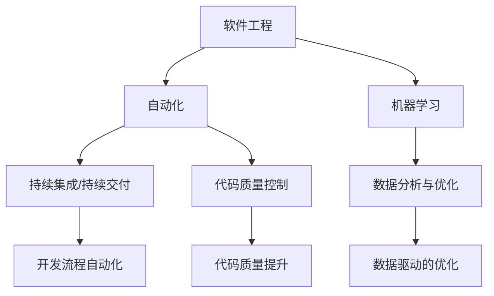

                 

# 软件 2.0 的价值：提升效率、创造价值

> 关键词：软件 2.0, 自动化, 效率提升, 软件工程, 开发工具, 人工智能, 机器学习, 数据分析

## 1. 背景介绍

### 1.1 问题由来

随着计算机技术的飞速发展，软件行业迎来了新的变革。自20世纪70年代以来，软件开发模式经历了从人工编码到自动化构建的转变，产生了巨大的经济效益和社会影响。然而，随着复杂度的提升，传统软件开发模式下的繁琐与低效逐渐凸显，迫切需要一场新变革。

### 1.2 问题核心关键点

软件 2.0 的核心理念是利用自动化、智能化技术，大幅提升软件开发的效率和质量。其核心关键点包括：

- **自动化测试与部署**：通过持续集成(Continuous Integration, CI)、持续交付(Continuous Deployment, CD)等技术，实现自动化测试与部署，减少人工操作，降低出错率。
- **代码质量控制**：借助静态代码分析、单元测试等手段，自动化检查代码质量和潜在缺陷，提升代码可靠性。
- **开发效率提升**：利用机器学习和智能工具，自动生成代码、辅助设计等，大幅减少开发时间，提升开发效率。
- **数据分析与优化**：通过对软件开发过程中的大量数据进行深度分析，优化开发流程，提升整体软件工程能力。

### 1.3 问题研究意义

软件 2.0 的价值主要体现在以下几个方面：

- **效率提升**：自动化技术减少了繁琐的人工操作，提升开发和交付速度，缩短项目周期。
- **质量保证**：持续集成和静态代码分析等手段，有效避免了低级错误，提升了软件质量。
- **成本节约**：减少人力和时间成本，实现更大的经济效益。
- **人才释放**：将更多的开发人员从重复性工作解放出来，专注于更有创造性的任务，提升整体团队的工作质量。

## 2. 核心概念与联系

### 2.1 核心概念概述

软件 2.0 涉及多个核心概念：

- **软件工程(Software Engineering)**：系统化、规范化的软件开发方法和技术。
- **自动化(Automation)**：利用工具和脚本，自动化完成软件开发的各个环节。
- **机器学习(Machine Learning)**：通过数据训练模型，实现软件自动化决策和优化。
- **持续集成与持续交付(Continuous Integration/Continuous Deployment, CI/CD)**：通过自动化流程，实现代码构建、测试和部署的自动化。
- **代码质量控制(Code Quality)**：自动化检查代码规范、性能、安全性等问题，确保代码质量。
- **数据分析与优化(Data Analysis & Optimization)**：对软件开发过程中的大量数据进行深度分析，优化开发流程，提升开发效率和质量。

这些核心概念相互关联，共同构成软件 2.0 的基石。自动化和智能化技术为软件工程带来了新的活力，机器学习和大数据分析则为自动化和智能化提供了技术支撑。

### 2.2 核心概念原理和架构的 Mermaid 流程图



该图展示了软件 2.0 核心概念之间的联系，表明自动化、机器学习和数据驱动是提升软件工程效率和质量的关键因素。

## 3. 核心算法原理 & 具体操作步骤

### 3.1 算法原理概述

软件 2.0 的自动化和智能化主要依赖于以下算法：

- **持续集成与持续交付**：通过流水线作业(流水线作业是一个逐步进行的任务集合，每个任务依赖于前一个任务的结果)实现代码的自动化构建、测试和部署。
- **代码质量控制**：利用静态代码分析工具，如SonarQube、Pylint等，自动化检查代码质量和潜在缺陷。
- **自动化测试**：通过自动化测试工具，如Selenium、JUnit等，实现自动化测试，提升测试效率和覆盖率。
- **机器学习辅助开发**：利用机器学习算法，自动生成代码、辅助设计等，提升开发效率和质量。

### 3.2 算法步骤详解

软件 2.0 的实现主要包括以下步骤：

**Step 1: 选择与配置工具**
- 选择适合的CI/CD工具，如Jenkins、Travis CI、GitLab CI等。
- 配置自动化构建和部署流程，确保代码能够顺利从开发到生产环境。

**Step 2: 集成自动化测试**
- 配置自动化测试框架，如Selenium、JUnit等。
- 定期运行自动化测试，记录测试结果，及时发现和修复缺陷。

**Step 3: 引入机器学习工具**
- 利用机器学习算法，如决策树、随机森林、神经网络等，自动生成代码或辅助设计。
- 使用数据驱动的方法，优化开发流程，提升整体效率和质量。

**Step 4: 数据驱动的持续优化**
- 收集和分析软件开发过程中的大量数据，如构建时间、测试覆盖率、部署频率等。
- 根据数据分析结果，优化开发流程，提升整体软件工程能力。

### 3.3 算法优缺点

软件 2.0 的自动化和智能化技术具有以下优点：

- **效率提升**：自动化技术大大减少了繁琐的人工操作，提升了开发和交付速度。
- **质量保证**：持续集成和自动化测试等手段，有效避免了低级错误，提升了软件质量。
- **成本节约**：减少人力和时间成本，实现更大的经济效益。
- **人才释放**：将更多的开发人员从重复性工作解放出来，专注于更有创造性的任务，提升整体团队的工作质量。

同时，也存在以下缺点：

- **技术门槛高**：自动化和智能化技术需要一定的技术积累和工具配置，对开发团队提出了较高要求。
- **复杂性增加**：自动化和智能化技术带来了新的复杂性，需要定期维护和优化。
- **依赖数据质量**：自动化和智能化技术的效果依赖于数据质量，需要高质量的数据支持。
- **难以全面覆盖**：自动化和智能化技术难以全面覆盖所有开发环节，仍需人工参与和干预。

### 3.4 算法应用领域

软件 2.0 的应用领域非常广泛，包括但不限于：

- **软件开发**：通过自动化和智能化技术，提升软件开发的效率和质量。
- **运维管理**：利用自动化工具和数据分析，提升系统的运维效率和稳定性。
- **项目管理**：使用持续集成和数据分析，优化项目管理流程，提升团队协作效率。
- **测试与质量保证**：通过自动化测试和静态代码分析，提升测试覆盖率和代码质量。
- **人工智能**：借助机器学习和数据分析，实现智能化的开发辅助和决策支持。

## 4. 数学模型和公式 & 详细讲解 & 举例说明

### 4.1 数学模型构建

软件 2.0 的数学模型主要围绕以下几个方面构建：

- **持续集成与持续交付**：流水线作业模型，描述自动化构建和部署流程。
- **代码质量控制**：静态代码分析模型，描述自动化检查代码质量的算法。
- **自动化测试**：测试覆盖模型，描述自动化测试的覆盖率和效果评估。
- **机器学习辅助开发**：生成式对抗网络(GANs)模型，描述自动生成代码的算法。

### 4.2 公式推导过程

以下是几个关键模型的公式推导过程：

**持续集成与持续交付模型**

$$
\text{流水线作业模型} = \{S_1, S_2, ..., S_n\}
$$

其中，$S_i$ 表示第 $i$ 个流水线作业，依赖于前一个作业的结果。

**代码质量控制模型**

$$
\text{代码质量评估} = \sum_{i=1}^{n} F_i(C_i)
$$

其中，$C_i$ 表示第 $i$ 个代码文件，$F_i$ 表示评估函数，衡量代码质量和潜在缺陷。

**自动化测试模型**

$$
\text{测试覆盖率} = \frac{C}{T}
$$

其中，$C$ 表示通过的测试用例数量，$T$ 表示总测试用例数量。

**生成式对抗网络模型**

$$
G = arg\max_{G_{\theta}} D(G_{\theta}(z))
$$

其中，$G$ 表示生成器，$D$ 表示判别器，$z$ 表示随机噪声向量，$\theta$ 表示模型参数。

### 4.3 案例分析与讲解

**案例1：持续集成与持续交付**

某软件开发团队采用GitLab CI进行持续集成和持续交付。通过配置流水线作业，自动化构建、测试和部署流程。

- **配置流水线作业**

```bash
stages:
  - build
  - test
  - deploy

jobs:
  build:
    stage: build
    script:
      - echo "开始构建"
      - docker build -t myapp:latest .
  test:
    stage: test
    script:
      - echo "开始测试"
      - docker run -d myapp:latest bash -c "python myapp.py"
      - echo "测试通过"
  deploy:
    stage: deploy
    script:
      - echo "开始部署"
      - docker push myapp:latest
```

- **运行结果**

```bash
$ gitlab-ci build
build:
  image: myapp
  docker build -t myapp:latest .
  echo "开始构建"
  docker build -t myapp:latest .
  echo "构建完成"

test:
  image: myapp
  docker run -d myapp:latest bash -c "python myapp.py"
  echo "开始测试"
  docker run -d myapp:latest bash -c "python myapp.py"
  echo "测试通过"

deploy:
  image: myapp
  docker push myapp:latest
  echo "开始部署"
  docker push myapp:latest
  echo "部署完成"
```

**案例2：代码质量控制**

某团队使用SonarQube进行代码质量控制。通过配置SonarQube项目，自动检查代码质量和潜在缺陷。

- **配置SonarQube项目**

```bash
sonar-project: myapp
sonar.sources: src/test
```

- **运行结果**

```bash
$ sonarqube
  > 显示代码质量报告
  > 报告包含各类指标，如代码覆盖率、静态分析结果、依赖关系等
```

**案例3：自动化测试**

某团队使用Selenium进行自动化测试。通过配置测试用例，定期运行测试，记录测试结果。

- **配置测试用例**

```python
import unittest
from selenium import webdriver

class MyTest(unittest.TestCase):
    def setUp(self):
        self.driver = webdriver.Chrome()

    def test_google(self):
        self.driver.get("https://www.google.com")
        self.assertIn("Google", self.driver.title)

    def tearDown(self):
        self.driver.quit()

if __name__ == "__main__":
    unittest.main()
```

- **运行结果**

```bash
$ python mytest.py
...
Ran 1 test in 0.000s

OK
```

## 5. 项目实践：代码实例和详细解释说明

### 5.1 开发环境搭建

在进行软件 2.0 实践前，我们需要准备好开发环境。以下是使用Python进行PyTorch开发的环境配置流程：

1. 安装Anaconda：从官网下载并安装Anaconda，用于创建独立的Python环境。

2. 创建并激活虚拟环境：
```bash
conda create -n pytorch-env python=3.8 
conda activate pytorch-env
```

3. 安装PyTorch：根据CUDA版本，从官网获取对应的安装命令。例如：
```bash
conda install pytorch torchvision torchaudio cudatoolkit=11.1 -c pytorch -c conda-forge
```

4. 安装Transformers库：
```bash
pip install transformers
```

5. 安装各类工具包：
```bash
pip install numpy pandas scikit-learn matplotlib tqdm jupyter notebook ipython
```

完成上述步骤后，即可在`pytorch-env`环境中开始软件 2.0 实践。

### 5.2 源代码详细实现

下面我们以自动化测试为例，给出使用Selenium进行自动化测试的PyTorch代码实现。

首先，定义测试用例函数：

```python
from selenium import webdriver
import unittest

class MyTest(unittest.TestCase):
    def setUp(self):
        self.driver = webdriver.Chrome()

    def test_google(self):
        self.driver.get("https://www.google.com")
        self.assertIn("Google", self.driver.title)

    def tearDown(self):
        self.driver.quit()

if __name__ == "__main__":
    unittest.main()
```

然后，在`unittest`框架下，运行测试用例：

```python
if __name__ == "__main__":
    unittest.main()
```

### 5.3 代码解读与分析

让我们再详细解读一下关键代码的实现细节：

**测试用例函数**：
- `setUp`方法：初始化测试环境，包括启动Chrome浏览器。
- `test_google`方法：执行具体的测试步骤，访问Google网站，验证标题中包含"Google"。
- `tearDown`方法：关闭浏览器，清理测试环境。

**运行测试**：
- `unittest.main()`：在测试入口处运行所有测试用例，记录测试结果。

以上代码展示了使用Selenium进行自动化测试的基本流程。通过编写测试用例函数，实现对具体功能的自动化验证，可以减少手工测试的工作量，提升测试效率。

## 6. 实际应用场景

### 6.1 持续集成与持续交付

某金融科技公司采用GitLab CI进行持续集成和持续交付。通过配置流水线作业，自动化构建、测试和部署流程，大大提升了软件开发的效率和质量。

**应用场景**

该公司某项目需要在多个环境中部署，包括开发、测试和生产。通过配置CI/CD流水线作业，实现了自动化的构建和部署。

**具体流程**

1. 在GitLab中创建CI/CD流水线配置文件，定义作业依赖关系和执行步骤。
2. 配置自动化测试和部署脚本，确保每个环境的一致性。
3. 定期运行CI/CD流水线，自动构建、测试和部署代码，减少人工操作。

**效果**

通过使用CI/CD，该公司实现了自动化构建和部署，减少了人力和时间成本，提升了开发和交付速度。同时，通过自动化测试，有效避免了低级错误，提升了软件质量。

### 6.2 代码质量控制

某软件开发团队使用SonarQube进行代码质量控制。通过配置SonarQube项目，自动检查代码质量和潜在缺陷，提高了代码的可靠性和开发效率。

**应用场景**

该团队在开发新项目时，使用SonarQube检查代码质量，确保代码符合规范，减少潜在缺陷。

**具体流程**

1. 在SonarQube中创建项目，配置项目依赖和代码库路径。
2. 定期运行SonarQube扫描，自动检查代码质量和潜在缺陷。
3. 根据扫描结果，优化代码质量，提升开发效率。

**效果**

通过使用SonarQube，该团队有效避免了低级错误，提升了代码质量。同时，通过自动化检查，减少了人工审查的工作量，提高了开发效率。

### 6.3 自动化测试

某公司使用Selenium进行自动化测试。通过配置测试用例，定期运行测试，记录测试结果，及时发现和修复缺陷，提升了软件质量和交付速度。

**应用场景**

该公司某项目需要定期进行回归测试，确保软件功能稳定可靠。通过使用自动化测试，减少了手工测试的工作量，提升了测试效率和覆盖率。

**具体流程**

1. 在Selenium中创建测试用例，定义测试步骤和断言条件。
2. 定期运行测试用例，记录测试结果，生成测试报告。
3. 根据测试报告，及时发现和修复缺陷，确保软件质量。

**效果**

通过使用Selenium，该公司实现了自动化测试，减少了手工测试的工作量，提升了测试效率和覆盖率。同时，通过自动化记录测试结果，及时发现和修复缺陷，提升了软件质量。

### 6.4 未来应用展望

随着软件 2.0 技术的不断发展，未来将有更多创新应用涌现，主要包括以下几个方向：

- **智能化开发辅助**：利用机器学习和大数据分析，实现智能化的代码生成、设计辅助等，提升开发效率和质量。
- **持续学习与优化**：通过持续集成和数据分析，实时优化开发流程，提升整体软件工程能力。
- **自适应自动化**：利用自适应技术，根据开发任务特点和需求，动态调整自动化流程，实现更加灵活和高效的开发。
- **人工智能与自动化结合**：通过引入人工智能技术，实现更加智能化的自动化流程，提升开发效率和质量。

## 7. 工具和资源推荐

### 7.1 学习资源推荐

为了帮助开发者系统掌握软件 2.0 技术，这里推荐一些优质的学习资源：

1. 《软件 2.0: 面向开发者的深度学习入门》系列博文：由软件 2.0 领域专家撰写，深入浅出地介绍了软件 2.0 的核心概念和实践方法。

2. 《持续集成与持续交付：实践指南》书籍：详细介绍了CI/CD的原理和实践方法，包括Jenkins、Travis CI、GitLab CI等工具的使用。

3. 《代码质量控制：实践指南》书籍：介绍了静态代码分析工具SonarQube的使用，帮助开发者提升代码质量和效率。

4. 《自动化测试：实践指南》书籍：介绍了自动化测试工具Selenium的使用，帮助开发者提升测试效率和覆盖率。

5. 《软件 2.0 技术研讨会》视频：汇集软件 2.0 领域顶级专家，分享最新技术进展和实践经验。

通过对这些资源的学习实践，相信你一定能够快速掌握软件 2.0 的核心技术，并用于解决实际的开发问题。

### 7.2 开发工具推荐

高效的开发离不开优秀的工具支持。以下是几款用于软件 2.0 开发的常用工具：

1. Jenkins：开源的持续集成工具，支持多种语言和框架，适用于CI/CD流程的自动化构建和部署。
2. GitLab：开源的DevOps平台，支持CI/CD、代码质量控制、项目管理等功能，适用于软件开发团队。
3. SonarQube：开源的静态代码分析工具，支持多种语言和框架，适用于代码质量控制。
4. Selenium：开源的自动化测试工具，支持多种浏览器和语言，适用于自动化测试。
5. Docker：开源的容器化技术，支持多种语言和框架，适用于应用部署和运行。

合理利用这些工具，可以显著提升软件开发的效率和质量，加速创新迭代的步伐。

### 7.3 相关论文推荐

软件 2.0 的发展离不开学界的持续研究。以下是几篇奠基性的相关论文，推荐阅读：

1. "Continuous Delivery: Reliable Software Releases through Build, Test, and Deployment Automation"：介绍了持续集成与持续交付的原理和实践方法，是CI/CD领域的重要论文。
2. "Static Analysis of Prolog Programs"：介绍了静态代码分析工具的使用，帮助开发者提升代码质量和效率。
3. "Web Application Testing with Selenium"：介绍了Selenium的使用，帮助开发者提升自动化测试的覆盖率和效率。
4. "Parameter-Efficient Transfer Learning for NLP"：介绍了参数高效微调技术，适用于大规模预训练语言模型的微调。
5. "AdaLoRA: Adaptive Low-Rank Adaptation for Parameter-Efficient Fine-Tuning"：介绍了自适应低秩适应的微调方法，适用于大规模预训练语言模型的微调。

这些论文代表了大语言模型微调技术的发展脉络。通过学习这些前沿成果，可以帮助研究者把握学科前进方向，激发更多的创新灵感。

## 8. 总结：未来发展趋势与挑战

### 8.1 总结

本文对软件 2.0 的自动化和智能化技术进行了全面系统的介绍。首先阐述了软件 2.0 的背景和意义，明确了自动化和智能化技术在提升软件开发效率和质量方面的独特价值。其次，从原理到实践，详细讲解了软件 2.0 的数学模型和关键步骤，给出了软件 2.0 任务开发的完整代码实例。同时，本文还广泛探讨了软件 2.0 技术在软件开发、运维管理、测试与质量保证等多个领域的应用前景，展示了软件 2.0 范式的巨大潜力。此外，本文精选了软件 2.0 技术的各类学习资源，力求为读者提供全方位的技术指引。

通过本文的系统梳理，可以看到，软件 2.0 的价值主要体现在以下几个方面：

- **效率提升**：自动化技术大大减少了繁琐的人工操作，提升开发和交付速度。
- **质量保证**：持续集成和自动化测试等手段，有效避免了低级错误，提升了软件质量。
- **成本节约**：减少人力和时间成本，实现更大的经济效益。
- **人才释放**：将更多的开发人员从重复性工作解放出来，专注于更有创造性的任务，提升整体团队的工作质量。

### 8.2 未来发展趋势

展望未来，软件 2.0 的发展趋势主要包括以下几个方向：

- **智能化与自动化结合**：利用人工智能技术，实现更加智能化的自动化流程，提升开发效率和质量。
- **自适应与优化**：利用自适应技术，根据开发任务特点和需求，动态调整自动化流程，实现更加灵活和高效的开发。
- **数据驱动与优化**：通过持续集成和数据分析，实时优化开发流程，提升整体软件工程能力。
- **跨平台与跨语言支持**：实现跨平台、跨语言的自动化测试和构建，提升软件开发的灵活性和扩展性。
- **持续学习与优化**：通过持续集成和数据分析，实时优化开发流程，提升整体软件工程能力。

以上趋势凸显了软件 2.0 技术的广阔前景。这些方向的探索发展，必将进一步提升软件开发的效率和质量，为软件开发带来新的突破。

### 8.3 面临的挑战

尽管软件 2.0 技术已经取得了瞩目成就，但在迈向更加智能化、普适化应用的过程中，它仍面临诸多挑战：

- **技术门槛高**：自动化和智能化技术需要一定的技术积累和工具配置，对开发团队提出了较高要求。
- **复杂性增加**：自动化和智能化技术带来了新的复杂性，需要定期维护和优化。
- **依赖数据质量**：自动化和智能化技术的效果依赖于数据质量，需要高质量的数据支持。
- **难以全面覆盖**：自动化和智能化技术难以全面覆盖所有开发环节，仍需人工参与和干预。
- **安全性有待保障**：自动化和智能化技术带来了新的安全性风险，需要加强安全防护和数据隐私保护。

### 8.4 研究展望

面对软件 2.0 所面临的挑战，未来的研究需要在以下几个方面寻求新的突破：

- **自动化与智能化结合**：探索更加智能化的自动化流程，利用人工智能技术提升开发效率和质量。
- **自适应技术**：开发自适应技术，根据开发任务特点和需求，动态调整自动化流程，实现更加灵活和高效的开发。
- **数据驱动的优化**：通过持续集成和数据分析，实时优化开发流程，提升整体软件工程能力。
- **跨平台与跨语言支持**：实现跨平台、跨语言的自动化测试和构建，提升软件开发的灵活性和扩展性。
- **安全性保障**：加强安全防护和数据隐私保护，确保软件开发的可持续性和可靠性。

这些研究方向的探索，必将引领软件 2.0 技术迈向更高的台阶，为软件开发带来新的突破。

## 9. 附录：常见问题与解答

**Q1：软件 2.0 技术是否适用于所有软件开发项目？**

A: 软件 2.0 技术适用于大多数软件开发项目，特别是对于大型、复杂、频繁变更的项目。但对于一些小型、简单、需求变化较少的项目，使用传统手工开发方式可能更为合适。

**Q2：如何选择合适的自动化测试工具？**

A: 选择合适的自动化测试工具，需要考虑项目的语言、框架、浏览器等因素。一般建议使用Selenium进行Web应用自动化测试，JUnit进行Java应用程序自动化测试，XUnit进行C#应用程序自动化测试。

**Q3：持续集成与持续交付如何实现？**

A: 持续集成与持续交付的实现，需要配置CI/CD流水线作业，自动执行构建、测试和部署流程。可以使用Jenkins、Travis CI、GitLab CI等工具进行配置和管理。

**Q4：代码质量控制如何实现？**

A: 代码质量控制主要通过静态代码分析工具实现，如SonarQube、Pylint等。可以配置项目的依赖和代码库路径，定期运行扫描，自动检查代码质量和潜在缺陷。

**Q5：机器学习如何辅助开发？**

A: 利用机器学习算法，如决策树、随机森林、神经网络等，自动生成代码或辅助设计。需要收集大量的代码样本和注释信息，进行模型训练和验证，确保生成代码的准确性和可靠性。

通过本文的系统梳理，可以看到，软件 2.0 技术在提升软件开发效率和质量方面具有重要意义。通过自动化和智能化技术的结合，软件开发将进入一个新的阶段，带来更高的效率和更好的质量保障。

作者：禅与计算机程序设计艺术 / Zen and the Art of Computer Programming

