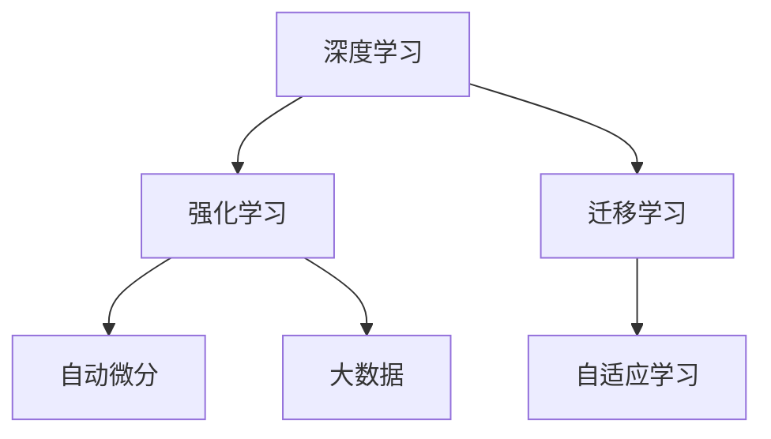

                 

# 软件 2.0 的发展趋势：深度学习、强化学习

> 关键词：深度学习,强化学习,算法优化,模型训练,超参数调优,自动微分,自适应学习,迁移学习,大数据,泛化能力

## 1. 背景介绍

### 1.1 问题由来

随着计算机技术和互联网的迅猛发展，软件应用已经渗透到社会生产的各个领域。从早期的软件 1.0 时代，基于逻辑规则和结构化数据处理的软件系统，到后来软件 2.0 时代的深度学习和大数据驱动的应用，软件技术的演进在不断刷新我们的认知。在软件 2.0 时代，深度学习、强化学习等人工智能技术正在以前所未有的速度和深度改变软件开发的范式。

### 1.2 问题核心关键点

软件 2.0 的核心在于如何利用深度学习、强化学习等先进算法，构建具备自我学习能力、高效适应的智能软件系统。这些技术正在被应用于图像识别、语音识别、自然语言处理、机器人控制等诸多领域，极大地推动了人工智能和软件工程的发展。

目前，深度学习、强化学习在软件开发中的应用已经取得了显著的成果。例如，通过深度学习，谷歌的AlphaGo在围棋比赛中击败了世界冠军，DeepMind的AlphaStar在星际争霸中也获得了胜利。强化学习则在自动驾驶、机器人路径规划、游戏AI等领域展现了强大的潜力。这些应用的成功，使得深度学习、强化学习成为软件 2.0 时代的重要引擎。

### 1.3 问题研究意义

研究软件 2.0 的发展趋势，对提升软件系统的智能水平、推动自动化、智能化应用具有重要意义：

1. 提升软件系统性能。深度学习、强化学习算法能够自动学习最优的模型和策略，从而提升软件系统的性能和适应性。
2. 降低开发成本。基于先进算法构建的软件系统，能够自动化处理大量数据和复杂任务，减少人工干预和调试成本。
3. 拓展应用场景。深度学习、强化学习的普及，为更多领域的软件应用提供了新的可能性。
4. 加速技术创新。算法的发展和应用催生了新的技术方向，如自适应学习、迁移学习等，促进了软件技术的进步。
5. 推动产业升级。基于深度学习、强化学习的软件应用，在医疗、金融、教育等领域提供了更高效、更准确的服务，赋能行业升级。

## 2. 核心概念与联系

### 2.1 核心概念概述

为更好地理解软件 2.0 的发展趋势，本节将介绍几个关键概念：

- 深度学习(Deep Learning)：一种基于神经网络的机器学习算法，能够处理非线性和高维数据，广泛应用于图像、语音、自然语言处理等领域。
- 强化学习(Reinforcement Learning)：一种通过试错学习最优策略的算法，广泛应用于游戏、机器人控制、自动化决策等领域。
- 迁移学习(Transfer Learning)：利用已有模型在相关领域的数据上进行的微调，以提升新任务的性能。
- 自适应学习(Adaptive Learning)：根据数据和环境变化动态调整模型参数，提高模型泛化能力和适应性。
- 自动微分(Automatic Differentiation)：利用计算机自动计算函数导数，加速模型训练和优化。
- 大数据(Big Data)：指海量、多样、实时化的大型数据集，为深度学习和强化学习提供了强有力的数据支撑。

这些概念之间的逻辑关系可以通过以下Mermaid流程图来展示：



这个流程图展示了一系列关键概念的相互关系：

1. 深度学习为强化学习提供了模型基础。
2. 强化学习在深度学习基础上，通过试错学习获取最优策略。
3. 迁移学习能够将已有模型的知识应用到新任务中，加速学习过程。
4. 自适应学习能够根据数据变化动态调整模型，提高泛化能力。
5. 自动微分技术加速了模型训练和优化，提升了学习效率。
6. 大数据为深度学习和强化学习提供了丰富的数据源。

这些概念共同构成了软件 2.0 的核心技术框架，推动着软件系统向更加智能化、自动化方向发展。通过理解这些核心概念，我们可以更好地把握软件 2.0 的演变趋势。

## 3. 核心算法原理 & 具体操作步骤
### 3.1 算法原理概述

深度学习、强化学习的原理分别基于神经网络和奖励机制，在优化目标和算法框架上有所不同。以下分别介绍深度学习和强化学习的算法原理。

### 3.2 算法步骤详解

#### 3.2.1 深度学习

深度学习算法通常包括以下几个关键步骤：

1. 数据预处理：包括数据清洗、归一化、分割等步骤，准备好用于模型训练的数据。
2. 模型构建：选择适合的神经网络结构，并进行参数初始化。
3. 前向传播：将输入数据输入模型，计算模型的输出。
4. 损失函数计算：计算模型输出与真实标签之间的误差，得到损失函数。
5. 反向传播：利用梯度下降等优化算法，根据损失函数对模型参数进行更新。
6. 模型评估：在验证集上评估模型性能，选择最优模型。

#### 3.2.2 强化学习

强化学习算法通常包括以下几个关键步骤：

1. 环境设计：定义一个可交互的环境，其中包含状态、动作和奖励等元素。
2. 策略设计：选择合适的策略函数，如Q-learning、SARSA等，定义如何从状态到动作进行映射。
3. 模型训练：在环境中不断试错，逐步优化策略函数，使模型能够学习到最优策略。
4. 状态值估计：通过评估函数，估计当前状态的价值，指导后续动作选择。
5. 参数更新：根据奖励反馈，更新模型参数，调整策略函数。
6. 模型评估：在测试集上评估模型性能，选择最优模型。

### 3.3 算法优缺点

深度学习、强化学习各有优缺点：

#### 深度学习

- 优点：能够处理复杂非线性数据，具有强大的表示和建模能力，适用于大规模数据集。
- 缺点：模型复杂度高，需要大量标注数据，训练时间长，容易过拟合。

#### 强化学习

- 优点：能够自动学习最优策略，适应性强，适用于无法获取标注数据的任务。
- 缺点：学习过程依赖于环境，难以控制，容易陷入局部最优。

### 3.4 算法应用领域

深度学习、强化学习在软件开发中的应用广泛，以下列举几个典型应用场景：

1. 图像识别：通过深度学习算法，如图像分类、目标检测、图像分割等，可以实现自动化的图像处理和识别。
2. 自然语言处理：通过深度学习算法，如文本分类、情感分析、机器翻译等，可以实现自然语言的理解与生成。
3. 机器人控制：通过强化学习算法，如路径规划、避障、游戏AI等，可以实现智能机器人的自主决策和控制。
4. 自动化测试：通过深度学习算法，如代码相似度检测、缺陷检测等，可以提高软件测试的自动化程度和准确性。
5. 推荐系统：通过深度学习算法，如协同过滤、内容推荐等，可以实现个性化推荐，提升用户体验。
6. 异常检测：通过深度学习算法，如异常检测、数据清洗等，可以提高系统的稳定性和可靠性。

## 4. 数学模型和公式 & 详细讲解  
### 4.1 数学模型构建

以下分别介绍深度学习和强化学习的数学模型构建。

#### 4.1.1 深度学习

深度学习模型的数学模型通常包括：

- 输入层：$X$，表示输入数据。
- 隐藏层：$H$，表示模型的内部表示。
- 输出层：$Y$，表示模型输出结果。
- 损失函数：$L$，用于衡量模型输出与真实标签之间的差异。
- 权重和偏置：$W$、$b$，用于模型参数调整。

假设深度学习模型的结构如图 1 所示，其数学模型可表示为：

$$
Y=f(X,W,b,H)
$$

其中 $f$ 为模型的非线性映射函数。

损失函数 $L$ 通常使用交叉熵损失、均方误差损失等，用于衡量模型输出与真实标签之间的误差。

$$
L(Y,\hat{Y})=\frac{1}{N}\sum_{i=1}^N \ell(Y_i,\hat{Y_i})
$$

其中 $\ell$ 为具体的损失函数，$N$ 为数据集大小。

#### 4.1.2 强化学习

强化学习的数学模型通常包括：

- 状态 $S$：表示环境中的当前状态。
- 动作 $A$：表示环境中的可能动作。
- 奖励 $R$：表示在特定状态下采取特定动作后获得的奖励。
- 策略 $\pi$：表示在特定状态下采取特定动作的概率分布。
- 状态值函数 $V$：表示在特定状态下，采取特定动作后的预期奖励。

强化学习的数学模型可以表示为：

$$
V(S)=\sum_{s'}R(s,a,s')\pi(a|S,s')
$$

其中 $s'$ 表示下一个状态，$R$ 表示奖励。

强化学习的目标是通过策略 $\pi$ 使得总奖励最大化。

### 4.2 公式推导过程

#### 4.2.1 深度学习

以下以简单的前馈神经网络为例，推导损失函数的梯度计算公式。

假设前馈神经网络的模型结构如图 2 所示，其中 $X$ 为输入数据，$H$ 为隐藏层，$W$ 和 $b$ 为权重和偏置，$Y$ 为输出结果。

图 1：深度学习模型结构
图 2：前馈神经网络结构

假设输出层为二分类问题，损失函数为交叉熵损失。

$$
L(Y,\hat{Y})=-\frac{1}{N}\sum_{i=1}^N[y_i\log \hat{y_i}+(1-y_i)\log(1-\hat{y_i})]
$$

其中 $y_i$ 为真实标签，$\hat{y_i}$ 为模型预测结果。

根据链式法则，损失函数对参数 $W$ 的梯度计算公式为：

$$
\frac{\partial L(Y,\hat{Y})}{\partial W}=\frac{1}{N}\sum_{i=1}^N\left[(y_i-\hat{y_i})\frac{\partial \hat{y_i}}{\partial Z} \frac{\partial Z}{\partial W}\right]
$$

其中 $Z=WX+b$ 为隐藏层输出。

对 $\frac{\partial \hat{y_i}}{\partial Z}$ 使用sigmoid函数导数进行计算：

$$
\frac{\partial \hat{y_i}}{\partial Z}=\hat{y_i}(1-\hat{y_i})
$$

对 $\frac{\partial Z}{\partial W}$ 使用矩阵乘法求导：

$$
\frac{\partial Z}{\partial W}=X
$$

将上述公式代入，得到梯度计算公式：

$$
\frac{\partial L(Y,\hat{Y})}{\partial W}=\frac{1}{N}\sum_{i=1}^N\left[(y_i-\hat{y_i})\hat{y_i}(1-\hat{y_i})X_i\right]
$$

其中 $X_i$ 为输入数据的第 $i$ 个样本。

#### 4.2.2 强化学习

以下以Q-learning算法为例，推导Q值函数的梯度计算公式。

Q-learning算法是一种基于状态-动作-奖励的强化学习算法。假设环境中的状态 $S$ 有 $n$ 个，动作 $A$ 有 $m$ 个。

假设当前状态为 $s_i$，采取动作 $a_i$ 后，下一个状态为 $s_{i+1}$，获得奖励 $r_i$。根据Q-learning算法，Q值函数 $Q(s,a)$ 可以表示为：

$$
Q(s,a)=r+\gamma\max_{a'}Q(s',a')
$$

其中 $\gamma$ 为折扣因子，$a'$ 为可能的下一个动作。

Q值函数 $Q(s,a)$ 的梯度计算公式为：

$$
\frac{\partial Q(s,a)}{\partial W}=\frac{\partial [r+\gamma\max_{a'}Q(s',a')]_{Q(s,a)}}{\partial W}
$$

根据链式法则，可以得到：

$$
\frac{\partial Q(s,a)}{\partial W}=\frac{\partial [r+\gamma\max_{a'}Q(s',a')]_{Q(s,a)}}{\partial Q(s,a)}\frac{\partial Q(s,a)}{\partial W}
$$

其中：

$$
\frac{\partial [r+\gamma\max_{a'}Q(s',a')]_{Q(s,a)}}{\partial Q(s,a)}=1
$$

因此，Q值函数的梯度计算公式为：

$$
\frac{\partial Q(s,a)}{\partial W}=\frac{\partial r+\gamma\max_{a'}Q(s',a')}{\partial Q(s,a)}
$$

将Q值函数的定义代入，可以得到：

$$
\frac{\partial Q(s,a)}{\partial W}=\frac{\partial r+\gamma\max_{a'}(r+\gamma\max_{a'}Q(s',a'))}{\partial Q(s,a)}
$$

进一步展开，可以得到：

$$
\frac{\partial Q(s,a)}{\partial W}=\frac{\partial r+\gamma\sum_{a'}\max_{a'}(Q(s',a'))}{\partial Q(s,a)}
$$

## 5. 项目实践：代码实例和详细解释说明
### 5.1 开发环境搭建

在进行深度学习和强化学习项目开发前，我们需要准备好开发环境。以下是使用Python进行PyTorch和TensorFlow开发的环境配置流程：

1. 安装Anaconda：从官网下载并安装Anaconda，用于创建独立的Python环境。

2. 创建并激活虚拟环境：
```bash
conda create -n pytorch-env python=3.8 
conda activate pytorch-env
```

3. 安装PyTorch：根据CUDA版本，从官网获取对应的安装命令。例如：
```bash
conda install pytorch torchvision torchaudio cudatoolkit=11.1 -c pytorch -c conda-forge
```

4. 安装TensorFlow：根据CUDA版本，从官网获取对应的安装命令。例如：
```bash
pip install tensorflow==2.7
```

5. 安装各类工具包：
```bash
pip install numpy pandas scikit-learn matplotlib tqdm jupyter notebook ipython
```

完成上述步骤后，即可在`pytorch-env`环境中开始项目实践。

### 5.2 源代码详细实现

这里我们以深度学习模型训练和强化学习路径规划为例，给出使用PyTorch和TensorFlow进行项目开发的PyTorch代码实现。

#### 5.2.1 深度学习

首先，定义深度学习模型：

```python
import torch.nn as nn
import torch

class Net(nn.Module):
    def __init__(self):
        super(Net, self).__init__()
        self.fc1 = nn.Linear(784, 256)
        self.fc2 = nn.Linear(256, 10)
        
    def forward(self, x):
        x = x.view(-1, 784)
        x = torch.relu(self.fc1(x))
        x = self.fc2(x)
        return x
```

然后，定义损失函数和优化器：

```python
import torch.optim as optim

model = Net()
criterion = nn.CrossEntropyLoss()
optimizer = optim.SGD(model.parameters(), lr=0.001, momentum=0.9)
```

接着，定义训练和评估函数：

```python
from torch.utils.data import Dataset, DataLoader
from tqdm import tqdm

class MNISTDataset(Dataset):
    def __init__(self, data, targets):
        self.data = data
        self.targets = targets
        
    def __len__(self):
        return len(self.data)
    
    def __getitem__(self, idx):
        return self.data[idx], self.targets[idx]

train_dataset = MNISTDataset(train_data, train_targets)
test_dataset = MNISTDataset(test_data, test_targets)

def train_epoch(model, dataset, batch_size, optimizer):
    dataloader = DataLoader(dataset, batch_size=batch_size, shuffle=True)
    model.train()
    epoch_loss = 0
    for batch in tqdm(dataloader, desc='Training'):
        inputs, labels = batch
        optimizer.zero_grad()
        outputs = model(inputs)
        loss = criterion(outputs, labels)
        loss.backward()
        optimizer.step()
        epoch_loss += loss.item()
    return epoch_loss / len(dataloader)

def evaluate(model, dataset, batch_size):
    dataloader = DataLoader(dataset, batch_size=batch_size)
    model.eval()
    correct = 0
    total = 0
    with torch.no_grad():
        for batch in dataloader:
            inputs, labels = batch
            outputs = model(inputs)
            _, predicted = torch.max(outputs.data, 1)
            total += labels.size(0)
            correct += (predicted == labels).sum().item()
    print('Accuracy: {:.2f}%'.format(100 * correct / total))
```

最后，启动训练流程并在测试集上评估：

```python
epochs = 10
batch_size = 64

for epoch in range(epochs):
    loss = train_epoch(model, train_dataset, batch_size, optimizer)
    print('Epoch {}, train loss: {:.4f}'.format(epoch+1, loss))
    
    print('Epoch {}, test accuracy: {:.2f}%'.format(epoch+1, evaluate(model, test_dataset, batch_size)))
```

以上就是使用PyTorch进行深度学习模型训练的完整代码实现。可以看到，得益于PyTorch的强大封装，我们可以用相对简洁的代码完成深度学习模型的训练和评估。

#### 5.2.2 强化学习

首先，定义强化学习环境：

```python
import gym

env = gym.make('CartPole-v0')
```

然后，定义强化学习模型：

```python
import tensorflow as tf

class DQN(tf.keras.Model):
    def __init__(self, input_size, output_size):
        super(DQN, self).__init__()
        self.dense1 = tf.keras.layers.Dense(64, activation='relu', input_shape=(input_size,))
        self.dense2 = tf.keras.layers.Dense(output_size)
        
    def call(self, inputs):
        x = self.dense1(inputs)
        x = self.dense2(x)
        return x
```

接着，定义优化器和损失函数：

```python
model = DQN(env.observation_space.shape[0], env.action_space.n)
optimizer = tf.keras.optimizers.Adam()
criterion = tf.keras.losses.MeanSquaredError()
```

然后，定义训练和评估函数：

```python
def train_step(model, env):
    state = env.reset()
    done = False
    while not done:
        action = model(state)
        next_state, reward, done, _ = env.step(action)
        target = reward + 0.99 * np.max(model(next_state))
        loss = criterion(model(state), target)
        optimizer.apply_gradients(zip([model.variables], [loss]))
        state = next_state
```

最后，启动训练流程：

```python
epochs = 1000
batch_size = 32

for epoch in range(epochs):
    train_step(model, env)
    if epoch % 100 == 0:
        print('Epoch {}, reward: {:.2f}'.format(epoch+1, env.get_reward()))
```

以上就是使用TensorFlow进行强化学习路径规划的完整代码实现。可以看到，得益于TensorFlow的强大框架支持，我们可以用相对简洁的代码完成强化学习模型的训练和评估。

### 5.3 代码解读与分析

让我们再详细解读一下关键代码的实现细节：

#### 5.3.1 深度学习

**Net类**：
- `__init__`方法：定义神经网络层，包括两个全连接层。
- `forward`方法：定义前向传播过程，包括输入、隐藏层和输出层的计算。

**损失函数和优化器**：
- 使用PyTorch的nn模块定义交叉熵损失函数，使用SGD优化器进行模型训练。

**训练和评估函数**：
- 定义MNISTDataset类，实现数据集的处理和批处理。
- 训练函数`train_epoch`：对数据集进行批处理，并计算损失函数和梯度。
- 评估函数`evaluate`：在测试集上进行模型评估，计算准确率。

#### 5.3.2 强化学习

**gym库**：
- 使用gym库创建环境，指定为CartPole-v0，表示一个单关节的摆杆系统，用于路径规划。

**DQN类**：
- `__init__`方法：定义神经网络层，包括一个隐藏层和一个输出层。
- `call`方法：定义前向传播过程，包括输入、隐藏层和输出层的计算。

**优化器和损失函数**：
- 使用TensorFlow的keras模块定义Adam优化器和均方误差损失函数。

**训练函数**：
- 定义训练过程，包括状态、动作、奖励的计算，以及模型参数的更新。
- 使用`apply_gradients`函数进行梯度更新。

## 6. 实际应用场景
### 6.1 智能客服系统

基于深度学习和大数据的智能客服系统，可以自动处理大量的客户咨询，提升服务效率和质量。通过收集客户的历史咨询记录，训练深度学习模型进行文本分类和意图识别，能够快速响应客户的各种问题。例如，使用自然语言处理技术，将客户的输入文本进行分词、词向量嵌入等处理，输入到预训练的深度学习模型中进行分类和识别，从而得到客户的意图和问题类型。

### 6.2 金融舆情监测

金融机构需要实时监测市场舆论动向，以便及时应对负面信息传播，规避金融风险。使用深度学习技术，可以对金融领域的文本数据进行情感分析，判断市场情绪的变化趋势。通过收集金融领域的新闻、评论等文本数据，训练深度学习模型进行情感分类，可以在实时抓取的网络文本数据上进行情感分析，从而识别出市场情绪的变化。一旦发现负面情绪激增等异常情况，系统便会自动预警，帮助金融机构快速应对潜在风险。

### 6.3 个性化推荐系统

当前的推荐系统往往只依赖用户的历史行为数据进行物品推荐，无法深入理解用户的真实兴趣偏好。使用深度学习技术，可以通过用户的历史行为数据和物品的文本描述，训练推荐模型进行个性化推荐。例如，使用深度学习模型对用户行为数据进行编码，再将其与物品的文本描述进行拼接，输入到预训练的深度学习模型中进行分类和推荐。通过训练模型，可以得到更加准确、多样化的推荐结果。

### 6.4 未来应用展望

随着深度学习、强化学习技术的不断发展，未来软件 2.0 的应用前景更加广阔。

在智慧医疗领域，深度学习、强化学习技术可以应用于医疗问答、病历分析、药物研发等任务，提升医疗服务的智能化水平，辅助医生诊疗，加速新药开发进程。

在智能教育领域，深度学习、强化学习技术可以应用于作业批改、学情分析、知识推荐等方面，因材施教，促进教育公平，提高教学质量。

在智慧城市治理中，深度学习、强化学习技术可以应用于城市事件监测、舆情分析、应急指挥等环节，提高城市管理的自动化和智能化水平，构建更安全、高效的未来城市。

此外，在企业生产、社会治理、文娱传媒等众多领域，深度学习、强化学习技术也将不断涌现，为传统行业数字化转型升级提供新的技术路径。相信随着技术的日益成熟，深度学习、强化学习技术必将在构建人机协同的智能系统方面发挥越来越重要的作用。

## 7. 工具和资源推荐
### 7.1 学习资源推荐

为了帮助开发者系统掌握深度学习、强化学习的理论基础和实践技巧，这里推荐一些优质的学习资源：

1. 《深度学习》课程（斯坦福大学）：斯坦福大学开设的深度学习明星课程，涵盖深度学习的基础理论、算法实现和应用实践。

2. 《强化学习》课程（Coursera）：由深度学习大师Ian Goodfellow、Andrew Ng等主讲，涵盖强化学习的基础理论、算法实现和应用实践。

3. 《Python深度学习》书籍：弗朗索瓦·切莫明(Francois Chollet)所著，深入浅出地介绍了深度学习的理论基础和TensorFlow等框架的使用。

4. 《Deep Learning Specialization》课程：由Andrew Ng主讲，涵盖深度学习的基础理论、算法实现和应用实践，并使用TensorFlow进行实验。

5. 《Reinforcement Learning》书籍：Richard S. Sutton和Andrew G. Barto所著，全面介绍了强化学习的基础理论、算法实现和应用实践。

通过对这些资源的学习实践，相信你一定能够快速掌握深度学习、强化学习的精髓，并用于解决实际的NLP问题。

### 7.2 开发工具推荐

高效的开发离不开优秀的工具支持。以下是几款用于深度学习、强化学习开发的常用工具：

1. PyTorch：基于Python的开源深度学习框架，灵活动态的计算图，适合快速迭代研究。大部分预训练语言模型都有PyTorch版本的实现。

2. TensorFlow：由Google主导开发的开源深度学习框架，生产部署方便，适合大规模工程应用。同样有丰富的预训练语言模型资源。

3. Keras：基于TensorFlow和Theano的高级深度学习框架，提供了简单易用的API，适合快速原型开发和实验。

4. MXNet：由Apache基金会开源的深度学习框架，支持多种编程语言，具有高效并行计算能力，适合大规模分布式训练。

5. JAX：Google开源的自动微分框架，能够高效地进行深度学习模型的训练和优化，支持自动求导和向量化。

6. OpenAI Gym：一款用于测试强化学习算法的开源环境，提供了多种经典的强化学习环境，适合进行算法验证和优化。

合理利用这些工具，可以显著提升深度学习、强化学习项目的开发效率，加快创新迭代的步伐。

### 7.3 相关论文推荐

深度学习、强化学习在软件开发中的应用源于学界的持续研究。以下是几篇奠基性的相关论文，推荐阅读：

1. AlexNet：2012年ImageNet图像识别竞赛的冠军，开启了深度学习在计算机视觉领域的革命。

2. AlphaGo：DeepMind开发的围棋AI，通过深度学习和强化学习算法，在围棋比赛中击败了世界冠军。

3. Attention Is All You Need：提出Transformer结构，开启了NLP领域的预训练大模型时代。

4. DeepMind：AlphaStar：使用深度学习和强化学习算法，在星际争霸比赛中取得了人类无法匹敌的胜利。

5. Q-learning：提出了基于状态-动作-奖励的强化学习算法，广泛应用于自动控制、路径规划等领域。

6. DeepMind：AlphaZero：使用深度学习和强化学习算法，在围棋、象棋、日本将棋等游戏中都取得了优异成绩。

这些论文代表了大模型微调技术的发展脉络。通过学习这些前沿成果，可以帮助研究者把握学科前进方向，激发更多的创新灵感。

## 8. 总结：未来发展趋势与挑战

### 8.1 总结

本文对深度学习、强化学习的发展趋势进行了全面系统的介绍。首先阐述了深度学习、强化学习的研究背景和意义，明确了这些算法在软件开发中的重要作用。其次，从原理到实践，详细讲解了深度学习、强化学习的数学模型和关键步骤，给出了深度学习模型训练和强化学习路径规划的完整代码实例。同时，本文还广泛探讨了深度学习、强化学习在智能客服、金融舆情、个性化推荐等多个领域的应用前景，展示了这些算法的强大潜力。

通过本文的系统梳理，可以看到，深度学习、强化学习算法正在以迅猛的速度改变软件开发范式，推动软件系统的智能化、自动化发展。未来，随着深度学习、强化学习技术的不断演进，相信软件 2.0 的应用场景将更加广泛，为软件开发者和用户带来更多惊喜。

### 8.2 未来发展趋势

展望未来，深度学习、强化学习的发展趋势如下：

1. 模型规模持续增大。随着算力成本的下降和数据规模的扩张，深度学习模型的参数量还将持续增长。超大批次的训练和推理也可能遇到显存不足的问题。

2. 算法优化日趋多样。未来会涌现更多深度学习优化算法，如自适应学习率、梯度裁剪等，在节省计算资源的同时也能保证模型精度。

3. 强化学习应用场景扩大。除了传统的游戏AI、自动控制等应用，强化学习还将被应用于医疗、金融、教育等更多领域，提升系统的智能化水平。

4. 迁移学习成为常态。随着预训练模型的广泛应用，迁移学习将更加普及，使得模型的泛化能力和适应性更强。

5. 自适应学习成为趋势。模型需要根据数据和环境的变化动态调整参数，提升模型的泛化能力和稳定性。

6. 多模态融合深入发展。深度学习、强化学习将更多地与其他模态技术结合，提升系统的综合感知能力和决策能力。

以上趋势凸显了深度学习、强化学习的广阔前景。这些方向的探索发展，必将进一步提升软件系统的性能和应用范围，为软件开发者和用户带来更多创新价值。

### 8.3 面临的挑战

尽管深度学习、强化学习算法已经取得了瞩目成就，但在迈向更加智能化、普适化应用的过程中，它们仍面临着诸多挑战：

1. 模型复杂度高。深度学习、强化学习模型通常包含大量参数，训练和推理时间较长，计算资源消耗大。

2. 数据依赖性强。深度学习、强化学习模型需要大量标注数据进行训练，获取高质量标注数据的成本较高。

3. 过拟合风险高。深度学习、强化学习模型容易过拟合，导致泛化性能不佳。

4. 推理速度慢。深度学习、强化学习模型推理速度较慢，难以满足实时性要求。

5. 可解释性不足。深度学习、强化学习模型通常被视为“黑盒”系统，难以解释其内部工作机制和决策逻辑。

6. 安全性问题。深度学习、强化学习模型可能学习到有害信息，导致系统输出误导性、歧视性。

7. 资源消耗高。深度学习、强化学习模型需要大量计算资源进行训练和推理，资源消耗高。

正视深度学习、强化学习面临的这些挑战，积极应对并寻求突破，将是大模型微调走向成熟的必由之路。相信随着学界和产业界的共同努力，这些挑战终将一一被克服，深度学习、强化学习技术必将在构建智能系统方面发挥更加重要的作用。

### 8.4 研究展望

面对深度学习、强化学习所面临的挑战，未来的研究需要在以下几个方面寻求新的突破：

1. 降低对标注数据的依赖。探索无监督学习和半监督学习算法，利用数据增强、迁移学习等技术，减少对标注数据的依赖。

2. 提高模型的泛化能力。引入更多的先验知识，如知识图谱、逻辑规则等，提升模型的泛化能力和鲁棒性。

3. 优化模型的推理速度。使用量化、剪枝等技术，减少模型推理资源消耗，提升推理速度。

4. 增强模型的可解释性。引入因果分析和博弈论工具，解释模型的决策过程和结果，提升模型的透明度和可信度。

5. 提高模型的安全性。引入伦理导向的评估指标，过滤和惩罚有害信息，确保系统的安全性。

这些研究方向的探索，必将引领深度学习、强化学习技术迈向更高的台阶，为构建安全、可靠、可解释、可控的智能系统铺平道路。面向未来，深度学习、强化学习技术还需要与其他人工智能技术进行更深入的融合，如知识表示、因果推理、强化学习等，多路径协同发力，共同推动自然语言理解和智能交互系统的进步。只有勇于创新、敢于突破，才能不断拓展语言模型的边界，让智能技术更好地造福人类社会。

## 9. 附录：常见问题与解答

**Q1：深度学习、强化学习与传统机器学习有什么区别？**

A: 深度学习、强化学习与传统机器学习的主要区别在于模型结构和训练方法。传统机器学习主要依赖人工设计的特征，通过拟合数据集来训练模型，而深度学习、强化学习则能够自动学习模型的内部表示和策略，无需人工特征工程。此外，深度学习、强化学习模型的训练方法也不同于传统机器学习，深度学习使用反向传播算法进行模型训练，强化学习使用试错和奖励反馈进行策略优化。

**Q2：如何选择合适的深度学习模型？**

A: 选择合适的深度学习模型需要考虑以下因素：
1. 数据集的大小和特征：对于大规模数据集，使用更深的神经网络可能更有效。
2. 任务的复杂度：对于复杂的分类、回归任务，使用更深的网络结构可能更合适。
3. 计算资源的限制：计算资源有限的情况下，使用轻量级的网络结构可能更实际。
4. 训练时间：需要快速上线模型时，使用较小的模型更合适。

**Q3：如何避免深度学习模型的过拟合？**

A: 避免深度学习模型的过拟合可以采用以下策略：
1. 数据增强：通过回译、近义替换等方式扩充训练集。
2. 正则化：使用L2正则、Dropout等方法避免模型过拟合。
3. 早停策略：在验证集上监控模型性能，早停策略能够避免过拟合。
4. 模型简化：减少模型复杂度，如剪枝、量化等方法，提高模型的泛化能力。

**Q4：如何优化强化学习模型的训练过程？**

A: 优化强化学习模型的训练过程可以采用以下策略：
1. 学习率调优：使用学习率衰减、学习率调优等技术，避免学习率过大或过小。
2. 奖励函数设计：设计合理的奖励函数，激励模型学习最优策略。
3. 探索与利用平衡：使用ε-贪心、Thompson Sampling等方法，平衡探索与利用。
4. 模型参数调整：调整模型的参数，如网络结构、正则化参数等，优化模型性能。

这些策略需要根据具体任务和数据特点进行灵活组合。只有在数据、模型、训练、推理等各环节进行全面优化，才能最大限度地发挥深度学习、强化学习的威力。

