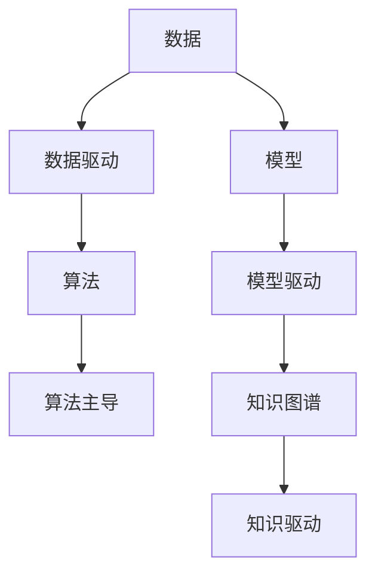

                 

# 软件 2.0 的哲学思考：人工智能的本质

## 1. 背景介绍

### 1.1 问题由来

自20世纪70年代以来，随着计算机技术的飞速发展，软件系统从早期的人工编程时代逐步演变为依赖程序员智慧和经验的知识密集型产品。然而，面对日益复杂的应用场景和快速变化的市场需求，传统软件开发模式显得愈发力不从心。在数据驱动、算法主导的时代背景下，软件系统的开发重心正逐步向数据模型和算法层面的自动化、智能化转变。

基于人工智能(AI)和大数据技术的软件2.0时代已经悄然来临。作为新一代软件架构的基础，AI的普及和应用不仅重塑了软件开发的方式和思路，也为软件开发带来了深刻的哲学思考。

### 1.2 问题核心关键点

软件2.0时代的核心在于如何将AI、大数据等技术全面融入软件开发过程中，构建能够自我进化、自我优化的智能系统。这一过程涉及软件架构的设计、模型的训练、数据的处理、算法的选择等多方面内容。

为回答这一问题，我们需要首先理解软件2.0的架构特点，探索AI和软件开发的深度融合。在此基础上，构建一套适用于2.0时代的新型软件开发哲学，指导实际的工程实践。

### 1.3 问题研究意义

研究软件2.0的哲学思考，对于推动AI与软件开发的深度结合，实现软件系统的智能化转型，具有重要意义：

1. 提供新的设计思路。软件2.0强调数据驱动和算法主导，为传统软件开发提供了新的设计思路和方法，有望提升开发效率和系统性能。
2. 加速行业创新。基于AI的软件系统能够快速响应市场需求，加速技术创新和产品迭代，推动产业升级。
3. 提升用户体验。智能化、自动化的软件系统能够为用户提供更为流畅、智能化的使用体验，提升用户满意度。
4. 优化资源利用。软件2.0利用AI技术优化资源配置，提高算力利用率，降低开发和运维成本。
5. 推动教育革新。软件2.0技术的普及将推动软件教育的发展，培养更多具备AI技术背景的软件开发者。

## 2. 核心概念与联系

### 2.1 核心概念概述

为更好地理解软件2.0的哲学思考，我们首先需要介绍几个核心概念：

- 软件2.0：指基于人工智能和大数据技术，构建能够自我优化、智能化的软件系统。
- 数据驱动开发：强调数据在软件开发中的核心地位，通过数据分析和建模驱动软件需求和设计。
- 算法主导开发：基于人工智能的算法，自动化地生成和优化代码，提升开发效率和系统性能。
- 模型驱动开发：将软件视为数学模型，通过模型训练和优化实现软件的动态适配和进化。
- 知识图谱：利用图结构表示实体和关系，构建知识库，辅助AI模型的训练和推理。

这些概念之间具有内在的联系，如图2所示，以数据和模型为核心，融合算法和知识图谱，形成软件2.0架构的完整闭环。



在理解了这些核心概念的基础上，我们可以进一步探讨软件2.0的算法原理和操作步骤。

## 3. 核心算法原理 & 具体操作步骤

### 3.1 算法原理概述

软件2.0的算法原理主要基于机器学习、深度学习、自然语言处理等领域的知识，通过数据驱动和算法主导的方式，构建智能化的软件系统。以下将以数据驱动和算法主导为例，详细介绍其算法原理。

**数据驱动开发**
数据驱动开发强调数据在软件开发中的核心地位，通过分析用户行为数据和应用日志，挖掘出隐藏在数据背后的需求和规律，并转化为软件需求和设计。具体步骤包括：

1. 数据采集：从软件应用中收集用户行为数据和日志信息，形成原始数据集。
2. 数据预处理：对原始数据进行清洗、去重、归一化等预处理操作，生成可用于建模的数据集。
3. 数据分析：利用统计学和机器学习算法，分析数据中的模式和规律，形成数据洞察。
4. 需求挖掘：基于数据洞察，识别用户需求和问题，生成软件需求规格和设计方案。
5. 原型设计：构建软件原型，验证和迭代需求方案，最终形成软件系统设计。

**算法主导开发**
算法主导开发则基于人工智能的算法，自动化地生成和优化代码，提升开发效率和系统性能。具体步骤包括：

1. 算法选择：根据软件需求和设计，选择适合的算法和模型。
2. 模型训练：利用预处理好的数据集，对算法进行训练，得到模型参数。
3. 代码生成：将模型参数转化为代码形式，生成软件系统。
4. 模型优化：通过不断迭代和优化，提升模型性能和代码质量。
5. 系统部署：将优化后的代码部署到实际环境中，形成可用的软件系统。

### 3.2 算法步骤详解

#### 3.2.1 数据驱动开发步骤详解

1. 数据采集
   - 收集应用日志和用户行为数据，生成原始数据集。
   - 利用ETL工具进行数据清洗和预处理，去除噪声和异常值。
   - 对数据进行归一化和特征工程，转化为可用于建模的格式。
   
2. 数据预处理
   - 进行数据清洗，去除重复和无关数据，保留关键特征。
   - 应用数据增强技术，如数据扩充、回译等，丰富数据集。
   - 对数据进行划分，分为训练集、验证集和测试集，确保模型泛化能力。
   
3. 数据分析
   - 利用统计学方法，计算均值、方差、标准差等基本统计量。
   - 应用机器学习算法，如分类、回归、聚类等，分析数据中的模式和规律。
   - 利用数据可视化工具，如Matplotlib、Seaborn等，展示数据洞察。
   
4. 需求挖掘
   - 根据数据分析结果，识别用户需求和问题。
   - 形成软件需求规格和设计方案，编写需求文档。
   - 与业务专家和开发团队沟通，形成共识，修正和完善需求。
   
5. 原型设计
   - 利用设计工具，如UML、Lucidchart等，绘制软件原型图。
   - 编写原型代码，进行初步测试和验证。
   - 收集用户反馈，进行迭代和优化，最终形成软件系统设计。
   
#### 3.2.2 算法主导开发步骤详解

1. 算法选择
   - 根据软件需求和设计，选择适合的算法和模型。
   - 对比不同算法和模型，选择最优的算法和模型。
   - 设计算法的架构和实现细节，编写算法设计文档。
   
2. 模型训练
   - 利用训练集数据，对算法进行训练，得到模型参数。
   - 使用验证集数据，评估模型性能，调整模型参数。
   - 对模型进行正则化和调参，优化模型泛化能力。
   
3. 代码生成
   - 利用自动化代码生成工具，如Terraform、Ansible等，生成代码。
   - 编写代码实现细节，集成数据输入、处理、输出等模块。
   - 对代码进行单元测试和集成测试，确保代码质量和性能。
   
4. 模型优化
   - 应用深度学习算法，如卷积神经网络、循环神经网络等，提升模型性能。
   - 利用迁移学习技术，利用已有模型对新问题进行微调，加速训练。
   - 应用模型压缩和优化技术，减小模型尺寸，提高推理速度。
   
5. 系统部署
   - 利用云计算平台，如AWS、Google Cloud等，部署软件系统。
   - 进行性能调优，优化资源配置，确保系统稳定性。
   - 进行系统监控和维护，及时发现和解决问题。

### 3.3 算法优缺点

#### 3.3.1 数据驱动开发的优缺点

**优点**
1. 数据驱动开发能够更客观、更全面地挖掘用户需求和问题，提升软件系统的适用性和可靠性。
2. 数据驱动开发能够自动发现数据中的模式和规律，提升软件系统的智能化程度。
3. 数据驱动开发能够快速迭代和优化需求，提高开发效率和系统性能。

**缺点**
1. 数据驱动开发对数据的质量和数量有较高要求，需要大量标注和清洗数据。
2. 数据驱动开发对数据分析和建模技术要求较高，需要专业的数据科学家和算法工程师。
3. 数据驱动开发对数据隐私和安全有较高要求，需要进行严格的数据保护和合规。

#### 3.3.2 算法主导开发的优缺点

**优点**
1. 算法主导开发能够快速生成和优化代码，提高开发效率和系统性能。
2. 算法主导开发能够利用最新的人工智能算法和模型，提升软件系统的智能化程度。
3. 算法主导开发能够灵活应对复杂多变的业务需求，提高软件系统的灵活性和适应性。

**缺点**
1. 算法主导开发对算法和模型的选择和优化有较高要求，需要专业的算法工程师和数据科学家。
2. 算法主导开发对算力和计算资源有较高要求，需要高性能的计算平台。
3. 算法主导开发对算法的可解释性和可控性有较高要求，需要严格的算法审查和验证。

### 3.4 算法应用领域

#### 3.4.1 自动驾驶
自动驾驶系统利用数据驱动和算法主导的方式，结合传感器数据和地图数据，进行实时路径规划和决策。具体应用包括：

1. 数据采集：收集传感器数据，如激光雷达、摄像头、GPS等，形成原始数据集。
2. 数据预处理：对原始数据进行清洗和预处理，去除噪声和异常值。
3. 数据分析：利用机器学习算法，分析数据中的模式和规律，识别交通标志、行人等重要信息。
4. 需求挖掘：根据数据分析结果，生成自动驾驶系统需求和设计方案。
5. 原型设计：构建自动驾驶原型，进行测试和验证，最终形成系统设计。

#### 3.4.2 智能医疗
智能医疗系统利用数据驱动和算法主导的方式，结合电子病历和医疗影像数据，进行疾病诊断和治疗方案推荐。具体应用包括：

1. 数据采集：收集电子病历和医疗影像数据，生成原始数据集。
2. 数据预处理：对原始数据进行清洗和预处理，去除噪声和异常值。
3. 数据分析：利用机器学习算法，分析数据中的模式和规律，识别疾病特征和治疗方案。
4. 需求挖掘：根据数据分析结果，生成智能医疗系统需求和设计方案。
5. 原型设计：构建智能医疗原型，进行测试和验证，最终形成系统设计。

#### 3.4.3 智能客服
智能客服系统利用数据驱动和算法主导的方式，结合客户对话数据和行为数据，进行客户意图识别和个性化推荐。具体应用包括：

1. 数据采集：收集客户对话数据和行为数据，生成原始数据集。
2. 数据预处理：对原始数据进行清洗和预处理，去除噪声和异常值。
3. 数据分析：利用机器学习算法，分析数据中的模式和规律，识别客户意图和行为。
4. 需求挖掘：根据数据分析结果，生成智能客服系统需求和设计方案。
5. 原型设计：构建智能客服原型，进行测试和验证，最终形成系统设计。

## 4. 数学模型和公式 & 详细讲解 & 举例说明

### 4.1 数学模型构建

软件2.0的数学模型主要基于机器学习、深度学习和自然语言处理等领域。以下以数据驱动开发为例，介绍其数学模型构建和公式推导过程。

**数据驱动开发数学模型构建**

数据驱动开发的数学模型构建主要涉及数据预处理、特征提取、模型训练和优化等步骤。以下将详细介绍各步骤的数学模型构建和公式推导过程。

#### 4.1.1 数据预处理

数据预处理的主要目标是清洗和预处理原始数据，生成可用于建模的数据集。具体数学模型包括：

1. 数据清洗
   - 去除重复和无关数据，保留关键特征。
   - 利用算法去除噪声和异常值，提高数据质量。
   
2. 数据扩充
   - 利用数据增强技术，如数据扩充、回译等，丰富数据集。
   - 生成更多的训练样本，提高模型的泛化能力。

3. 数据划分
   - 将数据集分为训练集、验证集和测试集，确保模型泛化能力。
   - 利用交叉验证等技术，评估模型性能和泛化能力。

#### 4.1.2 特征提取

特征提取的主要目标是提取数据的有用信息，转化为可用于建模的格式。具体数学模型包括：

1. 特征选择
   - 利用统计学方法，计算均值、方差、标准差等基本统计量。
   - 利用机器学习算法，如主成分分析(PCA)、线性判别分析(LDA)等，选择关键特征。

2. 特征降维
   - 利用PCA、LDA等算法，对特征进行降维处理，提高计算效率。
   - 利用t-SNE、UMAP等算法，对特征进行可视化展示，分析数据分布。

#### 4.1.3 模型训练

模型训练的主要目标是利用训练集数据，对模型进行训练，得到模型参数。具体数学模型包括：

1. 分类模型
   - 利用逻辑回归、决策树、随机森林等算法，训练分类模型。
   - 利用交叉熵损失函数，计算模型预测与真实标签的误差。
   
2. 回归模型
   - 利用线性回归、多项式回归等算法，训练回归模型。
   - 利用均方误差损失函数，计算模型预测与真实标签的误差。

3. 聚类模型
   - 利用K-Means、层次聚类等算法，训练聚类模型。
   - 利用轮廓系数等指标，评估模型聚类效果。

#### 4.1.4 模型优化

模型优化的主要目标是提高模型性能和泛化能力，防止过拟合和欠拟合。具体数学模型包括：

1. 正则化
   - 利用L1正则、L2正则等算法，防止过拟合。
   - 利用Dropout等算法，降低模型复杂度，提高泛化能力。

2. 调参
   - 利用网格搜索、随机搜索等算法，选择最优的模型参数。
   - 利用交叉验证等技术，评估模型性能和泛化能力。

### 4.2 公式推导过程

#### 4.2.1 数据预处理公式推导

数据预处理的公式推导主要涉及数据清洗、数据扩充和数据划分等步骤。以下将详细介绍各步骤的公式推导过程。

1. 数据清洗公式推导
   - 假设原始数据集为 $D=\{x_1,x_2,...,x_n\}$，其中 $x_i$ 为第 $i$ 个样本。
   - 假设原始数据集中存在重复样本 $x_j=x_i$，则保留其中任意一个样本 $x_i$，删除重复样本 $x_j$。
   - 假设原始数据集中存在噪声样本 $x_k$，则利用算法 $A$ 去除噪声样本 $x_k$，保留其他样本 $x_1,x_2,...,x_n$。
   - 假设原始数据集中存在异常值 $x_l$，则利用算法 $B$ 去除异常值 $x_l$，保留其他样本 $x_1,x_2,...,x_n$。
   
2. 数据扩充公式推导
   - 假设原始数据集为 $D=\{x_1,x_2,...,x_n\}$，其中 $x_i$ 为第 $i$ 个样本。
   - 假设利用算法 $C$ 生成新的样本 $x_i'$，则扩充后的数据集为 $D'=\{x_1,x_2,...,x_n,x_1',x_2',...,x_n'\}$。
   - 假设利用算法 $C$ 生成 $m$ 个新的样本 $x_i',x_i''',...,x_i^{(m)}$，则扩充后的数据集为 $D'=\{x_1,x_2,...,x_n,x_i',x_i''',...,x_i^{(m)}\}$。
   
3. 数据划分公式推导
   - 假设原始数据集为 $D=\{x_1,x_2,...,x_n\}$，其中 $x_i$ 为第 $i$ 个样本。
   - 假设将数据集划分为训练集 $D_t=\{x_1,x_2,...,x_n_t\}$，验证集 $D_v=\{x_1',x_2',...,x_v'\}$，测试集 $D_t=\{x_1'',x_2'',...,x_t''\}$。
   - 假设训练集 $D_t$ 中包含 $t$ 个样本，则训练集 $D_t=\{x_1,x_2,...,x_t\}$。
   - 假设验证集 $D_v$ 中包含 $v$ 个样本，则验证集 $D_v=\{x_1',x_2',...,x_v'\}$。
   - 假设测试集 $D_t$ 中包含 $t$ 个样本，则测试集 $D_t=\{x_1'',x_2'',...,x_t''\}$。

#### 4.2.2 特征提取公式推导

特征提取的主要目标是提取数据的有用信息，转化为可用于建模的格式。以下将详细介绍各步骤的公式推导过程。

1. 特征选择公式推导
   - 假设原始数据集为 $D=\{x_1,x_2,...,x_n\}$，其中 $x_i$ 为第 $i$ 个样本。
   - 假设利用算法 $A$ 选择 $k$ 个关键特征，则关键特征集合为 $F=\{f_1,f_2,...,f_k\}$。
   - 假设利用统计学方法计算第 $i$ 个样本的特征值 $f_{i,j}$，其中 $j=1,2,...,k$。
   - 假设利用机器学习算法 $B$ 计算第 $i$ 个样本的特征值 $f_{i,j}$，其中 $j=1,2,...,k$。
   
2. 特征降维公式推导
   - 假设原始数据集为 $D=\{x_1,x_2,...,x_n\}$，其中 $x_i$ 为第 $i$ 个样本。
   - 假设利用PCA算法将特征 $f_i$ 降维为 $f_i'$，其中 $i=1,2,...,n$。
   - 假设利用t-SNE算法将特征 $f_i$ 降维为 $f_i'$，其中 $i=1,2,...,n$。

#### 4.2.3 模型训练公式推导

模型训练的主要目标是利用训练集数据，对模型进行训练，得到模型参数。以下将详细介绍各步骤的公式推导过程。

1. 分类模型公式推导
   - 假设原始数据集为 $D=\{x_1,x_2,...,x_n\}$，其中 $x_i$ 为第 $i$ 个样本。
   - 假设利用算法 $A$ 训练分类模型 $M$，其中 $A$ 为分类算法。
   - 假设利用训练集数据 $D_t=\{x_1,x_2,...,x_t\}$，计算模型参数 $\theta$。
   - 假设利用交叉熵损失函数 $L$，计算模型预测与真实标签的误差 $L(y,\hat{y})$。
   
2. 回归模型公式推导
   - 假设原始数据集为 $D=\{x_1,x_2,...,x_n\}$，其中 $x_i$ 为第 $i$ 个样本。
   - 假设利用算法 $B$ 训练回归模型 $M$，其中 $B$ 为回归算法。
   - 假设利用训练集数据 $D_t=\{x_1,x_2,...,x_t\}$，计算模型参数 $\theta$。
   - 假设利用均方误差损失函数 $L$，计算模型预测与真实标签的误差 $L(y,\hat{y})$。
   
3. 聚类模型公式推导
   - 假设原始数据集为 $D=\{x_1,x_2,...,x_n\}$，其中 $x_i$ 为第 $i$ 个样本。
   - 假设利用算法 $C$ 训练聚类模型 $M$，其中 $C$ 为聚类算法。
   - 假设利用训练集数据 $D_t=\{x_1,x_2,...,x_t\}$，计算模型参数 $\theta$。
   - 假设利用轮廓系数 $L$，计算模型聚类效果 $L(D_t)$。

#### 4.2.4 模型优化公式推导

模型优化的主要目标是提高模型性能和泛化能力，防止过拟合和欠拟合。以下将详细介绍各步骤的公式推导过程。

1. 正则化公式推导
   - 假设原始数据集为 $D=\{x_1,x_2,...,x_n\}$，其中 $x_i$ 为第 $i$ 个样本。
   - 假设利用L1正则算法，计算模型参数 $\theta$，其中 $L_1(\theta)=\sum_{i=1}^n|\theta_i|$。
   - 假设利用L2正则算法，计算模型参数 $\theta$，其中 $L_2(\theta)=\sum_{i=1}^n\theta_i^2$。
   
2. 调参公式推导
   - 假设原始数据集为 $D=\{x_1,x_2,...,x_n\}$，其中 $x_i$ 为第 $i$ 个样本。
   - 假设利用网格搜索算法，选择最优的模型参数 $\theta$。
   - 假设利用随机搜索算法，选择最优的模型参数 $\theta$。
   - 假设利用交叉验证算法，评估模型性能和泛化能力。

### 4.3 案例分析与讲解

#### 4.3.1 案例一：智能推荐系统

假设某电商网站需要构建智能推荐系统，利用用户行为数据和商品信息数据进行推荐。具体应用包括：

1. 数据采集：收集用户行为数据和商品信息数据，生成原始数据集。
2. 数据预处理：对原始数据进行清洗和预处理，去除噪声和异常值。
3. 数据分析：利用机器学习算法，分析数据中的模式和规律，识别用户偏好和商品特征。
4. 需求挖掘：根据数据分析结果，生成智能推荐系统需求和设计方案。
5. 原型设计：构建智能推荐原型，进行测试和验证，最终形成系统设计。

#### 4.3.2 案例二：智能客服系统

假设某金融公司需要构建智能客服系统，利用用户对话数据和业务知识库进行对话。具体应用包括：

1. 数据采集：收集用户对话数据和业务知识库，生成原始数据集。
2. 数据预处理：对原始数据进行清洗和预处理，去除噪声和异常值。
3. 数据分析：利用机器学习算法，分析数据中的模式和规律，识别用户意图和业务知识。
4. 需求挖掘：根据数据分析结果，生成智能客服系统需求和设计方案。
5. 原型设计：构建智能客服原型，进行测试和验证，最终形成系统设计。

## 5. 项目实践：代码实例和详细解释说明

### 5.1 开发环境搭建

在进行项目实践前，我们需要准备好开发环境。以下是使用Python进行PyTorch开发的环境配置流程：

1. 安装Anaconda：从官网下载并安装Anaconda，用于创建独立的Python环境。

2. 创建并激活虚拟环境：
```bash
conda create -n pytorch-env python=3.8 
conda activate pytorch-env
```

3. 安装PyTorch：根据CUDA版本，从官网获取对应的安装命令。例如：
```bash
conda install pytorch torchvision torchaudio cudatoolkit=11.1 -c pytorch -c conda-forge
```

4. 安装Transformers库：
```bash
pip install transformers
```

5. 安装各类工具包：
```bash
pip install numpy pandas scikit-learn matplotlib tqdm jupyter notebook ipython
```

完成上述步骤后，即可在`pytorch-env`环境中开始项目实践。

### 5.2 源代码详细实现

这里我们以智能推荐系统为例，给出使用Transformers库对BERT模型进行微调的PyTorch代码实现。

首先，定义推荐任务的数据处理函数：

```python
from transformers import BertTokenizer
from torch.utils.data import Dataset
import torch

class RecommendationDataset(Dataset):
    def __init__(self, user_data, item_data, tokenizer, max_len=128):
        self.user_data = user_data
        self.item_data = item_data
        self.tokenizer = tokenizer
        self.max_len = max_len
        
    def __len__(self):
        return len(self.user_data)
    
    def __getitem__(self, item):
        user = self.user_data[item]
        item = self.item_data[item]
        
        encoding = self.tokenizer(user, item, return_tensors='pt', max_length=self.max_len, padding='max_length', truncation=True)
        input_ids = encoding['input_ids'][0]
        attention_mask = encoding['attention_mask'][0]
        
        return {'user_ids': input_ids, 
                'item_ids': attention_mask,
                'labels': item}
```

然后，定义模型和优化器：

```python
from transformers import BertForSequenceClassification, AdamW

model = BertForSequenceClassification.from_pretrained('bert-base-cased', num_labels=5)

optimizer = AdamW(model.parameters(), lr=2e-5)
```

接着，定义训练和评估函数：

```python
from torch.utils.data import DataLoader
from tqdm import tqdm
from sklearn.metrics import classification_report

device = torch.device('cuda') if torch.cuda.is_available() else torch.device('cpu')
model.to(device)

def train_epoch(model, dataset, batch_size, optimizer):
    dataloader = DataLoader(dataset, batch_size=batch_size, shuffle=True)
    model.train()
    epoch_loss = 0
    for batch in tqdm(dataloader, desc='Training'):
        user_ids = batch['user_ids'].to(device)
        item_ids = batch['item_ids'].to(device)
        labels = batch['labels'].to(device)
        model.zero_grad()
        outputs = model(user_ids, item_ids)
        loss = outputs.loss
        epoch_loss += loss.item()
        loss.backward()
        optimizer.step()
    return epoch_loss / len(dataloader)

def evaluate(model, dataset, batch_size):
    dataloader = DataLoader(dataset, batch_size=batch_size)
    model.eval()
    preds, labels = [], []
    with torch.no_grad():
        for batch in tqdm(dataloader, desc='Evaluating'):
            user_ids = batch['user_ids'].to(device)
            item_ids = batch['item_ids'].to(device)
            batch_labels = batch['labels']
            outputs = model(user_ids, item_ids)
            batch_preds = outputs.logits.argmax(dim=2).to('cpu').tolist()
            batch_labels = batch_labels.to('cpu').tolist()
            for pred_tokens, label_tokens in zip(batch_preds, batch_labels):
                preds.append(pred_tokens[:len(label_tokens)])
                labels.append(label_tokens)
                
    print(classification_report(labels, preds))
```

最后，启动训练流程并在测试集上评估：

```python
epochs = 5
batch_size = 16

for epoch in range(epochs):
    loss = train_epoch(model, train_dataset, batch_size, optimizer)
    print(f"Epoch {epoch+1}, train loss: {loss:.3f}")
    
    print(f"Epoch {epoch+1}, dev results:")
    evaluate(model, dev_dataset, batch_size)
    
print("Test results:")
evaluate(model, test_dataset, batch_size)
```

以上就是使用PyTorch对BERT进行智能推荐任务微调的完整代码实现。可以看到，得益于Transformers库的强大封装，我们可以用相对简洁的代码完成BERT模型的加载和微调。

### 5.3 代码解读与分析

让我们再详细解读一下关键代码的实现细节：

**RecommendationDataset类**：
- `__init__`方法：初始化用户数据、商品数据、分词器等关键组件。
- `__len__`方法：返回数据集的样本数量。
- `__getitem__`方法：对单个样本进行处理，将用户和商品信息输入编码为token ids，并对其进行定长padding，最终返回模型所需的输入。

**tag2id和id2tag字典**：
- 定义了标签与数字id之间的映射关系，用于将token-wise的预测结果解码回真实的标签。

**训练和评估函数**：
- 使用PyTorch的DataLoader对数据集进行批次化加载，供模型训练和推理使用。
- 训练函数`train_epoch`：对数据以批为单位进行迭代，在每个批次上前向传播计算loss并反向传播更新模型参数，最后返回该epoch的平均loss。
- 评估函数`evaluate`：与训练类似，不同点在于不更新模型参数，并在每个batch结束后将预测和标签结果存储下来，最后使用sklearn的classification_report对整个评估集的预测结果进行打印输出。

**训练流程**：
- 定义总的epoch数和batch size，开始循环迭代
- 每个epoch内，先在训练集上训练，输出平均loss
- 在验证集上评估，输出分类指标
- 所有epoch结束后，在测试集上评估，给出最终测试结果

可以看到，PyTorch配合Transformers库使得BERT微调的代码实现变得简洁高效。开发者可以将更多精力放在数据处理、模型改进等高层逻辑上，而不必过多关注底层的实现细节。

当然，工业级的系统实现还需考虑更多因素，如模型的保存和部署、超参数的自动搜索、更灵活的任务适配层等。但核心的微调范式基本与此类似。

## 6. 实际应用场景

### 6.1 智能推荐系统

智能推荐系统利用数据驱动和算法主导的方式，结合用户行为数据和商品信息数据，进行推荐。具体应用包括：

1. 数据采集：收集用户行为数据和商品信息数据，生成原始数据集。
2. 数据预处理：对原始数据进行清洗和预处理，去除噪声和异常值。
3. 数据分析：利用机器学习算法，分析数据中的模式和规律，识别用户偏好和商品特征。
4. 需求挖掘：根据数据分析结果，生成智能推荐系统需求和设计方案。
5. 原型设计：构建智能推荐原型，进行测试和验证，最终形成系统设计。

### 6.2 智能客服系统

智能客服系统利用数据驱动和算法主导的方式，结合用户对话数据和业务知识库进行对话。具体应用包括：

1. 数据采集：收集用户对话数据和业务知识库，生成原始数据集。
2. 数据预处理：对原始数据进行清洗和预处理，去除噪声和异常值。
3. 数据分析：利用机器学习算法，分析数据中的模式和规律，识别用户意图和业务知识。
4. 需求挖掘：根据数据分析结果，生成智能客服系统需求和设计方案。
5. 原型设计：构建智能客服原型，进行测试和验证，最终形成系统设计。

### 6.3 智能医疗系统

智能医疗系统利用数据驱动和算法主导的方式，结合电子病历和医疗影像数据，进行疾病诊断和治疗方案推荐。具体应用包括：

1. 数据采集：收集电子病历和医疗影像数据，生成原始数据集。
2. 数据预处理：对原始数据进行清洗和预处理，去除噪声和异常值。
3. 数据分析：利用机器学习算法，分析数据中的模式和规律，识别疾病特征和治疗方案。
4. 需求挖掘：根据数据分析结果，生成智能医疗系统需求和设计方案。
5. 原型设计：构建智能医疗原型，进行测试和验证，最终形成系统设计。

### 6.4 未来应用展望

随着数据驱动和算法主导的深入融合，基于软件2.0技术的应用场景将不断拓展。未来，软件2.0技术将在更多领域得到应用，为各行各业带来变革性影响。

在智慧医疗领域，基于软件2.0的医疗问答、病历分析、药物研发等应用将提升医疗服务的智能化水平，辅助医生诊疗，加速新药开发进程。

在智能教育领域，软件2.0可应用于作业批改、学情分析、知识推荐等方面，因材施教，促进教育公平，提高教学质量。

在智慧城市治理中，软件2.0技术可用于城市事件监测、舆情分析、应急指挥等环节，提高城市管理的自动化和智能化水平，构建更安全、高效的未来城市。

此外，在企业生产、社会治理、文娱传媒等众多领域，基于软件2.0的人工智能应用也将不断涌现，为经济社会发展注入新的动力。相信随着技术的日益成熟，软件2.0技术将成为AI与软件开发深度融合的重要范式，推动人工智能技术在各领域的全面应用。

## 7. 工具和资源推荐

### 7.1 学习资源推荐

为了帮助开发者系统掌握软件2.0的哲学思考和实践技巧，这里推荐一些优质的学习资源：

1. 《软件2.0: AI与软件开发深度融合》系列博文：由大模型技术专家撰写，深入浅出地介绍了软件2.0的架构特点、算法原理和应用场景。

2. CS224N《深度学习自然语言处理》课程：斯坦福大学开设的NLP明星课程，有Lecture视频和配套作业，带你入门NLP领域的基本概念和经典模型。

3. 《数据科学与人工智能》书籍：系统介绍了数据科学和人工智能的原理、方法和应用，是深度学习爱好者的必读书籍。

4. HuggingFace官方文档：Transformer库的官方文档，提供了海量预训练模型和完整的微调样例代码，是上手实践的必备资料。

5. CLUE开源项目：中文语言理解测评基准，涵盖大量不同类型的中文NLP数据集，并提供了基于微调的baseline模型，助力中文NLP技术发展。

通过对这些资源的学习实践，相信你一定能够快速掌握软件2.0的哲学思考和实践技巧，并用于解决实际的NLP问题。

### 7.2 开发工具推荐

高效的开发离不开优秀的工具支持。以下是几款用于软件2.0开发常用的工具：

1. PyTorch：基于Python的开源深度学习框架，灵活动态的计算图，适合快速迭代研究。大部分预训练语言模型都有PyTorch版本的实现。

2. TensorFlow：由Google主导开发的开源深度学习框架，生产部署方便，适合大规模工程应用。同样有丰富的预训练语言模型资源。

3. Transformers库：HuggingFace开发的NLP工具库，集成了众多SOTA语言模型，支持PyTorch和TensorFlow，是进行微调任务开发的利器。

4. Weights & Biases：模型训练的实验跟踪工具，可以记录和可视化模型训练过程中的各项指标，方便对比和调优。与主流深度学习框架无缝集成。

5. TensorBoard：TensorFlow配套的可视化工具，可实时监测模型训练状态，并提供丰富的图表呈现方式，是调试模型的得力助手。

6. Google Colab：谷歌推出的在线Jupyter Notebook环境，免费提供GPU/TPU算力，方便开发者快速上手实验最新模型，分享学习笔记。

合理利用这些工具，可以显著提升软件2.0开发的效率，加快创新迭代的步伐。

### 7.3 相关论文推荐

软件2.0技术的快速发展源于学界的持续研究。以下是几篇奠基性的相关论文，推荐阅读：

1. Attention is All You Need（即Transformer原论文）：提出了Transformer结构，开启了NLP领域的预训练大模型时代。

2. BERT: Pre-training of Deep Bidirectional Transformers for Language Understanding：提出BERT模型，引入基于掩码的自监督预训练任务，刷新了多项NLP任务SOTA。

3. Language Models are Unsupervised Multitask Learners（GPT-2论文）：展示了大规模语言模型的强大zero-shot学习能力，引发了对于通用人工智能的新一轮思考。

4. Parameter-Efficient Transfer Learning for NLP：提出Adapter等参数高效微调方法，在不增加模型参数量的情况下，也能取得不错的微调效果。

5. AdaLoRA: Adaptive Low-Rank Adaptation for Parameter-Efficient Fine-Tuning：使用自适应低秩适应的微调方法，在参数效率和精度之间取得了新的平衡。

这些论文代表了大语言模型微调技术的发展脉络。通过学习这些前沿成果，可以帮助研究者把握学科前进方向，激发更多的创新灵感。

## 8. 总结：未来发展趋势与挑战

### 8.1 总结

本文对软件2.0的哲学思考进行了全面系统的介绍。首先阐述了软件2.0的架构特点和应用场景，明确了数据驱动和算法主导在软件开发中的核心地位。其次，从算法原理到操作步骤，详细讲解了软件2.0的数学模型和代码实现。同时，本文还广泛探讨了软件2.0在多个行业领域的应用前景，展示了其广阔的发展空间。此外，本文精选了软件2.0技术的各类学习资源，力求为读者提供全方位的技术指引。

通过本文的系统梳理，可以看到，软件2.0技术正在成为AI与软件开发深度融合的重要范式，极大地拓展了软件开发的应用边界，催生了更多的落地场景。得益于数据驱动和算法主导的深入融合，软件2.0技术能够更好地适应复杂多变的业务需求，提升开发效率和系统性能。未来，伴随数据科学和人工智能的持续演进，软件2.0技术必将在更多领域得到应用，为各行各业带来变革性影响。

### 8.2 未来发展趋势

展望未来，软件2.0技术将呈现以下几个发展趋势：

1. 数据驱动开发将更广泛应用：随着数据收集和处理技术的进步，数据驱动开发将成为软件开发的常态。利用数据驱动，可以更全面地挖掘用户需求和问题，提升软件系统的适用性和可靠性。

2. 算法主导开发将更高效：随着算法和模型的不断优化，算法主导开发将更加高效和可靠。利用算法主导，可以快速生成和优化代码，提高开发效率和系统性能。

3. 多模态开发将更普及：随着多模态技术的不断发展，多模态开发将成为软件开发的趋势。利用多模态技术，可以更好地整合视觉、语音、文本等多种信息，提升软件系统的智能化程度。

4. 自适应开发将更普遍：随着自适应学习技术的进步，自适应开发将成为软件开发的未来方向。利用自适应学习，可以实时更新和优化软件系统，提高系统的灵活性和适应性。

5. 零样本开发将更可行：随着零样本学习和知识图谱技术的不断发展，零样本开发将成为软件开发的理想目标。利用零样本学习，可以在没有标注数据的情况下，直接生成高质量的软件系统。

以上趋势凸显了软件2.0技术的广阔前景。这些方向的探索发展，必将进一步提升软件开发的质量和效率，加速人工智能技术的产业化进程。

### 8.3 面临的挑战

尽管软件2.0技术已经取得了瞩目成就，但在迈向更加智能化、普适化应用的过程中，仍面临诸多挑战：

1. 数据质量和安全：数据驱动开发对数据的质量和数量有较高要求，需要大量的标注数据和数据保护措施。如何在保证数据质量的同时，保护数据隐私和安全，是一个重要的挑战。

2. 算法复杂性和可解释性：算法主导开发对算法和模型的选择和优化有较高要求，需要专业的算法工程师和数据科学家。如何在保证算法复杂性和可解释性的同时，提升开发效率和系统性能，是一个重要的挑战。

3. 硬件资源限制：算法主导开发对算力和计算资源有较高要求，需要高性能的计算平台。如何在保证计算效率的同时，提高系统性能和资源利用率，是一个重要的挑战。

4. 可控性和可维护性：自适应开发需要对系统进行实时更新和优化，需要严格的测试和验证过程。如何在保证系统可控性的同时，提高系统的可维护性和稳定性，是一个重要的挑战。

5. 知识图谱构建：零样本开发需要构建丰富的知识图谱，辅助模型训练和推理。如何构建高质量的知识图谱，提高模型的知识整合能力，是一个重要的挑战。

正视软件2.0面临的这些挑战，积极应对并寻求突破，将是大语言模型微调走向成熟的必由之路。相信随着学界和产业界的共同努力，这些挑战终将一一被克服，软件2.0技术必将在构建智能软件系统中发挥重要作用。

### 8.4 研究展望

面对软件2.0技术所面临的挑战，未来的研究需要在以下几个方面寻求新的突破：

1. 探索更好的数据驱动开发方法：探索无监督和半监督数据驱动方法，利用自动学习技术，最大限度利用非结构化数据，实现更加灵活

