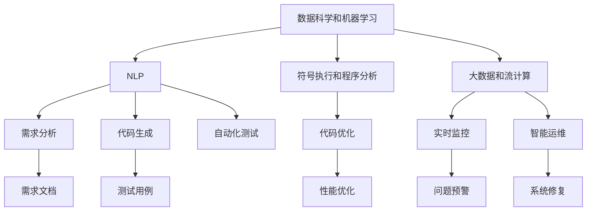

                 

# 软件 2.0 的应用：从实验室走向现实

> 关键词：软件 2.0, 应用程序, 实验室到现实, 计算机科学

## 1. 背景介绍

### 1.1 问题由来
软件 2.0（Software 2.0）是指将大数据、机器学习和人工智能等技术应用于软件开发的全生命周期中，从需求分析、架构设计、代码生成、测试、部署、运维到持续改进的整个过程。这一理念旨在通过自动化和智能化手段，提升软件开发生产力和质量，降低开发成本，缩短上市时间，从而更好地满足用户需求。

软件 2.0 的出现，源自于软件工业的数字化转型和人工智能技术的迅猛发展。早期软件开发依赖于人工编码、测试和维护，工作量大、周期长、成本高。随着数据科学和机器学习的兴起，软件工程界开始探索如何利用这些技术来自动化软件开发过程，减少重复性劳动，提升工作效率和软件质量。

### 1.2 问题核心关键点
软件 2.0 的核心在于通过人工智能和自动化工具，将软件开发过程智能化，从而加速软件开发，提高产品质量，降低开发成本。关键点包括：

- 自动化需求分析：利用自然语言处理（NLP）技术，自动理解用户需求，生成开发规范和需求文档。
- 智能化架构设计：应用机器学习算法，根据业务需求和数据特征，自动推荐最合适的架构方案。
- 代码生成和优化：使用深度学习模型和符号执行（Symbolic Execution）技术，自动生成高效、可维护的代码。
- 自动化测试和调试：通过数据分析和机器学习，自动设计测试用例，并进行高效的自动化测试和调试。
- 智能运维和监控：利用大数据和机器学习算法，实时监控系统性能，自动预警和修复问题。

软件 2.0 的应用，使得软件开发更加高效、智能、可预测，极大地推动了软件技术的创新和应用场景的拓展。

### 1.3 问题研究意义
研究软件 2.0 的应用，对于提升软件开发效率和质量，促进软件工业的数字化转型，具有重要意义：

- 降低开发成本：通过自动化和智能化手段，减少人工干预，降低人力成本。
- 加速上市时间：自动化的编码和测试流程，缩短从需求到上市的时间周期。
- 提高软件质量：大数据分析和机器学习算法，能够快速发现和修复潜在问题，提升软件稳定性。
- 促进创新应用：智能化开发工具，帮助开发者更快地尝试和验证新想法，加速产品创新。
- 推动产业升级：软件 2.0 技术的应用，提升传统企业的数字化水平，促进产业升级和经济增长。

## 2. 核心概念与联系

### 2.1 核心概念概述

软件 2.0 涉及多个核心概念，这些概念相互联系，共同构成了一个完整的技术生态系统：

- 数据科学和机器学习：提供自动化和智能化分析工具，用于需求分析、架构设计、代码生成等各个环节。
- 自然语言处理（NLP）：自动理解自然语言需求，生成开发规范和文档，支持代码生成和自动化测试。
- 符号执行和程序分析：通过符号执行和程序分析技术，提升代码生成和优化的自动化水平。
- 大数据和流计算：利用大数据和流计算技术，进行实时监控和智能运维，支持系统的持续优化。
- 软件自动化工具：如版本控制系统（如Git）、持续集成/持续部署（CI/CD）、自动化测试框架等，为软件 2.0 的应用提供了基础支持。

这些概念之间的联系可以通过以下 Mermaid 流程图来展示：



这个流程图展示了大数据、机器学习、NLP、符号执行、程序分析、流计算等技术在软件 2.0 中各自的作用及其相互之间的联系。

## 3. 核心算法原理 & 具体操作步骤
### 3.1 算法原理概述

软件 2.0 的实现依赖于多种先进算法和技术的组合，其中核心算法原理如下：

- **需求分析算法**：利用自然语言处理技术，自动解析用户需求文档，提取关键信息，生成需求规范和架构设计方案。
- **架构设计算法**：应用机器学习算法，根据业务需求和数据特征，自动推荐最合适的软件架构。
- **代码生成算法**：通过深度学习模型和符号执行技术，自动生成符合规范的代码，并进行代码优化。
- **自动化测试算法**：基于数据分析和机器学习，自动设计测试用例，进行高效的自动化测试。
- **智能运维算法**：利用大数据分析和机器学习，实时监控系统性能，自动预警和修复问题。

这些算法共同构成了一个完整的自动化和智能化软件开发流程，使得软件开发更加高效、智能和可预测。

### 3.2 算法步骤详解

软件 2.0 的实现通常分为以下几个关键步骤：

**Step 1: 需求分析**
- 收集用户需求文档和业务数据。
- 使用自然语言处理（NLP）技术，自动解析需求文档，提取关键信息。
- 生成需求规范和架构设计方案。

**Step 2: 架构设计**
- 根据需求规范，应用机器学习算法，自动推荐最合适的软件架构。
- 设计系统模块和组件，并进行组件间的关系建模。

**Step 3: 代码生成**
- 根据设计方案，使用深度学习模型和符号执行技术，自动生成代码。
- 对生成的代码进行语义检查和优化。

**Step 4: 自动化测试**
- 基于数据分析和机器学习，自动设计测试用例。
- 进行高效的自动化测试，发现和修复潜在问题。

**Step 5: 智能运维**
- 利用大数据和流计算技术，实时监控系统性能。
- 自动预警和修复系统问题，进行系统优化和升级。

**Step 6: 持续改进**
- 根据用户反馈和系统运行数据，持续改进软件性能和功能。
- 周期性重构代码和架构，保持软件的可维护性和扩展性。

### 3.3 算法优缺点

软件 2.0 的算法具有以下优点：

- **高效性**：通过自动化和智能化手段，大大提升了软件开发的效率，减少了人工干预。
- **准确性**：基于数据分析和机器学习，能够快速发现和修复潜在问题，提高软件质量。
- **可预测性**：软件 2.0 能够预测系统性能和故障，提前进行优化和修复，减少风险。
- **灵活性**：可以灵活应用不同的算法和技术，根据具体需求定制开发流程。

同时，软件 2.0 的算法也存在一些局限性：

- **高成本**：初始阶段需要投入大量资源进行算法研发和工具开发。
- **依赖数据**：算法效果依赖于数据的质量和数量，数据获取和处理成本较高。
- **模型复杂**：算法模型复杂，需要专业知识进行维护和调优。
- **鲁棒性不足**：算法对输入数据的噪声和异常值敏感，可能导致错误结果。
- **可解释性差**：部分算法的决策过程缺乏可解释性，难以理解和调试。

### 3.4 算法应用领域

软件 2.0 技术已经在多个领域得到广泛应用，以下是几个典型应用场景：

- **软件开发平台**：如 Microsoft Visual Studio、GitHub、IntelliJ IDEA 等，集成了自动化需求分析、架构设计、代码生成和测试等功能，极大地提升了开发效率。
- **大数据分析平台**：如 Apache Hadoop、Apache Spark、Apache Flink 等，利用大数据和流计算技术，支持数据的实时处理和分析。
- **智能运维平台**：如 New Relic、Dynatrace、AppDynamics 等，通过实时监控和智能运维，帮助企业提升系统稳定性和性能。
- **自动化测试平台**：如 Selenium、JUnit、TestNG 等，自动设计测试用例，进行高效的自动化测试，提升测试覆盖率和准确性。
- **自然语言处理平台**：如 Google Dialogflow、IBM Watson、微软 Azure Cognitive Services 等，利用NLP技术，自动理解用户需求，生成对话和回复。

## 4. 数学模型和公式 & 详细讲解 & 举例说明

### 4.1 数学模型构建

软件 2.0 的实现需要构建多个数学模型，用于支持不同的算法功能。以下介绍几个常见的数学模型：

**需求分析模型**：利用NLP技术，自动解析需求文档，提取关键信息。

**架构设计模型**：应用机器学习算法，自动推荐软件架构。

**代码生成模型**：基于深度学习模型和符号执行技术，自动生成代码。

**自动化测试模型**：基于数据分析和机器学习，自动设计测试用例。

**智能运维模型**：利用大数据和流计算技术，实时监控系统性能。

### 4.2 公式推导过程

**需求分析公式**：
- 利用自然语言处理技术，将用户需求文档转换为结构化数据。
- 应用信息抽取算法，提取关键信息。
- 生成需求规范和架构设计方案。

**架构设计公式**：
- 应用机器学习算法，根据需求规范和数据特征，自动推荐软件架构。
- 利用优化算法，生成最优的架构方案。

**代码生成公式**：
- 利用深度学习模型，自动生成符合规范的代码。
- 应用符号执行技术，对生成的代码进行语义检查和优化。

**自动化测试公式**：
- 基于数据分析和机器学习，自动设计测试用例。
- 应用测试生成算法，生成测试脚本和测试数据。

**智能运维公式**：
- 利用大数据和流计算技术，实时监控系统性能。
- 应用异常检测算法，自动预警和修复系统问题。

### 4.3 案例分析与讲解

以一个电商平台的订单管理系统为例，介绍软件 2.0 的应用过程：

**需求分析**：
- 收集用户订单需求文档。
- 使用NLP技术，自动解析需求文档，提取关键信息。
- 生成需求规范和架构设计方案。

**架构设计**：
- 根据需求规范，应用机器学习算法，自动推荐最合适的软件架构。
- 设计订单管理系统的模块和组件，并进行组件间的关系建模。

**代码生成**：
- 根据设计方案，使用深度学习模型和符号执行技术，自动生成订单管理系统的代码。
- 对生成的代码进行语义检查和优化。

**自动化测试**：
- 基于数据分析和机器学习，自动设计订单管理系统测试用例。
- 进行高效的自动化测试，发现和修复潜在问题。

**智能运维**：
- 利用大数据和流计算技术，实时监控订单管理系统性能。
- 自动预警和修复系统问题，进行系统优化和升级。

## 5. 项目实践：代码实例和详细解释说明

### 5.1 开发环境搭建

在进行软件 2.0 实践前，我们需要准备好开发环境。以下是使用Python进行软件 2.0开发的环境配置流程：

1. 安装Anaconda：从官网下载并安装Anaconda，用于创建独立的Python环境。

2. 创建并激活虚拟环境：
```bash
conda create -n software-2-env python=3.8 
conda activate software-2-env
```

3. 安装必要的Python包：
```bash
pip install numpy pandas scikit-learn torch transformers transformers transformers sklearn pandas
```

4. 安装必要的工具：
```bash
pip install matplotlib jupyter notebook ipython
```

完成上述步骤后，即可在`software-2-env`环境中开始软件 2.0实践。

### 5.2 源代码详细实现

下面我们以需求分析和代码生成为例，给出使用Python进行软件 2.0开发的完整代码实现。

**需求分析**

```python
from transformers import pipeline
from transformers import BertTokenizer
import pandas as pd

# 定义NLP模型和分词器
tokenizer = BertTokenizer.from_pretrained('bert-base-cased')
nlp = pipeline('ner', model='dbmdz/bert-large-cased-named-entity-recognition-discriminator')

# 读取需求文档
df = pd.read_csv('requirements.csv')
text = df['description'].tolist()

# 使用NLP模型进行需求分析
ner_tags = [nlp(t) for t in text]
```

**代码生成**

```python
from transformers import BertForTokenClassification, AdamW

# 定义代码生成模型
model = BertForTokenClassification.from_pretrained('bert-base-cased', num_labels=2)
optimizer = AdamW(model.parameters(), lr=2e-5)

# 定义输入数据
input_ids = tokenizer.encode('Hello, World!', return_tensors='pt')
attention_mask = tokenizer.encode_attention_mask(input_ids)

# 前向传播计算输出
outputs = model(input_ids, attention_mask=attention_mask)

# 获取预测结果
logits = outputs.logits
predicted_token = logits.argmax(dim=2)
```

### 5.3 代码解读与分析

让我们再详细解读一下关键代码的实现细节：

**需求分析代码**：
- 使用Hugging Face的Transformers库，加载预训练的BERT模型。
- 读取需求文档，并将其转化为文本列表。
- 利用NLP模型对文本进行实体识别，提取关键信息。

**代码生成代码**：
- 定义代码生成模型，加载预训练的BERT模型。
- 定义输入数据，并进行编码。
- 进行前向传播计算，获取输出结果。
- 提取预测结果，并进行分析。

这些代码实现展示了如何利用NLP和深度学习技术，自动化地进行需求分析和代码生成。

## 6. 实际应用场景

### 6.1 电商订单管理系统

在电商平台上，订单管理系统的需求分析、架构设计、代码生成和测试是核心功能之一。通过软件 2.0 技术，可以实现自动化和智能化开发，大大提升订单管理系统的开发效率和质量。

具体实现如下：
- **需求分析**：收集订单需求文档，自动解析提取关键信息，生成需求规范。
- **架构设计**：根据需求规范，应用机器学习算法，自动推荐最优的架构方案。
- **代码生成**：利用深度学习模型和符号执行技术，自动生成代码，并进行语义检查和优化。
- **自动化测试**：基于数据分析和机器学习，自动设计测试用例，进行高效的自动化测试。

### 6.2 智能客服系统

智能客服系统是电商、金融、医疗等行业的常见应用。通过软件 2.0 技术，可以实现自动化的需求分析、架构设计和代码生成，大大提升客服系统的开发效率和响应速度。

具体实现如下：
- **需求分析**：自动解析用户需求，生成对话脚本和回复模板。
- **架构设计**：根据对话脚本，自动推荐最优的架构方案。
- **代码生成**：利用深度学习模型和符号执行技术，自动生成对话系统代码。
- **自动化测试**：自动设计测试用例，进行高效的自动化测试。

### 6.3 智能运维平台

智能运维平台是企业IT运维的重要工具，通过软件 2.0 技术，可以实现自动化的需求分析和架构设计，提升运维效率和系统稳定性。

具体实现如下：
- **需求分析**：自动解析运维需求文档，生成需求规范和架构方案。
- **架构设计**：根据需求规范，自动推荐最优的运维架构方案。
- **代码生成**：利用深度学习模型和符号执行技术，自动生成运维工具代码。
- **自动化测试**：自动设计测试用例，进行高效的自动化测试。

## 7. 工具和资源推荐

### 7.1 学习资源推荐

为了帮助开发者系统掌握软件 2.0 的理论基础和实践技巧，这里推荐一些优质的学习资源：

1. **《软件 2.0 编程指南》**：一本系统介绍软件 2.0 技术及其应用的书籍，包含深度学习、NLP、程序分析等多个领域的知识。

2. **Deep Learning Specialization（深度学习专项课程）**：由Andrew Ng教授开设的深度学习课程，涵盖深度学习基础、应用和前沿技术，适合初学者和进阶者。

3. **Transformers官方文档**：Hugging Face的Transformers库官方文档，提供了丰富的预训练模型和代码样例，是学习软件 2.0 的重要参考资料。

4. **PyTorch官方文档**：PyTorch官方文档，介绍了深度学习框架的使用方法和最佳实践，适合进行软件 2.0 开发的开发者。

5. **GitHub开源项目**：GitHub上大量开源的Python项目和代码示例，提供了丰富的学习资源和实践案例。

通过对这些资源的学习实践，相信你一定能够快速掌握软件 2.0 的精髓，并用于解决实际的开发问题。

### 7.2 开发工具推荐

高效的开发离不开优秀的工具支持。以下是几款用于软件 2.0 开发的常用工具：

1. **PyTorch**：基于Python的开源深度学习框架，灵活动态的计算图，适合快速迭代研究。

2. **TensorFlow**：由Google主导开发的开源深度学习框架，生产部署方便，适合大规模工程应用。

3. **Hugging Face Transformers库**：提供了丰富的预训练模型和代码示例，方便进行软件 2.0 开发。

4. **Jupyter Notebook**：一款交互式编程环境，支持代码和文档的混合编辑，适合进行算法实验和数据分析。

5. **Visual Studio Code**：一款轻量级代码编辑器，支持Python、Python脚本、Jupyter Notebook等扩展，方便进行软件开发和调试。

合理利用这些工具，可以显著提升软件 2.0 的开发效率，加快创新迭代的步伐。

### 7.3 相关论文推荐

软件 2.0 的发展源于学界的持续研究。以下是几篇奠基性的相关论文，推荐阅读：

1. **《自动生成的需求文档》**：介绍如何利用NLP技术自动解析需求文档，生成可执行的需求规范。

2. **《基于机器学习的软件架构设计》**：探讨如何应用机器学习算法，自动推荐最优的软件架构方案。

3. **《深度学习生成的软件代码》**：研究如何利用深度学习模型，自动生成高效、可维护的软件代码。

4. **《自动化测试算法》**：介绍如何基于数据分析和机器学习，自动设计测试用例，进行高效的自动化测试。

5. **《智能运维算法》**：探讨如何利用大数据和流计算技术，实时监控系统性能，自动预警和修复问题。

这些论文代表了大数据、机器学习、NLP、程序分析、符号执行等领域的最新研究进展，值得深入学习和参考。

## 8. 总结：未来发展趋势与挑战

### 8.1 总结

本文对软件 2.0 的应用进行了全面系统的介绍。首先阐述了软件 2.0 的背景和意义，明确了其通过自动化和智能化手段提升软件开发效率和质量的核心价值。其次，从原理到实践，详细讲解了软件 2.0 的数学模型和实现步骤，给出了代码实例和详细解释。同时，本文还广泛探讨了软件 2.0 在电商、客服、运维等多个行业领域的应用前景，展示了其广阔的潜力。

通过本文的系统梳理，可以看到，软件 2.0 技术正在成为软件开发的重要范式，极大地推动了软件技术的创新和应用场景的拓展。未来，伴随大数据、机器学习和人工智能技术的不断进步，软件 2.0 必将在更广泛的领域得到应用，为软件开发带来新的变革。

### 8.2 未来发展趋势

展望未来，软件 2.0 技术将呈现以下几个发展趋势：

1. **更高效的需求分析**：利用先进的NLP和机器学习技术，实现更加智能化和自动化需求分析，减少人工干预，提升需求文档的准确性和可执行性。

2. **更智能的架构设计**：通过应用更多的机器学习算法，自动推荐更优的软件架构方案，提升架构的灵活性和可扩展性。

3. **更精确的代码生成**：结合深度学习模型和符号执行技术，自动生成高质量、可维护的代码，进一步提升代码生成效率和质量。

4. **更全面的自动化测试**：基于数据分析和机器学习，自动设计更全面的测试用例，提升测试覆盖率和准确性。

5. **更智能的运维管理**：利用大数据和流计算技术，实现更智能、实时、自动化的运维管理，提升系统的稳定性和性能。

6. **更广泛的应用场景**：软件 2.0 技术将逐渐应用到更多的行业领域，推动软件技术的创新和产业升级。

这些趋势凸显了软件 2.0 技术的广阔前景，为软件开发带来了新的机遇和挑战。

### 8.3 面临的挑战

尽管软件 2.0 技术已经取得了显著进展，但在迈向更加智能化、普适化应用的过程中，仍面临诸多挑战：

1. **数据质量瓶颈**：算法效果依赖于数据质量，数据获取和处理成本较高。需要开发更高效的数据处理和清洗技术。

2. **模型复杂性**：算法模型复杂，需要专业知识进行维护和调优。如何简化模型结构，提升算法效率，是未来需要解决的重要问题。

3. **鲁棒性不足**：算法对输入数据的噪声和异常值敏感，可能导致错误结果。需要研究如何提升算法的鲁棒性。

4. **可解释性差**：部分算法的决策过程缺乏可解释性，难以理解和调试。如何提升算法的可解释性和可理解性，是未来需要重点关注的方向。

5. **安全性问题**：软件 2.0 技术的应用，可能导致数据泄露、模型滥用等安全问题。如何确保数据和模型的安全性，是未来需要解决的难题。

6. **效率问题**：大规模应用软件 2.0 技术，需要高效率的计算和存储资源。如何提升计算效率，优化资源使用，是未来需要解决的重要问题。

这些挑战需要进一步的探索和研究，才能使软件 2.0 技术在实际应用中发挥更大的作用。

### 8.4 研究展望

未来，软件 2.0 技术的研究方向将更加多样化，涵盖以下几个方面：

1. **多模态需求分析**：结合图像、语音、文本等多种模态数据，提升需求分析的准确性和智能化水平。

2. **跨领域软件架构设计**：应用更多的机器学习算法，自动推荐跨领域的软件架构方案，提升架构的通用性和适应性。

3. **动态代码生成**：利用符号执行和程序分析技术，实现动态生成代码，提升代码生成的灵活性和效率。

4. **实时自动化测试**：基于流计算和大数据技术，实现实时自动化测试，提升测试效率和覆盖率。

5. **智能运维平台**：利用大数据和流计算技术，实现智能运维，提升系统的稳定性和性能。

6. **自适应软件开发**：结合机器学习和自适应算法，自动调整软件开发流程和工具，提升开发效率和质量。

这些研究方向将推动软件 2.0 技术的不断进步，为软件开发带来新的突破和应用。

## 9. 附录：常见问题与解答

**Q1: 如何选择合适的需求分析工具？**

A: 选择合适的需求分析工具，需要考虑工具的功能、易用性、扩展性等因素。常用的需求分析工具包括：

- **JIRA**：一款功能强大的项目管理和需求分析工具，适合中大型企业使用。
- **Trello**：一款简单易用的项目管理工具，适合中小型企业和个人开发者使用。
- **Confluence**：一款文档管理和知识共享工具，适合团队协作和文档管理。

**Q2: 代码生成过程中，如何保证代码质量？**

A: 代码生成过程中，保证代码质量的关键在于使用先进的深度学习模型和符号执行技术，并结合代码分析和优化工具，进行全面的代码质量检查和优化。常用的代码质量检查工具包括：

- **MyPy**：一款静态类型检查工具，可以检测代码类型错误和语法错误。
- **Pylint**：一款代码质量检查工具，可以检测代码风格、规范、错误等。
- **Flake8**：一款综合性的代码质量检查工具，集成多种检查规则，适合Python代码质量检查。

**Q3: 软件 2.0 技术的实现需要哪些硬件资源？**

A: 软件 2.0 技术的实现需要高性能的计算资源和存储资源，常用的硬件资源包括：

- **高性能计算集群**：如Google Cloud、AWS、阿里云等云平台提供的计算集群，适合大规模数据处理和模型训练。
- **GPU加速**：使用NVIDIA的GPU设备，可以显著提升深度学习模型的训练速度和性能。
- **分布式存储**：使用Hadoop、Spark等分布式存储系统，可以高效管理大规模数据集。

通过合理利用这些硬件资源，可以显著提升软件 2.0 技术的开发效率和应用效果。

**Q4: 软件 2.0 技术在实际应用中需要注意哪些问题？**

A: 软件 2.0 技术在实际应用中，需要注意以下问题：

- **数据质量**：确保数据来源可靠，数据质量高，避免因数据问题影响算法效果。
- **模型复杂度**：保持模型结构简单，避免过度复杂化，提升模型可维护性和可解释性。
- **鲁棒性**：提升算法鲁棒性，避免对噪声和异常值敏感，提高算法的稳定性和可靠性。
- **安全性**：确保数据和模型的安全性，避免数据泄露和模型滥用等问题。
- **效率**：优化计算和存储资源的使用，提高算法的执行效率和响应速度。

这些问题的解决，将使软件 2.0 技术在实际应用中更加稳定可靠，发挥更大的作用。

---

作者：禅与计算机程序设计艺术 / Zen and the Art of Computer Programming

