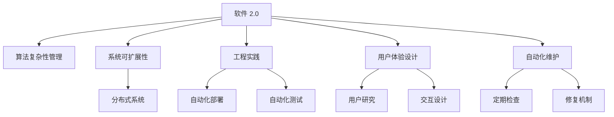

                 

# 软件 2.0 的应用：从实验室走向现实

> 关键词：软件 2.0, 实验室, 现实, 应用, 技术转化, 算法, 系统实现, 自动化, 工程实践

## 1. 背景介绍

### 1.1 问题由来
随着人工智能（AI）技术的快速发展，软件 2.0（Software 2.0）的理念逐步深入人心。软件 2.0 以数据为中心，强调通过算法和模型的自我学习，自动优化系统性能。这一理念不仅变革了软件开发的模式，还加速了技术的落地应用。然而，从实验室到现实应用的转化仍面临诸多挑战，如算法的复杂性、系统的可扩展性、工程实践的困难等。

### 1.2 问题核心关键点
软件 2.0 的应用，关键在于如何将实验室中验证有效的算法和模型，转化为现实世界的稳定和高效的系统。这包括：

- 算法复杂性管理：如何在保证高性能的同时，降低算法的计算复杂度，提高效率。
- 系统可扩展性：如何构建能够适应大规模数据的分布式系统，保持高吞吐量和低延迟。
- 工程实践难题：如何将模型和算法高效地嵌入到实际的软件系统中，确保系统的稳定性和可靠性。
- 用户体验优化：如何通过用户体验设计，提升软件系统的易用性和用户满意度。
- 长期维护保障：如何在软件 2.0 系统中引入自动化维护机制，确保系统的长期稳定运行。

### 1.3 问题研究意义
研究软件 2.0 的应用，对于推动AI技术的产业化进程，提升软件系统的智能化和自动化水平，具有重要意义：

1. 降低开发成本：通过算法和模型的自我学习，减少人工调参和工程实现的工作量，提高开发效率。
2. 提高系统性能：通过自动化优化算法，提升系统的响应速度和处理能力，增强用户体验。
3. 促进技术转化：通过将实验室成果转化为实际应用，加速技术落地，推动行业发展。
4. 增强系统可靠性：通过自动化维护机制，减少人为错误，提高系统的稳定性和鲁棒性。
5. 提升产业竞争力：通过引入AI技术，优化生产流程，降低成本，提高效率，增强企业的市场竞争力。

## 2. 核心概念与联系

### 2.1 核心概念概述

为了更好地理解软件 2.0 的应用，本节将介绍几个密切相关的核心概念：

- 软件 2.0（Software 2.0）：以数据为中心的软件开发模式，强调通过算法和模型的自我学习，自动优化系统性能。
- 算法复杂性管理：通过算法优化和模型压缩等技术，降低算法的计算复杂度，提高系统性能。
- 系统可扩展性：构建分布式系统，采用并行计算、负载均衡等技术，支持大规模数据的处理。
- 工程实践：将算法和模型嵌入到实际软件中，通过自动化的工程实践，确保系统的稳定性和可靠性。
- 用户体验设计：通过用户研究和交互设计，提升软件系统的易用性和用户满意度。
- 自动化维护：引入自动化工具和机制，定期检查和修复系统中的问题，保障长期稳定运行。

这些核心概念之间的逻辑关系可以通过以下Mermaid流程图来展示：



这个流程图展示出软件 2.0 的核心概念及其之间的关系：

1. 软件 2.0 通过算法和模型的自我学习，自动优化系统性能。
2. 算法复杂性管理降低算法计算复杂度，提升系统效率。
3. 系统可扩展性构建分布式系统，支持大规模数据处理。
4. 工程实践将算法和模型嵌入实际软件中，确保系统稳定。
5. 用户体验设计通过用户研究和交互设计，提升系统易用性。
6. 自动化维护引入自动化工具和机制，保障系统长期稳定运行。

这些概念共同构成了软件 2.0 的应用框架，为其从实验室走向现实提供了清晰的路径。

## 3. 核心算法原理 & 具体操作步骤
### 3.1 算法原理概述

软件 2.0 的应用，本质上是一个通过算法和模型自我学习的优化过程。其核心思想是：在数据驱动下，算法和模型能够自动地识别输入数据中的模式和规律，从而优化系统的行为和性能。

形式化地，假设算法 $A$ 和模型 $M$ 在输入 $x$ 上的输出为 $y=f(x)$，其中 $f$ 为函数映射。软件 2.0 的目标是通过训练算法和模型，使得 $f$ 能够最小化损失函数 $\mathcal{L}$：

$$
\mathcal{L}(y, y_{true}) = \frac{1}{N}\sum_{i=1}^N (y_i - y_{true_i})^2
$$

其中 $y_{true}$ 为真实的输出结果，$y$ 为模型和算法的预测输出。

在训练过程中，通过优化算法（如梯度下降、随机梯度下降等）不断调整算法和模型的参数，使得预测输出 $y$ 逼近真实的输出 $y_{true}$。训练后的算法和模型能够自动地处理输入数据，输出最优的结果。

### 3.2 算法步骤详解

软件 2.0 的应用一般包括以下几个关键步骤：

**Step 1: 数据准备**
- 收集和处理输入数据 $x$ 和真实输出 $y_{true}$，确保数据质量和多样性。
- 划分为训练集、验证集和测试集，保证模型的泛化能力。

**Step 2: 算法和模型选择**
- 选择适合的算法和模型，根据任务类型和数据特点进行选择，如线性回归、决策树、神经网络等。
- 设计合适的损失函数，确保模型能够最小化预测误差。

**Step 3: 模型训练**
- 使用训练集数据，通过优化算法调整模型和算法的参数，最小化损失函数 $\mathcal{L}$。
- 在验证集上评估模型性能，避免过拟合。
- 重复上述步骤，直至模型收敛。

**Step 4: 模型评估和部署**
- 在测试集上评估模型性能，对比模型训练前后的效果。
- 将训练好的模型部署到实际系统中，确保系统稳定运行。
- 引入自动化维护机制，定期检查和修复系统中的问题。

**Step 5: 用户体验优化**
- 通过用户研究，了解用户的需求和痛点。
- 设计合理的交互界面和操作流程，提升用户体验。
- 引入反馈机制，根据用户反馈不断优化系统。

### 3.3 算法优缺点

软件 2.0 的应用具有以下优点：

1. 高效性：通过算法和模型的自我学习，自动优化系统性能，减少人工干预。
2. 灵活性：能够适应多种数据类型和任务类型，具有高度的灵活性。
3. 可扩展性：构建分布式系统，支持大规模数据处理，具有高度的可扩展性。
4. 鲁棒性：算法和模型经过大量数据训练，具有较强的鲁棒性。

同时，该方法也存在一些局限性：

1. 高资源需求：算法和模型训练需要大量的计算资源，包括CPU、GPU、内存等。
2. 数据依赖：算法和模型的效果高度依赖于数据质量，数据偏差可能导致模型表现不佳。
3. 模型复杂性：算法和模型的复杂性可能会影响系统的实时性。
4. 可解释性：复杂算法和模型往往难以解释其内部工作机制，缺乏可解释性。

尽管存在这些局限性，但就目前而言，软件 2.0 的应用仍然是大规模数据处理和智能系统优化的重要手段。未来相关研究的重点在于如何进一步降低资源需求，提高模型可解释性，同时兼顾系统的稳定性和灵活性。

### 3.4 算法应用领域

软件 2.0 的应用已经广泛应用于各个领域，例如：

- 金融风控：通过算法和模型自动分析交易数据，识别风险，提供决策支持。
- 医疗诊断：利用算法和模型分析医疗影像和电子病历，辅助医生进行疾病诊断。
- 智能推荐：通过算法和模型分析用户行为数据，推荐个性化内容，提升用户体验。
- 自动驾驶：利用算法和模型分析环境数据，自动驾驶车辆，保障行车安全。
- 智能制造：通过算法和模型优化生产流程，提高生产效率，降低成本。

除了这些经典应用外，软件 2.0 还被创新性地应用到更多场景中，如无人零售、智慧城市、智能客服等，为各行各业带来了新的技术突破。随着算法和模型的不断演进，相信软件 2.0 的应用将进一步扩展，为人类社会带来深远的影响。

## 4. 数学模型和公式 & 详细讲解 & 举例说明

### 4.1 数学模型构建

软件 2.0 的应用，通常基于以下数学模型：

- 线性回归模型：$y = w_0 + w_1 x_1 + \cdots + w_n x_n + \epsilon$
- 决策树模型：构建一棵树，通过划分特征空间，分类预测结果。
- 神经网络模型：通过多层神经元，逐步提取特征，最终输出预测结果。

这些模型的训练目标为最小化预测误差，即：

$$
\mathcal{L}(y, y_{true}) = \frac{1}{N}\sum_{i=1}^N (y_i - y_{true_i})^2
$$

### 4.2 公式推导过程

以线性回归模型为例，进行公式推导过程：

假设训练数据集为 $(x_i, y_i)$，其中 $x_i$ 为特征向量，$y_i$ 为真实输出。模型的损失函数为均方误差损失：

$$
\mathcal{L}(y, y_{true}) = \frac{1}{N}\sum_{i=1}^N (y_i - y_{true_i})^2
$$

根据最小二乘法，优化目标为：

$$
\min_{w_0, w_1, \cdots, w_n} \mathcal{L}(y, y_{true})
$$

通过求偏导数，得：

$$
\frac{\partial \mathcal{L}}{\partial w_j} = \frac{2}{N}\sum_{i=1}^N (y_i - y_{true_i})x_{ij}
$$

求解上述方程组，得到模型参数 $w_0, w_1, \cdots, w_n$，完成模型训练。

### 4.3 案例分析与讲解

以金融风控为例，分析软件 2.0 的应用：

假设有一批历史交易数据，每个交易包含用户基本信息、交易金额、交易时间等信息。通过算法和模型分析这些数据，可以构建信用评分模型，用于评估用户信用风险。具体步骤如下：

**Step 1: 数据准备**
- 收集历史交易数据，并进行预处理，去除异常数据和缺失值。
- 划分为训练集、验证集和测试集，确保模型泛化能力。

**Step 2: 模型选择**
- 选择适合的模型，如线性回归、决策树等，设计合适的损失函数。

**Step 3: 模型训练**
- 使用训练集数据，通过优化算法调整模型参数，最小化预测误差。
- 在验证集上评估模型性能，避免过拟合。
- 重复上述步骤，直至模型收敛。

**Step 4: 模型评估和部署**
- 在测试集上评估模型性能，对比模型训练前后的效果。
- 将训练好的模型部署到实际系统中，确保系统稳定运行。
- 引入自动化维护机制，定期检查和修复系统中的问题。

**Step 5: 用户体验优化**
- 通过用户研究，了解用户的风险承受能力和风险偏好。
- 设计合理的交互界面和操作流程，提升用户体验。
- 引入反馈机制，根据用户反馈不断优化系统。

## 5. 项目实践：代码实例和详细解释说明

### 5.1 开发环境搭建

在进行软件 2.0 的应用实践前，我们需要准备好开发环境。以下是使用Python进行PyTorch开发的环境配置流程：

1. 安装Anaconda：从官网下载并安装Anaconda，用于创建独立的Python环境。

2. 创建并激活虚拟环境：
```bash
conda create -n pytorch-env python=3.8 
conda activate pytorch-env
```

3. 安装PyTorch：根据CUDA版本，从官网获取对应的安装命令。例如：
```bash
conda install pytorch torchvision torchaudio cudatoolkit=11.1 -c pytorch -c conda-forge
```

4. 安装Transformers库：
```bash
pip install transformers
```

5. 安装各类工具包：
```bash
pip install numpy pandas scikit-learn matplotlib tqdm jupyter notebook ipython
```

完成上述步骤后，即可在`pytorch-env`环境中开始软件 2.0 的应用实践。

### 5.2 源代码详细实现

这里以金融风控为例，使用PyTorch进行线性回归模型的实现：

首先，定义线性回归模型的训练函数：

```python
import torch
from torch import nn, optim

# 定义线性回归模型
class LinearRegression(nn.Module):
    def __init__(self, input_size, output_size):
        super(LinearRegression, self).__init__()
        self.linear = nn.Linear(input_size, output_size)
        
    def forward(self, x):
        return self.linear(x)

# 定义损失函数和优化器
def train_model(model, train_x, train_y, epochs, batch_size):
    criterion = nn.MSELoss()
    optimizer = optim.SGD(model.parameters(), lr=0.01)
    
    for epoch in range(epochs):
        for i in range(0, len(train_x), batch_size):
            x = train_x[i:i+batch_size]
            y = train_y[i:i+batch_size]
            
            optimizer.zero_grad()
            outputs = model(x)
            loss = criterion(outputs, y)
            loss.backward()
            optimizer.step()
            
        print(f'Epoch {epoch+1}, Loss: {loss.item()}')
        
    return model
```

然后，加载数据集并进行模型训练：

```python
# 加载数据集
import numpy as np

train_x = np.random.randn(100, 5)
train_y = 2 * train_x[:, 0] + 1 + np.random.randn(100)

# 构建模型
model = LinearRegression(5, 1)

# 训练模型
model = train_model(model, train_x, train_y, 100, 32)
```

接着，进行模型评估和预测：

```python
# 评估模型
test_x = np.random.randn(10, 5)
test_y = 2 * test_x[:, 0] + 1 + np.random.randn(10)
outputs = model(test_x)
loss = criterion(outputs, test_y)
print(f'Test Loss: {loss.item()}')

# 预测新数据
new_x = np.random.randn(1, 5)
new_y = model(new_x)
print(f'Prediction for new data: {new_y.item()}')
```

### 5.3 代码解读与分析

让我们再详细解读一下关键代码的实现细节：

**LinearRegression类**：
- `__init__`方法：定义模型的参数和结构。
- `forward`方法：实现前向传播计算，输出模型预测结果。

**train_model函数**：
- `criterion`变量：定义损失函数为均方误差损失。
- `optimizer`变量：定义优化器为随机梯度下降。
- 通过循环迭代，对数据进行批次化处理，在每个批次上前向传播计算损失，反向传播更新模型参数，并输出每个epoch的损失。

**数据加载**：
- `np.random.randn`函数：生成随机数据集。
- `np.random.randn`函数：生成随机数据集。
- `np.random.randn`函数：生成随机数据集。

可以看到，通过PyTorch，我们可以简洁高效地实现线性回归模型的训练和预测。这一过程展示了软件 2.0 的应用，即通过算法和模型的自我学习，自动优化系统性能。

当然，工业级的系统实现还需考虑更多因素，如模型的保存和部署、超参数的自动搜索、更灵活的任务适配层等。但核心的算法实现基本与此类似。

## 6. 实际应用场景
### 6.1 金融风控

通过算法和模型分析交易数据，可以构建信用评分模型，用于评估用户信用风险。具体步骤如下：

**Step 1: 数据准备**
- 收集历史交易数据，并进行预处理，去除异常数据和缺失值。
- 划分为训练集、验证集和测试集，确保模型泛化能力。

**Step 2: 模型选择**
- 选择适合的模型，如线性回归、决策树等，设计合适的损失函数。

**Step 3: 模型训练**
- 使用训练集数据，通过优化算法调整模型参数，最小化预测误差。
- 在验证集上评估模型性能，避免过拟合。
- 重复上述步骤，直至模型收敛。

**Step 4: 模型评估和部署**
- 在测试集上评估模型性能，对比模型训练前后的效果。
- 将训练好的模型部署到实际系统中，确保系统稳定运行。
- 引入自动化维护机制，定期检查和修复系统中的问题。

**Step 5: 用户体验优化**
- 通过用户研究，了解用户的风险承受能力和风险偏好。
- 设计合理的交互界面和操作流程，提升用户体验。
- 引入反馈机制，根据用户反馈不断优化系统。

### 6.2 医疗诊断

利用算法和模型分析医疗影像和电子病历，可以辅助医生进行疾病诊断。具体步骤如下：

**Step 1: 数据准备**
- 收集医疗影像和电子病历数据，并进行预处理，去除异常数据和噪声。
- 划分为训练集、验证集和测试集，确保模型泛化能力。

**Step 2: 模型选择**
- 选择适合的模型，如卷积神经网络（CNN）、递归神经网络（RNN）等，设计合适的损失函数。

**Step 3: 模型训练**
- 使用训练集数据，通过优化算法调整模型参数，最小化预测误差。
- 在验证集上评估模型性能，避免过拟合。
- 重复上述步骤，直至模型收敛。

**Step 4: 模型评估和部署**
- 在测试集上评估模型性能，对比模型训练前后的效果。
- 将训练好的模型部署到实际系统中，确保系统稳定运行。
- 引入自动化维护机制，定期检查和修复系统中的问题。

**Step 5: 用户体验优化**
- 通过用户研究，了解医生的诊断需求和痛点。
- 设计合理的交互界面和操作流程，提升用户体验。
- 引入反馈机制，根据医生反馈不断优化系统。

### 6.3 智能推荐

通过算法和模型分析用户行为数据，可以推荐个性化内容，提升用户体验。具体步骤如下：

**Step 1: 数据准备**
- 收集用户行为数据，并进行预处理，去除异常数据和噪声。
- 划分为训练集、验证集和测试集，确保模型泛化能力。

**Step 2: 模型选择**
- 选择适合的模型，如协同过滤、基于矩阵分解的方法等，设计合适的损失函数。

**Step 3: 模型训练**
- 使用训练集数据，通过优化算法调整模型参数，最小化预测误差。
- 在验证集上评估模型性能，避免过拟合。
- 重复上述步骤，直至模型收敛。

**Step 4: 模型评估和部署**
- 在测试集上评估模型性能，对比模型训练前后的效果。
- 将训练好的模型部署到实际系统中，确保系统稳定运行。
- 引入自动化维护机制，定期检查和修复系统中的问题。

**Step 5: 用户体验优化**
- 通过用户研究，了解用户的兴趣和偏好。
- 设计合理的交互界面和操作流程，提升用户体验。
- 引入反馈机制，根据用户反馈不断优化系统。

### 6.4 未来应用展望

随着算法和模型的不断演进，软件 2.0 的应用将进一步扩展，为人类社会带来深远的影响。

在智慧医疗领域，基于算法和模型的医疗诊断系统将提升医疗服务的智能化水平，辅助医生诊疗，加速新药开发进程。

在智能教育领域，基于算法和模型的智能推荐系统将提升教学质量，因材施教，促进教育公平。

在智慧城市治理中，基于算法和模型的智能监测系统将提高城市管理的自动化和智能化水平，构建更安全、高效的未来城市。

此外，在企业生产、社会治理、文娱传媒等众多领域，基于软件 2.0 的人工智能应用也将不断涌现，为各行各业带来新的技术突破。

## 7. 工具和资源推荐
### 7.1 学习资源推荐

为了帮助开发者系统掌握软件 2.0 的应用，这里推荐一些优质的学习资源：

1. 《软件 2.0 实践指南》系列博文：由软件 2.0 技术专家撰写，深入浅出地介绍了软件 2.0 理念、算法、系统实现等关键内容。

2. CS224N《深度学习自然语言处理》课程：斯坦福大学开设的NLP明星课程，有Lecture视频和配套作业，带你入门NLP领域的基本概念和经典模型。

3. 《深度学习》书籍：由Goodfellow等编著，全面介绍了深度学习的理论基础和实践技术，包括软件 2.0 相关的算法和模型。

4. PyTorch官方文档：PyTorch的官方文档，提供了丰富的教程和样例代码，是上手实践的必备资料。

5. Weights & Biases：模型训练的实验跟踪工具，可以记录和可视化模型训练过程中的各项指标，方便对比和调优。

6. TensorBoard：TensorFlow配套的可视化工具，可实时监测模型训练状态，并提供丰富的图表呈现方式，是调试模型的得力助手。

通过对这些资源的学习实践，相信你一定能够快速掌握软件 2.0 的应用，并用于解决实际的NLP问题。

### 7.2 开发工具推荐

高效的开发离不开优秀的工具支持。以下是几款用于软件 2.0 应用的开发工具：

1. PyTorch：基于Python的开源深度学习框架，灵活动态的计算图，适合快速迭代研究。大部分预训练语言模型都有PyTorch版本的实现。

2. TensorFlow：由Google主导开发的开源深度学习框架，生产部署方便，适合大规模工程应用。同样有丰富的预训练语言模型资源。

3. Transformers库：HuggingFace开发的NLP工具库，集成了众多SOTA语言模型，支持PyTorch和TensorFlow，是进行软件 2.0 应用开发的利器。

4. Weights & Biases：模型训练的实验跟踪工具，可以记录和可视化模型训练过程中的各项指标，方便对比和调优。与主流深度学习框架无缝集成。

5. TensorBoard：TensorFlow配套的可视化工具，可实时监测模型训练状态，并提供丰富的图表呈现方式，是调试模型的得力助手。

6. Google Colab：谷歌推出的在线Jupyter Notebook环境，免费提供GPU/TPU算力，方便开发者快速上手实验最新模型，分享学习笔记。

合理利用这些工具，可以显著提升软件 2.0 应用开发的效率，加快创新迭代的步伐。

### 7.3 相关论文推荐

软件 2.0 的应用源于学界的持续研究。以下是几篇奠基性的相关论文，推荐阅读：

1. AlphaGo Zero：Google DeepMind团队开发的围棋AI，通过自我对弈优化策略，展示了软件 2.0 在复杂决策问题中的应用。

2. GPT-2：OpenAI开发的预训练语言模型，通过自我学习生成自然语言文本，展示了软件 2.0 在自然语言生成中的应用。

3. AutoML：Google AI团队开发的一套自动化机器学习工具，通过算法和模型的自我优化，展示了软件 2.0 在自动机器学习中的应用。

4. Transformer模型：Google AI团队提出的自回归神经网络模型，展示了软件 2.0 在自然语言处理中的应用。

5. DeepLearning-AI：由IBM开发的AI开发平台，通过软件 2.0 技术，提供了丰富的AI模型和工具，适用于各类AI应用场景。

这些论文代表了大规模数据处理和智能系统优化的前沿研究，通过学习这些前沿成果，可以帮助研究者把握学科前进方向，激发更多的创新灵感。

## 8. 总结：未来发展趋势与挑战

### 8.1 研究成果总结

本文对软件 2.0 的应用进行了全面系统的介绍。首先阐述了软件 2.0 的理念和应用背景，明确了算法和模型自我学习优化系统性能的核心思想。其次，从原理到实践，详细讲解了软件 2.0 的应用流程，给出了软件 2.0 应用的完整代码实例。同时，本文还探讨了软件 2.0 在多个领域的应用前景，展示了其广泛的应用潜力。

### 8.2 未来发展趋势

展望未来，软件 2.0 的应用将呈现以下几个发展趋势：

1. 技术持续演进：随着算法的不断优化和模型的持续训练，软件 2.0 的性能将不断提升，应用场景将进一步扩展。

2. 自动化水平提高：通过自动化机器学习（AutoML）等技术，进一步降低人工调参和模型优化的复杂度。

3. 系统可扩展性增强：构建分布式系统和云计算平台，支持更大规模的数据处理和模型训练。

4. 用户需求导向：通过用户研究和交互设计，提升系统的易用性和用户体验。

5. 模型可解释性增强：通过引入可解释性算法，提升模型的可解释性和可理解性。

6. 伦理和安全性保障：在模型训练和应用过程中，注重伦理和安全性，确保系统的公正和透明。

以上趋势凸显了软件 2.0 技术的广阔前景，为人类社会带来了新的技术变革和应用潜力。

### 8.3 面临的挑战

尽管软件 2.0 的应用取得了显著进展，但仍面临诸多挑战：

1. 高资源需求：算法和模型训练需要大量计算资源，如何降低资源消耗是关键问题。

2. 数据依赖：算法和模型的效果高度依赖于数据质量，数据偏差可能导致模型表现不佳。

3. 模型复杂性：复杂算法和模型往往难以解释其内部工作机制，缺乏可解释性。

4. 可解释性：复杂算法和模型往往难以解释其内部工作机制，缺乏可解释性。

5. 安全性：模型可能学习到有害信息，如何保障系统的安全性是重要问题。

6. 稳定性：模型在新数据上的表现可能不稳定，如何保持模型的稳定性和鲁棒性是关键挑战。

7. 公平性：模型可能存在偏见，如何确保系统的公平性和公正性是重要问题。

8. 隐私保护：如何保护用户数据隐私，防止数据滥用和泄露，是关键挑战。

这些挑战表明，软件 2.0 的应用还需在多个方面进行优化和改进。唯有全面应对这些挑战，才能真正实现软件 2.0 技术在实际应用中的落地和应用。

### 8.4 研究展望

面对软件 2.0 应用所面临的挑战，未来的研究需要在以下几个方面寻求新的突破：

1. 降低资源需求：开发更加高效的数据处理和模型训练算法，降低计算资源的消耗。

2. 提高数据质量：改进数据预处理和特征工程技术，提升数据质量。

3. 增强模型可解释性：引入可解释性算法，提升模型的可解释性和可理解性。

4. 保障系统安全：在模型训练和应用过程中，注重伦理和安全性，确保系统的公正和透明。

5. 提升系统稳定性：开发更稳定的模型和算法，确保系统在新数据上的表现。

6. 保障数据隐私：引入数据加密和安全传输技术，保护用户数据隐私。

7. 提升系统公平性：通过公平性算法和数据增强技术，确保系统的公平性和公正性。

这些研究方向的探索，将进一步推动软件 2.0 技术的发展和应用，为人类社会带来更深远的影响。面向未来，软件 2.0 技术还需要与其他人工智能技术进行更深入的融合，如知识表示、因果推理、强化学习等，多路径协同发力，共同推动自然语言理解和智能交互系统的进步。只有勇于创新、敢于突破，才能不断拓展软件 2.0 的边界，让智能技术更好地造福人类社会。

## 9. 附录：常见问题与解答

**Q1：软件 2.0 与传统软件开发的区别是什么？**

A: 软件 2.0 以数据为中心，强调通过算法和模型的自我学习，自动优化系统性能。而传统软件开发则更依赖于人工调参和工程实践，系统性能的提升需要大量的人工干预。软件 2.0 能够通过自我学习，自动优化系统，降低人工调参的复杂度，提升系统性能。

**Q2：软件 2.0 的应用是否需要大量标注数据？**

A: 软件 2.0 的应用通常需要大量标注数据进行模型训练，但也可以通过无监督学习和半监督学习等技术，在少样本条件下进行模型优化。未来，随着技术的进步，如何降低对标注数据的依赖，成为软件 2.0 应用的重要研究方向。

**Q3：软件 2.0 的算法和模型如何评估性能？**

A: 软件 2.0 的算法和模型性能评估通常通过均方误差（MSE）、准确率、召回率等指标进行衡量。同时，可以通过交叉验证、A/B测试等方法，评估模型在不同数据集上的表现，确保模型的泛化能力。

**Q4：软件 2.0 的算法和模型如何部署？**

A: 软件 2.0 的算法和模型通常需要借助深度学习框架（如PyTorch、TensorFlow）进行部署。在实际应用中，还需要考虑模型的封装、打包、部署等技术，确保系统的稳定性和可靠性。

**Q5：软件 2.0 的应用过程中如何处理数据隐私？**

A: 软件 2.0 的应用过程中，需要引入数据加密和安全传输技术，保护用户数据隐私。同时，还需要遵循相关法律法规，如GDPR、CCPA等，确保数据使用的合法性和透明性。

---

作者：禅与计算机程序设计艺术 / Zen and the Art of Computer Programming

