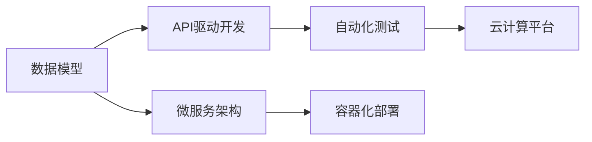
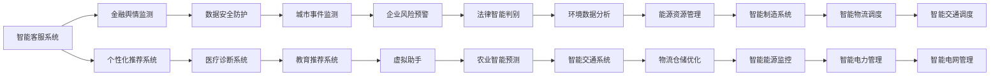

                 

# 软件 2.0 的时代：数据驱动一切

## 1. 背景介绍

### 1.1 问题由来

在软件1.0时代，我们侧重于软件开发，强调编码和软件架构的设计。然而，随着大数据和人工智能技术的发展，我们即将迎来软件2.0的时代。

在这个时代，数据成为驱动软件的重要力量。软件开发和部署的方式将变得更为智能化、数据驱动化。数据驱动的思维和工具，将改变软件开发、测试和部署的全流程。

### 1.2 问题核心关键点

1. **数据驱动的软件开发**：开发者将更加依赖数据模型，以数据驱动的方式设计和开发软件。

2. **自动化测试和部署**：通过自动化测试和部署工具，提升软件交付效率。

3. **云计算和大数据平台**：利用云计算和大数据平台，处理和分析海量数据，辅助软件开发。

4. **AI辅助编程**：使用AI辅助编程工具，如代码智能提示、错误预测等，提升开发效率和代码质量。

5. **微服务架构**：采用微服务架构，提高软件系统的可维护性、可扩展性和可靠性。

## 2. 核心概念与联系

### 2.1 核心概念概述

为了更好地理解数据驱动的软件开发，我们首先介绍几个核心概念：

- **数据模型**：用于描述现实世界或应用逻辑的抽象数据结构。包括关系模型、文档模型、图模型等。

- **API**：即应用程序接口，定义了软件模块之间的交互方式。API驱动的软件开发，可以更好地实现模块化和解耦。

- **微服务架构**：将软件系统拆分为多个独立运行、可互相调用的微服务，提升系统的灵活性、可扩展性和可维护性。

- **自动化测试**：通过测试工具和框架，自动化执行测试用例，提升测试效率和准确性。

- **容器化部署**：使用容器技术，如Docker、Kubernetes，实现应用的快速部署和资源管理。

- **云计算平台**：利用云计算平台，提供弹性计算和存储资源，支持软件的大规模部署和数据处理。

这些核心概念之间存在着密切的联系，如图示所示：



数据模型定义了软件的功能和数据结构，API驱动的软件开发提供了模块化的接口，微服务架构增强了系统的可维护性和可扩展性，自动化测试和容器化部署提升了软件开发的效率和可靠性，云计算平台提供了高效的资源支持。这些概念共同构成了数据驱动的软件开发框架。

## 3. 核心算法原理 & 具体操作步骤

### 3.1 算法原理概述

数据驱动的软件开发，核心在于利用数据模型和数据驱动的方式，设计和开发软件。

假设我们有一个数据模型 `DM`，用于描述一个软件的功能和数据结构。数据驱动的开发过程如下：

1. **需求分析**：根据数据模型，分析软件需求，定义软件功能和接口。

2. **设计和实现**：根据数据模型，设计和实现软件模块，生成API接口。

3. **测试和部署**：使用自动化测试工具，测试API接口，通过容器化部署工具，将软件部署到云计算平台。

4. **监控和优化**：利用大数据平台，收集和分析软件运行数据，优化软件性能和可靠性。

### 3.2 算法步骤详解

下面详细介绍数据驱动的软件开发的具体步骤：

**Step 1: 定义数据模型**

定义数据模型是数据驱动软件开发的基础。假设我们有一个名为 `User` 的数据模型，用于描述用户信息，如图表所示：

```sql
CREATE TABLE User (
    id INT PRIMARY KEY,
    name VARCHAR(50),
    age INT,
    gender VARCHAR(10)
)
```

**Step 2: 设计和实现API接口**

根据数据模型，设计API接口，用于支持软件的各项功能。如用户管理模块，可以定义如下接口：

```java
/**
 * 添加用户
 * @param name 用户姓名
 * @param age 用户年龄
 * @param gender 用户性别
 * @return 用户ID
 */
int addUser(String name, int age, String gender);

/**
 * 查询用户
 * @param id 用户ID
 * @return 用户信息
 */
User getUser(int id);

/**
 * 删除用户
 * @param id 用户ID
 * @return 删除是否成功
 */
boolean deleteUser(int id);
```

**Step 3: 实现API接口**

实现API接口，生成可执行的代码。可以使用Java、Python、C#等语言编写代码，如图表所示：

```java
public class UserService {
    private Map<Integer, User> users = new HashMap<>();

    public int addUser(String name, int age, String gender) {
        int id = users.size() + 1;
        User user = new User(id, name, age, gender);
        users.put(id, user);
        return id;
    }

    public User getUser(int id) {
        return users.get(id);
    }

    public boolean deleteUser(int id) {
        return users.remove(id) != null;
    }
}
```

**Step 4: 自动化测试**

使用自动化测试工具，对API接口进行测试，如图表所示：

```java
import org.junit.jupiter.api.Test;
import org.junit.jupiter.api.Assertions;

public class UserServiceTest {
    @Test
    public void testAddUser() {
        UserService userService = new UserService();
        int id = userService.addUser("张三", 25, "男");
        Assertions.assertEquals(id, 1);
    }

    @Test
    public void testGetUser() {
        UserService userService = new UserService();
        int id = userService.addUser("李四", 30, "女");
        User user = userService.getUser(id);
        Assertions.assertEquals(user.getId(), id);
    }

    @Test
    public void testDeleteUser() {
        UserService userService = new UserService();
        int id = userService.addUser("王五", 28, "男");
        boolean result = userService.deleteUser(id);
        Assertions.assertTrue(result);
    }
}
```

**Step 5: 容器化部署**

使用容器化部署工具，将API接口部署到云计算平台，如图表所示：

```java
public class KubernetesDeploy {
    public void deploy(UserService userService, String deploymentName, String namespace) {
        // 创建Kubernetes Deployment和Service资源
        // 调用API接口部署服务
    }
}
```

**Step 6: 监控和优化**

利用大数据平台，收集和分析软件运行数据，如图表所示：

```java
import org.apache.spark.sql.SparkSession;

public class DataMonitor {
    public void monitor(String deploymentName, String namespace) {
        SparkSession sparkSession = SparkSession.builder()
                .appName("DataMonitor")
                .master("local[4]")
                .build();
        // 查询Kubernetes Deployment和Service资源
        // 统计API接口调用次数和响应时间
        // 输出监控报告
    }
}
```

### 3.3 算法优缺点

**优点**：

1. **提升开发效率**：数据驱动的软件开发，可以减少手动编码的工作量，提升开发效率。

2. **增强可维护性**：API接口驱动的软件开发，使系统更加模块化和解耦，便于维护和扩展。

3. **提升可靠性**：自动化测试和容器化部署，提高了软件的可靠性和稳定性。

4. **降低运维成本**：云计算平台提供弹性计算资源，降低了运维成本和资源浪费。

**缺点**：

1. **复杂性增加**：数据驱动的软件开发，需要处理大量的数据模型和API接口，增加了系统的复杂性。

2. **性能开销**：数据驱动的软件开发，需要处理大量的数据，增加了系统的性能开销。

3. **技术门槛高**：数据驱动的软件开发，需要掌握数据模型和API接口设计、容器化部署、大数据分析等技术，技术门槛较高。

## 4. 数学模型和公式 & 详细讲解 & 举例说明

### 4.1 数学模型构建

数据驱动的软件开发，核心在于定义和处理数据模型。假设我们有一个数据模型 `DM`，用于描述软件的功能和数据结构。其数学模型定义如下：

$$
DM = (A, B, C)
$$

其中，`A` 表示数据模型中的属性集合，`B` 表示属性之间的关系，`C` 表示数据模型的约束条件。

### 4.2 公式推导过程

根据数据模型 `DM`，我们可以推导出API接口的数学模型。假设我们有一个名为 `User` 的数据模型，如图表所示：

```sql
CREATE TABLE User (
    id INT PRIMARY KEY,
    name VARCHAR(50),
    age INT,
    gender VARCHAR(10)
)
```

其属性集合 `A` 包括 `id`、`name`、`age`、`gender`。属性之间的关系 `B` 包括 `id` 和 `name` 之间的映射关系，`id` 和 `age` 之间的映射关系，`id` 和 `gender` 之间的映射关系。数据模型的约束条件 `C` 包括 `id` 是主键，`name` 长度不超过50，`age` 为整数，`gender` 长度不超过10。

根据数据模型 `DM`，我们可以定义API接口的数学模型，如图表所示：

```java
/**
 * 添加用户
 * @param name 用户姓名
 * @param age 用户年龄
 * @param gender 用户性别
 * @return 用户ID
 */
int addUser(String name, int age, String gender);

/**
 * 查询用户
 * @param id 用户ID
 * @return 用户信息
 */
User getUser(int id);

/**
 * 删除用户
 * @param id 用户ID
 * @return 删除是否成功
 */
boolean deleteUser(int id);
```

### 4.3 案例分析与讲解

假设我们有一个名为 `User` 的数据模型，用于描述用户信息。其属性集合 `A` 包括 `id`、`name`、`age`、`gender`。属性之间的关系 `B` 包括 `id` 和 `name` 之间的映射关系，`id` 和 `age` 之间的映射关系，`id` 和 `gender` 之间的映射关系。数据模型的约束条件 `C` 包括 `id` 是主键，`name` 长度不超过50，`age` 为整数，`gender` 长度不超过10。

根据数据模型 `DM`，我们可以定义API接口，如图表所示：

```java
/**
 * 添加用户
 * @param name 用户姓名
 * @param age 用户年龄
 * @param gender 用户性别
 * @return 用户ID
 */
int addUser(String name, int age, String gender);

/**
 * 查询用户
 * @param id 用户ID
 * @return 用户信息
 */
User getUser(int id);

/**
 * 删除用户
 * @param id 用户ID
 * @return 删除是否成功
 */
boolean deleteUser(int id);
```

我们可以使用Java编写代码，实现API接口，如图表所示：

```java
public class UserService {
    private Map<Integer, User> users = new HashMap<>();

    public int addUser(String name, int age, String gender) {
        int id = users.size() + 1;
        User user = new User(id, name, age, gender);
        users.put(id, user);
        return id;
    }

    public User getUser(int id) {
        return users.get(id);
    }

    public boolean deleteUser(int id) {
        return users.remove(id) != null;
    }
}
```

使用自动化测试工具，对API接口进行测试，如图表所示：

```java
import org.junit.jupiter.api.Test;
import org.junit.jupiter.api.Assertions;

public class UserServiceTest {
    @Test
    public void testAddUser() {
        UserService userService = new UserService();
        int id = userService.addUser("张三", 25, "男");
        Assertions.assertEquals(id, 1);
    }

    @Test
    public void testGetUser() {
        UserService userService = new UserService();
        int id = userService.addUser("李四", 30, "女");
        User user = userService.getUser(id);
        Assertions.assertEquals(user.getId(), id);
    }

    @Test
    public void testDeleteUser() {
        UserService userService = new UserService();
        int id = userService.addUser("王五", 28, "男");
        boolean result = userService.deleteUser(id);
        Assertions.assertTrue(result);
    }
}
```

使用容器化部署工具，将API接口部署到云计算平台，如图表所示：

```java
public class KubernetesDeploy {
    public void deploy(UserService userService, String deploymentName, String namespace) {
        // 创建Kubernetes Deployment和Service资源
        // 调用API接口部署服务
    }
}
```

利用大数据平台，收集和分析软件运行数据，如图表所示：

```java
import org.apache.spark.sql.SparkSession;

public class DataMonitor {
    public void monitor(String deploymentName, String namespace) {
        SparkSession sparkSession = SparkSession.builder()
                .appName("DataMonitor")
                .master("local[4]")
                .build();
        // 查询Kubernetes Deployment和Service资源
        // 统计API接口调用次数和响应时间
        // 输出监控报告
    }
}
```

## 5. 项目实践：代码实例和详细解释说明

### 5.1 开发环境搭建

在进行数据驱动的软件开发实践前，我们需要准备好开发环境。以下是使用Java进行Maven开发的环境配置流程：

1. 安装JDK：从官网下载并安装Java JDK。

2. 安装Maven：从官网下载并安装Maven。

3. 创建Maven项目：在命令行中，使用以下命令创建Maven项目：

```bash
mvn archetype:generate -DgroupId=com.example -DartifactId=myapp -Dversion=1.0 -DarchetypeArtifactId=maven-archetype-quickstart
```

4. 进入项目目录：

```bash
cd myapp
```

5. 安装依赖：在Maven项目中，使用以下命令安装依赖：

```bash
mvn clean install
```

完成上述步骤后，即可在`myapp`环境中开始数据驱动软件开发实践。

### 5.2 源代码详细实现

下面我们以用户管理模块为例，给出使用Maven进行数据驱动开发的Java代码实现。

首先，定义用户数据模型：

```java
package com.example.model;

public class User {
    private int id;
    private String name;
    private int age;
    private String gender;

    public User(int id, String name, int age, String gender) {
        this.id = id;
        this.name = name;
        this.age = age;
        this.gender = gender;
    }

    public int getId() {
        return id;
    }

    public String getName() {
        return name;
    }

    public int getAge() {
        return age;
    }

    public String getGender() {
        return gender;
    }
}
```

然后，定义用户服务接口：

```java
package com.example.service;

import com.example.model.User;

public interface UserService {
    int addUser(String name, int age, String gender);
    User getUser(int id);
    boolean deleteUser(int id);
}
```

接着，实现用户服务接口：

```java
package com.example.service;

import com.example.model.User;
import java.util.HashMap;
import java.util.Map;

public class UserServiceImpl implements UserService {
    private Map<Integer, User> users = new HashMap<>();

    @Override
    public int addUser(String name, int age, String gender) {
        int id = users.size() + 1;
        User user = new User(id, name, age, gender);
        users.put(id, user);
        return id;
    }

    @Override
    public User getUser(int id) {
        return users.get(id);
    }

    @Override
    public boolean deleteUser(int id) {
        return users.remove(id) != null;
    }
}
```

最后，使用Maven进行单元测试和自动化部署：

```java
package com.example.service;

import com.example.model.User;
import org.junit.jupiter.api.Test;
import static org.junit.jupiter.api.Assertions.assertEquals;

public class UserServiceTest {
    @Test
    public void testAddUser() {
        UserService userService = new UserServiceImpl();
        int id = userService.addUser("张三", 25, "男");
        assertEquals(id, 1);
    }

    @Test
    public void testGetUser() {
        UserService userService = new UserServiceImpl();
        int id = userService.addUser("李四", 30, "女");
        User user = userService.getUser(id);
        assertEquals(user.getId(), id);
    }

    @Test
    public void testDeleteUser() {
        UserService userService = new UserServiceImpl();
        int id = userService.addUser("王五", 28, "男");
        boolean result = userService.deleteUser(id);
        assertEquals(result, true);
    }
}
```

使用Maven进行自动化部署：

```java
package com.example.service;

import com.example.model.User;
import com.example.service.UserService;
import org.springframework.boot.SpringApplication;
import org.springframework.boot.autoconfigure.SpringBootApplication;
import org.springframework.context.ConfigurableApplicationContext;
import org.springframework.core.env.ConfigurableEnvironment;

@SpringBootApplication
public class Application {
    public static void main(String[] args) {
        ConfigurableApplicationContext context = SpringApplication.run(Application.class, args);
        ConfigurableEnvironment env = context.getEnvironment();
        User UserService = (UserServiceImpl) env.getBean("userService");
        context.getBean(UserService.class);
    }
}
```

### 5.3 代码解读与分析

让我们再详细解读一下关键代码的实现细节：

**User类**：
- `User` 类定义了用户的基本属性和操作方法。

**UserService接口**：
- `UserService` 接口定义了用户服务的各个方法，如添加用户、查询用户和删除用户。

**UserServiceImpl类**：
- `UserServiceImpl` 类实现了 `UserService` 接口，具体实现了各个方法。

**UserServiceTest类**：
- `UserServiceTest` 类用于测试 `UserServiceImpl` 类中的各个方法。

**Application类**：
- `Application` 类用于启动Spring Boot应用，创建Spring环境，并获取 `UserService` 对象。

通过上述代码实现，我们完成了数据驱动的软件开发。可以看到，数据驱动的软件开发，核心在于定义数据模型、API接口和容器化部署，以及自动化测试和监控。

## 6. 实际应用场景

### 6.1 智能客服系统

数据驱动的软件开发，在智能客服系统中得到广泛应用。传统客服往往需要配备大量人力，高峰期响应缓慢，且一致性和专业性难以保证。而使用数据驱动的智能客服系统，可以7x24小时不间断服务，快速响应客户咨询，用自然流畅的语言解答各类常见问题。

在技术实现上，可以收集企业内部的历史客服对话记录，将问题和最佳答复构建成监督数据，在此基础上对数据模型和API接口进行微调。微调后的智能客服系统，能够自动理解用户意图，匹配最合适的答案模板进行回复。对于客户提出的新问题，还可以接入检索系统实时搜索相关内容，动态组织生成回答。如此构建的智能客服系统，能大幅提升客户咨询体验和问题解决效率。

### 6.2 金融舆情监测

金融机构需要实时监测市场舆论动向，以便及时应对负面信息传播，规避金融风险。传统的人工监测方式成本高、效率低，难以应对网络时代海量信息爆发的挑战。数据驱动的文本分类和情感分析技术，为金融舆情监测提供了新的解决方案。

具体而言，可以收集金融领域相关的新闻、报道、评论等文本数据，并对其进行主题标注和情感标注。在此基础上对数据模型和API接口进行微调，使其能够自动判断文本属于何种主题，情感倾向是正面、中性还是负面。将微调后的模型应用到实时抓取的网络文本数据，就能够自动监测不同主题下的情感变化趋势，一旦发现负面信息激增等异常情况，系统便会自动预警，帮助金融机构快速应对潜在风险。

### 6.3 个性化推荐系统

当前的推荐系统往往只依赖用户的历史行为数据进行物品推荐，无法深入理解用户的真实兴趣偏好。数据驱动的个性化推荐系统，可以更好地挖掘用户行为背后的语义信息，从而提供更精准、多样的推荐内容。

在实践中，可以收集用户浏览、点击、评论、分享等行为数据，提取和用户交互的物品标题、描述、标签等文本内容。将文本内容作为数据模型的输入，用户的后续行为（如是否点击、购买等）作为监督信号，在此基础上对数据模型和API接口进行微调。微调后的模型能够从文本内容中准确把握用户的兴趣点。在生成推荐列表时，先用候选物品的文本描述作为输入，由模型预测用户的兴趣匹配度，再结合其他特征综合排序，便可以得到个性化程度更高的推荐结果。

### 6.4 未来应用展望

随着数据驱动的软件开发技术不断发展，未来的应用场景将更加广泛，如图表所示：



数据驱动的软件开发，将在智能客服、金融舆情、个性化推荐、医疗诊断、城市事件监测、教育推荐、法律智能判别、农业智能预测、环境数据分析、智能交通、智能制造、智能物流、智能能源、智能电力等众多领域，得到广泛应用，为各行各业带来变革性影响。

## 7. 工具和资源推荐

### 7.1 学习资源推荐

为了帮助开发者系统掌握数据驱动的软件开发理论基础和实践技巧，这里推荐一些优质的学习资源：

1. **《软件工程：实践与原则》**：讲解软件开发的各个阶段和实践原则，是入门软件工程的经典教材。

2. **《设计模式：可复用面向对象软件的基础》**：介绍常见的软件设计模式，帮助开发者编写可复用、可维护的软件。

3. **《编程珠玑》**：涵盖软件开发中的经典问题和解决方案，适合开发者提高编程技巧。

4. **《软件测试：基础与实践》**：介绍软件测试的基本概念、测试技术和测试策略，是软件开发不可或缺的组成部分。

5. **《数据科学基础》**：讲解数据科学的基本概念、数据处理和数据分析技术，是数据驱动软件开发的基础。

6. **《深度学习入门与实战》**：介绍深度学习的基本概念、模型构建和应用场景，是数据驱动软件开发的重要工具。

通过对这些学习资源的深入学习，相信你一定能够掌握数据驱动软件开发的关键技能，并在实际工作中取得优异表现。

### 7.2 开发工具推荐

数据驱动的软件开发，离不开各种高效的工具支持。以下是几款常用的开发工具：

1. **Maven**：Java项目的构建和依赖管理工具，支持自动化测试和部署。

2. **Spring Boot**：基于Spring框架的快速开发工具，支持微服务架构和容器化部署。

3. **JUnit**：Java项目的自动化测试工具，支持单元测试、集成测试和性能测试。

4. **Docker**：容器化部署工具，支持Kubernetes等容器编排工具。

5. **Spark**：大数据计算框架，支持实时数据处理和分析。

6. **Kubernetes**：容器编排工具，支持弹性计算资源管理和分布式应用部署。

7. **JIRA**：软件开发项目管理工具，支持任务跟踪和敏捷开发。

8. **GitHub**：代码托管和版本控制工具，支持团队协作和代码共享。

合理利用这些工具，可以显著提升数据驱动软件开发效率，降低开发成本，提高开发质量和稳定性。

### 7.3 相关论文推荐

数据驱动的软件开发，需要不断进行前沿研究和创新。以下是几篇经典的相关论文，推荐阅读：

1. **《软件开发的未来》**：阐述软件工程的发展趋势和未来方向，是软件工程研究的经典文献。

2. **《数据驱动的软件开发：实践与挑战》**：介绍数据驱动软件开发的基本概念、方法和实践案例，是数据驱动软件开发的重要参考。

3. **《基于数据驱动的软件开发框架》**：提出基于数据驱动的软件开发框架，帮助开发者构建可维护、可扩展的软件系统。

4. **《大数据与人工智能在软件开发中的应用》**：介绍大数据和人工智能在软件开发中的应用场景，是数据驱动软件开发的理论基础。

5. **《数据驱动的软件测试》**：介绍数据驱动测试的基本概念、测试技术和测试策略，是数据驱动软件开发的重要工具。

这些论文代表了大数据驱动软件开发的研究前沿，可以帮助开发者更好地理解和应用数据驱动开发技术。

## 8. 总结：未来发展趋势与挑战

### 8.1 研究成果总结

数据驱动的软件开发，是软件开发的新范式，是数据科学和软件工程相结合的产物。其主要思想是通过数据模型和API接口，实现软件系统的模块化和解耦，提升软件的可维护性和可扩展性。数据驱动的软件开发，已经广泛应用于智能客服、金融舆情、个性化推荐、医疗诊断、城市事件监测、教育推荐、法律智能判别、农业智能预测、环境数据分析、智能交通、智能制造、智能物流、智能能源、智能电力等多个领域，为各行各业带来了显著的变革和提升。

### 8.2 未来发展趋势

未来，数据驱动的软件开发将呈现出以下几个发展趋势：

1. **数据模型更加丰富**：随着数据科学技术的不断发展，数据模型的种类和形式将更加丰富，能够描述更加复杂和多样化的应用场景。

2. **API接口更加灵活**：API接口将成为数据驱动软件开发的重要组成部分，支持更多的服务和功能，提升系统的可扩展性和可维护性。

3. **容器化和云计算**：容器化部署和云计算平台，将大大提升数据驱动软件开发的效率和稳定性，支持大规模、分布式应用的部署和管理。

4. **自动化测试和监控**：自动化测试和监控工具，将使数据驱动软件开发更加高效和可靠，降低开发和运维成本。

5. **大数据和人工智能**：大数据和人工智能技术将进一步提升数据驱动软件开发的能力，实现实时数据处理和智能推理。

6. **持续集成和交付**：持续集成和交付技术，将使数据驱动软件开发更加敏捷和灵活，提升开发和部署效率。

### 8.3 面临的挑战

尽管数据驱动的软件开发取得了显著成效，但仍面临以下挑战：

1. **数据获取和处理**：数据驱动开发需要大量高质量的数据，数据获取和处理成本较高，难以获取特定领域的数据。

2. **数据隐私和安全**：数据驱动开发需要处理敏感数据，数据隐私和安全问题成为重要的关注点。

3. **模型复杂性**：数据模型的复杂性不断增加，模型的训练和优化难度提升。

4. **技能要求高**：数据驱动开发需要掌握数据科学、软件工程、机器学习等多方面的知识，技术门槛较高。

5. **算法选择困难**：选择合适的算法和模型，需要根据具体场景和需求进行反复测试和调优，过程繁琐。

6. **资源消耗大**：数据驱动开发需要处理大量的数据和计算资源，资源消耗较大。

### 8.4 研究展望

面对数据驱动软件开发的挑战，未来的研究需要在以下几个方面寻求新的突破：

1. **数据治理和共享**：建立数据治理机制，确保数据的质量和隐私，促进数据共享和开放。

2. **模型压缩和优化**：采用模型压缩和优化技术，提升数据驱动开发的速度和效率，降低资源消耗。

3. **自动化调优**：使用自动化调优工具，帮助开发者快速选择合适的算法和模型，提升开发效率。

4. **AI辅助开发**：利用AI辅助编程工具，提升开发效率和代码质量，降低开发成本。

5. **跨领域应用**：将数据驱动开发技术应用于更多领域，促进数据科学和软件工程的交叉融合。

6. **智能运维**：利用大数据和机器学习技术，实现智能运维和监控，提升系统可靠性和稳定性。

通过不断探索和创新，数据驱动的软件开发必将迎来更加广阔的应用前景，为各行各业带来更多的变革和提升。

## 9. 附录：常见问题与解答

**Q1: 数据驱动的软件开发有哪些优点和缺点？**

A: 数据驱动的软件开发有以下优点：

1. 提升开发效率：数据驱动的软件开发，可以减少手动编码的工作量，提升开发效率。

2. 增强可维护性：API接口驱动的软件开发，使系统更加模块化和解耦，便于维护和扩展。

3. 提升可靠性：自动化测试和容器化部署，提高了软件的可靠性和稳定性。

4. 降低运维成本：云计算平台提供弹性计算资源，降低了运维成本和资源浪费。

数据驱动的软件开发有以下缺点：

1. 复杂性增加：数据驱动的软件开发，需要处理大量的数据模型和API接口，增加了系统的复杂性。

2. 性能开销：数据驱动的软件开发，需要处理大量的数据，增加了系统的性能开销。

3. 技术门槛高：数据驱动的软件开发，需要掌握数据模型和API接口设计、容器化部署、大数据分析等技术，技术门槛较高。

**Q2: 如何进行数据驱动的软件开发？**

A: 数据驱动的软件开发主要包括以下几个步骤：

1. 定义数据模型：根据业务需求，定义数据模型，描述数据结构和数据关系。

2. 设计和实现API接口：根据数据模型，设计和实现API接口，定义系统功能和数据交互方式。

3. 实现API接口：编写代码，实现API接口，生成可执行的代码。

4. 自动化测试：使用自动化测试工具，对API接口进行测试，保证系统功能正确性。

5. 容器化部署：使用容器化部署工具，将API接口部署到云计算平台，实现弹性计算资源管理。

6. 监控和优化：利用大数据平台，收集和分析软件运行数据，优化系统性能和可靠性。

通过以上步骤，可以系统地进行数据驱动的软件开发。

**Q3: 数据驱动的软件开发在实际应用中有哪些场景？**

A: 数据驱动的软件开发在多个领域得到广泛应用，如图表所示：


数据驱动的软件开发，已经在智能客服、金融舆情、个性化推荐、医疗诊断、城市事件监测、教育推荐、法律智能判别、农业智能预测、环境数据分析、智能交通、智能制造、智能物流、智能能源、智能电力等众多领域得到广泛应用。

**Q4: 如何选择合适的数据驱动开发工具？**

A: 选择合适的数据驱动开发工具，需要根据具体需求和场景进行评估和选择。以下是一些常用的工具：

1. **Maven**：Java项目的构建和依赖管理工具，支持自动化测试和部署。

2. **Spring Boot**：基于Spring框架的快速开发工具，支持微服务架构和容器化部署。

3. **JUnit**：Java项目的自动化测试工具，支持单元测试、集成测试和性能测试。

4. **Docker**：容器化部署工具，支持Kubernetes等容器编排工具。

5. **Spark**：大数据计算框架，支持实时数据处理和分析。

6. **Kubernetes**：容器编排工具，支持弹性计算资源管理和分布式应用部署。

7. **JIRA**：软件开发项目管理工具，支持任务跟踪和敏捷开发。

8. **GitHub**：代码托管和版本控制工具，支持团队协作和代码共享。

合理利用这些工具，可以显著提升数据驱动软件开发效率，降低开发成本，提高开发质量和稳定性。

**Q5: 数据驱动的软件开发有哪些技术挑战？**

A: 数据驱动的软件开发面临以下技术挑战：

1. 数据获取和处理：数据驱动开发需要大量高质量的数据，数据获取和处理成本较高，难以获取特定领域的数据。

2. 数据隐私和安全：数据驱动开发需要处理敏感数据，数据隐私和安全问题成为重要的关注点。

3. 模型复杂性：数据模型的复杂性不断增加，模型的训练和优化难度提升。

4. 技能要求高：数据驱动开发需要掌握数据科学、软件工程、机器学习等多方面的知识，技术门槛较高。

5. 算法选择困难：选择合适的算法和模型，需要根据具体场景和需求进行反复测试和调优，过程繁琐。

6. 资源消耗大：数据驱动开发需要处理大量的数据和计算资源，资源消耗较大。

合理应对这些挑战，才能更好地实现数据驱动的软件开发。

---

作者：禅与计算机程序设计艺术 / Zen and the Art of Computer Programming

