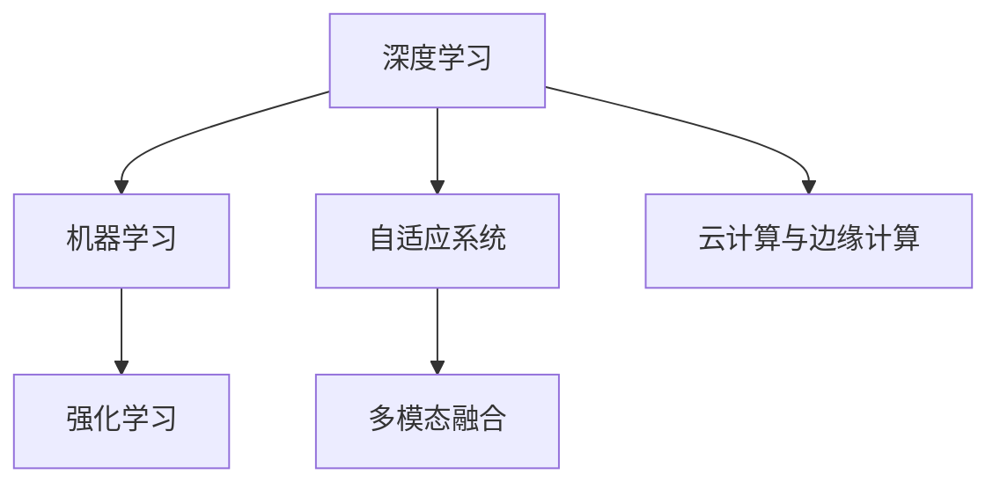

                 

# 软件 2.0 的未来展望：更智能、更强大

> 关键词：软件2.0, 人工智能, 深度学习, 机器学习, 强化学习, 智能系统, 工业4.0, 大数据, 物联网, 边缘计算, 云计算

## 1. 背景介绍

### 1.1 问题由来

当前，全球正处于第四次工业革命的浪潮中，以智能系统为核心的人工智能(AI)技术，正在全面赋能各行各业，推动产业的数字化转型和升级。其中，软件2.0（Software 2.0）作为AI技术的高级形态，借助深度学习、机器学习、强化学习等前沿技术，在图像识别、自然语言处理、智能推荐、自动驾驶等领域取得了突破性的进展。然而，随着AI技术的不断演进，现有的软件架构和开发范式已无法满足日益增长的应用需求，迫切需要新一代的智能系统。

### 1.2 问题核心关键点

软件2.0的核心关键点包括：
- 高度自动化的开发流程：利用AI技术，大幅提升软件开发的效率和质量，缩短从需求到上线的时间。
- 自适应学习与优化：软件2.0能够根据用户行为、环境变化等实时数据，动态调整模型参数，持续提升系统性能。
- 多模态数据融合：通过图像、语音、文本等多种数据源的整合，构建更加全面、准确的信息模型。
- 边缘计算与云计算结合：利用分布式计算资源，实现高效的数据处理与分析。

## 2. 核心概念与联系

### 2.1 核心概念概述

软件2.0是AI技术在软件开发中的应用，其核心概念包括：

- **深度学习（Deep Learning）**：通过神经网络模型，从大量数据中学习复杂非线性关系，实现模式识别、语音识别等任务。
- **机器学习（Machine Learning）**：利用算法和统计模型，对数据进行学习和预测，优化系统决策。
- **强化学习（Reinforcement Learning）**：通过奖励和惩罚机制，训练模型在不断尝试中优化策略，实现智能控制和决策。
- **自适应系统（Adaptive System）**：根据实时数据动态调整系统行为，提升系统的鲁棒性和适应性。
- **多模态融合（Multi-modal Fusion）**：整合图像、语音、文本等多种数据源，提升系统对现实世界的理解能力。
- **云计算与边缘计算（Cloud and Edge Computing）**：利用云计算和分布式计算资源，实现高效的数据处理和分析。

这些概念之间的逻辑关系可以通过以下Mermaid流程图来展示：



这个流程图展示了大语言模型的核心概念及其之间的关系：

1. 深度学习模型作为基础，通过神经网络学习复杂数据特征。
2. 机器学习算法在此基础上进行模式识别和预测，优化系统决策。
3. 强化学习通过奖惩机制，训练模型不断优化策略，提升系统性能。
4. 自适应系统能够根据实时数据动态调整模型参数，提高系统鲁棒性和适应性。
5. 多模态融合技术整合多种数据源，增强系统对现实世界的理解能力。
6. 云计算与边缘计算利用分布式计算资源，实现高效的数据处理和分析。

## 3. 核心算法原理 & 具体操作步骤

### 3.1 算法原理概述

软件2.0的核心算法原理基于深度学习、机器学习、强化学习等技术，通过构建复杂模型和优化算法，实现高度智能化的决策和控制。其基本框架包括：

- **数据预处理**：收集、清洗和标注数据，构建训练集和验证集。
- **模型构建**：选择合适的深度学习模型，如卷积神经网络（CNN）、循环神经网络（RNN）、长短期记忆网络（LSTM）等，构建基础模型。
- **特征提取**：通过模型提取数据的特征表示，用于后续的分类、预测等任务。
- **训练与优化**：在训练集上训练模型，使用优化算法（如Adam、SGD等）优化模型参数，最小化损失函数。
- **验证与调整**：在验证集上评估模型性能，根据评估结果调整模型超参数和结构，提升模型效果。
- **部署与应用**：将训练好的模型部署到生产环境，进行实时推理和预测。

### 3.2 算法步骤详解

软件2.0的算法步骤详解如下：

**Step 1: 数据预处理**
- 收集数据：从不同的数据源（如传感器、数据库、网络）收集数据。
- 数据清洗：对数据进行去重、去噪、缺失值填补等预处理操作。
- 数据标注：对数据进行标注，构建训练集和验证集。

**Step 2: 模型构建**
- 选择模型：根据任务类型，选择适合的深度学习模型（如CNN、RNN、LSTM等）。
- 构建模型：定义模型的输入、输出、隐藏层、激活函数等。
- 模型编译：选择合适的损失函数、优化器、评估指标等，编译模型。

**Step 3: 特征提取**
- 数据编码：将数据转换为模型所需的数值形式，如将图像数据编码成像素值。
- 特征提取：通过模型提取数据的特征表示。
- 特征转换：对特征进行归一化、降维等操作，提高模型的泛化能力。

**Step 4: 训练与优化**
- 模型训练：在训练集上训练模型，使用优化算法优化模型参数。
- 超参数调整：根据验证集上的评估结果，调整模型的超参数，如学习率、批大小等。
- 模型保存：保存训练好的模型参数和模型结构。

**Step 5: 验证与调整**
- 模型评估：在验证集上评估模型性能，计算精度、召回率、F1值等指标。
- 模型调优：根据评估结果，调整模型结构、优化算法等。
- 模型测试：在测试集上测试模型，验证模型效果。

**Step 6: 部署与应用**
- 模型部署：将训练好的模型部署到生产环境，如服务器、边缘设备等。
- 实时推理：在实时数据上推理和预测，输出模型结果。
- 模型更新：根据新的数据和反馈，定期更新模型，提升模型性能。

### 3.3 算法优缺点

软件2.0的算法具有以下优点：
- **高度自动化**：利用AI技术，大幅提升软件开发的效率和质量。
- **自适应性强**：能够根据实时数据动态调整模型参数，提升系统性能。
- **泛化能力强**：通过大量数据训练，模型具备较强的泛化能力。
- **鲁棒性高**：能够处理复杂数据和噪声，提高系统的鲁棒性。

同时，该算法也存在一些局限性：
- **计算资源需求高**：需要大量的计算资源进行模型训练和推理。
- **数据标注成本高**：需要大量标注数据进行模型训练，标注成本较高。
- **模型复杂度高**：模型结构复杂，调试和优化难度较大。
- **解释性差**：深度学习模型通常难以解释其内部工作机制。

尽管存在这些局限性，但软件2.0算法以其高度自动化和自适应性，在图像识别、自然语言处理、智能推荐、自动驾驶等领域得到了广泛应用，取得了显著的成果。未来，随着计算资源和标注数据的不断提升，这些局限性将逐步得到缓解。

### 3.4 算法应用领域

软件2.0的算法在以下领域得到了广泛应用：

- **智能推荐系统**：通过深度学习模型，对用户行为和商品特征进行分析，推荐个性化商品。
- **自然语言处理**：利用深度学习模型，实现文本分类、情感分析、机器翻译等任务。
- **自动驾驶**：通过图像识别和强化学习，实现车辆自主导航和避障。
- **医疗诊断**：利用深度学习模型，对医疗影像进行分类和分析，辅助医生诊断。
- **金融风控**：通过深度学习模型，对金融数据进行分析和预测，评估风险。
- **智能客服**：利用自然语言处理技术，实现智能对话和问题解答。

除了这些经典应用外，软件2.0技术还在更多领域得到了创新性的应用，如智能制造、智慧城市、智能家居等，为各行各业带来了深刻变革。

## 4. 数学模型和公式 & 详细讲解 & 举例说明

### 4.1 数学模型构建

软件2.0的核心数学模型基于深度学习框架，常用的深度学习模型包括卷积神经网络（CNN）、循环神经网络（RNN）、长短期记忆网络（LSTM）等。这里以CNN模型为例，进行详细讲解。

### 4.2 公式推导过程

CNN模型的数学推导过程如下：

**Step 1: 输入数据表示**
- 设输入数据为 $X$，每个样本为 $x_i$，共 $n$ 个样本。$x_i$ 的形状为 $(d_1, d_2, ..., d_k)$，其中 $d_1$ 为样本数，$d_2, ..., d_k$ 为特征维度。
- 表示为：$X \in \mathbb{R}^{n \times d_1 \times d_2 \times ... \times d_k}$。

**Step 2: 卷积层**
- 定义卷积核 $W$，形状为 $(f_1, f_2, ..., f_k)$，其中 $f_1$ 为卷积核数，$f_2, ..., f_k$ 为卷积核特征维度。
- 设卷积核数量为 $C$，则 $W$ 的形状为 $(f_1, f_2, ..., f_k)$。
- 表示为：$W \in \mathbb{R}^{C \times f_1 \times f_2 \times ... \times f_k}$。
- 定义步长 $s$，表示卷积核在每个特征维度上的步长。

**Step 3: 池化层**
- 定义池化窗口 $p$，表示池化窗口的大小。
- 表示为：$p \in \mathbb{R}^{1 \times 1 \times ... \times 1}$。

**Step 4: 全连接层**
- 定义全连接层 $M$，形状为 $(d_1, d_2, ..., d_k)$。
- 表示为：$M \in \mathbb{R}^{d_1 \times d_2 \times ... \times d_k}$。

**Step 5: 输出层**
- 定义输出层 $Y$，形状为 $(d_1, d_2, ..., d_k)$。
- 表示为：$Y \in \mathbb{R}^{d_1 \times d_2 \times ... \times d_k}$。

**Step 6: 损失函数**
- 设损失函数为 $L$，表示为：$L = \frac{1}{n} \sum_{i=1}^n \ell(X_i, Y_i)$，其中 $\ell$ 为具体的损失函数。

**Step 7: 反向传播算法**
- 通过反向传播算法，计算损失函数对每个参数的梯度，更新参数值。

### 4.3 案例分析与讲解

这里以手写数字识别为例，进行详细分析。

**Step 1: 数据预处理**
- 收集手写数字图片数据集。
- 对图片进行预处理，如灰度化、归一化等。

**Step 2: 模型构建**
- 选择CNN模型作为基础模型。
- 定义卷积核、池化窗口、全连接层等。

**Step 3: 特征提取**
- 通过卷积层提取图片特征。
- 通过池化层减小特征维度和噪声。

**Step 4: 训练与优化**
- 在训练集上训练模型。
- 使用反向传播算法优化模型参数。

**Step 5: 验证与调整**
- 在验证集上评估模型性能。
- 根据评估结果调整模型参数。

**Step 6: 部署与应用**
- 将训练好的模型部署到生产环境。
- 在实时图片数据上推理和预测。

## 5. 项目实践：代码实例和详细解释说明

### 5.1 开发环境搭建

在进行软件2.0开发前，我们需要准备好开发环境。以下是使用Python进行TensorFlow开发的环境配置流程：

1. 安装Anaconda：从官网下载并安装Anaconda，用于创建独立的Python环境。

2. 创建并激活虚拟环境：
```bash
conda create -n tf-env python=3.8 
conda activate tf-env
```

3. 安装TensorFlow：根据CUDA版本，从官网获取对应的安装命令。例如：
```bash
conda install tensorflow -c conda-forge -c pypi
```

4. 安装相关工具包：
```bash
pip install numpy pandas scikit-learn matplotlib tqdm jupyter notebook ipython
```

完成上述步骤后，即可在`tf-env`环境中开始开发实践。

### 5.2 源代码详细实现

这里我们以手写数字识别为例，给出使用TensorFlow实现CNN模型的代码实现。

```python
import tensorflow as tf
from tensorflow.keras import layers

# 定义模型
model = tf.keras.Sequential([
    layers.Conv2D(32, (3, 3), activation='relu', input_shape=(28, 28, 1)),
    layers.MaxPooling2D((2, 2)),
    layers.Flatten(),
    layers.Dense(128, activation='relu'),
    layers.Dense(10, activation='softmax')
])

# 编译模型
model.compile(optimizer='adam',
              loss='sparse_categorical_crossentropy',
              metrics=['accuracy'])

# 加载数据集
mnist = tf.keras.datasets.mnist
(train_images, train_labels), (test_images, test_labels) = mnist.load_data()
train_images = train_images.reshape(-1, 28, 28, 1) / 255.0
test_images = test_images.reshape(-1, 28, 28, 1) / 255.0

# 训练模型
model.fit(train_images, train_labels, epochs=5, batch_size=64, validation_data=(test_images, test_labels))

# 评估模型
test_loss, test_acc = model.evaluate(test_images, test_labels)
print('Test accuracy:', test_acc)
```

以上就是使用TensorFlow实现CNN模型进行手写数字识别的完整代码实现。可以看到，利用TensorFlow的Keras API，我们可以用相对简洁的代码完成模型的构建和训练。

### 5.3 代码解读与分析

让我们再详细解读一下关键代码的实现细节：

**Sequential模型定义**
- 使用`tf.keras.Sequential`定义模型结构，通过`add`方法逐层添加卷积层、池化层、全连接层等。

**模型编译**
- 使用`compile`方法设置模型的优化器、损失函数、评估指标等，准备进行训练。

**数据加载与预处理**
- 使用`mnist.load_data`加载手写数字数据集，将数据集转换为模型所需的输入形状。
- 将像素值归一化到0-1之间，提高模型训练效果。

**模型训练**
- 使用`fit`方法训练模型，设置训练轮数和批次大小。
- 在验证集上评估模型性能，记录训练过程中的精度和损失。

**模型评估**
- 使用`evaluate`方法在测试集上评估模型性能，输出测试集上的准确率。

可以看到，TensorFlow的Keras API使得深度学习模型的构建和训练变得简单高效。开发者可以更多地关注模型的优化和调试，而不必过多关注底层的实现细节。

## 6. 实际应用场景

### 6.1 智能推荐系统

软件2.0的推荐系统能够根据用户的历史行为数据，预测其可能感兴趣的商品或服务，大幅提升用户体验和转化率。推荐系统通常采用协同过滤、基于内容的推荐、深度学习等技术，利用用户画像和商品特征构建推荐模型。

在技术实现上，可以使用软件2.0技术进行深度学习模型的训练和优化，构建更加个性化、精准的推荐算法。推荐系统可以实时采集用户行为数据，动态调整模型参数，提升推荐效果。

### 6.2 自然语言处理

自然语言处理（NLP）是软件2.0技术的重要应用领域之一，涵盖了文本分类、情感分析、机器翻译、对话系统等多个方向。利用深度学习模型，NLP技术可以自动分析和理解文本信息，辅助人机交互。

在技术实现上，可以使用软件2.0技术进行深度学习模型的训练和优化，构建更加智能、高效的NLP应用。例如，通过微调BERT等预训练模型，可以实现问答系统、智能客服等功能，提升用户体验和互动效果。

### 6.3 自动驾驶

自动驾驶是软件2.0技术的典型应用，通过深度学习模型和强化学习技术，实现车辆的自主导航和避障。自动驾驶系统需要实时处理大量传感器数据，如摄像头、雷达、激光雷达等，构建高精度的环境模型。

在技术实现上，可以使用软件2.0技术进行深度学习模型的训练和优化，构建更加智能、鲁棒的自动驾驶系统。自动驾驶系统可以根据实时环境数据，动态调整模型参数，提高导航精度和安全性。

### 6.4 未来应用展望

随着软件2.0技术的不断演进，其在以下领域将有更广阔的应用前景：

- **智能制造**：通过软件2.0技术，实现生产过程的自动化和智能化，提高生产效率和产品质量。
- **智慧城市**：利用软件2.0技术，实现城市管理的智能化，提升城市运行效率和居民生活质量。
- **智能家居**：通过软件2.0技术，实现家居设备的智能化控制，提高生活便捷性和舒适度。
- **医疗健康**：利用软件2.0技术，实现医疗影像分析和诊断，辅助医生诊疗。
- **金融服务**：通过软件2.0技术，实现风险评估和投资决策，提升金融服务水平。
- **智能交通**：利用软件2.0技术，实现交通系统的智能化管理，提高交通效率和安全性。

未来，软件2.0技术将在更多领域得到广泛应用，为各行各业带来深刻变革。随着计算资源和数据量的不断提升，软件2.0技术将不断拓展其应用边界，推动AI技术向更高的层次发展。

## 7. 工具和资源推荐

### 7.1 学习资源推荐

为了帮助开发者系统掌握软件2.0技术，这里推荐一些优质的学习资源：

1. 《深度学习》系列书籍：如《深度学习》（Ian Goodfellow）、《Deep Learning with Python》（Francois Chollet）等，深入浅出地介绍了深度学习的基本原理和实现方法。

2. TensorFlow官方文档：提供了详细的TensorFlow API文档和示例代码，方便开发者上手实践。

3. PyTorch官方文档：提供了丰富的深度学习模型和算法实现，支持多种编程语言和平台。

4. Keras官方文档：提供了简单易用的深度学习API，适合快速原型设计和实验。

5. Coursera《深度学习专项课程》：由吴恩达教授主讲的深度学习课程，系统讲解深度学习的基本概念和前沿技术。

6. Udacity《深度学习纳米学位》：提供了系统的深度学习课程和实践项目，培养深度学习工程师的技能。

7. 《Python深度学习》（Francisco Charras）：介绍了深度学习的基本算法和应用案例，适合Python初学者入门。

通过对这些资源的学习实践，相信你一定能够快速掌握软件2.0技术，并用于解决实际的AI问题。

### 7.2 开发工具推荐

高效的开发离不开优秀的工具支持。以下是几款用于软件2.0开发的工具：

1. PyTorch：基于Python的开源深度学习框架，灵活动态的计算图，适合快速迭代研究。

2. TensorFlow：由Google主导开发的开源深度学习框架，生产部署方便，适合大规模工程应用。

3. Keras：提供了简单易用的深度学习API，适合快速原型设计和实验。

4. Weights & Biases：模型训练的实验跟踪工具，可以记录和可视化模型训练过程中的各项指标，方便对比和调优。

5. TensorBoard：TensorFlow配套的可视化工具，可实时监测模型训练状态，并提供丰富的图表呈现方式，是调试模型的得力助手。

6. Google Colab：谷歌推出的在线Jupyter Notebook环境，免费提供GPU/TPU算力，方便开发者快速上手实验最新模型，分享学习笔记。

合理利用这些工具，可以显著提升软件2.0开发效率，加快创新迭代的步伐。

### 7.3 相关论文推荐

软件2.0技术的演进离不开学界的持续研究。以下是几篇奠基性的相关论文，推荐阅读：

1. AlexNet: ImageNet Classification with Deep Convolutional Neural Networks：提出卷积神经网络（CNN），开创了深度学习时代。

2. RNN: Recurrent Neural Network Architecture：提出循环神经网络（RNN），能够处理时间序列数据。

3. Long Short-Term Memory：提出长短期记忆网络（LSTM），解决传统RNN的梯度消失问题。

4. Attention is All You Need：提出Transformer模型，利用自注意力机制，提升模型的表达能力和泛化能力。

5. DeepMind AlphaGo Zero：利用强化学习技术，实现围棋AI的突破，展示深度学习的强大能力。

这些论文代表了大语言模型微调技术的发展脉络。通过学习这些前沿成果，可以帮助研究者把握学科前进方向，激发更多的创新灵感。

## 8. 总结：未来发展趋势与挑战

### 8.1 研究成果总结

软件2.0技术经过多年的发展，已经在多个领域取得了显著成果。通过深度学习、机器学习、强化学习等技术，构建了高度智能化的系统，提升了各行各业的生产效率和用户体验。

### 8.2 未来发展趋势

展望未来，软件2.0技术将呈现以下几个发展趋势：

1. **模型规模持续增大**：随着算力成本的下降和数据量的不断增长，深度学习模型的参数规模将不断增大，能够学习到更加复杂的模式和特征。

2. **自适应能力增强**：未来的软件2.0系统将具备更强的自适应能力，能够根据实时数据动态调整模型参数，提升系统的鲁棒性和适应性。

3. **多模态数据融合**：未来的软件2.0系统将整合多种数据源，构建更加全面、准确的信息模型，提升系统的理解和决策能力。

4. **边缘计算与云计算结合**：未来的软件2.0系统将结合边缘计算和云计算，实现高效的数据处理和分析，提升系统的实时性和可靠性。

5. **智能推荐系统普及**：未来的智能推荐系统将更加个性化、精准，能够根据用户行为和环境变化，实时调整推荐策略，提升用户体验和转化率。

6. **自然语言处理深化**：未来的自然语言处理技术将更加智能、高效，能够实现更加复杂、自然的人机交互，提升用户体验和互动效果。

7. **自动驾驶技术成熟**：未来的自动驾驶系统将具备更高的智能化水平，能够实现更加精准的导航和避障，提高安全性与舒适度。

8. **智慧城市建设加速**：未来的智慧城市将通过软件2.0技术，实现高度智能化、自动化的城市管理，提升城市运行效率和居民生活质量。

9. **智能家居普及**：未来的智能家居系统将具备更高的智能化水平，能够实现更加便捷、舒适的生活体验，提升居民生活质量。

10. **医疗健康水平提升**：未来的医疗健康系统将通过软件2.0技术，实现高精度的医学影像分析和诊断，提升医疗水平和服务质量。

### 8.3 面临的挑战

尽管软件2.0技术已经取得了瞩目成就，但在迈向更加智能化、普适化应用的过程中，仍然面临诸多挑战：

1. **计算资源瓶颈**：深度学习模型需要大量的计算资源进行训练和推理，高性能计算设备成本较高，普及度有限。

2. **数据标注成本高**：深度学习模型需要大量标注数据进行训练，标注成本较高，难以应对长尾应用场景。

3. **模型复杂度高**：深度学习模型结构复杂，调试和优化难度较大，模型效果难以保证。

4. **数据隐私和安全**：深度学习模型需要大量的个人数据进行训练，数据隐私和安全问题突出，亟需解决。

5. **模型可解释性差**：深度学习模型通常难以解释其内部工作机制和决策过程，缺乏可解释性，难以满足高风险应用的需求。

6. **模型鲁棒性不足**：深度学习模型在面对数据分布变化时，泛化性能较差，容易出现过拟合或欠拟合的问题。

7. **模型部署和维护难度高**：深度学习模型通常需要高性能计算资源进行部署和维护，部署成本较高。

### 8.4 研究展望

为了应对软件2.0技术面临的挑战，未来的研究需要在以下几个方面进行探索：

1. **优化计算资源**：开发更高效的深度学习模型和算法，减少计算资源需求，降低成本。

2. **减少数据标注成本**：利用无监督学习和半监督学习等技术，减少对大规模标注数据的依赖，降低标注成本。

3. **提升模型可解释性**：通过模型解释和可视化技术，提高模型的可解释性和可解释性，满足高风险应用的需求。

4. **增强模型鲁棒性**：通过模型鲁棒性和泛化能力的研究，提高模型的稳定性和适应性。

5. **优化模型部署和维护**：开发更高效的模型压缩和优化技术，减少部署和维护成本。

6. **保护数据隐私和安全**：研究数据隐私保护技术，确保数据的安全和合规性。

这些研究方向将推动软件2.0技术的不断演进，提升其在各领域的应用效果，推动AI技术向更高层次发展。

## 9. 附录：常见问题与解答

**Q1: 软件2.0技术相比传统软件开发有何优势？**

A: 软件2.0技术相比传统软件开发具有以下优势：
1. **自动化程度高**：通过深度学习、机器学习等技术，自动化程度高，开发效率和质量大幅提升。
2. **泛化能力强**：模型经过大规模数据训练，具备较强的泛化能力，适用于多种场景和任务。
3. **自适应性强**：能够根据实时数据动态调整模型参数，提升系统性能和鲁棒性。
4. **多模态数据融合**：能够整合多种数据源，构建更加全面、准确的信息模型。

**Q2: 软件2.0技术在实际应用中需要注意哪些问题？**

A: 软件2.0技术在实际应用中需要注意以下问题：
1. **数据质量**：数据质量和标注质量直接影响模型效果，需要保证数据的高质量和多样性。
2. **计算资源**：深度学习模型需要大量的计算资源进行训练和推理，计算资源成本较高。
3. **模型部署**：模型需要高效的部署方案，减少计算资源和内存占用，提高实时性。
4. **模型可解释性**：深度学习模型难以解释其内部工作机制，需要提供可解释性模型，满足高风险应用的需求。
5. **数据隐私和安全**：深度学习模型需要大量的个人数据进行训练，数据隐私和安全问题突出，需要确保数据合规和安全。

**Q3: 软件2.0技术在未来有哪些发展方向？**

A: 软件2.0技术在未来有以下发展方向：
1. **模型规模增大**：随着算力成本的下降和数据量的增长，深度学习模型的参数规模将不断增大，能够学习到更加复杂的模式和特征。
2. **自适应能力增强**：未来的软件2.0系统将具备更强的自适应能力，能够根据实时数据动态调整模型参数，提升系统的鲁棒性和适应性。
3. **多模态数据融合**：未来的软件2.0系统将整合多种数据源，构建更加全面、准确的信息模型，提升系统的理解和决策能力。
4. **边缘计算与云计算结合**：未来的软件2.0系统将结合边缘计算和云计算，实现高效的数据处理和分析，提升系统的实时性和可靠性。
5. **智能推荐系统普及**：未来的智能推荐系统将更加个性化、精准，能够根据用户行为和环境变化，实时调整推荐策略，提升用户体验和转化率。
6. **自然语言处理深化**：未来的自然语言处理技术将更加智能、高效，能够实现更加复杂、自然的人机交互，提升用户体验和互动效果。
7. **自动驾驶技术成熟**：未来的自动驾驶系统将具备更高的智能化水平，能够实现更加精准的导航和避障，提高安全性与舒适度。
8. **智慧城市建设加速**：未来的智慧城市将通过软件2.0技术，实现高度智能化、自动化的城市管理，提升城市运行效率和居民生活质量。
9. **智能家居普及**：未来的智能家居系统将具备更高的智能化水平，能够实现更加便捷、舒适的生活体验，提升居民生活质量。
10. **医疗健康水平提升**：未来的医疗健康系统将通过软件2.0技术，实现高精度的医学影像分析和诊断，提升医疗水平和服务质量。

**Q4: 如何提高软件2.0系统的性能？**

A: 提高软件2.0系统的性能可以从以下几个方面进行优化：
1. **模型结构优化**：选择合适的深度学习模型结构，提高模型的表达能力和泛化能力。
2. **数据预处理**：进行数据清洗、归一化等预处理操作，提高模型训练效果。
3. **超参数调整**：调整模型的超参数，如学习率、批大小、迭代轮数等，优化模型效果。
4. **正则化技术**：使用L2正则、Dropout等正则化技术，防止模型过拟合。
5. **数据增强**：通过数据增强技术，扩充训练集，提高模型泛化能力。
6. **模型压缩和优化**：通过模型压缩和优化技术，减少模型参数量和计算资源需求，提高推理速度和实时性。

**Q5: 软件2.0技术在实际应用中存在哪些挑战？**

A: 软件2.0技术在实际应用中存在以下挑战：
1. **计算资源瓶颈**：深度学习模型需要大量的计算资源进行训练和推理，高性能计算设备成本较高，普及度有限。
2. **数据标注成本高**：深度学习模型需要大量标注数据进行训练，标注成本较高，难以应对长尾应用场景。
3. **模型复杂度高**：深度学习模型结构复杂，调试和优化难度较大，模型效果难以保证。
4. **数据隐私和安全**：深度学习模型需要大量的个人数据进行训练，数据隐私和安全问题突出，亟需解决。
5. **模型可解释性差**：深度学习模型难以解释其内部工作机制和决策过程，缺乏可解释性，难以满足高风险应用的需求。
6. **模型鲁棒性不足**：深度学习模型在面对数据分布变化时，泛化性能较差，容易出现过拟合或欠拟合的问题。
7. **模型部署和维护难度高**：深度学习模型通常需要高性能计算资源进行部署和维护，部署成本较高。

## 附录：常见问题与解答


