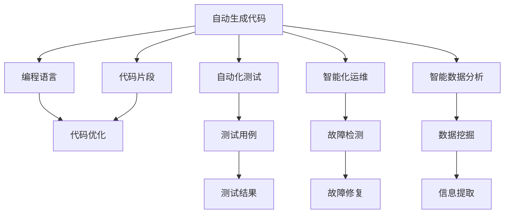

                 

# 软件 2.0 的未来展望：更智能、更强大

软件 2.0（Software 2.0）时代，AI驱动的编程范式革命性地改变了软件开发的思路与方法，让软件系统变得更加智能、强大。这篇文章将深入探讨软件 2.0 的未来展望，分析其核心概念、核心算法原理，并讨论其在多个领域的应用实践。

## 1. 背景介绍

### 1.1 问题由来
在过去几十年中，软件工程的重点是构建可维护的、可扩展的、高可靠性的代码。然而，随着数据量的爆炸性增长和算力的迅猛提升，传统软件工程模式已经难以应对现代软件开发的要求。软件开发中数据密集、计算密集的任务变得越发频繁，这促使软件开发者不得不重新审视并革新软件开发范式。

AI技术，尤其是深度学习、自然语言处理和计算机视觉等领域的突破，为软件 2.0 时代的到来提供了技术基础。通过自动生成代码、自动化测试、智能化运维等技术，AI驱动的软件开发正在改变软件开发的面貌。

### 1.2 问题核心关键点
软件 2.0 的核心在于通过自动化、智能化的手段，让软件开发变得更加高效、可靠和灵活。主要体现在以下几个方面：
- 自动化生成代码：利用AI算法自动生成、优化和重构代码，减少人工干预。
- 自动化测试：利用AI技术自动化生成测试用例，动态调整测试策略，提高代码质量。
- 智能化运维：通过AI手段实现自动化故障检测、诊断与修复，提高系统可靠性。
- 智能数据分析：利用AI模型对大数据进行深入分析和理解，提取有用的信息，辅助决策。

### 1.3 问题研究意义
软件 2.0 时代，开发者可以更加专注于业务逻辑和用户体验，通过AI辅助进行系统构建，可以大幅提升软件开发的效率和质量，降低成本。此外，AI驱动的软件系统能够自我优化，适应外部环境的快速变化，从而具备更强的适应性和可扩展性。

## 2. 核心概念与联系

### 2.1 核心概念概述

软件 2.0 的主要组成包括：

- 自动生成代码（Automatic Code Generation, ACG）：通过AI模型自动生成和优化代码，实现编程自动化。
- 自动化测试（Automated Testing, AT）：利用AI算法生成测试用例，提高代码质量。
- 智能化运维（Intelligent Operations, IO）：通过AI手段进行自动化故障检测与诊断，提升系统可靠性。
- 智能数据分析（Smart Data Analysis, SDA）：利用AI模型进行数据挖掘与分析，提取有用的信息。

这些技术通过深度学习、强化学习、自然语言处理等AI算法相互关联，共同构成了软件 2.0 的核心架构。

### 2.2 核心概念原理和架构的 Mermaid 流程图(Mermaid 流程节点中不要有括号、逗号等特殊字符)


这个图展示了软件 2.0 核心技术的相互联系。自动生成代码结合测试用例和故障检测，形成一个闭环，不断优化和改进；智能数据分析则从数据中提取有用信息，辅助业务决策。

## 3. 核心算法原理 & 具体操作步骤
### 3.1 算法原理概述

软件 2.0 的核心算法包括：

- 深度学习（Deep Learning）：用于构建模型，自动化生成代码和测试用例，提升系统性能。
- 强化学习（Reinforcement Learning）：用于优化自动化测试和运维策略，动态调整测试策略。
- 自然语言处理（Natural Language Processing, NLP）：用于理解用户意图和生成自然语言响应，提升人机交互体验。
- 计算机视觉（Computer Vision）：用于图像识别和处理，增强数据分析和展示。

这些算法共同构成了一个高效、灵活的软件 2.0 生态系统，实现了从代码生成到系统运维的全生命周期智能化。

### 3.2 算法步骤详解

以自动生成代码为例，其基本步骤包括：

1. **数据预处理**：收集代码片段，清洗并标准化数据。
2. **模型训练**：选择合适的深度学习模型（如Transformer、LSTM等）进行训练。
3. **代码生成**：利用训练好的模型，根据输入的编程需求生成代码片段。
4. **代码优化**：对生成的代码进行优化，包括结构、风格和性能的提升。
5. **集成测试**：将生成的代码集成到项目中，进行单元测试和集成测试，确保其正确性和可靠性。

### 3.3 算法优缺点

软件 2.0 的主要优点包括：

- 提高开发效率：自动化生成和优化代码大大减少了人工编写和调试的时间。
- 提升代码质量：自动化测试确保了代码的可靠性，动态调整测试策略进一步提升了代码质量。
- 降低运维成本：智能化运维减少了人工干预，自动修复故障提高了系统可靠性。
- 增强数据分析能力：智能数据分析可以从海量数据中提取有用的信息，辅助决策。

同时，也存在一些挑战：

- 对数据依赖性强：自动化生成和优化代码需要大量代码片段作为训练数据。
- 模型泛化能力有限：当前AI模型对特定领域的泛化能力还存在不足。
- 数据隐私和安全问题：自动化生成和分析代码需要处理大量数据，数据隐私和安全问题不可忽视。
- 可解释性不足：黑箱模型往往难以解释其内部工作机制。

### 3.4 算法应用领域

软件 2.0 技术已经广泛应用于多个领域：

- **软件开发**：如自动化生成代码、优化代码结构、自动化测试等。
- **运维管理**：如自动故障检测、诊断和修复，提高系统可用性。
- **数据分析**：如自动化数据清洗、特征提取和模型训练，提升数据处理效率。
- **智能交互**：如自然语言处理和计算机视觉，实现人机自然交互。

## 4. 数学模型和公式 & 详细讲解 & 举例说明

### 4.1 数学模型构建

自动生成代码的基本数学模型为：

- 输入：编程需求和已有的代码片段。
- 输出：自动生成的代码片段。
- 目标：最小化生成代码与期望代码的差异，通常使用均方误差或交叉熵等损失函数。

### 4.2 公式推导过程

以自动生成代码为例，假设模型参数为 $\theta$，损失函数为 $L$，则优化目标为：

$$ \theta^* = \arg\min_{\theta} L(\theta) $$

常用的优化算法包括梯度下降（Gradient Descent）和Adam优化算法。以Adam算法为例，其更新公式为：

$$ \theta_{t+1} = \theta_t - \alpha \frac{m}{\sqrt{v} + \epsilon} $$

其中 $\alpha$ 为学习率，$m$ 和 $v$ 分别为梯度和平方梯度的一阶矩和二阶矩估计，$\epsilon$ 为避免除以零的小值。

### 4.3 案例分析与讲解

假设输入需求为生成一个简单的Python函数，输出为生成后的代码片段。例如，输入需求为：

```python
def add_numbers(x, y):
    return x + y
```

模型生成代码的输出可能为：

```python
def add_numbers(x, y):
    return x+y
```

这里的模型学习到了在函数名后加上冒号、参数名称、返回值语句等。通过调整模型参数和优化策略，可以进一步提升代码生成的质量。

## 5. 项目实践：代码实例和详细解释说明

### 5.1 开发环境搭建

要搭建软件 2.0 的开发环境，首先需要准备Python环境和相应的AI框架库，如TensorFlow、PyTorch等。以下是一个基本的Python开发环境搭建步骤：

1. 安装Python：从官网下载并安装最新版本的Python。
2. 安装虚拟环境：使用venv或virtualenv创建虚拟环境，隔离依赖。
3. 安装AI框架：使用pip安装TensorFlow、PyTorch等AI框架。
4. 准备数据集：收集和预处理代码片段和编程需求。

### 5.2 源代码详细实现

以下是一个简单的代码生成示例，使用Transformer模型：

```python
import torch
from transformers import GPT2Tokenizer, GPT2LMHeadModel

# 初始化模型和分词器
tokenizer = GPT2Tokenizer.from_pretrained('gpt2')
model = GPT2LMHeadModel.from_pretrained('gpt2')

# 设置输入需求
input_prompt = 'def add_numbers(x, y):'
max_length = 128

# 对输入进行分词
inputs = tokenizer.encode(input_prompt, max_length=max_length)

# 生成代码片段
outputs = model.generate(inputs, max_length=128, num_return_sequences=1)

# 将输出转换为字符串
generated_code = tokenizer.decode(outputs[0], skip_special_tokens=True)
print(generated_code)
```

### 5.3 代码解读与分析

上述代码中，使用GPT-2模型和分词器，将输入需求编码为序列，通过模型生成代码片段，最终将生成的代码转换为可读文本。GPT-2模型通过大规模训练数据学习到了丰富的语言表示，能够生成连贯、流畅的代码片段。

### 5.4 运行结果展示

运行上述代码，输出的代码片段可能类似于：

```python
def add_numbers(x, y):
    return x+y
```

可以看出，生成的代码片段已经具备了基本的功能和结构。

## 6. 实际应用场景

### 6.1 软件开发

在软件开发中，软件 2.0 技术可以用于自动化生成代码、优化代码结构、自动生成API文档等。例如，针对某个特定的业务逻辑，自动生成对应的Python代码，可以减少开发者的手工编写工作量。

### 6.2 运维管理

在运维管理中，软件 2.0 技术可以用于自动化故障检测和修复、性能监控和分析等。例如，通过监控系统的日志和性能指标，自动识别和诊断故障，快速定位问题，并自动化生成修复方案。

### 6.3 数据分析

在数据分析中，软件 2.0 技术可以用于自动化数据清洗、特征提取和模型训练等。例如，对于大规模数据集，自动生成数据预处理和特征工程脚本，提升数据处理效率和精度。

### 6.4 未来应用展望

随着软件 2.0 技术的不断演进，未来将有更多应用场景：

- **智能协作**：基于自然语言处理和计算机视觉技术，实现智能聊天机器人、虚拟助手等，提升用户体验。
- **AI生成设计**：利用生成对抗网络（GAN）和变分自编码器（VAE）生成高质量的图像、视频和3D模型。
- **动态系统仿真**：使用强化学习技术，动态优化系统的仿真参数，提升仿真精度和效率。

## 7. 工具和资源推荐

### 7.1 学习资源推荐

为了帮助开发者系统掌握软件 2.0 技术的理论基础和实践技巧，推荐以下学习资源：

1. **《软件 2.0：AI驱动的软件开发革命》**：深入介绍软件 2.0 技术的原理和实践，涵盖自动生成代码、自动化测试、智能化运维等内容。
2. **《深度学习与人工智能编程实战》**：详细介绍深度学习算法在软件 2.0 中的应用，涵盖模型训练、优化、部署等技术细节。
3. **CS231n：计算机视觉课程**：斯坦福大学的经典课程，涵盖计算机视觉技术的理论和实践。
4. **Coursera AI for Everyone**：Coursera平台的入门级AI课程，适合初学者了解AI的基本概念和技术。

### 7.2 开发工具推荐

为了高效开发和部署软件 2.0 系统，推荐以下开发工具：

1. **Jupyter Notebook**：轻量级Python开发环境，支持代码编写和互动式调试。
2. **TensorFlow**：强大的深度学习框架，提供灵活的模型构建和训练工具。
3. **PyTorch**：灵活的深度学习框架，支持动态计算图和GPU加速。
4. **Keras**：高层次的深度学习框架，易于上手和使用。
5. **OpenAI Codex**：支持自然语言编程的AI代码生成工具，可以生成高质量的代码片段。

### 7.3 相关论文推荐

软件 2.0 技术的发展离不开学界的持续研究。推荐以下几篇相关论文：

1. **"DeepSpeed: Accelerating Deep Neural Network Training on Multiple GPUs"**：介绍DeepSpeed框架，实现大规模深度学习模型的高效训练。
2. **"AlphaZero: Mastering the Game of Go without Human Knowledge"**：介绍AlphaZero算法，在零知识情况下通过强化学习实现游戏胜利。
3. **"Optimizing Computer Vision and Natural Language Processing Models with Mixed Precision Training"**：介绍混合精度训练技术，提高深度学习模型的训练效率和精度。

## 8. 总结：未来发展趋势与挑战

### 8.1 总结

本文对软件 2.0 技术的未来展望进行了全面系统的介绍。通过分析其核心概念、算法原理和应用实践，帮助开发者更好地理解和使用软件 2.0 技术。

### 8.2 未来发展趋势

未来，软件 2.0 技术将呈现以下几个发展趋势：

1. **模型规模和数据规模的不断增长**：随着算力和数据量的提升，未来软件 2.0 系统将能够处理更加复杂和庞大的数据集，生成更高质量的软件。
2. **跨领域技术的融合**：软件 2.0 系统将结合自然语言处理、计算机视觉、机器学习等多领域技术，实现更加全面的自动化和智能化。
3. **人机协作的增强**：通过智能助手和聊天机器人，提升人机交互体验，实现更加自然、流畅的交互。
4. **智能运维的普及**：自动化的故障检测和修复技术将广泛应用于各行各业，提升系统可用性和稳定性。

### 8.3 面临的挑战

尽管软件 2.0 技术已经取得了显著成果，但仍面临以下挑战：

1. **模型复杂性和训练成本**：大规模模型和大量数据需要高性能计算资源和丰富的训练样本。
2. **数据隐私和安全问题**：自动生成和分析代码涉及大量敏感数据，需要采取严格的数据隐私和安全措施。
3. **模型泛化能力**：模型在特定领域和特定场景中的泛化能力有待提升。
4. **技术壁垒高**：开发和部署软件 2.0 系统需要深厚的AI技术基础，门槛较高。

### 8.4 研究展望

未来，需要从以下几个方向进行研究：

1. **数据高效利用技术**：探索高效的数据处理和利用方法，降低数据采集和预处理的成本。
2. **跨领域知识整合技术**：将多领域的知识库、规则库与软件 2.0 系统结合，提升系统的通用性和适应性。
3. **模型可解释性和可信性**：开发可解释性强的模型，提高模型输出的可信度和安全性。
4. **人机协作界面优化**：提升人机交互的流畅度和自然性，减少人机协作的障碍。

通过不断突破技术瓶颈，软件 2.0 技术将在更多领域得到广泛应用，推动人工智能技术的持续发展和创新。

## 9. 附录：常见问题与解答

**Q1: 软件 2.0 技术是否适用于所有应用场景？**

A: 软件 2.0 技术在处理代码生成、自动化测试、智能化运维等方面具有显著优势，但在某些需要高度定制和创意的应用场景中，如艺术创作、决策制定等，传统的人机交互和专家系统仍具有不可替代的作用。

**Q2: 如何保证软件 2.0 系统的安全和可信？**

A: 通过强化模型的可解释性和可信性，建立模型输出可信度和安全性评估体系，引入专家审核机制，提升系统的可信度。

**Q3: 软件 2.0 系统开发中遇到的最大挑战是什么？**

A: 技术复杂度高，涉及多个领域的知识和技术融合，需要深厚的AI背景和跨领域知识储备。此外，数据隐私和安全问题也是开发过程中需要重点关注的方面。

**Q4: 如何提升软件 2.0 系统的可解释性和可操作性？**

A: 引入可解释性强的模型和算法，通过解释性输出辅助决策，提升系统的可操作性。同时，加强人机交互界面的优化，提升用户的使用体验。

**Q5: 未来软件 2.0 技术有哪些潜在的创新方向？**

A: 结合增强现实和虚拟现实技术，实现更加沉浸式的人机交互体验；结合区块链技术，提升系统的透明性和安全性；结合自然语言处理和计算机视觉技术，实现更加智能的自动化系统。

---

作者：禅与计算机程序设计艺术 / Zen and the Art of Computer Programming

