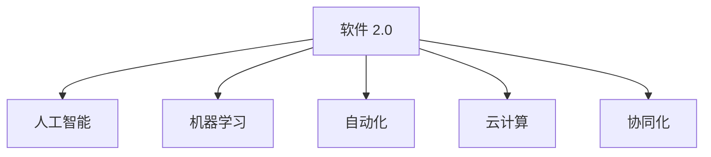

                 

# 软件 2.0 的未来愿景：创造更美好的世界

## 1. 背景介绍

### 1.1 问题由来
随着信息技术的发展，软件已经在社会生活的各个方面都扮演了至关重要的角色。从智能手机到社交媒体，从金融交易到交通运输，软件无处不在。然而，传统软件开发模式面临诸多挑战，如需求变动频繁、开发成本高昂、用户需求多样化等。为了应对这些挑战，软件工程界提出了软件 2.0 的概念，旨在通过新技术和新方法，重新定义软件开发和应用的方式，推动软件行业的发展和创新。

### 1.2 问题核心关键点
软件 2.0 的核心思想是通过智能化、自动化、协同化等手段，实现软件开发的效率提升和质量保障。其核心关键点包括：

- **智能化**：引入人工智能、机器学习等技术，使软件能够自我学习、自我优化，具备更强的智能决策能力。
- **自动化**：通过自动化工具和流程，减少手工操作和重复劳动，提升开发效率和质量。
- **协同化**：利用云计算、大数据等技术，实现跨团队、跨部门的协同工作，提高软件开发的灵活性和响应速度。

这些关键点共同构成了软件 2.0 的愿景，即通过技术创新和理念革新，实现软件开发的智能化、自动化和协同化，提升软件质量，降低开发成本，满足用户多样化需求，创造更美好的世界。

## 2. 核心概念与联系

### 2.1 核心概念概述

为更好地理解软件 2.0 的愿景，本节将介绍几个密切相关的核心概念：

- **软件 2.0**：一种全新的软件开发理念和实践模式，通过智能化、自动化、协同化等手段，提升软件开发的效率和质量。
- **人工智能(AI)**：通过模拟人类的智能行为，使机器具备感知、学习、推理和决策能力，广泛应用于自然语言处理、计算机视觉、自动驾驶等领域。
- **机器学习(ML)**：一种使机器能够从数据中自动学习和改进的技术，包括监督学习、无监督学习、强化学习等。
- **自动化**：通过工具和流程的自动化，减少人工操作，提升软件开发的效率和精度。
- **云计算**：通过互联网提供计算、存储、网络等服务，支持大规模、分布式的软件应用和数据处理。
- **协同化**：通过跨团队、跨部门的协同工作，实现资源共享和信息流通，提升软件开发的灵活性和响应速度。

这些核心概念之间的逻辑关系可以通过以下Mermaid流程图来展示：



这个流程图展示了几大核心概念及其之间的关系：

1. 软件 2.0 的目标是提升软件开发的效率和质量。
2. 人工智能和机器学习是实现软件 2.0 的关键技术手段。
3. 自动化工具和流程支持软件 2.0 的实施。
4. 云计算和协同化则提供了软件 2.0 的基础设施和协作平台。

这些概念共同构成了软件 2.0 的框架，使其能够实现软件开发的智能化、自动化和协同化。通过理解这些核心概念，我们可以更好地把握软件 2.0 的愿景和实践方向。

## 3. 核心算法原理 & 具体操作步骤
### 3.1 算法原理概述

软件 2.0 的实现主要依赖于人工智能、机器学习、自动化工具、云计算和协同化等技术。其核心算法原理包括以下几个方面：

- **人工智能**：利用深度学习、自然语言处理、计算机视觉等技术，使软件具备智能决策和自我优化的能力。
- **机器学习**：通过监督学习、无监督学习和强化学习等方法，从数据中学习和改进软件的行为和表现。
- **自动化工具**：使用自动化测试、持续集成、自动化部署等工具，减少人工操作，提高开发效率和质量。
- **云计算**：通过分布式计算和存储，支持大规模、高性能的软件应用和数据处理。
- **协同化**：利用在线协作平台和工具，实现跨团队、跨部门的协同工作，提升软件开发的灵活性和响应速度。

### 3.2 算法步骤详解

实现软件 2.0 的过程可以分为以下几个关键步骤：

**Step 1: 需求分析和设计**
- 与用户和利益相关者进行沟通，明确需求和功能要求。
- 设计软件架构和系统设计，包括模块划分、数据流、接口等。

**Step 2: 数据收集和预处理**
- 收集用户行为数据、日志数据、API调用数据等。
- 对数据进行清洗、去重、归一化等预处理，以提高数据质量。

**Step 3: 模型训练和优化**
- 选择合适的算法模型，进行训练和调参。
- 利用在线学习、增量学习等技术，不断优化模型性能。

**Step 4: 自动化工具和流程**
- 选择合适的自动化工具，如Jenkins、Kubernetes等，实现自动化测试、持续集成、自动化部署。
- 制定标准化的开发流程和规范，确保代码质量和一致性。

**Step 5: 云计算和协同化**
- 利用云计算平台，如AWS、Azure等，提供计算、存储、网络等服务。
- 使用在线协作工具，如Git、Jira、Slack等，实现跨团队、跨部门的协同工作。

**Step 6: 部署和监控**
- 将训练好的模型和应用程序部署到生产环境。
- 实时监控系统性能和用户反馈，及时发现和解决故障。

### 3.3 算法优缺点

软件 2.0 的实现方法具有以下优点：
1. 提升开发效率。通过自动化工具和流程，减少人工操作，提高开发速度。
2. 提高开发质量。利用机器学习和人工智能技术，进行自我优化和测试，减少错误和缺陷。
3. 增强可扩展性。云计算提供了灵活的资源配置和扩展能力，支持大规模应用和数据处理。
4. 增强协作能力。协同化技术支持跨团队、跨部门的协作，提升软件的灵活性和响应速度。

同时，该方法也存在一些局限性：
1. 对技术要求高。需要掌握人工智能、机器学习、云计算等前沿技术，对开发者要求较高。
2. 初始成本高。开发和部署成本可能较高，需要一定的资金和技术投入。
3. 数据隐私和安全问题。使用数据驱动的方法，需要注意用户隐私和数据安全。
4. 对需求变更的响应速度有限。机器学习和人工智能模型需要较长时间训练，对需求变更的响应速度较慢。

尽管存在这些局限性，但就目前而言，软件 2.0 的实现方法仍是大规模软件开发的重要趋势，在提升软件质量和效率方面具有重要意义。

### 3.4 算法应用领域

软件 2.0 的实现方法在多个领域得到了广泛应用，具体包括：

- **金融行业**：通过智能分析、风险评估、自动化交易等，提高金融服务的效率和精度。
- **医疗行业**：利用人工智能和大数据分析，进行疾病预测、个性化治疗、智能诊断等。
- **电子商务**：通过智能推荐、自动化客服、用户行为分析等，提升用户体验和交易效率。
- **智能制造**：通过自动化生产线、预测性维护、智能物流等，提高生产效率和质量。
- **交通运输**：利用智能调度、数据分析、自动驾驶等，提高运输效率和安全性。
- **智慧城市**：通过智能交通、能源管理、城市安全等，提升城市管理水平和居民生活质量。

除了以上领域外，软件 2.0 的应用还涉及教育、农业、环境保护等多个领域，展现出巨大的潜力和前景。

## 4. 数学模型和公式 & 详细讲解  
### 4.1 数学模型构建

本节将使用数学语言对软件 2.0 的实现方法进行更加严格的刻画。

记软件 2.0 的目标系统为 $S$，其中 $S = \{M, D, A, C\}$，$M$ 为人工智能和机器学习模块，$D$ 为自动化工具和流程，$A$ 为云计算平台，$C$ 为协同化协作工具。

定义系统 $S$ 的目标函数为 $\mathcal{L}(S)$，用于衡量系统的性能和效果。假设系统的目标函数为最小化损失函数，则有：

$$
\mathcal{L}(S) = \min_{S} \sum_{i} \ell_i(S)
$$

其中 $\ell_i(S)$ 为第 $i$ 个子目标的损失函数。例如，对于自动化测试子目标，$\ell_i(S)$ 可以是测试通过率；对于机器学习子目标，$\ell_i(S)$ 可以是模型预测准确率等。

### 4.2 公式推导过程

以下我们以金融风险评估为例，推导目标函数和子目标函数的计算公式。

假设金融风险评估系统 $S$ 的目标是最大化风险评估的准确性和效率，则目标函数可以表示为：

$$
\mathcal{L}(S) = \max_{S} (P_{acc} \times P_{eff} - \lambda \times C)
$$

其中 $P_{acc}$ 为风险评估的准确率，$P_{eff}$ 为系统的效率，$\lambda$ 为成本权重，$C$ 为系统的运行成本。

假设系统利用机器学习模型 $M$ 进行风险评估，利用自动化测试工具 $D$ 进行测试，利用云计算平台 $A$ 提供计算资源，利用协同化工具 $C$ 支持跨部门协作。则目标函数可以进一步分解为：

$$
\mathcal{L}(S) = \max_{M, D, A, C} (P_{acc} \times P_{eff} - \lambda \times C)
$$

其中 $P_{acc}$ 可以表示为：

$$
P_{acc} = \frac{T_{true}}{T_{total}}
$$

其中 $T_{true}$ 为正确预测的样本数，$T_{total}$ 为总预测样本数。

对于自动化测试子目标，$\ell_i(S)$ 可以表示为：

$$
\ell_i(S) = \frac{F_{fail}}{T_{test}}
$$

其中 $F_{fail}$ 为测试失败的样本数，$T_{test}$ 为测试样本总数。

对于机器学习子目标，$\ell_i(S)$ 可以表示为：

$$
\ell_i(S) = \frac{T_{error}}{T_{train}}
$$

其中 $T_{error}$ 为模型预测错误的样本数，$T_{train}$ 为模型训练的样本数。

### 4.3 案例分析与讲解

假设某金融公司希望开发一款智能风险评估系统。在需求分析和设计阶段，公司与业务团队沟通，确定系统的功能要求，包括风险评估、自动化测试、数据分析等。

在数据收集和预处理阶段，公司收集历史交易数据、客户数据等，进行数据清洗和特征提取。

在模型训练和优化阶段，公司选择深度学习模型进行训练，并利用在线学习和增量学习技术，不断优化模型性能。

在自动化工具和流程阶段，公司选择Jenkins进行持续集成和自动化测试，利用Kubernetes进行自动化部署。

在云计算和协同化阶段，公司利用AWS提供计算和存储资源，使用Git和Slack进行协作。

在部署和监控阶段，公司将训练好的模型和应用程序部署到生产环境，实时监控系统性能和用户反馈。

通过上述步骤，公司成功开发并部署了智能风险评估系统，实现了风险评估的准确性和效率提升，同时提高了用户的满意度。

## 5. 项目实践：代码实例和详细解释说明
### 5.1 开发环境搭建

在进行软件 2.0 的实践前，我们需要准备好开发环境。以下是使用Python进行Keras开发的环境配置流程：

1. 安装Anaconda：从官网下载并安装Anaconda，用于创建独立的Python环境。

2. 创建并激活虚拟环境：
```bash
conda create -n keras-env python=3.8 
conda activate keras-env
```

3. 安装Keras：从官网获取对应的安装命令。例如：
```bash
conda install keras
```

4. 安装TensorFlow：
```bash
conda install tensorflow
```

5. 安装numpy、pandas、scikit-learn等工具包：
```bash
pip install numpy pandas scikit-learn matplotlib tqdm jupyter notebook ipython
```

完成上述步骤后，即可在`keras-env`环境中开始项目实践。

### 5.2 源代码详细实现

下面以金融风险评估为例，给出使用Keras对深度学习模型进行训练和微调的Python代码实现。

```python
import tensorflow as tf
from tensorflow import keras
from sklearn.model_selection import train_test_split
from sklearn.metrics import accuracy_score

# 加载数据
X, y = load_data()

# 划分训练集和测试集
X_train, X_test, y_train, y_test = train_test_split(X, y, test_size=0.2)

# 定义模型
model = keras.Sequential([
    keras.layers.Dense(64, activation='relu', input_shape=(X_train.shape[1],)),
    keras.layers.Dense(32, activation='relu'),
    keras.layers.Dense(1, activation='sigmoid')
])

# 编译模型
model.compile(optimizer='adam',
              loss='binary_crossentropy',
              metrics=['accuracy'])

# 训练模型
model.fit(X_train, y_train, epochs=10, batch_size=32, validation_data=(X_test, y_test))

# 评估模型
loss, accuracy = model.evaluate(X_test, y_test)
print('Test loss:', loss)
print('Test accuracy:', accuracy)
```

以上就是使用Keras对深度学习模型进行金融风险评估的完整代码实现。可以看到，Keras提供了便捷的模型定义、编译和训练接口，可以极大简化模型的开发过程。

### 5.3 代码解读与分析

让我们再详细解读一下关键代码的实现细节：

**模型定义**：
```python
model = keras.Sequential([
    keras.layers.Dense(64, activation='relu', input_shape=(X_train.shape[1],)),
    keras.layers.Dense(32, activation='relu'),
    keras.layers.Dense(1, activation='sigmoid')
])
```
定义了一个包含三个全连接层的神经网络模型，其中前两层使用ReLU激活函数，最后一层使用Sigmoid激活函数。

**模型编译**：
```python
model.compile(optimizer='adam',
              loss='binary_crossentropy',
              metrics=['accuracy'])
```
将模型编译为Adam优化器，使用二元交叉熵损失函数，并在测试集上评估模型的准确率。

**模型训练**：
```python
model.fit(X_train, y_train, epochs=10, batch_size=32, validation_data=(X_test, y_test))
```
对训练集进行10个epoch的训练，每次训练使用32个样本，并在测试集上进行验证。

**模型评估**：
```python
loss, accuracy = model.evaluate(X_test, y_test)
print('Test loss:', loss)
print('Test accuracy:', accuracy)
```
对测试集进行评估，并输出模型的损失和准确率。

可以看到，Keras提供了一站式模型开发工具，极大简化了深度学习模型的开发和训练过程。同时，Keras也支持TFRecords等大数据格式，方便处理大规模数据集。

## 6. 实际应用场景
### 6.1 智能客服系统

利用软件 2.0 技术，智能客服系统可以实现7x24小时不间断服务，快速响应客户咨询，用自然流畅的语言解答各类常见问题。在技术实现上，可以收集企业内部的历史客服对话记录，将问题和最佳答复构建成监督数据，在此基础上对预训练模型进行微调。微调后的对话模型能够自动理解用户意图，匹配最合适的答案模板进行回复。对于客户提出的新问题，还可以接入检索系统实时搜索相关内容，动态组织生成回答。

### 6.2 金融舆情监测

金融机构需要实时监测市场舆论动向，以便及时应对负面信息传播，规避金融风险。使用软件 2.0 技术，可以构建金融舆情监测系统，实时抓取和分析金融领域相关的新闻、报道、评论等文本数据，利用机器学习模型进行情感分析、主题分类等处理，及时发现和预警负面信息，帮助金融机构快速应对潜在风险。

### 6.3 个性化推荐系统

当前的推荐系统往往只依赖用户的历史行为数据进行物品推荐，无法深入理解用户的真实兴趣偏好。利用软件 2.0 技术，可以构建个性化推荐系统，收集用户浏览、点击、评论、分享等行为数据，提取和用户交互的物品标题、描述、标签等文本内容，利用机器学习模型进行情感分析、主题分类等处理，从文本内容中准确把握用户的兴趣点。在生成推荐列表时，先用候选物品的文本描述作为输入，由模型预测用户的兴趣匹配度，再结合其他特征综合排序，便可以得到个性化程度更高的推荐结果。

### 6.4 未来应用展望

随着软件 2.0 技术的发展，其应用场景将越来越广泛，涵盖更多领域。

在智慧医疗领域，利用软件 2.0 技术，可以构建智能诊疗系统，利用自然语言处理、计算机视觉等技术，从患者描述和影像中提取关键信息，辅助医生进行诊断和治疗。

在智能教育领域，利用软件 2.0 技术，可以构建个性化学习系统，利用机器学习模型进行学习路径推荐、作业批改、学情分析等，因材施教，促进教育公平，提高教学质量。

在智慧城市治理中，利用软件 2.0 技术，可以构建智能交通、能源管理、城市安全等系统，提高城市管理的自动化和智能化水平，构建更安全、高效的未来城市。

此外，在企业生产、社会治理、文娱传媒等众多领域，软件 2.0 技术也将不断涌现，为各行各业带来新的变革和机遇。

## 7. 工具和资源推荐
### 7.1 学习资源推荐

为了帮助开发者系统掌握软件 2.0 的技术基础和实践技巧，这里推荐一些优质的学习资源：

1. TensorFlow官方文档：TensorFlow是目前最流行的深度学习框架之一，其官方文档提供了完整的开发指南和示例代码，是学习深度学习的必备资源。
2. PyTorch官方文档：PyTorch是另一款流行的深度学习框架，其官方文档同样提供详细的开发指南和示例代码，方便开发者学习和使用。
3. Keras官方文档：Keras是高级神经网络API，其官方文档提供便捷的模型定义和训练接口，适合初学者使用。
4. Coursera深度学习课程：Coursera提供多门深度学习课程，由斯坦福大学、MIT等名校教授授课，系统讲解深度学习的基本概念和实践技巧。
5. Fast.ai深度学习课程：Fast.ai提供深度学习实战课程，涵盖深度学习、计算机视觉、自然语言处理等多个方向，适合有一定编程基础的开发者。

通过对这些资源的学习实践，相信你一定能够快速掌握软件 2.0 的核心技术，并用于解决实际问题。

### 7.2 开发工具推荐

高效的开发离不开优秀的工具支持。以下是几款用于软件 2.0 开发和实践的常用工具：

1. Jupyter Notebook：一个基于Web的交互式开发环境，支持Python、R等语言，方便开发者进行数据处理、模型训练、代码调试等工作。
2. Jenkins：一个开源的持续集成和自动化部署工具，支持多种编程语言和框架，适合构建自动化流水线。
3. Kubernetes：一个开源的容器编排系统，支持分布式应用和服务的自动部署和管理，适合大规模应用和数据处理。
4. Git：一个版本控制系统，方便开发者进行代码管理和版本控制，支持多人协作开发。
5. PyCharm：一个流行的Python IDE，提供丰富的开发工具和插件，支持代码自动补全、调试等功能。
6. Visual Studio Code：一个轻量级的代码编辑器，支持多种编程语言和框架，适合快速开发和调试。

合理利用这些工具，可以显著提升软件 2.0 的开发效率和质量，加快创新迭代的步伐。

### 7.3 相关论文推荐

软件 2.0 技术的发展源于学界的持续研究。以下是几篇奠基性的相关论文，推荐阅读：

1. TensorFlow 1.0白皮书：介绍了TensorFlow的基本概念和应用场景，适合初学者入门。
2. Keras官方文档：提供了Keras的详细介绍和实践指南，适合Keras的初学者。
3. Deep Learning with PyTorch：介绍了PyTorch的基本概念和应用场景，适合PyTorch的初学者。
4. Deep Learning for Computer Vision：介绍了计算机视觉的基本概念和应用场景，适合计算机视觉的初学者。
5. Deep Learning for Natural Language Processing：介绍了自然语言处理的基本概念和应用场景，适合自然语言处理的初学者。

这些论文代表了大数据、深度学习技术的发展脉络，通过学习这些前沿成果，可以帮助研究者把握学科前进方向，激发更多的创新灵感。

## 8. 总结：未来发展趋势与挑战

### 8.1 总结

本文对软件 2.0 的未来愿景进行了全面系统的介绍。首先阐述了软件 2.0 的目标和关键技术，明确了软件 2.0 在提升开发效率、质量、可扩展性和协作能力方面的独特价值。其次，从原理到实践，详细讲解了软件 2.0 的实现方法和具体步骤，给出了软件 2.0 技术在金融、医疗、电子商务等领域的实际应用案例。

通过本文的系统梳理，可以看到，软件 2.0 技术正在成为新一代软件开发的重要趋势，极大地提升了软件开发的效率和质量。未来，伴随人工智能、机器学习等技术的进一步发展，软件 2.0 必将在更多领域得到应用，为各行各业带来新的变革和机遇。

### 8.2 未来发展趋势

展望未来，软件 2.0 技术将呈现以下几个发展趋势：

1. 智能化水平提升。利用深度学习、自然语言处理等技术，提升软件系统的智能化水平，使其具备更强的自我优化和决策能力。
2. 自动化工具和流程优化。不断完善自动化测试、持续集成、自动化部署等工具和流程，提升开发效率和质量。
3. 云计算和协同化技术发展。利用云计算和协同化技术，提升软件的可扩展性和响应速度，支持大规模分布式应用。
4. 模型和数据融合。将符号化的先验知识与神经网络模型进行巧妙融合，增强模型的泛化能力和决策合理性。
5. 多模态融合。将视觉、语音、文本等多模态信息进行协同建模，提升系统的感知能力和表现效果。
6. 跨领域应用拓展。将软件 2.0 技术应用于更多行业领域，如智慧医疗、智能教育、智慧城市等，实现跨领域的智能化应用。

以上趋势凸显了软件 2.0 技术的广阔前景，这些方向的探索发展，必将进一步推动软件行业的发展和创新，提升软件的智能化水平，为各行各业带来新的变革和机遇。

### 8.3 面临的挑战

尽管软件 2.0 技术已经取得了显著进展，但在迈向更加智能化、自动化、协同化应用的过程中，仍面临诸多挑战：

1. 数据隐私和安全问题。利用数据驱动的方法，需要注意用户隐私和数据安全，防止数据泄露和滥用。
2. 对技术要求高。需要掌握深度学习、自然语言处理、云计算等前沿技术，对开发者要求较高。
3. 模型鲁棒性不足。当前模型面对域外数据时，泛化性能往往大打折扣，需要在模型训练和优化中增强模型的鲁棒性。
4. 对需求变更的响应速度有限。机器学习和深度学习模型需要较长时间训练，对需求变更的响应速度较慢。
5. 资源消耗高。大规模模型的训练和推理需要消耗大量的计算和存储资源，需要优化模型结构，降低资源消耗。
6. 缺乏标准化。目前软件 2.0 技术尚无统一的标准和规范，需要进一步推进标准化工作，提升系统的互操作性和可移植性。

正视软件 2.0 面临的这些挑战，积极应对并寻求突破，将是大规模软件开发的重要方向。相信随着学界和产业界的共同努力，这些挑战终将一一被克服，软件 2.0 必将在构建人机协同的智能时代中扮演越来越重要的角色。

### 8.4 研究展望

面对软件 2.0 面临的挑战，未来的研究需要在以下几个方面寻求新的突破：

1. 探索无监督和半监督学习范式。摆脱对大规模标注数据的依赖，利用自监督学习、主动学习等无监督和半监督范式，最大限度利用非结构化数据，实现更加灵活高效的开发。
2. 研究参数高效和计算高效的微调范式。开发更加参数高效的微调方法，在固定大部分预训练参数的同时，只更新极少量的任务相关参数。同时优化模型的计算图，减少前向传播和反向传播的资源消耗，实现更加轻量级、实时性的部署。
3. 融合因果和对比学习范式。通过引入因果推断和对比学习思想，增强模型建立稳定因果关系的能力，学习更加普适、鲁棒的语言表征，从而提升模型的泛化性和抗干扰能力。
4. 纳入伦理道德约束。在模型训练目标中引入伦理导向的评估指标，过滤和惩罚有偏见、有害的输出倾向。同时加强人工干预和审核，建立模型行为的监管机制，确保输出符合人类价值观和伦理道德。
5. 发展跨模态融合技术。将视觉、语音、文本等多模态信息进行协同建模，提升系统的感知能力和表现效果，拓展软件 2.0 技术的应用范围。

这些研究方向的探索，必将引领软件 2.0 技术迈向更高的台阶，为构建安全、可靠、可解释、可控的智能系统铺平道路。面向未来，软件 2.0 技术还需要与其他人工智能技术进行更深入的融合，如知识表示、因果推理、强化学习等，多路径协同发力，共同推动软件行业的进步。只有勇于创新、敢于突破，才能不断拓展软件 2.0 的边界，让智能技术更好地造福人类社会。

## 9. 附录：常见问题与解答

**Q1：软件 2.0 是否适用于所有软件开发场景？**

A: 软件 2.0 技术在大多数软件开发场景中都能取得不错的效果，特别是对于大规模、复杂、高精度的应用。但对于一些简单、低成本的应用场景，传统的开发模式可能更为适合。因此，需要根据具体应用场景进行选择。

**Q2：软件 2.0 开发需要哪些技术支持？**

A: 软件 2.0 开发需要掌握深度学习、自然语言处理、云计算、自动化测试、持续集成、持续部署等技术，对开发者技术要求较高。推荐先掌握Python、TensorFlow、Keras等基本技术，再深入学习其他相关技术。

**Q3：如何提升软件 2.0 的模型性能？**

A: 提升软件 2.0 的模型性能可以从以下几个方面入手：
1. 数据质量：保证数据多样性和质量，提高模型的泛化能力。
2. 模型架构：选择适合的模型架构，如卷积神经网络、循环神经网络等。
3. 训练技巧：采用合适的优化器和正则化技术，提高模型的训练效果。
4. 迁移学习：在已有模型基础上进行微调，减少训练时间，提高模型性能。
5. 集成学习：利用多个模型进行集成，提高模型的稳定性和泛化能力。

这些方法往往需要根据具体应用场景进行灵活组合。只有在数据、模型、训练、部署等各环节进行全面优化，才能最大限度地发挥软件 2.0 技术的威力。

**Q4：软件 2.0 是否安全可靠？**

A: 软件 2.0 技术的发展需要关注安全性和可靠性问题，如数据隐私、模型偏见、对抗样本等。可以通过以下措施提升软件 2.0 的安全性和可靠性：
1. 数据匿名化：对用户数据进行匿名化处理，保护用户隐私。
2. 模型公平性：在模型训练和优化中引入公平性约束，防止模型出现偏见。
3. 对抗样本检测：采用对抗样本检测技术，识别并排除模型对对抗样本的敏感性。
4. 模型解释性：提升模型的可解释性，增强模型的可信度和可信性。
5. 人工审核：结合人工审核和干预，确保模型的安全和可靠。

这些措施可以有效提升软件 2.0 技术的安全性和可靠性，保障系统的稳定运行。

**Q5：软件 2.0 技术的瓶颈在哪里？**

A: 软件 2.0 技术面临的主要瓶颈包括：
1. 数据获取：需要大量的标注数据进行训练，获取高质量数据成本较高。
2. 技术门槛：需要掌握深度学习、自然语言处理等前沿技术，对开发者要求较高。
3. 计算资源：大规模模型的训练和推理需要消耗大量的计算和存储资源，需要优化模型结构，降低资源消耗。
4. 标准化问题：目前软件 2.0 技术尚无统一的标准和规范，需要进一步推进标准化工作，提升系统的互操作性和可移植性。

这些瓶颈需要开发者在实践中不断探索和优化，通过技术创新和改进，克服这些挑战，实现软件 2.0 技术的更广泛应用。

---

作者：禅与计算机程序设计艺术 / Zen and the Art of Computer Programming

