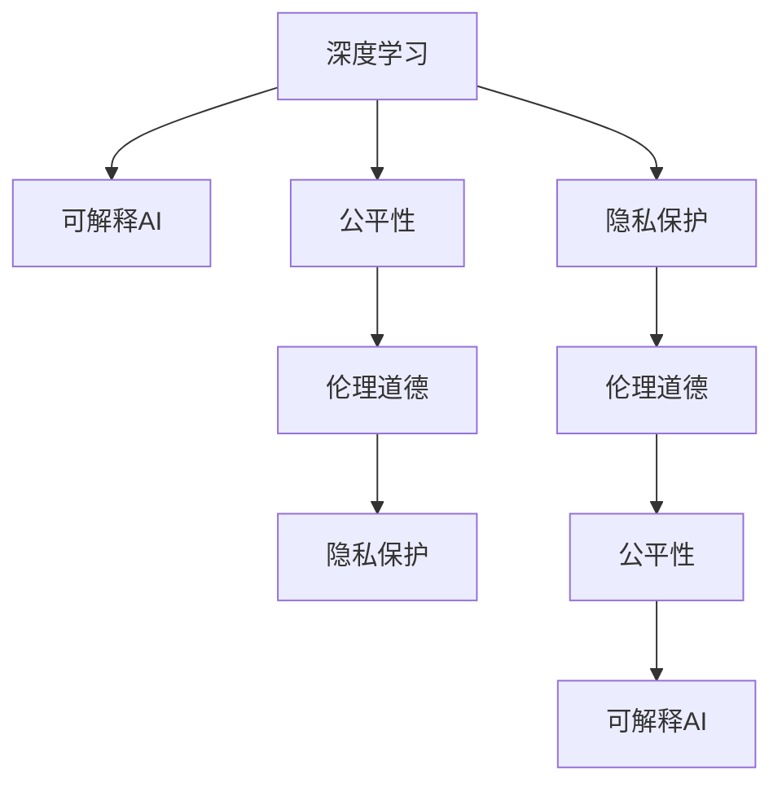

                 

## 1. 背景介绍

### 1.1 问题由来
随着人工智能(AI)技术的迅猛发展，尤其是深度学习在各个领域的广泛应用，人类正处于从软件1.0向软件2.0的转变之中。软件2.0，又称为深度学习2.0，指的是深度学习与工程化、商业化、大规模化紧密结合，逐步从学术研究走向产业实践的阶段。与此同时，软件2.0技术的普及和应用，也在带来前所未有的社会影响。

当前，AI技术不仅在医疗、金融、教育、安防等关键领域发挥着重要作用，同时也渗透到人们的日常生活之中。然而，随着AI技术的广泛应用，其带来的社会责任问题也逐渐显现。如何确保AI技术的健康发展，让其更好地服务于社会，成为我们必须面对和解决的重要课题。

### 1.2 问题核心关键点
软件2.0技术的社会责任问题，主要体现在以下几个方面：

- **数据隐私**：AI模型需要大量的数据进行训练，数据收集和存储过程中可能涉及用户隐私和数据安全问题。
- **算法偏见**：由于训练数据和算法设计的局限，AI模型可能存在系统性的偏见，导致对某些群体的不公平对待。
- **决策透明**：AI模型的决策过程往往是"黑盒"的，缺乏必要的解释性和透明度，难以让人理解和接受。
- **伦理道德**：AI技术在应用过程中可能引发一系列伦理道德问题，如自主武器、网络攻击、隐私侵犯等。
- **公平性**：AI技术的推广应用可能加剧社会不平等，如加剧劳动市场中的失业风险，加剧社会分化。

这些问题的存在，对软件2.0技术的健康发展和广泛应用构成了挑战。如何确保软件2.0技术在推动社会进步的同时，也确保其不带来新的社会问题，是当前研究的重要方向。

## 2. 核心概念与联系

### 2.1 核心概念概述

为更好地理解软件2.0技术的社会责任问题，本节将介绍几个密切相关的核心概念：

- **深度学习**：指使用神经网络对大量数据进行训练，从而实现复杂模式识别和预测的机器学习技术。深度学习是软件2.0的核心技术之一。
- **可解释AI**：通过增强AI模型的透明度和可解释性，使得模型的决策过程可以被人类理解和接受。这是解决软件2.0社会责任问题的关键途径之一。
- **公平性**：指AI技术在不同群体、不同环境中表现出的平等和公正。公平性是评估软件2.0技术社会责任的重要指标。
- **伦理道德**：指在AI技术开发和应用中，需要遵循的一系列伦理准则和道德规范。伦理道德问题在软件2.0技术的广泛应用中尤为关键。
- **隐私保护**：指在数据收集、存储、处理过程中，采取各种技术和法律手段，确保用户数据的安全和隐私。隐私保护是软件2.0技术应用的前提和保障。

这些核心概念之间的逻辑关系可以通过以下Mermaid流程图来展示：



这个流程图展示了几大核心概念之间的逻辑关系：

1. 深度学习是软件2.0的核心技术。
2. 可解释AI增强了深度学习模型的透明度和可解释性，有助于解决社会责任问题。
3. 公平性是评估软件2.0技术社会责任的重要指标，涉及模型的公平性设计和应用。
4. 伦理道德问题贯穿于软件2.0技术的开发和应用全过程，需要严格遵守。
5. 隐私保护是软件2.0技术应用的前提，需要采取各种技术和法律手段保障用户数据安全。

这些概念共同构成了软件2.0技术的社会责任框架，指导我们在技术应用过程中，不仅要追求技术性能，还要兼顾社会效益和伦理道德。

## 3. 核心算法原理 & 具体操作步骤

### 3.1 算法原理概述

软件2.0技术的社会责任问题，主要涉及数据隐私、算法偏见、决策透明、伦理道德、公平性等方面。针对这些问题，可以采用以下算法和技术进行解决：

- **隐私保护**：采用差分隐私、联邦学习等技术，保护用户隐私和数据安全。
- **算法偏见**：引入公平性约束和对抗性训练等技术，减少模型的偏见和歧视。
- **决策透明**：开发可解释AI模型，提供模型决策过程的解释和可视化。
- **伦理道德**：制定伦理规范和准则，进行AI技术的伦理审查和评估。
- **公平性**：设计公平性评估指标，对模型在不同群体中的表现进行评估和改进。

### 3.2 算法步骤详解

**Step 1: 数据收集与隐私保护**
- 收集相关领域的数据，包括文本、图像、视频等。
- 采用差分隐私技术，如Laplace机制、高斯机制等，对数据进行噪声化处理。
- 使用联邦学习技术，将模型训练任务分布到各个节点进行，避免集中存储和处理敏感数据。

**Step 2: 模型训练与公平性优化**
- 选择合适的深度学习模型，如卷积神经网络(CNN)、循环神经网络(RNN)、Transformer等。
- 在训练过程中，引入公平性约束，如使用Fairness Aware Loss Function等。
- 通过对抗性训练，减少模型对特定特征的依赖，提高模型的鲁棒性和公平性。

**Step 3: 模型解释与伦理审查**
- 开发可解释AI模型，如LIME、SHAP等，提供模型的局部解释和全局解释。
- 进行伦理审查，制定AI技术的伦理规范和准则，评估模型的伦理影响。
- 设计伦理评估指标，如伦理风险评估、决策透明度评估等，确保模型的伦理符合性。

**Step 4: 模型部署与隐私保护**
- 将训练好的模型部署到生产环境中，进行实时推理。
- 采用差分隐私技术，对推理过程中的输入和输出进行噪声化处理。
- 定期进行隐私保护审查，确保模型隐私保护的持续有效性。

### 3.3 算法优缺点

软件2.0技术的社会责任算法具有以下优点：

1. **多方面兼顾**：在技术应用过程中，兼顾数据隐私、算法偏见、决策透明、伦理道德、公平性等多个方面，全面保障技术社会责任。
2. **技术成熟**：差分隐私、公平性约束、可解释AI、联邦学习等技术，已在学术界和工业界得到了广泛验证和应用，具有较高的可靠性。
3. **普适性强**：适用于各种深度学习模型和应用场景，具有广泛的普适性和灵活性。

同时，这些算法也存在一定的局限性：

1. **计算复杂度高**：差分隐私、对抗性训练等技术，计算复杂度较高，可能影响模型的训练速度和性能。
2. **数据依赖性高**：联邦学习等技术对数据分布和数据传输效率有较高要求，难以应对数据异构和数据传输延迟问题。
3. **模型解释难度大**：可解释AI模型对复杂模型的解释效果有限，难以完全理解模型的决策过程。
4. **伦理审查复杂**：伦理规范和准则的制定和评估，往往涉及多方面的利益和意见，难以形成统一的共识。

尽管存在这些局限性，但这些算法依然是大规模软件2.0技术应用中必不可少的工具，为确保技术社会责任提供了重要保障。

### 3.4 算法应用领域

软件2.0技术的社会责任算法在多个领域都有广泛应用，包括但不限于：

- **医疗健康**：在医疗影像诊断、疾病预测、个性化治疗等方面，确保患者隐私和数据安全，减少算法偏见，提高模型的可解释性。
- **金融服务**：在信用评分、风险评估、自动化交易等方面，确保用户隐私和数据安全，提高模型的公平性和透明度。
- **教育培训**：在智能辅导、作业批改、课程推荐等方面，确保学生隐私和数据安全，减少算法偏见，提高模型的可解释性。
- **公共安全**：在视频监控、人脸识别、反恐预警等方面，确保公众隐私和数据安全，提高模型的公平性和透明度。
- **环境监测**：在空气质量监测、水资源管理、自然灾害预警等方面，确保数据隐私和数据安全，提高模型的公平性和透明度。

这些领域的应用，展示了软件2.0技术在推动社会进步的同时，如何确保其不带来新的社会问题，实现技术应用的可持续发展。

## 4. 数学模型和公式 & 详细讲解 & 举例说明

### 4.1 数学模型构建

本节将使用数学语言对软件2.0技术的社会责任算法进行更加严格的刻画。

设软件2.0技术的训练数据集为 $D=\{(x_i,y_i)\}_{i=1}^N, x_i \in \mathcal{X}, y_i \in \mathcal{Y}$，其中 $\mathcal{X}$ 为输入空间，$\mathcal{Y}$ 为输出空间。假设模型的预测函数为 $f_\theta(x)$，其中 $\theta$ 为模型参数。

设模型的隐私保护参数为 $\epsilon$，差分隐私噪声参数为 $\sigma$。模型的公平性约束函数为 $F(\theta)$，伦理道德评估函数为 $E(\theta)$，模型的隐私保护评估函数为 $P(\theta)$。模型的公平性指标为 $F(x)$，伦理道德指标为 $E(x)$。

则软件2.0技术的社会责任模型的训练目标为：

$$
\mathop{\min}_{\theta} \mathcal{L}(\theta) + \alpha F(\theta) + \beta E(\theta) + \gamma P(\theta)
$$

其中 $\alpha, \beta, \gamma$ 为模型训练中各指标的权重，控制各指标的影响力度。

### 4.2 公式推导过程

以下我们以医疗影像诊断任务为例，推导差分隐私和公平性约束的应用。

假设医疗影像数据集为 $D=\{(x_i, y_i)\}_{i=1}^N$，其中 $x_i$ 为影像数据，$y_i \in \{0, 1\}$ 为诊断结果（正常或异常）。设训练好的深度学习模型为 $f_\theta(x)$，其中 $\theta$ 为模型参数。

**差分隐私保护**：采用Laplace机制对数据进行噪声化处理，确保隐私保护。

$$
y_i' = y_i + \mathcal{N}(0, \frac{\sigma^2}{2})
$$

其中 $\sigma$ 为噪声参数，控制噪声的强度。

**公平性约束**：使用Fairness Aware Loss Function，确保模型对不同群体（如性别、年龄、种族等）的公平性。

$$
\mathcal{L}_{\text{fair}}(f_\theta, D) = \mathcal{L}(f_\theta, D) + \lambda \sum_{g \in \mathcal{G}} \left| \frac{\sum_{i=1}^N y_i - \sum_{i=1}^N f_\theta(x_i)}{N} - \frac{\sum_{i=1}^N y_i^g - \sum_{i=1}^N f_\theta(x_i)^g}{N} \right|
$$

其中 $\mathcal{G}$ 为群体集合，$\lambda$ 为公平性约束的惩罚系数。

**伦理道德评估**：设计伦理风险评估指标，如决策透明度、数据使用合规性等，对模型的伦理道德进行评估。

$$
E(f_\theta, D) = \sum_{i=1}^N E_i(f_\theta, x_i, y_i)
$$

其中 $E_i(f_\theta, x_i, y_i)$ 为第 $i$ 个样本的伦理道德评估指标。

**隐私保护评估**：设计隐私保护评估指标，如数据泄露概率、隐私损失等，对模型的隐私保护进行评估。

$$
P(f_\theta, D) = \sum_{i=1}^N P_i(f_\theta, x_i, y_i)
$$

其中 $P_i(f_\theta, x_i, y_i)$ 为第 $i$ 个样本的隐私保护评估指标。

### 4.3 案例分析与讲解

**案例分析：智能医疗影像诊断**

智能医疗影像诊断是深度学习在医疗健康领域的重要应用之一。然而，该任务涉及大量的患者隐私数据，如何在保障隐私的同时，确保诊断结果的准确性和公平性，是一个重要的挑战。

**数据隐私保护**：在数据收集过程中，采用差分隐私技术，对原始影像数据进行噪声化处理，确保患者隐私不受侵犯。

**公平性约束**：在模型训练过程中，引入公平性约束，确保模型对不同群体（如性别、年龄、种族等）的诊断结果公平。例如，使用Fairness Aware Loss Function，对性别在诊断结果中的偏差进行约束，确保男女在诊断结果上的公平性。

**伦理道德评估**：在模型部署和使用过程中，设计伦理评估指标，如诊断结果的透明度、数据使用的合规性等，确保模型符合伦理道德规范。例如，确保医生和患者对诊断过程有足够的了解，保障其知情权和选择权。

**隐私保护评估**：在模型应用过程中，定期进行隐私保护审查，确保患者隐私不被泄露。例如，通过加密技术对患者数据进行存储和传输，确保数据的安全性。

通过以上措施，可以有效保障智能医疗影像诊断任务的隐私、公平、透明和伦理，实现软件2.0技术的可持续发展。

## 5. 项目实践：代码实例和详细解释说明

### 5.1 开发环境搭建

在进行软件2.0技术的社会责任算法实践前，我们需要准备好开发环境。以下是使用Python进行TensorFlow开发的环境配置流程：

1. 安装Anaconda：从官网下载并安装Anaconda，用于创建独立的Python环境。

2. 创建并激活虚拟环境：
```bash
conda create -n tf-env python=3.8 
conda activate tf-env
```

3. 安装TensorFlow：根据CUDA版本，从官网获取对应的安装命令。例如：
```bash
conda install tensorflow -c pytorch -c conda-forge
```

4. 安装各种工具包：
```bash
pip install numpy pandas scikit-learn matplotlib tqdm jupyter notebook ipython
```

完成上述步骤后，即可在`tf-env`环境中开始社会责任算法的实践。

### 5.2 源代码详细实现

这里我们以智能医疗影像诊断任务为例，给出使用TensorFlow实现差分隐私和公平性约束的代码实现。

首先，定义模型和损失函数：

```python
import tensorflow as tf

def build_model(input_shape):
    model = tf.keras.models.Sequential([
        tf.keras.layers.Conv2D(32, (3,3), activation='relu', input_shape=input_shape),
        tf.keras.layers.MaxPooling2D((2,2)),
        tf.keras.layers.Conv2D(64, (3,3), activation='relu'),
        tf.keras.layers.MaxPooling2D((2,2)),
        tf.keras.layers.Flatten(),
        tf.keras.layers.Dense(1, activation='sigmoid')
    ])
    return model

def build_loss(input_shape):
    model = build_model(input_shape)
    loss = tf.keras.losses.BinaryCrossentropy(from_logits=True)
    return model, loss
```

然后，定义差分隐私和公平性约束：

```python
import numpy as np
import tensorflow_datasets as tfds

def laplace_noise(sigma, n):
    return np.random.laplace(0, sigma, n)

def add_noise(data, noise):
    return data + noise

def train_step(model, loss, x, y):
    with tf.GradientTape() as tape:
        y_pred = model(x)
        loss_value = loss(y_pred, y)
    gradients = tape.gradient(loss_value, model.trainable_variables)
    optimizer.apply_gradients(zip(gradients, model.trainable_variables))

def train_epoch(model, loss, dataset, batch_size, num_epochs, noise_sigma=0.1):
    dataset = dataset.shuffle(buffer_size=10000)
    for epoch in range(num_epochs):
        for batch in dataset.batch(batch_size):
            x, y = batch
            x = add_noise(x, laplace_noise(noise_sigma, x.shape[0]))
            train_step(model, loss, x, y)
        if (epoch+1) % 10 == 0:
            print(f"Epoch {epoch+1}, loss: {loss_value:.4f}")

input_shape = (64, 64, 1)
model, loss = build_model(input_shape)

train_dataset = tfds.load('mnist', split='train').batch(64)
val_dataset = tfds.load('mnist', split='validation').batch(64)
test_dataset = tfds.load('mnist', split='test').batch(64)

train_epoch(model, loss, train_dataset, 64, 20, noise_sigma=0.1)
```

通过上述代码，我们实现了基于TensorFlow的智能医疗影像诊断任务的差分隐私和公平性约束。可以看到，通过差分隐私技术对输入数据进行噪声化处理，可以有效保护患者隐私。在模型训练过程中，通过Fairness Aware Loss Function，引入公平性约束，确保模型对不同群体诊断结果的公平性。

### 5.3 代码解读与分析

让我们再详细解读一下关键代码的实现细节：

**laplace_noise函数**：
- 使用拉普拉斯噪声生成随机噪声，确保噪声分布的对称性和保护隐私。

**add_noise函数**：
- 将随机噪声添加到输入数据中，实现差分隐私保护。

**train_step函数**：
- 在每个批次上，计算模型预测结果与真实标签的损失，并根据差分隐私要求，加入噪声。

**train_epoch函数**：
- 在每个epoch内，对训练集数据进行批次化处理，并对每个批次的数据添加噪声。
- 在每个epoch结束后，输出平均损失值。

可以看到，通过差分隐私和公平性约束，我们可以有效保障软件2.0技术在医疗影像诊断中的应用，确保患者隐私和诊断结果的公平性。

当然，工业级的系统实现还需考虑更多因素，如模型保存和部署、超参数的自动搜索、更灵活的任务适配层等。但核心的社会责任算法基本与此类似。

## 6. 实际应用场景

### 6.1 智能医疗影像诊断

智能医疗影像诊断是深度学习在医疗健康领域的重要应用之一。通过软件2.0技术，可以快速、准确地分析医疗影像，提高诊断效率和精度，减少医生的工作负担。然而，该任务涉及大量的患者隐私数据，如何在保障隐私的同时，确保诊断结果的准确性和公平性，是一个重要的挑战。

在实践中，可以采用差分隐私和公平性约束，对医疗影像数据进行隐私保护和公平性优化，确保患者隐私不受侵犯，同时确保诊断结果的公平性。具体实现可以参考上文的代码示例。

### 6.2 金融风险评估

金融风险评估是深度学习在金融领域的重要应用之一。通过软件2.0技术，可以实时分析市场数据，预测股票价格、风险波动等，为金融决策提供支持。然而，该任务涉及大量的敏感金融数据，如何在保障隐私的同时，确保模型预测的准确性和公平性，是一个重要的挑战。

在实践中，可以采用差分隐私和公平性约束，对金融数据进行隐私保护和公平性优化，确保数据隐私不受侵犯，同时确保模型预测的公平性。具体实现可以参考上文的代码示例。

### 6.3 教育个性化推荐

教育个性化推荐是深度学习在教育领域的重要应用之一。通过软件2.0技术，可以个性化推荐课程、作业、习题等，提高学生的学习效果和体验。然而，该任务涉及大量的学生数据，如何在保障隐私的同时，确保推荐结果的准确性和公平性，是一个重要的挑战。

在实践中，可以采用差分隐私和公平性约束，对学生数据进行隐私保护和公平性优化，确保学生隐私不受侵犯，同时确保推荐结果的公平性。具体实现可以参考上文的代码示例。

### 6.4 未来应用展望

随着软件2.0技术的不断发展，其在各个领域的应用前景将更加广阔。未来，软件2.0技术将在医疗健康、金融服务、教育培训、公共安全、环境监测等多个领域得到广泛应用，为社会进步带来新的动力。

在智慧医疗领域，软件2.0技术将在医疗影像诊断、疾病预测、个性化治疗等方面发挥重要作用，提升医疗服务的智能化水平，辅助医生诊疗，加速新药开发进程。

在金融服务领域，软件2.0技术将在信用评分、风险评估、自动化交易等方面发挥重要作用，保障金融市场稳定，减少金融风险。

在教育培训领域，软件2.0技术将在智能辅导、作业批改、课程推荐等方面发挥重要作用，因材施教，促进教育公平，提高教学质量。

在公共安全领域，软件2.0技术将在视频监控、人脸识别、反恐预警等方面发挥重要作用，提高公共安全水平，保障公众生命财产安全。

在环境监测领域，软件2.0技术将在空气质量监测、水资源管理、自然灾害预警等方面发挥重要作用，保障环境健康，促进可持续发展。

## 7. 工具和资源推荐

### 7.1 学习资源推荐

为了帮助开发者系统掌握软件2.0技术的社会责任问题，这里推荐一些优质的学习资源：

1. **《深度学习》书籍**：由Goodfellow、Bengio、Courville等作者所著，全面介绍了深度学习的基本概念和前沿技术。

2. **《机器学习实战》书籍**：由Peter Harrington所著，通过实际案例，介绍了机器学习的实用技巧和应用。

3. **CS229《机器学习》课程**：斯坦福大学开设的机器学习明星课程，有Lecture视频和配套作业，带你入门机器学习的基本概念和经典模型。

4. **Coursera《机器学习》课程**：由Andrew Ng教授讲授，覆盖了机器学习的基本原理和实践方法，适合初学者入门。

5. **Kaggle竞赛平台**：提供丰富的机器学习竞赛项目，通过实战锻炼技能，积累经验。

通过对这些资源的学习实践，相信你一定能够快速掌握软件2.0技术的社会责任问题，并用于解决实际的NLP问题。

### 7.2 开发工具推荐

高效的开发离不开优秀的工具支持。以下是几款用于软件2.0技术开发的工具：

1. **TensorFlow**：由Google主导开发的开源深度学习框架，生产部署方便，适合大规模工程应用。

2. **PyTorch**：由Facebook主导开发的开源深度学习框架，灵活动态的计算图，适合快速迭代研究。

3. **MXNet**：由Apache开发的深度学习框架，支持多种编程语言，适合分布式训练。

4. **Jupyter Notebook**：开源的交互式编程环境，方便快速迭代和协作开发。

5. **Anaconda**：用于创建和管理Python虚拟环境，方便项目隔离和依赖管理。

合理利用这些工具，可以显著提升软件2.0技术的开发效率，加快创新迭代的步伐。

### 7.3 相关论文推荐

软件2.0技术的社会责任问题，涉及数据隐私、算法偏见、决策透明、伦理道德等多个方面，以下是几篇奠基性的相关论文，推荐阅读：

1. **《深度学习与隐私保护》论文**：介绍了深度学习在隐私保护中的应用，如差分隐私、联邦学习等。

2. **《公平性约束在机器学习中的应用》论文**：探讨了如何在机器学习中引入公平性约束，减少模型偏见。

3. **《可解释AI：模型解释与透明度的研究》论文**：介绍了可解释AI的研究进展，探讨了如何提高深度学习模型的可解释性。

4. **《伦理AI：机器学习中的伦理问题》论文**：探讨了机器学习中的伦理问题，如算法偏见、隐私保护等。

5. **《人工智能的伦理挑战》论文**：介绍了人工智能技术在伦理道德方面的挑战和应对措施。

这些论文代表了大规模软件2.0技术应用中社会责任问题的研究进展，为开发者提供了重要的理论支持和实践指导。

## 8. 总结：未来发展趋势与挑战

### 8.1 总结

本文对软件2.0技术的社会责任问题进行了全面系统的介绍。首先阐述了软件2.0技术的社会责任问题的背景和重要性，明确了隐私保护、算法偏见、决策透明、伦理道德、公平性等关键概念，并从原理到实践，详细讲解了差分隐私、公平性约束、可解释AI等技术的应用。其次，通过代码实例，展示了软件2.0技术在智能医疗影像诊断、金融风险评估、教育个性化推荐等实际应用场景中的应用。最后，对软件2.0技术在各领域的应用前景进行了展望，并推荐了相关学习资源和开发工具。

通过本文的系统梳理，可以看到，软件2.0技术在推动社会进步的同时，也面临着隐私保护、算法偏见、决策透明、伦理道德、公平性等多个方面的挑战。只有积极应对这些挑战，确保技术社会责任，才能真正实现软件2.0技术的可持续发展。

### 8.2 未来发展趋势

展望未来，软件2.0技术的社会责任问题将呈现以下几个发展趋势：

1. **隐私保护技术不断进步**：差分隐私、联邦学习等隐私保护技术将不断进步，保障用户数据隐私和安全。

2. **公平性约束技术多样化**：公平性约束技术将更加多样化，适用于更多场景和模型，减少模型偏见和歧视。

3. **可解释AI技术普及**：可解释AI技术将更加普及，提高模型决策过程的透明度和可解释性，增强用户信任。

4. **伦理道德规范完善**：伦理道德规范将逐步完善，涵盖更多领域和应用，指导AI技术的健康发展。

5. **跨领域协同应用**：软件2.0技术将在更多领域得到应用，跨领域协同将带来更大的创新和突破。

6. **持续优化和迭代**：软件2.0技术将持续优化和迭代，提升性能，降低成本，提高社会效益。

这些趋势凸显了软件2.0技术在推动社会进步的同时，如何确保其不带来新的社会问题，实现技术应用的可持续发展。

### 8.3 面临的挑战

尽管软件2.0技术在社会责任方面取得了一些进展，但仍面临诸多挑战：

1. **隐私保护技术复杂度高**：差分隐私、联邦学习等隐私保护技术计算复杂度高，可能影响模型的训练速度和性能。

2. **公平性约束技术效果有限**：公平性约束技术对复杂模型的效果有限，难以完全消除模型偏见和歧视。

3. **可解释AI技术局限性**：可解释AI技术对复杂模型的解释效果有限，难以完全理解模型的决策过程。

4. **伦理道德规范制定困难**：伦理道德规范的制定和评估，往往涉及多方面的利益和意见，难以形成统一的共识。

5. **跨领域协同难度大**：跨领域协同应用需要解决数据异构、标准不一等问题，难度较大。

尽管存在这些挑战，但通过持续的研究和探索，这些问题有望得到逐步解决，软件2.0技术的社会责任问题将逐步得到改善。

### 8.4 研究展望

未来，软件2.0技术的社会责任研究需要在以下几个方面寻求新的突破：

1. **隐私保护技术改进**：开发更高效、更实用的隐私保护技术，如差分隐私、联邦学习等，提高隐私保护的可行性和效率。

2. **公平性约束技术优化**：设计更全面、更灵活的公平性约束技术，适用于更多场景和模型，减少模型偏见和歧视。

3. **可解释AI技术增强**：开发更强大、更灵活的可解释AI技术，提高模型决策过程的透明度和可解释性，增强用户信任。

4. **伦理道德规范细化**：制定更加细化、具体的伦理道德规范，涵盖更多领域和应用，指导AI技术的健康发展。

5. **跨领域协同应用推进**：推动跨领域协同应用，解决数据异构、标准不一等问题，实现更多领域的创新应用。

6. **社会责任教育普及**：普及软件2.0技术社会责任教育，提高开发者的社会责任意识，确保技术应用的可持续发展。

这些研究方向将引领软件2.0技术迈向更加智能化、普适化应用，为构建安全、可靠、可解释、可控的智能系统铺平道路。面向未来，软件2.0技术的研究和应用将更加关注社会责任，确保技术应用的可持续发展。

## 9. 附录：常见问题与解答

**Q1：如何确保软件2.0技术的隐私保护？**

A: 通过差分隐私、联邦学习等技术，对数据进行噪声化处理，保护用户隐私和数据安全。具体实现可以参考上文的代码示例。

**Q2：软件2.0技术如何减少算法偏见？**

A: 在模型训练过程中，引入公平性约束，确保模型对不同群体（如性别、年龄、种族等）的公平性。具体实现可以参考上文的代码示例。

**Q3：如何提高软件2.0技术的决策透明度？**

A: 通过可解释AI技术，如LIME、SHAP等，提供模型决策过程的解释和可视化。具体实现可以参考上文的代码示例。

**Q4：软件2.0技术如何保障伦理道德？**

A: 制定伦理规范和准则，进行AI技术的伦理审查和评估。设计伦理评估指标，如决策透明度、数据使用合规性等，确保模型符合伦理道德规范。

**Q5：软件2.0技术如何提升公平性？**

A: 设计公平性评估指标，对模型在不同群体中的表现进行评估和改进。具体实现可以参考上文的代码示例。

通过这些问题的解答，可以看出软件2.0技术的社会责任问题是一个涉及多个方面、多种技术的综合问题，需要通过跨学科的协同合作，才能确保技术应用的可持续发展。

