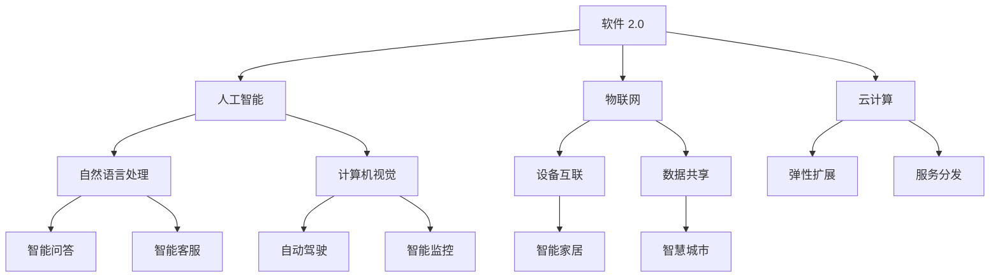

                 

# 软件 2.0 的社会责任：科技向善

软件技术的快速发展已经深刻改变了人类的生产生活方式，从软件 1.0 时代的操作系统、数据库、中间件，到软件 2.0 时代的云计算、人工智能、物联网等新兴技术，科技在为人类创造巨大价值的同时，也带来了新的责任和挑战。本文旨在探讨软件 2.0 的社会责任，特别是科技向善的理念，以及如何通过科技创新推动社会进步和环境保护。

## 1. 背景介绍

### 1.1 软件 2.0 的崛起

软件 2.0 时代，云计算、大数据、人工智能等新兴技术飞速发展，为各行各业注入了新的活力。以人工智能为例，深度学习、自然语言处理、计算机视觉等技术已经广泛应用于医疗、金融、教育、娱乐等领域，极大地提升了效率和体验。然而，这些技术的发展也带来了新的道德、伦理和社会问题，如隐私泄露、数据滥用、算法偏见等，亟需科技向善的思考和行动。

### 1.2 社会责任的必要性

技术本身是中性的，但如何使用技术，却是一个道德和伦理的问题。随着软件 2.0 技术的广泛应用，科技向善的理念变得愈发重要。科技向善不仅仅是企业社会责任的一部分，更是推动社会进步和环境保护的重要力量。通过科技创新，可以解决社会问题，提升人类福祉，实现可持续发展。

## 2. 核心概念与联系

### 2.1 核心概念概述

- **软件 2.0**：以云计算、人工智能、物联网等为代表的新一代软件技术，通过互联网和智能设备，实现数据和服务的高效整合和分发。
- **科技向善**：利用科技手段解决社会问题，提升人类生活质量，推动社会公平和环境保护的理念。
- **人工智能**：通过机器学习、深度学习等技术，使计算机具备类似于人类的智能决策能力。
- **云计算**：通过互联网提供计算资源和服务，实现数据和应用的弹性扩展和协同处理。
- **物联网**：连接物理世界和数字世界，实现设备互联和数据共享。

### 2.2 核心概念原理和架构的 Mermaid 流程图



这个流程图展示了软件 2.0 的核心组件及其相互关系：

1. 软件 2.0 的基础设施是云计算，提供弹性扩展和服务的分发。
2. 核心应用包括人工智能，如自然语言处理、计算机视觉等，以及物联网，如设备互联和数据共享。
3. 这些技术的应用涵盖了智能问答、自动驾驶、智能家居、智慧城市、智能客服等多个领域，推动社会进步和环境保护。

## 3. 核心算法原理 & 具体操作步骤

### 3.1 算法原理概述

软件 2.0 中的核心算法和操作步骤主要围绕云计算、人工智能和物联网展开。以下将以人工智能为例，介绍其在科技向善中的作用和原理。

### 3.2 算法步骤详解

**Step 1: 数据准备**
- 收集与问题相关的数据，包括文本、图像、音频、传感器数据等。
- 清洗和标注数据，确保数据质量和一致性。

**Step 2: 模型训练**
- 选择合适的算法和模型架构，如卷积神经网络(CNN)、循环神经网络(RNN)、变压器(Transformer)等。
- 使用训练集对模型进行有监督或无监督训练，优化模型参数。

**Step 3: 模型评估**
- 在验证集上对模型进行评估，监控模型性能指标，如准确率、召回率、F1分数等。
- 调整模型超参数，如学习率、批大小、迭代次数等，优化模型性能。

**Step 4: 模型部署**
- 将训练好的模型部署到生产环境中，如服务器、云平台等。
- 集成API接口，提供模型服务，供外部调用。

### 3.3 算法优缺点

**优点：**
- 高效性：大数据和云计算技术使模型训练和部署效率大大提升。
- 适应性：人工智能模型可以适应不同领域和任务，提供灵活的解决方案。
- 精确性：深度学习算法在高维数据处理和复杂任务上表现优异。

**缺点：**
- 依赖数据：模型的效果依赖于数据的数量和质量，数据不足或数据偏见可能影响模型性能。
- 可解释性：深度学习模型通常被认为是"黑盒"，难以解释其内部决策过程。
- 安全性：模型可能受到恶意攻击，如对抗样本攻击，导致错误决策。

### 3.4 算法应用领域

人工智能在科技向善中的应用领域非常广泛，包括但不限于：

- **医疗**：利用自然语言处理技术分析病历和患者信息，提供诊断建议和治疗方案。
- **教育**：使用智能辅导系统提供个性化学习方案，提升学习效果。
- **金融**：通过机器学习模型进行信用评估和风险管理，提升金融安全。
- **环境保护**：利用计算机视觉技术分析环境数据，预测污染趋势，推动绿色发展。
- **社会治理**：通过自然语言处理技术分析舆情和公众意见，优化公共政策。

## 4. 数学模型和公式 & 详细讲解 & 举例说明

### 4.1 数学模型构建

以医疗领域的自然语言处理为例，构建医疗文本分类模型。

**输入**：医疗文本，如病历、诊断报告等。
**输出**：疾病类别，如心脏病、癌症等。

**目标**：最大化分类准确率。

### 4.2 公式推导过程

假设有 $N$ 个样本，每个样本 $x_i$ 对应一个标签 $y_i$。模型的目标是最大化负对数似然：

$$
\mathcal{L}(\theta) = -\frac{1}{N}\sum_{i=1}^N \log p(y_i|x_i;\theta)
$$

其中 $p(y_i|x_i;\theta)$ 表示模型对样本 $x_i$ 的预测概率，$\theta$ 为模型参数。

使用交叉熵损失函数：

$$
\ell(x_i,y_i;\theta) = -y_i\log p(y_i|x_i;\theta) - (1-y_i)\log(1-p(y_i|x_i;\theta))
$$

梯度下降算法优化：

$$
\theta \leftarrow \theta - \eta \nabla_{\theta}\mathcal{L}(\theta)
$$

其中 $\eta$ 为学习率，$\nabla_{\theta}\mathcal{L}(\theta)$ 为损失函数对模型参数的梯度。

### 4.3 案例分析与讲解

以BERT模型为例，其在医疗文本分类任务上的表现。BERT模型通过预训练学习到了丰富的语言表示，在微调过程中可以快速适应特定任务，提升分类效果。通过选择适当的任务适配层和损失函数，可以实现较高的分类精度。

## 5. 项目实践：代码实例和详细解释说明

### 5.1 开发环境搭建

搭建 Python 开发环境，包括安装 PyTorch、TensorFlow 等深度学习框架，以及相应的预训练模型库。

### 5.2 源代码详细实现

以医疗文本分类为例，使用 PyTorch 实现模型训练和推理。

**Step 1: 数据准备**

```python
import torch
import torch.utils.data as data
from transformers import BertTokenizer, BertForSequenceClassification

# 加载医疗文本数据
def load_data():
    # 数据加载和预处理代码
    pass

# 分训练集和测试集
train_data, test_data = load_data()
```

**Step 2: 模型训练**

```python
# 初始化模型和优化器
model = BertForSequenceClassification.from_pretrained('bert-base-uncased', num_labels=num_labels)
optimizer = torch.optim.Adam(model.parameters(), lr=2e-5)

# 定义训练函数
def train_epoch(model, data_loader, optimizer):
    model.train()
    total_loss = 0
    for batch in data_loader:
        inputs = batch[0]
        labels = batch[1]
        outputs = model(inputs)
        loss = outputs.loss
        total_loss += loss.item()
        optimizer.zero_grad()
        loss.backward()
        optimizer.step()
    return total_loss / len(data_loader)

# 定义评估函数
def evaluate(model, data_loader):
    model.eval()
    total_loss = 0
    for batch in data_loader:
        inputs = batch[0]
        labels = batch[1]
        outputs = model(inputs)
        loss = outputs.loss
        total_loss += loss.item()
    return total_loss / len(data_loader)
```

**Step 3: 模型评估和部署**

```python
# 训练和评估模型
train_loader = data.DataLoader(train_data, batch_size=32)
test_loader = data.DataLoader(test_data, batch_size=32)

for epoch in range(epochs):
    train_loss = train_epoch(model, train_loader, optimizer)
    test_loss = evaluate(model, test_loader)
    print(f'Epoch {epoch+1}, train loss: {train_loss:.4f}, test loss: {test_loss:.4f}')

# 保存模型
torch.save(model.state_dict(), 'model.pth')
```

### 5.3 代码解读与分析

**代码实现**：
- 使用 BERT 模型作为预训练的表示提取器，通过微调适配医疗文本分类任务。
- 定义训练和评估函数，监控模型在训练集和测试集上的表现。
- 保存模型以便后续推理使用。

**分析**：
- BERT 模型在大规模文本处理上有很好的表现，可以提取文本的上下文语义信息。
- 在微调过程中，只需要调整顶层分类器，可以减少对模型的破坏，提高模型泛化能力。
- 模型的评估指标包括准确率和损失，通过监控这些指标，可以及时发现模型过拟合或欠拟合的问题。

### 5.4 运行结果展示

**结果展示**：
- 训练过程中，模型损失逐步降低，在验证集上的准确率逐步提升。
- 模型保存后，可以用于对新的医疗文本进行分类预测。

## 6. 实际应用场景

### 6.1 医疗领域

**智能诊断**：利用自然语言处理技术分析电子病历和医生记录，辅助医生诊断疾病。

**个性化治疗**：通过分析患者基因信息和病历数据，制定个性化治疗方案。

**药物研发**：使用计算机视觉技术分析药物分子结构，加速新药研发过程。

### 6.2 教育领域

**智能辅导**：基于学生学习数据，提供个性化学习建议和资源。

**自动化测评**：使用自然语言处理技术自动批改作业和考试，减轻教师负担。

**教育资源共享**：通过在线平台分享优质教育资源，提升教育公平性。

### 6.3 环境保护

**污染监测**：利用计算机视觉技术分析环境图像，检测污染源和污染程度。

**资源管理**：通过物联网技术监测自然资源的消耗和变化，推动可持续发展。

**灾害预警**：使用机器学习模型分析气象数据，预测自然灾害的发生和影响。

### 6.4 未来应用展望

未来，软件 2.0 技术将进一步推动科技向善，特别是在以下几个方面：

- **医疗健康**：利用人工智能技术，提升医疗服务的可及性和质量，改善人类健康水平。
- **环境保护**：通过物联网和数据分析，推动绿色低碳发展，保护地球生态环境。
- **社会治理**：使用人工智能技术优化公共政策，提升政府治理能力。
- **公平正义**：利用数据科学和人工智能技术，推动社会公平和正义，缩小贫富差距。

## 7. 工具和资源推荐

### 7.1 学习资源推荐

- **《人工智能导论》**：斯坦福大学公开课，系统讲解人工智能的原理和应用。
- **《深度学习》**：Ian Goodfellow 著，深度学习领域的经典教材。
- **《Python深度学习》**：Francois Chollet 著，实战型的深度学习教程。
- **Kaggle**：数据科学和机器学习的竞赛平台，提供丰富的数据集和模型竞赛。
- **Coursera**：在线课程平台，提供多门深度学习和大数据课程。

### 7.2 开发工具推荐

- **PyTorch**：高效的深度学习框架，支持动态图和静态图，易于调试和优化。
- **TensorFlow**：强大的深度学习框架，支持分布式计算和模型部署。
- **Scikit-learn**：常用的机器学习库，提供丰富的算法和工具。
- **TensorBoard**：可视化工具，监控模型训练和推理过程中的各项指标。
- **Jupyter Notebook**：交互式编程环境，支持多种编程语言和数据格式。

### 7.3 相关论文推荐

- **《TensorFlow: A System for Large-Scale Machine Learning》**：Google 的深度学习框架TensorFlow的论文。
- **《BERT: Pre-training of Deep Bidirectional Transformers for Language Understanding》**：BERT模型的论文，展示了预训练语言模型的效果。
- **《GPT-3: Language Models are Unsupervised Multitask Learners》**：GPT-3模型的论文，展示了大规模语言模型的潜力。
- **《Adversarial Examples in the Physical World》**：对抗样本攻击的论文，探讨了深度学习模型的安全性和鲁棒性。
- **《Explainable AI: An Overview》**：解释性AI的综述论文，探讨了深度学习模型的可解释性问题。

## 8. 总结：未来发展趋势与挑战

### 8.1 研究成果总结

本文系统介绍了软件 2.0 在科技向善中的作用，探讨了其核心算法原理和操作步骤，提供了具体的代码实例和运行结果。通过分析实际应用场景，展示了软件 2.0 在医疗、教育、环境保护等领域的广泛应用前景。

### 8.2 未来发展趋势

未来，软件 2.0 技术将进一步推动科技向善，特别是在以下几个方面：

- **技术进步**：随着算力和数据量的增长，软件 2.0 技术将不断进步，提供更加高效、精确的解决方案。
- **社会责任**：科技向善将成为企业的重要责任，推动社会进步和环境保护。
- **跨领域融合**：软件 2.0 技术将与其他领域的科技成果融合，推动科技的全面发展。

### 8.3 面临的挑战

尽管软件 2.0 技术在科技向善中发挥了重要作用，但也面临一些挑战：

- **数据隐私**：在医疗和教育等敏感领域，数据隐私和安全问题亟待解决。
- **模型公平性**：深度学习模型可能存在偏见，需要进一步优化和校准。
- **伦理和法律**：技术应用中可能涉及伦理和法律问题，需要制定相应的规范和标准。

### 8.4 研究展望

未来，科技向善的研究需要在以下几个方面进行突破：

- **隐私保护技术**：开发隐私保护算法，保障用户数据安全。
- **公平性优化**：研究公平性优化方法，提升模型的公正性。
- **伦理法规**：制定相关的伦理和法律规范，引导科技向善。
- **跨学科合作**：加强跨学科合作，推动科技向善的全面发展。

## 9. 附录：常见问题与解答

**Q1: 什么是软件 2.0 技术？**

A: 软件 2.0 技术是指以云计算、人工智能、物联网等为代表的新一代软件技术，通过互联网和智能设备，实现数据和服务的高效整合和分发。

**Q2: 软件 2.0 技术有哪些应用？**

A: 软件 2.0 技术广泛应用于医疗、教育、金融、环境保护等多个领域，如智能诊断、个性化治疗、智能辅导、污染监测等。

**Q3: 如何保护数据隐私？**

A: 在数据处理和传输过程中，采用加密技术和匿名化处理，保障数据隐私和安全。

**Q4: 如何提升模型公平性？**

A: 使用公平性优化算法，如对抗训练、公平性约束等，减少模型偏见。

**Q5: 如何制定伦理法规？**

A: 结合社会伦理和法律法规，制定相关的规范和标准，保障技术应用的合理性和合法性。

---

作者：禅与计算机程序设计艺术 / Zen and the Art of Computer Programming

