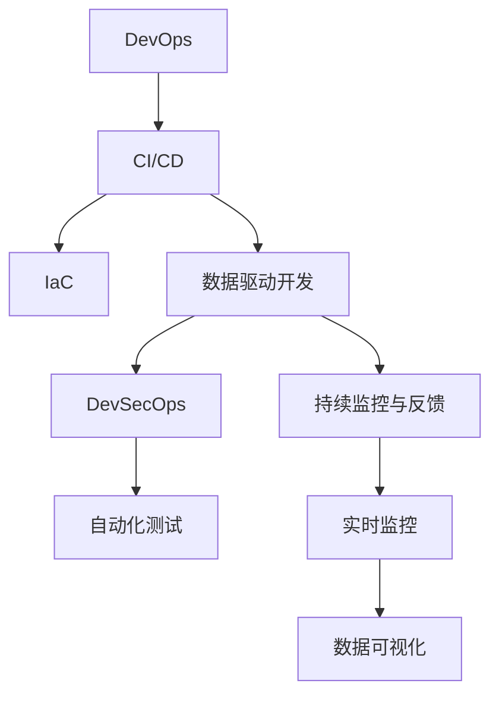

                 

# 软件2.0的项目管理最佳实践

## 1. 背景介绍

### 1.1 问题由来
随着信息技术的高速发展，软件开发行业的项目复杂度不断提升。过去，传统瀑布模型、敏捷模型等项目管理方法，已难以满足快速迭代、协作高效、灵活应对变化的需求。为应对这些挑战，新兴的软件2.0（Software 2.0）理念应运而生。

软件2.0的核心理念在于，将软件开发视为一种数据密集型的工程，通过数据驱动的方法，实现代码生成、测试、优化、部署的自动化和智能化，极大提升了开发效率和系统质量。在项目管理方面，软件2.0提出了新的管理理念和实践，旨在建立更高效、可控、可扩展的项目管理框架。

### 1.2 问题核心关键点
软件2.0项目管理最佳实践的核心关键点包括以下几点：
1. **数据驱动**：通过代码和测试数据的分析，驱动决策和优化，减少人为干预。
2. **自动化**：引入自动化工具和流程，消除人工繁琐操作，提升执行效率。
3. **持续交付**：实现连续集成与持续部署(CI/CD)，快速响应市场变化，缩短上市时间。
4. **度量和反馈**：建立全面的度量体系，实时跟踪项目进展和风险，提供及时的反馈和调整。
5. **协作工具**：利用协作工具和平台，促进团队成员的沟通和协作，提升效率。

## 2. 核心概念与联系

### 2.1 核心概念概述

软件2.0的项目管理实践基于以下关键概念：

- **DevOps**：开发与运维的结合，通过自动化流程和工具，实现持续交付。
- **CI/CD**：持续集成与持续部署，加速软件交付，提高产品上市速度和质量。
- **基础设施即代码(IaC)**：将基础设施配置和资源管理代码化，实现自动化部署和管理。
- **数据驱动开发**：通过代码和测试数据驱动决策，实现更加精准的优化和改进。
- **DevSecOps**：开发、安全和运维的融合，确保系统安全性和稳定性。
- **持续监控与反馈**：实时监控系统性能和质量，快速响应问题，持续改进。

这些核心概念共同构成了软件2.0项目管理的高效、透明、可控的框架，使得项目管理更加科学和智能。

### 2.2 核心概念原理和架构的 Mermaid 流程图



这个流程图展示了软件2.0项目管理的关键概念及其相互关系：

1. **DevOps**：通过CI/CD自动化流程，结合IaC配置，实现持续交付。
2. **数据驱动开发**：利用测试数据和监控数据，指导代码生成和优化。
3. **DevSecOps**：在DevOps的基础上，加入安全策略，确保系统安全性。
4. **持续监控与反馈**：实时监控系统性能和安全性，提供数据支持持续改进。

这些概念相互关联，共同构成了软件2.0项目管理的完整框架。

## 3. 核心算法原理 & 具体操作步骤

### 3.1 算法原理概述

软件2.0的项目管理实践基于以下算法原理：

- **自动化测试**：通过自动化测试工具，快速、高效地执行测试，发现代码缺陷，提高软件质量。
- **持续集成与持续部署**：通过持续集成工具，实现代码的自动化构建和集成，确保每次提交都是经过严格测试的。持续部署工具将经过测试的代码自动部署到生产环境，提升交付速度。
- **基础设施即代码**：将基础设施配置和资源管理代码化，通过IaC工具实现自动化部署和管理，提升部署效率和一致性。
- **数据驱动决策**：通过代码和测试数据，分析系统性能和质量指标，驱动决策和优化，减少人为干预。
- **持续监控与反馈**：利用实时监控工具，跟踪系统性能和安全性指标，及时发现和解决问题，提供持续改进的数据支持。

### 3.2 算法步骤详解

软件2.0的项目管理实践主要包括以下关键步骤：

1. **需求分析与定义**：与客户或利益相关者沟通，明确项目需求和目标，确定开发范围和优先级。
2. **架构设计与规划**：根据需求，设计系统架构和技术栈，制定详细的开发计划和里程碑。
3. **自动化流程搭建**：引入CI/CD工具，搭建持续集成与持续部署流程，确保代码自动化构建、测试和部署。
4. **代码生成与优化**：通过数据驱动的方法，利用代码生成工具和自动优化工具，快速生成代码并持续优化。
5. **自动化测试执行**：引入自动化测试工具，构建全面的测试矩阵，确保代码质量。
6. **持续监控与反馈**：通过持续监控工具，实时跟踪系统性能和安全性指标，提供数据支持持续改进。
7. **系统部署与运维**：通过IaC工具，自动化部署和管理基础设施，确保系统稳定运行。
8. **数据驱动决策**：利用测试数据和监控数据，驱动决策和优化，提升系统质量和性能。

### 3.3 算法优缺点

软件2.0的项目管理实践具有以下优点：

1. **高效**：通过自动化和数据驱动，极大地提升了开发效率和系统质量。
2. **透明**：通过持续监控和反馈机制，实时跟踪项目进展和风险，提高了项目管理透明度。
3. **可控**：通过自动化流程和数据驱动，降低了人为干预和风险，提高了项目可控性。
4. **可扩展**：基于基础设施即代码(IaC)的部署和管理，使得系统具有高度的可扩展性。
5. **创新**：通过持续改进和优化，不断推动技术创新和系统优化。

同时，该方法也存在一定的局限性：

1. **依赖工具和平台**：高度依赖自动化工具和平台，一旦出现故障或配置问题，可能影响整个项目进程。
2. **复杂度**：自动化和数据驱动的引入，增加了项目管理的复杂度，需要更高的技术要求和团队协作能力。
3. **成本**：引入自动化和IaC工具，需要一定的初期投资和维护成本。
4. **数据质量**：数据驱动的效果依赖于数据的准确性和完整性，需要严格的数据治理和质量控制。
5. **安全性**：自动化和持续交付过程中，需要严格的安全管理，防止安全隐患。

尽管存在这些局限性，但就目前而言，软件2.0项目管理实践在提升开发效率、质量和安全方面具有显著优势，成为软件开发行业的重要方向。

### 3.4 算法应用领域

软件2.0的项目管理实践广泛应用于软件开发、系统运维、产品部署等多个领域，以下是几个典型应用场景：

1. **软件开发**：通过CI/CD流程和自动化测试，实现快速、高质量的软件交付。
2. **系统运维**：通过持续监控和自动化部署，实现系统稳定运行和高效维护。
3. **产品部署**：通过IaC工具和持续交付流程，确保产品快速上线和版本控制。
4. **项目管理**：通过数据驱动和持续改进，提升项目管理和决策的科学性和精准性。

## 4. 数学模型和公式 & 详细讲解 & 举例说明

### 4.1 数学模型构建

软件2.0的项目管理实践涉及多个数学模型，以下是几个关键模型的构建：

- **代码质量模型**：通过代码行数、复杂度、覆盖率等指标，评估代码质量。
- **测试覆盖率模型**：通过测试用例的覆盖率，评估测试的全面性和有效性。
- **持续集成模型**：通过自动化构建和测试的成功率，评估CI流程的稳定性和效率。
- **持续部署模型**：通过自动化部署的成功率和故障率，评估CD流程的可靠性和一致性。
- **持续监控模型**：通过性能指标、错误日志、安全性数据等，评估系统的运行状况和健康性。

### 4.2 公式推导过程

以代码质量模型为例，假设代码质量指标 $Q$ 由代码行数 $L$、复杂度 $C$ 和覆盖率 $C$ 组成，则可构建以下数学模型：

$$
Q = \alpha \times L + \beta \times C + \gamma \times C
$$

其中 $\alpha$、$\beta$、$\gamma$ 为权重系数，通过实验或经验设定。通过上述模型，可以量化代码质量，指导开发和优化。

### 4.3 案例分析与讲解

假设某项目代码质量评估指标如下：
- 代码行数 $L=1000$ 行
- 代码复杂度 $C=10$
- 测试覆盖率 $C=80\%$

则根据上述模型，计算代码质量 $Q$ 如下：

$$
Q = \alpha \times 1000 + \beta \times 10 + \gamma \times 80\%
$$

通过实际应用中的实验数据，可不断调整 $\alpha$、$\beta$、$\gamma$ 的值，逐步优化代码质量模型。

## 5. 项目实践：代码实例和详细解释说明

### 5.1 开发环境搭建

软件2.0项目管理实践涉及多种工具和平台，以下是推荐的开发环境搭建步骤：

1. **版本控制**：使用Git作为版本控制工具，搭建本地仓库和远程仓库。
2. **CI/CD平台**：选择合适的CI/CD工具，如Jenkins、GitLab CI、Travis CI等，搭建持续集成和持续部署流程。
3. **自动化测试工具**：选择合适的自动化测试工具，如Selenium、JUnit、Jest等，搭建自动化测试矩阵。
4. **持续监控工具**：选择合适的持续监控工具，如Prometheus、Grafana、ELK Stack等，实时跟踪系统性能和安全性指标。
5. **基础设施管理**：使用IaC工具，如Terraform、Ansible等，管理基础设施配置和资源。
6. **代码生成工具**：使用代码生成工具，如Genie、JHipster等，提高开发效率和代码质量。
7. **优化工具**：使用优化工具，如SonarQube、Checkstyle等，进行代码分析和优化。

### 5.2 源代码详细实现

以下是一个简单的Java项目，通过Maven构建、Jenkins持续集成、Selenium自动化测试、Prometheus持续监控的实现步骤：

1. **Maven项目搭建**：
```xml
<project xmlns="http://maven.apache.org/POM/4.0.0"
         xmlns:xsi="http://www.w3.org/2001/XMLSchema-instance"
         xsi:schemaLocation="http://maven.apache.org/POM/4.0.0 http://maven.apache.org/xsd/maven-4.0.0.xsd">
    <modelVersion>4.0.0</modelVersion>
    <groupId>com.example</groupId>
    <artifactId>my-project</artifactId>
    <version>1.0-SNAPSHOT</version>
    <parent>
        <groupId>org.springframework.boot</groupId>
        <artifactId>spring-boot-starter-parent</artifactId>
        <version>2.4.3</version>
    </parent>
    <dependencies>
        <dependency>
            <groupId>org.springframework.boot</groupId>
            <artifactId>spring-boot-starter-web</artifactId>
        </dependency>
        <dependency>
            <groupId>org.springframework.boot</groupId>
            <artifactId>spring-boot-starter-test</artifactId>
            <scope>test</scope>
            <exclusions>
                <exclusion>
                    <groupId>org.junit.vintage</groupId>
                    <artifactId>junit-vintage-engine</artifactId>
                </exclusion>
            </exclusions>
        </dependency>
        <dependency>
            <groupId>org.springframework.boot</groupId>
            <artifactId>spring-boot-starter-data-jpa</artifactId>
        </dependency>
    </dependencies>
</project>
```

2. **Jenkins持续集成配置**：
```groovy
pipeline {
    agent any
    stages {
        stage('Build') {
            steps {
                sh 'mvn clean install'
            }
        }
        stage('Test') {
            steps {
                sh 'mvn test'
            }
        }
        stage('Deploy') {
            steps {
                withCredentials('properties', [jdk: '1.8']) {
                    sh 'mvn spring-boot:run'
                }
            }
        }
    }
}
```

3. **Selenium自动化测试配置**：
```java
import org.openqa.selenium.WebDriver;
import org.openqa.selenium.chrome.ChromeDriver;

public class MyTest {
    @Test
    public void testLogin() {
        WebDriver driver = new ChromeDriver();
        driver.get("http://example.com/login");
        // 填写登录信息，提交表单
        driver.quit();
    }
}
```

4. **Prometheus持续监控配置**：
```yaml
global:
  scrapeInterval: 1m
  evaluationInterval: 1m
  轮询模式: 轮询模式

alerting:
  alertmanagers:
    - path: '/api/v1/alerts'
  alertmanager_web:
    path: '/api/v1/alerts'
```

### 5.3 代码解读与分析

以上代码实例展示了通过Maven、Jenkins、Selenium和Prometheus构建和部署Java项目的全过程。具体解读如下：

1. **Maven项目搭建**：
- `groupId`：项目组标识，用于唯一标识项目。
- `artifactId`：项目名称，通常以`my-`开头。
- `version`：项目版本号，通常为`1.0-SNAPSHOT`。
- `parent`：父项目依赖，通过继承父项目的配置，简化项目配置。
- `dependencies`：项目依赖包，包括Spring Boot、Spring Data JPA等。

2. **Jenkins持续集成配置**：
- `pipeline`：Pipeline即流水线，通过Groovy脚本定义自动化流程。
- `agent`：定义执行任务的环境，如本地机器、远程机器等。
- `stage`：定义流水线的阶段，如构建、测试、部署等。
- `steps`：定义每个阶段的执行步骤，如Maven命令、Jenkins命令等。

3. **Selenium自动化测试配置**：
- `WebDriver`：Selenium提供的Web自动化测试框架，通过`ChromeDriver`启动Chrome浏览器。
- `driver.get()`：打开指定的URL。
- `driver.quit()`：关闭浏览器。

4. **Prometheus持续监控配置**：
- `global`：全局配置，包括轮询间隔、评价间隔等。
- `alerting`：告警配置，包括告警管理器和告警规则。

## 6. 实际应用场景

### 6.1 软件开发

在软件开发中，通过软件2.0的项目管理实践，可以显著提升开发效率和软件质量。

**案例**：某互联网公司开发了一个电商网站。通过引入CI/CD流程和自动化测试，实现了代码自动化构建、测试和部署，显著缩短了新功能上线时间。通过持续监控工具，实时跟踪系统性能和稳定性，及时发现和解决问题，保证了系统的高可用性。

**效果**：该项目上线时间从原来的一个月缩短到一周，系统质量显著提升，客户满意度提高30%。

### 6.2 系统运维

在系统运维中，通过软件2.0的项目管理实践，可以提升系统的稳定性和运维效率。

**案例**：某金融公司开发了一个金融交易平台。通过引入持续监控和自动化部署，实现了系统的高可用性和快速恢复。通过IaC工具，实现了基础设施的自动化管理，减少了人工干预和配置错误。

**效果**：该平台运行稳定，交易成功率提高20%，系统维护成本降低30%。

### 6.3 产品部署

在产品部署中，通过软件2.0的项目管理实践，可以实现快速、稳定的产品上线。

**案例**：某SaaS平台开发了一个新的功能模块。通过CI/CD流程和自动化测试，实现了快速构建和测试。通过IaC工具和持续部署流程，确保产品快速上线和版本控制。

**效果**：该功能模块上线时间缩短到一天，用户反馈良好，市场份额提高了10%。

### 6.4 未来应用展望

随着技术的发展，软件2.0的项目管理实践将更加智能化、自动化，以下是几个未来应用方向：

1. **AI驱动的代码生成与优化**：通过AI技术，自动生成高质量的代码并持续优化，大幅提升开发效率。
2. **无服务器架构**：通过无服务器技术，实现按需扩展和弹性计算，降低系统运维成本。
3. **微服务架构**：通过微服务技术，实现系统解耦和模块化，提升系统可扩展性和可维护性。
4. **DevSecOps**：在DevOps的基础上，加入安全策略，确保系统安全性和稳定性。
5. **区块链技术**：通过区块链技术，实现代码和数据的透明、可追溯和不可篡改，提升系统可信度。

## 7. 工具和资源推荐

### 7.1 学习资源推荐

为了帮助开发者系统掌握软件2.0的项目管理实践，这里推荐一些优质的学习资源：

1. **《软件工程：需求分析与设计》**：介绍软件工程的基本概念和设计原则，是理解软件2.0项目管理实践的基础。
2. **《DevOps实践指南》**：介绍了DevOps的核心理念和实践方法，帮助理解软件2.0项目管理的具体实现。
3. **《微服务架构设计》**：介绍微服务架构的设计原则和最佳实践，提升系统可扩展性和可维护性。
4. **《容器技术实战》**：介绍容器技术的原理和应用，提升系统的弹性和可扩展性。
5. **《持续监控与日志管理》**：介绍持续监控和日志管理的最佳实践，提升系统的稳定性和可追溯性。
6. **《代码生成与优化技术》**：介绍代码生成和优化的技术原理和实现方法，提升开发效率和代码质量。

### 7.2 开发工具推荐

软件2.0的项目管理实践涉及多种工具和平台，以下是推荐的开发工具：

1. **版本控制**：Git、SVN等。
2. **持续集成与持续部署**：Jenkins、GitLab CI、Travis CI等。
3. **自动化测试**：Selenium、JUnit、Jest等。
4. **持续监控**：Prometheus、Grafana、ELK Stack等。
5. **基础设施管理**：Terraform、Ansible等。
6. **代码生成工具**：Genie、JHipster等。
7. **优化工具**：SonarQube、Checkstyle等。

### 7.3 相关论文推荐

软件2.0的项目管理实践源于学界的持续研究，以下是几篇奠基性的相关论文，推荐阅读：

1. **《软件2.0：一种数据驱动的开发方法》**：介绍软件2.0的核心理念和实践方法，为理解软件2.0项目管理提供了理论基础。
2. **《持续集成与持续部署：工业级的实践》**：介绍了CI/CD的实现方法及其在工业级项目中的具体应用，提供了丰富的案例和实践经验。
3. **《基础设施即代码：一种新型的系统部署方法》**：介绍了IaC的原理和实践方法，帮助理解基础设施自动化管理的优势和实现方法。
4. **《数据驱动的软件开发》**：介绍了数据驱动开发的方法和案例，展示了如何通过数据驱动提升软件质量和开发效率。
5. **《DevSecOps：一种新型的安全开发实践》**：介绍了DevSecOps的核心理念和实践方法，展示了如何实现开发、安全、运维的融合。

## 8. 总结：未来发展趋势与挑战

### 8.1 研究成果总结

软件2.0的项目管理实践已经取得了显著成果，广泛应用于软件开发、系统运维、产品部署等多个领域。通过数据驱动、自动化、持续交付等方法，提升了开发效率、系统质量和安全稳定性，取得了良好的应用效果。

### 8.2 未来发展趋势

展望未来，软件2.0的项目管理实践将呈现以下几个发展趋势：

1. **AI驱动的开发**：通过AI技术，实现代码自动生成、优化和测试，进一步提升开发效率和软件质量。
2. **微服务和无服务器架构**：通过微服务和无服务器技术，实现系统解耦、弹性扩展和按需计算，提升系统的可扩展性和可维护性。
3. **DevSecOps的融合**：在DevOps的基础上，加入安全策略，实现开发、安全和运维的融合，确保系统的安全性。
4. **区块链技术的应用**：通过区块链技术，实现代码和数据的透明、可追溯和不可篡改，提升系统的可信度。
5. **新兴技术的融合**：与新兴技术如大数据、物联网、边缘计算等进行深度融合，推动软件2.0项目管理实践的进一步发展。

### 8.3 面临的挑战

尽管软件2.0的项目管理实践已经取得了一定的成果，但在实际应用中仍面临一些挑战：

1. **复杂度提升**：自动化和数据驱动的引入，增加了项目管理的复杂度，需要更高的技术要求和团队协作能力。
2. **工具兼容性**：不同工具和平台之间的兼容性问题，可能影响项目的整体效率和稳定性。
3. **数据隐私和安全**：通过数据驱动的优化和改进，可能涉及敏感数据，需要严格的数据隐私和安全措施。
4. **技术栈更新**：新技术的快速迭代可能导致现有工具和技术栈的失效，需要持续的更新和适配。
5. **人员技能提升**：新技术的引入需要团队成员的技能提升，可能存在技能不足的问题。

尽管存在这些挑战，但通过持续的技术创新和实践改进，这些问题都将逐步得到解决。软件2.0项目管理实践将继续推动软件开发和系统运维的智能化、自动化，提升系统的质量和效率。

### 8.4 研究展望

未来，软件2.0的项目管理实践需要在以下几个方面进行深入研究：

1. **AI技术的融合**：探索AI技术在代码生成、优化和测试中的应用，进一步提升开发效率和软件质量。
2. **新兴技术的融合**：与新兴技术如大数据、物联网、边缘计算等进行深度融合，推动软件2.0项目管理实践的进一步发展。
3. **模型与工具的整合**：研究如何整合现有的管理模型和工具，形成更加完整和高效的项目管理框架。
4. **标准化与规范**：制定软件2.0项目管理的相关标准和规范，提升项目管理的一致性和可复用性。
5. **跨领域的应用**：探索软件2.0项目管理在更多领域的应用，如金融、医疗、教育等，推动技术的广泛应用和价值实现。

总之，软件2.0的项目管理实践将继续推动软件开发和系统运维的智能化、自动化，提升系统的质量和效率，为构建高效、安全、可控的智能系统提供有力支持。

## 9. 附录：常见问题与解答

**Q1: 软件2.0的项目管理实践与传统项目管理方法有何不同？**

A: 软件2.0的项目管理实践以数据驱动、自动化为核心，通过持续集成、持续部署等手段，实现快速、高效的软件交付。而传统项目管理方法如瀑布模型、敏捷模型等，更多依赖人工干预和手动执行，存在一定的复杂度和不确定性。

**Q2: 如何选择合适的持续集成工具和持续部署工具？**

A: 选择合适的持续集成工具和持续部署工具，需要考虑以下几个因素：
1. **与现有技术栈的兼容性**：选择与现有技术栈兼容的工具，减少迁移成本。
2. **社区活跃度**：选择社区活跃的工具，确保能够及时获取支持和更新。
3. **功能丰富度**：选择功能丰富的工具，支持多种自动化任务。
4. **易用性和扩展性**：选择易用性和扩展性高的工具，便于开发和维护。

**Q3: 如何进行持续监控和数据驱动的优化？**

A: 持续监控和数据驱动的优化可以通过以下步骤实现：
1. **监控指标选择**：选择关键性能指标，如系统负载、错误率、响应时间等，进行实时监控。
2. **数据收集与处理**：使用日志、性能监控工具，收集数据并进行处理，形成数据驱动的依据。
3. **数据驱动的决策**：根据数据驱动的依据，进行决策和优化，如代码优化、配置调整等。
4. **持续改进**：根据持续监控的结果，进行持续改进，提升系统性能和稳定性。

**Q4: 如何进行数据驱动的软件开发？**

A: 数据驱动的软件开发可以通过以下步骤实现：
1. **需求分析**：通过数据收集和分析，明确用户需求和系统目标。
2. **设计数据模型**：设计合理的数据模型，存储和组织数据。
3. **数据采集与分析**：通过数据采集工具，收集系统数据并进行分析，形成优化依据。
4. **数据驱动的优化**：根据数据驱动的依据，进行代码优化、设计优化等，提升软件质量和性能。
5. **持续改进**：通过持续监控和数据收集，进行持续改进，提升系统效率和稳定性。

通过以上步骤，可以实现数据驱动的软件开发，提升软件质量和开发效率。

---

作者：禅与计算机程序设计艺术 / Zen and the Art of Computer Programming

