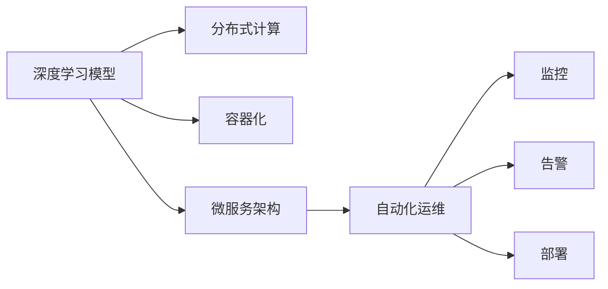

                 

# 软件框架：支持 AI 2.0 应用的开发、部署和运维

> 关键词：软件框架, AI 2.0, 开发, 部署, 运维

## 1. 背景介绍

### 1.1 问题由来
随着人工智能技术的快速发展，特别是AI 2.0时代的到来，人工智能在各行各业中的应用变得越来越广泛和深入。AI 2.0不仅包括传统的机器学习和深度学习，还涵盖了强化学习、自然语言处理（NLP）、计算机视觉（CV）等多个领域。然而，随着模型规模的增大和复杂度的提升，AI 2.0应用的开发、部署和运维变得越来越复杂和困难。如何构建一个高效、灵活、可扩展的软件框架来支持AI 2.0应用的开发、部署和运维，成为了当前研究的热点和挑战之一。

### 1.2 问题核心关键点
为了支持AI 2.0应用的开发、部署和运维，本文将介绍一种通用的软件框架，该框架基于现代软件开发实践，融合了深度学习、分布式计算、容器化、微服务等技术，旨在提供一个全面的、开箱即用的开发、部署和运维解决方案。该框架的核心目标是通过标准化、可配置化和自动化，降低AI 2.0应用开发的复杂度，提高部署和运维的效率和稳定性，支持大规模、高并发的AI应用。

### 1.3 问题研究意义
构建一个支持AI 2.0应用的全面、高效的软件框架，对于推动AI技术在各行各业中的应用具有重要意义：

1. **降低开发成本**：标准化和自动化可以显著降低AI 2.0应用的开发成本，使得更多的团队能够快速上手，快速迭代，快速上线。
2. **提高部署效率**：通过容器化和微服务架构，可以将AI应用快速部署到不同环境，支持弹性伸缩和自适应调优。
3. **保障运维稳定**：通过监控、日志、告警等机制，可以实时监控AI应用的运行状态，及时发现和解决潜在的故障和性能问题。
4. **支持大规模应用**：通过分布式计算和异构资源调度，可以支持大规模、高并发的AI应用，适应不同规模的业务需求。
5. **促进技术创新**：通过开放、灵活的框架设计，可以支持新算法、新模型的快速集成和验证，推动AI技术的不断进步。

## 2. 核心概念与联系

### 2.1 核心概念概述

为了更好地理解本文介绍的软件框架，我们将介绍几个核心概念及其之间的关系：

- **深度学习模型**：基于神经网络等结构的算法，能够处理和学习数据特征，从而实现预测、分类、聚类等任务。
- **分布式计算**：通过将任务分散到多个计算节点上，实现并行计算，提高计算效率和扩展性。
- **容器化**：通过将应用程序打包成容器，实现跨平台、跨环境的可移植性，简化部署和管理。
- **微服务架构**：通过将应用程序分解为多个独立、可替换的服务，实现松耦合、高内聚、高扩展性和高可用性。
- **自动化运维**：通过自动化工具和脚本，实现配置管理、监控、告警、部署等运维操作，减少人工干预，提高效率和稳定性。

这些核心概念之间的关系可以通过以下Mermaid流程图来展示：



这个流程图展示了大语言模型的核心概念及其之间的关系：

1. 深度学习模型通过分布式计算加速训练和推理，通过容器化和微服务架构实现灵活部署，并通过自动化运维保障稳定运行。
2. 容器化和微服务架构使得深度学习模型能够跨平台、跨环境运行，同时提高系统的扩展性和可用性。
3. 监控、告警和部署等自动化运维机制，确保深度学习模型在运行过程中能够被及时监控、调优和更新。

## 3. 核心算法原理 & 具体操作步骤

### 3.1 算法原理概述

为了支持AI 2.0应用的开发、部署和运维，本文介绍的框架基于深度学习模型的计算需求和软件系统的可扩展性，设计了一种模块化、可配置的架构，包括但不限于：

- **模型训练模块**：负责深度学习模型的训练和优化，通过分布式计算加速训练过程。
- **模型推理模块**：负责深度学习模型的推理和预测，通过分布式计算提高推理效率和扩展性。
- **模型部署模块**：负责将训练好的模型部署到不同环境，支持容器化和微服务架构，实现灵活部署。
- **模型运维模块**：负责深度学习模型的监控、告警、日志、部署等运维操作，通过自动化运维保障系统稳定。

### 3.2 算法步骤详解

基于深度学习模型的软件框架的实现步骤如下：

**Step 1: 设计架构**
- 确定架构的层次和模块，如计算层、服务层、运维层等。
- 设计各层之间的接口和通信协议，确保各层之间的协同工作。
- 配置各个模块的参数，如计算资源、网络配置等。

**Step 2: 实现模块**
- 实现计算层，负责深度学习模型的训练和推理。
- 实现服务层，负责模型数据的接收和处理，以及模型的部署和调用。
- 实现运维层，负责模型的监控、告警、日志等运维操作。

**Step 3: 配置和部署**
- 根据实际需求，配置各模块的参数，如分布式计算资源、网络配置等。
- 将各模块打包成容器，部署到不同的环境中，如Kubernetes集群等。
- 启动各模块，进行系统的集成和调试。

**Step 4: 监控和调优**
- 实时监控各模块的运行状态，如计算资源使用情况、网络延迟等。
- 根据监控数据，进行系统的调优和优化，如调整计算资源、优化网络配置等。
- 根据实际情况，进行模型的更新和部署。

### 3.3 算法优缺点

基于深度学习模型的软件框架具有以下优点：

1. **高效灵活**：通过模块化、可配置的架构设计，可以灵活支持不同的深度学习模型和任务。
2. **可扩展性**：通过分布式计算和微服务架构，可以支持大规模、高并发的AI应用，适应不同规模的业务需求。
3. **自动化运维**：通过自动化工具和脚本，实现配置管理、监控、告警、部署等运维操作，减少人工干预，提高效率和稳定性。
4. **高可靠性**：通过监控、告警等机制，及时发现和解决潜在的故障和性能问题，确保系统的稳定运行。
5. **开放性**：通过标准化的接口和协议，支持新算法、新模型的快速集成和验证，推动AI技术的不断进步。

同时，该框架也存在以下缺点：

1. **复杂度较高**：框架设计复杂，需要深入理解深度学习、分布式计算、容器化、微服务等技术。
2. **资源需求高**：深度学习模型对计算资源、内存和存储需求较高，需要提供强大的计算资源支持。
3. **维护难度大**：系统的复杂性和多样性，增加了运维和维护的难度，需要专业的运维团队和工具。

### 3.4 算法应用领域

基于深度学习模型的软件框架适用于各种AI 2.0应用的开发、部署和运维，包括但不限于：

- **自然语言处理（NLP）**：如文本分类、情感分析、机器翻译、智能问答等。
- **计算机视觉（CV）**：如图像识别、目标检测、图像生成等。
- **强化学习（RL）**：如游戏智能、机器人控制、金融交易等。
- **推荐系统**：如商品推荐、内容推荐、个性化广告等。
- **数据分析和预测**：如用户行为分析、市场预测、风险评估等。

这些领域的应用场景中，深度学习模型的计算需求高，系统复杂度大，需要一个高效、灵活、可扩展的软件框架来支持。

## 4. 数学模型和公式 & 详细讲解  
### 4.1 数学模型构建

本节将使用数学语言对基于深度学习模型的软件框架的计算需求进行更加严格的刻画。

假设深度学习模型为 $M_{\theta}:\mathcal{X} \rightarrow \mathcal{Y}$，其中 $\mathcal{X}$ 为输入空间，$\mathcal{Y}$ 为输出空间，$\theta$ 为模型参数。假设系统需要处理的数据集为 $D=\{(x_i,y_i)\}_{i=1}^N$。

定义模型 $M_{\theta}$ 在数据样本 $(x,y)$ 上的损失函数为 $\ell(M_{\theta}(x),y)$，则在数据集 $D$ 上的经验风险为：

$$
\mathcal{L}(\theta) = \frac{1}{N} \sum_{i=1}^N \ell(M_{\theta}(x_i),y_i)
$$

在实践中，我们通常使用基于梯度的优化算法（如SGD、Adam等）来近似求解上述最优化问题。设 $\eta$ 为学习率，$\lambda$ 为正则化系数，则参数的更新公式为：

$$
\theta \leftarrow \theta - \eta \nabla_{\theta}\mathcal{L}(\theta) - \eta\lambda\theta
$$

其中 $\nabla_{\theta}\mathcal{L}(\theta)$ 为损失函数对参数 $\theta$ 的梯度，可通过反向传播算法高效计算。

### 4.2 公式推导过程

以下我们以二分类任务为例，推导交叉熵损失函数及其梯度的计算公式。

假设模型 $M_{\theta}$ 在输入 $x$ 上的输出为 $\hat{y}=M_{\theta}(x) \in [0,1]$，表示样本属于正类的概率。真实标签 $y \in \{0,1\}$。则二分类交叉熵损失函数定义为：

$$
\ell(M_{\theta}(x),y) = -[y\log \hat{y} + (1-y)\log (1-\hat{y})]
$$

将其代入经验风险公式，得：

$$
\mathcal{L}(\theta) = -\frac{1}{N}\sum_{i=1}^N [y_i\log M_{\theta}(x_i)+(1-y_i)\log(1-M_{\theta}(x_i))]
$$

根据链式法则，损失函数对参数 $\theta_k$ 的梯度为：

$$
\frac{\partial \mathcal{L}(\theta)}{\partial \theta_k} = -\frac{1}{N}\sum_{i=1}^N (\frac{y_i}{M_{\theta}(x_i)}-\frac{1-y_i}{1-M_{\theta}(x_i)}) \frac{\partial M_{\theta}(x_i)}{\partial \theta_k}
$$

其中 $\frac{\partial M_{\theta}(x_i)}{\partial \theta_k}$ 可进一步递归展开，利用自动微分技术完成计算。

在得到损失函数的梯度后，即可带入参数更新公式，完成模型的迭代优化。重复上述过程直至收敛，最终得到适应下游任务的最优模型参数 $\theta^*$。

## 5. 项目实践：代码实例和详细解释说明
### 5.1 开发环境搭建

在进行深度学习模型开发前，我们需要准备好开发环境。以下是使用Python进行PyTorch开发的环境配置流程：

1. 安装Anaconda：从官网下载并安装Anaconda，用于创建独立的Python环境。

2. 创建并激活虚拟环境：
```bash
conda create -n pytorch-env python=3.8 
conda activate pytorch-env
```

3. 安装PyTorch：根据CUDA版本，从官网获取对应的安装命令。例如：
```bash
conda install pytorch torchvision torchaudio cudatoolkit=11.1 -c pytorch -c conda-forge
```

4. 安装Transformers库：
```bash
pip install transformers
```

5. 安装各类工具包：
```bash
pip install numpy pandas scikit-learn matplotlib tqdm jupyter notebook ipython
```

完成上述步骤后，即可在`pytorch-env`环境中开始深度学习模型开发。

### 5.2 源代码详细实现

这里我们以自然语言处理（NLP）领域中的文本分类任务为例，给出使用Transformers库对BERT模型进行开发的PyTorch代码实现。

首先，定义文本分类的数据处理函数：

```python
from transformers import BertTokenizer
from torch.utils.data import Dataset
import torch

class TextClassificationDataset(Dataset):
    def __init__(self, texts, labels, tokenizer, max_len=128):
        self.texts = texts
        self.labels = labels
        self.tokenizer = tokenizer
        self.max_len = max_len
        
    def __len__(self):
        return len(self.texts)
    
    def __getitem__(self, item):
        text = self.texts[item]
        label = self.labels[item]
        
        encoding = self.tokenizer(text, return_tensors='pt', max_length=self.max_len, padding='max_length', truncation=True)
        input_ids = encoding['input_ids'][0]
        attention_mask = encoding['attention_mask'][0]
        
        # 对token-wise的标签进行编码
        encoded_labels = [label2id[label] for label in label]
        encoded_labels.extend([label2id['O']] * (self.max_len - len(encoded_labels)))
        labels = torch.tensor(encoded_labels, dtype=torch.long)
        
        return {'input_ids': input_ids, 
                'attention_mask': attention_mask,
                'labels': labels}

# 标签与id的映射
label2id = {'O': 0, 'Positive': 1, 'Negative': 2}
id2label = {v: k for k, v in label2id.items()}

# 创建dataset
tokenizer = BertTokenizer.from_pretrained('bert-base-cased')

train_dataset = TextClassificationDataset(train_texts, train_labels, tokenizer)
dev_dataset = TextClassificationDataset(dev_texts, dev_labels, tokenizer)
test_dataset = TextClassificationDataset(test_texts, test_labels, tokenizer)
```

然后，定义模型和优化器：

```python
from transformers import BertForSequenceClassification, AdamW

model = BertForSequenceClassification.from_pretrained('bert-base-cased', num_labels=len(label2id))

optimizer = AdamW(model.parameters(), lr=2e-5)
```

接着，定义训练和评估函数：

```python
from torch.utils.data import DataLoader
from tqdm import tqdm
from sklearn.metrics import classification_report

device = torch.device('cuda') if torch.cuda.is_available() else torch.device('cpu')
model.to(device)

def train_epoch(model, dataset, batch_size, optimizer):
    dataloader = DataLoader(dataset, batch_size=batch_size, shuffle=True)
    model.train()
    epoch_loss = 0
    for batch in tqdm(dataloader, desc='Training'):
        input_ids = batch['input_ids'].to(device)
        attention_mask = batch['attention_mask'].to(device)
        labels = batch['labels'].to(device)
        model.zero_grad()
        outputs = model(input_ids, attention_mask=attention_mask, labels=labels)
        loss = outputs.loss
        epoch_loss += loss.item()
        loss.backward()
        optimizer.step()
    return epoch_loss / len(dataloader)

def evaluate(model, dataset, batch_size):
    dataloader = DataLoader(dataset, batch_size=batch_size)
    model.eval()
    preds, labels = [], []
    with torch.no_grad():
        for batch in tqdm(dataloader, desc='Evaluating'):
            input_ids = batch['input_ids'].to(device)
            attention_mask = batch['attention_mask'].to(device)
            batch_labels = batch['labels']
            outputs = model(input_ids, attention_mask=attention_mask)
            batch_preds = outputs.logits.argmax(dim=2).to('cpu').tolist()
            batch_labels = batch_labels.to('cpu').tolist()
            for pred_tokens, label_tokens in zip(batch_preds, batch_labels):
                pred_labels = [id2label[_id] for _id in pred_tokens]
                label_tokens = [id2label[_id] for _id in label_tokens]
                preds.append(pred_labels[:len(label_tokens)])
                labels.append(label_tokens)
                
    print(classification_report(labels, preds))
```

最后，启动训练流程并在测试集上评估：

```python
epochs = 5
batch_size = 16

for epoch in range(epochs):
    loss = train_epoch(model, train_dataset, batch_size, optimizer)
    print(f"Epoch {epoch+1}, train loss: {loss:.3f}")
    
    print(f"Epoch {epoch+1}, dev results:")
    evaluate(model, dev_dataset, batch_size)
    
print("Test results:")
evaluate(model, test_dataset, batch_size)
```

以上就是使用PyTorch对BERT进行文本分类任务开发的完整代码实现。可以看到，得益于Transformers库的强大封装，我们可以用相对简洁的代码完成BERT模型的加载和训练。

### 5.3 代码解读与分析

让我们再详细解读一下关键代码的实现细节：

**TextClassificationDataset类**：
- `__init__`方法：初始化文本、标签、分词器等关键组件。
- `__len__`方法：返回数据集的样本数量。
- `__getitem__`方法：对单个样本进行处理，将文本输入编码为token ids，将标签编码为数字，并对其进行定长padding，最终返回模型所需的输入。

**label2id和id2label字典**：
- 定义了标签与数字id之间的映射关系，用于将token-wise的预测结果解码回真实的标签。

**训练和评估函数**：
- 使用PyTorch的DataLoader对数据集进行批次化加载，供模型训练和推理使用。
- 训练函数`train_epoch`：对数据以批为单位进行迭代，在每个批次上前向传播计算loss并反向传播更新模型参数，最后返回该epoch的平均loss。
- 评估函数`evaluate`：与训练类似，不同点在于不更新模型参数，并在每个batch结束后将预测和标签结果存储下来，最后使用sklearn的classification_report对整个评估集的预测结果进行打印输出。

**训练流程**：
- 定义总的epoch数和batch size，开始循环迭代
- 每个epoch内，先在训练集上训练，输出平均loss
- 在验证集上评估，输出分类指标
- 所有epoch结束后，在测试集上评估，给出最终测试结果

可以看到，PyTorch配合Transformers库使得BERT文本分类任务的开发变得简洁高效。开发者可以将更多精力放在数据处理、模型改进等高层逻辑上，而不必过多关注底层的实现细节。

当然，工业级的系统实现还需考虑更多因素，如模型的保存和部署、超参数的自动搜索、更灵活的任务适配层等。但核心的模型训练流程基本与此类似。

## 6. 实际应用场景
### 6.1 智能客服系统

基于深度学习模型的智能客服系统，可以广泛应用于企业的客户服务领域。传统客服往往需要配备大量人力，高峰期响应缓慢，且一致性和专业性难以保证。而使用训练好的模型，可以7x24小时不间断服务，快速响应客户咨询，用自然流畅的语言解答各类常见问题。

在技术实现上，可以收集企业内部的历史客服对话记录，将问题和最佳答复构建成监督数据，在此基础上对预训练模型进行微调。微调后的模型能够自动理解用户意图，匹配最合适的答案模板进行回复。对于客户提出的新问题，还可以接入检索系统实时搜索相关内容，动态组织生成回答。如此构建的智能客服系统，能大幅提升客户咨询体验和问题解决效率。

### 6.2 金融舆情监测

金融机构需要实时监测市场舆论动向，以便及时应对负面信息传播，规避金融风险。传统的人工监测方式成本高、效率低，难以应对网络时代海量信息爆发的挑战。基于深度学习模型的文本分类和情感分析技术，为金融舆情监测提供了新的解决方案。

具体而言，可以收集金融领域相关的新闻、报道、评论等文本数据，并对其进行主题标注和情感标注。在此基础上对预训练语言模型进行微调，使其能够自动判断文本属于何种主题，情感倾向是正面、中性还是负面。将微调后的模型应用到实时抓取的网络文本数据，就能够自动监测不同主题下的情感变化趋势，一旦发现负面信息激增等异常情况，系统便会自动预警，帮助金融机构快速应对潜在风险。

### 6.3 个性化推荐系统

当前的推荐系统往往只依赖用户的历史行为数据进行物品推荐，无法深入理解用户的真实兴趣偏好。基于深度学习模型的个性化推荐系统可以更好地挖掘用户行为背后的语义信息，从而提供更精准、多样的推荐内容。

在实践中，可以收集用户浏览、点击、评论、分享等行为数据，提取和用户交互的物品标题、描述、标签等文本内容。将文本内容作为模型输入，用户的后续行为（如是否点击、购买等）作为监督信号，在此基础上微调预训练语言模型。微调后的模型能够从文本内容中准确把握用户的兴趣点。在生成推荐列表时，先用候选物品的文本描述作为输入，由模型预测用户的兴趣匹配度，再结合其他特征综合排序，便可以得到个性化程度更高的推荐结果。

### 6.4 未来应用展望

随着深度学习模型和框架的发展，基于深度学习模型的软件框架将在更多领域得到应用，为传统行业带来变革性影响。

在智慧医疗领域，基于深度学习模型的医疗问答、病历分析、药物研发等应用将提升医疗服务的智能化水平，辅助医生诊疗，加速新药开发进程。

在智能教育领域，微调技术可应用于作业批改、学情分析、知识推荐等方面，因材施教，促进教育公平，提高教学质量。

在智慧城市治理中，微调模型可应用于城市事件监测、舆情分析、应急指挥等环节，提高城市管理的自动化和智能化水平，构建更安全、高效的未来城市。

此外，在企业生产、社会治理、文娱传媒等众多领域，基于深度学习模型的AI 2.0应用也将不断涌现，为经济社会发展注入新的动力。相信随着技术的日益成熟，深度学习模型的软件框架必将在构建人机协同的智能时代中扮演越来越重要的角色。

## 7. 工具和资源推荐
### 7.1 学习资源推荐

为了帮助开发者系统掌握深度学习模型的软件框架的理论基础和实践技巧，这里推荐一些优质的学习资源：

1. **《深度学习》课程**：由斯坦福大学开设的深度学习入门课程，涵盖了深度学习的基本概念和算法，适合初学者和进阶者。

2. **《TensorFlow实战》书籍**：一本深入浅出地介绍TensorFlow的书籍，涵盖从安装到模型训练的完整过程，适合TensorFlow的学习者。

3. **《PyTorch官方文档》**：PyTorch的官方文档，提供了完整的API和教程，适合PyTorch的学习者和开发者。

4. **《Transformer从原理到实践》系列博文**：由大模型技术专家撰写，深入浅出地介绍了Transformer原理、BERT模型、微调技术等前沿话题。

5. **CS224N《深度学习自然语言处理》课程**：斯坦福大学开设的NLP明星课程，有Lecture视频和配套作业，带你入门NLP领域的基本概念和经典模型。

通过对这些资源的学习实践，相信你一定能够快速掌握深度学习模型的软件框架的理论基础和实践技巧，并用于解决实际的NLP问题。

### 7.2 开发工具推荐

高效的开发离不开优秀的工具支持。以下是几款用于深度学习模型开发和部署的常用工具：

1. **PyTorch**：基于Python的开源深度学习框架，灵活动态的计算图，适合快速迭代研究。大部分深度学习模型都有PyTorch版本的实现。

2. **TensorFlow**：由Google主导开发的开源深度学习框架，生产部署方便，适合大规模工程应用。同样有丰富的深度学习模型资源。

3. **Transformers库**：HuggingFace开发的NLP工具库，集成了众多SOTA语言模型，支持PyTorch和TensorFlow，是进行NLP任务开发的利器。

4. **Keras**：由François Chollet开发的高级深度学习API，适合快速原型开发和模型训练。

5. **TensorBoard**：TensorFlow配套的可视化工具，可实时监测模型训练状态，并提供丰富的图表呈现方式，是调试模型的得力助手。

6. **Weights & Biases**：模型训练的实验跟踪工具，可以记录和可视化模型训练过程中的各项指标，方便对比和调优。与主流深度学习框架无缝集成。

7. **Docker和Kubernetes**：用于容器化和分布式计算的强大工具，支持自动化运维和管理。

合理利用这些工具，可以显著提升深度学习模型开发的效率，加快创新迭代的步伐。

### 7.3 相关论文推荐

深度学习模型和软件框架的发展源于学界的持续研究。以下是几篇奠基性的相关论文，推荐阅读：

1. **《ImageNet Classification with Deep Convolutional Neural Networks》**：AlexNet论文，提出了卷积神经网络（CNN），开启了深度学习时代的序幕。

2. **《Recurrent Neural Network Learning in Directed and Undirected Graphs》**：RNN论文，提出了循环神经网络（RNN），为序列数据的建模奠定了基础。

3. **《The Google Photos Cloud Vision API》**：谷歌推出的图像识别服务，展示了深度学习在实际应用中的强大能力。

4. **《Deep Residual Learning for Image Recognition》**：ResNet论文，提出了残差连接（Residual Connections），使得深层网络能够训练，显著提升了模型性能。

5. **《Imagenet Classification with Deep Convolutional Neural Networks》**：Inception论文，提出了Inception模块，提高了模型并行度和效率。

6. **《Attention is All You Need》**：Transformer论文，提出了Transformer结构，开启了NLP大模型的时代。

这些论文代表了大模型和框架的发展脉络。通过学习这些前沿成果，可以帮助研究者把握学科前进方向，激发更多的创新灵感。

## 8. 总结：未来发展趋势与挑战

### 8.1 总结

本文对基于深度学习模型的软件框架的开发、部署和运维进行了全面系统的介绍。首先阐述了深度学习模型和软件框架的研究背景和意义，明确了框架在支持AI 2.0应用的开发、部署和运维方面的独特价值。其次，从原理到实践，详细讲解了深度学习模型和框架的数学原理和关键步骤，给出了深度学习模型训练的完整代码实例。同时，本文还广泛探讨了深度学习模型和框架在智能客服、金融舆情、个性化推荐等多个领域的应用前景，展示了框架范式的巨大潜力。此外，本文精选了深度学习模型和框架的学习资源，力求为开发者提供全方位的技术指引。

通过本文的系统梳理，可以看到，基于深度学习模型的软件框架正在成为AI 2.0应用的重要范式，极大地拓展了深度学习模型的应用边界，催生了更多的落地场景。得益于大规模语料的预训练和软件框架的灵活支持，深度学习模型在各行各业中的应用前景广阔，未来必将在构建人机协同的智能时代中扮演越来越重要的角色。

### 8.2 未来发展趋势

展望未来，深度学习模型和软件框架的发展呈现以下几个趋势：

1. **模型规模持续增大**：随着算力成本的下降和数据规模的扩张，深度学习模型的参数量还将持续增长。超大规模模型蕴含的丰富知识，有望支撑更加复杂多变的AI应用。

2. **模型多样化**：未来将出现更多多样化的深度学习模型，如GPT-4、BERT-3等，这些模型在参数规模、计算效率、应用领域等方面都有显著提升。

3. **自动化运维成为标配**：随着深度学习模型的复杂性和多样性，自动化运维成为必备工具，能够大大提升系统效率和稳定性。

4. **微服务架构流行**：微服务架构使得深度学习模型能够灵活部署，支持高并发和大规模应用，适应不同规模的业务需求。

5. **跨平台协作**：深度学习模型和软件框架将更加跨平台、跨环境运行，支持在云端和边缘计算等多种环境下高效运行。

6. **实时化应用**：深度学习模型和软件框架将更加注重实时性，支持低延迟、高并发的应用场景，如实时智能客服、实时舆情监测等。

以上趋势凸显了深度学习模型和软件框架的广泛应用前景。这些方向的探索发展，必将进一步提升AI 2.0系统的性能和应用范围，为经济社会发展注入新的动力。

### 8.3 面临的挑战

尽管深度学习模型和软件框架已经取得了瞩目成就，但在迈向更加智能化、普适化应用的过程中，它仍面临着诸多挑战：

1. **资源需求高**：深度学习模型对计算资源、内存和存储需求较高，需要提供强大的计算资源支持。

2. **模型鲁棒性不足**：当前深度学习模型面对域外数据时，泛化性能往往大打折扣。对于测试样本的微小扰动，深度学习模型的预测也容易发生波动。

3. **维护难度大**：系统的复杂性和多样性，增加了运维和维护的难度，需要专业的运维团队和工具。

4. **可解释性不足**：当前深度学习模型的决策过程缺乏可解释性，难以对其推理逻辑进行分析和调试。

5. **安全性有待保障**：深度学习模型难免会学习到有偏见、有害的信息，通过模型传递到下游任务，产生误导性、歧视性的输出，给实际应用带来安全隐患。

6. **知识整合能力不足**：现有的深度学习模型往往局限于任务内数据，难以灵活吸收和运用更广泛的先验知识。

正视深度学习模型和软件框架面临的这些挑战，积极应对并寻求突破，将是大模型和框架走向成熟的必由之路。相信随着学界和产业界的共同努力，这些挑战终将一一被克服，深度学习模型和软件框架必将在构建人机协同的智能时代中扮演越来越重要的角色。

### 8.4 研究展望

面对深度学习模型和软件框架所面临的挑战，未来的研究需要在以下几个方面寻求新的突破：

1. **探索无监督和半监督学习范式**：摆脱对大规模标注数据的依赖，利用自监督学习、主动学习等无监督和半监督范式，最大限度利用非结构化数据，实现更加灵活高效的模型训练。

2. **研究参数高效和计算高效的模型训练方法**：开发更加参数高效的模型训练方法，在固定大部分预训练参数的同时，只更新极少量的任务相关参数。同时优化模型训练的计算图，减少前向传播和反向传播的资源消耗，实现更加轻量级、实时性的部署。

3. **引入因果推断和对比学习思想**：通过引入因果推断和对比学习思想，增强模型建立稳定因果关系的能力，学习更加普适、鲁棒的语言表征，从而提升模型泛化性和抗干扰能力。

4. **结合符号化知识和统计模型**：将符号化的先验知识，如知识图谱、逻辑规则等，与神经网络模型进行巧妙融合，引导模型学习更准确、合理的语言模型。同时加强不同模态数据的整合，实现视觉、语音等多模态信息与文本信息的协同建模。

5. **纳入伦理道德约束**：在模型训练目标中引入伦理导向的评估指标，过滤和惩罚有偏见、有害的输出倾向。同时加强人工干预和审核，建立模型行为的监管机制，确保输出符合人类价值观和伦理道德。

这些研究方向的探索，必将引领深度学习模型和软件框架迈向更高的台阶，为构建安全、可靠、可解释、可控的智能系统铺平道路。面向未来，深度学习模型和软件框架还需要与其他人工智能技术进行更深入的融合，如知识表示、因果推理、强化学习等，多路径协同发力，共同推动人工智能技术的不断进步。只有勇于创新、敢于突破，才能不断拓展语言模型的边界，让智能技术更好地造福人类社会。

## 9. 附录：常见问题与解答

**Q1：深度学习模型和软件框架是否适用于所有NLP任务？**

A: 深度学习模型和软件框架在大多数NLP任务上都能取得不错的效果，特别是对于数据量较大的任务。但对于一些特定领域的任务，如医学、法律等，仅仅依靠通用语料预训练的模型可能难以很好地适应。此时需要在特定领域语料上进一步预训练，再进行微调，才能获得理想效果。此外，对于一些需要时效性、个性化很强的任务，如对话、推荐等，模型训练的效率和稳定性需要进一步优化。

**Q2：如何选择深度学习模型的超参数？**

A: 深度学习模型的超参数选择是一个复杂的问题，通常需要根据具体任务和数据集进行多次实验和调参。常见的超参数包括学习率、批量大小、优化器参数等。建议采用网格搜索、随机搜索等方法，结合交叉验证，寻找最优的超参数组合。

**Q3：如何提高深度学习模型的鲁棒性？**

A: 提高深度学习模型的鲁棒性，需要从数据、模型和训练方法等多个方面进行改进。常见的方法包括：
1. 数据增强：通过对训练数据进行扩充，如回译、改写等，提高模型的泛化能力。
2. 正则化：使用L2正则、Dropout等方法，防止模型过拟合。
3. 对抗训练：引入对抗样本，提高模型对攻击的鲁棒性。
4. 模型融合：将多个模型进行融合，降低单一模型的不稳定性。
5. 微调策略：在模型训练过程中，逐渐减小学习率，避免模型在训练后期过度拟合。

这些方法可以结合使用，以进一步提升深度学习模型的鲁棒性。

**Q4：深度学习模型在部署时需要注意哪些问题？**

A: 将深度学习模型部署到实际应用中，还需要考虑以下问题：
1. 模型裁剪：去除不必要的层和参数，减小模型尺寸，加快推理速度。
2. 量化加速：将浮点模型转为定点模型，压缩存储空间，提高计算效率。
3. 服务化封装：将模型封装为标准化服务接口，便于集成调用。
4. 弹性伸缩：根据请求流量动态调整资源配置，平衡服务质量和成本。
5. 监控告警：实时采集系统指标，设置异常告警阈值，确保服务稳定性。

合理解决这些问题，可以确保深度学习模型在部署和运维过程中稳定高效。

**Q5：如何提高深度学习模型的可解释性？**

A: 提高深度学习模型的可解释性，可以采用以下方法：
1. 可视化技术：使用可视化工具，如TensorBoard，查看模型的激活图、梯度图等，理解模型的内部工作机制。
2. 解释性模型：使用解释性模型，如决策树、线性模型等，降低深度学习模型的复杂性，提高可解释性。
3. 可解释性技术：引入可解释性技术，如LIME、SHAP等，分析模型输出的解释性。
4. 特征提取：通过特征提取技术，分析模型的关键特征，理解模型的决策逻辑。

这些方法可以结合使用，以提高深度学习模型的可解释性。

通过本文的系统梳理，可以看到，基于深度学习模型的软件框架正在成为AI 2.0应用的重要范式，极大地拓展了深度学习模型的应用边界，催生了更多的落地场景。得益于大规模语料的预训练和软件框架的灵活支持，深度学习模型在各行各业中的应用前景广阔，未来必将在构建人机协同的智能时代中扮演越来越重要的角色。

---

作者：禅与计算机程序设计艺术 / Zen and the Art of Computer Programming

