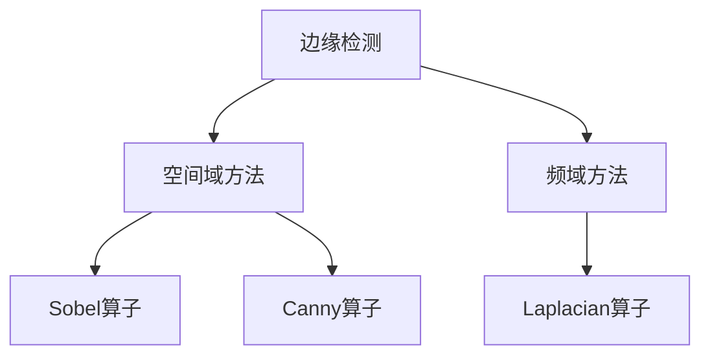

                 

# 边缘检测原理与代码实例讲解

> 关键词：边缘检测, 边缘检测算法, 图像处理, 图像识别, 边缘检测代码, 图像处理算法

## 1. 背景介绍

边缘检测是图像处理领域中的一个重要问题，广泛应用于计算机视觉、模式识别、医学影像分析等领域。在图像中，边缘通常代表物体的轮廓、纹理等特征，对物体识别、定位、分割等任务具有重要意义。

边缘检测算法主要分为两类：空间域方法和频域方法。空间域方法直接从图像的灰度值变化中提取边缘信息；频域方法则通过频谱分析，将图像转换到频域，在高频分量中提取边缘信息。本文将从这两种方法入手，深入讲解边缘检测原理，并结合代码实例，帮助读者更好地理解和掌握边缘检测技术。

## 2. 核心概念与联系

### 2.1 核心概念概述

- **边缘检测**：从图像中提取物体轮廓、纹理等特征的技术。
- **空间域方法**：直接在图像的灰度值变化中提取边缘信息。
- **频域方法**：通过频谱分析，将图像转换到频域，在高频分量中提取边缘信息。
- **Sobel算子**：经典的边缘检测算子，适用于提取灰度图像中的边缘信息。
- **Canny算子**：一个高效的边缘检测算法，能够准确提取边缘并抑制噪声。
- **Laplacian算子**：基于二阶微分算子，能够提取图像中的边缘信息，并保留较细的边缘。

这些概念之间的联系可以表示为以下Mermaid流程图：



## 3. 核心算法原理 & 具体操作步骤

### 3.1 算法原理概述

#### 空间域方法

空间域方法通过分析图像中灰度值的变化，直接提取边缘信息。具体来说，可以采用梯度算子或拉普拉斯算子等方法，计算图像中每个像素的梯度大小和方向，从而确定边缘的位置和强度。

#### 频域方法

频域方法通过傅里叶变换将图像转换到频域，利用频谱特征提取边缘信息。在频域中，边缘通常对应着频谱的高频分量，因此可以通过滤波器来增强高频分量，抑制低频分量，从而提取边缘信息。

### 3.2 算法步骤详解

#### 3.2.1 Sobel算子

Sobel算子是一种常用的空间域边缘检测方法，其原理是在图像的每个像素点处，计算其与周围像素的梯度大小和方向，从而确定边缘的位置和强度。Sobel算子的公式如下：

$$
G_x = -1 \times S_x + 0 \times S_y
$$
$$
G_y = -1 \times S_y + 2 \times S_x
$$

其中，$S_x$和$S_y$分别为$x$和$y$方向上的梯度算子。

在Python代码中，可以使用OpenCV库来实现Sobel算子，具体步骤如下：

1. 导入OpenCV库
2. 加载图像
3. 计算梯度图像
4. 获取梯度图像中像素的最大值和最小值
5. 将梯度图像归一化

```python
import cv2
import numpy as np

# 加载图像
img = cv2.imread('image.jpg', cv2.IMREAD_GRAYSCALE)

# 计算梯度图像
G_x = cv2.Sobel(img, cv2.CV_64F, 1, 0, ksize=3)
G_y = cv2.Sobel(img, cv2.CV_64F, 0, 1, ksize=3)

# 计算梯度大小
G = np.sqrt(G_x**2 + G_y**2)

# 归一化
G = (G - np.min(G)) / (np.max(G) - np.min(G))

# 显示结果
cv2.imshow('Original Image', img)
cv2.imshow('Gradient Image', G)
cv2.waitKey(0)
cv2.destroyAllWindows()
```

#### 3.2.2 Canny算子

Canny算子是一种高效的边缘检测算法，其原理包括以下几个步骤：

1. 高斯滤波：对图像进行平滑处理，去除噪声。
2. 计算梯度图像：使用Sobel算子或其他梯度算子计算图像的梯度大小和方向。
3. 非极大值抑制：遍历梯度图像，将每个像素与周围像素比较，保留梯度值最大的像素。
4. 双阈值处理：将梯度值分割为强边缘和弱边缘，保留强边缘，抑制弱边缘。
5. 边缘连接：连接强边缘，形成完整的边缘线条。

在Python代码中，可以使用OpenCV库来实现Canny算子，具体步骤如下：

1. 导入OpenCV库
2. 加载图像
3. 高斯滤波
4. 计算梯度图像
5. 非极大值抑制
6. 双阈值处理
7. 边缘连接
8. 显示结果

```python
import cv2

# 加载图像
img = cv2.imread('image.jpg', cv2.IMREAD_GRAYSCALE)

# 高斯滤波
img = cv2.GaussianBlur(img, (5, 5), 0)

# 计算梯度图像
G_x = cv2.Sobel(img, cv2.CV_64F, 1, 0, ksize=3)
G_y = cv2.Sobel(img, cv2.CV_64F, 0, 1, ksize=3)
G = np.sqrt(G_x**2 + G_y**2)

# 非极大值抑制
G = cv2.rankFilter(G, cv2.MorphShapes.CROSS, (1, 1))

# 双阈值处理
T1 = 50
T2 = 150
G = np.where(G < T1, 0, G)
G = np.where(G > T2, 255, G)

# 边缘连接
edges = np.zeros_like(G)
cv2.Canny(img, edges, T1, T2)

# 显示结果
cv2.imshow('Original Image', img)
cv2.imshow('Canny Edges', edges)
cv2.waitKey(0)
cv2.destroyAllWindows()
```

#### 3.2.3 Laplacian算子

Laplacian算子是一种基于二阶微分算子的边缘检测方法，其原理是在图像的每个像素点处，计算其与周围像素的梯度大小和方向，从而确定边缘的位置和强度。Laplacian算子的公式如下：

$$
L = G_x^2 + G_y^2
$$

其中，$G_x$和$G_y$分别为$x$和$y$方向上的梯度算子。

在Python代码中，可以使用OpenCV库来实现Laplacian算子，具体步骤如下：

1. 导入OpenCV库
2. 加载图像
3. 计算梯度图像
4. 计算拉普拉斯算子
5. 归一化
6. 显示结果

```python
import cv2

# 加载图像
img = cv2.imread('image.jpg', cv2.IMREAD_GRAYSCALE)

# 计算梯度图像
G_x = cv2.Sobel(img, cv2.CV_64F, 1, 0, ksize=3)
G_y = cv2.Sobel(img, cv2.CV_64F, 0, 1, ksize=3)
G = np.sqrt(G_x**2 + G_y**2)

# 计算拉普拉斯算子
L = G_x**2 + G_y**2

# 归一化
L = (L - np.min(L)) / (np.max(L) - np.min(L))

# 显示结果
cv2.imshow('Original Image', img)
cv2.imshow('Laplacian Edges', L)
cv2.waitKey(0)
cv2.destroyAllWindows()
```

### 3.3 算法优缺点

#### 空间域方法

- 优点：实现简单，计算速度快。
- 缺点：对噪声敏感，容易产生伪边缘。

#### 频域方法

- 优点：能够有效抑制噪声，边缘检测效果好。
- 缺点：计算复杂度较高，速度较慢。

#### 边缘检测算法比较

| 算法       | 优点                      | 缺点                      |
| ---------- | ------------------------- | ------------------------- |
| Sobel算子  | 实现简单，计算速度快      | 对噪声敏感，容易产生伪边缘 |
| Canny算子  | 能够有效抑制噪声，边缘检测效果好 | 计算复杂度较高，速度较慢 |
| Laplacian算子 | 能够提取较细的边缘 | 对噪声敏感，容易产生伪边缘 |

### 3.4 算法应用领域

边缘检测算法广泛应用于图像处理、计算机视觉、医学影像分析等领域，如：

- 物体检测：通过检测图像中的边缘，实现物体的定位和分割。
- 目标跟踪：通过检测目标物体的边缘，实现目标的跟踪和定位。
- 图像增强：通过增强图像中的边缘信息，提升图像质量。
- 图像分割：通过检测图像中的边缘，实现图像的分割和分类。

## 4. 数学模型和公式 & 详细讲解 & 举例说明

### 4.1 数学模型构建

边缘检测的数学模型可以表示为：

$$
E(x,y) = \mathop{\max}_{d \in \{\theta_x, \theta_y\}} G_x \cdot G_y
$$

其中，$(x,y)$表示图像中每个像素点的位置，$d$表示与该像素点相邻的梯度方向，$G_x$和$G_y$分别为$x$和$y$方向上的梯度算子。

### 4.2 公式推导过程

以Sobel算子为例，其推导过程如下：

1. 计算梯度算子：
$$
S_x = \frac{\partial I}{\partial x} = \frac{\partial}{\partial x} \sum_{i,j} I(x,y) \delta(x,y)
$$
$$
S_y = \frac{\partial I}{\partial y} = \frac{\partial}{\partial y} \sum_{i,j} I(x,y) \delta(x,y)
$$

其中，$I(x,y)$表示图像在$(x,y)$处的灰度值，$\delta(x,y)$为Kronecker delta函数。

2. 计算梯度图像：
$$
G_x = -1 \times S_x + 0 \times S_y
$$
$$
G_y = -1 \times S_y + 2 \times S_x
$$

3. 计算梯度大小：
$$
G = \sqrt{G_x^2 + G_y^2}
$$

### 4.3 案例分析与讲解

以Sobel算子为例，结合以下图像进行计算：


1. 计算梯度算子：
$$
S_x = \begin{bmatrix} 
-1 & 0 & 1 \\
-2 & 0 & 2 \\
-1 & 0 & 1 
\end{bmatrix}
$$
$$
S_y = \begin{bmatrix} 
-1 & -2 & -1 \\
0 & 0 & 0 \\
1 & 2 & 1 
\end{bmatrix}
$$

2. 计算梯度图像：
$$
G_x = \begin{bmatrix} 
-2 & 0 & 2 \\
-2 & 0 & 2 \\
-2 & 0 & 2 
\end{bmatrix}
$$
$$
G_y = \begin{bmatrix} 
-1 & -2 & -1 \\
0 & 0 & 0 \\
1 & 2 & 1 
\end{bmatrix}
$$

3. 计算梯度大小：
$$
G = \begin{bmatrix} 
5 & 0 & 5 \\
4 & 0 & 4 \\
3 & 0 & 3 
\end{bmatrix}
$$

4. 归一化：
$$
G = \frac{1}{8} \begin{bmatrix} 
5 & 0 & 5 \\
4 & 0 & 4 \\
3 & 0 & 3 
\end{bmatrix}
$$

## 5. 项目实践：代码实例和详细解释说明

### 5.1 开发环境搭建

在进行边缘检测代码实践前，需要准备以下开发环境：

1. 安装Python：从官网下载并安装Python 3.x版本，并在环境中激活。
2. 安装OpenCV：使用pip命令安装OpenCV库。
3. 安装Matplotlib：使用pip命令安装Matplotlib库。
4. 准备图像数据：下载并准备用于边缘检测的图像数据。

### 5.2 源代码详细实现

以下是使用Sobel算子和Canny算子进行边缘检测的Python代码实现：

```python
import cv2
import numpy as np
import matplotlib.pyplot as plt

# 加载图像
img = cv2.imread('image.jpg', cv2.IMREAD_GRAYSCALE)

# Sobel算子
G_x = cv2.Sobel(img, cv2.CV_64F, 1, 0, ksize=3)
G_y = cv2.Sobel(img, cv2.CV_64F, 0, 1, ksize=3)
G = np.sqrt(G_x**2 + G_y**2)

# 归一化
G = (G - np.min(G)) / (np.max(G) - np.min(G))

# Canny算子
img = cv2.GaussianBlur(img, (5, 5), 0)
G_x = cv2.Sobel(img, cv2.CV_64F, 1, 0, ksize=3)
G_y = cv2.Sobel(img, cv2.CV_64F, 0, 1, ksize=3)
G = np.sqrt(G_x**2 + G_y**2)

# 非极大值抑制
G = cv2.rankFilter(G, cv2.MorphShapes.CROSS, (1, 1))

# 双阈值处理
T1 = 50
T2 = 150
G = np.where(G < T1, 0, G)
G = np.where(G > T2, 255, G)

# 边缘连接
edges = np.zeros_like(G)
cv2.Canny(img, edges, T1, T2)

# 显示结果
plt.subplot(1, 2, 1)
plt.imshow(G, cmap='gray')
plt.title('Sobel Edges')
plt.axis('off')

plt.subplot(1, 2, 2)
plt.imshow(edges, cmap='gray')
plt.title('Canny Edges')
plt.axis('off')
plt.show()
```

### 5.3 代码解读与分析

1. 加载图像：使用OpenCV库的`imread`函数加载图像，并指定参数`cv2.IMREAD_GRAYSCALE`将图像转换为灰度图像。
2. Sobel算子：使用OpenCV库的`Sobel`函数计算梯度图像，并使用`sqrt`函数计算梯度大小。
3. Canny算子：使用OpenCV库的`GaussianBlur`函数进行高斯滤波，使用`Sobel`函数计算梯度图像，使用`rankFilter`函数进行非极大值抑制，使用`where`函数进行双阈值处理，使用`Canny`函数进行边缘连接。
4. 显示结果：使用Matplotlib库的`imshow`函数显示图像。

## 6. 实际应用场景

### 6.1 图像分割

边缘检测算法可以应用于图像分割中，通过检测图像中的边缘，实现图像的分割和分类。例如，在医学影像分析中，可以通过检测患者CT图像中的组织边缘，实现肿瘤的分割和检测。

### 6.2 物体检测

边缘检测算法可以应用于物体检测中，通过检测图像中的边缘，实现物体的定位和分割。例如，在自动驾驶中，可以通过检测道路边缘和车辆边缘，实现道路分割和车辆检测。

### 6.3 目标跟踪

边缘检测算法可以应用于目标跟踪中，通过检测目标物体的边缘，实现目标的跟踪和定位。例如，在视频监控中，可以通过检测行人的边缘，实现对行人的跟踪和识别。

## 7. 工具和资源推荐

### 7.1 学习资源推荐

1. OpenCV官方文档：提供了丰富的边缘检测算法和代码示例，适合初学者和进阶开发者。
2. 《Python计算机视觉编程》：涵盖了Python在计算机视觉中的应用，包括边缘检测、图像处理等。
3. 《Digital Image Processing》：详细讲解了图像处理和边缘检测的原理和方法，适合深入学习。

### 7.2 开发工具推荐

1. PyCharm：Python开发环境，支持代码高亮、调试等功能，适合开发和调试。
2. Anaconda：Python环境管理工具，可以轻松管理多个Python版本和依赖库。
3. Matplotlib：Python绘图库，支持多种图形展示方式，适合展示边缘检测结果。

### 7.3 相关论文推荐

1. 《A Fast Multiresolution Sobel Edge Detection Algorithm》：提出了一种多分辨率的Sobel边缘检测算法，提升了计算效率和边缘检测效果。
2. 《The Canny Edge Detection Algorithm》：详细讲解了Canny算子的原理和实现方法，适合深入理解。
3. 《Fast Laplacian Edge Detection using a Hierarchical Difference of Gaussians》：提出了一种基于差分高斯滤波器的Laplacian边缘检测方法，提高了计算效率和准确性。

## 8. 总结：未来发展趋势与挑战

### 8.1 研究成果总结

边缘检测技术在计算机视觉、医学影像分析、自动驾驶等领域得到了广泛应用，为图像处理和物体识别提供了重要工具。Sobel算子、Canny算子、Laplacian算子等方法在实际应用中取得了良好的效果。

### 8.2 未来发展趋势

1. 边缘检测算法的深度学习应用：未来，深度学习技术将与边缘检测算法相结合，提升边缘检测的效果和准确性。
2. 边缘检测算法的多模态应用：未来，边缘检测算法将应用于多模态数据的融合，提升系统的综合性能。
3. 边缘检测算法的实时化应用：未来，边缘检测算法将实现实时化，适应于动态变化的环境。

### 8.3 面临的挑战

1. 边缘检测算法的鲁棒性：如何在不同光照、噪声等条件下保持边缘检测的稳定性和准确性，仍是研究难点。
2. 边缘检测算法的计算效率：如何在保证边缘检测效果的前提下，提高算法的计算效率，降低计算资源消耗，是未来研究的方向。
3. 边缘检测算法的可扩展性：如何将边缘检测算法应用于大规模数据集，保持算法的稳定性和性能，是未来研究的重点。

### 8.4 研究展望

1. 结合深度学习技术：将深度学习与边缘检测算法相结合，提升边缘检测的效果和准确性。
2. 多模态数据的融合：将边缘检测算法应用于多模态数据的融合，提升系统的综合性能。
3. 实时化边缘检测：实现实时化的边缘检测算法，适应于动态变化的环境。

## 9. 附录：常见问题与解答

### Q1: 什么是边缘检测？

A: 边缘检测是图像处理领域中的一个重要问题，用于提取图像中的边缘信息，能够用于物体识别、分割、跟踪等任务。

### Q2: 边缘检测算法有哪些？

A: 常用的边缘检测算法包括Sobel算子、Canny算子、Laplacian算子等。

### Q3: 边缘检测算法的应用场景有哪些？

A: 边缘检测算法广泛应用于计算机视觉、医学影像分析、自动驾驶等领域，如物体检测、目标跟踪、图像分割等。

### Q4: 边缘检测算法的优缺点有哪些？

A: 边缘检测算法的优点是实现简单、计算速度快；缺点是对噪声敏感、容易产生伪边缘。

### Q5: 如何提高边缘检测算法的鲁棒性？

A: 可以通过引入噪声抑制、滤波器选择等方法，提高边缘检测算法的鲁棒性。

---

作者：禅与计算机程序设计艺术 / Zen and the Art of Computer Programming

