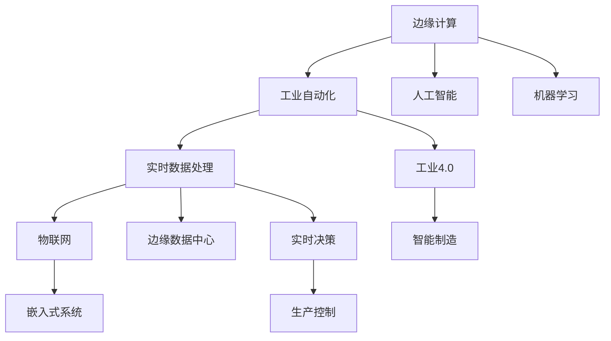

                 

# 边缘计算在工业自动化中的应用：实时数据处理

> 关键词：边缘计算,工业自动化,实时数据处理,物联网(IoT),嵌入式系统,边缘数据中心,工业4.0

## 1. 背景介绍

### 1.1 问题由来

在当前数字化、智能化的工业生产环境中，实时数据处理变得越来越重要。对于大型制造业而言，能否及时、准确地处理生产现场生成的海量数据，直接关系到产品的质量和生产效率。然而，传统集中式的数据处理方式在实时性、灵活性等方面存在诸多局限，逐渐无法满足工业自动化对数据处理的紧迫需求。

因此，边缘计算（Edge Computing）作为一种新的计算范式，被广泛认为能够解决传统集中式数据处理的诸多问题。通过在生产现场或边缘节点上对数据进行分布式处理，可以显著缩短数据延迟，减少网络带宽占用，提升系统的实时性和可靠性。本博文将深入探讨边缘计算在工业自动化中的应用，特别是其在实时数据处理方面的优势和实践。

### 1.2 问题核心关键点

边缘计算与传统集中式计算的主要区别在于其计算和存储资源的分布性。边缘计算通过将计算资源下放到数据源附近，直接在设备或边缘服务器上处理数据，而不是将数据全部传输到云端集中计算，从而大幅降低了网络延迟，提升了实时性。边缘计算在工业自动化中的应用主要体现在以下几个方面：

1. **实时性**：工业生产过程对数据处理的实时性要求极高，边缘计算能够快速响应现场数据变化，及时生成决策支持。
2. **网络带宽**：生产现场生成的数据量巨大，集中式处理会消耗大量带宽资源，而边缘计算可以在数据源处处理，减少网络传输压力。
3. **安全性**：工业现场的环境和数据敏感性较高，将数据处理在本地，可以减少数据泄露风险。
4. **故障容忍度**：边缘计算在本地进行数据处理，可以避免因网络中断或云端故障导致系统瘫痪，提高系统的可靠性和稳定性。

### 1.3 问题研究意义

边缘计算在工业自动化中的应用，对于提升生产效率、降低运营成本、增强系统可靠性和灵活性等方面具有重要意义：

1. **提升生产效率**：通过实时数据处理，工业自动化系统能够快速响应生产现场的变化，及时调整生产参数，从而提高生产效率。
2. **降低运营成本**：减少网络带宽占用，缩短数据延迟，降低能源消耗，从而降低运营成本。
3. **增强系统可靠性**：分散数据处理，减少单点故障风险，增强系统稳定性。
4. **提升安全性**：直接在本地处理数据，减少数据泄露风险，保护企业数据安全。
5. **促进工业4.0发展**：边缘计算是工业4.0的重要组成部分，通过实时数据处理和分析，推动工业生产向智能化、自动化方向发展。

## 2. 核心概念与联系

### 2.1 核心概念概述

为更好地理解边缘计算在工业自动化中的应用，本节将介绍几个密切相关的核心概念：

- **边缘计算（Edge Computing）**：在数据源附近进行的计算和存储资源分布式处理方式，旨在提升数据处理的实时性和可靠性。
- **工业自动化（Industrial Automation）**：通过计算机和自动化控制技术，对工业生产过程进行控制和优化，提高生产效率和产品质量。
- **实时数据处理（Real-Time Data Processing）**：指在数据生成后及时进行处理，生成实时反馈，支持决策和控制的计算范式。
- **物联网（IoT）**：通过互联网将物理设备互联，实现设备间的数据交互和协同工作。
- **嵌入式系统（Embedded System）**：将计算、存储、通信等资源集成到具体的物理设备中，实现特定功能的计算系统。
- **边缘数据中心（Edge Data Center）**：在靠近数据源的地方，构建数据处理和分析中心，支持实时数据存储和处理。
- **工业4.0（Industry 4.0）**：通过信息物理系统（CPS）、云计算、大数据、物联网等技术，实现智能制造，推动工业生产向数字化、智能化方向发展。

这些概念之间的逻辑关系可以通过以下Mermaid流程图来展示：



这个流程图展示了一系列核心概念之间的联系：

1. 边缘计算与工业自动化紧密结合，提升数据处理的实时性。
2. 实时数据处理是边缘计算的核心，支撑工业自动化的实时决策和生产控制。
3. 物联网和嵌入式系统为边缘计算提供数据源和硬件基础。
4. 边缘数据中心作为边缘计算的物理载体，支持实时数据的存储和处理。
5. 工业4.0是边缘计算的最终应用目标，推动工业生产的智能化和自动化。
6. 人工智能和机器学习技术，为实时数据处理和决策支持提供技术支撑。

## 3. 核心算法原理 & 具体操作步骤

### 3.1 算法原理概述

边缘计算在工业自动化中的应用主要基于实时数据处理的原理。通过在边缘节点上部署计算资源，直接处理生产现场生成的数据，实现快速响应的实时决策和生产控制。以下是其核心原理：

1. **数据采集与传输**：生产设备通过传感器等设备采集实时数据，并通过无线网络传输到边缘节点。
2. **本地处理与存储**：边缘节点接收数据后，直接进行数据处理和存储，生成实时反馈。
3. **决策与控制**：通过实时数据处理结果，进行生产决策和控制，如设备参数调整、生产流程优化等。
4. **云同步与备份**：边缘节点将处理后的数据同步到云端，实现数据的备份与分析。

### 3.2 算法步骤详解

边缘计算在工业自动化中的应用主要包括以下几个关键步骤：

**Step 1: 数据采集与传输**

- 通过传感器、摄像头等设备，采集生产现场的实时数据，如温度、湿度、压力、图像等。
- 将采集到的数据通过无线网络（如Wi-Fi、蓝牙、LoRa等）传输到边缘节点。

**Step 2: 本地处理与存储**

- 边缘节点接收到数据后，直接在本地进行预处理（如去噪、压缩等），并在本地存储设备中存储数据。
- 利用嵌入式系统的计算资源，进行实时的数据处理和分析，如状态监控、异常检测、故障诊断等。

**Step 3: 决策与控制**

- 根据边缘节点的处理结果，进行生产决策和控制，如调整设备参数、优化生产流程等。
- 通过物联网技术，将决策信号传输到生产设备，实现生产自动化控制。

**Step 4: 云同步与备份**

- 边缘节点将处理后的数据同步到云端，进行进一步的分析和存储。
- 利用云计算资源，进行大数据分析、机器学习模型训练等，提升决策支持能力。

### 3.3 算法优缺点

边缘计算在工业自动化中的应用具有以下优点：

1. **实时性**：直接在数据源处进行处理，显著缩短数据延迟，提升实时性。
2. **网络带宽**：减少数据传输量，降低网络带宽占用。
3. **安全性**：数据在本地处理，减少数据泄露风险。
4. **故障容忍度**：边缘计算可在本地处理数据，避免因网络中断或云端故障导致系统瘫痪。
5. **设备智能化**：利用嵌入式系统和边缘计算，使生产设备具备智能决策能力。

同时，边缘计算也存在以下缺点：

1. **计算资源有限**：边缘节点的计算和存储资源有限，处理能力受限。
2. **数据存储和传输**：边缘计算依赖于本地存储和传输资源，可能存在存储容量不足和传输带宽限制。
3. **异构性**：不同设备和边缘节点的硬件和软件环境可能存在异构性，影响数据的兼容性。
4. **数据安全性**：边缘计算依赖本地处理，数据安全性容易受到攻击和破坏。
5. **维护与升级**：边缘节点数量众多，维护和升级成本较高。

### 3.4 算法应用领域

边缘计算在工业自动化中的应用广泛，涵盖以下几个领域：

1. **智能制造**：通过边缘计算，实现智能生产设备的实时监控和控制，提升生产效率和质量。
2. **智能维护**：通过边缘计算对设备运行数据进行实时分析，实现设备故障预测和预防性维护。
3. **质量控制**：利用边缘计算对生产过程进行实时监控，实时调整生产参数，保证产品质量。
4. **环境监测**：对生产现场的环境参数进行实时监测，优化生产环境，提高生产效率。
5. **能效管理**：通过边缘计算对能源消耗进行实时监测和优化，降低能源成本。
6. **数据集成与分析**：将边缘节点的数据与云端的分析结果相结合，提升决策支持能力。

## 4. 数学模型和公式 & 详细讲解 & 举例说明

### 4.1 数学模型构建

边缘计算在工业自动化中的应用，可以通过数学模型来描述其核心过程。以下是一个简化的数学模型，用于描述边缘计算在实时数据处理中的应用：

假设生产现场有 $N$ 个边缘节点，每个节点 $i$ 的实时数据表示为 $D_i$，处理后的结果为 $R_i$，生产决策结果为 $C_i$，云端的数据存储和处理结果为 $S_i$。则整个边缘计算过程可以表示为：

$$
\begin{aligned}
R_i &= f_i(D_i, \theta_i) \\
C_i &= g_i(R_i) \\
S_i &= h_i(R_i, \eta)
\end{aligned}
$$

其中 $f_i$ 表示边缘节点对数据的处理函数，$\theta_i$ 表示边缘节点的参数。$g_i$ 表示生产决策函数，$h_i$ 表示云端的存储和处理函数，$\eta$ 表示云端的参数。

### 4.2 公式推导过程

以智能维护为例，其核心过程可以通过数学模型来描述。假设生产现场的监测设备采集到温度、压力等数据，边缘节点进行数据预处理和分析，发现异常状态，生成报警信号，然后将数据传输到云端，进行进一步的异常分析，生成维护建议。其数学模型可以表示为：

1. **数据采集与预处理**：设监测设备采集到 $D_t$ 个时间点的温度 $T(t)$ 和压力 $P(t)$ 数据，预处理函数为 $f(D_t)$，生成预处理后的数据 $D'_t = f(D_t)$。

2. **边缘计算与分析**：边缘节点对预处理后的数据 $D'_t$ 进行状态监控和异常检测，生成报警信号 $R_t$。设状态监控函数为 $g(D'_t)$，异常检测函数为 $h(D'_t)$。

3. **云端分析与决策**：将报警信号 $R_t$ 传输到云端，进行进一步的异常分析和决策，生成维护建议 $S_t$。设异常分析函数为 $k(R_t)$，决策函数为 $l(R_t)$。

其数学模型可以表示为：

$$
\begin{aligned}
D'_t &= f(D_t) \\
R_t &= g(D'_t) + h(D'_t) \\
S_t &= k(R_t) + l(R_t)
\end{aligned}
$$

其中 $f$、$g$、$h$、$k$ 和 $l$ 表示不同的处理函数，$D_t$、$D'_t$、$R_t$ 和 $S_t$ 表示不同阶段的数据结果。

### 4.3 案例分析与讲解

以智能制造为例，利用边缘计算实现实时生产控制的过程可以表示为：

1. **数据采集与预处理**：设生产现场的传感器采集到 $D_p$ 个时间点的数据 $P(t)$，预处理函数为 $f(D_p)$，生成预处理后的数据 $D'_p = f(D_p)$。

2. **边缘计算与控制**：边缘节点对预处理后的数据 $D'_p$ 进行实时监控和控制，生成控制信号 $R_p$。设监控函数为 $g(D'_p)$，控制函数为 $h(D'_p)$。

3. **云端分析与优化**：将控制信号 $R_p$ 传输到云端，进行进一步的分析和优化，生成优化建议 $S_p$。设分析函数为 $k(R_p)$，优化函数为 $l(R_p)$。

其数学模型可以表示为：

$$
\begin{aligned}
D'_p &= f(D_p) \\
R_p &= g(D'_p) + h(D'_p) \\
S_p &= k(R_p) + l(R_p)
\end{aligned}
$$

通过对这些数学模型的分析，可以更好地理解边缘计算在工业自动化中的实际应用。

## 5. 项目实践：代码实例和详细解释说明

### 5.1 开发环境搭建

在进行边缘计算的实践前，我们需要准备好开发环境。以下是使用Python进行边缘计算实践的环境配置流程：

1. 安装Anaconda：从官网下载并安装Anaconda，用于创建独立的Python环境。

2. 创建并激活虚拟环境：
```bash
conda create -n edge_env python=3.8 
conda activate edge_env
```

3. 安装必要的Python包：
```bash
pip install numpy pandas scikit-learn tensorflow pyserial
```

4. 安装IoT设备驱动程序：
```bash
pip install pyserial
```

5. 安装边缘计算框架：
```bash
pip install edgepy
```

完成上述步骤后，即可在`edge_env`环境中开始边缘计算的实践。

### 5.2 源代码详细实现

以下是一个使用边缘计算框架实现实时数据处理和决策控制的示例代码：

```python
import edgepy
from edgepy import EdgeDriver, EdgeNode, EdgeClient

# 创建边缘计算驱动
driver = EdgeDriver()

# 创建边缘节点
node = EdgeNode(driver, 'node1')

# 连接IoT设备
node.connect('device1', '192.168.1.10', 8888)

# 定义数据采集函数
def data_acquisition(device):
    while True:
        data = device.read_data()
        node.publish('temperature', data['temperature'])
        node.publish('pressure', data['pressure'])

# 启动数据采集线程
data_thread = driver.create_thread(data_acquisition, 'device1')

# 定义边缘计算函数
@node.function
def edge_computation():
    temperature = node.subscribe('temperature')
    pressure = node.subscribe('pressure')
    
    # 进行状态监控和异常检测
    if temperature > 40 or pressure > 10:
        node.publish('报警', '异常')
        
    # 进行实时控制
    node.publish('控制信号', '开启空调')

# 启动边缘计算函数
edge_thread = driver.create_thread(edge_computation)

# 定义云端的分析与决策函数
@driver.function
def cloud_analysis():
    报警信号 = node.subscribe('报警')
    控制信号 = node.subscribe('控制信号')
    
    # 进行异常分析和决策
    if 报警信号:
        node.publish('维护建议', '进行设备维护')
    
    # 进行实时优化
    node.publish('优化建议', '调整生产参数')

# 启动云端分析与决策函数
cloud_thread = driver.create_thread(cloud_analysis)

# 运行边缘计算驱动
driver.run()
```

以上代码实现了一个基本的边缘计算系统，包含数据采集、边缘计算和云端分析与决策三个主要环节。通过这个例子，可以看到边缘计算在工业自动化中的应用。

### 5.3 代码解读与分析

让我们再详细解读一下关键代码的实现细节：

**EdgeDriver类**：
- `EdgeDriver` 类是边缘计算驱动的核心，负责管理边缘节点和云端的通信。

**EdgeNode类**：
- `EdgeNode` 类表示一个边缘节点，负责本地的数据处理和控制。

**数据采集函数**：
- 通过 `device.read_data()` 方法从IoT设备读取实时数据，并通过 `node.publish()` 方法将数据传输到边缘节点。

**边缘计算函数**：
- 通过 `node.subscribe()` 方法订阅温度和压力数据，并进行状态监控和异常检测，生成报警信号和控制信号。

**云端分析与决策函数**：
- 通过 `node.subscribe()` 方法订阅报警信号和控制信号，进行异常分析和决策，生成维护建议和优化建议。

**启动线程**：
- 通过 `driver.create_thread()` 方法创建并启动数据采集、边缘计算和云端分析与决策三个线程，实现并行处理。

**运行驱动**：
- 通过 `driver.run()` 方法启动边缘计算驱动，运行整个系统。

以上代码展示了边缘计算在工业自动化中的实际应用，通过Python编程语言，我们可以灵活实现数据采集、边缘计算和云端分析与决策，满足工业生产的实时性需求。

## 6. 实际应用场景

### 6.1 智能制造

在智能制造领域，边缘计算可以用于实时监控和控制生产设备，提升生产效率和质量。具体应用场景包括：

1. **设备状态监控**：通过边缘计算对生产设备的温度、压力等参数进行实时监控，及时发现异常状态，避免设备故障。
2. **故障预测与预防性维护**：通过边缘计算对设备运行数据进行分析，进行故障预测和预防性维护，减少停机时间。
3. **生产参数优化**：通过边缘计算对生产过程进行实时监控和控制，优化生产参数，提升产品质量和生产效率。

### 6.2 智能维护

在智能维护领域，边缘计算可以用于实时监测和分析生产设备，提高设备的可靠性和维护效率。具体应用场景包括：

1. **设备运行数据监测**：通过边缘计算对设备运行数据进行实时监测，发现异常状态，及时发出报警信号。
2. **设备故障诊断与分析**：通过边缘计算对设备运行数据进行深度分析，诊断设备故障原因，提供维修建议。
3. **维护策略优化**：通过边缘计算对设备维护数据进行统计和分析，优化维护策略，提高维护效率。

### 6.3 环境监测

在环境监测领域，边缘计算可以用于实时监测生产现场的环境参数，优化生产环境，提高生产效率。具体应用场景包括：

1. **空气质量监测**：通过边缘计算对生产现场的空气质量进行实时监测，发现污染源，及时采取措施。
2. **温湿度控制**：通过边缘计算对生产现场的温湿度进行实时监测和控制，保持适宜的生产环境。
3. **噪音监测**：通过边缘计算对生产现场的噪音进行实时监测，发现异常噪音源，及时进行处理。

## 7. 工具和资源推荐

### 7.1 学习资源推荐

为了帮助开发者系统掌握边缘计算在工业自动化中的应用，这里推荐一些优质的学习资源：

1. **《边缘计算原理与应用》**：一本介绍边缘计算原理和应用场景的书籍，内容全面，适合初学者入门。

2. **《工业物联网：边缘计算与大数据》**：介绍工业物联网中的边缘计算和大数据技术，涵盖多领域的实际应用案例。

3. **《IoT应用开发实战》**：介绍IoT设备的数据采集和边缘计算，包括Python编程技巧和实践案例。

4. **《边缘计算实战》**：一本实战导向的书籍，涵盖边缘计算框架的详细使用和项目实践。

5. **《工业4.0：智能化生产与未来制造》**：介绍工业4.0中的边缘计算和大数据技术，涵盖多领域的实际应用案例。

通过对这些资源的学习实践，相信你一定能够快速掌握边缘计算在工业自动化中的应用，并用于解决实际的工业问题。

### 7.2 开发工具推荐

高效的开发离不开优秀的工具支持。以下是几款用于边缘计算开发的常用工具：

1. **EdgePy**：Huawei推出的边缘计算框架，提供简单易用的API和接口，支持边缘计算的应用开发。

2. **Fuchsia**：Google推出的微内核操作系统，支持边缘计算和嵌入式设备的应用开发。

3. **TensorFlow Lite**：Google推出的轻量级机器学习框架，支持在边缘设备上进行实时推理。

4. **AWS Greengrass**：亚马逊推出的边缘计算平台，支持在边缘设备上运行云应用。

5. **Yocto Project**：开源嵌入式系统开发平台，提供丰富的设备驱动程序和开发工具。

6. **Ubuntu Edge**：Ubuntu推出的边缘计算平台，支持在边缘设备上进行应用开发和部署。

合理利用这些工具，可以显著提升边缘计算项目的开发效率，加速创新迭代的步伐。

### 7.3 相关论文推荐

边缘计算和工业自动化的研究源于学界的持续研究。以下是几篇奠基性的相关论文，推荐阅读：

1. **《Edge Computing: A Computational Framework for Smartphone and Mobile Devices》**：IEEE对边缘计算的全面定义和框架，为后续研究提供了理论基础。

2. **《Edge Computing in Industry: From Theory to Practice》**：介绍边缘计算在工业中的应用，涵盖多领域的实际案例和实践经验。

3. **《Edge Computing for Industry 4.0: Challenges and Opportunities》**：探讨边缘计算在工业4.0中的应用挑战和机遇，为未来的研究提供了方向。

4. **《IoT Data Analytics and Edge Computing: A Survey》**：全面综述IoT数据在边缘计算中的应用，涵盖多领域的技术和实践。

5. **《Edge Computing for Smart Manufacturing》**：探讨边缘计算在智能制造中的应用，涵盖多领域的实际案例和应用效果。

这些论文代表了大边缘计算技术的发展脉络。通过学习这些前沿成果，可以帮助研究者把握学科前进方向，激发更多的创新灵感。

## 8. 总结：未来发展趋势与挑战

### 8.1 总结

本文对边缘计算在工业自动化中的应用进行了全面系统的介绍。首先阐述了边缘计算在实时数据处理中的核心优势和应用场景，明确了其在提升工业生产效率、降低成本、提高可靠性等方面的重要价值。其次，从原理到实践，详细讲解了边缘计算的应用过程，给出了具体的代码实例和实现细节。同时，本文还广泛探讨了边缘计算在智能制造、智能维护、环境监测等多个领域的应用前景，展示了边缘计算范式的巨大潜力。

通过本文的系统梳理，可以看到，边缘计算在工业自动化中的应用，正在成为推动智能化、自动化生产的重要技术手段。得益于边缘计算的高实时性、低延迟和分布式处理能力，未来工业生产将更加灵活、高效、可靠。

### 8.2 未来发展趋势

展望未来，边缘计算在工业自动化中的应用将呈现以下几个发展趋势：

1. **普及化**：边缘计算将成为工业自动化系统的重要组成部分，广泛应用于智能制造、智能维护、环境监测等多个领域。
2. **标准化**：边缘计算的标准化进程将逐步推进，形成统一的技术规范和应用标准，促进边缘计算的广泛应用。
3. **融合性**：边缘计算将与5G、物联网、人工智能等技术深度融合，推动工业生产的智能化、自动化发展。
4. **安全性**：边缘计算将更加注重数据安全和隐私保护，确保边缘节点和云端的协同工作安全可靠。
5. **可靠性**：边缘计算将提升工业生产系统的可靠性，减少单点故障，提高系统稳定性。
6. **人工智能**：边缘计算将与人工智能技术深度融合，提升工业生产的智能化水平，支持实时决策和优化。

以上趋势凸显了边缘计算在工业自动化中的广阔前景。这些方向的探索发展，必将进一步提升工业生产系统的性能和应用范围，为数字化、智能化工业的发展奠定坚实基础。

### 8.3 面临的挑战

尽管边缘计算在工业自动化中的应用前景广阔，但在迈向更加智能化、普适化应用的过程中，它仍面临着诸多挑战：

1. **计算资源限制**：边缘节点的计算和存储资源有限，处理能力受限，难以应对大规模数据处理需求。
2. **网络带宽限制**：边缘计算依赖本地存储和传输资源，可能存在存储容量不足和传输带宽限制。
3. **异构性**：不同设备和边缘节点的硬件和软件环境可能存在异构性，影响数据的兼容性和一致性。
4. **数据安全性**：边缘计算依赖本地处理，数据安全性容易受到攻击和破坏。
5. **维护与升级**：边缘节点数量众多，维护和升级成本较高。
6. **边缘数据中心建设**：边缘数据中心的建设和管理需要大量投资和资源，初期建设成本较高。

正视边缘计算面临的这些挑战，积极应对并寻求突破，将是大规模应用的前提条件。只有不断优化技术、降低成本、提升效率，才能真正实现边缘计算在工业自动化中的大规模落地。

### 8.4 研究展望

面对边缘计算在工业自动化应用中面临的挑战，未来的研究需要在以下几个方面寻求新的突破：

1. **计算资源优化**：开发更加高效的边缘计算框架，提升边缘节点的计算和存储能力。
2. **网络带宽优化**：优化边缘计算的数据传输策略，减少数据延迟和带宽占用。
3. **异构性优化**：开发跨设备和边缘节点的通用数据格式和协议，提升数据的兼容性和一致性。
4. **数据安全性优化**：采用数据加密、访问控制等技术，提升边缘计算的数据安全性。
5. **边缘数据中心建设**：优化边缘数据中心的建设和管理模式，降低初期投资成本。
6. **边缘与云的协同优化**：优化边缘计算和云端的协同工作模式，提升系统整体性能和可靠性。

这些研究方向将推动边缘计算在工业自动化中的广泛应用，为智能制造、智能维护等行业的数字化转型提供新的技术手段。相信随着技术的不断发展，边缘计算将逐步实现普适化应用，成为工业自动化不可或缺的重要技术。

## 9. 附录：常见问题与解答

**Q1：边缘计算在工业自动化中的应用有哪些主要优势？**

A: 边缘计算在工业自动化中的应用主要具有以下几个优势：

1. **实时性**：直接在数据源处进行处理，显著缩短数据延迟，提升实时性。
2. **网络带宽**：减少数据传输量，降低网络带宽占用。
3. **安全性**：数据在本地处理，减少数据泄露风险。
4. **故障容忍度**：边缘计算可在本地处理数据，避免因网络中断或云端故障导致系统瘫痪。
5. **设备智能化**：利用嵌入式系统和边缘计算，使生产设备具备智能决策能力。

**Q2：边缘计算在工业自动化中如何处理数据？**

A: 边缘计算在工业自动化中的数据处理主要包括以下几个步骤：

1. **数据采集**：通过传感器、摄像头等设备采集实时数据，并将其传输到边缘节点。
2. **数据预处理**：在边缘节点上对采集到的数据进行预处理，如去噪、压缩等。
3. **本地处理**：利用嵌入式系统的计算资源，对预处理后的数据进行实时处理和分析。
4. **实时控制**：根据处理结果，生成控制信号，进行实时控制。
5. **云同步与分析**：将处理后的数据同步到云端，进行进一步的分析，生成优化建议。

**Q3：边缘计算在工业自动化中如何提升生产效率？**

A: 边缘计算在工业自动化中通过实时数据处理和控制，可以显著提升生产效率：

1. **实时监控**：通过边缘计算对生产设备的参数进行实时监控，及时发现异常状态，避免设备故障。
2. **故障预测**：通过边缘计算对设备运行数据进行分析，进行故障预测和预防性维护，减少停机时间。
3. **优化生产参数**：通过边缘计算对生产过程进行实时监控和控制，优化生产参数，提升产品质量和生产效率。

**Q4：边缘计算在工业自动化中如何保障数据安全性？**

A: 边缘计算在工业自动化中保障数据安全性主要通过以下措施：

1. **数据加密**：在数据传输过程中使用加密技术，防止数据泄露。
2. **访问控制**：对边缘节点和云端的数据访问进行严格的权限控制，防止未经授权的访问。
3. **身份验证**：对访问边缘节点和云端的设备进行身份验证，防止恶意攻击。
4. **日志审计**：记录和分析数据访问日志，及时发现异常行为。

**Q5：边缘计算在工业自动化中如何应对计算资源限制？**

A: 边缘计算在工业自动化中应对计算资源限制主要通过以下措施：

1. **优化算法**：优化计算算法，减少计算资源消耗。
2. **边缘计算优化**：通过边缘计算框架优化数据处理流程，提升处理效率。
3. **资源共享**：在边缘节点之间进行资源共享，提高资源利用率。
4. **设备升级**：对边缘节点进行升级，增加计算和存储资源。

通过以上常见问题的解答，可以更好地理解边缘计算在工业自动化中的实际应用，并找到应对挑战的策略。

---

作者：禅与计算机程序设计艺术 / Zen and the Art of Computer Programming

