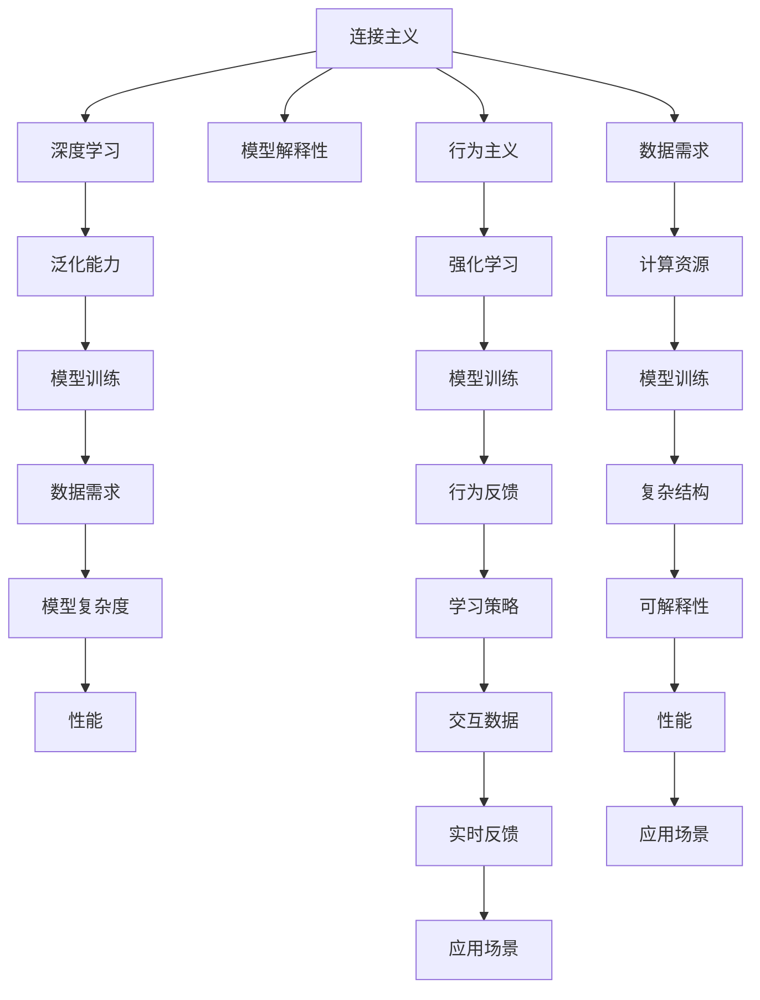

                 

## 1. 背景介绍

### 1.1 问题由来
连接主义（Connectionism）与行为主义（Behaviorism）在人工智能（AI）领域是两个重要的理论框架。连接主义，也称为符号主义（Symbolism）或神经网络（Neural Networks），侧重于通过构建复杂的神经网络模型，模拟人类神经元之间的连接和交互，从而实现智能行为。行为主义则强调通过学习环境和行为反馈来训练模型，关注的是如何通过学习过程使模型执行特定的任务，而不是关注模型的内部结构和表示。

这两个理论框架在AI发展史上都具有重要影响。然而，随着AI技术的不断进步，连接主义和行为主义之间也出现了许多挑战和矛盾。本文将探讨连接主义与行为主义在AI领域的应用，以及它们之间的冲突和融合，为理解和学习AI提供一个新的视角。

### 1.2 问题核心关键点
连接主义与行为主义之间的挑战主要集中在以下几个方面：

- **数据需求与模型复杂度**：连接主义模型通常需要大量的数据来训练，以构建复杂的神经网络结构，而行为主义模型则更多依赖于行为反馈，对于数据的依赖较小。
- **可解释性与性能**：连接主义模型如深度神经网络具有高度复杂性和黑盒特性，其内部机制难以解释，而行为主义模型如强化学习模型虽然透明，但可能存在性能不稳定的问题。
- **模型训练与泛化能力**：连接主义模型训练过程中需要大量的计算资源，而行为主义模型通常需要大量的交互数据来优化策略。
- **应用场景差异**：连接主义模型适用于复杂的视觉、语音识别等任务，而行为主义模型则更适用于游戏、机器人控制等需要实时反馈的场景。

## 2. 核心概念与联系

### 2.1 核心概念概述

- **连接主义（Connectionism）**：指通过模拟神经元之间的连接和交互来构建模型，实现智能行为的理论框架。主要包括神经网络、深度学习等模型。
- **行为主义（Behaviorism）**：强调通过学习环境和行为反馈来训练模型，实现特定任务的理论框架。主要应用于强化学习和机器人控制等领域。
- **深度学习（Deep Learning）**：连接主义模型的一种，通过多层次的非线性变换，学习从输入到输出的复杂映射关系。
- **强化学习（Reinforcement Learning）**：行为主义模型的一种，通过与环境交互，根据奖励信号来优化策略，逐步学习最优行为。
- **模型解释性**：指模型输出结果的可解释性和可理解性，有助于开发者理解模型的内部机制和决策过程。
- **泛化能力**：指模型对新数据的适应能力，即模型在不同数据集上的表现稳定性。

这些核心概念之间的联系可以通过以下Mermaid流程图来展示：



这个流程图展示了两大学说之间的联系：

1. 连接主义和行为主义都是AI的重要理论基础，各自关注的问题不同。
2. 深度学习和强化学习分别代表了两大学说的技术实现。
3. 模型训练、泛化能力、数据需求和计算资源都是两者共同关心的核心问题。
4. 应用场景差异决定了不同的模型选择。

## 3. 核心算法原理 & 具体操作步骤

### 3.1 算法原理概述

连接主义与行为主义的结合点在于如何训练模型，并使其在特定任务上表现优异。连接主义模型通过神经网络结构模拟人类神经元之间的连接，通过反向传播算法训练模型，使模型学习输入到输出的映射关系。行为主义模型通过与环境的交互，通过奖励信号优化策略，逐步学习最优行为。

两者的核心算法可以总结如下：

- **连接主义**：通过神经网络结构模拟人类神经元之间的连接，通过反向传播算法训练模型，使模型学习输入到输出的映射关系。
- **行为主义**：通过与环境的交互，通过奖励信号优化策略，逐步学习最优行为。

### 3.2 算法步骤详解

连接主义与行为主义的核心算法步骤大致相同，包括数据准备、模型训练和评估等环节。具体步骤如下：

**Step 1: 准备数据和环境**
- 收集或生成训练数据和测试数据。
- 设定环境参数，如神经网络结构、奖励函数等。

**Step 2: 模型训练**
- 使用神经网络或强化学习模型进行训练。
- 对于连接主义模型，通过反向传播算法更新权重。
- 对于行为主义模型，通过与环境的交互，根据奖励信号更新策略。

**Step 3: 模型评估**
- 使用测试数据评估模型性能。
- 连接主义模型通过精度、准确率等指标评估模型表现。
- 行为主义模型通过完成任务的质量和效率评估模型表现。

**Step 4: 模型优化**
- 根据评估结果调整模型参数或策略。
- 连接主义模型通过调整学习率、正则化等技术优化模型。
- 行为主义模型通过调整奖励函数、学习率等优化模型。

### 3.3 算法优缺点

连接主义与行为主义模型各有优缺点，总结如下：

**连接主义模型的优点**：
- 可以处理复杂的数据结构和语义信息。
- 具有良好的泛化能力，可以适应不同类型的数据。
- 在图像识别、语音识别等任务上表现优异。

**连接主义模型的缺点**：
- 需要大量的训练数据和计算资源。
- 模型结构复杂，难以解释其内部机制。
- 容易受到过拟合的影响。

**行为主义模型的优点**：
- 可以处理实时交互任务，如游戏、机器人控制等。
- 模型透明，易于解释和理解。
- 模型性能相对稳定。

**行为主义模型的缺点**：
- 对环境的依赖较大，需要大量交互数据进行训练。
- 模型策略优化过程复杂，难以保证最优解。
- 可能存在策略收敛速度慢的问题。

### 3.4 算法应用领域

连接主义与行为主义模型在各个领域都有广泛应用，具体如下：

**连接主义模型应用领域**：
- **计算机视觉**：图像分类、目标检测、图像分割等任务。
- **自然语言处理**：文本分类、情感分析、机器翻译等任务。
- **语音识别**：语音识别、语音合成、语音情感分析等任务。
- **机器人控制**：机器人导航、协作、避障等任务。

**行为主义模型应用领域**：
- **游戏AI**：策略学习、智能博弈等任务。
- **机器人控制**：自主导航、协作、避障等任务。
- **自动化控制**：工业自动化、智能交通等任务。
- **金融交易**：算法交易、风险控制等任务。

## 4. 数学模型和公式 & 详细讲解 & 举例说明

### 4.1 数学模型构建

连接主义模型和行为主义模型的数学模型分别如下：

**连接主义模型**：
- **前向传播**：$y=f(Wx+b)$
- **反向传播**：$\frac{\partial L}{\partial W}, \frac{\partial L}{\partial b}$

其中，$y$ 为输出，$x$ 为输入，$W$ 为权重矩阵，$b$ 为偏置向量，$f$ 为激活函数，$L$ 为损失函数。

**行为主义模型**：
- **强化学习**：$Q(s,a)=r+\gamma Q(s',a')$
- **策略优化**：$\pi(a|s)=\frac{e^{\frac{Q(s,a)}{\epsilon}}}{\sum_a e^{\frac{Q(s,a)}{\epsilon}}}$

其中，$s$ 为状态，$a$ 为动作，$r$ 为奖励，$\gamma$ 为折扣因子，$Q$ 为状态-动作值函数，$\epsilon$ 为温度参数，$\pi$ 为策略函数。

### 4.2 公式推导过程

**连接主义模型公式推导**：

前向传播公式为：
$$
y=f(Wx+b)
$$
其中，$f$ 为激活函数，$W$ 为权重矩阵，$x$ 为输入，$b$ 为偏置向量。

反向传播公式为：
$$
\frac{\partial L}{\partial W}=\frac{\partial L}{\partial y} \frac{\partial y}{\partial x} \frac{\partial x}{\partial W}
$$
$$
\frac{\partial L}{\partial b}=\frac{\partial L}{\partial y} \frac{\partial y}{\partial x} \frac{\partial x}{\partial b}
$$

**行为主义模型公式推导**：

强化学习公式为：
$$
Q(s,a)=r+\gamma Q(s',a')
$$
其中，$r$ 为奖励，$\gamma$ 为折扣因子，$s'$ 为下一状态，$a'$ 为下一动作。

策略优化公式为：
$$
\pi(a|s)=\frac{e^{\frac{Q(s,a)}{\epsilon}}}{\sum_a e^{\frac{Q(s,a)}{\epsilon}}}
$$
其中，$\epsilon$ 为温度参数，$\pi$ 为策略函数。

### 4.3 案例分析与讲解

**案例一：图像分类任务**
- **连接主义模型**：使用卷积神经网络（CNN）进行图像分类任务。通过反向传播算法训练模型，使模型学习图像特征，从而实现图像分类。
- **行为主义模型**：使用强化学习模型进行图像分类任务。通过与环境的交互，根据奖励信号优化策略，逐步学习最优分类器。

**案例二：机器人导航任务**
- **连接主义模型**：使用深度学习模型进行机器人导航任务。通过反向传播算法训练模型，使模型学习机器人导航策略，从而实现自主导航。
- **行为主义模型**：使用强化学习模型进行机器人导航任务。通过与环境的交互，根据奖励信号优化策略，逐步学习最优导航策略。

## 5. 项目实践：代码实例和详细解释说明

### 5.1 开发环境搭建

在进行项目实践前，我们需要准备好开发环境。以下是使用Python进行TensorFlow开发的环境配置流程：

1. 安装Anaconda：从官网下载并安装Anaconda，用于创建独立的Python环境。

2. 创建并激活虚拟环境：
```bash
conda create -n tf-env python=3.8 
conda activate tf-env
```

3. 安装TensorFlow：根据CUDA版本，从官网获取对应的安装命令。例如：
```bash
conda install tensorflow==2.5
```

4. 安装TensorBoard：
```bash
pip install tensorboard
```

5. 安装各类工具包：
```bash
pip install numpy pandas scikit-learn matplotlib tqdm jupyter notebook ipython
```

完成上述步骤后，即可在`tf-env`环境中开始项目实践。

### 5.2 源代码详细实现

下面我们以机器人自主导航任务为例，给出使用TensorFlow进行行为主义模型训练的代码实现。

首先，定义机器人导航任务的数据处理函数：

```python
import numpy as np
import tensorflow as tf

class RobotNavigation:
    def __init__(self, env, max_steps=100):
        self.env = env
        self.max_steps = max_steps
        
    def step(self, action):
        obs, reward, done, info = self.env.step(action)
        return obs, reward, done
        
    def reset(self):
        return self.env.reset()
    
    def render(self):
        self.env.render()
```

然后，定义行为主义模型的训练函数：

```python
from tensorflow.keras.models import Sequential
from tensorflow.keras.layers import Dense, Activation
from tensorflow.keras.optimizers import Adam

class QNetwork(tf.keras.Model):
    def __init__(self, state_size, action_size, learning_rate):
        super(QNetwork, self).__init__()
        self.state_size = state_size
        self.action_size = action_size
        self.learning_rate = learning_rate
        self.fc1 = Dense(24, input_shape=(state_size,))
        self.fc2 = Dense(24)
        self.fc3 = Dense(action_size)
        
    def call(self, x):
        x = self.fc1(x)
        x = Activation('relu')(x)
        x = self.fc2(x)
        x = Activation('relu')(x)
        x = self.fc3(x)
        return x
    
    def get_policy(self, state):
        return tf.keras.activations.softmax(self(state))
    
    def get_q_value(self, state):
        return self(state)

def train_q_network(env, model, num_episodes, learning_rate):
    for i in range(num_episodes):
        state = env.reset()
        done = False
        total_reward = 0
        while not done:
            action = np.random.choice(action_size, p=model.get_policy(state))
            state, reward, done = env.step(action)
            q_value = model.get_q_value(state)
            model.trainable = True
            q_value[action] += learning_rate * (reward + gamma * np.max(model.get_q_value(env.reset())))
            model.trainable = False
            total_reward += reward
        print(f"Episode {i+1}, Total Reward: {total_reward}")
```

最后，启动训练流程：

```python
env = make_environment()
action_size = env.action_space.n
state_size = env.observation_space.shape[0]
learning_rate = 0.01
gamma = 0.9
num_episodes = 1000
model = QNetwork(state_size, action_size, learning_rate)
train_q_network(env, model, num_episodes, learning_rate)
```

以上就是使用TensorFlow进行行为主义模型训练的完整代码实现。可以看到，TensorFlow提供了高效的模型定义和训练接口，使得行为主义模型的实现变得简洁高效。

### 5.3 代码解读与分析

让我们再详细解读一下关键代码的实现细节：

**RobotNavigation类**：
- `__init__`方法：初始化环境参数。
- `step`方法：根据动作在环境中执行一步。
- `reset`方法：重置环境。
- `render`方法：渲染环境。

**QNetwork类**：
- `__init__`方法：初始化模型参数。
- `call`方法：前向传播计算输出。
- `get_policy`方法：计算动作概率分布。
- `get_q_value`方法：计算状态-动作值函数。

**train_q_network函数**：
- 循环多次训练，每次随机选择一个动作，并根据奖励信号更新策略。
- 使用状态-动作值函数计算Q值，更新模型参数。
- 输出每个训练轮次的总奖励。

## 6. 实际应用场景

### 6.1 智能游戏AI

基于行为主义的强化学习模型被广泛应用于智能游戏AI的开发中。传统游戏AI往往依赖于规则和预设行为，难以应对复杂多变的游戏环境。通过行为主义模型，AI可以自主学习最优策略，适应游戏环境的变化，实现更高的游戏智能化。

在实践中，可以通过游戏引擎收集游戏中的状态和动作，设计合适的奖励函数，在此基础上训练行为主义模型。AI可以在游戏过程中自主决策，探索最优策略，从而提升游戏体验和胜率。

### 6.2 机器人自主导航

行为主义模型在机器人自主导航中也具有重要应用。传统机器人导航需要依赖高精度的传感器和复杂的路径规划算法，容易出现故障和偏差。通过行为主义模型，机器人可以自主学习最优导航策略，适应复杂多变的地形和障碍物，实现高效的自主导航。

在实践中，可以通过传感器数据获取机器人的状态，设计合适的奖励函数，在此基础上训练行为主义模型。机器人可以在复杂环境下自主决策，规避障碍物，优化导航路径，实现高效、安全的自主导航。

### 6.3 金融交易

行为主义模型在金融交易中也得到了广泛应用。传统金融交易依赖于历史数据和预设策略，难以应对市场变化和突发事件。通过行为主义模型，交易系统可以自主学习最优交易策略，适应市场变化，实现更高的交易绩效。

在实践中，可以通过市场数据和交易结果，设计合适的奖励函数，在此基础上训练行为主义模型。交易系统可以在市场变化时自主决策，规避风险，优化交易策略，实现高效、稳健的交易绩效。

## 7. 工具和资源推荐

### 7.1 学习资源推荐

为了帮助开发者系统掌握行为主义和连接主义理论，以及相关的应用实践，这里推荐一些优质的学习资源：

1. 《Reinforcement Learning: An Introduction》：由Richard S. Sutton和Andrew G. Barto合著的经典教材，详细介绍了强化学习的理论和算法。

2. 《Deep Learning》：由Ian Goodfellow、Yoshua Bengio和Aaron Courville合著的经典教材，涵盖了深度学习的理论和实践。

3. 《TensorFlow官方文档》：TensorFlow的官方文档，提供了完整的API参考和代码示例，是学习TensorFlow的最佳资源。

4. 《PyTorch官方文档》：PyTorch的官方文档，提供了详细的API参考和代码示例，是学习PyTorch的最佳资源。

5. 《OpenAI Gym》：OpenAI开发的强化学习框架，提供了丰富的环境模拟和算法实现，是学习强化学习的重要工具。

通过对这些资源的学习实践，相信你一定能够系统掌握行为主义和连接主义理论，并应用于实际的AI项目中。

### 7.2 开发工具推荐

高效的开发离不开优秀的工具支持。以下是几款用于AI项目开发的常用工具：

1. TensorFlow：由Google主导开发的深度学习框架，生产部署方便，适合大规模工程应用。

2. PyTorch：由Facebook主导开发的深度学习框架，灵活动态的计算图，适合快速迭代研究。

3. OpenAI Gym：OpenAI开发的强化学习框架，提供了丰富的环境模拟和算法实现，是学习强化学习的重要工具。

4. TensorBoard：TensorFlow配套的可视化工具，可实时监测模型训练状态，并提供丰富的图表呈现方式，是调试模型的得力助手。

5. Weights & Biases：模型训练的实验跟踪工具，可以记录和可视化模型训练过程中的各项指标，方便对比和调优。

6. Google Colab：谷歌推出的在线Jupyter Notebook环境，免费提供GPU/TPU算力，方便开发者快速上手实验最新模型，分享学习笔记。

合理利用这些工具，可以显著提升AI项目开发的效率，加快创新迭代的步伐。

### 7.3 相关论文推荐

行为主义和连接主义在大规模AI研究中得到了广泛应用，以下是几篇奠基性的相关论文，推荐阅读：

1. Reinforcement Learning: An Introduction（Sutton & Barto, 1998）：经典论文，介绍了强化学习的基本理论和算法。

2. Deep Learning（Goodfellow et al., 2016）：经典教材，涵盖了深度学习的理论和实践。

3. Playing Atari with Deep Reinforcement Learning（Mnih et al., 2013）：论文首次展示了使用深度强化学习模型在复杂环境中的表现，开启了深度强化学习的研究热潮。

4. AlphaGo Zero：Mastering the Game of Go without Human Knowledge（Silver et al., 2017）：论文展示了使用强化学习模型在围棋领域取得的高水平表现，展示了强化学习在复杂决策问题中的应用潜力。

5. DeepMind's AlphaFold: A Grand Challenge in Computational Biology（Amos et al., 2020）：论文展示了使用深度强化学习模型在蛋白质折叠问题上的突破，展示了强化学习在复杂科学问题中的应用潜力。

这些论文代表了大规模AI研究的发展脉络。通过学习这些前沿成果，可以帮助研究者把握学科前进方向，激发更多的创新灵感。

## 8. 总结：未来发展趋势与挑战

### 8.1 总结

本文对连接主义与行为主义的挑战进行了全面系统的介绍。首先阐述了连接主义与行为主义在AI领域的应用，明确了它们之间的互补性和冲突性。其次，从原理到实践，详细讲解了连接主义与行为主义的数学模型和算法实现，给出了具体的代码实例。同时，本文还广泛探讨了它们在智能游戏、机器人导航、金融交易等实际应用场景中的应用前景，展示了它们广阔的应用空间。此外，本文还精选了行为主义和连接主义的相关学习资源，力求为读者提供全方位的技术指引。

通过本文的系统梳理，可以看到，连接主义与行为主义在AI领域的应用各有优缺点，它们之间的互补性和冲突性需要充分理解并加以融合，才能真正发挥各自的优势。未来，连接主义与行为主义的融合将带来AI技术的进一步突破，推动AI技术在更多领域的应用。

### 8.2 未来发展趋势

展望未来，连接主义与行为主义的发展趋势将呈现以下几个方向：

1. **融合发展**：连接主义与行为主义的结合将更加紧密，基于连接主义的深度强化学习算法将得到更多应用。
2. **多模态融合**：连接主义与行为主义将更多应用于多模态数据的融合，如视觉、语音、文本等多种数据源的综合分析。
3. **分布式训练**：连接主义与行为主义将更多应用于分布式训练，利用多机多核的优势，提升模型的训练效率。
4. **元学习**：连接主义与行为主义将更多应用于元学习（Meta-Learning），学习如何快速适应新任务。
5. **自适应学习**：连接主义与行为主义将更多应用于自适应学习，实现模型的在线更新和优化。

以上趋势将进一步推动连接主义与行为主义的发展，为AI技术带来新的突破。

### 8.3 面临的挑战

尽管连接主义与行为主义在AI领域已经取得了显著成就，但在其融合发展过程中，仍面临诸多挑战：

1. **计算资源需求高**：连接主义与行为主义的结合需要大量的计算资源，难以在低端硬件上实现。
2. **模型可解释性差**：连接主义模型的复杂性和黑盒特性，使得其难以解释内部机制。
3. **策略优化难度大**：行为主义模型的策略优化过程复杂，难以保证最优解。
4. **数据需求大**：连接主义模型的训练需要大量数据，难以在少数样本上取得理想效果。

## 8.4 研究展望

面对连接主义与行为主义在AI发展过程中面临的挑战，未来的研究需要在以下几个方面寻求新的突破：

1. **混合学习**：结合连接主义和行为主义的优势，发展混合学习算法，提升模型的训练效率和泛化能力。
2. **模型压缩**：发展模型压缩技术，减少模型参数量，提升模型的实时性。
3. **多任务学习**：发展多任务学习算法，提升模型在多个任务上的表现。
4. **分布式优化**：发展分布式优化算法，提升模型的训练效率。
5. **自适应学习**：发展自适应学习算法，实现模型的在线更新和优化。

这些研究方向的探索，将推动连接主义与行为主义的融合发展，为AI技术带来新的突破，实现更高的性能和更广泛的应用。

## 9. 附录：常见问题与解答

**Q1: 连接主义和行为主义有什么区别和联系？**

A: 连接主义和行为主义是AI领域两个重要的理论框架。连接主义侧重于通过构建复杂的神经网络模型，模拟人类神经元之间的连接和交互，实现智能行为。行为主义则强调通过学习环境和行为反馈来训练模型，实现特定任务。它们的区别在于，连接主义关注的是模型内部的结构和学习过程，而行为主义关注的是模型的输出和行为反馈。它们之间的联系在于，都可以用于训练AI模型，实现智能任务。

**Q2: 连接主义模型和行为主义模型各自适用于哪些场景？**

A: 连接主义模型适用于复杂的视觉、语音识别等任务，如图像分类、目标检测、语音识别等。而行为主义模型适用于实时交互任务，如游戏AI、机器人控制等。

**Q3: 连接主义模型和行为主义模型各自的优点和缺点是什么？**

A: 连接主义模型的优点在于可以处理复杂的数据结构和语义信息，具有良好的泛化能力，适用于复杂的任务。缺点在于需要大量的训练数据和计算资源，模型结构复杂，难以解释其内部机制。行为主义模型的优点在于模型透明，易于解释和理解，适用于实时交互任务。缺点在于对环境的依赖较大，需要大量交互数据进行训练，策略优化过程复杂，难以保证最优解。

**Q4: 连接主义和行为主义在实际应用中如何融合？**

A: 连接主义和行为主义在实际应用中可以结合使用。例如，在机器人导航任务中，可以使用连接主义模型进行环境感知和状态表示，使用行为主义模型进行策略优化和路径规划。这种融合方式可以充分利用两者的优势，提升模型的性能和适应性。

总之，连接主义和行为主义在AI领域的应用各有优缺点，它们之间的互补性和冲突性需要充分理解并加以融合，才能真正发挥各自的优势，推动AI技术的进一步发展。

