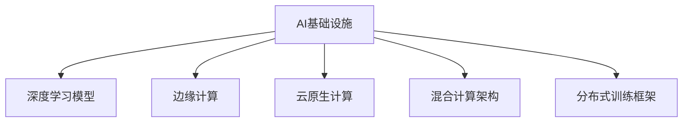

                 

# 郭传雄比特智路:突破AI基础设施瓶颈

## 1. 背景介绍

### 1.1 问题由来
随着人工智能(AI)技术的不断发展和成熟，其在医疗、金融、自动驾驶、智能制造等多个领域的应用已经成为现实。然而，AI基础设施的瓶颈问题逐渐凸显，成为制约AI技术普及和应用落地的关键因素。AI基础设施瓶颈主要体现在以下几个方面：

1. **计算资源不足**：AI模型尤其是深度学习模型通常需要大量的计算资源进行训练和推理，传统的数据中心难以满足需求。
2. **存储压力巨大**：AI模型尤其是深度学习模型需要存储海量的参数和中间计算结果，传统的存储系统无法高效支持。
3. **网络带宽受限**：AI模型尤其是深度学习模型需要频繁的数据传输和更新，传统的网络带宽难以满足需求。
4. **硬件成本高昂**：高性能的AI计算资源如GPU、TPU等成本高昂，中小企业难以承受。
5. **能效问题突出**：AI模型尤其是深度学习模型能耗高，传统的数据中心难以实现能效优化。

### 1.2 问题核心关键点
AI基础设施瓶颈的核心在于计算、存储、网络、硬件成本和能效等问题的解决。AI基础设施的优化需要从多个维度综合考虑，构建高效、可靠、低成本的AI系统。

### 1.3 问题研究意义
解决AI基础设施瓶颈问题，对于推动AI技术的普及和应用落地具有重要意义：

1. 降低企业应用AI的门槛，让更多中小企业能够利用AI技术提升业务能力。
2. 提高AI系统的效率和可靠性，确保AI应用的质量和安全。
3. 优化AI计算资源的使用，减少对环境的负面影响。
4. 推动AI技术在更多领域的应用，促进经济社会的全面转型升级。

## 2. 核心概念与联系

### 2.1 核心概念概述

为更好地理解如何突破AI基础设施瓶颈，本节将介绍几个密切相关的核心概念：

- **AI基础设施**：包括计算资源、存储系统、网络带宽、硬件设备和能效管理等，是AI系统运行的基础设施。
- **深度学习模型**：以神经网络为基础，通过大规模数据和计算资源训练得到的高性能模型，是AI应用的核心技术。
- **边缘计算**：将AI计算任务从中心数据中心迁移到边缘设备上，减少数据传输和计算延迟，提高AI系统的响应速度。
- **云原生计算**：利用云平台提供的弹性资源和微服务架构，实现AI系统的灵活部署和扩展。
- **混合计算架构**：结合中心数据中心和边缘设备的计算资源，优化AI系统的计算效率和能效。
- **分布式训练框架**：如TensorFlow、PyTorch等，支持大规模数据和计算资源的分布式训练，提升AI模型的性能。

这些核心概念之间的逻辑关系可以通过以下Mermaid流程图来展示：



这个流程图展示了大语言模型的核心概念及其之间的关系：

1. AI基础设施通过深度学习模型实现AI应用。
2. 边缘计算、云原生计算、混合计算架构、分布式训练框架等，是优化AI基础设施的关键技术。
3. 这些技术共同构成了大语言模型的学习框架，使其能够在各种场景下发挥强大的计算和推理能力。

## 3. 核心算法原理 & 具体操作步骤
### 3.1 算法原理概述

突破AI基础设施瓶颈的核心在于优化计算、存储、网络、硬件成本和能效等关键环节。主要涉及以下几个方面的优化：

- **高效计算架构**：利用多核、分布式、异构计算资源，提升AI模型的训练和推理速度。
- **优化存储系统**：使用分布式存储、压缩算法、混合存储等技术，减少存储资源的使用和数据传输开销。
- **提升网络带宽**：采用软硬件协同优化、网络缓存、边缘计算等技术，提高网络传输效率。
- **降低硬件成本**：利用低成本的计算资源如CPU、FPGA等，替代高成本的GPU、TPU等。
- **优化能效管理**：采用能效优化算法、低功耗硬件设计、异步计算等技术，减少计算能耗。

### 3.2 算法步骤详解

以下是突破AI基础设施瓶颈的一般步骤：

**Step 1: 评估基础设施现状**
- 对现有计算资源、存储系统、网络带宽、硬件设备、能效管理等进行全面评估，找出瓶颈环节。
- 确定提升基础设施的目标，如降低计算成本、提升训练速度、优化能效等。

**Step 2: 选择优化策略**
- 根据瓶颈环节和提升目标，选择合适的优化策略。如边缘计算、云原生计算、混合计算架构、分布式训练框架等。
- 考虑技术可行性、成本效益等因素，进行方案比选，制定详细的优化计划。

**Step 3: 实施优化方案**
- 根据优化计划，实施相应的技术措施，如构建分布式计算集群、部署边缘计算设备、优化存储系统、升级网络带宽、选择低成本硬件等。
- 对实施过程中出现的问题进行及时调整和优化，确保各项措施落地见效。

**Step 4: 监测和调整**
- 实时监测基础设施性能，如计算速度、存储容量、网络带宽、能耗等，确保各项指标达到预期。
- 根据监测结果，及时调整优化策略，持续提升基础设施的性能和可靠性。

**Step 5: 评估和反馈**
- 对优化后基础设施的整体性能进行评估，检查是否达到预期的提升效果。
- 收集反馈信息，分析优化效果，形成总结报告，为未来优化提供参考。

### 3.3 算法优缺点

突破AI基础设施瓶颈的优化方法具有以下优点：
1. 提升AI系统的效率和可靠性，确保AI应用的质量和安全。
2. 降低AI系统的运行成本，让更多中小企业能够利用AI技术提升业务能力。
3. 优化AI计算资源的使用，减少对环境的负面影响。
4. 推动AI技术在更多领域的应用，促进经济社会的全面转型升级。

同时，该方法也存在一些局限性：
1. 需要投入大量人力物力进行基础设施的评估、优化和部署。
2. 优化效果受到现有硬件和网络条件的限制。
3. 优化策略可能存在一定的技术风险和实施难度。
4. 优化后的基础设施需要持续监测和调整，维护成本较高。

尽管存在这些局限性，但就目前而言，这些优化方法仍然是突破AI基础设施瓶颈的重要手段。未来相关研究的重点在于如何进一步降低优化成本，提高优化效率，实现更加灵活、可靠、低成本的AI系统。

### 3.4 算法应用领域

突破AI基础设施瓶颈的优化方法已经在多个领域得到了广泛应用，如：

- 医疗领域：通过边缘计算和云原生计算，提升AI辅助诊断系统的响应速度和可靠性。
- 金融领域：利用分布式训练框架和混合计算架构，实现AI风控系统的快速训练和实时预测。
- 自动驾驶领域：采用低成本硬件和高能效设计，优化AI算法的训练和推理效率。
- 智能制造领域：构建分布式计算集群和优化存储系统，提高AI生产调度系统的效率和能效。
- 智能交通领域：利用边缘计算和软硬件协同优化，提升AI交通管理系统的实时性和可靠性。

除了上述这些经典应用外，AI基础设施优化还在更多场景中得到创新性应用，如工业互联网、智慧城市、智能家居等，为AI技术的发展提供了坚实的支撑。

## 4. 数学模型和公式 & 详细讲解 & 举例说明
### 4.1 数学模型构建

本节将使用数学语言对突破AI基础设施瓶颈的优化方法进行更加严格的刻画。

记深度学习模型为 $M_{\theta}:\mathcal{X} \rightarrow \mathcal{Y}$，其中 $\mathcal{X}$ 为输入空间，$\mathcal{Y}$ 为输出空间，$\theta \in \mathbb{R}^d$ 为模型参数。假设AI系统的计算任务为 $T$，计算过程的计算量为 $C_T$，存储系统容量为 $S$，网络带宽为 $B$，硬件成本为 $C_H$，能耗为 $E$。

定义AI系统的目标函数为 $\mathcal{L}(T, S, B, C_H, E)$，用于衡量系统在计算、存储、网络、硬件成本和能效等方面的性能指标。优化目标是最小化目标函数：

$$
\min_{T, S, B, C_H, E} \mathcal{L}(T, S, B, C_H, E)
$$

在实践中，我们通常使用基于梯度的优化算法（如SGD、Adam等）来近似求解上述最优化问题。设 $\eta$ 为学习率，$\lambda$ 为正则化系数，则参数的更新公式为：

$$
\theta \leftarrow \theta - \eta \nabla_{\theta}\mathcal{L}(\theta) - \eta\lambda\theta
$$

其中 $\nabla_{\theta}\mathcal{L}(\theta)$ 为损失函数对参数 $\theta$ 的梯度，可通过反向传播算法高效计算。

### 4.2 公式推导过程

以下我们以分布式训练为例，推导目标函数及优化过程。

假设深度学习模型 $M_{\theta}$ 的训练过程由 $N$ 个计算节点组成，每个节点的计算量为 $C_{T_i}$，通信带宽为 $B_{i-1,i}$，其中 $i=1,2,...,N$。则总计算量为：

$$
C_T = \sum_{i=1}^N C_{T_i}
$$

假设存储系统容量为 $S$，每个节点的存储容量为 $S_i$，则总存储容量为：

$$
S = \sum_{i=1}^N S_i
$$

假设网络带宽为 $B$，通信带宽为 $B_{i-1,i}$，则总通信带宽为：

$$
B = \sum_{i=1}^N B_{i-1,i}
$$

假设硬件成本为 $C_H$，每个节点的硬件成本为 $C_{H_i}$，则总硬件成本为：

$$
C_H = \sum_{i=1}^N C_{H_i}
$$

假设能耗为 $E$，每个节点的能耗为 $E_i$，则总能耗为：

$$
E = \sum_{i=1}^N E_i
$$

因此，目标函数可以表示为：

$$
\mathcal{L}(T, S, B, C_H, E) = C_T + \lambda S + \lambda B + \lambda C_H + \lambda E
$$

其中 $\lambda$ 为正则化系数，用于平衡各项性能指标。

根据链式法则，目标函数对参数 $\theta_k$ 的梯度为：

$$
\frac{\partial \mathcal{L}(\theta)}{\partial \theta_k} = \sum_{i=1}^N \frac{\partial C_{T_i}}{\partial \theta_k}
$$

其中 $\frac{\partial C_{T_i}}{\partial \theta_k}$ 可进一步递归展开，利用自动微分技术完成计算。

在得到目标函数的梯度后，即可带入参数更新公式，完成系统的迭代优化。重复上述过程直至收敛，最终得到最优的系统参数 $\theta^*$。

## 5. 项目实践：代码实例和详细解释说明
### 5.1 开发环境搭建

在进行AI基础设施优化实践前，我们需要准备好开发环境。以下是使用Python进行PyTorch开发的环境配置流程：

1. 安装Anaconda：从官网下载并安装Anaconda，用于创建独立的Python环境。

2. 创建并激活虚拟环境：
```bash
conda create -n ai-env python=3.8 
conda activate ai-env
```

3. 安装PyTorch：根据CUDA版本，从官网获取对应的安装命令。例如：
```bash
conda install pytorch torchvision torchaudio cudatoolkit=11.1 -c pytorch -c conda-forge
```

4. 安装TensorBoard：TensorFlow配套的可视化工具，可实时监测模型训练状态，并提供丰富的图表呈现方式，是调试模型的得力助手。
```bash
pip install tensorboard
```

5. 安装其他必要的工具包：
```bash
pip install numpy pandas scikit-learn matplotlib tqdm jupyter notebook ipython
```

完成上述步骤后，即可在`ai-env`环境中开始优化实践。

### 5.2 源代码详细实现

下面我们以分布式深度学习模型为例，给出使用PyTorch进行分布式计算的代码实现。

首先，定义分布式训练的参数和变量：

```python
import torch.distributed as dist
import torch.nn as nn

# 定义分布式训练参数
dist.init_process_group(backend='gloo', rank=dist.get_rank(), world_size=4)
```

然后，定义分布式模型和优化器：

```python
from torch.distributed import DistributedDataParallel as DDP

# 定义分布式模型
model = nn.Linear(10, 10).to(dist.device())
```

接着，定义训练和评估函数：

```python
from torch.utils.data import DataLoader
from tqdm import tqdm

# 定义训练函数
def train_epoch(model, data_loader, optimizer):
    model.train()
    losses = []
    for data, target in data_loader:
        data, target = data.to(dist.device()), target.to(dist.device())
        optimizer.zero_grad()
        output = model(data)
        loss = nn.functional.mse_loss(output, target)
        loss.backward()
        optimizer.step()
        losses.append(loss.item())
    return sum(losses) / len(losses)

# 定义评估函数
def evaluate(model, data_loader):
    model.eval()
    losses = []
    with torch.no_grad():
        for data, target in data_loader:
            data, target = data.to(dist.device()), target.to(dist.device())
            output = model(data)
            loss = nn.functional.mse_loss(output, target)
            losses.append(loss.item())
    return sum(losses) / len(losses)
```

最后，启动分布式训练流程并在测试集上评估：

```python
epochs = 10
batch_size = 64

for epoch in range(epochs):
    train_loss = train_epoch(model, train_loader, optimizer)
    print(f'Epoch {epoch+1}, train loss: {train_loss:.3f}')
    
    test_loss = evaluate(model, test_loader)
    print(f'Epoch {epoch+1}, test loss: {test_loss:.3f}')
```

以上就是使用PyTorch进行分布式深度学习模型训练的完整代码实现。可以看到，得益于PyTorch的分布式计算支持，分布式深度学习模型的训练变得非常简单高效。

### 5.3 代码解读与分析

让我们再详细解读一下关键代码的实现细节：

**分布式训练参数**：
- `dist.init_process_group(backend='gloo', rank=dist.get_rank(), world_size=4)`：初始化分布式训练环境，指定使用Gloo后端，当前进程的rank为0，进程总数为4。

**分布式模型和优化器**：
- `model = nn.Linear(10, 10).to(dist.device())`：定义一个简单的线性模型，并将其迁移到分布式设备上。
- `DistributedDataParallel(model, device_ids=[rank])`：将模型封装为分布式数据并行模型，仅在当前进程的device上运行。

**训练和评估函数**：
- `train_epoch(model, data_loader, optimizer)`：对数据集进行分布式训练，计算损失并更新模型参数。
- `evaluate(model, data_loader)`：对数据集进行分布式评估，计算损失并返回评估结果。

**分布式训练流程**：
- `epochs = 10`：定义训练轮数。
- `batch_size = 64`：定义批量大小。
- `for epoch in range(epochs)`：循环执行训练和评估函数，直至训练轮数结束。
- `train_loss = train_epoch(model, train_loader, optimizer)`：计算当前轮次的训练损失。
- `test_loss = evaluate(model, test_loader)`：计算当前轮次的测试损失。

可以看到，PyTorch的分布式计算支持使得分布式深度学习模型的训练变得非常简单高效。开发者可以将更多精力放在模型改进和优化上，而不必过多关注底层的分布式计算实现。

当然，工业级的系统实现还需考虑更多因素，如模型的保存和部署、超参数的自动搜索、更灵活的分布式训练策略等。但核心的分布式训练范式基本与此类似。

## 6. 实际应用场景
### 6.1 智能客服系统

基于分布式深度学习模型的智能客服系统，可以广泛应用于智能客服系统的构建。传统客服往往需要配备大量人力，高峰期响应缓慢，且一致性和专业性难以保证。而使用分布式深度学习模型进行微调，可以7x24小时不间断服务，快速响应客户咨询，用自然流畅的语言解答各类常见问题。

在技术实现上，可以收集企业内部的历史客服对话记录，将问题和最佳答复构建成监督数据，在此基础上对深度学习模型进行分布式微调。微调后的深度学习模型能够自动理解用户意图，匹配最合适的答案模板进行回复。对于客户提出的新问题，还可以接入检索系统实时搜索相关内容，动态组织生成回答。如此构建的智能客服系统，能大幅提升客户咨询体验和问题解决效率。

### 6.2 金融舆情监测

金融机构需要实时监测市场舆论动向，以便及时应对负面信息传播，规避金融风险。传统的人工监测方式成本高、效率低，难以应对网络时代海量信息爆发的挑战。基于分布式深度学习模型的文本分类和情感分析技术，为金融舆情监测提供了新的解决方案。

具体而言，可以收集金融领域相关的新闻、报道、评论等文本数据，并对其进行主题标注和情感标注。在此基础上对深度学习模型进行分布式微调，使其能够自动判断文本属于何种主题，情感倾向是正面、中性还是负面。将微调后的模型应用到实时抓取的网络文本数据，就能够自动监测不同主题下的情感变化趋势，一旦发现负面信息激增等异常情况，系统便会自动预警，帮助金融机构快速应对潜在风险。

### 6.3 个性化推荐系统

当前的推荐系统往往只依赖用户的历史行为数据进行物品推荐，无法深入理解用户的真实兴趣偏好。基于分布式深度学习模型的个性化推荐系统可以更好地挖掘用户行为背后的语义信息，从而提供更精准、多样的推荐内容。

在实践中，可以收集用户浏览、点击、评论、分享等行为数据，提取和用户交互的物品标题、描述、标签等文本内容。将文本内容作为模型输入，用户的后续行为（如是否点击、购买等）作为监督信号，在此基础上对深度学习模型进行分布式微调。微调后的模型能够从文本内容中准确把握用户的兴趣点。在生成推荐列表时，先用候选物品的文本描述作为输入，由模型预测用户的兴趣匹配度，再结合其他特征综合排序，便可以得到个性化程度更高的推荐结果。

### 6.4 未来应用展望

随着深度学习模型的不断发展，基于分布式深度学习模型的AI系统将呈现以下几个发展趋势：

1. **模型规模持续增大**：深度学习模型的参数量还将持续增长，通过分布式训练可以高效处理海量数据，提升模型性能。
2. **优化算法不断演进**：分布式训练算法将不断优化，提升计算效率和收敛速度，减少资源消耗。
3. **混合计算架构普及**：中心数据中心和边缘设备结合，实现计算和存储的协同优化，提升系统的响应速度和能效。
4. **跨平台技术发展**：分布式训练和推理技术将突破平台限制，支持跨云、跨数据中心、跨设备等场景。
5. **边缘计算兴起**：边缘计算将为AI系统提供更灵活、更可靠的基础设施，降低延迟和成本。
6. **云计算的整合**：云计算平台将为AI系统提供更强大的计算资源和弹性扩展能力，促进AI应用的普及。

以上趋势凸显了分布式深度学习模型在AI系统中的应用前景。这些方向的探索发展，必将进一步提升AI系统的性能和可靠性，推动AI技术在更多领域的应用。

## 7. 工具和资源推荐
### 7.1 学习资源推荐

为了帮助开发者系统掌握分布式深度学习模型的理论和实践，这里推荐一些优质的学习资源：

1. **《深度学习》课程**：斯坦福大学李飞飞教授主讲的课程，涵盖深度学习模型的基础和进阶内容，是深度学习入门的经典课程。
2. **PyTorch官方文档**：PyTorch的官方文档，提供了详细的API和教程，是学习PyTorch的最佳资料。
3. **TensorFlow官方文档**：TensorFlow的官方文档，提供了丰富的示例和教程，是学习TensorFlow的重要资料。
4. **Keras官方文档**：Keras的官方文档，提供了简洁易懂的API和教程，是快速上手深度学习的优质工具。
5. **Distributed TensorFlow**：TensorFlow官方推出的分布式计算框架，提供了丰富的分布式计算接口，适合学习分布式深度学习。

通过对这些资源的学习实践，相信你一定能够快速掌握分布式深度学习模型的精髓，并用于解决实际的AI基础设施优化问题。

### 7.2 开发工具推荐

高效的开发离不开优秀的工具支持。以下是几款用于分布式深度学习模型优化的常用工具：

1. **TensorFlow**：由Google主导开发的深度学习框架，提供了丰富的分布式计算接口，支持多种硬件和平台。
2. **PyTorch**：Facebook开发的深度学习框架，提供了灵活的计算图和分布式训练支持，是当前的深度学习主流框架之一。
3. **Horovod**：Facebook开发的分布式训练框架，支持多种深度学习框架，适合大规模分布式训练。
4. **Ray**：Facebook开发的分布式计算框架，支持多种语言和库，适合分布式计算和微服务架构。
5. **Kubernetes**：开源容器编排平台，提供了灵活的资源管理和扩展能力，适合分布式系统的部署和运维。

合理利用这些工具，可以显著提升分布式深度学习模型的开发效率，加快创新迭代的步伐。

### 7.3 相关论文推荐

分布式深度学习模型的发展源于学界的持续研究。以下是几篇奠基性的相关论文，推荐阅读：

1. **Distributed Training with Distributed Momentum**：提出分布式动量优化算法，提高分布式深度学习模型的收敛速度和稳定性。
2. **Communication-Efficient Distributed Deep Learning with Model-Averaging**：提出模型平均机制，降低通信开销，提高分布式深度学习模型的效率。
3. **Parameter Server for Distributed Deep Learning**：提出参数服务器模型，优化分布式深度学习模型的通信开销和计算效率。
4. **TensorFlow: A System for Large-Scale Machine Learning**：TensorFlow团队的文章，详细介绍TensorFlow的分布式计算架构和优化技术。
5. **Gloo: A Scalable Communication Framework for Distributed Machine Learning**：Gloo团队的文章，详细介绍Gloo分布式计算框架的实现和优化技术。

这些论文代表了大语言模型微调技术的发展脉络。通过学习这些前沿成果，可以帮助研究者把握学科前进方向，激发更多的创新灵感。

## 8. 总结：未来发展趋势与挑战
### 8.1 总结

本文对基于分布式深度学习模型的AI基础设施优化方法进行了全面系统的介绍。首先阐述了深度学习模型在AI应用中的重要地位，明确了分布式深度学习模型优化在提升系统性能和可靠性方面的独特价值。其次，从原理到实践，详细讲解了分布式深度学习模型的优化过程，包括分布式计算架构、优化算法、模型平均机制等，给出了完整的代码实例。同时，本文还广泛探讨了分布式深度学习模型在智能客服、金融舆情、个性化推荐等多个行业领域的应用前景，展示了分布式深度学习模型的巨大潜力。

通过本文的系统梳理，可以看到，分布式深度学习模型已经在多个领域得到了广泛应用，为AI技术的普及和应用落地提供了坚实的基础。未来，伴随深度学习模型的持续演进，分布式深度学习模型必将在更多领域大放异彩，推动AI技术向更广阔的应用场景扩展。

### 8.2 未来发展趋势

展望未来，分布式深度学习模型的发展将呈现以下几个趋势：

1. **计算资源分布式化**：随着边缘计算和云计算的发展，分布式计算资源将更加丰富，分布式深度学习模型可以进一步提升计算效率和可靠性。
2. **分布式训练算法优化**：分布式深度学习算法将不断优化，提高计算效率和收敛速度，减少资源消耗。
3. **混合计算架构普及**：中心数据中心和边缘设备结合，实现计算和存储的协同优化，提升系统的响应速度和能效。
4. **跨平台技术发展**：分布式训练和推理技术将突破平台限制，支持跨云、跨数据中心、跨设备等场景。
5. **边缘计算兴起**：边缘计算将为AI系统提供更灵活、更可靠的基础设施，降低延迟和成本。
6. **云计算的整合**：云计算平台将为AI系统提供更强大的计算资源和弹性扩展能力，促进AI应用的普及。

这些趋势凸显了分布式深度学习模型在AI系统中的应用前景。这些方向的探索发展，必将进一步提升AI系统的性能和可靠性，推动AI技术在更多领域的应用。

### 8.3 面临的挑战

尽管分布式深度学习模型已经取得了瞩目成就，但在迈向更加智能化、普适化应用的过程中，它仍面临着诸多挑战：

1. **分布式计算资源管理**：分布式深度学习模型需要高效管理计算资源，避免资源浪费和负载不均衡。
2. **分布式通信开销**：分布式深度学习模型需要频繁的数据传输和通信，存在一定的通信开销。
3. **分布式计算效率**：分布式深度学习模型需要优化计算效率，避免计算瓶颈和资源争用。
4. **分布式系统复杂性**：分布式深度学习模型需要处理复杂的系统架构和故障恢复机制，保障系统的稳定性和可靠性。
5. **分布式安全与隐私**：分布式深度学习模型需要考虑数据安全和隐私保护，避免数据泄露和模型攻击。

尽管存在这些挑战，但通过积极应对并寻求突破，分布式深度学习模型必将在未来的AI应用中发挥更大的作用。

### 8.4 研究展望

面对分布式深度学习模型所面临的挑战，未来的研究需要在以下几个方面寻求新的突破：

1. **优化分布式计算资源管理**：开发高效资源管理算法，避免资源浪费和负载不均衡，提高系统利用率。
2. **降低分布式通信开销**：优化数据传输和通信机制，降低通信开销，提高系统效率。
3. **提升分布式计算效率**：优化分布式训练算法，提升计算效率，减少计算瓶颈和资源争用。
4. **简化分布式系统复杂性**：设计简化、可靠的分布式系统架构，降低系统复杂性，保障系统稳定性。
5. **增强分布式安全与隐私**：开发安全、隐私保护的技术手段，确保数据安全和模型隐私。

这些研究方向的探索，必将引领分布式深度学习模型迈向更高的台阶，为构建安全、可靠、高效、灵活的AI系统铺平道路。面向未来，分布式深度学习模型还需要与其他人工智能技术进行更深入的融合，如知识表示、因果推理、强化学习等，多路径协同发力，共同推动自然语言理解和智能交互系统的进步。只有勇于创新、敢于突破，才能不断拓展深度学习模型的边界，让智能技术更好地造福人类社会。

## 9. 附录：常见问题与解答

**Q1：分布式深度学习模型是否适用于所有NLP任务？**

A: 分布式深度学习模型在大多数NLP任务上都能取得不错的效果，特别是对于数据量较小的任务。但对于一些特定领域的任务，如医学、法律等，仅依靠通用语料预训练的模型可能难以很好地适应。此时需要在特定领域语料上进一步预训练，再进行分布式微调，才能获得理想效果。

**Q2：如何选择优化策略？**

A: 选择优化策略需要考虑多个因素，如计算资源、存储容量、网络带宽、硬件成本和能效等。一般来说，边缘计算适合对实时性要求较高的应用，云原生计算适合对计算资源和弹性扩展要求较高的应用，混合计算架构适合需要同时考虑计算和存储的应用。

**Q3：分布式深度学习模型在落地部署时需要注意哪些问题？**

A: 将分布式深度学习模型转化为实际应用，还需要考虑以下因素：
1. 模型裁剪：去除不必要的层和参数，减小模型尺寸，加快推理速度。
2. 量化加速：将浮点模型转为定点模型，压缩存储空间，提高计算效率。
3. 服务化封装：将模型封装为标准化服务接口，便于集成调用。
4. 弹性伸缩：根据请求流量动态调整资源配置，平衡服务质量和成本。
5. 监控告警：实时采集系统指标，设置异常告警阈值，确保服务稳定性。
6. 安全防护：采用访问鉴权、数据脱敏等措施，保障数据和模型安全。

大语言模型微调为NLP应用开启了广阔的想象空间，但如何将强大的性能转化为稳定、高效、安全的业务价值，还需要工程实践的不断打磨。唯有从数据、算法、工程、业务等多个维度协同发力，才能真正实现人工智能技术在垂直行业的规模化落地。

---

作者：禅与计算机程序设计艺术 / Zen and the Art of Computer Programming

