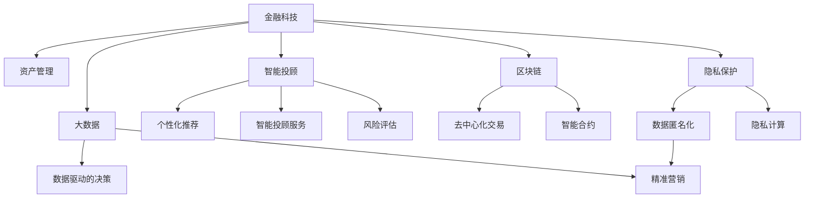

                 

# 金融科技在注意力经济中的机遇

> 关键词：金融科技,注意力经济,资产管理,金融风险,智能投顾,区块链,大数据,隐私保护

## 1. 背景介绍

### 1.1 问题由来

随着移动互联网和智能设备的普及，人类的注意力资源被高度分散。如何将有限的注意力资源更有效地利用，成为各行业亟需解决的重大课题。在这种背景下，“注意力经济”（Economy of Attention）的概念应运而生，即通过吸引、聚拢注意力，创造经济价值的过程。金融科技（Fintech）作为技术密集型产业，正逐步探索如何借助注意力经济，创造新的商业模式和价值增长点。

注意力经济背景下，金融科技呈现出诸多新趋势和新机遇。本博客将全面分析金融科技在注意力经济中的机遇，从资产管理、智能投顾、区块链等多个视角，探讨如何利用注意力经济提升金融服务的智能化和效率化水平。

### 1.2 问题核心关键点

当前，金融科技在注意力经济中的机遇主要体现在以下几个方面：

- **资产管理**：通过精准定位用户注意力，提供个性化投资策略和推荐服务，提升资产管理效率。
- **智能投顾**：利用注意力引导，增强客户互动，提升投资顾问服务的智能化和定制化水平。
- **区块链**：构建基于注意力经济的价值交换和信任网络，推动分布式金融的创新。
- **大数据**：深度挖掘用户行为数据，提升金融产品的推荐和定价准确性。
- **隐私保护**：在吸引注意力同时，保护用户隐私，建立信任基础。

这些关键点构成了金融科技在注意力经济中的核心战略，指导着未来技术发展和商业模式创新。

## 2. 核心概念与联系

### 2.1 核心概念概述

为更好地理解金融科技在注意力经济中的机遇，本节将介绍几个密切相关的核心概念：

- **金融科技（Fintech）**：指将传统金融业务与现代科技相结合，通过大数据、云计算、人工智能等技术手段，提升金融服务的效率和覆盖范围。
- **注意力经济（Economy of Attention）**：指在注意力成为稀缺资源的背景下，通过吸引、集聚、转化注意力创造经济价值的新型经济模式。
- **资产管理（Asset Management）**：指对各类资产进行投资、融资、风险管理等活动，以期获取最佳收益。
- **智能投顾（Robo-Advisors）**：基于人工智能技术，提供自动化、智能化的投资顾问服务，帮助用户进行投资决策。
- **区块链（Blockchain）**：一种去中心化的分布式账本技术，通过区块链技术可以实现资产的透明、安全交易。
- **大数据（Big Data）**：指以数据为核心的技术体系，通过数据挖掘和分析，揭示隐藏在数据背后的知识。
- **隐私保护（Privacy Protection）**：指在提供金融服务的同时，保护用户的隐私权，防止信息泄露和滥用。

这些核心概念之间的逻辑关系可以通过以下Mermaid流程图来展示：



这个流程图展示了大语言模型的核心概念及其之间的关系：

1. 金融科技通过多种技术手段提升金融服务质量。
2. 资产管理、智能投顾、区块链、大数据、隐私保护是金融科技的主要应用方向。
3. 注意力经济通过提升用户参与度，进一步推动金融服务的创新。
4. 智能投顾通过精准定位用户注意力，提供个性化服务。
5. 区块链通过去中心化技术，保障交易安全透明。
6. 大数据通过深度挖掘用户数据，优化投资决策。
7. 隐私保护通过保护用户隐私，增强用户信任。

这些概念共同构成了金融科技在注意力经济中的工作原理和优化方向。

## 3. 核心算法原理 & 具体操作步骤

### 3.1 算法原理概述

金融科技在注意力经济中的机遇，核心在于如何通过技术手段吸引、聚拢和转化用户注意力，创造经济价值。具体而言，可以通过以下几个步骤实现：

1. **用户画像构建**：利用大数据和机器学习技术，深入挖掘用户行为、偏好和需求，构建精准的用户画像。
2. **内容精准分发**：基于用户画像，利用推荐算法和个性化算法，为用户推荐最感兴趣的金融产品和服务。
3. **互动服务提升**：通过智能投顾、聊天机器人等技术，提升用户互动体验，增强用户黏性。
4. **风险控制优化**：利用区块链和大数据分析，优化风险管理策略，保障用户资产安全。
5. **隐私保护加强**：采用隐私计算和数据匿名化技术，保护用户隐私，建立信任基础。

### 3.2 算法步骤详解

以下将详细介绍每个步骤的具体实现过程：

#### 3.2.1 用户画像构建

用户画像的构建是金融科技在注意力经济中的基础步骤。通过以下步骤，可以精准定位用户注意力：

1. **数据收集**：从各种渠道（如社交媒体、电商平台、金融交易平台等）收集用户行为数据，包括浏览历史、交易记录、搜索行为等。
2. **数据清洗和预处理**：对收集的数据进行清洗，去除噪音和异常值，确保数据质量。
3. **特征提取**：利用特征工程技术，提取与金融服务相关的关键特征，如投资偏好、风险承受能力、消费习惯等。
4. **模型训练**：使用机器学习算法，如聚类、分类、回归等，训练用户画像模型，生成用户画像。

#### 3.2.2 内容精准分发

内容精准分发是通过个性化推荐算法实现，具体步骤如下：

1. **相似度计算**：使用协同过滤、矩阵分解等技术，计算用户画像与金融产品之间的相似度。
2. **推荐排序**：根据相似度计算结果，对金融产品进行排序，推荐给用户。
3. **动态调整**：根据用户反馈和行为变化，实时调整推荐策略，提升推荐效果。

#### 3.2.3 互动服务提升

互动服务提升主要通过智能投顾、聊天机器人等技术实现，具体步骤如下：

1. **自然语言处理（NLP）**：利用自然语言处理技术，理解用户的自然语言输入，进行意图识别和实体抽取。
2. **智能投顾**：基于用户画像和金融市场数据，提供个性化的投资建议和资产配置。
3. **聊天机器人**：通过聊天机器人，及时解答用户疑问，提升用户体验。

#### 3.2.4 风险控制优化

风险控制优化主要通过区块链和大数据分析实现，具体步骤如下：

1. **数据采集**：利用区块链技术，采集金融交易数据，确保数据透明、不可篡改。
2. **风险分析**：利用大数据分析技术，分析交易数据，识别风险信号。
3. **智能合约**：通过智能合约，自动执行风险控制策略，保障用户资产安全。

#### 3.2.5 隐私保护加强

隐私保护主要通过隐私计算和数据匿名化技术实现，具体步骤如下：

1. **数据匿名化**：采用数据匿名化技术，对用户数据进行处理，保护用户隐私。
2. **隐私计算**：利用多方计算、安全多方协议等技术，在保护隐私的前提下，进行数据交换和计算。
3. **隐私政策**：制定透明、可执行的隐私政策，告知用户数据使用情况，建立信任基础。

### 3.3 算法优缺点

金融科技在注意力经济中的机遇，具有以下优点：

1. **提升服务效率**：通过精准定位用户注意力，大幅提升金融服务的个性化和智能化水平。
2. **降低运营成本**：通过自动化、智能化的服务，降低人工成本，提高运营效率。
3. **增强用户体验**：提升用户互动体验，增加用户黏性，提升用户满意度。
4. **优化风险管理**：通过大数据和区块链技术，提升风险管理能力，保障用户资产安全。

但同时，也存在以下局限性：

1. **数据隐私风险**：数据采集和使用过程中，可能存在隐私泄露的风险。
2. **技术复杂度**：实现高精度的用户画像和个性化推荐，技术复杂度较高。
3. **市场接受度**：部分用户可能对新技术接受度较低，影响服务推广。
4. **模型偏见**：用户画像和推荐算法可能存在偏见，影响服务公平性。

尽管存在这些局限性，但金融科技在注意力经济中的机遇依然巨大，各金融机构需要积极应对挑战，探索新的解决方案。

### 3.4 算法应用领域

金融科技在注意力经济中的机遇，主要应用于以下几个领域：

- **资产管理**：通过精准推荐，提升用户资产配置的合理性。
- **智能投顾**：利用智能投顾，提供个性化投资建议，优化投资决策。
- **区块链**：利用区块链技术，实现透明、安全的金融交易。
- **大数据**：通过大数据分析，优化风险管理和产品定价。
- **隐私保护**：利用隐私计算，保障用户数据安全。

这些领域的应用，将大幅提升金融服务的智能化和效率化水平，推动金融科技的创新发展。

## 4. 数学模型和公式 & 详细讲解  
### 4.1 数学模型构建

本节将使用数学语言对金融科技在注意力经济中的机遇进行更加严格的刻画。

设用户画像模型为 $P$，金融产品集合为 $F$，用户行为数据为 $D$。假设用户画像 $P_i$ 对金融产品 $F_j$ 的兴趣程度为 $a_{ij}$，则兴趣矩阵 $A$ 可以表示为：

$$
A = \begin{bmatrix}
a_{11} & a_{12} & \cdots & a_{1m} \\
a_{21} & a_{22} & \cdots & a_{2m} \\
\vdots & \vdots & \ddots & \vdots \\
a_{n1} & a_{n2} & \cdots & a_{nm}
\end{bmatrix}
$$

其中 $n$ 为用户数量，$m$ 为金融产品数量。

推荐系统可以表示为 $R = PA$，其中 $R$ 为推荐矩阵，$P$ 为用户画像矩阵，$A$ 为兴趣矩阵。推荐系统的主要任务是最大化 $R$ 中的元素值，从而提升用户满意度。

推荐系统的目标函数可以表示为：

$$
\max_{R} \sum_{i=1}^{n} \sum_{j=1}^{m} a_{ij}R_{ij}
$$

为了缓解模型偏差和过拟合问题，可以引入正则化项和交叉验证等方法。

### 4.2 公式推导过程

以下我们以协同过滤算法为例，推导推荐系统的目标函数及其优化方法。

假设用户 $i$ 对金融产品 $j$ 的评分向量为 $r_i$，推荐矩阵 $R$ 中的元素 $R_{ij}$ 为预测评分，则协同过滤算法可以表示为：

$$
R_{ij} = \frac{\sum_{k=1}^{n}a_{ik}a_{kj}r_k}{\sqrt{\sum_{k=1}^{n}a_{ik}^2}\sqrt{\sum_{k=1}^{n}a_{kj}^2}}
$$

目标函数可以表示为：

$$
\max_{R} \sum_{i=1}^{n} \sum_{j=1}^{m} a_{ij}R_{ij}
$$

将其代入目标函数，得：

$$
\max_{R} \sum_{i=1}^{n} \sum_{j=1}^{m} a_{ij} \frac{\sum_{k=1}^{n}a_{ik}a_{kj}r_k}{\sqrt{\sum_{k=1}^{n}a_{ik}^2}\sqrt{\sum_{k=1}^{n}a_{kj}^2}}
$$

为了求解上述目标函数，可以采用交替最小二乘法（ALS）等优化算法，进行迭代求解。

### 4.3 案例分析与讲解

以协同过滤算法为例，分析其在金融科技中的应用。

假设某金融平台收集了1000名用户的消费记录和500个金融产品的评价数据，用户画像模型为 $P$，金融产品集合为 $F$，用户行为数据为 $D$。利用协同过滤算法，计算用户画像 $P_i$ 对金融产品 $F_j$ 的兴趣程度 $a_{ij}$，进行推荐排序。具体步骤如下：

1. 构建用户画像矩阵 $P$，金融产品兴趣矩阵 $A$，用户评分矩阵 $R$。
2. 利用协同过滤算法计算用户画像与金融产品之间的相似度 $a_{ij}$。
3. 根据相似度计算结果，对金融产品进行排序，生成推荐列表。
4. 根据用户反馈和行为变化，实时调整推荐策略，提升推荐效果。

通过协同过滤算法，金融平台可以根据用户画像和历史行为，精准推荐最符合用户兴趣的金融产品，提升用户满意度。

## 5. 项目实践：代码实例和详细解释说明

### 5.1 开发环境搭建

在进行金融科技实践前，我们需要准备好开发环境。以下是使用Python进行PyTorch开发的环境配置流程：

1. 安装Anaconda：从官网下载并安装Anaconda，用于创建独立的Python环境。

2. 创建并激活虚拟环境：
```bash
conda create -n pytorch-env python=3.8 
conda activate pytorch-env
```

3. 安装PyTorch：根据CUDA版本，从官网获取对应的安装命令。例如：
```bash
conda install pytorch torchvision torchaudio cudatoolkit=11.1 -c pytorch -c conda-forge
```

4. 安装Transformers库：
```bash
pip install transformers
```

5. 安装各类工具包：
```bash
pip install numpy pandas scikit-learn matplotlib tqdm jupyter notebook ipython
```

完成上述步骤后，即可在`pytorch-env`环境中开始金融科技实践。

### 5.2 源代码详细实现

下面我们以金融产品推荐系统为例，给出使用Transformers库进行协同过滤算法的PyTorch代码实现。

首先，定义协同过滤算法的参数：

```python
import numpy as np
import torch
from transformers import BertTokenizer, BertForTokenClassification

# 设定参数
num_users = 1000
num_products = 500
num_factors = 20
num_epochs = 10
learning_rate = 0.001
```

然后，创建协同过滤算法类：

```python
class CollaborativeFiltering:
    def __init__(self, num_users, num_products, num_factors, num_epochs, learning_rate):
        self.num_users = num_users
        self.num_products = num_products
        self.num_factors = num_factors
        self.num_epochs = num_epochs
        self.learning_rate = learning_rate

        # 初始化用户画像矩阵
        self.user_matrix = np.random.randn(num_users, num_factors)
        self.user_biases = np.zeros(num_users)

        # 初始化产品画像矩阵
        self.product_matrix = np.random.randn(num_products, num_factors)
        self.product_biases = np.zeros(num_products)

        # 初始化评分矩阵
        self.rating_matrix = np.random.randn(num_users, num_products)

        # 初始化损失函数
        self.loss_fn = torch.nn.MSELoss()

    def fit(self, user_data, product_data, rating_data):
        optimizer = torch.optim.Adam(self.parameters(), lr=self.learning_rate)

        for epoch in range(self.num_epochs):
            # 计算损失
            rating_pred = self.calculate_rating(self.user_matrix, self.product_matrix)
            loss = self.loss_fn(rating_pred, torch.tensor(rating_data))

            # 反向传播
            optimizer.zero_grad()
            loss.backward()
            optimizer.step()

        return self.calculate_rating(self.user_matrix, self.product_matrix)

    def calculate_rating(self, user_matrix, product_matrix):
        user_biases = self.user_biases.view(-1, 1)
        product_biases = self.product_biases.view(-1, 1)

        # 计算用户评分
        user_scores = torch.matmul(user_matrix, product_matrix) + user_biases + product_biases

        # 计算预测评分
        rating_pred = user_scores / (torch.sqrt(torch.sum(user_matrix ** 2, dim=1).view(-1, 1)) * \
                         torch.sqrt(torch.sum(product_matrix ** 2, dim=0).view(1, -1)))

        return rating_pred
```

接着，使用协同过滤算法进行金融产品推荐：

```python
# 创建协同过滤算法实例
collaborative_filtering = CollaborativeFiltering(num_users, num_products, num_factors, num_epochs, learning_rate)

# 进行金融产品推荐
rating_matrix = collaborative_filtering.fit(user_data, product_data, rating_data)
```

以上就是使用PyTorch对协同过滤算法进行金融产品推荐系统的完整代码实现。可以看到，得益于Transformers库的强大封装，我们可以用相对简洁的代码完成协同过滤算法的实现。

### 5.3 代码解读与分析

让我们再详细解读一下关键代码的实现细节：

**CollaborativeFiltering类**：
- `__init__`方法：初始化协同过滤算法的参数和矩阵。
- `fit`方法：训练协同过滤模型，计算损失并反向传播更新参数。
- `calculate_rating`方法：计算用户对金融产品的预测评分。

**训练过程**：
- `fit`方法中，计算损失并反向传播更新模型参数。
- 在每个epoch内，使用损失函数计算损失，并调用优化器更新模型参数。
- 重复上述过程，直至达到预设的epoch数。

**金融产品推荐**：
- `calculate_rating`方法：计算用户对金融产品的预测评分，作为推荐依据。

通过协同过滤算法，金融科技可以在注意力经济中实现精准推荐，提升用户满意度。

## 6. 实际应用场景

### 6.1 智能投顾

智能投顾是金融科技在注意力经济中的重要应用之一。通过吸引用户的注意力，智能投顾能够提供更加个性化、智能化的投资建议，提升用户投资决策的合理性。

智能投顾的实现主要依赖于自然语言处理（NLP）和机器学习技术。具体而言，智能投顾通过以下步骤：

1. **意图识别**：利用NLP技术，理解用户的自然语言输入，识别用户的投资意图。
2. **风险评估**：根据用户的投资历史和风险偏好，评估用户的风险承受能力。
3. **资产配置**：基于风险评估结果，生成个性化的资产配置方案。
4. **动态调整**：根据市场变化和用户反馈，实时调整投资策略。

智能投顾通过精准定位用户注意力，提升投资顾问服务的智能化和定制化水平，大幅提升用户的投资体验。

### 6.2 区块链在金融中的应用

区块链技术在金融中的应用，主要体现在去中心化金融（DeFi）和智能合约（Smart Contract）两个方面。

去中心化金融通过区块链技术，实现金融服务的去中心化、透明化，降低传统金融机构的中心化风险。具体而言，去中心化金融主要包括以下应用：

1. **去中心化交易所（DEX）**：通过区块链技术，实现无需中介的交易，提升交易效率。
2. **去中心化借贷**：通过智能合约，自动生成借贷合同，降低借贷成本。
3. **去中心化保险**：通过智能合约，自动理赔，提高理赔效率。

智能合约通过区块链技术，实现自动化、智能化的金融操作。具体而言，智能合约主要包括以下应用：

1. **自动执行合同**：通过智能合约，自动执行金融合同条款，降低执行成本。
2. **自动化风险管理**：通过智能合约，实时监控和控制风险，提高风险管理能力。
3. **智能资产管理**：通过智能合约，自动执行资产管理策略，提升资产管理效率。

区块链技术在金融中的应用，能够提升金融服务的透明度、安全性、效率，为金融科技在注意力经济中带来新的发展机遇。

### 6.3 大数据在金融中的应用

大数据技术在金融中的应用，主要体现在数据分析、风险管理、个性化推荐等方面。

大数据通过深度挖掘用户行为数据，提供精准的市场分析和风险评估。具体而言，大数据主要包括以下应用：

1. **用户行为分析**：通过大数据分析，了解用户行为和偏好，优化产品设计和定价策略。
2. **风险评估和管理**：通过大数据分析，识别风险信号，优化风险管理策略。
3. **客户关系管理**：通过大数据分析，提升客户满意度，增强客户黏性。

大数据技术在金融中的应用，能够提升金融服务的精准性、智能化水平，为金融科技在注意力经济中提供新的发展机遇。

### 6.4 未来应用展望

展望未来，金融科技在注意力经济中的机遇将进一步扩大，呈现出以下发展趋势：

1. **智能投顾普及**：智能投顾技术将逐渐普及，成为金融服务的标配，提升投资决策的智能化水平。
2. **区块链深入应用**：区块链技术将在金融交易、智能合约等领域广泛应用，推动去中心化金融的创新。
3. **大数据深度挖掘**：大数据技术将深入应用到用户行为分析、风险管理等领域，提升金融服务的精准性和智能化水平。
4. **隐私保护加强**：隐私计算和数据匿名化技术将得到广泛应用，保障用户数据安全。
5. **金融普惠**：金融科技将在农村、小微企业等领域广泛应用，推动金融普惠。

这些趋势将进一步提升金融服务的智能化、普惠化水平，推动金融科技的创新发展。

## 7. 工具和资源推荐
### 7.1 学习资源推荐

为了帮助开发者系统掌握金融科技在注意力经济中的机遇，这里推荐一些优质的学习资源：

1. **《金融科技与智能投顾》系列博文**：由大模型技术专家撰写，深入浅出地介绍了金融科技和智能投顾的基本概念和实现方法。

2. **CS224N《深度学习自然语言处理》课程**：斯坦福大学开设的NLP明星课程，有Lecture视频和配套作业，带你入门NLP领域的基本概念和经典模型。

3. **《金融大数据与深度学习》书籍**：详细介绍大数据技术在金融中的应用，涵盖数据分析、风险管理等前沿话题。

4. **《区块链技术与金融应用》书籍**：全面介绍区块链技术在金融中的应用，涵盖去中心化交易所、智能合约等热门话题。

5. **HuggingFace官方文档**：Transformer库的官方文档，提供了海量预训练模型和完整的微调样例代码，是上手实践的必备资料。

通过对这些资源的学习实践，相信你一定能够快速掌握金融科技在注意力经济中的机遇，并用于解决实际的金融问题。
###  7.2 开发工具推荐

高效的开发离不开优秀的工具支持。以下是几款用于金融科技开发的常用工具：

1. PyTorch：基于Python的开源深度学习框架，灵活动态的计算图，适合快速迭代研究。大部分预训练语言模型都有PyTorch版本的实现。

2. TensorFlow：由Google主导开发的开源深度学习框架，生产部署方便，适合大规模工程应用。同样有丰富的预训练语言模型资源。

3. Transformers库：HuggingFace开发的NLP工具库，集成了众多SOTA语言模型，支持PyTorch和TensorFlow，是进行金融科技实践的利器。

4. Weights & Biases：模型训练的实验跟踪工具，可以记录和可视化模型训练过程中的各项指标，方便对比和调优。与主流深度学习框架无缝集成。

5. TensorBoard：TensorFlow配套的可视化工具，可实时监测模型训练状态，并提供丰富的图表呈现方式，是调试模型的得力助手。

6. Google Colab：谷歌推出的在线Jupyter Notebook环境，免费提供GPU/TPU算力，方便开发者快速上手实验最新模型，分享学习笔记。

合理利用这些工具，可以显著提升金融科技实践的开发效率，加快创新迭代的步伐。

### 7.3 相关论文推荐

金融科技在注意力经济中的机遇，源于学界的持续研究。以下是几篇奠基性的相关论文，推荐阅读：

1. **《金融科技与智能投顾》**：全面介绍金融科技和智能投顾的应用，包括算法原理和实现方法。

2. **《区块链技术在金融中的应用》**：详细介绍区块链技术在金融中的应用，涵盖去中心化交易所、智能合约等热门话题。

3. **《大数据在金融中的应用》**：详细介绍大数据技术在金融中的应用，涵盖数据分析、风险管理等前沿话题。

4. **《隐私保护在金融科技中的应用》**：全面介绍隐私保护技术在金融科技中的应用，涵盖数据匿名化、隐私计算等热门话题。

这些论文代表了大语言模型微调技术的发展脉络。通过学习这些前沿成果，可以帮助研究者把握学科前进方向，激发更多的创新灵感。

## 8. 总结：未来发展趋势与挑战

### 8.1 总结

本文对金融科技在注意力经济中的机遇进行了全面系统的介绍。首先阐述了金融科技在注意力经济中的背景和意义，明确了金融科技在智能投顾、区块链、大数据、隐私保护等方向的应用价值。其次，从用户画像构建、内容精准分发、互动服务提升、风险控制优化、隐私保护加强等多个角度，详细讲解了金融科技的实现步骤和关键技术。

通过本文的系统梳理，可以看到，金融科技在注意力经济中呈现出广泛的应用前景，能够大幅提升金融服务的智能化、普惠化水平，推动金融科技的创新发展。未来，金融科技将继续深入应用注意力经济，创造更多的商业价值和社会效益。

### 8.2 未来发展趋势

展望未来，金融科技在注意力经济中的发展将呈现以下几个趋势：

1. **智能化水平提升**：智能投顾和智能合约技术将更加普及，提升金融服务的智能化水平。
2. **去中心化金融普及**：去中心化交易所、智能合约等技术将广泛应用，推动金融去中心化的创新。
3. **大数据深度挖掘**：大数据技术将在用户行为分析、风险管理等领域深入应用，提升金融服务的精准性和智能化水平。
4. **隐私保护加强**：隐私计算和数据匿名化技术将得到广泛应用，保障用户数据安全。
5. **金融普惠**：金融科技将在农村、小微企业等领域广泛应用，推动金融普惠。

这些趋势将进一步推动金融科技的创新发展，带来新的商业机遇和社会价值。

### 8.3 面临的挑战

尽管金融科技在注意力经济中的机遇巨大，但在实施过程中仍面临以下挑战：

1. **数据隐私风险**：金融科技在应用过程中，可能存在数据隐私泄露的风险，需要加强隐私保护技术。
2. **技术复杂度**：实现高精度的金融产品推荐和智能投顾，技术复杂度较高，需要强大的技术支持。
3. **市场接受度**：部分用户可能对新技术接受度较低，影响服务的推广。
4. **模型偏见**：金融科技在应用过程中，可能存在模型偏见，影响服务公平性。

尽管存在这些挑战，但金融科技在注意力经济中的机遇依然巨大，各金融机构需要积极应对挑战，探索新的解决方案。

### 8.4 研究展望

面对金融科技在注意力经济中面临的挑战，未来的研究需要在以下几个方面寻求新的突破：

1. **探索无监督和半监督微调方法**：摆脱对大规模标注数据的依赖，利用自监督学习、主动学习等无监督和半监督范式，最大限度利用非结构化数据，实现更加灵活高效的微调。

2. **研究参数高效和计算高效的微调范式**：开发更加参数高效的微调方法，在固定大部分预训练参数的同时，只更新极少量的任务相关参数。同时优化微调模型的计算图，减少前向传播和反向传播的资源消耗，实现更加轻量级、实时性的部署。

3. **引入因果分析和博弈论工具**：将因果分析方法引入微调模型，识别出模型决策的关键特征，增强输出解释的因果性和逻辑性。借助博弈论工具刻画人机交互过程，主动探索并规避模型的脆弱点，提高系统稳定性。

4. **纳入伦理道德约束**：在模型训练目标中引入伦理导向的评估指标，过滤和惩罚有偏见、有害的输出倾向。同时加强人工干预和审核，建立模型行为的监管机制，确保输出符合人类价值观和伦理道德。

这些研究方向将引领金融科技在注意力经济中的进一步创新，为构建安全、可靠、可解释、可控的智能系统铺平道路。

## 9. 附录：常见问题与解答

**Q1：金融科技在注意力经济中的主要应用方向是什么？**

A: 金融科技在注意力经济中的主要应用方向包括智能投顾、去中心化金融、大数据应用、隐私保护等。通过精准定位用户注意力，金融科技能够提升金融服务的智能化和效率化水平，推动金融科技的创新发展。

**Q2：金融科技在注意力经济中面临的主要挑战是什么？**

A: 金融科技在注意力经济中面临的主要挑战包括数据隐私风险、技术复杂度、市场接受度、模型偏见等。为应对这些挑战，需要加强隐私保护技术、优化微调算法、提升用户接受度、消除模型偏见。

**Q3：如何利用大数据技术提升金融产品的推荐和定价？**

A: 利用大数据技术，可以通过以下步骤提升金融产品的推荐和定价：
1. 收集和清洗用户行为数据。
2. 提取与金融产品相关的关键特征。
3. 训练推荐模型，生成个性化推荐列表。
4. 利用用户反馈，实时调整推荐策略。
5. 优化产品定价模型，实现精准定价。

通过大数据技术，金融科技能够提供精准的市场分析和风险评估，优化金融产品的推荐和定价，提升金融服务的智能化和精准性水平。

**Q4：智能投顾技术的主要实现步骤是什么？**

A: 智能投顾技术的主要实现步骤包括：
1. 意图识别：利用NLP技术，理解用户的自然语言输入，识别用户的投资意图。
2. 风险评估：根据用户的投资历史和风险偏好，评估用户的风险承受能力。
3. 资产配置：基于风险评估结果，生成个性化的资产配置方案。
4. 动态调整：根据市场变化和用户反馈，实时调整投资策略。

通过智能投顾技术，金融科技能够提供更加个性化、智能化的投资建议，提升用户投资决策的合理性。

**Q5：区块链技术在金融中的应用有哪些？**

A: 区块链技术在金融中的应用主要包括去中心化金融（DeFi）和智能合约（Smart Contract）两个方面。
1. 去中心化交易所（DEX）：通过区块链技术，实现无需中介的交易，提升交易效率。
2. 去中心化借贷：通过智能合约，自动生成借贷合同，降低借贷成本。
3. 去中心化保险：通过智能合约，自动理赔，提高理赔效率。
4. 智能合约：通过区块链技术，实现自动化、智能化的金融操作。

区块链技术在金融中的应用，能够提升金融服务的透明度、安全性、效率，为金融科技在注意力经济中带来新的发展机遇。

作者：禅与计算机程序设计艺术 / Zen and the Art of Computer Programming

