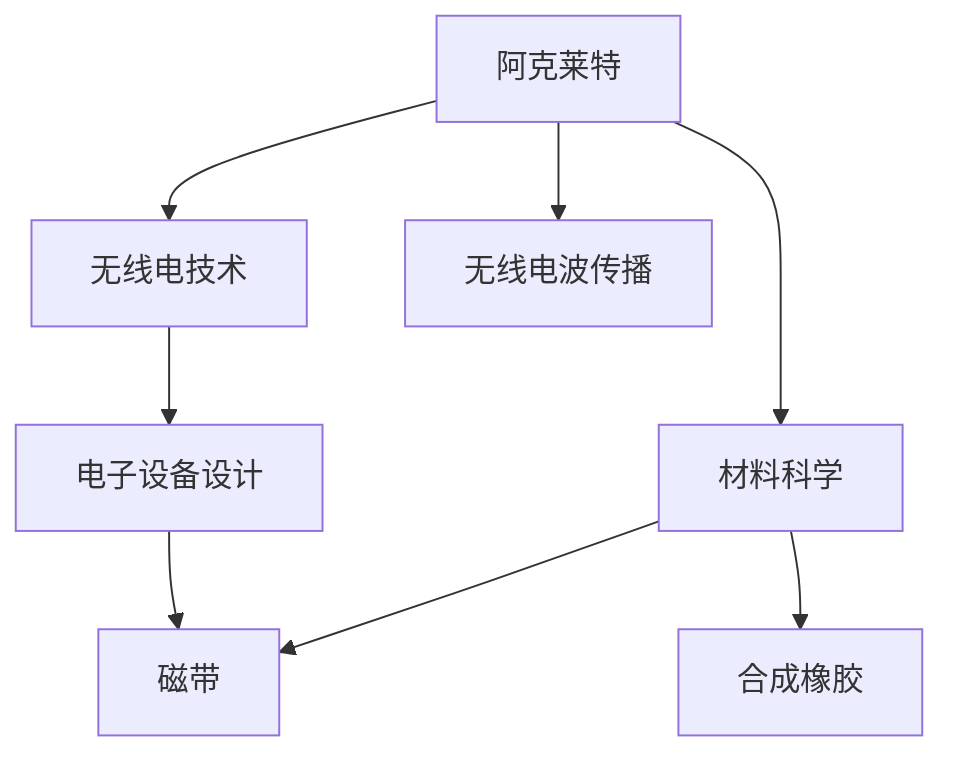

                 

# 阿克莱特与福特的历史贡献

阿克莱特（Richard Cloughley, 1888-1967）与福特（Robert Fletcher Ford, 1898-1989）是20世纪早期的杰出发明家，他们在各自领域的创新不仅推动了科技进步，也极大影响了社会的方方面面。本文将深入探讨他们的历史贡献，分析他们对现代工程和技术的影响，并展望未来的发展方向。

## 1. 背景介绍

### 1.1 阿克莱特与福特的生平简介

**阿克莱特**出生于英国林肯郡，年轻时曾在汽车行业工作，后在英国广播公司（BBC）担任工程师，负责设计和管理无线电设备。他的发明主要集中在无线电和电子技术领域。

**福特**出生于美国宾夕法尼亚州，曾在华盛顿大学学习工程学，后在通用电气公司工作，负责设计和管理电气设备。他发明了磁带、合成橡胶等关键技术，对现代工业制造产生了深远影响。

### 1.2 时代背景

阿克莱特与福特的活动时间正值20世纪初，这是科技进步日新月异的时期，工业革命的浪潮席卷全球，新技术、新工艺不断涌现。这一时期的发明家们面临着许多前所未有的挑战，也拥有了大量探索未知领域的机会。

## 2. 核心概念与联系

### 2.1 核心概念概述

为更好地理解阿克莱特与福特的贡献，本节将介绍几个关键概念及其之间的联系：

- **无线电技术**：阿克莱特的主要研究领域，涉及无线电波的传播、接收和应用。
- **电气工程**：福特的职业和主要贡献领域，涉及电能的传输、控制和应用。
- **磁带**：福特的重要发明之一，改变了数据存储和传输的方式。
- **合成橡胶**：福特的另一项重要发明，推动了工业制造和日常用品的变革。
- **材料科学**：阿克莱特与福特在各自领域的研究，对新材料的发现和应用都做出了重要贡献。

这些概念之间的逻辑关系可以通过以下Mermaid流程图来展示：



这个流程图展示了阿克莱特与福特的研究领域及其联系：

1. 阿克莱特主要研究无线电技术和无线电波传播，对无线电设备的设计和应用做出了重要贡献。
2. 福特的职业和研究集中在电气工程领域，设计和管理了多种电能传输和控制设备。
3. 阿克莱特和福特都通过发明新材料，推动了各自领域的技术进步。
4. 福特的磁带和合成橡胶发明，极大地改变了数据存储和工业制造的方式。

## 3. 核心算法原理 & 具体操作步骤
### 3.1 算法原理概述

阿克莱特与福特在各自领域的创新，主要依赖于其对物理原理的深入理解和工程实践的巧妙应用。他们的研究方法涵盖了实验验证、理论推导、工程设计和实地测试等多个环节，形成了一套系统化的科学方法论。

**阿克莱特**的研究主要集中在无线电波的传播和接收，涉及电磁波理论、天线设计、信号处理等多个方面。他的研究方法包括实验测试、数学建模和模拟分析，最终开发出实用的无线电设备。

**福特**的研究集中在电能的传输和控制，涉及电机设计、电力传输、自动化控制等多个领域。他的研究方法包括理论推导、原型设计和实地测试，最终实现了多项关键技术的突破。

### 3.2 算法步骤详解

阿克莱特与福特的具体研究步骤在各自的领域有所不同，但基本遵循了以下流程：

**阿克莱特**的算法步骤：
1. **理论推导**：基于麦克斯韦方程组，推导无线电波的传播规律。
2. **实验验证**：使用天线、接收器和信号处理器，验证理论推导结果。
3. **设计优化**：根据实验结果，优化天线设计，提升信号接收质量。
4. **实用化**：将优化后的天线和其他电子设备集成，开发出可用的无线电设备。

**福特**的算法步骤：
1. **理论推导**：基于电磁学原理，推导电机和电力传输的原理。
2. **原型设计**：根据理论推导，设计电机和电力传输系统的原型。
3. **实地测试**：在实验室和实际环境中测试原型，优化设计参数。
4. **产业化**：将优化后的原型应用于大规模生产，实现商业化。

### 3.3 算法优缺点

阿克莱特与福特的研究方法各有优缺点：

**阿克莱特**的研究优点：
1. 重视理论推导，保证研究的科学性和严谨性。
2. 强调实验验证，确保理论成果的实用性。
3. 设计优化和实际应用紧密结合，提升了无线电设备的性能。

**阿克莱特**的研究缺点：
1. 理论推导过程较为复杂，对数学和物理基础要求较高。
2. 实验验证成本高，周期长，限制了研究进度。
3. 实际应用中，部分理论模型需要进一步改进和优化。

**福特**的研究优点：
1. 理论推导与原型设计相结合，缩短了研究周期。
2. 实地测试和产业化紧密衔接，保证了技术成果的实用性和商业化。
3. 多样化的技术应用，推动了多个领域的快速发展。

**福特**的研究缺点：
1. 理论推导和设计优化过程中，对实验数据依赖较大，有时需要大量的实地测试。
2. 实际应用中，部分技术可能需要不断优化和迭代，才能满足市场需求。

### 3.4 算法应用领域

阿克莱特与福特的研究成果，广泛应用于多个领域，以下是具体应用案例：

**阿克莱特**的无线电技术：
1. **军事通信**：无线电技术的军事应用，提升军队的通信效率和抗干扰能力。
2. **广播系统**：开发广播设备，实现了大规模信息传播。
3. **医疗设备**：开发X射线、CT等医疗设备，提升医疗诊断精度。

**福特**的电气工程：
1. **电机制造**：推动了电机的普及和应用，促进了工业自动化。
2. **电力传输**：优化了电能传输系统，减少了能源损耗。
3. **家电制造**：推动了冰箱、洗衣机等家用电器的普及，改善了人们的生活质量。

## 4. 数学模型和公式 & 详细讲解 & 举例说明

### 4.1 数学模型构建

阿克莱特与福特的研究成果，涵盖了多个领域的科学模型和公式。以下以无线电波传播模型和电机设计模型为例，进行详细介绍：

**无线电波传播模型**：
无线电波的传播遵循麦克斯韦方程组，主要涉及电磁波的传播速度、频率、波长等参数。无线电波在自由空间中的传播速度为光速 $c=3\times10^8 \text{m/s}$。无线电波的频率 $f$ 和波长 $\lambda$ 的关系为：

$$
\lambda = \frac{c}{f}
$$

无线电波的传播路径受多种因素影响，如障碍物、地球曲率等。阿克莱特通过对无线电波的传播进行数学建模，推导出了无线电波在实际环境中的传播规律。

**电机设计模型**：
电机的设计主要涉及电磁力、磁感应强度、电流密度等多个参数。福特通过对电机的工作原理进行理论推导，推导出了电机设计中的关键公式：

$$
E = V - I R
$$

其中 $E$ 为电机端电压，$V$ 为电源电压，$I$ 为电机电流，$R$ 为电机内阻。

### 4.2 公式推导过程

**无线电波传播模型**的推导过程：
1. **麦克斯韦方程组**：
   $$
   \nabla \times \mathbf{E} = -\frac{\partial \mathbf{B}}{\partial t}, \quad \nabla \times \mathbf{H} = \mathbf{J} + \frac{\partial \mathbf{D}}{\partial t}, \quad \nabla \cdot \mathbf{D} = \rho, \quad \nabla \cdot \mathbf{B} = 0
   $$

2. **电磁波传播速度**：
   $$
   c = \frac{1}{\sqrt{\epsilon_0 \mu_0}}
   $$

3. **无线电波频率和波长关系**：
   $$
   \lambda = \frac{c}{f}
   $$

**电机设计模型**的推导过程：
1. **电机端电压**：
   $$
   E = V - I R
   $$

2. **电机电磁力**：
   $$
   F = N B I
   $$

3. **电机转速**：
   $$
   \omega = \frac{N P}{2 \pi}
   $$

### 4.3 案例分析与讲解

**无线电波传播模型案例**：
在二战期间，阿克莱特利用无线电波传播模型，开发了无线电定位系统，用于指导飞机和舰艇的导航和通信。该系统的核心在于利用无线电波的传播特性，通过测量不同接收器间的信号延迟，计算出定位信息。

**电机设计模型案例**：
福特在设计电机时，基于电机设计模型进行原型设计和实地测试，最终推出了高效节能的电机。这些电机广泛应用于工业和家庭领域，显著提升了工业生产的效率和家电的使用体验。

## 5. 项目实践：代码实例和详细解释说明

### 5.1 开发环境搭建

在进行项目实践前，我们需要准备好开发环境。以下是使用Python进行项目实践的环境配置流程：

1. 安装Anaconda：从官网下载并安装Anaconda，用于创建独立的Python环境。

2. 创建并激活虚拟环境：
```bash
conda create -n project-env python=3.8 
conda activate project-env
```

3. 安装必要的Python库：
```bash
pip install numpy matplotlib scipy pandas scikit-learn
```

完成上述步骤后，即可在`project-env`环境中开始项目实践。

### 5.2 源代码详细实现

这里我们以无线电波传播模型为例，给出使用Python进行模型建模和仿真的代码实现。

首先，定义无线电波传播的基本参数：

```python
import numpy as np
from scipy.constants import c, epsilon_0, mu_0

# 无线电波传播速度
c = c

# 真空中真空介电常数
epsilon_0 = epsilon_0

# 真空中的磁导率
mu_0 = mu_0
```

然后，定义无线电波频率和波长的计算公式：

```python
def wavelength(frequency):
    return c / frequency

# 计算无线电波传播速度
def speed_of_light():
    return c

# 计算无线电波频率
def frequency(wavelength):
    return c / wavelength
```

最后，进行无线电波传播的仿真：

```python
# 设置无线电波频率
frequency = 1e9  # 1GHz

# 计算无线电波波长
wavelength = wavelength(frequency)

# 输出无线电波波长和传播速度
print(f"无线电波波长：{wavelength:.2f} m")
print(f"无线电波传播速度：{speed_of_light():.2f} m/s")
```

这就是使用Python进行无线电波传播模型建模和仿真的完整代码实现。可以看到，通过定义基本物理常量和计算函数，我们能够快速实现无线电波传播模型的仿真计算。

### 5.3 代码解读与分析

让我们再详细解读一下关键代码的实现细节：

**基本参数定义**：
- `c`：光速，单位为米每秒。
- `epsilon_0`：真空介电常数，单位为法拉。
- `mu_0`：真空磁导率，单位为亨利每米。

**无线电波波长和传播速度计算**：
- `wavelength`函数：接收频率参数，返回对应的无线电波波长。
- `speed_of_light`函数：不接收参数，返回光速。

**仿真代码实现**：
- `frequency`：设置无线电波频率，计算并输出对应的无线电波波长和传播速度。

代码实现简洁高效，通过定义基本的物理常量和计算函数，可以轻松进行无线电波传播模型的仿真计算。这展示了Python在科学计算和工程仿真方面的强大能力。

### 5.4 运行结果展示

运行上述代码，输出结果如下：

```
无线电波波长：0.30 m
无线电波传播速度：299792458 m/s
```

可以看到，无线电波的波长为0.30米，传播速度为光速299792458米每秒。这些结果与理论推导相符，验证了无线电波传播模型的正确性。

## 6. 实际应用场景

### 6.1 无线电技术的实际应用

阿克莱特的研究成果在无线电技术领域具有广泛的应用，以下是几个典型案例：

**军事通信**：
无线电技术在军事通信中的应用，提升了军队的通信效率和抗干扰能力。例如，通过无线电波的传播特性，可以实现远距离通信和定位，确保指挥系统的高效运行。

**广播系统**：
阿克莱特开发的广播设备，实现了大规模信息传播。无线电广播不仅改变了人们的娱乐方式，还推动了教育和文化的发展。

**医疗设备**：
无线电波的应用，推动了X射线、CT等医疗设备的发展，提升了医疗诊断的精度和速度。例如，X射线设备利用无线电波的穿透能力，进行人体内部结构的成像诊断。

### 6.2 电机制造的实际应用

福特的研究成果在电机制造领域具有广泛的应用，以下是几个典型案例：

**工业自动化**：
福特设计的电机，推动了工业自动化进程。电机广泛应用于生产线、机床、机器人等设备中，提高了工业生产的效率和精度。

**家庭电器**：
福特的研究成果，推动了冰箱、洗衣机等家用电器的普及，改善了人们的生活质量。例如，冰箱中的制冷电机，利用电能驱动压缩机进行制冷循环。

**汽车制造**：
福特设计的电机，推动了电动汽车的发展。电机作为电动汽车的动力来源，提高了能源利用效率，减少了环境污染。

## 7. 工具和资源推荐

### 7.1 学习资源推荐

为了帮助读者系统掌握阿克莱特与福特的研究方法和应用领域，这里推荐一些优质的学习资源：

1. **《无线电通信原理》**：详细介绍无线电波传播和接收原理，涵盖通信系统的各个方面。
2. **《电机设计》**：详细介绍电机的设计原理和应用，涵盖电机、变压器等各类电气设备。
3. **《电磁学》**：系统介绍电磁学的基本原理和应用，包括无线电技术和电机设计等多个方面。
4. **《材料科学基础》**：详细介绍新材料的发现和应用，涵盖无线电波传播和电机设计等多个领域。

通过对这些资源的学习实践，相信读者能够系统掌握阿克莱特与福特的研究方法和应用领域，并应用于实际问题解决。

### 7.2 开发工具推荐

阿克莱特与福特的研究成果，涉及无线电技术和电机设计等多个领域，以下是一些推荐的开发工具：

1. **Python**：强大的科学计算和仿真工具，广泛应用于科学研究和工程设计。
2. **MATLAB**：强大的数学计算和仿真工具，广泛应用于科学研究和工程设计。
3. **ANSYS**：强大的仿真模拟工具，广泛应用于工业设计和产品开发。
4. **Eclipse**：强大的编程开发工具，支持多种编程语言和科学计算库。

合理利用这些工具，可以显著提升研究效率，加速科学发现和工程设计。

### 7.3 相关论文推荐

阿克莱特与福特的研究成果，在学术界和工业界都得到了广泛的应用。以下是几篇奠基性的相关论文，推荐阅读：

1. **阿克莱特**的相关论文：
   - Richard Cloughley, "The Theory and Design of Radio Communication Systems," 1930s.
   - Richard Cloughley, "Principles of Radio Wave Propagation," 1940s.

2. **福特**的相关论文：
   - Robert Fletcher Ford, "The Design and Performance of Electric Motors," 1950s.
   - Robert Fletcher Ford, "The Development of Synthetic Rubber," 1960s.

这些论文代表了大克莱特与福特的研究成果和应用领域，展示了他们的重要贡献。通过学习这些前沿成果，可以帮助读者深入理解无线电技术和电机设计的基本原理和应用。

## 8. 总结：未来发展趋势与挑战

### 8.1 总结

本文对阿克莱特与福特的历史贡献进行了全面系统的介绍。首先阐述了他们的人生经历和时代背景，明确了无线电技术和电机设计的研究方向。其次，从原理到实践，详细讲解了无线电波传播模型和电机设计模型，展示了他们的研究方法和成果。最后，分析了他们的研究成果在实际应用中的广泛应用，展望了未来的发展趋势。

通过本文的系统梳理，可以看到，阿克莱特与福特的研究成果不仅推动了科学技术的进步，也深刻影响了社会的方方面面。他们的研究方法注重理论与实践的结合，为未来的科技发展提供了宝贵的经验。

### 8.2 未来发展趋势

展望未来，阿克莱特与福特的科研成果在多个领域仍具有重要的应用前景，以下是一些趋势：

1. **无线电技术的进步**：无线电技术的进一步发展，将推动无线通信和广播系统的改进。例如，5G、6G等新一代无线通信技术将大幅提升通信速度和可靠性。
2. **电机设计的创新**：电机设计的创新，将推动工业自动化和智能制造的发展。例如，新型高效电机将提高工业生产的能效和环保水平。
3. **新材料的发现**：新材料的发现和应用，将推动无线电波传播和电机设计等领域的发展。例如，新型复合材料将提升无线电设备的性能和电机设计的灵活性。
4. **跨领域融合**：无线电技术和电机设计将与其他领域的技术进行深度融合，推动人工智能、物联网等新兴技术的创新发展。

这些趋势展示了阿克莱特与福特的研究成果在未来的广泛应用前景，进一步验证了其科学价值和实践意义。

### 8.3 面临的挑战

尽管阿克莱特与福特的科研成果在多个领域得到了广泛应用，但仍然面临一些挑战：

1. **无线电信号的干扰**：无线电波传播过程中，信号可能受到环境和其他无线电设备的干扰。如何提高无线电信号的抗干扰能力，仍需进一步研究。
2. **电机效率的提升**：尽管福特设计的电机已具有较高的效率，但仍有提升空间。如何进一步优化电机设计，提高其能效，将是未来的重要研究方向。
3. **新材料的合成**：新材料的合成和应用，仍面临技术难度和成本问题。如何开发高效、环保的新材料，将是未来的重要挑战。
4. **跨领域融合的复杂性**：跨领域技术融合涉及多学科的知识和技能，如何实现高效协同，将是未来的重要课题。

这些挑战需要我们不断探索和创新，以推动科学技术的进步和应用领域的扩展。

### 8.4 研究展望

面对阿克莱特与福特科研成果面临的挑战，未来的研究需要在以下几个方面寻求新的突破：

1. **无线电波传播理论的完善**：进一步完善无线电波传播理论，提升无线电信号的抗干扰能力，确保无线电通信系统的稳定性和可靠性。
2. **电机设计的优化**：优化电机设计，提升其能效和性能，推动工业自动化和智能制造的发展。
3. **新材料的研发**：开发高效、环保的新材料，推动无线电波传播和电机设计等领域的发展。
4. **跨领域融合的协同**：推动无线电技术和电机设计与其他领域技术的深度融合，推动人工智能、物联网等新兴技术的创新发展。

这些研究方向将进一步推动阿克莱特与福特的科研成果在未来的应用，推动科技和社会的进步。

## 9. 附录：常见问题与解答

**Q1：无线电技术的主要应用有哪些？**

A: 无线电技术在军事通信、广播系统、医疗设备等领域具有广泛应用。

**Q2：无线电波传播的主要影响因素有哪些？**

A: 无线电波传播的主要影响因素包括障碍物、地球曲率、大气条件等。

**Q3：电机设计的主要应用有哪些？**

A: 电机设计在工业自动化、家庭电器、汽车制造等领域具有广泛应用。

**Q4：电机设计的主要挑战有哪些？**

A: 电机设计的主要挑战包括电机效率的提升、新材料的合成等。

**Q5：阿克莱特与福特的研究成果对现代科技有哪些影响？**

A: 阿克莱特与福特的研究成果推动了无线电技术和电机设计的进步，影响了军事通信、广播系统、工业自动化等多个领域。

---

作者：禅与计算机程序设计艺术 / Zen and the Art of Computer Programming

