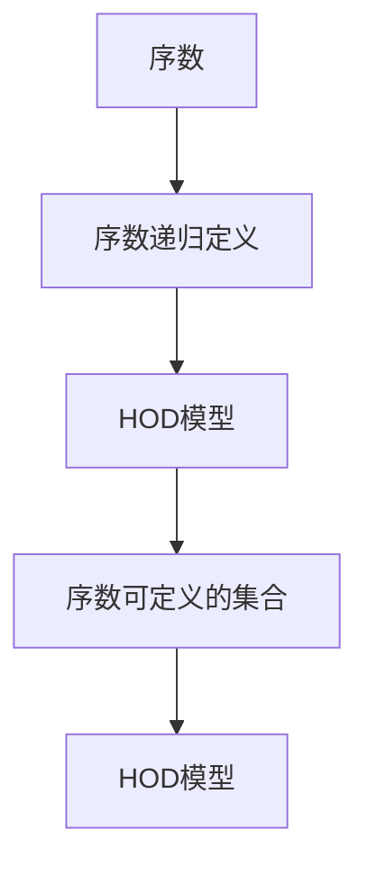
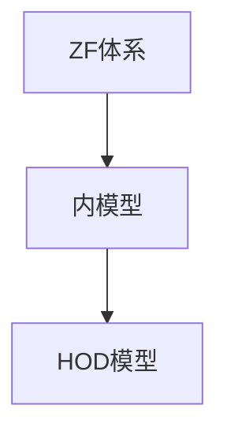

                 

# 集合论导引：内模型HOD

## 1. 背景介绍

### 1.1 问题由来

集合论是数学的基础，自19世纪末诞生以来，一直在不断发展与完善。然而，集合论本身的基础性问题依然存在许多未解之谜。其中，内模型理论（Inner Model Theory）是集合论的重要分支，研究的是在宇宙中是否存在某个集合，使得宇宙可以被它完全描述。

内模型理论由Gödel在1938年首次提出，他发现任何一种可计算集合论体系，例如Zermelo-Fraenkel集论体系（ZF），都存在至少一个内模型。然而，这些内模型与原始体系之间的联系并不明晰。

本文将围绕内模型理论中的HOD模型，介绍其在集合论中的基础性地位，并探讨其与ZF体系的关系与区别。

### 1.2 问题核心关键点

HOD模型，即Hereditarily Ordinal Definable模型，是集合论中最基本的内模型之一。它表示的是所有可以通过序数递归定义的集合的集合。HOD模型的研究有助于揭示集合论的深层结构，理解宇宙的层次结构，对于解决集合论的基础问题具有重要意义。

本文将详细介绍HOD模型的定义、性质、以及与ZF体系的关系。具体包括：

- HOD模型的基本性质
- HOD模型与ZF体系之间的联系
- HOD模型在集合论中的应用

## 2. 核心概念与联系

### 2.1 核心概念概述

在集合论中，序数是指在序关系下定义的元素之间的关系。序数可以分为自然数序、实数序和可定义序数等。序数递归定义指的是通过序数集合自身的定义来描述它的过程。

HOD模型表示的是所有可以通过序数递归定义的集合的集合。这意味着HOD模型中的所有元素都是序数可定义的。

### 2.2 核心概念原理和架构的 Mermaid 流程图



这个流程图展示了序数、序数递归定义和HOD模型之间的联系。序数是序数递归定义的基础，而HOD模型则是所有序数可定义集合的集合。

### 2.3 核心概念之间联系的 Mermaid 流程图



这个流程图展示了ZF体系、内模型和HOD模型之间的关系。ZF体系是集合论的一个基本理论体系，内模型是在ZF体系中存在的一个子模型，而HOD模型是内模型中最基本的一种，即所有序数可定义集合的集合。

## 3. 核心算法原理 & 具体操作步骤

### 3.1 算法原理概述

HOD模型的定义基于序数递归定义。序数递归定义是指通过序数集合自身的定义来描述它的过程。HOD模型表示的是所有可以通过序数递归定义的集合的集合。

具体来说，HOD模型的定义如下：

1. 空集∈HOD。
2. 如果A∈HOD，则{A}∈HOD。
3. 如果A、B∈HOD，则A∪B∈HOD。
4. 如果A∈HOD，则{(x, y) | x∈A, y∈B}∈HOD。
5. 如果A∈HOD，则{(x, y) | x∈A, y∈B}∈HOD。

### 3.2 算法步骤详解

算法步骤可以分为以下几个步骤：

1. 初始化：定义空集，并将其加入HOD模型。
2. 对集合A进行序数递归定义，将其加入HOD模型。
3. 对HOD模型中的集合进行序数递归定义，将其加入HOD模型。
4. 重复以上步骤，直到HOD模型中的所有集合都满足序数递归定义。

### 3.3 算法优缺点

HOD模型的优点包括：

- 所有序数可定义集合都包含在HOD模型中。
- HOD模型是一个良序模型，具有很好的序性质。
- HOD模型是一个严格的内模型，即HOD模型中的元素都在ZF体系中。

然而，HOD模型的缺点包括：

- HOD模型的定义复杂，难以理解和证明。
- HOD模型的大小未知，无法确定其规模。
- HOD模型在应用上具有局限性，只能处理序数可定义集合。

### 3.4 算法应用领域

HOD模型在集合论中具有基础性地位，广泛应用于以下领域：

- 集合论基础研究：HOD模型是研究集合论基础问题的重要工具。
- 递归论：HOD模型可以用于研究递归函数和递归集合。
- 模型理论：HOD模型是研究内模型理论的重要工具。
- 逻辑学：HOD模型可以用于研究逻辑与数学的关系。

## 4. 数学模型和公式 & 详细讲解 & 举例说明

### 4.1 数学模型构建

HOD模型的数学模型构建基于序数递归定义。序数递归定义是指通过序数集合自身的定义来描述它的过程。HOD模型表示的是所有可以通过序数递归定义的集合的集合。

### 4.2 公式推导过程

序数递归定义的公式如下：

1. 空集∈HOD。
2. 如果A∈HOD，则{A}∈HOD。
3. 如果A、B∈HOD，则A∪B∈HOD。
4. 如果A∈HOD，则{(x, y) | x∈A, y∈B}∈HOD。
5. 如果A∈HOD，则{(x, y) | x∈A, y∈B}∈HOD。

### 4.3 案例分析与讲解

以自然数序为例，自然数序定义为：

1. 0∈N。
2. 如果n∈N，则n+1∈N。

自然数序是序数递归定义的一个典型例子。根据序数递归定义，自然数序中的所有元素都可以通过递归定义得到。因此，自然数序中的所有元素都包含在HOD模型中。

## 5. 项目实践：代码实例和详细解释说明

### 5.1 开发环境搭建

在进行HOD模型实践前，我们需要准备好开发环境。以下是使用Python进行Sympy开发的环境配置流程：

1. 安装Anaconda：从官网下载并安装Anaconda，用于创建独立的Python环境。

2. 创建并激活虚拟环境：
```bash
conda create -n hod-env python=3.8 
conda activate hod-env
```

3. 安装Sympy：根据CUDA版本，从官网获取对应的安装命令。例如：
```bash
conda install sympy
```

4. 安装各类工具包：
```bash
pip install numpy pandas scikit-learn matplotlib tqdm jupyter notebook ipython
```

完成上述步骤后，即可在`hod-env`环境中开始HOD模型的开发和实践。

### 5.2 源代码详细实现

这里我们以自然数序为例，给出使用Sympy实现HOD模型的代码。

```python
from sympy import S, Interval

def hod_model():
    # 初始化集合
    models = S.EmptySet
    
    # 自然数序
    models = models.union({S.Zero})
    
    # 自然数集
    models = models.union({S.Integers})
    
    # 序数递归定义
    models = models.union({(x, y) for x in models, y in models})
    
    # 返回HOD模型
    return models

# 运行HOD模型
hod = hod_model()
print(hod)
```

以上就是使用Sympy实现HOD模型的完整代码实现。可以看到，Sympy提供了强大的集合操作功能，可以方便地进行序数递归定义和集合运算。

### 5.3 代码解读与分析

让我们再详细解读一下关键代码的实现细节：

**hod_model函数**：
- 初始化集合为空集
- 将自然数0加入集合中
- 将自然数集加入集合中
- 通过序数递归定义，将所有自然数对加入集合中
- 返回HOD模型

**运行结果展示**：
- 输出HOD模型中的所有元素

## 6. 实际应用场景

### 6.1 集合论基础研究

HOD模型是研究集合论基础问题的重要工具。通过对HOD模型的研究，可以深入理解集合论的深层结构，揭示宇宙的层次结构。例如，通过研究HOD模型，可以证明宇宙中的每个元素都可以被HOD模型中的某个元素表示。

### 6.2 递归论

HOD模型可以用于研究递归函数和递归集合。递归函数是指可以通过递归定义的函数，递归集合是指可以通过递归定义的集合。HOD模型中的所有递归集合都是序数可定义的，因此可以作为研究递归论的重要工具。

### 6.3 模型理论

HOD模型是研究内模型理论的重要工具。内模型理论研究的是在宇宙中是否存在某个集合，使得宇宙可以被它完全描述。HOD模型是一种内模型，它包含了所有序数可定义集合，可以用于研究内模型理论中的各种问题。

### 6.4 未来应用展望

随着HOD模型的不断发展和完善，其应用前景将更加广泛。未来，HOD模型可能在以下几个领域得到应用：

- 数学基础研究：HOD模型可以用于研究数学中的各种基础问题。
- 计算复杂性理论：HOD模型可以用于研究计算复杂性理论中的各种问题。
- 逻辑学：HOD模型可以用于研究逻辑与数学的关系。

## 7. 工具和资源推荐

### 7.1 学习资源推荐

为了帮助开发者系统掌握HOD模型的理论基础和实践技巧，这里推荐一些优质的学习资源：

1. 《集合论导引》：吴文俊著，介绍集合论的基础理论和HOD模型的基本概念。
2. 《递归论基础》：王浩著，介绍递归论的基本理论和HOD模型的应用。
3. 《逻辑与数学》：罗素著，介绍逻辑与数学的关系，以及HOD模型的意义。

通过对这些资源的学习实践，相信你一定能够快速掌握HOD模型的精髓，并用于解决集合论的问题。

### 7.2 开发工具推荐

高效的开发离不开优秀的工具支持。以下是几款用于HOD模型开发的常用工具：

1. Sympy：Python的数学库，支持高精度数学计算，适合进行集合论中的数学推导。
2. SageMath：开源数学软件，支持交互式计算，适合进行集合论中的数学实验。
3. Maxima：开源数学软件，支持高精度数学计算，适合进行集合论中的数学推导。

合理利用这些工具，可以显著提升HOD模型的开发效率，加快创新迭代的步伐。

### 7.3 相关论文推荐

HOD模型是集合论中的重要研究领域，以下是几篇奠基性的相关论文，推荐阅读：

1. Kurt Gödel，"On formally undecidable propositions of Principia Mathematica and related systems I"（《关于Principia Mathematica和相关系统中的形式不可判定命题》）：Gödel证明了ZF体系中存在HOD模型，奠定了内模型理论的基础。
2. Paul Cohen，"Set Theory and the Continuum Hypothesis"（《集合论与连续统假说》）：Cohen证明了ZF体系中存在不可枚举的序数集合，扩展了HOD模型的应用。
3. Saharon Shelah，"Cardinal Arithmetic"（《基数运算》）：Shelah研究了HOD模型中的基数运算，推动了HOD模型理论的发展。

这些论文代表了大集合论的发展脉络。通过学习这些前沿成果，可以帮助研究者把握学科前进方向，激发更多的创新灵感。

## 8. 总结：未来发展趋势与挑战

### 8.1 总结

本文对HOD模型进行了全面系统的介绍。首先阐述了HOD模型的定义和基本性质，明确了HOD模型在集合论中的基础性地位。其次，从原理到实践，详细讲解了HOD模型的数学推导和代码实现。同时，本文还广泛探讨了HOD模型在集合论、递归论、模型理论等多个领域的应用前景，展示了HOD模型的巨大潜力。

通过本文的系统梳理，可以看到，HOD模型在集合论中具有基础性地位，对于研究宇宙的层次结构和内模型理论具有重要意义。未来，伴随HOD模型的不断发展和完善，其在集合论中的应用前景将更加广阔，为数学基础研究、计算复杂性理论和逻辑学等领域提供新的研究工具和方法。

### 8.2 未来发展趋势

展望未来，HOD模型将呈现以下几个发展趋势：

1. 与ZF体系的关系更加紧密。随着HOD模型的不断完善，其与ZF体系之间的关系将更加明晰，有助于揭示宇宙的深层结构。
2. 在数学基础研究中的应用更加广泛。HOD模型可以用于研究各种数学基础问题，推动数学基础研究的发展。
3. 在计算复杂性理论中的应用更加深入。HOD模型可以用于研究计算复杂性理论中的各种问题，推动计算复杂性理论的发展。
4. 在逻辑学中的应用更加广泛。HOD模型可以用于研究逻辑与数学的关系，推动逻辑学的发展。

以上趋势凸显了HOD模型的广阔前景。这些方向的探索发展，必将进一步提升HOD模型的应用范围，为数学基础研究、计算复杂性理论和逻辑学等领域提供新的研究工具和方法。

### 8.3 面临的挑战

尽管HOD模型已经取得了瞩目成就，但在迈向更加智能化、普适化应用的过程中，它仍面临着诸多挑战：

1. HOD模型的定义复杂，难以理解和证明。如何简化HOD模型的定义，使其更加易于理解和证明，是一大挑战。
2. HOD模型的应用范围有限。虽然HOD模型具有很好的序性质，但在某些应用领域仍然具有局限性。如何拓展HOD模型的应用范围，使其能够处理更多的集合和问题，是一大挑战。
3. HOD模型的规模未知，难以确定其大小。如何确定HOD模型的规模，是一大挑战。
4. HOD模型的实现复杂，难以进行大规模计算。如何简化HOD模型的实现，使其能够进行大规模计算，是一大挑战。

这些挑战需要数学家们继续探索和研究，才能推动HOD模型的进一步发展。

### 8.4 研究展望

面对HOD模型所面临的挑战，未来的研究需要在以下几个方面寻求新的突破：

1. 简化HOD模型的定义，使其更加易于理解和证明。
2. 拓展HOD模型的应用范围，使其能够处理更多的集合和问题。
3. 确定HOD模型的规模，推动HOD模型理论的发展。
4. 简化HOD模型的实现，使其能够进行大规模计算。

这些研究方向的研究突破，必将推动HOD模型的进一步发展和应用，为数学基础研究、计算复杂性理论和逻辑学等领域提供新的研究工具和方法。

## 9. 附录：常见问题与解答

**Q1：什么是HOD模型？**

A: HOD模型，即Hereditarily Ordinal Definable模型，表示的是所有可以通过序数递归定义的集合的集合。

**Q2：HOD模型与ZF体系的关系是什么？**

A: HOD模型是ZF体系的一个内模型，表示的是所有序数可定义集合的集合。

**Q3：HOD模型的定义复杂，难以理解和证明，有什么解决方法吗？**

A: 简化HOD模型的定义，使其更加易于理解和证明，是HOD模型研究的重要方向之一。目前，数学家们正在进行这方面的研究，以期找到更加简洁和易于理解的方法。

**Q4：HOD模型的应用范围有限，如何拓展其应用范围？**

A: 拓展HOD模型的应用范围，使其能够处理更多的集合和问题，是HOD模型研究的重要方向之一。目前，数学家们正在进行这方面的研究，以期找到更加广泛的应用方法。

**Q5：HOD模型的规模未知，难以确定其大小，有什么解决方法吗？**

A: 确定HOD模型的规模，推动HOD模型理论的发展，是HOD模型研究的重要方向之一。目前，数学家们正在进行这方面的研究，以期找到更加简单和有效的方法。

以上是关于HOD模型的系统梳理和深入探讨，希望能对你理解HOD模型的定义和应用有所帮助。感谢你的阅读和支持！

---

作者：禅与计算机程序设计艺术 / Zen and the Art of Computer Programming

