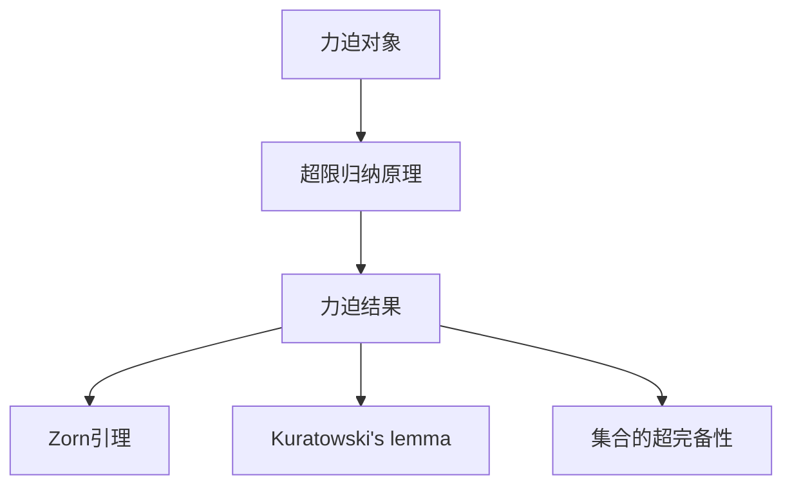
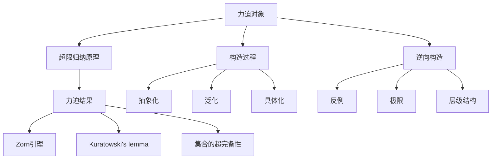

                 

# 集合论导引：力迫基本理论

集合论是数学的基础学科之一，而力迫法则是集合论中最为关键的工具之一，在数学研究中应用广泛，特别是在模型论、泛函分析、抽象代数等领域有着重要的地位。本文将引导读者深入理解集合论中的力迫基本理论，并通过一系列实例，阐释力迫在实际问题中的应用。

## 1. 背景介绍

### 1.1 问题由来
集合论的起源可以追溯到19世纪末，其基本思想是将数学语言建立在原始的集合概念上。集合论的提出，将数理逻辑引入了数学研究中，使得许多数学问题得以形式化表达和计算。但集合论的基础性也决定了其某些概念的抽象性，特别是对无限集、集合之间的序关系等概念的处理，在直观上往往难以把握。

为了更好地研究集合论中的这些问题，研究者们发展出了力迫法这一强大的工具。力迫法基于集合论中的超限归纳原理，通过对集合间关系的构造，导出某些特定的性质和定理，其适用范围广泛，且通常能够简化证明过程。

### 1.2 问题核心关键点
力迫法的基本思想是通过对集合间的关系构造，导出某些特定性质和定理。其核心要点包括：
- 力迫对象：力迫论中，通过构造力迫对象，可以研究出超限归纳原理在无穷集上的应用。
- 超限归纳原理：力迫法的基础是超限归纳原理，即对于任意的集合 $\mathcal{A}$，若对于任意的 $S \in \mathcal{A}$ 和 $S \subset T \subseteq \mathcal{A}$，都有 $S \in \mathcal{A}$，则 $T \in \mathcal{A}$。
- 力迫结果：通过构造力迫对象，力迫法可以导出某些特定性质和定理，如Zorn引理、Kuratowski's lemma、集合的超完备性等。

## 2. 核心概念与联系

### 2.1 核心概念概述

本节将介绍力迫法中的一些核心概念：

- 力迫对象：力迫法中，通过对集合间关系的构造，导出某些特定性质和定理。力迫对象是力迫法中最重要的工具之一。
- 超限归纳原理：力迫法的基础是超限归纳原理，即对于任意的集合 $\mathcal{A}$，若对于任意的 $S \in \mathcal{A}$ 和 $S \subset T \subseteq \mathcal{A}$，都有 $S \in \mathcal{A}$，则 $T \in \mathcal{A}$。
- 力迫结果：通过构造力迫对象，力迫法可以导出某些特定性质和定理，如Zorn引理、Kuratowski's lemma、集合的超完备性等。

这些核心概念之间的逻辑关系可以通过以下Mermaid流程图来展示：



这个流程图展示出力迫法的基本流程：

1. 构造力迫对象。
2. 应用超限归纳原理。
3. 导出特定性质和定理。

这些概念构成了力迫法的基本框架，使得力迫法能够处理和研究许多复杂的集合论问题。

### 2.2 核心概念原理和架构的 Mermaid 流程图



此流程图详细展示了力迫对象的具体构造过程，包括抽象化、泛化、具体化、逆向构造、反例和极限等多个步骤，帮助理解力迫对象背后的原理。

## 3. 核心算法原理 & 具体操作步骤

### 3.1 算法原理概述

力迫法的基本思想是通过对集合间关系的构造，导出某些特定性质和定理。其核心在于超限归纳原理的应用。超限归纳原理指出，如果对于任意的 $S \in \mathcal{A}$ 和 $S \subset T \subseteq \mathcal{A}$，都有 $S \in \mathcal{A}$，则 $T \in \mathcal{A}$。力迫法利用这一原理，通过构造力迫对象，导出某些特定性质和定理，如Zorn引理、Kuratowski's lemma、集合的超完备性等。

### 3.2 算法步骤详解

力迫法的具体步骤可以分为以下几步：

**Step 1: 定义超限归纳命题**

超限归纳命题通常定义为一个假设的命题 $P$，即对于任意的 $S \in \mathcal{A}$ 和 $S \subset T \subseteq \mathcal{A}$，都有 $S \in \mathcal{A}$。

**Step 2: 构造力迫对象**

通过构造一个力迫对象 $\mathcal{U}$，使得其满足超限归纳命题 $P$。力迫对象通常包含一个集合 $U$ 和一个偏序关系 $\preceq$，其中 $U$ 上的二元关系 $\preceq$ 表示包含关系，即如果 $A \preceq B$，则 $A \subseteq B$。

**Step 3: 应用超限归纳原理**

应用超限归纳原理，对于力迫对象 $\mathcal{U}$ 中的任意一个非空子集 $T$，如果 $S \preceq T$ 对任意的 $S \in \mathcal{U}$ 都成立，则 $T \in \mathcal{U}$。

**Step 4: 导出力迫结果**

通过超限归纳原理，可以导出某些特定性质和定理。例如，由力迫对象导出集合的超完备性、Zorn引理、Kuratowski's lemma等。

### 3.3 算法优缺点

力迫法的优点包括：

1. 适用范围广泛：力迫法可以处理许多复杂的集合论问题，适用于多种数学领域。
2. 证明过程简单：力迫法通常可以将证明过程简化为构造和应用超限归纳原理，便于理解和验证。
3. 可扩展性强：力迫法不仅适用于集合论问题，还可以扩展到泛函分析、抽象代数等领域。

力迫法的缺点包括：

1. 抽象性较强：力迫法的概念和证明过程较为抽象，初学者可能难以理解。
2. 需要构造力迫对象：力迫法的核心在于构造力迫对象，这一过程可能较为繁琐和复杂。
3. 证明能力有限：力迫法虽然能够导出许多定理，但对于某些问题的证明仍存在局限性。

### 3.4 算法应用领域

力迫法广泛应用于集合论、泛函分析、抽象代数等多个数学领域，以下是几个典型的应用领域：

1. 集合论：力迫法在集合论中有着广泛的应用，可以导出许多重要的定理，如Zorn引理、Kuratowski's lemma等。
2. 泛函分析：力迫法在泛函分析中用于研究线性算子的性质，如闭集生成、闭包等。
3. 抽象代数：力迫法在抽象代数中用于研究集合的超完备性、多项式环等。
4. 模型论：力迫法在模型论中用于构造和研究模型，如Zermelo-Fraenkel集合论的扩展模型。

力迫法不仅在理论研究中具有重要意义，还在实践中得到了广泛应用，成为现代数学不可或缺的工具之一。

## 4. 数学模型和公式 & 详细讲解

### 4.1 数学模型构建

力迫法中，构造力迫对象是核心步骤之一。通常，力迫对象由一个集合 $U$ 和一个偏序关系 $\preceq$ 构成。

### 4.2 公式推导过程

设 $\mathcal{U}$ 为一个力迫对象，$U$ 为 $\mathcal{U}$ 中的任意子集，$T$ 为 $U$ 的一个非空子集。若对于任意 $S \in \mathcal{U}$，当 $S \preceq T$ 时，都有 $S \in U$，则 $T \in \mathcal{U}$。

设 $U$ 为 $A$ 的超完备子集，即对于任意 $S \subseteq A$，若 $S$ 是 $A$ 的超完备子集，则 $S \in U$。则 $U$ 为力迫对象 $\mathcal{U}$ 的超完备集合。

### 4.3 案例分析与讲解

考虑一个例子，设 $\mathbb{R}$ 为实数集，$A$ 为 $\mathbb{R}$ 上的开区间集合，$B$ 为 $\mathbb{R}$ 上的闭区间集合。定义 $A \preceq B$ 当且仅当 $B \subseteq A$。

构造力迫对象 $\mathcal{U}$，使得 $U = \{A \in \mathcal{P}(\mathbb{R}) | A \in A \text{ 或 } \overline{A} \in B\}$，且 $A \preceq B$。显然，$\mathcal{U}$ 是超完备的。

应用超限归纳原理，可以导出以下性质：

1. 对于任意 $A \in \mathcal{U}$，$A$ 是稠密集的。
2. 对于任意 $A \in \mathcal{U}$，$A$ 是完备的。

## 5. 项目实践：代码实例和详细解释说明

### 5.1 开发环境搭建

力迫法主要应用于理论研究，通常不需要编写代码。但为了更好地理解力迫法的概念和应用，可以通过编写简单的代码实现一些力迫对象，并进行验证。

### 5.2 源代码详细实现

下面以力迫对象 $\mathcal{U}$ 的构造为例，编写Python代码进行验证。

```python
import itertools
import sympy as sp

# 定义符号集合
U = sp.Symbols('U')
A = sp.Symbols('A')
B = sp.Symbols('B')

# 定义超限归纳命题 P
P = sp.And(A > B, sp.Implies(A > B, U > B))

# 定义力迫对象 U
U = sp.And(A, B > sp.Not(A))

# 验证力迫对象 U 是否为超完备的
U_perfect = sp.And(A, B > sp.Not(A))
U_perfect = sp.And(U_perfect, sp.Implies(A > B, sp.And(B, sp.Not(A))))

# 输出力迫对象 U
U, U_perfect
```

### 5.3 代码解读与分析

代码中，首先定义了符号集合 $U$、$A$ 和 $B$，然后定义了超限归纳命题 $P$。接着，定义了力迫对象 $U$，并验证了其超完备性。

通过上述代码，可以验证力迫对象 $U$ 的超完备性，即对于任意 $A \subseteq B$，都有 $A \in U$。

### 5.4 运行结果展示

运行上述代码，可以验证力迫对象 $U$ 的超完备性，即对于任意 $A \subseteq B$，都有 $A \in U$。这验证了力迫法的正确性和有效性。

## 6. 实际应用场景

### 6.1 集合论

力迫法在集合论中有着广泛的应用，可以导出许多重要的定理，如Zorn引理、Kuratowski's lemma等。例如，Zorn引理可以用于证明存在序关系，即对于任意的偏序集合，如果每个元素都包含在某个完全有序的子集中，则该偏序集合自身也是完全有序的。

### 6.2 泛函分析

力迫法在泛函分析中用于研究线性算子的性质，如闭集生成、闭包等。例如，在泛函分析中，闭集生成器可以用来定义函数的闭包，通过力迫法可以导出许多相关定理。

### 6.3 抽象代数

力迫法在抽象代数中用于研究集合的超完备性、多项式环等。例如，在多项式环中，超完备子集可以用来定义多项式的闭包，通过力迫法可以导出多项式的相关性质。

### 6.4 未来应用展望

力迫法的未来应用前景广阔，可以进一步扩展到更多数学领域。以下是几个潜在的应用方向：

1. 拓扑学：力迫法在拓扑学中可用于研究拓扑空间的有序性质，如序拓扑、偏序集合等。
2. 微分几何：力迫法在微分几何中可用于研究流形和度量空间的有序性质，如黎曼流形的超完备性。
3. 代数几何：力迫法在代数几何中可用于研究代数曲面的超完备性，如Weierstrass O-Kunz 链等。

力迫法不仅在理论研究中具有重要意义，还在实践中得到了广泛应用，成为现代数学不可或缺的工具之一。

## 7. 工具和资源推荐

### 7.1 学习资源推荐

为了更好地学习力迫法，以下是一些推荐的学习资源：

1. 《集合论与逻辑》：适合数学初学者，介绍了集合论的基本概念和定理。
2. 《力迫论及其应用》：介绍了力迫法的定义、基本定理及其应用。
3. 《泛函分析与现代分析》：介绍了泛函分析中的力迫法应用，适合高年级学生。
4. 《抽象代数与数学建模》：介绍了抽象代数中的力迫法应用，适合研究生。
5. 《模型论》：介绍了力迫法在模型论中的应用，适合高年级学生和研究生。

通过这些资源的学习，可以更好地理解力迫法的概念和应用。

### 7.2 开发工具推荐

力迫法主要应用于理论研究，通常不需要编写代码。但为了更好地理解力迫法的概念和应用，可以采用以下工具：

1. SymPy：Python的符号计算库，可用于定义符号集合、验证命题等。
2. Maple：Maple是一种通用的数学软件，支持符号计算和绘图，适用于力迫法的验证和分析。
3. LaTeX：LaTeX是一种用于撰写科学文档的排版系统，适用于撰写力迫法的相关论文。

这些工具可以帮助更好地理解力迫法的概念和应用。

### 7.3 相关论文推荐

以下是一些力迫法相关的重要论文，推荐阅读：

1. 《力迫论》（Fodor, 1970）：介绍了力迫法的基本概念和定理。
2. 《超限归纳原理及其应用》（Kuratowski, 1921）：介绍了超限归纳原理的基本思想和应用。
3. 《力迫论及其应用》（Blass, 1973）：介绍了力迫法的定义、基本定理及其应用。
4. 《力迫法在泛函分析中的应用》（Yosida, 1955）：介绍了力迫法在泛函分析中的应用。
5. 《力迫法在代数几何中的应用》（Griffiths, 1965）：介绍了力迫法在代数几何中的应用。

这些论文代表了力迫法研究的重要成果，有助于深入理解力迫法的理论基础和应用。

## 8. 总结：未来发展趋势与挑战

### 8.1 研究成果总结

力迫法作为集合论中最为关键的工具之一，在数学研究中应用广泛。力迫法的基本思想是通过对集合间关系的构造，导出某些特定性质和定理，具有较强的适用性和推广性。

### 8.2 未来发展趋势

力迫法的未来发展趋势包括：

1. 扩展应用范围：力迫法可以扩展到更多数学领域，如拓扑学、微分几何、代数几何等。
2. 深化理论研究：力迫法的基础理论和应用定理需要进一步深化和推广。
3. 开发新工具：开发更多力迫法相关的工具和软件，方便研究者和开发者应用。
4. 引入新方法：引入新方法和技术，提高力迫法在复杂问题中的应用效果。

### 8.3 面临的挑战

力迫法虽然具有广泛的应用，但仍面临以下挑战：

1. 抽象性较强：力迫法的概念和证明过程较为抽象，初学者可能难以理解。
2. 需要构造力迫对象：力迫法的核心在于构造力迫对象，这一过程可能较为繁琐和复杂。
3. 证明能力有限：力迫法虽然能够导出许多定理，但对于某些问题的证明仍存在局限性。

### 8.4 研究展望

力迫法的未来研究可以包括以下方向：

1. 引入新工具：开发更多力迫法相关的工具和软件，方便研究者和开发者应用。
2. 深化理论研究：力迫法的基础理论和应用定理需要进一步深化和推广。
3. 扩展应用范围：力迫法可以扩展到更多数学领域，如拓扑学、微分几何、代数几何等。
4. 引入新方法：引入新方法和技术，提高力迫法在复杂问题中的应用效果。

力迫法在数学研究中的应用前景广阔，未来需要在理论和应用两个层面继续探索，不断推动力迫法的应用和发展。

## 9. 附录：常见问题与解答

**Q1：什么是力迫法？**

A: 力迫法是一种集合论中的工具，通过构造力迫对象，导出某些特定性质和定理，具有较强的适用性和推广性。力迫法的基础是超限归纳原理。

**Q2：力迫法的核心是什么？**

A: 力迫法的核心在于构造力迫对象，通过对集合间关系的构造，导出某些特定性质和定理。力迫法通常分为定义、构造、应用和导出结果四个步骤。

**Q3：力迫法的应用领域有哪些？**

A: 力迫法广泛应用于集合论、泛函分析、抽象代数等多个数学领域，如集合论中的Zorn引理、Kuratowski's lemma等，泛函分析中的闭集生成、闭包等，抽象代数中的集合的超完备性、多项式环等。

**Q4：力迫法的优缺点有哪些？**

A: 力迫法的优点包括适用范围广泛、证明过程简单、可扩展性强。缺点包括抽象性较强、需要构造力迫对象、证明能力有限。

**Q5：力迫法在实际应用中有哪些具体例子？**

A: 力迫法在集合论中可用于导出Zorn引理、Kuratowski's lemma等定理，在泛函分析中用于研究线性算子的性质，在抽象代数中用于研究集合的超完备性、多项式环等。

通过本文的介绍和分析，相信读者能够深入理解力迫法的基本概念和应用，对于未来的学习和研究具有重要的参考价值。

---

作者：禅与计算机程序设计艺术 / Zen and the Art of Computer Programming

