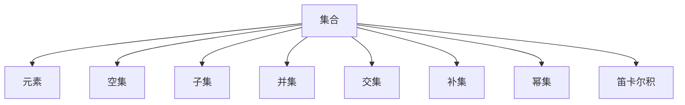

                 

# 集合论导引：集合论语言

## 1. 背景介绍

### 1.1 问题由来
集合论作为数学的一个基本分支，其思想和方法不仅在数学本身，而且在科学、工程、哲学等诸多领域都有着广泛的应用。在计算机科学领域，集合论更是成为了许多理论模型和算法的基础，从程序逻辑、数据结构，到机器学习、人工智能，都离不开集合论的支撑。

然而，集合论的抽象性和概念的复杂性，使得很多初学者望而却步。本文旨在通过系统地介绍集合论的核心概念和语言，帮助读者建立坚实的数学基础，掌握集合论的基本思想和方法。

### 1.2 问题核心关键点
本文将聚焦于以下几个核心问题：

1. 什么是集合？如何定义和表示集合？
2. 如何理解和描述集合中的元素及其关系？
3. 集合的基本运算和性质有哪些？如何运用这些运算法则进行集合的扩展和转换？
4. 集合论与计算机科学的联系在哪里？如何应用于程序设计、数据结构、算法分析等实际问题？

## 2. 核心概念与联系

### 2.1 核心概念概述

为更好地理解集合论的核心概念，本节将介绍几个密切相关的核心概念：

- 集合(Set)：由零个或多个元素组成、具有明确边界的整体。
- 元素(Element)：组成集合的基本单元，可以是任何对象，如数字、字母、图像等。
- 空集(Empty Set)：不含任何元素的集合，通常用符号 $\emptyset$ 表示。
- 子集(Subset)：一个集合中的元素全部属于另一个集合，则称前者为后者的子集。
- 并集(Union)：两个或多个集合中所有元素的集合。
- 交集(Intersection)：两个或多个集合中共有的元素组成的集合。
- 补集(Complement)：一个集合中不属于另一个集合的所有元素组成的集合。
- 幂集(Power Set)：一个集合的所有子集组成的集合。
- 笛卡尔积(Cartesian Product)：两个集合中元素一一对应的集合。

这些核心概念之间的逻辑关系可以通过以下Mermaid流程图来展示：



这个流程图展示了几大核心概念及其之间的关系：

1. 集合由元素组成。
2. 空集和子集是集合的重要组成部分。
3. 并集、交集和补集用于描述集合间的关系。
4. 幂集和笛卡尔积扩展了集合的运算和应用范围。

## 3. 核心算法原理 & 具体操作步骤

### 3.1 算法原理概述

集合论的核心思想是抽象和组合。通过抽象出集合和元素的基本概念，并运用数学的语言和工具，可以分析和处理各种复杂的问题。集合论的算法原理主要体现在以下几个方面：

- 集合的定义与表示：使用集合符号和符号表达式，定义和表示各种类型的集合。
- 集合的运算与性质：运用集合的并、交、补等基本运算，描述集合间的相互关系，并利用这些性质进行集合的扩展和转换。
- 集合的应用与实例：将集合论的思想和方法应用于具体问题，如程序设计、数据结构、算法分析等。

### 3.2 算法步骤详解

集合论的算法步骤如下：

1. **定义集合**：明确集合的元素及其特性。
2. **表示集合**：使用集合符号和表达式，准确地表示集合。
3. **运算集合**：应用并集、交集、补集等基本运算，进行集合的组合和转换。
4. **验证性质**：验证集合的性质是否满足定义，如互异性、唯一性、无序性等。
5. **解决实际问题**：将集合论的方法应用于具体的实际问题，如算法分析、程序设计、数据结构等。

### 3.3 算法优缺点

集合论的算法具有以下优点：

1. 高度抽象：集合论提供了高层次的数学抽象，适用于解决各种类型的问题。
2. 形式化表达：通过符号表达式，可以精确地描述集合和运算。
3. 系统化推理：集合论的逻辑体系严谨，可以通过形式化推理得出结论。

同时，该算法也存在一定的局限性：

1. 复杂度高：集合论的概念和运算较为复杂，对学习者的数学基础要求较高。
2. 应用范围有限：集合论主要适用于处理离散数据，对于连续数据和实际问题可能需要结合其他数学工具。
3. 难以直观理解：集合论的抽象概念需要一定的理解力和想象能力，对初学者而言可能难以直接应用。

### 3.4 算法应用领域

集合论在计算机科学中有着广泛的应用，涉及以下几个主要领域：

- 数据结构：如数组、链表、树、图等，均可以通过集合论的语言来描述和分析。
- 算法设计：如排序算法、搜索算法、图算法等，都依赖于集合论的数学基础。
- 程序语言：如函数式编程语言，依赖于集合论的原理进行逻辑描述和处理。
- 形式化验证：如模型检测、定理证明等，集合论提供了一种形式化的推理框架。
- 人工智能：如知识表示、推理、规划等，集合论是其中的基础工具。

## 4. 数学模型和公式 & 详细讲解

### 4.1 数学模型构建

集合论的数学模型主要涉及以下基本概念和运算：

- 集合符号：$\emptyset$（空集）、$U$（全集）、$A \cup B$（并集）、$A \cap B$（交集）、$A^c$（补集）、$P(A)$（幂集）、$A \times B$（笛卡尔积）等。
- 集合运算：并集、交集、补集、差集、对称差、笛卡尔积等。
- 集合性质：互异性、唯一性、无序性、完备性、封闭性、对称性等。

### 4.2 公式推导过程

以并集和交集为例，推导集合的基本运算公式：

- 并集公式：$A \cup B = \{ x \mid x \in A \text{ or } x \in B \}$
- 交集公式：$A \cap B = \{ x \mid x \in A \text{ and } x \in B \}$

对于两个集合 $A$ 和 $B$，其并集 $A \cup B$ 包含所有属于 $A$ 或 $B$ 的元素，而交集 $A \cap B$ 包含所有同时属于 $A$ 和 $B$ 的元素。

使用集合运算的性质，可以推导出更多复杂的公式和关系。例如，德摩根定律（De Morgan's Laws）描述了逻辑运算与集合运算之间的对应关系：

- 德摩根第一定律：$\lnot (A \cup B) = \lnot A \cap \lnot B$
- 德摩根第二定律：$\lnot (A \cap B) = \lnot A \cup \lnot B$

这些定律在逻辑电路设计和程序设计中都有广泛应用。

### 4.3 案例分析与讲解

下面以程序设计中的列表为例，分析集合论的运用：

```python
my_list = [1, 2, 3, 4, 5]
my_set = set(my_list)

# 计算并集
union_set = my_set.union(my_list)

# 计算交集
intersection_set = my_set.intersection(my_list)

# 计算差集
difference_set = my_set.difference(my_list)

# 计算对称差
symmetric_difference_set = my_set.symmetric_difference(my_list)

print("并集：", union_set)
print("交集：", intersection_set)
print("差集：", difference_set)
print("对称差：", symmetric_difference_set)
```

在这个例子中，我们首先将列表转换为集合，然后使用集合的运算方法计算并集、交集、差集和对称差。可以看到，集合论的方法可以方便地应用于程序设计中的数据结构操作。

## 5. 项目实践：代码实例和详细解释说明

### 5.1 开发环境搭建

在进行集合论的实践前，我们需要准备好开发环境。以下是使用Python进行集合论开发的环境配置流程：

1. 安装Python：从官网下载并安装Python，建议使用最新版本的Python 3.x。
2. 安装PySet库：使用pip安装PySet库，用于进行集合运算。
```bash
pip install PySet
```

完成上述步骤后，即可在Python环境中开始集合论的实践。

### 5.2 源代码详细实现

下面以集合的创建、运算和可视化为例，给出Python代码实现：

```python
import matplotlib.pyplot as plt
import seaborn as sns
from collections import Counter

# 创建集合
set1 = {1, 2, 3, 4, 5}
set2 = {3, 4, 5, 6, 7}

# 并集
union_set = set1.union(set2)
print("并集：", union_set)

# 交集
intersection_set = set1.intersection(set2)
print("交集：", intersection_set)

# 差集
difference_set = set1.difference(set2)
print("差集：", difference_set)

# 对称差
symmetric_difference_set = set1.symmetric_difference(set2)
print("对称差：", symmetric_difference_set)

# 可视化交集和差集
fig, ax = plt.subplots()
sns.scatterplot(x=set1, y=set2)
plt.title("交集和差集可视化")
plt.show()
```

在这个例子中，我们首先创建了两个集合，然后使用集合的运算方法计算并集、交集、差集和对称差。最后，使用matplotlib库将交集和差集可视化，观察元素在两个集合中的分布。

### 5.3 代码解读与分析

让我们再详细解读一下关键代码的实现细节：

**set1和set2**：创建两个集合，分别包含1-5和3-7的元素。

**union_set**：使用union方法计算并集，结果包含1-7的所有元素。

**intersection_set**：使用intersection方法计算交集，结果包含3、4、5三个元素。

**difference_set**：使用difference方法计算差集，结果包含1、2、6、7四个元素。

**symmetric_difference_set**：使用symmetric_difference方法计算对称差，结果包含1、2、6、7四个元素，与差集的结果相同。

**可视化**：使用matplotlib库和seaborn库将交集和差集可视化，通过散点图展示元素在两个集合中的分布。

可以看到，Python的集合操作非常直观和方便，可以轻松地进行各种集合运算和可视化。

## 6. 实际应用场景

### 6.1 数据结构与算法

集合论在数据结构与算法中有着广泛的应用，如：

- 数组和链表：通过集合的定义和运算，可以方便地进行数组和链表的构建和操作。
- 图算法：集合论提供了许多图算法的基础，如深度优先搜索、广度优先搜索等。
- 排序算法：如快速排序、归并排序等，都是基于集合的并集、交集等运算实现的。

### 6.2 形式化验证

在形式化验证中，集合论是基本工具之一。如模型检测、定理证明等，都是基于集合论的数学逻辑进行形式化推理的。

### 6.3 人工智能

集合论在人工智能中有着广泛的应用，如：

- 知识表示：使用集合表示知识库，可以方便地进行知识推理和知识获取。
- 推理与规划：通过集合的运算和性质，可以进行逻辑推理和行为规划。
- 机器学习：如特征提取、聚类分析等，都可以基于集合论的方法实现。

## 7. 工具和资源推荐

### 7.1 学习资源推荐

为了帮助读者系统掌握集合论的理论基础和实践技巧，这里推荐一些优质的学习资源：

1. 《离散数学》：经典教材，涵盖集合论、逻辑学、图论等多个基本概念。
2. 《集合论基础》：简洁明了的入门书籍，适合初学者快速入门。
3. 《形式化验证与定理证明》：讲解形式化验证的数学基础和工具，涵盖集合论的逻辑体系。
4. 《人工智能导论》：详细介绍AI的基本概念和算法，涵盖集合论的基础方法。

通过对这些资源的学习实践，相信你一定能够快速掌握集合论的精髓，并用于解决实际的数学问题。

### 7.2 开发工具推荐

高效的工具是学习和实践集合论的重要支持。以下是几款用于集合论开发的常用工具：

1. Python：强大的编程语言，内置集合操作，适合进行集合论的实践。
2. Jupyter Notebook：交互式开发环境，适合进行数学计算和可视化。
3. Matplotlib：绘图库，支持集合的可视化展示。
4. Seaborn：数据可视化库，支持集合的图形展示。
5. Scikit-learn：机器学习库，支持集合的聚类分析等应用。

合理利用这些工具，可以显著提升集合论的开发效率，加速创新迭代的步伐。

### 7.3 相关论文推荐

集合论的研究历史悠久，以下是几篇奠基性的相关论文，推荐阅读：

1. Zermelo-Fraenkel Set Theory：集合论的基础理论，由Zermelo和Fraenkel提出。
2. Set Theory and the Continuum Hypothesis：集合论的现代研究，由Kurt Gödel提出。
3. The Foundations of Set Theory：集合论的数学基础，由Ernst Zermelo提出。
4. Axiomatic Set Theory：集合论的公理化体系，由Kurt Gödel提出。
5. The Mathematics of Logic and Set Theory：集合论的数学方法，由Andrzej Mostowski提出。

这些论文代表了大数学家对集合论的深刻理解和贡献，通过学习这些前沿成果，可以帮助研究者把握学科前进方向，激发更多的创新灵感。

## 8. 总结：未来发展趋势与挑战

### 8.1 总结

本文对集合论的核心概念和语言进行了全面系统的介绍。首先阐述了集合论的基本思想和方法，明确了其对于计算机科学和其他学科的重要性。其次，从原理到实践，详细讲解了集合的基本概念和算法步骤，给出了集合论任务开发的完整代码实例。同时，本文还广泛探讨了集合论在数据结构、算法、人工智能等多个领域的应用前景，展示了集合论的广泛价值。此外，本文精选了集合论的学习资源，力求为读者提供全方位的技术指引。

通过本文的系统梳理，可以看到，集合论作为数学的一个基本分支，其思想和方法在计算机科学和其他学科中有着广泛的应用。集合论不仅提供了高层次的数学抽象，还提供了系统化的推理框架，适用于解决各种类型的问题。随着计算机科学的发展，集合论的研究也在不断进步，其应用范围和深度将不断扩展，为人工智能和计算科学的发展提供更加坚实的数学基础。

### 8.2 未来发展趋势

展望未来，集合论的发展趋势将呈现以下几个方向：

1. 应用范围扩大：随着计算机科学的不断进步，集合论的应用范围将进一步扩展到更多领域，如量子计算、生物学、经济学等。
2. 形式化验证深化：随着形式化验证技术的发展，集合论将成为验证复杂系统的重要工具，进一步提升系统可靠性和安全性。
3. 跨学科融合：集合论将与其他数学领域如拓扑学、数论、代数等进行更深入的融合，形成更加全面、系统的数学体系。
4. 计算模型优化：随着计算技术的进步，集合论的计算模型和算法将不断优化，进一步提高运算效率和精度。

### 8.3 面临的挑战

尽管集合论已经取得了巨大的成就，但在迈向更加智能化、普适化应用的过程中，它仍面临着诸多挑战：

1. 抽象性高：集合论的抽象概念和数学符号需要较强的数学基础和逻辑推理能力，对于初学者而言可能难以直接理解。
2. 应用复杂：集合论在实际问题中的应用需要与其他数学工具和方法结合，解决复杂问题可能需要多学科的协同合作。
3. 计算难度大：集合论的计算复杂度较高，对于大规模集合的运算可能需要高效的算法和计算工具。
4. 算法多样：不同的集合论算法适用于不同的问题和场景，选择和应用合适的算法需要丰富的经验和知识。
5. 理论成熟度不足：尽管集合论已经相对成熟，但其在实际问题中的应用仍存在许多未解之谜，需要更多的研究探索。

### 8.4 研究展望

面对集合论面临的这些挑战，未来的研究需要在以下几个方面寻求新的突破：

1. 简化教学方法：开发更直观、易懂的教学方法，降低集合论的入门门槛，吸引更多的初学者参与研究。
2. 优化计算模型：开发更高效的计算模型和算法，支持大规模集合的运算和处理。
3. 加强应用研究：结合实际问题，探索集合论在更多领域的应用，形成更加丰富和多样化的应用范式。
4. 协同合作：促进不同学科之间的合作，结合其他数学工具和方法，解决更加复杂和多样的问题。
5. 理论深化：深入研究集合论的数学基础和理论体系，解决未解之谜，形成更加全面和系统的理论体系。

## 9. 附录：常见问题与解答

**Q1：集合和集合论在计算机科学中的作用是什么？**

A: 集合和集合论在计算机科学中具有重要的作用，主要体现在以下几个方面：

1. 数据结构：如数组、链表、树、图等数据结构，都可以通过集合的概念和运算进行表示和处理。
2. 算法设计：如排序算法、搜索算法、图算法等，都依赖于集合的数学基础进行设计和优化。
3. 形式化验证：如模型检测、定理证明等，集合论提供了一种形式化的推理框架，支持复杂系统的验证。
4. 人工智能：如知识表示、推理、规划等，集合论是其中的基础工具，支持AI系统的构建和应用。

**Q2：集合论的基本概念和运算法则有哪些？**

A: 集合论的基本概念和运算法则包括：

1. 集合和元素：集合是由零个或多个元素组成，具有明确边界的整体。元素是组成集合的基本单元，可以是任何对象。
2. 空集和子集：空集是不含任何元素的集合，子集是一个集合中的所有元素都属于另一个集合。
3. 并集和交集：并集是两个或多个集合中所有元素的集合，交集是两个或多个集合中共有的元素组成的集合。
4. 补集和幂集：补集是一个集合中不属于另一个集合的所有元素组成的集合，幂集是一个集合的所有子集组成的集合。
5. 笛卡尔积：两个集合中元素一一对应的集合。

**Q3：集合论在实际应用中需要注意哪些问题？**

A: 在实际应用中，需要注意以下几个问题：

1. 数据规模：集合论在处理大规模数据时，可能面临计算复杂度高的挑战，需要采用高效的算法和计算工具。
2. 数据结构：不同的数据结构对集合的表示和运算有不同的影响，需要根据具体问题选择合适的数据结构。
3. 应用场景：集合论在实际问题中的应用需要与其他数学工具和方法结合，解决复杂问题可能需要多学科的协同合作。
4. 算法选择：不同的集合论算法适用于不同的问题和场景，选择和应用合适的算法需要丰富的经验和知识。
5. 理论支持：在解决实际问题时，需要结合集合论的理论基础进行数学分析和推理。

**Q4：如何高效地使用集合论进行算法设计？**

A: 高效地使用集合论进行算法设计需要以下几个步骤：

1. 确定问题：明确需要解决的问题，分析问题中的集合和元素。
2. 抽象模型：将问题抽象成数学模型，使用集合论的概念和运算法则进行表示。
3. 设计算法：基于数学模型，设计高效的算法，进行集合的扩展和转换。
4. 验证正确性：验证算法的正确性和可行性，确保满足问题的要求。
5. 优化性能：优化算法的性能，提升运算效率和精度。

**Q5：集合论有哪些实际应用场景？**

A: 集合论在计算机科学中有着广泛的应用场景，包括：

1. 数据结构：如数组、链表、树、图等数据结构，都可以通过集合的概念和运算进行表示和处理。
2. 算法设计：如排序算法、搜索算法、图算法等，都依赖于集合的数学基础进行设计和优化。
3. 形式化验证：如模型检测、定理证明等，集合论提供了一种形式化的推理框架，支持复杂系统的验证。
4. 人工智能：如知识表示、推理、规划等，集合论是其中的基础工具，支持AI系统的构建和应用。

总之，集合论作为数学的一个基本分支，其思想和方法在计算机科学和其他学科中有着广泛的应用。通过深入学习和应用集合论，可以解决各种类型的问题，提升计算机科学的理论水平和应用能力。

---

作者：禅与计算机程序设计艺术 / Zen and the Art of Computer Programming

