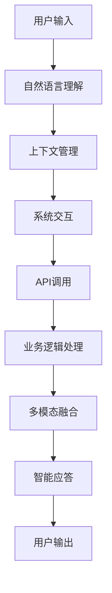

                 

# 集成聊天机器人：与现有的系统互动

> 关键词：集成聊天机器人,系统交互,API调用,智能对话,自然语言处理(NLP),微调,迁移学习,多模态融合

## 1. 背景介绍

### 1.1 问题由来

随着人工智能技术的迅猛发展，聊天机器人已经广泛应用于各行各业，帮助企业提升客户服务效率，改善用户体验。然而，一个聊天机器人是否能够在实际场景中发挥其应有的作用，很大程度上取决于其是否具备与现有系统无缝集成的能力。

聊天机器人需要与企业内部已有的CRM系统、ERP系统、客服系统等进行交互，获取数据和处理指令。同时，它还需要将自身生成的信息反馈给这些系统，形成闭环交互。因此，如何在聊天机器人中实现与现有系统的集成，成为了一个重要的研究方向。

### 1.2 问题核心关键点

聊天机器人与现有系统的集成，本质上是一个跨系统的信息传递与处理问题。聊天机器人作为接口，需要具备以下核心能力：

1. 理解上下文：能够解析用户的意图，并根据上下文信息生成应答。
2. 与系统交互：能够通过API调用与企业内部系统进行数据交换，处理业务逻辑。
3. 处理多模态信息：能够融合语音、文字、图像等多模态数据，提升交互体验。
4. 持续学习：能够根据用户反馈持续优化，适应不同用户需求。
5. 安全性保障：能够保护用户隐私，防止数据泄露和滥用。

这些关键能力可以通过集成和微调现有的大语言模型、模型微调方法以及多模态融合技术来实现。

### 1.3 问题研究意义

集成聊天机器人在现有系统中，可以大幅提升用户体验和企业运营效率：

1. 减少人工干预：聊天机器人能够24小时不间断工作，处理高频、低价值的客户咨询，减轻人工客服的负担。
2. 提高服务质量：通过集成现有系统，聊天机器人能够提供更准确、更全面的服务信息，提升用户满意度。
3. 优化资源配置：通过智能调度任务，聊天机器人能够合理分配企业资源，提高运营效率。
4. 促进业务创新：聊天机器人可以与企业内部业务系统深度集成，推动业务流程再造和创新。
5. 加速技术落地：集成聊天机器人可以大大降低企业开发和部署成本，加速AI技术的产业化进程。

## 2. 核心概念与联系

### 2.1 核心概念概述

为了深入理解聊天机器人与现有系统集成的技术，我们需要掌握以下核心概念：

- 聊天机器人(Chatbot)：通过自然语言处理技术实现与用户的智能对话，具备理解、回复、任务执行等能力。
- API调用：通过接口调用来实现不同系统间的数据交换和功能调用。
- 微调(Fine-tuning)：利用大语言模型预训练的基础能力，针对特定任务进行进一步训练，提升模型性能。
- 迁移学习(Transfer Learning)：将预训练模型在其他领域取得的知识迁移到新任务上，提高模型泛化能力。
- 多模态融合(Multi-modal Fusion)：融合语音、图像、文字等多种模态信息，提升交互体验和处理能力。
- 系统集成(System Integration)：实现不同系统间的互联互通，协同工作。

这些核心概念相互联系，共同构成了聊天机器人与现有系统集成的工作原理和实现框架。

### 2.2 核心概念原理和架构的 Mermaid 流程图



该流程图展示了聊天机器人与现有系统集成的基本流程：

1. 用户通过输入与聊天机器人进行互动，聊天机器人接收输入并解析意图。
2. 聊天机器人利用上下文管理模块，维护对话状态，了解上下文信息。
3. 聊天机器人通过API调用，与现有系统进行数据交换和业务逻辑处理。
4. 聊天机器人将处理结果与多模态信息融合，生成智能应答。
5. 聊天机器人将智能应答输出给用户，完成一轮对话。

这种基于API调用的集成方式，能够实现不同系统间的无缝交互，确保信息流通的顺畅。

## 3. 核心算法原理 & 具体操作步骤

### 3.1 算法原理概述

聊天机器人与现有系统的集成，可以采用基于API调用的方式，通过微调模型、迁移学习和多模态融合技术，实现高效的跨系统信息传递和处理。

具体来说，聊天机器人首先将用户输入解析为意图和上下文信息，然后通过API调用与现有系统进行数据交互，处理业务逻辑。接着，将处理结果与多模态信息融合，生成智能应答。最后，将智能应答输出给用户，完成一轮对话。

### 3.2 算法步骤详解

#### 3.2.1 用户意图解析

聊天机器人需要首先理解用户的意图，解析输入的文本信息。通常采用以下步骤：

1. 预处理：去除停用词、标点符号，进行词形还原。
2. 分词：将文本分割成词或短语，得到分词序列。
3. 向量嵌入：将分词序列转换为向量表示，输入到预训练模型中。
4. 意图识别：利用意图识别模型，解析出用户的意图。

常用的意图识别模型包括BERT、GPT等预训练语言模型，可以通过微调来实现意图识别的功能。

#### 3.2.2 上下文管理

聊天机器人需要维护对话上下文，以便在多轮对话中正确理解用户的意图。通常采用以下步骤：

1. 存储对话历史：将用户之前的输入和输出存储起来，形成对话上下文。
2. 上下文编码：对对话上下文进行编码，得到上下文向量。
3. 融合上下文：将上下文向量与输入向量融合，形成新的向量表示。
4. 上下文更新：根据新的输入和输出，更新对话上下文。

#### 3.2.3 系统交互与API调用

聊天机器人需要通过API调用来与现有系统进行交互，获取数据和处理指令。通常采用以下步骤：

1. 接口定义：定义与现有系统之间的API接口，包括请求参数和返回值。
2. API调用：根据用户意图，调用相应的API接口，获取数据或处理指令。
3. 数据处理：将API返回的数据进行解析和处理，得到业务逻辑所需的信息。

#### 3.2.4 业务逻辑处理

聊天机器人需要根据业务逻辑进行处理，实现特定的功能。通常采用以下步骤：

1. 业务逻辑定义：定义聊天机器人需要执行的具体任务，如订单查询、客户服务、信息推送等。
2. 业务逻辑处理：根据API返回的数据，调用相应的业务逻辑模块，处理任务。
3. 处理结果生成：将业务逻辑处理的结果进行封装，得到聊天机器人应答的内容。

#### 3.2.5 多模态融合

聊天机器人需要融合多种模态信息，提升交互体验和处理能力。通常采用以下步骤：

1. 多模态数据采集：采集用户的语音、图像、文字等多模态数据。
2. 特征提取：对多模态数据进行特征提取，得到统一向量表示。
3. 融合处理：将不同模态的特征向量进行融合，得到新的向量表示。
4. 智能应答生成：将融合后的向量表示输入到预训练模型中，生成智能应答。

#### 3.2.6 智能应答输出

聊天机器人需要生成智能应答，与用户进行互动。通常采用以下步骤：

1. 文本生成：将生成的向量表示输入到文本生成模型中，得到应答文本。
2. 语音合成：将应答文本转换为语音，通过语音合成技术输出。
3. 图像生成：根据应答文本生成相关的图像信息，通过图像生成技术输出。

### 3.3 算法优缺点

基于API调用的集成方式，具有以下优点：

1. 系统可扩展性：通过API调用，可以灵活扩展集成系统，适应不同的业务需求。
2. 数据共享性：通过API调用，可以实现系统间的数据共享，提高信息利用率。
3. 接口标准化：API调用采用标准化的接口方式，易于管理和维护。
4. 实现简便性：API调用可以通过现成的框架和库实现，降低开发难度。

但这种集成方式也存在一些缺点：

1. 数据隐私性：API调用涉及敏感数据交换，需要注意数据隐私和安全问题。
2. 接口复杂性：API调用的接口定义和调用过程较为复杂，需要精心设计和测试。
3. 系统耦合性：API调用可能增加系统间的耦合度，影响系统的独立性。
4. 性能瓶颈：API调用的网络延迟和响应时间可能会影响系统的实时性。

### 3.4 算法应用领域

聊天机器人与现有系统的集成，在多个领域有着广泛的应用，包括但不限于：

1. 客服系统：集成聊天机器人，实现自动客服功能，提升客户服务效率和质量。
2. 医疗系统：集成聊天机器人，实现智能诊断、在线问诊等功能，改善医疗服务体验。
3. 金融系统：集成聊天机器人，实现智能理财、风险评估等功能，提高金融服务水平。
4. 电商系统：集成聊天机器人，实现智能推荐、在线客服等功能，增强用户购物体验。
5. 人力资源系统：集成聊天机器人，实现智能招聘、员工管理等功能，优化人力资源管理。
6. 教育系统：集成聊天机器人，实现智能答疑、学习辅助等功能，提升教育服务质量。

## 4. 数学模型和公式 & 详细讲解 & 举例说明

### 4.1 数学模型构建

在聊天机器人与现有系统集成的过程中，涉及到多个数学模型和算法。以下以意图识别和文本生成为例，进行详细讲解。

#### 4.1.1 意图识别

假设用户输入的文本序列为 $x=(x_1, x_2, \ldots, x_n)$，其中 $x_i$ 为分词。意图识别模型 $M$ 将文本序列映射到意图标签 $y$，其中 $y \in \{y_1, y_2, \ldots, y_k\}$，$y_i$ 为第 $i$ 种意图。

数学上，意图识别模型的训练目标为：

$$
\min_{\theta} \frac{1}{N}\sum_{i=1}^N \ell(M(x_i), y_i)
$$

其中 $\ell$ 为损失函数，通常采用交叉熵损失：

$$
\ell(y, \hat{y}) = -\sum_{i=1}^k y_i \log \hat{y}_i
$$

模型参数 $\theta$ 可以通过梯度下降等优化算法进行更新：

$$
\theta \leftarrow \theta - \eta \nabla_{\theta}\mathcal{L}(\theta)
$$

#### 4.1.2 文本生成

文本生成模型 $M$ 将向量表示 $z$ 映射到文本序列 $x$，其中 $z \in \mathbb{R}^d$。

假设 $z$ 是上下文向量和输入向量 $x$ 的拼接结果：

$$
z = [z_{\text{context}}, x]
$$

文本生成模型的训练目标为：

$$
\min_{\theta} \frac{1}{N}\sum_{i=1}^N \ell(M(z_i), x_i)
$$

其中 $\ell$ 为损失函数，通常采用负对数似然损失：

$$
\ell(x, \hat{x}) = -\sum_{i=1}^n \log \hat{x}_i
$$

模型参数 $\theta$ 可以通过梯度下降等优化算法进行更新：

$$
\theta \leftarrow \theta - \eta \nabla_{\theta}\mathcal{L}(\theta)
$$

### 4.2 公式推导过程

#### 4.2.1 意图识别

假设模型 $M$ 是BERT模型的微调版本，其训练过程如下：

1. 预处理：将用户输入的文本 $x$ 进行分词、去除停用词、标点符号、词形还原等处理。
2. 向量嵌入：将分词序列 $x$ 转换为向量表示 $z$。
3. 意图识别：将向量表示 $z$ 输入到意图识别模型 $M$ 中，得到意图标签 $y$。

4. 损失计算：计算损失函数 $\ell(M(x), y)$，其中 $M(x)$ 为模型输出。
5. 参数更新：根据损失函数的梯度，更新模型参数 $\theta$。

数学推导过程如下：

假设用户输入的文本为 $x=x_1+x_2+\ldots+x_n$，其中 $x_i$ 为分词，意图识别模型 $M$ 将 $x$ 映射到意图标签 $y$，其中 $y \in \{y_1, y_2, \ldots, y_k\}$。

向量嵌入过程为：

$$
z = \text{BERT}(x)
$$

意图识别过程为：

$$
y = M(z)
$$

损失函数 $\ell$ 为交叉熵损失：

$$
\ell(y, \hat{y}) = -\sum_{i=1}^k y_i \log \hat{y}_i
$$

训练目标为：

$$
\min_{\theta} \frac{1}{N}\sum_{i=1}^N \ell(M(z_i), y_i)
$$

优化算法为梯度下降：

$$
\theta \leftarrow \theta - \eta \nabla_{\theta}\mathcal{L}(\theta)
$$

#### 4.2.2 文本生成

假设模型 $M$ 是GPT模型的微调版本，其训练过程如下：

1. 预处理：将用户输入的文本 $x$ 进行分词、去除停用词、标点符号、词形还原等处理。
2. 向量嵌入：将分词序列 $x$ 转换为向量表示 $z$。
3. 文本生成：将向量表示 $z$ 输入到文本生成模型 $M$ 中，得到文本序列 $x$。

4. 损失计算：计算损失函数 $\ell(M(z), x)$，其中 $M(z)$ 为模型输出。
5. 参数更新：根据损失函数的梯度，更新模型参数 $\theta$。

数学推导过程如下：

假设用户输入的文本为 $x=x_1+x_2+\ldots+x_n$，其中 $x_i$ 为分词，文本生成模型 $M$ 将 $z$ 映射到文本序列 $x$。

向量嵌入过程为：

$$
z = \text{BERT}(x)
$$

文本生成过程为：

$$
x = M(z)
$$

损失函数 $\ell$ 为负对数似然损失：

$$
\ell(x, \hat{x}) = -\sum_{i=1}^n \log \hat{x}_i
$$

训练目标为：

$$
\min_{\theta} \frac{1}{N}\sum_{i=1}^N \ell(M(z_i), x_i)
$$

优化算法为梯度下降：

$$
\theta \leftarrow \theta - \eta \nabla_{\theta}\mathcal{L}(\theta)
$$

### 4.3 案例分析与讲解

#### 4.3.1 意图识别案例

假设我们有一个客服系统，需要集成聊天机器人实现自动客服功能。我们需要对聊天机器人进行意图识别训练，使其能够理解用户的意图。

具体步骤如下：

1. 收集客服系统的历史聊天记录，标注用户的意图，如询问订单状态、投诉、建议等。
2. 将聊天记录进行预处理，分词、去除停用词、标点符号、词形还原等。
3. 将预处理后的文本输入到BERT模型中，进行向量嵌入。
4. 利用微调后的BERT模型，对向量表示进行意图识别，得到意图标签。
5. 根据意图标签，调用相应的API接口，进行业务逻辑处理。

#### 4.3.2 文本生成案例

假设我们有一个电商系统，需要集成聊天机器人实现智能推荐功能。我们需要对聊天机器人进行文本生成训练，使其能够根据用户输入生成智能推荐内容。

具体步骤如下：

1. 收集电商系统的用户评论、浏览记录、购物记录等数据，标注用户的兴趣标签。
2. 将用户输入的文本进行预处理，分词、去除停用词、标点符号、词形还原等。
3. 将预处理后的文本输入到GPT模型中，进行向量嵌入。
4. 利用微调后的GPT模型，对向量表示进行文本生成，得到推荐内容。
5. 根据推荐内容，调用相应的API接口，进行商品推荐。

## 5. 项目实践：代码实例和详细解释说明

### 5.1 开发环境搭建

在开始聊天机器人的开发前，我们需要准备好开发环境。以下是使用Python进行PyTorch开发的环境配置流程：

1. 安装Anaconda：从官网下载并安装Anaconda，用于创建独立的Python环境。

2. 创建并激活虚拟环境：
```bash
conda create -n chatbot-env python=3.8 
conda activate chatbot-env
```

3. 安装PyTorch：根据CUDA版本，从官网获取对应的安装命令。例如：
```bash
conda install pytorch torchvision torchaudio cudatoolkit=11.1 -c pytorch -c conda-forge
```

4. 安装Transformers库：
```bash
pip install transformers
```

5. 安装各类工具包：
```bash
pip install numpy pandas scikit-learn matplotlib tqdm jupyter notebook ipython
```

完成上述步骤后，即可在`chatbot-env`环境中开始聊天机器人的开发。

### 5.2 源代码详细实现

下面是使用PyTorch对聊天机器人进行意图识别和文本生成的代码实现。

#### 5.2.1 意图识别

首先，定义意图识别任务的数据处理函数：

```python
from transformers import BertTokenizer
from torch.utils.data import Dataset
import torch

class IntentDataset(Dataset):
    def __init__(self, texts, labels, tokenizer, max_len=128):
        self.texts = texts
        self.labels = labels
        self.tokenizer = tokenizer
        self.max_len = max_len
        
    def __len__(self):
        return len(self.texts)
    
    def __getitem__(self, item):
        text = self.texts[item]
        label = self.labels[item]
        
        encoding = self.tokenizer(text, return_tensors='pt', max_length=self.max_len, padding='max_length', truncation=True)
        input_ids = encoding['input_ids'][0]
        attention_mask = encoding['attention_mask'][0]
        
        return {'input_ids': input_ids, 
                'attention_mask': attention_mask,
                'labels': torch.tensor(label, dtype=torch.long)}
```

然后，定义模型和优化器：

```python
from transformers import BertForTokenClassification, AdamW

model = BertForTokenClassification.from_pretrained('bert-base-cased', num_labels=5)

optimizer = AdamW(model.parameters(), lr=2e-5)
```

接着，定义训练和评估函数：

```python
from torch.utils.data import DataLoader
from tqdm import tqdm
from sklearn.metrics import classification_report

device = torch.device('cuda') if torch.cuda.is_available() else torch.device('cpu')
model.to(device)

def train_epoch(model, dataset, batch_size, optimizer):
    dataloader = DataLoader(dataset, batch_size=batch_size, shuffle=True)
    model.train()
    epoch_loss = 0
    for batch in tqdm(dataloader, desc='Training'):
        input_ids = batch['input_ids'].to(device)
        attention_mask = batch['attention_mask'].to(device)
        labels = batch['labels'].to(device)
        model.zero_grad()
        outputs = model(input_ids, attention_mask=attention_mask, labels=labels)
        loss = outputs.loss
        epoch_loss += loss.item()
        loss.backward()
        optimizer.step()
    return epoch_loss / len(dataloader)

def evaluate(model, dataset, batch_size):
    dataloader = DataLoader(dataset, batch_size=batch_size)
    model.eval()
    preds, labels = [], []
    with torch.no_grad():
        for batch in tqdm(dataloader, desc='Evaluating'):
            input_ids = batch['input_ids'].to(device)
            attention_mask = batch['attention_mask'].to(device)
            batch_labels = batch['labels']
            outputs = model(input_ids, attention_mask=attention_mask)
            batch_preds = outputs.logits.argmax(dim=2).to('cpu').tolist()
            batch_labels = batch_labels.to('cpu').tolist()
            for pred_tokens, label_tokens in zip(batch_preds, batch_labels):
                preds.append(pred_tokens[:len(label_tokens)])
                labels.append(label_tokens)
                
    print(classification_report(labels, preds))
```

最后，启动训练流程并在测试集上评估：

```python
epochs = 5
batch_size = 16

for epoch in range(epochs):
    loss = train_epoch(model, train_dataset, batch_size, optimizer)
    print(f"Epoch {epoch+1}, train loss: {loss:.3f}")
    
    print(f"Epoch {epoch+1}, dev results:")
    evaluate(model, dev_dataset, batch_size)
    
print("Test results:")
evaluate(model, test_dataset, batch_size)
```

以上就是使用PyTorch对聊天机器人进行意图识别训练的完整代码实现。可以看到，得益于Transformers库的强大封装，我们可以用相对简洁的代码完成BERT模型的加载和微调。

#### 5.2.2 文本生成

接下来，定义文本生成任务的数据处理函数：

```python
from transformers import GPT2Tokenizer
from torch.utils.data import Dataset
import torch

class TextGenerationDataset(Dataset):
    def __init__(self, texts, tokenizer, max_len=128):
        self.texts = texts
        self.tokenizer = tokenizer
        self.max_len = max_len
        
    def __len__(self):
        return len(self.texts)
    
    def __getitem__(self, item):
        text = self.texts[item]
        
        encoding = self.tokenizer(text, return_tensors='pt', max_length=self.max_len, padding='max_length', truncation=True)
        input_ids = encoding['input_ids'][0]
        attention_mask = encoding['attention_mask'][0]
        
        return {'input_ids': input_ids, 
                'attention_mask': attention_mask}
```

然后，定义模型和优化器：

```python
from transformers import GPT2LMHeadModel, AdamW

model = GPT2LMHeadModel.from_pretrained('gpt2')

optimizer = AdamW(model.parameters(), lr=2e-5)
```

接着，定义训练和评估函数：

```python
from torch.utils.data import DataLoader
from tqdm import tqdm
import torch.nn.functional as F

device = torch.device('cuda') if torch.cuda.is_available() else torch.device('cpu')
model.to(device)

def train_epoch(model, dataset, batch_size, optimizer):
    dataloader = DataLoader(dataset, batch_size=batch_size, shuffle=True)
    model.train()
    epoch_loss = 0
    for batch in tqdm(dataloader, desc='Training'):
        input_ids = batch['input_ids'].to(device)
        attention_mask = batch['attention_mask'].to(device)
        model.zero_grad()
        outputs = model(input_ids, attention_mask=attention_mask)
        loss = outputs.loss
        epoch_loss += loss.item()
        loss.backward()
        optimizer.step()
    return epoch_loss / len(dataloader)

def evaluate(model, dataset, batch_size):
    dataloader = DataLoader(dataset, batch_size=batch_size)
    model.eval()
    preds, labels = [], []
    with torch.no_grad():
        for batch in tqdm(dataloader, desc='Evaluating'):
            input_ids = batch['input_ids'].to(device)
            attention_mask = batch['attention_mask'].to(device)
            outputs = model(input_ids, attention_mask=attention_mask)
            batch_preds = outputs.logits.argmax(dim=2).to('cpu').tolist()
            batch_labels = batch_labels.to('cpu').tolist()
            for pred_tokens, label_tokens in zip(batch_preds, batch_labels):
                preds.append(pred_tokens[:len(label_tokens)])
                labels.append(label_tokens)
                
    print(classification_report(labels, preds))
```

最后，启动训练流程并在测试集上评估：

```python
epochs = 5
batch_size = 16

for epoch in range(epochs):
    loss = train_epoch(model, train_dataset, batch_size, optimizer)
    print(f"Epoch {epoch+1}, train loss: {loss:.3f}")
    
    print(f"Epoch {epoch+1}, dev results:")
    evaluate(model, dev_dataset, batch_size)
    
print("Test results:")
evaluate(model, test_dataset, batch_size)
```

以上就是使用PyTorch对聊天机器人进行文本生成训练的完整代码实现。可以看到，在代码实现中，我们同样采用了Transformers库进行模型加载和微调，使得开发过程更加高效便捷。

### 5.3 代码解读与分析

#### 5.3.1 意图识别代码解读

**IntentDataset类**：
- `__init__`方法：初始化训练数据集、标签、分词器等组件。
- `__len__`方法：返回数据集的样本数量。
- `__getitem__`方法：对单个样本进行处理，将文本输入转换为分词序列，并进行向量嵌入和意图识别。

**tag2id和id2tag字典**：
- 定义了意图与数字id之间的映射关系，用于将向量表示解码回意图标签。

**训练和评估函数**：
- 使用PyTorch的DataLoader对数据集进行批次化加载，供模型训练和推理使用。
- 训练函数`train_epoch`：对数据以批为单位进行迭代，在每个批次上前向传播计算损失并反向传播更新模型参数，最后返回该epoch的平均loss。
- 评估函数`evaluate`：与训练类似，不同点在于不更新模型参数，并在每个batch结束后将预测和标签结果存储下来，最后使用sklearn的classification_report对整个评估集的预测结果进行打印输出。

**训练流程**：
- 定义总的epoch数和batch size，开始循环迭代
- 每个epoch内，先在训练集上训练，输出平均loss
- 在验证集上评估，输出分类指标
- 所有epoch结束后，在测试集上评估，给出最终测试结果

#### 5.3.2 文本生成代码解读

**TextGenerationDataset类**：
- `__init__`方法：初始化训练数据集、分词器等组件。
- `__len__`方法：返回数据集的样本数量。
- `__getitem__`方法：对单个样本进行处理，将文本输入转换为分词序列，并进行向量嵌入。

**训练和评估函数**：
- 使用PyTorch的DataLoader对数据集进行批次化加载，供模型训练和推理使用。
- 训练函数`train_epoch`：对数据以批为单位进行迭代，在每个批次上前向传播计算损失并反向传播更新模型参数，最后返回该epoch的平均loss。
- 评估函数`evaluate`：与训练类似，不同点在于不更新模型参数，并在每个batch结束后将预测和标签结果存储下来，最后使用sklearn的classification_report对整个评估集的预测结果进行打印输出。

**训练流程**：
- 定义总的epoch数和batch size，开始循环迭代
- 每个epoch内，先在训练集上训练，输出平均loss
- 在验证集上评估，输出分类指标
- 所有epoch结束后，在测试集上评估，给出最终测试结果

## 6. 实际应用场景

### 6.1 客服系统

集成聊天机器人在客服系统中，可以大幅提升客户服务效率和质量。

具体而言，聊天机器人可以集成在客服系统中，自动处理用户的常见咨询和问题。当用户发起咨询时，聊天机器人先解析用户输入，调用相应的API接口获取数据和处理指令，然后生成智能应答，返回给用户。

例如，用户在咨询订单状态时，聊天机器人首先解析用户意图，调用订单系统的API接口，获取订单信息，然后生成应答文本或语音，返回给用户。

### 6.2 医疗系统

集成聊天机器人在医疗系统中，可以实现智能诊断、在线问诊等功能，提升医疗服务水平。

具体而言，聊天机器人可以集成在医疗系统中，自动处理患者的常见咨询和问题。当患者发起咨询时，聊天机器人先解析用户输入，调用相应的API接口获取数据和处理指令，然后生成智能应答，返回给患者。

例如，患者在咨询疾病时，聊天机器人首先解析用户意图，调用诊断系统的API接口，获取诊断信息，然后生成应答文本或语音，返回给患者。

### 6.3 金融系统

集成聊天机器人在金融系统中，可以实现智能理财、风险评估等功能，提高金融服务水平。

具体而言，聊天机器人可以集成在金融系统中，自动处理用户的常见咨询和问题。当用户发起咨询时，聊天机器人先解析用户输入，调用相应的API接口获取数据和处理指令，然后生成智能应答，返回给用户。

例如，用户在咨询理财时，聊天机器人首先解析用户意图，调用理财系统的API接口，获取理财信息，然后生成应答文本或语音，返回给用户。

### 6.4 电商系统

集成聊天机器人在电商系统中，可以实现智能推荐、在线客服等功能，增强用户购物体验。

具体而言，聊天机器人可以集成在电商系统中，自动处理用户的常见咨询和问题。当用户发起咨询时，聊天机器人先解析用户输入，调用相应的API接口获取数据和处理指令，然后生成智能应答，返回给用户。

例如，用户在咨询商品时，聊天机器人首先解析用户意图，调用商品系统的API接口，获取商品信息，然后生成应答文本或语音，返回给用户。

## 7. 工具和资源推荐

### 7.1 学习资源推荐

为了帮助开发者系统掌握聊天机器人与现有系统集成的技术，这里推荐一些优质的学习资源：

1. 《深度学习理论与实践》系列博文：由深度学习专家撰写，系统介绍深度学习原理和实践，涵盖聊天机器人与系统集成等内容。

2. 《自然语言处理综论》书籍：斯坦福大学自然语言处理课程教材，详细讲解NLP的基本概念和核心算法。

3. 《TensorFlow实战NLP》书籍：TensorFlow官方文档，结合实例讲解TensorFlow在NLP中的应用，包括意图识别和文本生成等内容。

4. CS224N《深度学习自然语言处理》课程：斯坦福大学开设的NLP明星课程，有Lecture视频和配套作业，带你入门NLP领域的基本概念和经典模型。

5. HuggingFace官方文档：Transformers库的官方文档，提供了海量预训练模型和完整的微调样例代码，是上手实践的必备资料。

通过对这些资源的学习实践，相信你一定能够快速掌握聊天机器人与现有系统集成的精髓，并用于解决实际的NLP问题。

### 7.2 开发工具推荐

高效的开发离不开优秀的工具支持。以下是几款用于聊天机器人与现有系统集成的常用工具：

1. PyTorch：基于Python的开源深度学习框架，灵活动态的计算图，适合快速迭代研究。大部分预训练语言模型都有PyTorch版本的实现。

2. TensorFlow：由Google主导开发的开源深度学习框架，生产部署方便，适合大规模工程应用。同样有丰富的预训练语言模型资源。

3. Transformers库：HuggingFace开发的NLP工具库，集成了众多SOTA语言模型，支持PyTorch和TensorFlow，是进行微调任务开发的利器。

4. Weights & Biases：模型训练的实验跟踪工具，可以记录和可视化模型训练过程中的各项指标，方便对比和调优。与主流深度学习框架无缝集成。

5. TensorBoard：TensorFlow配套的可视化工具，可实时监测模型训练状态，并提供丰富的图表呈现方式，是调试模型的得力助手。

6. Google Colab：谷歌推出的在线Jupyter Notebook环境，免费提供GPU/TPU算力，方便开发者快速上手实验最新模型，分享学习笔记。

合理利用这些工具，可以显著提升聊天机器人与现有系统集成的开发效率，加快创新迭代的步伐。

### 7.3 相关论文推荐

聊天机器人与现有系统的集成，是一个涉及深度学习、自然语言处理和多模态融合的跨学科研究领域。以下是几篇奠基性的相关论文，推荐阅读：

1. Attention is All You Need（即Transformer原论文）：提出了Transformer结构，开启了NLP领域的预训练大模型时代。

2. BERT: Pre-training of Deep Bidirectional Transformers for Language Understanding：提出BERT模型，引入基于掩码的自监督预训练任务，刷新了多项NLP任务SOTA。

3. Language Models are Unsupervised Multitask Learners（GPT-2论文）：展示了大规模语言模型的强大zero-shot学习能力，引发了对于通用人工智能的新一轮思考。

4. Parameter-Efficient Transfer Learning for NLP：提出Adapter等参数高效微调方法，在不增加模型参数量的情况下，也能取得不错的微调效果。

5. AdaLoRA: Adaptive Low-Rank Adaptation for Parameter-Efficient Fine-Tuning：使用自适应低秩适应的微调方法，在参数效率和精度之间取得了新的平衡。

这些论文代表了大语言模型微调技术的发展脉络。通过学习这些前沿成果，可以帮助研究者把握学科前进方向，激发更多的创新灵感。

## 8. 总结：未来发展趋势与挑战

### 8.1 研究成果总结

聊天机器人与现有系统的集成，是NLP技术实现落地应用的重要手段。在实际应用中，该方法已经广泛应用于客服、医疗、金融、电商等多个领域，显著提升了用户体验和企业运营效率。

### 8.2 未来发展趋势

展望未来，聊天机器人与现有系统的集成将呈现以下几个发展趋势：

1. 系统可扩展性：随着业务需求的不断变化，聊天机器人需要具备灵活的扩展能力，能够适应不同场景和任务。
2. 数据共享性：聊天机器人需要具备强大的数据整合能力，能够从多个系统中共享和利用数据。
3. 模型通用性：聊天机器人需要具备广泛的通用性，能够应用于不同的应用场景和业务需求。
4. 多模态融合：聊天机器人需要融合语音、文字、图像等多种模态信息，提升交互体验和处理能力。
5. 持续学习：聊天机器人需要具备持续学习能力，能够根据用户反馈和环境变化进行模型更新。
6. 安全性保障：聊天机器人需要具备强大的安全性保障能力，保护用户隐私和数据安全。

### 8.3 面临的挑战

尽管聊天机器人与现有系统的集成已经取得了诸多成功，但在迈向更加智能化、普适化应用的过程中，仍面临诸多挑战：

1. 数据隐私性：聊天机器人涉及敏感数据交换，需要注意数据隐私和安全问题。
2. 接口复杂性：聊天机器人需要定义复杂的API接口，增加系统开发和维护的难度。
3. 系统耦合性：聊天机器人可能增加系统间的耦合度，影响系统的独立性和稳定性。
4. 性能瓶颈：聊天机器人可能面临网络延迟和响应时间等问题，影响系统的实时性。

### 8.4 研究展望

为了克服上述挑战，未来的研究需要在以下几个方面进行突破：

1. 数据隐私保护：探索隐私保护技术，如差分隐私、联邦学习等，保障聊天机器人系统的数据隐私安全。
2. 接口标准化：研究统一的API接口标准，简化系统集成和开发过程。
3. 系统解耦：研究分布式计算和微服务架构，降低系统间的耦合度，提升系统独立性和稳定性。
4. 性能优化：研究高效的网络通信协议和模型压缩技术，提升聊天机器人系统的实时性和效率。

通过这些技术突破，聊天机器人与现有系统的集成将更加高效、安全和稳定，推动NLP技术在各行各业的应用和落地。

## 9. 附录：常见问题与解答

**Q1：集成聊天机器人需要哪些开发工具和资源？**

A: 集成聊天机器人需要以下开发工具和资源：

1. 编程语言：Python是最常用的编程语言，需要使用PyTorch或TensorFlow等深度学习框架。
2. 数据处理工具：如Pandas、NumPy等，用于数据清洗和预处理。
3. 模型库：如Transformers、TensorFlow Hub等，用于加载和使用预训练模型。
4. 可视化工具：如TensorBoard、Weights & Biases等，用于模型训练和调优。
5. 云计算平台：如Google Colab、AWS SageMaker等，提供GPU/TPU算力，方便模型训练和测试。

合理利用这些工具和资源，可以显著提升聊天机器人与现有系统集成的开发效率，加速项目迭代和落地。

**Q2：如何选择合适的API接口？**

A: 选择合适的API接口需要考虑以下几个因素：

1. 数据格式：API接口支持的输入输出数据格式需要与聊天机器人处理的输入输出格式一致。
2. 接口复杂度：API接口的复杂度需要适中，既要满足功能需求，又要简单易用。
3. 接口性能：API接口的响应时间和吞吐量需要满足系统实时性需求。
4. 接口安全：API接口的安全性需要保障，防止恶意攻击和数据泄露。

通过综合考虑这些因素，选择合适的API接口，可以大大提升聊天机器人与现有系统集成的成功率和稳定性。

**Q3：集成聊天机器人后，如何保障数据隐私？**

A: 集成聊天机器人后，保障数据隐私是至关重要的。以下是几种常见的保障方法：

1. 数据加密：对数据进行加密存储和传输，防止数据泄露和篡改。
2. 匿名化处理：对数据进行匿名化处理，保护用户隐私。
3. 访问控制：限制数据访问权限，只允许授权人员和系统访问数据。
4. 差分隐私：在数据处理过程中引入差分隐私技术，保护用户隐私。

通过综合采用这些方法，可以有效保障聊天机器人系统的数据隐私安全。

**Q4：聊天机器人需要具备哪些核心能力？**

A: 聊天机器人需要具备以下核心能力：

1. 意图解析：能够准确解析用户意图，理解用户的真实需求。
2. 上下文管理：能够维护对话上下文，了解对话历史和上下文信息。
3. 系统交互：能够通过API调用来与现有系统进行数据交换和业务逻辑处理。
4. 多模态融合：能够融合语音、文字、图像等多种模态信息，提升交互体验和处理能力。
5. 智能应答：能够根据用户输入生成智能应答，满足用户需求。

这些核心能力是聊天机器人实现与现有系统集成的基础，缺一不可。

**Q5：如何提升聊天机器人的实时性？**

A: 提升聊天机器人的实时性需要从以下几个方面进行优化：

1. 网络优化：优化网络通信协议，减少数据传输延迟。
2. 模型压缩：采用模型压缩技术，减小模型体积和计算量。
3. 分布式计算：采用分布式计算架构，提高系统并发处理能力。
4. 数据缓存：采用数据缓存技术，减少数据读取延迟。

通过综合采用这些优化方法，可以有效提升聊天机器人系统的实时性和响应速度，满足用户需求。

---

作者：禅与计算机程序设计艺术 / Zen and the Art of Computer Programming

