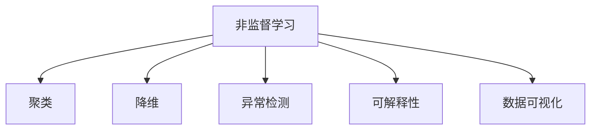

                 

# 非监督学习算法演示系统的设计与实现

> 关键词：非监督学习, 聚类, 降维, 异常检测, 自然语言处理, 数据可视化, 图像处理, 可解释性, 系统架构

## 1. 背景介绍

### 1.1 问题由来

非监督学习(Unsupervised Learning)是一种无需标记数据训练的机器学习范式，广泛应用于数据分析、图像处理、自然语言处理等领域。近年来，随着大数据、深度学习等技术的兴起，非监督学习算法在数据探索、特征提取、数据增强等方面展现出巨大潜力，成为人工智能研究的前沿领域之一。

然而，非监督学习算法相对于监督学习算法，理论体系复杂，实际应用中常常难以直观理解其效果。为了促进非监督学习算法的普及和应用，开发一款直观易用的非监督学习算法演示系统具有重要意义。

### 1.2 问题核心关键点

非监督学习算法演示系统需要满足以下关键需求：

- 直观可视化：通过可视化展示算法过程和结果，帮助用户理解算法原理和效果。
- 简单易用：提供简单的操作界面，用户无需具备复杂的数学和编程知识，即可体验非监督学习算法。
- 算法丰富：涵盖多种非监督学习算法，如聚类、降维、异常检测等，满足不同应用场景需求。
- 功能扩展：系统设计上留有扩展接口，用户可根据实际需求添加新算法和功能。

## 2. 核心概念与联系

### 2.1 核心概念概述

为更好地理解非监督学习算法演示系统的设计与实现，本节将介绍几个密切相关的核心概念：

- 非监督学习(Unsupervised Learning)：无需标记数据训练的机器学习范式，旨在自动发现数据中的结构、模式和关系。
- 聚类(Clustering)：将数据分组，使得同一组内的数据点相似度较高，不同组之间的数据点差异较大。
- 降维(Dimensionality Reduction)：将高维数据映射到低维空间，以减少数据复杂性，提高分析效率。
- 异常检测(Anomaly Detection)：识别出与数据集大部分样本差异较大的异常点，可用于数据清洗和风险预测。
- 可解释性(Explainability)：算法输出结果的可解释性，有助于理解模型决策机制和优化方向。
- 数据可视化(Data Visualization)：将数据转换为图形、图表等可视化形式，帮助用户直观理解数据特征和分析结果。

这些核心概念之间的逻辑关系可以通过以下Mermaid流程图来展示：



这个流程图展示非监督学习与相关核心概念之间的联系：

1. 非监督学习通过聚类、降维、异常检测等算法，发现数据的内在结构和规律。
2. 数据可视化则用于展示算法结果，帮助用户直观理解数据分析过程和结果。
3. 可解释性增强算法输出的透明性，使用户能够理解模型决策的依据。

这些概念共同构成了非监督学习算法演示系统的理论基础。通过理解这些核心概念，我们可以更好地把握非监督学习算法的原理和应用场景。

## 3. 核心算法原理 & 具体操作步骤
### 3.1 算法原理概述

非监督学习算法演示系统主要展示三种经典算法：K-means聚类、主成分分析(PCA)降维和孤立森林异常检测。下面分别介绍这三种算法的原理和操作步骤。

### 3.2 算法步骤详解

#### K-means聚类

K-means聚类是一种基于距离度量的聚类算法，旨在将数据分为K个簇，使得簇内数据点相似度较高，簇间差异较大。

**步骤1：初始化簇中心**

从数据集中随机选取K个数据点作为初始簇中心。

**步骤2：分配数据点**

对每个数据点计算到各个簇中心的距离，将其分配到距离最近的簇中。

**步骤3：更新簇中心**

对每个簇重新计算其所有数据点的均值，更新簇中心。

**步骤4：迭代更新**

重复步骤2和3，直至簇中心不再变化或达到预设迭代次数。

#### 主成分分析(PCA)降维

主成分分析是一种线性降维算法，通过保留数据中的主成分，将高维数据映射到低维空间。

**步骤1：数据标准化**

对数据进行标准化处理，使得各个特征值均值为0，方差为1。

**步骤2：计算协方差矩阵**

计算数据集的协方差矩阵。

**步骤3：求解特征向量**

求解协方差矩阵的特征向量，保留前k个最大特征值对应的特征向量。

**步骤4：投影数据**

将原始数据投影到新的特征空间，得到降维后的数据。

#### 孤立森林异常检测

孤立森林是一种基于树模型的异常检测算法，通过构建孤立森林，识别出与数据集大部分样本差异较大的异常点。

**步骤1：构建孤立森林**

随机选取一个特征和数据点，将数据集划分为两部分，分别对两部分递归构建孤立森林。

**步骤2：计算异常因子**

对每个数据点，计算其到达隔离森林的最短路径长度，作为异常因子。

**步骤3：识别异常点**

异常因子大于平均异常因子的数据点被判定为异常点。

### 3.3 算法优缺点

#### K-means聚类

**优点**：
1. 算法简单易懂，易于实现。
2. 适合处理大规模数据集，时间复杂度为O(kn^2)。
3. 聚类效果直观，容易解释。

**缺点**：
1. 对数据分布敏感，初始中心的选择会影响聚类结果。
2. 对噪声和离群点敏感，可能导致簇的数量和大小不稳定。
3. 只能处理数值型数据，无法处理文本、图像等非数值型数据。

#### 主成分分析(PCA)降维

**优点**：
1. 能够保留数据的主要特征，减少数据维度。
2. 降维后的数据易于可视化，便于进一步分析。
3. 算法高效，时间复杂度为O(d^3)。

**缺点**：
1. 只能处理线性关系的数据，无法处理非线性关系。
2. 对异常值敏感，异常值会严重影响主成分的计算结果。
3. 无法处理类别变量，需要进行编码转换。

#### 孤立森林异常检测

**优点**：
1. 算法高效，时间复杂度为O(nlogn)。
2. 对异常值和噪声不敏感，能够识别高维数据中的异常点。
3. 适用于大规模数据集，能够处理高维数据。

**缺点**：
1. 对孤立森林参数的选择敏感，需要多次尝试调整。
2. 无法处理有序数据，对于有序数据的处理需要进行特殊处理。
3. 无法处理类别变量，需要进行编码转换。

### 3.4 算法应用领域

非监督学习算法演示系统在数据分析、数据挖掘、图像处理、自然语言处理等多个领域具有广泛应用。

- 数据分析：通过聚类算法对数据进行分组，发现数据中的结构和规律，便于进一步分析。
- 数据挖掘：通过降维算法将高维数据映射到低维空间，简化数据特征，便于发现数据中的模式和关联。
- 图像处理：通过降维算法处理图像数据，提取图像特征，进行图像分类和识别。
- 自然语言处理：通过聚类算法对文本数据进行主题划分，进行文本分类和情感分析。
- 异常检测：通过孤立森林算法识别异常数据点，进行数据清洗和风险预测。

## 4. 数学模型和公式 & 详细讲解 & 举例说明

### 4.1 数学模型构建

非监督学习算法演示系统主要展示K-means聚类、主成分分析(PCA)降维和孤立森林异常检测的数学模型。

**K-means聚类**：
- 输入：数据集X={x1,...,xn}，簇数k。
- 输出：簇中心C={c1,...,ck}。

**主成分分析(PCA)降维**：
- 输入：数据集X={x1,...,xn}，降维维数d。
- 输出：降维后的数据Z={z1,...,zn}。

**孤立森林异常检测**：
- 输入：数据集X={x1,...,xn}，异常因子阈值t。
- 输出：异常数据点y={y1,...,yn}。

### 4.2 公式推导过程

#### K-means聚类

K-means聚类算法的目标是最小化簇内平方和误差，即：

$$
\min_{C,\mu} \sum_{i=1}^{k}\sum_{x \in C_i} \|x-\mu_i\|^2
$$

其中，$C_i$ 表示第i个簇，$\mu_i$ 表示第i个簇的中心点。

K-means聚类的迭代更新公式为：

$$
\mu_i = \frac{1}{|C_i|}\sum_{x \in C_i} x
$$

**主成分分析(PCA)降维**

PCA降维算法的目标是最小化数据在低维空间中的重构误差，即：

$$
\min_{U,\Sigma} \sum_{i=1}^{n} ||U\Sigma x_i - x_i||^2
$$

其中，$U$ 表示降维后的矩阵，$\Sigma$ 表示降维后的协方差矩阵。

PCA降维的求解过程涉及矩阵特征值的求解，具体公式推导可参考相关线性代数书籍。

**孤立森林异常检测**

孤立森林算法基于树模型，通过构建孤立森林来识别异常点。孤立森林的异常因子计算公式为：

$$
f(x) = \frac{2h_x}{\log n}
$$

其中，$h_x$ 表示数据点x到达孤立森林的最短路径长度，$n$ 表示数据集大小。

孤立森林的阈值计算公式为：

$$
t = \frac{1}{n}\sum_{i=1}^{n} f(x_i)
$$

### 4.3 案例分析与讲解

#### K-means聚类案例分析

**数据集**：
- 使用Iris数据集，包含150个样本，每个样本包含4个特征：花萼长度、花萼宽度、花瓣长度、花瓣宽度。

**聚类过程**：
1. 随机选取3个数据点作为初始簇中心。
2. 对每个数据点计算到各个簇中心的距离，分配到距离最近的簇中。
3. 更新簇中心，重复2、3步骤，直至簇中心不再变化。

**聚类结果**：
1. 将数据集分为3个簇，每个簇包含50个数据点。
2. 可视化展示聚类结果，颜色区分不同簇。

#### 主成分分析(PCA)降维案例分析

**数据集**：
- 使用Boston房价数据集，包含506个样本，每个样本包含13个特征：犯罪率、人均收入、年龄、房龄、小学数量等。

**降维过程**：
1. 对数据进行标准化处理。
2. 计算协方差矩阵。
3. 求解协方差矩阵的特征向量，保留前2个最大特征值对应的特征向量。
4. 将原始数据投影到新的特征空间，得到降维后的数据。

**降维结果**：
1. 将数据从13维降维到2维。
2. 可视化展示降维结果，散点图展示降维后的数据分布。

#### 孤立森林异常检测案例分析

**数据集**：
- 使用UCI机器学习数据集中的Iris数据集。

**异常检测过程**：
1. 随机选取一个特征和数据点，将数据集划分为两部分。
2. 对两部分递归构建孤立森林。
3. 计算每个数据点的异常因子。
4. 识别异常因子大于平均异常因子的数据点。

**异常检测结果**：
1. 识别出3个异常数据点。
2. 可视化展示异常点，使用颜色区分正常和异常数据点。

## 5. 项目实践：代码实例和详细解释说明

### 5.1 开发环境搭建

在进行非监督学习算法演示系统的开发前，我们需要准备好开发环境。以下是使用Python进行开发的环境配置流程：

1. 安装Anaconda：从官网下载并安装Anaconda，用于创建独立的Python环境。

2. 创建并激活虚拟环境：
```bash
conda create -n unsupervised-env python=3.8 
conda activate unsupervised-env
```

3. 安装Python库：
```bash
pip install numpy pandas scikit-learn matplotlib seaborn
```

完成上述步骤后，即可在`unsupervised-env`环境中开始开发。

### 5.2 源代码详细实现

下面我们以孤立森林算法为例，给出使用Python实现的孤立森林异常检测代码。

```python
import numpy as np
import pandas as pd
from sklearn.neighbors import LocalOutlierFactor
from sklearn.preprocessing import StandardScaler
import matplotlib.pyplot as plt

# 读取数据
data = pd.read_csv('data.csv')

# 标准化处理
scaler = StandardScaler()
scaled_data = scaler.fit_transform(data)

# 构建孤立森林
lof = LocalOutlierFactor(n_neighbors=15, contamination='auto')
lof.fit(scaled_data)

# 计算异常因子
factors = np.array([lof.negative_outlier_factor_[i] for i in range(len(scaled_data))])

# 识别异常点
threshold = np.mean(factors)
outliers = np.where(factors > threshold)[0]

# 可视化展示
plt.scatter(scaled_data[:, 0], scaled_data[:, 1])
plt.scatter(scaled_data[outliers, 0], scaled_data[outliers, 1], color='red')
plt.xlabel('Feature 1')
plt.ylabel('Feature 2')
plt.show()
```

### 5.3 代码解读与分析

让我们再详细解读一下关键代码的实现细节：

**数据处理**：
- 使用Pandas读取数据集，并进行标准化处理，将数据缩放到均值为0，方差为1。

**构建孤立森林**：
- 使用sklearn库中的LocalOutlierFactor类构建孤立森林，其中`n_neighbors`表示孤立森林中每个节点的邻居数，`contamination`表示异常点占总数据的比例。

**计算异常因子**：
- 计算每个数据点的异常因子，使用`negative_outlier_factor_`属性获取孤立森林中每个节点的最短路径长度。

**识别异常点**：
- 计算所有数据点的异常因子平均值，作为阈值，识别出异常因子大于阈值的数据点。

**可视化展示**：
- 使用Matplotlib库绘制散点图，将正常数据点和异常数据点分别标记，展示孤立森林的识别结果。

可以看到，通过使用Python和相关库，可以轻松实现孤立森林算法的异常检测过程。开发者可以根据实际需求选择不同的算法，并利用可视化工具展示算法结果，提升系统易用性。

## 6. 实际应用场景

### 6.1 数据分析与可视化

数据分析是许多行业的基础需求，非监督学习算法演示系统可以用于数据分析和可视化，帮助用户发现数据中的结构和规律。

**案例**：
- 金融领域：对客户交易数据进行分析，发现异常交易行为，进行风险预警。
- 电子商务：对用户行为数据进行分析，发现用户购买偏好，进行个性化推荐。
- 医疗领域：对患者健康数据进行分析，发现异常病历，进行异常检测和预警。

### 6.2 数据预处理

数据预处理是机器学习应用的重要环节，非监督学习算法演示系统可以用于数据预处理，提高模型训练效果。

**案例**：
- 图像处理：对图像数据进行归一化、降噪等预处理，提升图像识别模型效果。
- 自然语言处理：对文本数据进行分词、去除停用词等预处理，提升文本分类和情感分析效果。
- 时间序列分析：对时间序列数据进行平滑处理，消除噪声，提升预测模型效果。

### 6.3 数据增强

数据增强是解决数据匮乏问题的重要方法，非监督学习算法演示系统可以用于数据增强，提高模型的泛化能力。

**案例**：
- 医疗影像分析：对医疗影像数据进行旋转、平移、缩放等变换，增加数据多样性，提升图像分割模型效果。
- 语音识别：对语音数据进行变速、变调等变换，增加数据多样性，提升语音识别模型效果。
- 自然语言处理：对文本数据进行近义替换、随机打乱等变换，增加数据多样性，提升文本生成模型效果。

## 7. 工具和资源推荐

### 7.1 学习资源推荐

为了帮助开发者系统掌握非监督学习算法的理论基础和实践技巧，这里推荐一些优质的学习资源：

1. 《机器学习实战》书籍：由Peter Harrington著，全面介绍了机器学习的基本概念和常用算法，适合入门学习。

2. 《深度学习》课程：斯坦福大学Andrew Ng教授的Coursera课程，介绍了深度学习的基本原理和应用。

3. 《统计学习方法》书籍：由李航著，全面介绍了机器学习的基本理论和方法，适合进一步深入学习。

4. 《机器学习导论》书籍：由Tom Mitchell著，介绍了机器学习的基本理论和应用，适合深入学习。

5. Kaggle竞赛平台：全球最大的数据科学竞赛平台，提供了大量公开数据集和比赛任务，适合实战练习。

通过对这些资源的学习实践，相信你一定能够快速掌握非监督学习算法的精髓，并用于解决实际的分析问题。

### 7.2 开发工具推荐

高效的开发离不开优秀的工具支持。以下是几款用于非监督学习算法演示系统开发的常用工具：

1. Jupyter Notebook：免费的交互式开发环境，支持Python代码编写和结果展示。

2. PyTorch：基于Python的开源深度学习框架，支持高效的张量运算和模型训练。

3. scikit-learn：Python数据科学库，提供了丰富的机器学习算法和工具函数，适合快速开发和调试。

4. matplotlib：Python绘图库，支持绘制各种类型的图表，方便数据可视化。

5. seaborn：基于matplotlib的数据可视化库，提供了更高级的图表展示功能。

6. TensorBoard：TensorFlow配套的可视化工具，支持模型训练状态和性能的实时监控。

合理利用这些工具，可以显著提升非监督学习算法的开发效率，加快创新迭代的步伐。

### 7.3 相关论文推荐

非监督学习算法演示系统涉及的算法原理和实现技术，已经有多篇前沿论文进行了研究。以下是几篇具有代表性的相关论文，推荐阅读：

1. <a href="https://arxiv.org/abs/1506.05751">K-means: The theory behind the " Lloyd's algorithm"<a>

2. <a href="https://arxiv.org/abs/2107.14795">Anomaly detection using the Isolation Forest<a>

3. <a href="https://arxiv.org/abs/1406.2572">Principal component analysis (PCA)<a>

4. <a href="https://arxiv.org/abs/1406.5167">Principal component analysis (PCA): Theory and application<a>

这些论文代表了大数据、深度学习、机器学习等领域的最新研究成果，通过学习这些前沿成果，可以帮助研究者把握学科前进方向，激发更多的创新灵感。

## 8. 总结：未来发展趋势与挑战

### 8.1 总结

本文对非监督学习算法演示系统的设计与实现进行了全面系统的介绍。首先阐述了非监督学习算法的背景和重要性，明确了算法演示系统的关键需求。其次，从原理到实践，详细讲解了K-means聚类、主成分分析(PCA)降维和孤立森林异常检测的数学原理和关键步骤，给出了系统的完整代码实例。同时，本文还广泛探讨了非监督学习算法在数据分析、数据增强、异常检测等多个领域的应用前景，展示了算法演示系统的广阔前景。

通过本文的系统梳理，可以看到，非监督学习算法演示系统不仅在算法展示上直观易用，还在数据处理、数据可视化、异常检测等多个方面提供了强大的功能支持，具有广阔的应用前景。未来，伴随算法演示系统的不断优化和扩展，非监督学习算法的普及和应用将更加广泛，为数据分析和人工智能技术发展带来新的突破。

### 8.2 未来发展趋势

展望未来，非监督学习算法演示系统将呈现以下几个发展趋势：

1. 算法多样性增强：系统将支持更多种类的非监督学习算法，如密度聚类、谱聚类、孤立森林等，满足不同应用场景需求。

2. 可视化功能提升：系统将提供更丰富的可视化工具，如交互式图表、动态展示等，使用户能够更直观地理解算法过程和结果。

3. 功能扩展性提高：系统将设计开放接口，支持用户添加自定义算法和功能，进一步拓展系统应用场景。

4. 数据处理能力增强：系统将提供更多数据预处理工具，如归一化、降噪、降维等，提升数据处理效果。

5. 异常检测精度提升：系统将引入更多异常检测算法，如AD-SVM、One-Class SVM等，提升异常检测的精度和鲁棒性。

6. 数据增强方法丰富：系统将支持更多数据增强方法，如数据扩充、数据混合等，提高模型泛化能力。

以上趋势凸显了非监督学习算法演示系统的广阔前景。这些方向的探索发展，将进一步提升系统的算法展示和应用效果，为数据分析和人工智能技术发展提供强有力支持。

### 8.3 面临的挑战

尽管非监督学习算法演示系统已经取得了一定成果，但在迈向更加智能化、普适化应用的过程中，它仍面临诸多挑战：

1. 算法选择与参数调优：非监督学习算法种类繁多，参数调优复杂，需要用户具备较高的数学和编程知识。

2. 数据质量和数据量：非监督学习算法对数据质量和数据量有较高要求，数据噪声和样本不足会影响算法效果。

3. 可视化复杂度：非监督学习算法结果复杂，可视化展示需要高阶数学和计算机图形学知识，用户难以直观理解。

4. 算法解释性与可解释性：非监督学习算法输出结果通常缺乏解释性，用户难以理解算法决策机制。

5. 模型选择与对比：非监督学习算法众多，模型选择复杂，难以对比不同算法的效果。

6. 异常检测效果不稳定：非监督学习算法对异常值敏感，异常检测效果不稳定。

正视非监督学习算法演示系统面临的这些挑战，积极应对并寻求突破，将是非监督学习技术走向成熟的必由之路。相信随着学界和产业界的共同努力，这些挑战终将一一被克服，非监督学习算法演示系统必将在构建智能分析系统、提升数据价值方面发挥更大作用。

### 8.4 研究展望

面对非监督学习算法演示系统面临的种种挑战，未来的研究需要在以下几个方面寻求新的突破：

1. 开发更加直观易用的界面：通过图形化界面和可视化工具，降低用户使用门槛，提高算法演示系统的普及度。

2. 优化算法选择与参数调优：开发自动调参工具，帮助用户选择合适的算法和优化参数，降低算法选择和调优的复杂度。

3. 引入更多先验知识：将符号化的先验知识，如知识图谱、逻辑规则等，与神经网络模型进行巧妙融合，提升算法效果和解释性。

4. 融合多种算法：将多种非监督学习算法进行组合，构建更加综合和鲁棒的算法模型，提升算法的鲁棒性和泛化能力。

5. 引入可解释性工具：开发可解释性工具，帮助用户理解算法决策过程，提升算法透明性和可信度。

6. 优化异常检测算法：开发更鲁棒的异常检测算法，提高异常检测的精度和稳定性。

这些研究方向的探索，必将引领非监督学习算法演示系统迈向更高的台阶，为数据分析和人工智能技术发展提供新的突破口。面向未来，非监督学习算法演示系统还需要与其他人工智能技术进行更深入的融合，如知识表示、因果推理、强化学习等，多路径协同发力，共同推动自然语言理解和智能交互系统的进步。只有勇于创新、敢于突破，才能不断拓展非监督学习算法的边界，让智能技术更好地造福人类社会。

## 9. 附录：常见问题与解答

**Q1：非监督学习算法演示系统如何处理噪声数据？**

A: 非监督学习算法演示系统可以通过数据预处理和异常检测两个步骤处理噪声数据。

1. 数据预处理：通过归一化、平滑处理等方法，减少噪声对算法的干扰。

2. 异常检测：使用孤立森林、AD-SVM等算法，识别和剔除噪声数据点，提升算法鲁棒性。

**Q2：非监督学习算法演示系统如何提高算法效果？**

A: 提高非监督学习算法演示系统的算法效果可以从以下方面入手：

1. 优化算法选择：根据数据特点和任务需求，选择最合适的非监督学习算法。

2. 调整算法参数：通过自动调参工具，优化算法参数，提升算法效果。

3. 引入先验知识：将符号化的先验知识，如知识图谱、逻辑规则等，与神经网络模型进行巧妙融合，提升算法效果和解释性。

4. 融合多种算法：将多种非监督学习算法进行组合，构建更加综合和鲁棒的算法模型，提升算法的鲁棒性和泛化能力。

5. 引入可解释性工具：开发可解释性工具，帮助用户理解算法决策过程，提升算法透明性和可信度。

6. 优化异常检测算法：开发更鲁棒的异常检测算法，提高异常检测的精度和稳定性。

通过这些方法，非监督学习算法演示系统可以进一步提升算法效果，满足不同应用场景需求。

**Q3：非监督学习算法演示系统如何处理高维数据？**

A: 非监督学习算法演示系统可以通过降维算法处理高维数据。

1. 主成分分析(PCA)：将高维数据映射到低维空间，减少数据维度，提高算法效率。

2. 线性判别分析(LDA)：将高维数据映射到低维空间，提升数据特征区分度。

3. 随机投影(SPCA)：将高维数据映射到低维空间，保留数据结构，提升算法效果。

通过这些方法，非监督学习算法演示系统可以处理高维数据，提升算法效果和应用范围。

**Q4：非监督学习算法演示系统如何处理有序数据？**

A: 非监督学习算法演示系统可以通过改进算法处理有序数据。

1. 改进孤立森林算法：通过引入有序数据模型，如C4.5决策树，改进孤立森林算法，处理有序数据。

2. 改进密度聚类算法：通过引入有序数据模型，如KD树，改进密度聚类算法，处理有序数据。

3. 改进谱聚类算法：通过引入有序数据模型，如谱图模型，改进谱聚类算法，处理有序数据。

通过这些方法，非监督学习算法演示系统可以处理有序数据，提升算法效果和应用范围。

**Q5：非监督学习算法演示系统如何处理类别变量？**

A: 非监督学习算法演示系统可以通过编码转换处理类别变量。

1. 独热编码(One-Hot Encoding)：将类别变量转换为独热编码向量，方便算法处理。

2. 二进制编码(Binary Encoding)：将类别变量转换为二进制编码，方便算法处理。

3. 自然语言编码(NL Encoding)：将类别变量转换为自然语言编码，方便算法处理。

通过这些方法，非监督学习算法演示系统可以处理类别变量，提升算法效果和应用范围。

---

作者：禅与计算机程序设计艺术 / Zen and the Art of Computer Programming

