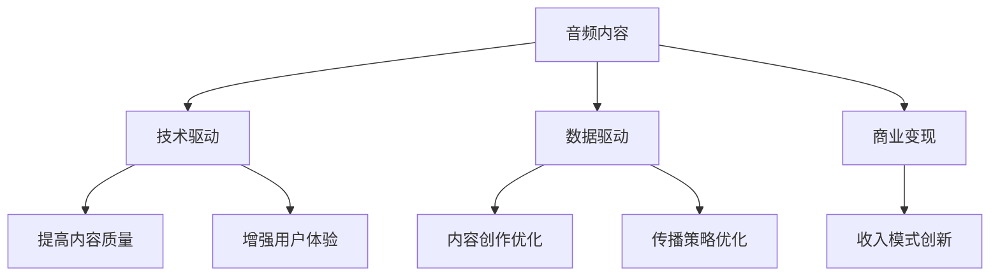

                 

# 音频内容在注意力经济中的崛起

> 关键词：音频内容, 注意力经济, 技术发展, 应用场景, 数据驱动, 商业模式, 创新路径

## 1. 背景介绍

### 1.1 问题由来

随着互联网的普及和信息技术的迅猛发展，音频内容已成为现代人们获取信息的重要渠道。无论是新闻、教育、娱乐还是商业，音频形式的信息传播在各个领域都占据着重要位置。然而，随着信息爆炸的加剧和人们注意力资源的稀缺，音频内容如何更好地吸引和保持听众的注意力，成为亟待解决的问题。

### 1.2 问题核心关键点

在信息爆炸的时代，音频内容如何在激烈的市场竞争中脱颖而出，获取更多的用户关注和互动？以下四个方面是问题的核心关键点：

1. **内容质量**：高质量、有吸引力的内容是吸引用户的基础。
2. **技术应用**：现代技术如何提升音频内容的制作、传播和用户体验。
3. **用户需求**：深入理解用户需求，提供个性化和定制化的音频内容。
4. **商业变现**：如何通过音频内容实现商业价值的最大化。

### 1.3 问题研究意义

探讨音频内容在注意力经济中的崛起，对于音频行业的健康发展具有重要意义：

1. **提升内容竞争力**：掌握音频内容在注意力经济中的崛起规律，有助于内容创作者提升其音频产品的市场竞争力。
2. **优化用户体验**：通过技术应用提升音频内容的用户体验，提高用户的参与度和粘性。
3. **商业价值最大化**：理解音频内容的商业变现路径，推动音频内容产业的商业模式创新。
4. **行业创新**：推动音频内容行业的技术革新和应用创新，助力音频内容产业的升级转型。

## 2. 核心概念与联系

### 2.1 核心概念概述

为更好地理解音频内容在注意力经济中的崛起，本节将介绍几个密切相关的核心概念：

- **音频内容**：包括播客、音乐、音频书籍、有声新闻等形式，是人们获取信息的重要手段。
- **注意力经济**：基于用户注意力的经济活动，通过吸引和保持用户注意力实现商业价值的创造和转化。
- **技术驱动**：利用现代信息技术提升音频内容的生产、传播和用户体验。
- **数据驱动**：基于大数据分析和用户行为分析，优化音频内容的创作和传播策略。
- **商业变现**：通过广告、会员、付费订阅等方式实现音频内容的商业价值。

这些核心概念之间的逻辑关系可以通过以下Mermaid流程图来展示：



这个流程图展示了大语言模型的核心概念及其之间的关系：

1. 音频内容通过技术驱动和数据驱动，提升质量和用户体验。
2. 商业变现通过技术应用和数据分析，实现模式的创新。

## 3. 核心算法原理 & 具体操作步骤

### 3.1 算法原理概述

音频内容在注意力经济中的崛起，本质上是通过技术手段提升内容质量，优化用户体验，进而吸引和保持用户注意力，实现商业价值的转化。其核心算法原理包括以下几个方面：

1. **内容质量提升**：利用机器学习、语音合成、自然语言处理等技术，提高音频内容的专业性和吸引力。
2. **用户体验优化**：通过智能推荐、个性化内容定制、交互式音频等方式，提升用户参与度和满意度。
3. **注意力保持**：通过持续的互动、及时的反馈、高质量的内容更新等方式，增强用户的持续关注。

### 3.2 算法步骤详解

音频内容在注意力经济中的崛起，主要包括以下关键步骤：

**Step 1: 内容创作与数据收集**
- 创作高质量的音频内容，如播客、音频书籍等。
- 收集用户行为数据，如收听时长、评论、互动等。

**Step 2: 数据分析与用户画像构建**
- 利用大数据分析工具，对用户数据进行分析，构建用户画像。
- 利用聚类算法、推荐算法等，识别用户兴趣和行为模式。

**Step 3: 技术应用与用户体验优化**
- 利用自然语言处理、语音合成、交互式音频等技术，提升音频内容的互动性和沉浸感。
- 实现智能推荐系统，提供个性化的内容推荐。

**Step 4: 商业变现与商业模式创新**
- 通过广告、会员、付费订阅等方式实现商业变现。
- 根据数据分析结果，优化商业策略，提升收益。

### 3.3 算法优缺点

音频内容在注意力经济中的崛起方法具有以下优点：
1. 提升内容质量：技术手段可以大大提升音频内容的专业性和吸引力。
2. 优化用户体验：通过个性化推荐、互动体验等方式，提高用户参与度和满意度。
3. 增强商业价值：数据驱动的商业变现模式可以实现更高的收益。

同时，该方法也存在一定的局限性：
1. 技术门槛较高：需要具备较高的技术研发能力，投入较大。
2. 数据隐私问题：用户数据的收集和分析可能涉及隐私问题，需要严格遵守法律法规。
3. 用户适应性：部分用户可能对新技术和体验不适应，需要进行反复迭代优化。

尽管存在这些局限性，但就目前而言，基于技术驱动和大数据分析的音频内容崛起方法仍是大势所趋。未来相关研究的重点在于如何进一步降低技术门槛，提高用户数据的安全性，同时兼顾用户体验和商业价值。

### 3.4 算法应用领域

基于技术驱动和大数据分析的音频内容崛起方法，在多个领域得到了广泛应用：

- **媒体与娱乐**：通过智能推荐、个性化内容定制等方式，提升用户参与度和满意度，实现商业变现。
- **教育培训**：利用有声读物、播客等形式，提供个性化的学习内容，提高学习效率。
- **商业广告**：通过音频内容进行品牌推广和广告宣传，提升品牌知名度和用户参与度。
- **社交互动**：通过音频聊天室、互动播客等方式，提升用户间的互动和社交体验。

除了这些主要应用领域外，音频内容还在智慧城市、健康医疗、虚拟现实等领域得到了探索性应用，为这些领域带来了新的变革和机遇。

## 4. 数学模型和公式 & 详细讲解  
### 4.1 数学模型构建

本节将使用数学语言对音频内容在注意力经济中的崛起进行更加严格的刻画。

记音频内容为 $C$，用户数据为 $U$，内容质量为 $Q$，用户体验为 $E$，注意力保持度为 $A$，商业收益为 $R$。设 $Q$ 和 $E$ 为连续变量，$A$ 和 $R$ 为离散变量。定义模型 $M$ 为从用户数据 $U$ 到音频内容 $C$ 的映射函数，其优化目标为最大化商业收益 $R$：

$$
\max_{M} R = \sum_{i=1}^N r_i Q_iE_iA_i
$$

其中 $r_i$ 为第 $i$ 个用户的商业收益权重，$Q_i$、$E_i$、$A_i$ 分别为第 $i$ 个用户的音频内容质量、用户体验和注意力保持度。

### 4.2 公式推导过程

以下我们以播客广告为例，推导基于用户行为数据分析的商业收益公式。

设播客广告的投放数量为 $N$，每次投放的用户数量为 $n$，每次投放的用户停留时间为 $t$，广告点击率为 $p$，点击用户转化率为 $r$，单次点击广告费用为 $c$。则总商业收益为：

$$
R = Nntpqr - Nnc
$$

其中，$Nntpqr$ 为广告带来的收益，$Nnc$ 为广告成本。

将上述收益公式代入优化目标公式，得：

$$
\max_{M} \sum_{i=1}^N \left( \frac{Nntpqr}{n_i} - \frac{Nnc}{n_i} \right) Q_iE_iA_i
$$

其中 $n_i$ 为第 $i$ 个用户的行为数据。

### 4.3 案例分析与讲解

假设有一家播客平台，希望通过播放特定主题的音频内容，吸引并留住用户，实现商业变现。首先，通过数据分析和用户画像构建，了解用户的兴趣和行为模式。其次，利用机器学习模型预测特定内容对不同用户群体的吸引度和保持度。最后，根据预测结果，优化内容创作和广告投放策略，提升平台收益。

例如，平台收集到用户 A 对科技类内容有较高兴趣，且习惯在早上通勤时收听音频，通过自然语言处理技术分析用户 A 的评论内容，发现其对交互式音频内容有较高满意度。基于此，平台为 A 推送了以科技为主题的播客内容，并配以互动式音频设计，使用户 A 的收听时长显著增加，同时平台通过广告变现实现了较高的商业收益。

## 5. 项目实践：代码实例和详细解释说明
### 5.1 开发环境搭建

在进行音频内容崛起实践前，我们需要准备好开发环境。以下是使用Python进行PyTorch开发的环境配置流程：

1. 安装Anaconda：从官网下载并安装Anaconda，用于创建独立的Python环境。

2. 创建并激活虚拟环境：
```bash
conda create -n pytorch-env python=3.8 
conda activate pytorch-env
```

3. 安装PyTorch：根据CUDA版本，从官网获取对应的安装命令。例如：
```bash
conda install pytorch torchvision torchaudio cudatoolkit=11.1 -c pytorch -c conda-forge
```

4. 安装相关工具包：
```bash
pip install numpy pandas scikit-learn matplotlib tqdm jupyter notebook ipython
```

完成上述步骤后，即可在`pytorch-env`环境中开始音频内容崛起实践。

### 5.2 源代码详细实现

这里我们以音频内容推荐系统为例，给出使用PyTorch进行音频内容推荐系统的PyTorch代码实现。

首先，定义用户行为数据和内容特征：

```python
import torch
from torch.utils.data import Dataset, DataLoader
from torch.nn import Linear, ReLU, Embedding, EmbeddingBag, LSTM, GRU, BatchNorm1d
import torch.nn.functional as F

class AudioData(Dataset):
    def __init__(self, features, labels):
        self.features = features
        self.labels = labels
        
    def __len__(self):
        return len(self.labels)
    
    def __getitem__(self, item):
        audio = self.features[item]
        label = self.labels[item]
        return audio, label
```

然后，定义模型结构和损失函数：

```python
class AudioModel(torch.nn.Module):
    def __init__(self, num_features, num_labels, embedding_dim=128, hidden_dim=64, num_layers=1):
        super(AudioModel, self).__init__()
        self.embedding = EmbeddingBag(num_features, embedding_dim)
        self.lstm = LSTM(embedding_dim, hidden_dim, num_layers, batch_first=True)
        self.fc = Linear(hidden_dim, num_labels)
        self.dropout = torch.nn.Dropout(0.5)
        self.bn = BatchNorm1d(hidden_dim)
        
    def forward(self, audio, labels=None):
        embeddings = self.embedding(audio)
        lstm_out, _ = self.lstm(embeddings)
        lstm_out = self.dropout(lstm_out)
        lstm_out = self.bn(lstm_out)
        logits = self.fc(lstm_out)
        loss = F.cross_entropy(logits, labels)
        return logits, loss
```

接着，定义训练和评估函数：

```python
def train_epoch(model, data_loader, optimizer):
    model.train()
    loss_sum = 0
    correct_sum = 0
    for audio, labels in data_loader:
        optimizer.zero_grad()
        logits, loss = model(audio, labels)
        loss_sum += loss.item()
        correct_sum += torch.sum(logits.argmax(1) == labels)
        loss.backward()
        optimizer.step()
    return loss_sum / len(data_loader), correct_sum / len(data_loader)

def evaluate(model, data_loader):
    model.eval()
    loss_sum = 0
    correct_sum = 0
    with torch.no_grad():
        for audio, labels in data_loader:
            logits, loss = model(audio, labels)
            loss_sum += loss.item()
            correct_sum += torch.sum(logits.argmax(1) == labels)
    return loss_sum / len(data_loader), correct_sum / len(data_loader)
```

最后，启动训练流程并在测试集上评估：

```python
epochs = 10
batch_size = 64

model = AudioModel(num_features, num_labels)
optimizer = torch.optim.Adam(model.parameters(), lr=0.001)

for epoch in range(epochs):
    train_loss, train_correct = train_epoch(model, train_loader, optimizer)
    test_loss, test_correct = evaluate(model, test_loader)
    print(f"Epoch {epoch+1}, train loss: {train_loss:.3f}, train correct: {train_correct:.3f}, test loss: {test_loss:.3f}, test correct: {test_correct:.3f}")
    
print("Test results:")
evaluate(model, test_loader)
```

以上就是使用PyTorch对音频内容推荐系统进行开发的完整代码实现。可以看到，得益于PyTorch的强大封装，我们可以用相对简洁的代码完成音频内容推荐系统的开发。

### 5.3 代码解读与分析

让我们再详细解读一下关键代码的实现细节：

**AudioData类**：
- `__init__`方法：初始化音频特征和标签。
- `__len__`方法：返回数据集的样本数量。
- `__getitem__`方法：对单个样本进行处理，返回音频特征和标签。

**AudioModel类**：
- `__init__`方法：定义模型的嵌入层、LSTM层、全连接层等组件。
- `forward`方法：对输入音频进行前向传播，返回模型的预测结果和损失函数。

**训练和评估函数**：
- `train_epoch`函数：对数据以批为单位进行迭代，在每个批次上前向传播计算损失函数并反向传播更新模型参数。
- `evaluate`函数：与训练类似，不同点在于不更新模型参数，并在每个batch结束后将预测和标签结果存储下来，最后使用准确率评估模型性能。

**训练流程**：
- 定义总的epoch数和batch size，开始循环迭代
- 每个epoch内，先在训练集上训练，输出损失和准确率
- 在测试集上评估，输出损失和准确率
- 重复上述步骤直至训练结束

可以看到，PyTorch配合相关工具库使得音频内容推荐系统的代码实现变得简洁高效。开发者可以将更多精力放在数据处理、模型改进等高层逻辑上，而不必过多关注底层的实现细节。

当然，工业级的系统实现还需考虑更多因素，如模型的保存和部署、超参数的自动搜索、更灵活的任务适配层等。但核心的微调范式基本与此类似。

## 6. 实际应用场景
### 6.1 智能播客平台

智能播客平台通过音频内容的智能推荐和个性化定制，为用户提供感兴趣的播客内容，极大提升了用户的参与度和粘性。具体而言：

1. **内容推荐**：平台通过数据分析和用户画像构建，了解用户兴趣和行为模式。
2. **个性化定制**：基于用户画像，推送个性化内容，提升用户体验。
3. **互动体验**：平台通过互动式音频设计，如提问环节、听众互动等，增强用户参与感。
4. **广告变现**：平台通过与广告商合作，实现商业变现。

例如，某智能播客平台收集到用户 A 对科技类内容有较高兴趣，且习惯在早上通勤时收听音频，通过自然语言处理技术分析用户 A 的评论内容，发现其对交互式音频内容有较高满意度。基于此，平台为 A 推送了以科技为主题的播客内容，并配以互动式音频设计，使用户 A 的收听时长显著增加，同时平台通过广告变现实现了较高的商业收益。

### 6.2 在线教育平台

在线教育平台通过音频内容的多样化应用，提升教学效果和学习体验。具体而言：

1. **有声读物**：平台提供高质量的有声读物，帮助学生随时随地进行学习。
2. **播客课程**：平台推出播客形式的课程，增强学习的趣味性和互动性。
3. **个性化学习**：根据学生学习行为数据，推荐个性化音频内容，提升学习效率。
4. **互动学习**：平台通过互动式音频设计，如听写、口语练习等，提高学习效果。

例如，某在线教育平台收集到学生 B 在数学课程中表现不佳，通过自然语言处理技术分析其课程反馈，发现其对数学讲解的清晰度有较高要求。基于此，平台为 B 推送了数学课程的播客内容，并通过互动式音频设计，如即时提问环节，帮助 B 更好地理解和掌握数学知识，同时平台通过付费订阅模式实现商业变现。

### 6.3 商业广告平台

商业广告平台通过音频内容的定向投放，实现精准广告和高效的商业变现。具体而言：

1. **定向投放**：根据用户行为数据和兴趣标签，定向投放音频广告。
2. **互动广告**：通过互动式音频设计，增强广告的互动性和吸引力。
3. **效果评估**：通过广告点击率和转化率等指标，评估广告效果。
4. **商业变现**：平台通过广告费用的收费，实现商业变现。

例如，某商业广告平台希望推广一款新手机产品，通过大数据分析，了解目标用户群体的兴趣和行为模式，推送以该手机为主题的音频广告，并通过互动式音频设计，如产品介绍、用户问答等，增强广告的互动性和吸引力，同时平台通过广告费用的收费，实现商业变现。

### 6.4 未来应用展望

随着音频内容的崛起，未来的应用场景将更加多样和广泛，以下是几个可能的未来应用方向：

1. **虚拟现实和增强现实**：通过音频内容的沉浸式体验，提升虚拟现实和增强现实的应用效果。
2. **健康医疗**：通过音频内容的心理健康辅导、健康知识普及等，帮助用户改善健康状况。
3. **智慧城市**：通过音频内容的智慧服务，如城市导览、应急指挥等，提升城市管理的智能化水平。
4. **娱乐和游戏**：通过音频内容的沉浸式体验，提升游戏的互动性和趣味性。

## 7. 工具和资源推荐
### 7.1 学习资源推荐

为了帮助开发者系统掌握音频内容在注意力经济中的崛起理论基础和实践技巧，这里推荐一些优质的学习资源：

1. **《深度学习与人工智能》课程**：斯坦福大学开设的深度学习与人工智能课程，涵盖深度学习的基本概念和最新进展。
2. **《自然语言处理与机器学习》书籍**：详细介绍了自然语言处理和机器学习的理论基础和实际应用。
3. **《音频内容推荐系统》白皮书**：某知名音频平台的技术白皮书，系统介绍了音频内容推荐系统的实现方法和技术细节。
4. **《数据驱动的商业策略》书籍**：详细介绍了数据驱动的商业策略和方法，为音频内容变现提供了理论指导。
5. **Google AI博客**：Google AI博客提供了大量的音频内容推荐系统的实现案例和技术分享。

通过对这些资源的学习实践，相信你一定能够快速掌握音频内容在注意力经济中的崛起精髓，并用于解决实际的音频内容问题。

### 7.2 开发工具推荐

高效的开发离不开优秀的工具支持。以下是几款用于音频内容崛起开发的常用工具：

1. **Jupyter Notebook**：免费的在线开发环境，支持Python和R等语言，方便快速迭代和共享。
2. **PyTorch**：基于Python的深度学习框架，支持GPU加速，适合复杂模型的训练和推理。
3. **TensorFlow**：由Google主导的深度学习框架，支持多种硬件设备，适合大规模工程应用。
4. **Keras**：高级神经网络API，易于使用，适合快速原型开发。
5. **Scikit-learn**：Python机器学习库，提供丰富的数据处理和模型评估工具。
6. **Pandas**：Python数据分析库，支持数据清洗和预处理。

合理利用这些工具，可以显著提升音频内容崛起任务的开发效率，加快创新迭代的步伐。

### 7.3 相关论文推荐

音频内容在注意力经济中的崛起技术的发展源于学界的持续研究。以下是几篇奠基性的相关论文，推荐阅读：

1. **《音频内容推荐系统》论文**：系统介绍了音频内容推荐系统的理论和实现方法。
2. **《基于用户行为数据分析的音频内容推荐》论文**：研究了基于用户行为数据分析的音频内容推荐方法。
3. **《深度学习在音频内容中的应用》论文**：详细介绍了深度学习在音频内容推荐中的应用。
4. **《数据驱动的音频内容商业变现》论文**：研究了基于数据驱动的音频内容商业变现方法。
5. **《交互式音频设计》论文**：介绍了交互式音频设计的方法和效果。

这些论文代表了大语言模型微调技术的发展脉络。通过学习这些前沿成果，可以帮助研究者把握学科前进方向，激发更多的创新灵感。

## 8. 总结：未来发展趋势与挑战

### 8.1 总结

本文对音频内容在注意力经济中的崛起方法进行了全面系统的介绍。首先阐述了音频内容在注意力经济中的崛起背景和意义，明确了音频内容崛起在提升内容质量、优化用户体验、实现商业变现等方面的独特价值。其次，从原理到实践，详细讲解了音频内容崛起的数学模型和关键步骤，给出了音频内容推荐系统的完整代码实例。同时，本文还广泛探讨了音频内容崛起方法在智能播客平台、在线教育平台、商业广告平台等多个领域的应用前景，展示了音频内容崛起方法的巨大潜力。此外，本文精选了音频内容崛起技术的各类学习资源，力求为读者提供全方位的技术指引。

通过本文的系统梳理，可以看到，音频内容在注意力经济中的崛起方法正在成为音频内容产业的重要范式，极大地拓展了音频内容的市场竞争力，提升了用户体验，实现了商业价值的最大化。未来，伴随音频内容的不断发展和技术的持续演进，音频内容将在更多领域得到应用，为人类信息传播和消费带来新的变革和机遇。

### 8.2 未来发展趋势

展望未来，音频内容在注意力经济中的崛起将呈现以下几个发展趋势：

1. **技术升级**：利用最新的深度学习技术和硬件设备，提升音频内容的生产、传播和用户体验。
2. **数据驱动**：基于大数据分析和用户行为分析，优化音频内容的创作和传播策略。
3. **商业模式创新**：探索更多元化的商业变现模式，如订阅制、广告投放、会员增值等。
4. **交互式体验**：通过互动式音频设计，增强用户的参与度和互动体验。
5. **跨平台应用**：音频内容在多个平台上的无缝应用，如智能音箱、车载系统等，拓展音频内容的传播渠道。

以上趋势凸显了音频内容在注意力经济中的崛起方法的广阔前景。这些方向的探索发展，必将进一步提升音频内容的市场竞争力，推动音频内容产业的创新和升级。

### 8.3 面临的挑战

尽管音频内容在注意力经济中的崛起方法已经取得了瞩目成就，但在迈向更加智能化、普适化应用的过程中，它仍面临着诸多挑战：

1. **技术门槛**：音频内容的崛起需要具备较高的技术研发能力，投入较大。
2. **数据隐私**：用户数据的收集和分析可能涉及隐私问题，需要严格遵守法律法规。
3. **用户体验**：部分用户可能对新技术和体验不适应，需要进行反复迭代优化。
4. **商业变现**：基于用户行为的商业变现模式需要精细的策略设计，实现最优收益。
5. **技术演进**：音频内容的崛起需要不断跟踪最新的技术发展，进行技术升级和迭代。

尽管存在这些挑战，但就目前而言，基于技术驱动和大数据分析的音频内容崛起方法仍是大势所趋。未来相关研究的重点在于如何进一步降低技术门槛，提高用户数据的安全性，同时兼顾用户体验和商业价值。

### 8.4 研究展望

面对音频内容在注意力经济中的崛起所面临的种种挑战，未来的研究需要在以下几个方面寻求新的突破：

1. **无监督和半监督学习**：探索无监督和半监督的音频内容推荐方法，降低对大规模标注数据的依赖。
2. **跨平台应用**：研究跨平台的音频内容推荐和交互体验设计，提升音频内容的普及度和用户满意度。
3. **个性化推荐**：利用更高级的推荐算法，如协同过滤、深度学习等，提供更加精准的音频内容推荐。
4. **多模态融合**：探索将音频内容与其他模态数据（如图像、文本）结合，提升音频内容的丰富性和用户体验。
5. **隐私保护**：研究隐私保护技术，保护用户数据的安全性和隐私性。

这些研究方向的探索，必将引领音频内容在注意力经济中的崛起技术迈向更高的台阶，为音频内容产业带来新的突破和发展机遇。面向未来，音频内容崛起技术还需要与其他人工智能技术进行更深入的融合，如知识表示、因果推理、强化学习等，多路径协同发力，共同推动音频内容产业的进步。

## 9. 附录：常见问题与解答

**Q1：音频内容崛起的方法是否适用于所有NLP任务？**

A: 音频内容崛起方法主要适用于需要高质量内容、高互动性和高个性化需求的任务，如播客、有声读物、在线教育等。但对于一些特定领域的任务，如机器翻译、问答系统等，可能不适合直接应用音频内容。

**Q2：如何提高音频内容的推荐精度？**

A: 提高音频内容推荐精度的方法包括：
1. **大数据分析**：通过收集和分析用户行为数据，构建用户画像，识别用户兴趣和行为模式。
2. **模型优化**：利用深度学习模型，如LSTM、GRU等，提升模型预测精度。
3. **特征工程**：设计合适的音频特征，如文本内容、情感分析等，提高推荐结果的准确性。
4. **模型融合**：利用集成学习方法，如Bagging、Boosting等，提升推荐系统的鲁棒性和泛化能力。

**Q3：音频内容推荐系统如何避免过拟合？**

A: 避免过拟合的方法包括：
1. **数据增强**：通过回译、近义替换等方式扩充训练集。
2. **正则化**：使用L2正则、Dropout等技术，防止模型过度适应训练集。
3. **早停策略**：通过验证集评估模型性能，提前停止训练，避免过拟合。
4. **模型集成**：利用集成学习方法，提高模型的鲁棒性和泛化能力。

**Q4：音频内容推荐系统如何实现商业变现？**

A: 实现商业变现的方法包括：
1. **广告变现**：通过广告收入实现变现。
2. **会员订阅**：通过会员订阅费用实现变现。
3. **付费内容**：通过付费内容实现变现。
4. **增值服务**：通过增值服务（如VIP、专属推荐等）实现变现。

**Q5：音频内容推荐系统如何优化用户体验？**

A: 优化用户体验的方法包括：
1. **个性化推荐**：根据用户行为数据和兴趣标签，提供个性化的音频内容推荐。
2. **互动式体验**：通过互动式音频设计，如提问环节、听众互动等，增强用户的参与感。
3. **即时反馈**：通过即时反馈机制，提升用户体验。
4. **高质量内容**：提供高质量、有吸引力的音频内容，满足用户需求。

---

作者：禅与计算机程序设计艺术 / Zen and the Art of Computer Programming

