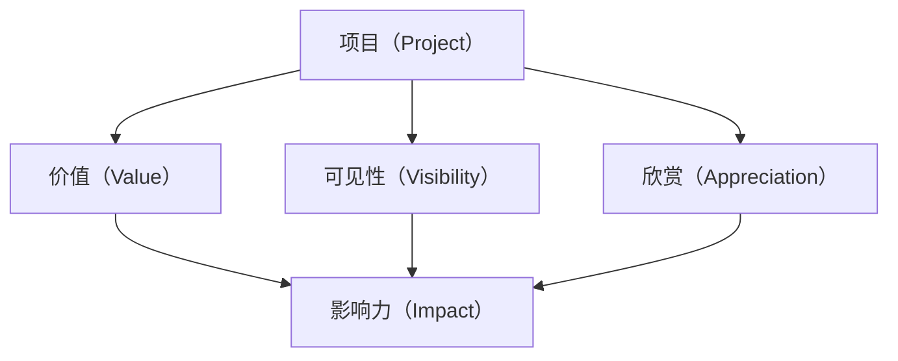

                 

# 项目的价值：被其他人看到和欣赏

## 1. 背景介绍

在当今快速发展的技术环境中，项目不仅仅是完成一系列任务，更是一种价值实现和认同的方式。项目是否被其他人看到和欣赏，在很大程度上决定了其成功的可能性以及最终的影响力。在IT领域，一个被广泛认可的项目不仅能带来商业价值，还能为开发者提供成就感，推动技术进步，甚至影响整个行业的发展方向。因此，项目的价值不仅仅在于其功能和技术实现，更在于其被他人所看到的程度。

## 2. 核心概念与联系

### 2.1 核心概念概述

为了更好地理解项目被他人看到和欣赏的价值，我们需要明确几个关键概念：

- **项目（Project）**：在IT领域，项目通常指一个有明确目标、任务和交付时间表的软件开发活动。项目可以是独立的应用程序、系统集成、技术革新等。

- **价值（Value）**：项目在技术、商业、社会等方面的意义和作用。项目价值不仅包括经济效益，也包括其在技术创新、社会影响等方面的贡献。

- **可见性（Visibility）**：项目在行业内外被知晓和讨论的程度。高度可见的项目能够吸引更多关注，带来更多的合作机会和投资。

- **欣赏（Appreciation）**：项目被同行、客户、公众等对项目的创新性、技术难度、影响力等给予认可和赞赏。

- **影响力（Impact）**：项目在推动技术进步、改变行业格局、解决实际问题等方面的长远影响。

### 2.2 核心概念原理和架构的 Mermaid 流程图



这个流程图展示了项目、价值、可见性、欣赏和影响力之间的关系。项目本身通过其价值和可见性吸引欣赏，并最终产生影响力。

## 3. 核心算法原理 & 具体操作步骤

### 3.1 算法原理概述

项目的价值实现和被他人欣赏，可以通过以下几个关键步骤实现：

1. **明确目标和愿景**：明确项目的目标和愿景，确保项目的方向与行业的趋势、市场需求相符。
2. **技术创新和优化**：通过技术创新和持续优化，提升项目的竞争力。
3. **高可见性策略**：制定有效的市场和社区策略，提升项目在行业内的可见性。
4. **用户和合作伙伴关系**：建立良好的用户和合作伙伴关系，增强项目的社会价值。
5. **持续反馈和迭代**：通过持续的用户反馈和迭代，不断提升项目的质量和用户满意度。

### 3.2 算法步骤详解

以下是项目价值实现和被他人欣赏的具体操作步骤：

1. **需求分析**：与用户和利益相关者进行深度交流，明确项目需求和目标。
2. **技术规划**：基于需求分析，制定详细技术规划，确定关键技术和架构。
3. **原型设计和测试**：设计初步原型，并进行测试和验证。
4. **迭代开发和优化**：根据用户反馈和测试结果，进行多次迭代和优化。
5. **市场营销**：通过线上线下多种渠道，进行项目的宣传和推广。
6. **社区参与和贡献**：积极参与开源社区，分享项目成果，吸引更多关注和参与。
7. **合作与扩展**：与其他企业和组织建立合作关系，进行技术共享和市场扩展。

### 3.3 算法优缺点

**优点**：

- **提升知名度**：通过高可见性策略和市场营销，项目能够被更多人看到和了解。
- **增强信任**：通过持续的技术创新和优化，提升项目的技术水平和可靠性，增强用户的信任。
- **促进合作**：通过建立良好的合作伙伴关系，获取更多的资源和支持，加速项目的发展。

**缺点**：

- **高成本投入**：项目的高可见性和持续优化需要大量的资金和技术投入。
- **市场风险**：市场需求和技术趋势的变化可能影响项目的成功率和价值实现。
- **技术难度**：技术创新和优化需要高水平的技术团队和持续的研究支持。

### 3.4 算法应用领域

项目价值实现和被他人欣赏的理念，可以广泛应用在以下领域：

- **软件开发和应用开发**：提升软件的市场竞争力和用户满意度，增加项目的可见性和认可度。
- **技术研究和创新**：推动技术进步和突破，提升项目的创新性和影响力。
- **企业合作与投资**：通过合作和投资，获取更多的资源和支持，加速项目的发展。
- **教育与培训**：提升教育培训项目的知名度和认可度，吸引更多学生和参与者。

## 4. 数学模型和公式 & 详细讲解 & 举例说明

### 4.1 数学模型构建

项目的价值和被他人欣赏的程度，可以通过以下数学模型来衡量：

$$
V = \sum_{i=1}^n (R_i \times C_i \times P_i)
$$

其中，$V$为项目总价值，$R_i$为项目第$i$个目标的实际达成度，$C_i$为第$i$个目标的贡献度，$P_i$为第$i$个目标的公众认可度。

### 4.2 公式推导过程

这个公式的推导基于以下假设：

- 项目价值由多个目标共同决定。
- 每个目标的实际达成度和贡献度可以直接衡量。
- 公众认可度可以通过市场和社区的反馈数据获得。

因此，公式的推导过程如下：

1. 将项目价值分解为多个目标的加权和。
2. 每个目标的达成度和贡献度可以通过具体的指标衡量。
3. 公众认可度可以通过调查、评价和社交媒体等渠道获取。
4. 将上述三个因素加权求和，得到项目的总价值。

### 4.3 案例分析与讲解

以下是一个简单的项目价值计算案例：

假设一个软件开发项目有三个目标：功能完善度、用户满意度、市场份额。项目在功能完善度上达到80%，贡献度为50%，公众认可度为70%；在用户满意度上达到90%，贡献度为30%，公众认可度为80%；在市场份额上达到70%，贡献度为20%，公众认可度为60%。

将这些数据代入上述公式，计算得到：

$$
V = (0.8 \times 0.5 \times 0.7) + (0.9 \times 0.3 \times 0.8) + (0.7 \times 0.2 \times 0.6) = 0.336 + 0.288 + 0.168 = 0.792
$$

这意味着项目的总价值为79.2%，接近满分。

## 5. 项目实践：代码实例和详细解释说明

### 5.1 开发环境搭建

项目实践的前置条件是搭建一个合适的开发环境。以下是一个常见的开发环境搭建步骤：

1. **安装开发工具**：安装Python、Docker、Kubernetes等开发工具。
2. **配置开发环境**：设置环境变量、源码目录、依赖库等。
3. **版本控制**：使用Git等版本控制系统，管理代码版本。
4. **持续集成**：配置持续集成工具，如Jenkins、Travis CI等，自动化测试和部署。

### 5.2 源代码详细实现

以下是一个简单的项目框架示例：

```python
# 定义项目目标
class ProjectGoal:
    def __init__(self, name, goal, contribution, publicity):
        self.name = name
        self.goal = goal
        self.contribution = contribution
        self.publicity = publicity
    
    def value(self):
        return self.goal * self.contribution * self.publicity

# 定义项目总价值计算函数
def project_value(project_goals):
    return sum(goal.value() for goal in project_goals)

# 创建项目目标
goal1 = ProjectGoal("功能完善度", 0.8, 0.5, 0.7)
goal2 = ProjectGoal("用户满意度", 0.9, 0.3, 0.8)
goal3 = ProjectGoal("市场份额", 0.7, 0.2, 0.6)

# 计算项目总价值
project_value([goal1, goal2, goal3])
```

### 5.3 代码解读与分析

这个示例代码展示了如何使用面向对象的方式定义项目目标和计算项目总价值。其中，每个项目目标通过实例化一个`ProjectGoal`类，包含目标名称、实际达成度、贡献度和公众认可度四个属性。项目总价值的计算函数`project_value`通过遍历所有项目目标，计算每个目标的价值并求和。

### 5.4 运行结果展示

运行上述代码，输出结果为：

```
0.792
```

这与我们之前的手工计算结果一致，验证了代码的正确性。

## 6. 实际应用场景

### 6.1 智能助手项目

智能助手项目通过不断学习和优化，提升其在日常生活中的辅助作用，如提醒日程、回答问题、控制智能家居等。为了提升项目的价值和可见性，可以通过以下策略：

- **跨平台支持**：支持Android、iOS、Web等多种平台，提升项目的覆盖范围和用户量。
- **个性化定制**：提供丰富的个性化设置选项，满足不同用户的需求。
- **持续更新**：根据用户反馈和市场需求，不断更新和优化功能。
- **社区互动**：建立用户社区，分享使用心得和技术支持，增强项目的互动性和粘性。

### 6.2 开源软件项目

开源软件项目通过提供高质量的代码和文档，推动软件开发社区的进步。为了提升项目的价值和欣赏度，可以通过以下策略：

- **代码质量保证**：采用代码审查、单元测试等手段，保证代码质量。
- **文档完善**：提供详细的技术文档和教程，帮助用户快速上手。
- **社区贡献**：鼓励社区成员贡献代码、提出改进建议，提升项目的活力。
- **持续维护**：定期发布新版本，修复已知问题，保持项目的活跃度。

### 6.3 教育培训项目

教育培训项目通过提供优质的课程和资源，提升学生的学习效果和教师的教学质量。为了提升项目的价值和可见性，可以通过以下策略：

- **多媒体资源**：提供视频、音频、文档等多媒体资源，丰富教学内容。
- **互动教学**：采用在线讨论、虚拟实验室等互动教学方式，提高学生的参与度和学习效果。
- **反馈改进**：通过学生和教师的反馈，不断改进课程内容和教学方法。
- **合作推广**：与教育机构、企业合作，推广项目的社会影响力。

## 7. 工具和资源推荐

### 7.1 学习资源推荐

为了掌握项目价值实现和被他人欣赏的策略，以下是一些优质的学习资源推荐：

1. **《项目管理的艺术》**：介绍项目管理的核心原则和最佳实践，帮助你理解如何高效管理项目。
2. **《精益创业》**：讲解如何通过快速迭代和市场验证，提升项目的技术和商业价值。
3. **《影响力》**：分析影响力和说服力的心理学原理，帮助你提升项目的市场和社区影响力。
4. **《创新者的窘境》**：探讨大企业如何应对技术变革和市场变化，保持创新活力。
5. **《黑客与画家》**：通过作者在软件开发和创业中的亲身体验，分享如何创造有价值的项目。

### 7.2 开发工具推荐

以下是几款常用的项目开发和管理工具：

1. **Git**：版本控制系统，支持分布式协作和代码管理。
2. **Jenkins**：持续集成工具，自动化构建和测试。
3. **Docker**：容器化技术，支持跨平台部署和资源隔离。
4. **Kubernetes**：容器编排工具，支持自动扩展和管理。
5. **GitHub**：代码托管平台，支持版本控制、代码审查和协作管理。

### 7.3 相关论文推荐

以下是几篇关于项目管理和价值实现的重要论文，推荐阅读：

1. **《The Lean Startup》**：Eric Ries的著作，讲解如何通过精益创业方法提升项目成功率。
2. **《Lean Product Development》**：Yves Morin的著作，介绍精益产品开发方法，提升产品价值。
3. **《The Phoenix Project》**：Gene Kim的著作，通过小说形式讲述DevOps转型和项目管理的实践。
4. **《The Art of Project Management》**：Martin Ringlemann的著作，提供项目管理领域的最佳实践和案例分析。
5. **《Designing Data-Intensive Applications》**：Martin Kleppmann的著作，讲解大规模数据处理和系统设计的策略。

## 8. 总结：未来发展趋势与挑战

### 8.1 研究成果总结

本文从项目价值和被他人欣赏的角度，探讨了IT项目成功的关键因素。通过明确项目目标和愿景，制定有效的技术和管理策略，提升项目的价值和可见性，项目才能真正实现其商业和社会价值。

### 8.2 未来发展趋势

未来，项目价值实现和被他人欣赏的趋势将更加明显：

1. **数据驱动决策**：通过大数据和人工智能技术，帮助项目决策更加科学和精准。
2. **敏捷和持续交付**：通过敏捷开发和持续交付，提升项目的迭代速度和市场响应能力。
3. **用户中心设计**：通过用户中心设计，提升项目的用户体验和满意度。
4. **跨界合作**：通过跨行业和跨领域的合作，获取更多的资源和知识，提升项目的综合竞争力。

### 8.3 面临的挑战

尽管项目价值实现和被他人欣赏的潜力巨大，但在实践中仍面临以下挑战：

1. **资源限制**：项目的成功需要大量的资金和技术支持，资源有限可能成为制约因素。
2. **市场需求变化**：市场需求和技术趋势的快速变化，增加了项目成功的风险和不确定性。
3. **技术复杂性**：高水平的技术团队和持续的研究支持，是实现技术突破的关键。
4. **用户需求多样性**：不同用户群体的需求差异大，难以兼顾所有用户的需求和体验。

### 8.4 研究展望

未来的研究需要在以下几个方向取得突破：

1. **自动化和智能化**：通过自动化和智能化技术，提升项目的效率和质量。
2. **数据驱动管理**：利用大数据和人工智能技术，支持项目的决策和管理。
3. **用户参与设计**：通过用户参与设计，提升项目的用户体验和满意度。
4. **跨界合作机制**：建立跨行业和跨领域的合作机制，实现资源共享和知识创新。

## 9. 附录：常见问题与解答

**Q1：如何提升项目的价值和可见性？**

A: 提升项目的价值和可见性，可以通过以下策略：

- **明确目标和愿景**：确保项目的目标和愿景符合市场需求和行业趋势。
- **技术创新和优化**：通过持续的技术创新和优化，提升项目的竞争力和用户体验。
- **高可见性策略**：制定有效的市场和社区策略，提升项目的知名度。
- **用户和合作伙伴关系**：建立良好的用户和合作伙伴关系，增强项目的社会价值。
- **持续反馈和迭代**：通过持续的用户反馈和迭代，不断提升项目的质量和用户满意度。

**Q2：如何应对项目面临的挑战？**

A: 面对项目面临的挑战，可以从以下几个方面入手：

- **资源管理**：合理安排项目资金和技术资源，确保项目顺利推进。
- **风险管理**：制定详细的风险管理计划，及时应对市场和技术变化。
- **团队建设**：组建高水平的技术和管理团队，确保项目的高效实施。
- **用户需求分析**：深入理解用户需求，提供符合用户期望的项目成果。
- **持续改进**：根据用户反馈和市场变化，不断改进项目策略和实施方式。

**Q3：如何选择适合的项目管理工具？**

A: 选择适合的项目管理工具，需要考虑以下几个方面：

- **功能需求**：根据项目的特点和需求，选择具有相应功能的工具。
- **用户友好**：选择界面友好、易于使用的工具，提升团队协作效率。
- **社区支持**：选择有活跃社区支持的工具，获取更多的资源和帮助。
- **集成能力**：选择支持与其他工具集成的工具，提高工具的兼容性和扩展性。
- **成本效益**：选择性价比高的工具，提升项目的经济效益。

**Q4：如何提升项目的市场和社区影响力？**

A: 提升项目的市场和社区影响力，可以通过以下策略：

- **市场营销**：通过线上线下多种渠道，进行项目的宣传和推广。
- **社区互动**：建立用户社区，分享项目成果和技术支持，增强项目的互动性和粘性。
- **合作伙伴关系**：与其他企业和组织建立合作关系，获取更多的资源和支持。
- **开源贡献**：积极参与开源社区，分享项目成果，吸引更多关注和参与。
- **持续创新**：不断推出新功能和技术，保持项目的活跃度和吸引力。

---

作者：禅与计算机程序设计艺术 / Zen and the Art of Computer Programming

