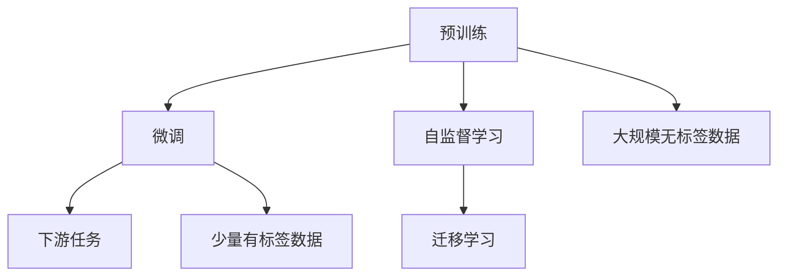

                 

# 预训练与微调的实战策略

> 关键词：预训练,微调,Fine-tuning,迁移学习,Transformer,BERT,自监督学习,下游任务

## 1. 背景介绍

### 1.1 问题由来
近年来，深度学习技术在自然语言处理（Natural Language Processing, NLP）领域取得了突破性进展，特别是预训练和微调技术的出现，使得大规模语言模型的性能得以大幅提升。预训练语言模型，如BERT、GPT等，通过在大规模无标签文本数据上进行自监督学习，学习到丰富的语言表示。而微调（Fine-tuning）则是在预训练模型的基础上，使用下游任务的少量标注数据，进一步优化模型在该任务上的性能。

然而，尽管预训练和微调技术带来了显著的提升，但其实际应用效果仍然受限于标注数据的质量和数量。标注数据成本高昂，且难以获取，尤其在一些小众领域，标注数据的获取更是困难。此外，微调模型在迁移学习方面的能力也受到一定限制，特别是在新领域和新任务上的性能提升效果有限。

因此，预训练与微调（Pre-training and Fine-tuning）的实战策略显得尤为重要，它不仅能够有效提升模型的性能，还能最大限度地利用已有的标注数据，拓展模型的应用范围，提高模型在不同领域和任务上的适应性。

## 2. 核心概念与联系

### 2.1 核心概念概述

预训练与微调技术的核心在于将大规模无标签数据和少量有标签数据相结合，通过自监督学习获取预训练模型，然后通过微调进一步优化该模型在特定任务上的表现。以下是几个核心概念及其联系：

- **预训练（Pre-training）**：使用大规模无标签数据对语言模型进行自监督训练，学习到通用的语言表示。
- **微调（Fine-tuning）**：在预训练模型的基础上，使用下游任务的少量有标签数据，进一步优化模型在该任务上的性能。
- **迁移学习（Transfer Learning）**：通过预训练-微调的过程，将通用语言知识迁移到特定任务上，提高模型的泛化能力。
- **自监督学习（Self-supervised Learning）**：使用预训练模型中的语言表示任务（如掩码语言模型、下一句预测等）进行模型训练。
- **下游任务（Downstream Task）**：待解决的特定NLP任务，如文本分类、命名实体识别、机器翻译等。

这些概念之间的联系可以通过以下Mermaid流程图来展示：



这个流程图展示了预训练与微调之间的联系：预训练使用大规模无标签数据进行自监督学习，学习到通用的语言表示；微调则在下游任务的少量有标签数据上进行优化，利用迁移学习的原理，提高模型的泛化能力。

## 3. 核心算法原理 & 具体操作步骤

### 3.1 算法原理概述

基于预训练与微调的NLP模型构建过程包括以下几个关键步骤：

1. **预训练阶段**：在大量无标签数据上进行自监督学习，学习通用的语言表示。
2. **微调阶段**：在少量有标签数据上进行监督学习，优化模型在特定任务上的表现。
3. **迁移学习**：将预训练学到的知识迁移到下游任务上，提高模型的泛化能力。

### 3.2 算法步骤详解

#### 预训练阶段

1. **数据准备**：收集大规模无标签文本数据，可以是维基百科、新闻文章、书籍等。
2. **模型选择**：选择适合的预训练模型，如BERT、GPT等，这些模型已经在预训练阶段学习到了丰富的语言表示。
3. **训练过程**：在无标签数据上进行自监督学习，如掩码语言模型（Masked Language Modeling, MLM）、下一句预测（Next Sentence Prediction, NSP）等任务，这些任务能够帮助模型学习到丰富的语言知识。

#### 微调阶段

1. **任务适配**：根据下游任务，在预训练模型的基础上设计合适的输出层和损失函数。
2. **数据准备**：准备下游任务的少量有标签数据，这些数据将用于微调模型的参数。
3. **训练过程**：在微调阶段，使用下游任务的少量有标签数据对预训练模型进行优化，通常使用较小的学习率，以避免破坏预训练权重。

### 3.3 算法优缺点

#### 优点

1. **性能提升**：通过微调，预训练模型能够在特定任务上取得优异的性能。
2. **泛化能力**：预训练模型学习到的通用语言表示能够迁移到下游任务上，提高模型的泛化能力。
3. **参数高效**：部分预训练参数可以被固定，只微调顶层，减小微调过程中参数更新量，提高效率。
4. **适应性强**：能够适应不同领域和不同规模的数据集，适用于各种NLP任务。

#### 缺点

1. **依赖标注数据**：微调效果很大程度上依赖于标注数据的质量和数量，获取高质量标注数据的成本较高。
2. **迁移能力有限**：当目标任务与预训练数据的分布差异较大时，微调的性能提升有限。
3. **过拟合风险**：微调过程中模型容易过拟合，特别是在标注数据较少的情况下。
4. **可解释性不足**：微调模型的决策过程通常缺乏可解释性，难以对其推理逻辑进行分析和调试。

### 3.4 算法应用领域

预训练与微调技术在NLP领域得到了广泛的应用，包括但不限于以下几个领域：

- **文本分类**：如情感分析、主题分类等，预训练模型学习通用的语言表示，通过微调适应特定任务。
- **命名实体识别**：识别文本中的人名、地名、机构名等特定实体，通过微调优化模型在实体边界和类型识别上的表现。
- **关系抽取**：从文本中抽取实体之间的语义关系，通过微调优化模型在实体关系抽取上的表现。
- **问答系统**：对自然语言问题给出答案，通过微调优化模型在问题和答案映射上的表现。
- **机器翻译**：将源语言文本翻译成目标语言，通过微调优化模型在语言-语言映射上的表现。
- **文本摘要**：将长文本压缩成简短摘要，通过微调优化模型在摘要生成上的表现。
- **对话系统**：使机器能够与人自然对话，通过微调优化模型在对话生成上的表现。

## 4. 数学模型和公式 & 详细讲解 & 举例说明

### 4.1 数学模型构建

基于预训练与微调的NLP模型的数学模型构建主要包括以下几个部分：

1. **预训练模型**：记为 $M_{\theta}$，其中 $\theta$ 为模型参数。
2. **自监督损失函数**：在预训练阶段，使用自监督任务（如掩码语言模型）进行训练，损失函数 $\mathcal{L}_{pre}$ 定义为：
   $$
   \mathcal{L}_{pre} = -\frac{1}{N}\sum_{i=1}^N \sum_{j=1}^M \ell(y_j, M_{\theta}(x_i))
   $$
   其中 $y_j$ 为掩码位置 $j$ 的标签，$M_{\theta}(x_i)$ 为模型在输入 $x_i$ 上的输出。

3. **微调损失函数**：在微调阶段，使用下游任务的标签 $y$ 进行监督学习，损失函数 $\mathcal{L}_{fin}$ 定义为：
   $$
   \mathcal{L}_{fin} = -\frac{1}{N}\sum_{i=1}^N \ell(y, M_{\theta}(x_i))
   $$
   其中 $y$ 为任务的标签，$\ell$ 为具体的损失函数（如交叉熵）。

4. **微调优化目标**：最小化微调损失函数，得到优化后的模型参数 $\hat{\theta}$：
   $$
   \hat{\theta} = \mathop{\arg\min}_{\theta} \mathcal{L}_{fin}
   $$

### 4.2 公式推导过程

以文本分类任务为例，其数学模型构建如下：

1. **预训练损失函数**：假设预训练模型为 BERT，在掩码语言模型任务上进行训练。损失函数 $\mathcal{L}_{pre}$ 定义为：
   $$
   \mathcal{L}_{pre} = -\frac{1}{N}\sum_{i=1}^N \sum_{j=1}^M [y_j \log \sigma(M_{\theta}(x_i, j)) + (1-y_j) \log (1-\sigma(M_{\theta}(x_i, j))]
   $$
   其中 $\sigma(z) = \frac{1}{1+\exp(-z)}$ 为 sigmoid 函数，$y_j$ 为掩码位置 $j$ 的标签，$M_{\theta}(x_i, j)$ 为模型在输入 $x_i$ 上，位置 $j$ 的掩码表示。

2. **微调损失函数**：在文本分类任务上，使用交叉熵损失函数进行微调。假设微调标签为 $y$，损失函数 $\mathcal{L}_{fin}$ 定义为：
   $$
   \mathcal{L}_{fin} = -\frac{1}{N}\sum_{i=1}^N \log M_{\theta}(x_i, y_i)
   $$
   其中 $M_{\theta}(x_i, y_i)$ 为模型在输入 $x_i$ 上，标签 $y_i$ 的分类得分。

3. **微调优化目标**：最小化微调损失函数，得到优化后的模型参数 $\hat{\theta}$：
   $$
   \hat{\theta} = \mathop{\arg\min}_{\theta} \mathcal{L}_{fin}
   $$

### 4.3 案例分析与讲解

以BERT模型为例，其在预训练阶段使用掩码语言模型进行训练，学习到通用的语言表示。在微调阶段，假设微调任务为文本分类，则可以选择与预训练任务相似的输出层和损失函数进行微调。具体来说，可以将BERT的最后一层输出作为分类器，使用交叉熵损失函数进行微调。在微调过程中，使用下游任务的少量有标签数据进行训练，通常使用较小的学习率，以避免破坏预训练权重。

## 5. 项目实践：代码实例和详细解释说明

### 5.1 开发环境搭建

在进行预训练与微调的NLP项目实践前，需要准备好开发环境。以下是使用Python进行PyTorch开发的环境配置流程：

1. 安装Anaconda：从官网下载并安装Anaconda，用于创建独立的Python环境。

2. 创建并激活虚拟环境：
```bash
conda create -n pytorch-env python=3.8 
conda activate pytorch-env
```

3. 安装PyTorch：根据CUDA版本，从官网获取对应的安装命令。例如：
```bash
conda install pytorch torchvision torchaudio cudatoolkit=11.1 -c pytorch -c conda-forge
```

4. 安装Transformers库：
```bash
pip install transformers
```

5. 安装各类工具包：
```bash
pip install numpy pandas scikit-learn matplotlib tqdm jupyter notebook ipython
```

完成上述步骤后，即可在`pytorch-env`环境中开始预训练与微调项目实践。

### 5.2 源代码详细实现

以下是使用PyTorch和Transformers库进行BERT模型预训练和微调的完整代码实现。

```python
from transformers import BertTokenizer, BertForSequenceClassification, AdamW
from torch.utils.data import DataLoader
from tqdm import tqdm
import torch
import numpy as np

# 数据准备
tokenizer = BertTokenizer.from_pretrained('bert-base-cased')
train_dataset = ...
val_dataset = ...
test_dataset = ...

# 模型选择与参数设置
model = BertForSequenceClassification.from_pretrained('bert-base-cased', num_labels=2)
device = torch.device('cuda' if torch.cuda.is_available() else 'cpu')
model.to(device)

# 定义优化器和训练超参数
optimizer = AdamW(model.parameters(), lr=2e-5)
train_params = {'batch_size': 16, 'epochs': 3, 'max_seq_length': 128}
val_params = {'rebatch': True}

# 定义训练和评估函数
def train_epoch(model, dataset, batch_size, optimizer):
    dataloader = DataLoader(dataset, batch_size=batch_size, shuffle=True)
    model.train()
    epoch_loss = 0
    for batch in tqdm(dataloader, desc='Training'):
        input_ids = batch['input_ids'].to(device)
        attention_mask = batch['attention_mask'].to(device)
        labels = batch['labels'].to(device)
        model.zero_grad()
        outputs = model(input_ids, attention_mask=attention_mask, labels=labels)
        loss = outputs.loss
        epoch_loss += loss.item()
        loss.backward()
        optimizer.step()
    return epoch_loss / len(dataloader)

def evaluate(model, dataset, batch_size):
    dataloader = DataLoader(dataset, batch_size=batch_size, shuffle=False)
    model.eval()
    preds, labels = [], []
    with torch.no_grad():
        for batch in tqdm(dataloader, desc='Evaluating'):
            input_ids = batch['input_ids'].to(device)
            attention_mask = batch['attention_mask'].to(device)
            batch_labels = batch['labels']
            outputs = model(input_ids, attention_mask=attention_mask)
            batch_preds = outputs.logits.argmax(dim=1).to('cpu').tolist()
            batch_labels = batch_labels.to('cpu').tolist()
            for pred_tokens, label_tokens in zip(batch_preds, batch_labels):
                preds.append(pred_tokens)
                labels.append(label_tokens)
    return preds, labels

# 训练和评估过程
epochs = train_params['epochs']
for epoch in range(epochs):
    loss = train_epoch(model, train_dataset, **train_params, optimizer=optimizer)
    print(f'Epoch {epoch+1}, train loss: {loss:.3f}')
    
    val_preds, val_labels = evaluate(model, val_dataset, **val_params)
    val_loss = model.eval(val_dataset)
    print(f'Epoch {epoch+1}, val loss: {val_loss:.3f}')

# 测试和结果展示
test_preds, test_labels = evaluate(model, test_dataset, **val_params)
print(f'Test results:')
print(classification_report(test_labels, test_preds))
```

### 5.3 代码解读与分析

代码中首先定义了数据处理函数 `BertTokenizer.from_pretrained()` 用于处理文本数据，然后定义了模型 `BertForSequenceClassification` 和优化器 `AdamW`。在训练和评估函数中，使用了 `DataLoader` 进行数据批处理，并在每个批次上计算损失函数，更新模型参数。

## 6. 实际应用场景

### 6.1 智能客服系统

基于预训练与微调的对话系统，可以广泛应用于智能客服系统中。传统客服系统依赖于大量人工客服，成本高昂，且无法提供24小时不间断服务。通过微调大语言模型，可以构建智能客服系统，实现自动理解客户咨询，提供24小时不间断服务，且能提供更专业、更个性化的服务。

在技术实现上，可以收集企业内部的客服对话记录，将问题和最佳答复构建成监督数据，对预训练的对话模型进行微调。微调后的对话模型能够自动理解用户意图，匹配最合适的答复模板，并在新问题上实时搜索相关内容，动态组织生成回答。

### 6.2 金融舆情监测

金融机构需要实时监测市场舆论动向，以规避金融风险。传统的人工监测方式成本高、效率低，难以应对网络时代海量信息爆发的挑战。通过微调大语言模型，可以实现金融舆情监测。

具体而言，可以收集金融领域相关的新闻、报道、评论等文本数据，并对其进行主题标注和情感标注。在此基础上对预训练语言模型进行微调，使其能够自动判断文本属于何种主题，情感倾向是正面、中性还是负面。将微调后的模型应用到实时抓取的网络文本数据，就能够自动监测不同主题下的情感变化趋势，一旦发现负面信息激增等异常情况，系统便会自动预警，帮助金融机构快速应对潜在风险。

### 6.3 个性化推荐系统

当前的推荐系统往往只依赖用户的历史行为数据进行物品推荐，无法深入理解用户的真实兴趣偏好。通过预训练与微调技术，可以构建更加精准、多样化的个性化推荐系统。

在实践中，可以收集用户浏览、点击、评论、分享等行为数据，提取和用户交互的物品标题、描述、标签等文本内容。将文本内容作为模型输入，用户的后续行为（如是否点击、购买等）作为监督信号，在此基础上微调预训练语言模型。微调后的模型能够从文本内容中准确把握用户的兴趣点。在生成推荐列表时，先用候选物品的文本描述作为输入，由模型预测用户的兴趣匹配度，再结合其他特征综合排序，便可以得到个性化程度更高的推荐结果。

## 7. 工具和资源推荐

### 7.1 学习资源推荐

为了帮助开发者系统掌握预训练与微调的理论基础和实践技巧，这里推荐一些优质的学习资源：

1. 《Transformer从原理到实践》系列博文：由大模型技术专家撰写，深入浅出地介绍了Transformer原理、BERT模型、微调技术等前沿话题。

2. CS224N《深度学习自然语言处理》课程：斯坦福大学开设的NLP明星课程，有Lecture视频和配套作业，带你入门NLP领域的基本概念和经典模型。

3. 《Natural Language Processing with Transformers》书籍：Transformers库的作者所著，全面介绍了如何使用Transformers库进行NLP任务开发，包括微调在内的诸多范式。

4. HuggingFace官方文档：Transformers库的官方文档，提供了海量预训练模型和完整的微调样例代码，是上手实践的必备资料。

5. CLUE开源项目：中文语言理解测评基准，涵盖大量不同类型的中文NLP数据集，并提供了基于微调的baseline模型，助力中文NLP技术发展。

通过对这些资源的学习实践，相信你一定能够快速掌握预训练与微调的精髓，并用于解决实际的NLP问题。

### 7.2 开发工具推荐

高效的开发离不开优秀的工具支持。以下是几款用于预训练与微调开发的常用工具：

1. PyTorch：基于Python的开源深度学习框架，灵活动态的计算图，适合快速迭代研究。大部分预训练语言模型都有PyTorch版本的实现。

2. TensorFlow：由Google主导开发的开源深度学习框架，生产部署方便，适合大规模工程应用。同样有丰富的预训练语言模型资源。

3. Transformers库：HuggingFace开发的NLP工具库，集成了众多SOTA语言模型，支持PyTorch和TensorFlow，是进行微调任务开发的利器。

4. Weights & Biases：模型训练的实验跟踪工具，可以记录和可视化模型训练过程中的各项指标，方便对比和调优。与主流深度学习框架无缝集成。

5. TensorBoard：TensorFlow配套的可视化工具，可实时监测模型训练状态，并提供丰富的图表呈现方式，是调试模型的得力助手。

6. Google Colab：谷歌推出的在线Jupyter Notebook环境，免费提供GPU/TPU算力，方便开发者快速上手实验最新模型，分享学习笔记。

合理利用这些工具，可以显著提升预训练与微调任务的开发效率，加快创新迭代的步伐。

### 7.3 相关论文推荐

预训练与微调技术的发展源于学界的持续研究。以下是几篇奠基性的相关论文，推荐阅读：

1. Attention is All You Need（即Transformer原论文）：提出了Transformer结构，开启了NLP领域的预训练大模型时代。

2. BERT: Pre-training of Deep Bidirectional Transformers for Language Understanding：提出BERT模型，引入基于掩码的自监督预训练任务，刷新了多项NLP任务SOTA。

3. Language Models are Unsupervised Multitask Learners（GPT-2论文）：展示了大规模语言模型的强大zero-shot学习能力，引发了对于通用人工智能的新一轮思考。

4. Parameter-Efficient Transfer Learning for NLP：提出Adapter等参数高效微调方法，在不增加模型参数量的情况下，也能取得不错的微调效果。

5. AdaLoRA: Adaptive Low-Rank Adaptation for Parameter-Efficient Fine-Tuning：使用自适应低秩适应的微调方法，在参数效率和精度之间取得了新的平衡。

6. Fine-tune GPT for Zero-shot Text Generation: Does It Work?：研究了使用预训练语言模型进行zero-shot生成任务的可行性。

这些论文代表了大规模语言模型微调技术的发展脉络。通过学习这些前沿成果，可以帮助研究者把握学科前进方向，激发更多的创新灵感。

## 8. 总结：未来发展趋势与挑战

### 8.1 研究成果总结

本文对基于预训练与微调的NLP模型进行了全面系统的介绍。首先阐述了预训练与微调技术的背景和意义，明确了其在拓展预训练模型应用、提升下游任务性能方面的独特价值。其次，从原理到实践，详细讲解了预训练与微调的数学原理和关键步骤，给出了预训练与微调任务开发的完整代码实例。同时，本文还广泛探讨了预训练与微调方法在智能客服、金融舆情、个性化推荐等多个行业领域的应用前景，展示了预训练与微调范式的巨大潜力。

通过本文的系统梳理，可以看到，基于预训练与微调的方法在NLP领域得到了广泛应用，极大地拓展了预训练语言模型的应用边界，催生了更多的落地场景。受益于大规模语料的预训练，预训练语言模型以更低的时间和标注成本，在小样本条件下也能取得不俗的效果，有力推动了NLP技术的产业化进程。未来，伴随预训练语言模型和微调方法的持续演进，相信NLP技术将在更广阔的应用领域大放异彩，深刻影响人类的生产生活方式。

### 8.2 未来发展趋势

展望未来，预训练与微调技术将呈现以下几个发展趋势：

1. 模型规模持续增大。随着算力成本的下降和数据规模的扩张，预训练语言模型的参数量还将持续增长。超大规模语言模型蕴含的丰富语言知识，有望支撑更加复杂多变的下游任务预训练。

2. 预训练与微调技术日趋多样。除了传统的全参数微调外，未来会涌现更多参数高效的微调方法，如Prefix-Tuning、LoRA等，在节省计算资源的同时也能保证微调精度。

3. 持续学习成为常态。随着数据分布的不断变化，预训练模型也需要持续学习新知识以保持性能。如何在不遗忘原有知识的同时，高效吸收新样本信息，将成为重要的研究课题。

4. 标注样本需求降低。受启发于提示学习(Prompt-based Learning)的思路，未来的预训练与微调方法将更好地利用大模型的语言理解能力，通过更加巧妙的任务描述，在更少的标注样本上也能实现理想的预训练与微调效果。

5. 多模态预训练与微调崛起。当前的预训练模型主要聚焦于纯文本数据，未来会进一步拓展到图像、视频、语音等多模态数据预训练。多模态信息的融合，将显著提升语言模型对现实世界的理解和建模能力。

6. 模型通用性增强。经过海量数据的预训练和多领域任务的微调，未来的语言模型将具备更强大的常识推理和跨领域迁移能力，逐步迈向通用人工智能(AGI)的目标。

以上趋势凸显了预训练与微调技术的广阔前景。这些方向的探索发展，必将进一步提升NLP系统的性能和应用范围，为人类认知智能的进化带来深远影响。

### 8.3 面临的挑战

尽管预训练与微调技术已经取得了瞩目成就，但在迈向更加智能化、普适化应用的过程中，它仍面临着诸多挑战：

1. 标注成本瓶颈。尽管微调大大降低了标注数据的需求，但对于长尾应用场景，难以获得充足的高质量标注数据，成为制约微调性能的瓶颈。如何进一步降低微调对标注样本的依赖，将是一大难题。

2. 模型鲁棒性不足。当前预训练模型面对域外数据时，泛化性能往往大打折扣。对于测试样本的微小扰动，预训练模型的预测也容易发生波动。如何提高预训练模型的鲁棒性，避免灾难性遗忘，还需要更多理论和实践的积累。

3. 推理效率有待提高。大规模语言模型虽然精度高，但在实际部署时往往面临推理速度慢、内存占用大等效率问题。如何在保证性能的同时，简化模型结构，提升推理速度，优化资源占用，将是重要的优化方向。

4. 可解释性亟需加强。当前预训练模型更像是"黑盒"系统，难以解释其内部工作机制和决策逻辑。对于医疗、金融等高风险应用，算法的可解释性和可审计性尤为重要。如何赋予预训练模型更强的可解释性，将是亟待攻克的难题。

5. 安全性有待保障。预训练语言模型难免会学习到有偏见、有害的信息，通过微调传递到下游任务，产生误导性、歧视性的输出，给实际应用带来安全隐患。如何从数据和算法层面消除模型偏见，避免恶意用途，确保输出的安全性，也将是重要的研究课题。

6. 知识整合能力不足。现有的预训练模型往往局限于任务内数据，难以灵活吸收和运用更广泛的先验知识。如何让预训练过程更好地与外部知识库、规则库等专家知识结合，形成更加全面、准确的信息整合能力，还有很大的想象空间。

正视预训练与微调面临的这些挑战，积极应对并寻求突破，将是大规模语言模型预训练与微调走向成熟的必由之路。相信随着学界和产业界的共同努力，这些挑战终将一一被克服，预训练与微调方法将成为人工智能技术落地的重要范式，推动人工智能技术在更广阔的领域中得到应用。

### 8.4 研究展望

面向未来，预训练与微调技术需要在以下几个方面寻求新的突破：

1. 探索无监督和半监督预训练方法。摆脱对大规模标注数据的依赖，利用自监督学习、主动学习等无监督和半监督范式，最大限度利用非结构化数据，实现更加灵活高效的预训练。

2. 研究参数高效和计算高效的预训练范式。开发更加参数高效的预训练方法，在固定大部分预训练参数的同时，只更新极少量的任务相关参数。同时优化预训练模型的计算图，减少前向传播和反向传播的资源消耗，实现更加轻量级、实时性的部署。

3. 融合因果和对比学习范式。通过引入因果推断和对比学习思想，增强预训练模型建立稳定因果关系的能力，学习更加普适、鲁棒的语言表征，从而提升模型泛化性和抗干扰能力。

4. 引入更多先验知识。将符号化的先验知识，如知识图谱、逻辑规则等，与神经网络模型进行巧妙融合，引导预训练过程学习更准确、合理的语言模型。同时加强不同模态数据的整合，实现视觉、语音等多模态信息与文本信息的协同建模。

5. 结合因果分析和博弈论工具。将因果分析方法引入预训练模型，识别出模型决策的关键特征，增强输出解释的因果性和逻辑性。借助博弈论工具刻画人机交互过程，主动探索并规避模型的脆弱点，提高系统稳定性。

6. 纳入伦理道德约束。在预训练目标中引入伦理导向的评估指标，过滤和惩罚有偏见、有害的输出倾向。同时加强人工干预和审核，建立预训练模型的监管机制，确保输出符合人类价值观和伦理道德。

这些研究方向的探索，必将引领预训练与微调技术迈向更高的台阶，为构建安全、可靠、可解释、可控的智能系统铺平道路。面向未来，预训练与微调技术还需要与其他人工智能技术进行更深入的融合，如知识表示、因果推理、强化学习等，多路径协同发力，共同推动自然语言理解和智能交互系统的进步。只有勇于创新、敢于突破，才能不断拓展预训练模型的边界，让智能技术更好地造福人类社会。

## 9. 附录：常见问题与解答

**Q1：预训练与微调是否适用于所有NLP任务？**

A: 预训练与微调在大多数NLP任务上都能取得不错的效果，特别是对于数据量较小的任务。但对于一些特定领域的任务，如医学、法律等，仅仅依靠通用语料预训练的模型可能难以很好地适应。此时需要在特定领域语料上进一步预训练，再进行微调，才能获得理想效果。此外，对于一些需要时效性、个性化很强的任务，如对话、推荐等，预训练与微调方法也需要针对性的改进优化。

**Q2：预训练过程中如何选择合适的超参数？**

A: 预训练过程中，超参数的选择对模型性能有重要影响。通常，预训练的超参数包括学习率、批大小、训练轮数等。一般建议从较小的学习率开始，逐渐增加到预设值。批大小也应根据计算资源进行选择，一般推荐16-128之间。训练轮数根据数据量而定，一般推荐数十轮到数百轮。

**Q3：预训练与微调过程中如何避免过拟合？**

A: 预训练与微调过程中，过拟合是常见问题。以下是一些避免过拟合的方法：
1. 数据增强：通过回译、近义替换等方式扩充训练集。
2. 正则化：使用L2正则、Dropout等技术，防止模型过度适应训练集。
3. 对抗训练：引入对抗样本，提高模型鲁棒性。
4. 参数高效预训练：仅更新任务相关参数，固定大部分预训练参数。
5. Early Stopping：在验证集上监控模型性能，及时停止训练。

这些方法需要根据具体任务和数据特点进行灵活组合，以达到最佳的预训练与微调效果。

**Q4：预训练与微调模型在部署时需要注意哪些问题？**

A: 将预训练与微调模型转化为实际应用，还需要考虑以下因素：
1. 模型裁剪：去除不必要的层和参数，减小模型尺寸，加快推理速度。
2. 量化加速：将浮点模型转为定点模型，压缩存储空间，提高计算效率。
3. 服务化封装：将模型封装为标准化服务接口，便于集成调用。
4. 弹性伸缩：根据请求流量动态调整资源配置，平衡服务质量和成本。
5. 监控告警：实时采集系统指标，设置异常告警阈值，确保服务稳定性。
6. 安全防护：采用访问鉴权、数据脱敏等措施，保障数据和模型安全。

预训练与微调模型为NLP应用开启了广阔的想象空间，但如何将强大的性能转化为稳定、高效、安全的业务价值，还需要工程实践的不断打磨。

---

作者：禅与计算机程序设计艺术 / Zen and the Art of Computer Programming

