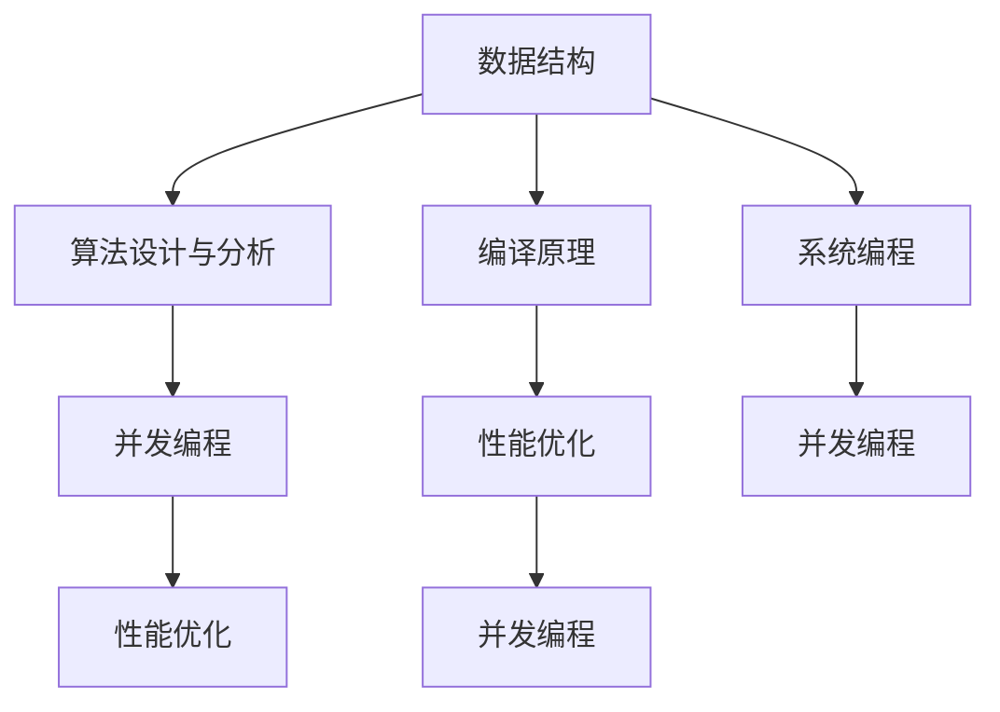

                 

# 高级编程：C 语言的力量

> 关键词：高级编程, C语言, 数据结构, 算法设计与分析, 编译原理, 系统编程, 并发编程, 性能优化

## 1. 背景介绍

编程语言是现代计算机科学的基础，对于软件开发、系统设计、算法实现等方面有着至关重要的作用。其中，C语言因其高效、通用、灵活的特性，被誉为“程序员的英语”，在计算机科学中占据着不可替代的地位。本文将深入探讨C语言的高级特性、设计理念和应用实践，帮助读者全面理解C语言的强大能力及其在软件开发中的广泛应用。

### 1.1 问题由来

随着软件规模的不断扩大和计算机性能的提升，传统的编程方式越来越难以满足复杂、高要求的系统开发需求。高级编程语言的出现，通过封装底层操作、提供抽象接口、支持并发编程、优化性能等特性，极大地提高了开发效率和系统稳定性。而C语言作为一种具有高级编程特性的系统语言，在操作系统、驱动程序、游戏引擎、嵌入式系统等关键领域中，发挥着重要作用。

### 1.2 问题核心关键点

C语言的核心特性包括：

- 系统编程能力：C语言能够直接访问硬件资源和操作系统接口，实现底层操作。
- 指针和内存管理：C语言提供了指针和手动内存管理，实现灵活的内存操作。
- 并发编程：C语言支持多线程、信号量等并发编程工具，实现高效并发。
- 性能优化：C语言提供底层控制，实现高效的算法和数据结构，优化系统性能。
- 标准库支持：C语言提供了丰富的标准库支持，方便快速开发。

本文将从核心特性入手，系统介绍C语言的高级编程概念和实践方法，揭示其在软件开发中的巨大潜力。

## 2. 核心概念与联系

### 2.1 核心概念概述

要深入理解C语言的高级特性，需要掌握以下几个核心概念：

- 数据结构：C语言提供丰富的数据结构，如数组、结构体、链表等，支持高效的数据存储和访问。
- 算法设计与分析：C语言支持高效的算法实现，能够快速处理大量数据，适用于各种算法设计和分析任务。
- 编译原理：C语言的编译器具有强大的代码优化能力，能够生成高效的机器代码。
- 系统编程：C语言支持底层操作和系统编程，能够实现高性能的系统和服务。
- 并发编程：C语言支持多线程、信号量等并发编程工具，适用于大规模并发系统开发。
- 性能优化：C语言提供底层控制，能够实现高效的算法和数据结构，优化系统性能。

### 2.2 核心概念原理和架构的 Mermaid 流程图



这个流程图展示了C语言各个核心概念之间的联系和交互。数据结构是C语言的基础，算法和编译原理进一步提升了语言的能力，系统编程和并发编程扩展了语言的应用领域，性能优化则保证了语言的实用性。

## 3. 核心算法原理 & 具体操作步骤

### 3.1 算法原理概述

C语言作为一种系统编程语言，其核心算法原理主要集中在以下几方面：

- 高效的数据结构：C语言支持高效的数组、链表、树等数据结构，支持快速的元素访问和修改。
- 优化的算法实现：C语言支持高效的排序、搜索、哈希等算法，适用于大规模数据处理。
- 底层操作和系统编程：C语言能够直接访问硬件和操作系统接口，实现高效的底层操作和系统编程。
- 并发编程支持：C语言支持多线程、信号量等并发编程工具，实现高效并发。

### 3.2 算法步骤详解

下面以实现快速排序算法为例，演示C语言中高效算法的设计和实现。

```c
#include <stdio.h>

void quick_sort(int arr[], int left, int right) {
    if (left >= right) return;
    int i = left, j = right, pivot = arr[(left + right) / 2];
    while (i <= j) {
        while (arr[i] < pivot) i++;
        while (arr[j] > pivot) j--;
        if (i <= j) {
            int temp = arr[i];
            arr[i] = arr[j];
            arr[j] = temp;
            i++;
            j--;
        }
    }
    quick_sort(arr, left, j);
    quick_sort(arr, i, right);
}

int main() {
    int arr[] = {5, 3, 8, 6, 2, 7, 1, 4};
    int n = sizeof(arr) / sizeof(arr[0]);
    quick_sort(arr, 0, n - 1);
    for (int i = 0; i < n; i++) printf("%d ", arr[i]);
    return 0;
}
```

### 3.3 算法优缺点

C语言在算法实现上具有以下优点：

- 高效性：C语言提供了底层控制，能够实现高效的算法和数据结构。
- 灵活性：C语言支持动态内存分配和指针操作，实现灵活的算法设计。
- 可移植性：C语言标准库支持跨平台开发，实现代码的广泛应用。

同时，C语言也存在一些局限：

- 低级操作：C语言提供了底层操作，但也容易引入内存泄漏、指针错误等问题。
- 安全风险：C语言缺乏语言级别的安全保障，容易出现缓冲区溢出、类型转换错误等安全问题。
- 复杂性：C语言语言特性较多，学习成本较高，容易出错。

### 3.4 算法应用领域

C语言的高级特性使其广泛应用于以下领域：

- 操作系统：C语言是操作系统开发的首选语言，支持高效的底层操作和系统编程。
- 驱动程序：C语言能够实现高效的底层控制和系统调用，适用于设备驱动程序开发。
- 游戏引擎：C语言支持高效的图形处理和底层操作，适用于游戏引擎开发。
- 嵌入式系统：C语言能够直接访问硬件资源，适用于嵌入式系统开发。
- 高性能计算：C语言支持高效的算法实现，适用于高性能计算和科学计算。

## 4. 数学模型和公式 & 详细讲解 & 举例说明

### 4.1 数学模型构建

在C语言中，数学模型的构建通常依赖于标准库和第三方库的支持。常用的数学库包括：

- stdlib.h：提供基本的数学函数，如加减乘除、取模、绝对值等。
- math.h：提供更丰富的数学函数，如三角函数、指数函数、对数函数等。
- cmath.h：提供复数运算支持，适用于复杂数计算。
- gmp.h：提供高精度计算支持，适用于大数计算。

### 4.2 公式推导过程

以计算圆的面积公式为例，其C语言实现如下：

```c
#include <stdio.h>
#include <math.h>

double pi = 3.1415926;

int main() {
    double radius, area;
    printf("Enter the radius: ");
    scanf("%lf", &radius);
    area = pi * radius * radius;
    printf("The area of the circle is %.2lf\n", area);
    return 0;
}
```

在上述代码中，使用了math.h库中的常量PI和函数pow进行计算。

### 4.3 案例分析与讲解

假设需要计算斐波那契数列的第n项，其C语言实现如下：

```c
#include <stdio.h>

int fib(int n) {
    if (n <= 1) return n;
    return fib(n - 1) + fib(n - 2);
}

int main() {
    int n, result;
    printf("Enter the number n: ");
    scanf("%d", &n);
    result = fib(n);
    printf("The nth Fibonacci number is %d\n", result);
    return 0;
}
```

在上述代码中，使用了递归算法实现斐波那契数列的计算。由于递归算法效率较低，实际开发中应考虑使用迭代算法或记忆化搜索等优化手段。

## 5. 项目实践：代码实例和详细解释说明

### 5.1 开发环境搭建

要使用C语言进行项目开发，需要搭建以下开发环境：

- GCC编译器：通常预装在大多数Linux和macOS系统中，可以通过源码安装。
- IDE：如Visual Studio Code、Eclipse等。
- Make工具：用于编译和打包源代码。
- 调试器：如GDB、LLDB等。

### 5.2 源代码详细实现

以下是一个简单的C语言项目：实现快速排序算法并应用于数组排序。

```c
#include <stdio.h>

void quick_sort(int arr[], int left, int right) {
    if (left >= right) return;
    int i = left, j = right, pivot = arr[(left + right) / 2];
    while (i <= j) {
        while (arr[i] < pivot) i++;
        while (arr[j] > pivot) j--;
        if (i <= j) {
            int temp = arr[i];
            arr[i] = arr[j];
            arr[j] = temp;
            i++;
            j--;
        }
    }
    quick_sort(arr, left, j);
    quick_sort(arr, i, right);
}

int main() {
    int arr[] = {5, 3, 8, 6, 2, 7, 1, 4};
    int n = sizeof(arr) / sizeof(arr[0]);
    quick_sort(arr, 0, n - 1);
    for (int i = 0; i < n; i++) printf("%d ", arr[i]);
    return 0;
}
```

### 5.3 代码解读与分析

- `quick_sort`函数：实现快速排序算法，通过递归和分治思想，实现高效的排序功能。
- `main`函数：输入数组，调用`quick_sort`函数进行排序，并输出排序结果。
- 输入输出：使用标准库的`scanf`和`printf`函数，实现输入输出操作。

## 6. 实际应用场景

### 6.1 操作系统

C语言在操作系统中的应用极为广泛。以Linux操作系统为例，其内核代码主要采用C语言实现，支持高效的底层操作和系统编程。通过C语言编写内核模块，可以实现动态加载、卸载和内存管理等功能。

### 6.2 驱动程序

C语言适用于设备驱动程序的开发。驱动程序需要直接访问硬件资源和操作系统接口，实现高效的底层操作。使用C语言编写驱动程序，可以灵活控制硬件资源，提高系统性能和稳定性。

### 6.3 游戏引擎

C语言适用于游戏引擎的开发。游戏引擎需要高效的图形处理和底层操作，支持大规模并发和多线程。使用C语言编写游戏引擎，可以实现高性能的图形渲染和游戏逻辑处理。

### 6.4 嵌入式系统

C语言适用于嵌入式系统的开发。嵌入式系统需要直接访问硬件资源和实时操作，支持高效的底层操作和系统编程。使用C语言编写嵌入式系统，可以实现高效的资源管理和数据处理。

## 7. 工具和资源推荐

### 7.1 学习资源推荐

要深入学习C语言，推荐以下学习资源：

- 《C Primer Plus》：由Stephen Prata所著，系统介绍了C语言的基础知识和高级特性。
- 《The C Programming Language》：由Brian W. Kernighan和Dennis M. Ritchie所著，是C语言经典的入门书籍。
- 《Effective C》：由Eric R. Raymond所著，介绍了C语言的高级编程技巧和最佳实践。
- 《UNIX Network Programming》：由W. Richard Stevens所著，介绍了C语言在网络编程中的应用。
- 《Linux Kernel Development》：由Jonathan Corbet、Alessandro Rubini和Greg Kroah-Hartman所著，介绍了C语言在Linux内核开发中的应用。

### 7.2 开发工具推荐

以下开发工具可以辅助C语言项目开发：

- Visual Studio：Microsoft开发的IDE，支持Windows平台开发。
- Eclipse：开源的IDE，支持多平台开发。
- Xcode：苹果公司开发的IDE，支持macOS和iOS平台开发。
- Clion：JetBrains开发的IDE，支持跨平台开发。
- Make：常用的编译工具，支持多文件、多目标的编译和链接。

### 7.3 相关论文推荐

C语言作为计算机科学的重要组成部分，相关的学术论文和研究报告也丰富多样。以下推荐几篇经典论文：

- “The C Programming Language” by Brian W. Kernighan and Dennis M. Ritchie
- “Design and Evolution of the C Language” by Brian W. Kernighan and Dennis M. Ritchie
- “Portable C” by Brian W. Kernighan
- “The Art of Computer Programming” by Donald E. Knuth

## 8. 总结：未来发展趋势与挑战

### 8.1 总结

本文全面介绍了C语言的高级编程特性和实践方法，揭示了其在软件开发中的广泛应用。通过学习C语言，读者可以深入理解系统编程、数据结构、算法设计与分析等核心概念，掌握高效算法和数据结构的设计与实现，提升开发效率和系统性能。

### 8.2 未来发展趋势

C语言在未来的发展趋势包括：

- 编译器优化：随着编译器技术的进步，C语言的代码优化能力将进一步提升，生成更高效的机器代码。
- 语言特性拓展：C语言将引入更多的高级特性，如模块化、泛型编程等，提升语言灵活性和可扩展性。
- 跨平台支持：C语言将进一步增强跨平台支持，实现更广泛的应用场景。
- 并发编程优化：C语言将进一步支持并发编程，实现高效的多线程和异步编程。

### 8.3 面临的挑战

C语言在未来的发展也面临着一些挑战：

- 语言学习曲线：C语言语言特性较多，学习曲线较陡峭，需要更多的学习资源和培训支持。
- 安全性问题：C语言缺乏语言级别的安全保障，容易出现内存泄漏、缓冲区溢出等问题，需要更多的工具和技巧来保证代码质量。
- 性能优化：C语言需要高效的算法和数据结构支持，但在某些复杂场景下，仍然难以避免性能瓶颈，需要更多的优化手段和研究。

### 8.4 研究展望

未来，C语言将朝着更加高效、灵活、安全的方向发展。通过编译器优化、语言特性拓展、跨平台支持和并发编程优化等手段，C语言将在软件开发中发挥更大的作用。同时，也需要更多的研究来应对其面临的挑战，提升语言质量和应用效果。

## 9. 附录：常见问题与解答

**Q1：C语言中如何使用指针？**

A: 指针是C语言中的重要特性，用于访问内存中的数据。其基本语法如下：

```c
int *p;
int x = 10;
*p = x;
```

其中，`p`是一个指向整型变量的指针，`*p`表示指针所指向的变量的值。

**Q2：C语言中如何进行内存管理？**

A: C语言提供了手动内存管理机制，即使用`malloc`和`free`函数进行内存分配和释放。基本语法如下：

```c
int *p = malloc(sizeof(int));
*p = 10;
free(p);
```

其中，`malloc`函数用于分配内存，`free`函数用于释放内存。

**Q3：C语言中如何进行并发编程？**

A: C语言支持多线程编程，使用`pthread`库实现。基本语法如下：

```c
#include <pthread.h>

void *thread_func(void *arg) {
    // 线程函数代码
    return NULL;
}

int main() {
    pthread_t thread;
    pthread_create(&thread, NULL, thread_func, NULL);
    pthread_join(thread, NULL);
    return 0;
}
```

其中，`pthread_create`函数用于创建线程，`pthread_join`函数用于等待线程结束。

**Q4：C语言中如何进行性能优化？**

A: 性能优化是C语言中重要的研究方向。常用的优化手段包括：

- 算法优化：使用高效的算法和数据结构，减少时间和空间复杂度。
- 内存优化：使用内存池、缓存等手段，减少内存分配和释放的开销。
- 并行编程：使用多线程、多进程等并发编程手段，提高程序的运行效率。

以上是C语言高级编程的全面介绍，通过学习C语言，读者可以掌握高效编程技巧，提升系统性能和开发效率，实现高性能、可扩展的软件系统。相信在未来的软件开发中，C语言将继续发挥其不可替代的作用。

---

作者：禅与计算机程序设计艺术 / Zen and the Art of Computer Programming

