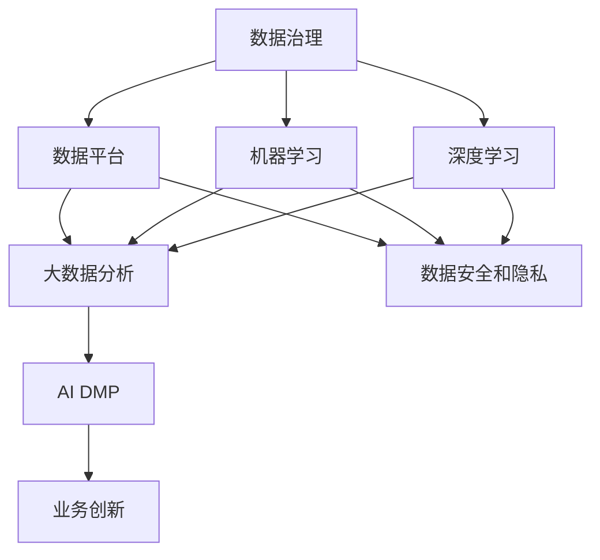

                 

# AI DMP 数据基建的未来展望

> 关键词：AI DMP, 数据治理, 数据平台, 大数据分析, 数据安全和隐私

## 1. 背景介绍

随着互联网和移动互联网的快速发展，数据已成为现代企业最重要的战略资产之一。数据的价值不仅仅在于量的积累，更在于质的挖掘和应用。在这个数据驱动的商业时代，如何高效、安全地管理和分析数据，成为各大企业关注的重点。人工智能（AI）的兴起，为数据管理和分析提供了新的思路和方法，而AI数据管理系统（DMP, Data Management Platform）正是在这样的背景下应运而生的。

### 1.1 问题由来
AI DMP 是借助人工智能技术，对数据进行自动化的管理和分析，以实现数据的高效利用和智能应用。它不仅包括数据收集、存储、处理和分析等传统数据管理功能，还具备数据识别、分类、预测、推荐等高级数据处理能力。在当今数据爆炸的背景下，AI DMP 能够帮助企业更快速地理解市场趋势，提升决策效率，实现业务创新。

### 1.2 问题核心关键点
AI DMP 的核心关键点在于：
- 数据的高效治理：通过自动化和智能化手段，实现数据的标准化、自动化，并确保数据的质量和安全。
- 数据的深度挖掘：利用机器学习、深度学习等算法，从数据中发现隐藏的规律和价值。
- 数据的智能应用：将数据转化为可执行的业务决策和推荐，驱动业务创新和发展。

### 1.3 问题研究意义
研究AI DMP 数据基建的未来展望，对于企业的数据管理战略、技术发展方向和市场竞争优势，具有重要意义：

1. 提升数据价值：通过智能化和自动化的手段，最大化数据的价值挖掘和应用，提升决策效率。
2. 降低管理成本：自动化数据管理和分析流程，减少人工干预，降低管理成本。
3. 增强安全合规：采用先进的数据安全技术，确保数据使用的合法合规。
4. 驱动业务创新：通过数据驱动的洞察，发现新的业务机会，实现业务创新。
5. 赋能行业升级：通过AI DMP 的广泛应用，推动各行业的数字化转型升级。

## 2. 核心概念与联系

### 2.1 核心概念概述

为更好地理解AI DMP 的数据治理和智能化应用，本节将介绍几个密切相关的核心概念：

- **数据治理 (Data Governance)**：通过制度化、标准化的手段，对数据进行规范管理和使用，确保数据质量和安全。
- **数据平台 (Data Platform)**：借助分布式计算和存储技术，构建统一、高效的数据管理和分析平台，支撑大规模数据处理。
- **大数据分析 (Big Data Analytics)**：利用先进的数据分析技术和算法，从海量数据中提取有价值的信息和洞见。
- **数据安全和隐私 (Data Security & Privacy)**：采用加密、访问控制等技术手段，保护数据免受未授权访问和泄露。
- **机器学习 (Machine Learning)**：通过算法训练，使机器具备学习能力，从而实现数据预测和分类。
- **深度学习 (Deep Learning)**：基于神经网络模型，对大规模数据进行深度学习，以发现更复杂的模式和关系。
- **AI DMP**：结合上述技术，通过自动化和智能化的方式，实现数据的高效治理、深度挖掘和智能应用。

这些核心概念之间的逻辑关系可以通过以下Mermaid流程图来展示：



这个流程图展示了一组概念之间的联系：

1. 数据治理通过制度化和标准化手段，为数据平台提供基础支持。
2. 数据平台提供了高效的数据存储和处理能力，为大数据分析提供了平台支持。
3. 大数据分析利用机器学习和深度学习算法，从数据中提取洞见。
4. 数据安全和隐私保护技术，为数据平台和大数据分析提供安全保障。
5. AI DMP 结合数据治理、数据平台、大数据分析和数据安全技术，实现数据的高效管理和智能应用。
6. AI DMP 通过数据洞察，驱动业务创新和升级。

## 3. 核心算法原理 & 具体操作步骤
### 3.1 算法原理概述

AI DMP 的核心算法原理是：借助机器学习和深度学习技术，对数据进行自动化的管理和分析，从而实现数据的高效治理、深度挖掘和智能应用。具体来说，AI DMP 包括数据预处理、特征工程、模型训练、模型应用等多个步骤。

### 3.2 算法步骤详解

AI DMP 的核心算法步骤包括以下几个关键环节：

**Step 1: 数据收集与预处理**
- 从各种数据源收集数据，如网站访问记录、用户行为数据、交易数据等。
- 对数据进行清洗、去重、格式化等预处理，保证数据的质量和一致性。
- 利用ETL（Extract, Transform, Load）工具，将数据加载到数据平台中。

**Step 2: 特征工程与模型训练**
- 对数据进行特征提取和工程化处理，如数据标准化、归一化、特征选择等。
- 根据具体任务需求，选择合适的算法进行模型训练，如回归、分类、聚类等。
- 利用机器学习和深度学习技术，对模型进行优化和调参，提高模型的准确性和泛化能力。

**Step 3: 模型应用与评估**
- 将训练好的模型应用到实际场景中，如用户行为预测、个性化推荐、广告投放优化等。
- 实时监控模型的表现，定期评估模型的效果，及时进行调整和优化。
- 利用A/B测试等方法，验证模型的效果和稳定性。

### 3.3 算法优缺点

AI DMP 的算法具有以下优点：
1. 高效自动：通过自动化流程，实现数据的快速处理和分析，提升效率。
2. 智能预测：利用机器学习和深度学习算法，实现数据的精准预测和分类。
3. 灵活应用：可以灵活应用到多种业务场景，如市场营销、客户服务、产品推荐等。
4. 高扩展性：通过分布式计算和大数据平台，支持大规模数据处理和分析。

同时，AI DMP 算法也存在以下局限性：
1. 数据依赖：依赖于数据的质量和完整性，数据缺失或不准确会影响模型效果。
2. 算法复杂：机器学习和深度学习算法复杂，对算法实现和调参要求较高。
3. 安全风险：数据安全和隐私保护技术需要持续关注和改进，以防止数据泄露和滥用。
4. 技术门槛：需要一定的技术和经验，对企业的技术团队提出了较高的要求。

### 3.4 算法应用领域

AI DMP 的算法已经广泛应用于各个行业，如电子商务、金融、广告、医疗等，具体应用场景包括：

- **电子商务**：用户行为预测、个性化推荐、市场营销活动优化等。
- **金融**：风险评估、信用评分、反欺诈检测等。
- **广告**：广告投放优化、受众分析、广告效果评估等。
- **医疗**：患者诊断、治疗方案推荐、疾病预测等。
- **营销**：客户细分、营销策略优化、客户生命周期管理等。

## 4. 数学模型和公式 & 详细讲解 & 举例说明

### 4.1 数学模型构建

AI DMP 的数学模型构建通常包括以下几个环节：

1. **数据预处理**：
   - 数据清洗：去除噪声、重复和缺失数据，保证数据质量。
   - 特征选择：选择对预测任务有贡献的特征，提高模型效果。
   - 数据归一化：将数据转化为标准化的形式，便于模型处理。

2. **模型训练**：
   - 回归模型：$y = \beta_0 + \beta_1x_1 + \beta_2x_2 + ... + \beta_nx_n + \epsilon$，其中 $\epsilon$ 为误差项。
   - 分类模型：$P(y=1 | x) = \sigma(\beta_0 + \beta_1x_1 + \beta_2x_2 + ... + \beta_nx_n)$，其中 $\sigma$ 为sigmoid函数。
   - 聚类模型：$K$ 均值聚类算法：$C_k = \arg\min_{C_k} \sum_{i=1}^{n}||x_i - \mu_k||^2$，其中 $\mu_k$ 为聚类中心。

### 4.2 公式推导过程

以回归模型为例，推导其参数估计公式。

设回归模型为 $y = \beta_0 + \beta_1x_1 + \beta_2x_2 + ... + \beta_nx_n + \epsilon$，其中 $y$ 为因变量，$x_i$ 为自变量，$\epsilon$ 为误差项，$\beta_i$ 为回归系数。

根据最小二乘法，模型参数估计如下：

$$
\hat{\beta} = \arg\min_{\beta} \sum_{i=1}^{n}(y_i - (\beta_0 + \beta_1x_{i1} + \beta_2x_{i2} + ... + \beta_nx_{in}))^2
$$

对方程求导，得：

$$
\frac{\partial}{\partial \beta_k} \sum_{i=1}^{n}(y_i - (\beta_0 + \beta_1x_{i1} + \beta_2x_{i2} + ... + \beta_nx_{in}))^2 = 0
$$

求解上述方程组，得到回归系数 $\hat{\beta} = (X^TX)^{-1}X^Ty$，其中 $X = [x_{i1}, x_{i2}, ..., x_{in}]$，$y = [y_1, y_2, ..., y_n]$。

### 4.3 案例分析与讲解

以用户行为预测为例，展示如何应用AI DMP 进行数据分析和预测。

**背景**：某电商平台收集了大量用户的历史行为数据，包括浏览记录、购买记录、评分等。目标是预测用户下一次购买的可能性。

**步骤**：
1. **数据收集与预处理**：从用户行为数据中提取有用的特征，如浏览时间、点击率、购买频率等。进行数据清洗和归一化处理。
2. **特征工程**：选择与用户购买行为相关的特征，进行特征组合和工程化处理。
3. **模型训练**：选择适合的回归模型，如线性回归或逻辑回归，进行模型训练和调参。
4. **模型应用与评估**：将训练好的模型应用到新数据中，实时预测用户购买行为，并通过A/B测试验证模型效果。

## 5. 项目实践：代码实例和详细解释说明
### 5.1 开发环境搭建

在进行AI DMP 的开发实践前，需要准备好开发环境。以下是使用Python进行PyTorch开发的环境配置流程：

1. 安装Anaconda：从官网下载并安装Anaconda，用于创建独立的Python环境。

2. 创建并激活虚拟环境：
```bash
conda create -n ai-dmp-env python=3.8 
conda activate ai-dmp-env
```

3. 安装PyTorch：根据CUDA版本，从官网获取对应的安装命令。例如：
```bash
conda install pytorch torchvision torchaudio cudatoolkit=11.1 -c pytorch -c conda-forge
```

4. 安装TensorBoard：
```bash
pip install tensorboard
```

5. 安装各类工具包：
```bash
pip install numpy pandas scikit-learn matplotlib tqdm jupyter notebook ipython
```

完成上述步骤后，即可在`ai-dmp-env`环境中开始开发实践。

### 5.2 源代码详细实现

下面以用户行为预测为例，给出使用PyTorch进行AI DMP 开发的PyTorch代码实现。

首先，定义用户行为预测任务的训练集和测试集：

```python
import pandas as pd
from sklearn.model_selection import train_test_split
from torch.utils.data import Dataset

class UserBehaviorDataset(Dataset):
    def __init__(self, data, label):
        self.data = data
        self.label = label
        
    def __len__(self):
        return len(self.data)
    
    def __getitem__(self, idx):
        return self.data.iloc[idx], self.label.iloc[idx]

# 准备数据集
data = pd.read_csv('user_behavior_data.csv')
label = pd.read_csv('user_purchase_labels.csv')
train_data, test_data, train_label, test_label = train_test_split(data, label, test_size=0.2, random_state=42)

# 转换为Tensor形式
train_dataset = UserBehaviorDataset(train_data, train_label)
test_dataset = UserBehaviorDataset(test_data, test_label)

# 设置超参数
batch_size = 32
num_epochs = 10
learning_rate = 0.001
```

然后，定义模型和优化器：

```python
from torch import nn
from torch.nn import Linear, ReLU, Softmax
from torch.optim import Adam

class UserBehaviorModel(nn.Module):
    def __init__(self, input_dim, output_dim):
        super(UserBehaviorModel, self).__init__()
        self.fc1 = nn.Linear(input_dim, 64)
        self.fc2 = nn.Linear(64, output_dim)
        self.relu = nn.ReLU()
    
    def forward(self, x):
        x = self.fc1(x)
        x = self.relu(x)
        x = self.fc2(x)
        x = softmax(x)
        return x

# 初始化模型
model = UserBehaviorModel(input_dim=10, output_dim=1)
optimizer = Adam(model.parameters(), lr=learning_rate)
```

接着，定义训练和评估函数：

```python
from tqdm import tqdm

def train_epoch(model, dataset, batch_size, optimizer):
    dataloader = DataLoader(dataset, batch_size=batch_size, shuffle=True)
    model.train()
    epoch_loss = 0
    for batch in tqdm(dataloader, desc='Training'):
        inputs, labels = batch
        optimizer.zero_grad()
        outputs = model(inputs)
        loss = nn.MSELoss()(outputs, labels)
        loss.backward()
        optimizer.step()
        epoch_loss += loss.item()
    return epoch_loss / len(dataloader)

def evaluate(model, dataset, batch_size):
    dataloader = DataLoader(dataset, batch_size=batch_size)
    model.eval()
    preds, labels = [], []
    with torch.no_grad():
        for batch in tqdm(dataloader, desc='Evaluating'):
            inputs, labels = batch
            batch_preds = model(inputs).tolist()
            batch_labels = labels.tolist()
            for pred, label in zip(batch_preds, batch_labels):
                preds.append(pred)
                labels.append(label)
                
    print('Test Loss:', mse_loss(torch.tensor(preds), torch.tensor(labels)))
```

最后，启动训练流程并在测试集上评估：

```python
for epoch in range(num_epochs):
    loss = train_epoch(model, train_dataset, batch_size, optimizer)
    print(f'Epoch {epoch+1}, train loss: {loss:.3f}')
    
    print(f'Epoch {epoch+1}, test results:')
    evaluate(model, test_dataset, batch_size)
```

以上就是使用PyTorch对用户行为预测任务进行AI DMP 开发的完整代码实现。可以看到，通过简单的代码设计，就可以实现对用户行为预测模型的训练和评估。

### 5.3 代码解读与分析

让我们再详细解读一下关键代码的实现细节：

**UserBehaviorDataset类**：
- `__init__`方法：初始化数据集。
- `__len__`方法：返回数据集的样本数量。
- `__getitem__`方法：获取单个样本。

**UserBehaviorModel类**：
- `__init__`方法：初始化模型结构。
- `forward`方法：定义模型的前向传播过程。

**train_epoch和evaluate函数**：
- `train_epoch`函数：对数据集进行迭代训练，更新模型参数。
- `evaluate`函数：对测试集进行评估，计算模型损失。

**训练流程**：
- 设置超参数，如批大小、迭代轮数、学习率等。
- 通过循环迭代，对训练集进行训练，在每个epoch后评估模型效果。
- 在测试集上评估模型性能，输出损失值。

可以看到，PyTorch配合TensorBoard使得AI DMP 的代码实现变得简洁高效。开发者可以将更多精力放在数据处理、模型改进等高层逻辑上，而不必过多关注底层的实现细节。

当然，工业级的系统实现还需考虑更多因素，如模型的保存和部署、超参数的自动搜索、更灵活的任务适配层等。但核心的AI DMP 范式基本与此类似。

## 6. 实际应用场景
### 6.1 智能推荐系统

AI DMP 在智能推荐系统中的应用非常广泛。通过AI DMP 的大数据分析和智能推荐算法，可以实时捕捉用户行为和偏好，为用户提供个性化的商品推荐，提升用户体验和购买转化率。

例如，电商平台可以收集用户浏览记录、购买记录、评分等信息，利用AI DMP 进行用户行为预测和个性化推荐。AI DMP 通过深度学习算法，对用户行为数据进行建模，预测用户下一次购买的可能性，并根据预测结果进行推荐。AI DMP 还可以实时监控推荐效果，根据用户反馈和实际点击率进行调整和优化，提升推荐精度。

### 6.2 金融风险管理

AI DMP 在金融领域也有着广泛的应用。金融机构可以利用AI DMP 进行客户信用评估、欺诈检测、风险管理等。

例如，银行可以收集客户的交易记录、信用评分、社交媒体行为等信息，利用AI DMP 进行客户风险评估。AI DMP 通过机器学习和深度学习算法，对客户数据进行分析和建模，预测客户的违约风险和欺诈行为，并根据风险评估结果进行信贷决策和风险控制。AI DMP 还可以实时监控客户行为，及时发现异常行为并采取措施，防止潜在风险的发生。

### 6.3 市场营销活动优化

AI DMP 在市场营销活动优化中的应用也很普遍。通过AI DMP 的数据分析和智能推荐算法，可以优化市场营销策略，提升广告投放效果和客户转化率。

例如，广告主可以收集用户的历史行为数据、兴趣爱好、地理位置等信息，利用AI DMP 进行广告定向和投放优化。AI DMP 通过深度学习算法，对用户数据进行建模和分析，预测用户的兴趣爱好和行为偏好，并根据预测结果进行广告定向和投放。AI DMP 还可以实时监控广告效果，根据用户反馈和点击率进行调整和优化，提升广告投放效果。

### 6.4 未来应用展望

随着AI DMP 技术的不断进步，其在更多领域的应用前景也将更加广阔。

在智慧医疗领域，AI DMP 可以通过数据分析和智能推荐，为医生提供患者病历、诊断建议和治疗方法，提升医疗服务质量。AI DMP 还可以实时监控患者健康数据，及时发现异常并预警，提升患者治疗效果。

在智能交通领域，AI DMP 可以通过数据分析和智能推荐，为城市管理者提供交通流量、道路拥堵等数据，优化交通管理策略。AI DMP 还可以实时监控交通数据，及时发现异常并预警，提升交通管理效果。

在智慧能源领域，AI DMP 可以通过数据分析和智能推荐，为能源公司提供用户用电行为、设备状态等信息，优化能源管理策略。AI DMP 还可以实时监控能源数据，及时发现异常并预警，提升能源管理效果。

## 7. 工具和资源推荐
### 7.1 学习资源推荐

为了帮助开发者系统掌握AI DMP 的理论基础和实践技巧，这里推荐一些优质的学习资源：

1. 《机器学习实战》书籍：介绍机器学习算法的实现和应用，适合初学者入门。
2. 《深度学习入门》书籍：深入浅出地介绍深度学习算法的原理和应用。
3. 《Python数据科学手册》书籍：详细介绍Python在数据科学中的应用，适合进阶学习。
4. Coursera上的《机器学习》课程：由斯坦福大学开设，涵盖机器学习的基础理论和实践技能。
5. Udacity上的《深度学习专业纳米学位》课程：深入学习深度学习算法的原理和应用，适合进阶学习。

通过对这些资源的学习实践，相信你一定能够快速掌握AI DMP 的理论基础和实践技巧，并用于解决实际的业务问题。

### 7.2 开发工具推荐

高效的开发离不开优秀的工具支持。以下是几款用于AI DMP 开发的常用工具：

1. PyTorch：基于Python的开源深度学习框架，灵活高效的计算图，适合快速迭代研究。
2. TensorFlow：由Google主导开发的开源深度学习框架，生产部署方便，适合大规模工程应用。
3. TensorBoard：TensorFlow配套的可视化工具，实时监测模型训练状态，并提供丰富的图表呈现方式。
4. Jupyter Notebook：交互式编程环境，方便进行代码调试和模型验证。
5. Scikit-Learn：Python机器学习库，提供了多种经典机器学习算法和工具。

合理利用这些工具，可以显著提升AI DMP 的开发效率，加快创新迭代的步伐。

### 7.3 相关论文推荐

AI DMP 的研究始于20世纪80年代的数据仓库和商业智能系统，但近年来随着深度学习和大数据技术的发展，AI DMP 得到了更广泛的研究和应用。以下是几篇奠基性的相关论文，推荐阅读：

1. 《Data Mining: Concepts and Techniques》书籍：详细介绍数据挖掘和数据治理的原理和应用。
2. 《AI DMP: Data Management Platform for Big Data Analytics》论文：提出AI DMP 的概念和架构，探讨其在大数据分析中的应用。
3. 《A Survey on Data Mining and Statistical Learning with Big Data》论文：综述大数据分析的最新进展和技术应用。
4. 《Data Management in Big Data: Challenges, Techniques, and Research Directions》论文：探讨大数据管理的技术挑战和研究方向。

这些论文代表了大数据管理和分析的研究脉络。通过学习这些前沿成果，可以帮助研究者把握学科前进方向，激发更多的创新灵感。

## 8. 总结：未来发展趋势与挑战
### 8.1 研究成果总结

本文对AI DMP 数据基建的未来展望进行了全面系统的介绍。首先阐述了AI DMP 数据基建的引入背景和研究意义，明确了数据治理、数据平台、大数据分析、数据安全和隐私等核心概念及其之间的联系。其次，从原理到实践，详细讲解了AI DMP 的算法原理和具体操作步骤，给出了AI DMP 开发和应用的完整代码实例。同时，本文还广泛探讨了AI DMP 在多个行业领域的应用前景，展示了其广阔的发展潜力。

通过本文的系统梳理，可以看到，AI DMP 数据基建的崛起，正为数据管理和分析提供了新的思路和方法，大大提升了数据的价值挖掘和应用效率。未来，伴随数据管理和分析技术的不断进步，AI DMP 必将在更多领域得到广泛应用，成为推动各行各业数字化转型升级的重要引擎。

### 8.2 未来发展趋势

展望未来，AI DMP 数据基建的趋势主要包括以下几个方面：

1. 数据治理的智能化：通过AI技术，实现数据治理的自动化和智能化，提升数据治理的效率和质量。
2. 数据平台的分布式化：借助分布式计算和大数据平台，实现数据的高效存储和处理。
3. 大数据分析的深度化：利用深度学习和机器学习算法，从数据中挖掘更深层次的洞见。
4. 数据安全和隐私的保护：采用先进的加密和访问控制技术，保护数据免受未授权访问和泄露。
5. AI DMP 的行业应用广泛化：AI DMP 将逐步应用到更多行业，如智慧医疗、智能交通、智慧能源等。

这些趋势将进一步推动AI DMP 的发展，使其成为企业数据管理和分析的核心工具，驱动各行各业的数字化转型升级。

### 8.3 面临的挑战

尽管AI DMP 数据基建已经取得了一定的进展，但在迈向更加智能化、普适化应用的过程中，仍面临诸多挑战：

1. 数据质量依赖：AI DMP 的效果很大程度上依赖于数据的质量和完整性，数据缺失或不准确会影响模型效果。
2. 算法复杂度：机器学习和深度学习算法复杂，对算法实现和调参要求较高。
3. 技术门槛：需要一定的技术和经验，对企业的技术团队提出了较高的要求。
4. 数据安全风险：数据安全和隐私保护技术需要持续关注和改进，以防止数据泄露和滥用。
5. 业务融合难度：AI DMP 需要与各业务系统进行深度集成，存在一定的技术难度和业务壁垒。

这些挑战需要企业和研究者共同努力，通过不断优化算法和技术，提高数据治理和分析能力，推动AI DMP 的广泛应用。

### 8.4 研究展望

面对AI DMP 数据基建所面临的挑战，未来的研究需要在以下几个方面寻求新的突破：

1. 探索更加高效的数据治理方法：开发更加智能化和自动化的大数据治理工具，提升数据质量和处理效率。
2. 研究更加高效的算法和模型：开发更加高效和可解释的深度学习模型，提高算法的效率和鲁棒性。
3. 引入更多先验知识：将符号化的先验知识，如知识图谱、逻辑规则等，与神经网络模型进行融合，提升模型的智能水平。
4. 优化数据平台和基础设施：开发更加灵活和高效的大数据平台，支持分布式计算和大规模数据处理。
5. 加强数据安全和隐私保护：开发更加安全和可靠的数据保护技术，确保数据使用的合法合规。

这些研究方向的探索，必将引领AI DMP 数据基建技术迈向更高的台阶，为各行业的数字化转型升级提供强大的数据支持。面向未来，AI DMP 数据基建技术还需要与其他人工智能技术进行更深入的融合，如知识表示、因果推理、强化学习等，协同发力，共同推动各行各业的数字化转型升级。

## 9. 附录：常见问题与解答

**Q1：AI DMP 的核心优势是什么？**

A: AI DMP 的核心优势在于其数据治理和智能应用能力，具体包括：
1. 高效自动化：通过自动化流程，实现数据的快速处理和分析，提升效率。
2. 智能预测：利用机器学习和深度学习算法，实现数据的精准预测和分类。
3. 灵活应用：可以灵活应用到多种业务场景，如市场营销、客户服务、产品推荐等。
4. 高扩展性：通过分布式计算和大数据平台，支持大规模数据处理和分析。

**Q2：AI DMP 的数据治理和智能应用过程需要哪些关键步骤？**

A: AI DMP 的数据治理和智能应用过程包括以下几个关键步骤：
1. 数据收集与预处理：从各种数据源收集数据，进行清洗、去重、格式化等预处理。
2. 特征工程与模型训练：对数据进行特征提取和工程化处理，选择合适的算法进行模型训练。
3. 模型应用与评估：将训练好的模型应用到实际场景中，实时监控模型的表现，定期评估模型的效果。

**Q3：AI DMP 的应用场景有哪些？**

A: AI DMP 的应用场景非常广泛，包括：
1. 智能推荐系统：提升用户体验和购买转化率。
2. 金融风险管理：客户信用评估、欺诈检测、风险管理等。
3. 市场营销活动优化：广告定向和投放优化。
4. 智慧医疗：提升医疗服务质量和患者治疗效果。
5. 智能交通：优化交通管理策略，提升交通管理效果。
6. 智慧能源：优化能源管理策略，提升能源管理效果。

**Q4：AI DMP 的实现难点有哪些？**

A: AI DMP 的实现难点主要包括：
1. 数据质量依赖：依赖于数据的质量和完整性，数据缺失或不准确会影响模型效果。
2. 算法复杂度：机器学习和深度学习算法复杂，对算法实现和调参要求较高。
3. 技术门槛：需要一定的技术和经验，对企业的技术团队提出了较高的要求。
4. 数据安全风险：数据安全和隐私保护技术需要持续关注和改进。
5. 业务融合难度：AI DMP 需要与各业务系统进行深度集成，存在一定的技术难度和业务壁垒。

**Q5：AI DMP 的未来发展方向是什么？**

A: AI DMP 的未来发展方向主要包括：
1. 数据治理的智能化：实现数据治理的自动化和智能化。
2. 数据平台的分布式化：借助分布式计算和大数据平台，实现数据的高效存储和处理。
3. 大数据分析的深度化：利用深度学习和机器学习算法，从数据中挖掘更深层次的洞见。
4. 数据安全和隐私的保护：采用先进的加密和访问控制技术，保护数据免受未授权访问和泄露。
5. AI DMP 的行业应用广泛化：逐步应用到更多行业，如智慧医疗、智能交通、智慧能源等。

---

作者：禅与计算机程序设计艺术 / Zen and the Art of Computer Programming

