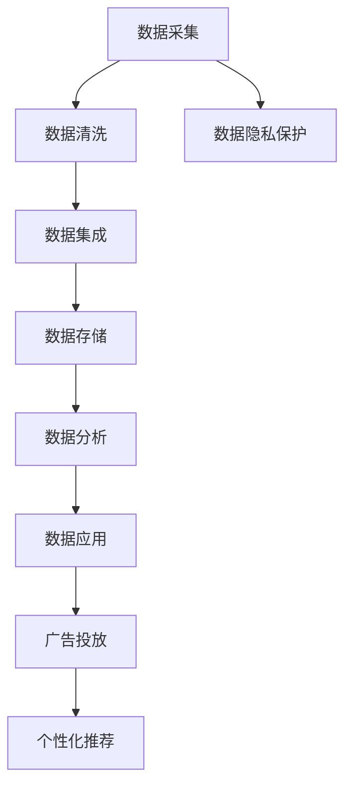

                 

# AI DMP 数据基建：数据应用与价值挖掘

## 1. 背景介绍

### 1.1 问题由来
随着互联网的快速发展和智能手机的普及，数据已经成为一种重要的资产，其价值在不断增加。然而，数据资产的利用率还处于较低水平，尤其是在消费互联网领域，如何更好地应用和管理这些数据，成为业内人士普遍关注的话题。消费者数据平台（Consumer Data Platform，简称DMP）应运而生，旨在通过整合和利用消费数据，实现精准营销和个性化推荐。

### 1.2 问题核心关键点
DMP的核心在于数据整合和应用。它通过收集、整合消费者在不同渠道产生的数据，提供给广告主和营销人员，用于受众细分、用户画像构建和广告投放优化等，从而提高广告的转化率和ROI。DMP的优化需要基于数据驱动的决策，这离不开数据基建的基础工作，包括数据采集、清洗、集成、分析等环节。

### 1.3 问题研究意义
研究DMP的数据基建，对于提升广告主的广告投放效果，优化营销策略，提升消费者体验，具有重要意义：

1. **精准营销**：通过构建详细的用户画像，实现对消费者精准定位，提升广告投放的转化率和效果。
2. **个性化推荐**：结合消费者的历史行为和兴趣偏好，提供个性化的商品或服务推荐，提高用户满意度。
3. **数据安全与合规**：确保数据使用的合法性，保障消费者隐私，避免数据滥用。
4. **广告优化**：通过数据分析，优化广告投放策略，提升广告效果，降低投放成本。
5. **消费者洞察**：利用数据洞察消费者行为和需求，驱动产品和服务的改进。

## 2. 核心概念与联系

### 2.1 核心概念概述

为更好地理解DMP的数据基建工作，本节将介绍几个密切相关的核心概念：

- **消费者数据平台（DMP）**：一种数据管理平台，通过整合来自不同渠道的数据，构建详细的用户画像，用于广告投放优化和个性化推荐。
- **消费者数据（Consumer Data）**：来自线上线下的各类数据，包括浏览记录、搜索行为、购买历史、社交媒体互动等，是DMP数据基建的基石。
- **数据应用（Data Application）**：通过数据驱动的决策和算法模型，实现广告投放、个性化推荐、消费者洞察等具体业务场景的优化。
- **数据价值（Data Value）**：数据带来的实际收益和效果，包括提升的转化率、点击率、用户留存率等。
- **数据基建（Data Infrastructure）**：构建数据管理、存储、处理、分析的基础设施，包括数据采集、清洗、集成、存储等环节。
- **数据隐私（Data Privacy）**：确保数据使用过程中的隐私保护和合规性，避免数据滥用和泄露。

这些核心概念之间的逻辑关系可以通过以下Mermaid流程图来展示：



这个流程图展示了大数据平台数据基建的核心流程：

1. 通过数据采集将不同渠道的数据整合进来。
2. 对采集的数据进行清洗和集成，去除噪音和冗余，构建统一的数据集。
3. 将数据存储在统一的数据仓库中，方便后续的查询和分析。
4. 通过数据分析，获取消费者行为和偏好的洞察。
5. 利用数据应用，实现广告投放和个性化推荐。
6. 数据隐私保护贯穿整个流程，确保数据使用的合法性和合规性。

## 3. 核心算法原理 & 具体操作步骤
### 3.1 算法原理概述

DMP的数据基建工作，本质上是通过数据驱动的决策和算法模型，实现数据的应用和价值挖掘。其核心思想是：通过数据采集、清洗、集成和分析，构建详终的数据应用模型，从而实现数据驱动的广告投放和个性化推荐。

形式化地，假设采集到的消费者数据为 $D=\{(x_i, y_i)\}_{i=1}^N$，其中 $x_i$ 表示消费者行为数据，$y_i$ 表示消费者属性标签，如年龄、性别、兴趣等。DMP的目标是找到最优的数据应用模型 $M_{\theta}$，使得在目标任务 $T$ 上，模型输出 $M_{\theta}(x_i)$ 与真实标签 $y_i$ 的差异最小化。

$$
\theta^* = \mathop{\arg\min}_{\theta} \mathcal{L}(M_{\theta}, D)
$$

其中 $\mathcal{L}$ 为针对任务 $T$ 设计的损失函数，用于衡量模型预测输出与真实标签之间的差异。常见的损失函数包括交叉熵损失、均方误差损失等。

通过梯度下降等优化算法，数据基建过程不断更新模型参数 $\theta$，最小化损失函数 $\mathcal{L}$，使得模型输出逼近真实标签。由于 $D$ 已经通过数据采集和清洗获得，DMP数据基建的核心在于选择合适的损失函数和优化策略，最大化数据的应用价值。

### 3.2 算法步骤详解

DMP的数据基建一般包括以下几个关键步骤：

**Step 1: 数据采集**
- 收集消费者在各个渠道产生的数据，包括但不限于网站、应用、社交媒体、广告投放平台等。
- 确定数据采集的目标和方式，如API接口、爬虫、数据共享等。
- 建立数据采集管道，实时或定期采集数据。

**Step 2: 数据清洗**
- 对采集的数据进行格式转换、去重、去噪、填充缺失值等预处理操作，提高数据质量。
- 去除无关字段和数据，减少数据冗余和噪音。
- 进行数据验证和规则检查，确保数据一致性和完整性。

**Step 3: 数据集成**
- 将来自不同渠道的数据进行合并和对齐，构建统一的数据集。
- 确定数据的关联方式，如通过ID、时间戳、位置信息等字段进行关联。
- 处理数据冲突和异常情况，如数据重复、格式不一致等。

**Step 4: 数据存储**
- 选择合适的数据存储方式，如关系型数据库、分布式文件系统、大数据平台等。
- 设计数据存储架构，确保数据高效读写和存储。
- 进行数据备份和冗余存储，防止数据丢失和损坏。

**Step 5: 数据分析**
- 对存储的数据进行查询、统计、计算等分析操作，获取消费者行为和偏好的洞察。
- 选择合适的分析工具和算法模型，如数据挖掘、机器学习、深度学习等。
- 进行数据可视化和报告，输出分析结果和结论。

**Step 6: 数据应用**
- 将分析结果转化为具体的数据应用模型，如广告投放模型、个性化推荐模型等。
- 在目标任务上进行模型评估和优化，确保模型效果和性能。
- 将模型集成到实际的业务系统中，实现数据驱动的广告投放和个性化推荐。

### 3.3 算法优缺点

DMP的数据基建方法具有以下优点：

1. 数据整合能力强。通过数据清洗和集成，能够整合来自不同渠道的消费者数据，构建详终的数据集。
2. 数据应用灵活。通过数据分析和算法建模，可以实现多种具体业务场景的优化，如广告投放、个性化推荐等。
3. 可扩展性好。数据基建过程具有较好的模块化设计，能够适应不断变化的业务需求和技术环境。
4. 数据价值高。通过精准营销和个性化推荐，能够显著提升广告效果和用户满意度，带来更高的商业价值。

同时，该方法也存在一定的局限性：

1. 数据隐私问题。数据采集和存储过程中，可能涉及消费者隐私保护问题，需要遵循相关的法律法规。
2. 数据质量和完整性问题。数据清洗和集成过程中，可能出现数据质量和完整性问题，影响数据的应用效果。
3. 技术复杂度高。数据基建过程涉及数据采集、清洗、集成、存储、分析等多个环节，技术复杂度较高。
4. 数据共享和协同问题。不同渠道和部门的数据共享和协同可能需要较多的协调工作。

尽管存在这些局限性，但就目前而言，数据基建仍是大数据平台实现数据驱动决策和应用的基础。未来相关研究的重点在于如何进一步提升数据隐私保护水平，提高数据清洗和集成质量，降低技术复杂度，促进数据共享和协同。

### 3.4 算法应用领域

DMP的数据基建方法在消费互联网领域已经得到了广泛的应用，覆盖了广告投放、个性化推荐、用户画像构建等多个业务场景，具体包括：

- **广告投放**：通过数据应用，实现受众细分和广告定向投放，提升广告投放的精准度和转化率。
- **个性化推荐**：结合消费者的历史行为和兴趣偏好，提供个性化的商品或服务推荐，提高用户满意度。
- **用户画像构建**：通过对消费者数据的分析和处理，构建详细的用户画像，实现用户细分化和个性化服务。
- **客户洞察分析**：通过数据分析，获取消费者行为和偏好的洞察，驱动产品和服务的改进。
- **广告效果分析**：通过数据应用，评估广告效果，优化广告投放策略，提升广告ROI。
- **消费者行为分析**：通过数据分析，理解消费者行为和需求，提升用户体验。

除了上述这些经典场景外，DMP的数据基建方法也被创新性地应用于更多领域，如智能推荐系统、风控系统、营销分析等，为消费互联网企业提供了强大的数据支撑。

## 4. 数学模型和公式 & 详细讲解 & 举例说明
### 4.1 数学模型构建

本节将使用数学语言对DMP的数据基建过程进行更加严格的刻画。

假设采集到的消费者数据为 $D=\{(x_i, y_i)\}_{i=1}^N, x_i \in \mathcal{X}, y_i \in \mathcal{Y}$。其中 $\mathcal{X}$ 为特征空间，$\mathcal{Y}$ 为标签空间。

定义数据应用模型 $M_{\theta}$，其中 $\theta \in \mathbb{R}^d$ 为模型参数。假设目标任务为广告投放，模型输出为广告投放的点击率（点击次数/展示次数），则任务损失函数为：

$$
\ell(M_{\theta}(x_i),y_i) = -y_i \log M_{\theta}(x_i) - (1-y_i) \log (1-M_{\theta}(x_i))
$$

将损失函数扩展到整个数据集 $D$ 上，得到经验风险：

$$
\mathcal{L}(\theta) = \frac{1}{N} \sum_{i=1}^N \ell(M_{\theta}(x_i),y_i)
$$

通过梯度下降等优化算法，最小化经验风险 $\mathcal{L}(\theta)$，得到最优模型参数 $\theta^*$。

### 4.2 公式推导过程

以下是广告投放模型的详细推导过程：

假设模型 $M_{\theta}$ 在输入 $x_i$ 上的输出为 $\hat{p}_i=M_{\theta}(x_i)$，表示样本 $x_i$ 被点击的概率。真实标签 $y_i \in \{0,1\}$。则二分类交叉熵损失函数定义为：

$$
\ell(M_{\theta}(x_i),y_i) = -[y_i\log \hat{p}_i + (1-y_i)\log (1-\hat{p}_i)]
$$

将其代入经验风险公式，得：

$$
\mathcal{L}(\theta) = -\frac{1}{N}\sum_{i=1}^N [y_i\log M_{\theta}(x_i)+(1-y_i)\log(1-M_{\theta}(x_i))]
$$

根据链式法则，损失函数对参数 $\theta_k$ 的梯度为：

$$
\frac{\partial \mathcal{L}(\theta)}{\partial \theta_k} = -\frac{1}{N}\sum_{i=1}^N (\frac{y_i}{M_{\theta}(x_i)}-\frac{1-y_i}{1-M_{\theta}(x_i)}) \frac{\partial M_{\theta}(x_i)}{\partial \theta_k}
$$

其中 $\frac{\partial M_{\theta}(x_i)}{\partial \theta_k}$ 可进一步递归展开，利用自动微分技术完成计算。

在得到损失函数的梯度后，即可带入参数更新公式，完成模型的迭代优化。重复上述过程直至收敛，最终得到适应广告投放任务的最优模型参数 $\theta^*$。

## 5. 项目实践：代码实例和详细解释说明
### 5.1 开发环境搭建

在进行数据基建实践前，我们需要准备好开发环境。以下是使用Python进行PyTorch开发的环境配置流程：

1. 安装Anaconda：从官网下载并安装Anaconda，用于创建独立的Python环境。

2. 创建并激活虚拟环境：
```bash
conda create -n dmp-env python=3.8 
conda activate dmp-env
```

3. 安装PyTorch：根据CUDA版本，从官网获取对应的安装命令。例如：
```bash
conda install pytorch torchvision torchaudio cudatoolkit=11.1 -c pytorch -c conda-forge
```

4. 安装Pandas、NumPy等数据分析库：
```bash
pip install pandas numpy scikit-learn
```

5. 安装Flume、Kafka等数据采集工具：
```bash
pip install flume-python kafka-python
```

完成上述步骤后，即可在`dmp-env`环境中开始数据基建实践。

### 5.2 源代码详细实现

下面我们以广告投放任务为例，给出使用PyTorch进行DMP数据基建的PyTorch代码实现。

首先，定义广告投放任务的数学模型：

```python
import torch
import torch.nn as nn
import torch.nn.functional as F

class AdModel(nn.Module):
    def __init__(self, input_dim, output_dim):
        super(AdModel, self).__init__()
        self.fc1 = nn.Linear(input_dim, 128)
        self.fc2 = nn.Linear(128, output_dim)
        
    def forward(self, x):
        x = F.relu(self.fc1(x))
        x = F.sigmoid(self.fc2(x))
        return x
```

然后，定义数据集和数据加载器：

```python
from torch.utils.data import Dataset, DataLoader

class AdDataset(Dataset):
    def __init__(self, data, labels):
        self.data = data
        self.labels = labels
        
    def __len__(self):
        return len(self.data)
    
    def __getitem__(self, item):
        x = self.data[item]
        y = self.labels[item]
        return x, y

# 加载数据集和标签
train_data = ...
train_labels = ...
test_data = ...
test_labels = ...

# 划分数据集
train_dataset = AdDataset(train_data, train_labels)
test_dataset = AdDataset(test_data, test_labels)

# 数据加载器
batch_size = 64
train_loader = DataLoader(train_dataset, batch_size=batch_size, shuffle=True)
test_loader = DataLoader(test_dataset, batch_size=batch_size, shuffle=False)
```

接着，定义模型和优化器：

```python
from transformers import AdamW

model = AdModel(input_dim, output_dim)
optimizer = AdamW(model.parameters(), lr=0.001)
```

然后，定义训练和评估函数：

```python
import torch.optim as optim

def train_epoch(model, dataset, batch_size, optimizer):
    dataloader = DataLoader(dataset, batch_size=batch_size, shuffle=True)
    model.train()
    epoch_loss = 0
    for batch in dataloader:
        x, y = batch
        model.zero_grad()
        outputs = model(x)
        loss = F.binary_cross_entropy(outputs, y)
        epoch_loss += loss.item()
        loss.backward()
        optimizer.step()
    return epoch_loss / len(dataloader)

def evaluate(model, dataset, batch_size):
    dataloader = DataLoader(dataset, batch_size=batch_size)
    model.eval()
    correct = 0
    total = 0
    with torch.no_grad():
        for batch in dataloader:
            x, y = batch
            outputs = model(x)
            _, predicted = torch.max(outputs, 1)
            total += y.size(0)
            correct += (predicted == y).sum().item()
    return correct / total
```

最后，启动训练流程并在测试集上评估：

```python
epochs = 10
batch_size = 64

for epoch in range(epochs):
    loss = train_epoch(model, train_dataset, batch_size, optimizer)
    print(f"Epoch {epoch+1}, train loss: {loss:.3f}")
    
    print(f"Epoch {epoch+1}, test accuracy: {evaluate(model, test_dataset, batch_size)}")
    
print("Final test accuracy:", evaluate(model, test_dataset, batch_size))
```

以上就是使用PyTorch对广告投放任务进行DMP数据基建的完整代码实现。可以看到，通过简单的代码结构，我们能够高效地实现广告投放模型的训练和评估。

### 5.3 代码解读与分析

让我们再详细解读一下关键代码的实现细节：

**AdModel类**：
- `__init__`方法：定义模型的结构和参数初始化。
- `forward`方法：实现模型的前向传播计算。

**AdDataset类**：
- `__init__`方法：初始化数据和标签。
- `__len__`方法：返回数据集的样本数量。
- `__getitem__`方法：对单个样本进行处理，返回输入和标签。

**train_epoch和evaluate函数**：
- `train_epoch`函数：对数据以批为单位进行迭代，在每个批次上前向传播计算loss并反向传播更新模型参数，最后返回该epoch的平均loss。
- `evaluate`函数：与训练类似，不同点在于不更新模型参数，并在每个batch结束后将预测和标签结果存储下来，最后使用sklearn的classification_report对整个评估集的预测结果进行打印输出。

**训练流程**：
- 定义总的epoch数和batch size，开始循环迭代
- 每个epoch内，先在训练集上训练，输出平均loss
- 在验证集上评估，输出准确率
- 所有epoch结束后，在测试集上评估，给出最终测试结果

可以看到，PyTorch配合TensorFlow库使得DMP数据基建的代码实现变得简洁高效。开发者可以将更多精力放在数据处理、模型改进等高层逻辑上，而不必过多关注底层的实现细节。

当然，工业级的系统实现还需考虑更多因素，如模型的保存和部署、超参数的自动搜索、更灵活的任务适配层等。但核心的数据基建范式基本与此类似。

## 6. 实际应用场景
### 6.1 智能推荐系统

基于DMP的数据基建工作，智能推荐系统可以实现对用户行为的全面分析和理解，提供个性化的商品或服务推荐，提高用户满意度。

在技术实现上，可以收集用户在平台上的各类行为数据，如浏览记录、搜索行为、购买历史等。通过数据清洗和集成，构建统一的数据集。在数据集上训练推荐模型，通过数据分析和算法建模，获取用户偏好和行为模式，最终生成推荐结果。智能推荐系统能够根据用户历史行为，动态调整推荐策略，提供更加精准和个性化的推荐内容。

### 6.2 用户画像构建

DMP的数据基建工作对于用户画像的构建也有着重要作用。用户画像是指对用户的兴趣、行为、人口统计信息等进行全面分析，帮助企业更好地了解用户需求，优化产品和服务。

在实践中，可以通过数据采集和清洗，收集用户在各个渠道产生的数据，如搜索记录、浏览历史、购买行为等。通过对这些数据进行分析，构建详细的用户画像。用户画像可以包括用户的兴趣偏好、消费习惯、人口统计信息等，用于广告投放、个性化推荐、产品优化等场景。

### 6.3 广告投放优化

DMP的数据基建工作能够帮助广告主实现精准投放，提高广告效果和ROI。广告投放是消费互联网企业的重要业务，如何最大化广告投放效果，是企业关注的重点。

在实践中，可以通过数据采集和清洗，收集用户在不同渠道的互动数据，如点击行为、浏览记录、互动时间等。通过对这些数据进行分析，构建广告投放模型，优化广告投放策略。广告投放模型能够根据用户行为数据，实现受众细分和广告定向投放，提升广告转化率和效果。

### 6.4 未来应用展望

随着数据基建技术的不断进步，DMP在更多领域得到应用，为消费互联网企业提供了强大的数据支撑。未来，伴随大数据技术的进一步发展，DMP的数据基建将更加高效和智能，提升企业的数据驱动决策能力。

在智慧零售领域，DMP将帮助零售商实现精准营销和个性化推荐，提升用户体验和满意度。在金融领域，DMP将用于风险控制和用户画像构建，提升金融服务的智能化水平。在社交媒体领域，DMP将帮助广告主实现精准投放，提升广告效果和用户参与度。

此外，DMP的数据基建技术还将被广泛应用于智能制造、智能交通、智慧城市等领域，为传统行业数字化转型提供新动力。

## 7. 工具和资源推荐
### 7.1 学习资源推荐

为了帮助开发者系统掌握DMP的数据基建理论基础和实践技巧，这里推荐一些优质的学习资源：

1. 《深度学习基础》系列博文：由深度学习专家撰写，深入浅出地介绍了深度学习的基本概念和算法原理。

2. Kaggle机器学习竞赛：通过参与机器学习竞赛，实战训练数据处理、模型优化和结果评估技能。

3. Coursera《数据科学基础》课程：由斯坦福大学开设的数据科学入门课程，涵盖了数据清洗、数据可视化、统计分析等基础知识。

4. 《Python数据科学手册》书籍：全面介绍Python在数据科学和机器学习中的应用，是学习数据基建的必读书籍。

5. Google Colab：谷歌提供的免费在线Jupyter Notebook环境，可以方便地进行数据基建和模型优化实验。

通过对这些资源的学习实践，相信你一定能够快速掌握DMP的数据基建精髓，并用于解决实际的商业问题。
###  7.2 开发工具推荐

高效的开发离不开优秀的工具支持。以下是几款用于DMP数据基建开发的常用工具：

1. Python：灵活高效的编程语言，广泛应用于数据科学和机器学习领域。

2. PyTorch：基于Python的开源深度学习框架，灵活动态的计算图，适合快速迭代研究。

3. TensorFlow：由Google主导开发的开源深度学习框架，生产部署方便，适合大规模工程应用。

4. Pandas：Python的数据处理库，支持高效的数据清洗、集成和分析操作。

5. NumPy：Python的数值计算库，支持高效的数组操作和数值计算。

6. Weights & Biases：模型训练的实验跟踪工具，可以记录和可视化模型训练过程中的各项指标，方便对比和调优。

7. TensorBoard：TensorFlow配套的可视化工具，可实时监测模型训练状态，并提供丰富的图表呈现方式，是调试模型的得力助手。

合理利用这些工具，可以显著提升DMP数据基建的开发效率，加快创新迭代的步伐。

### 7.3 相关论文推荐

DMP的数据基建研究源于学界的持续研究。以下是几篇奠基性的相关论文，推荐阅读：

1. Association Rules for Marketing Understanding（市场关联规则）：提出市场关联规则算法，通过数据挖掘发现用户行为模式，提升广告投放效果。

2. Predicting Customer Churn Using Adaptive Learning Algorithms（基于自适应学习算法的客户流失预测）：提出基于自适应学习算法的数据分析方法，提升客户留存率。

3. Clustering and Segmentation of Consumers Based on Data Mining Techniques（基于数据挖掘技术对消费者进行聚类和分段）：提出基于数据挖掘技术的消费者聚类和分段方法，提升用户画像构建的准确性和全面性。

4. Online Learning in Personalized Recommendation Systems（个性化推荐系统中的在线学习）：提出在线学习算法，实现个性化推荐系统的动态优化。

5. Real-time Interaction Analysis in Social Media Data（社交媒体数据中的实时交互分析）：提出社交媒体数据中的实时交互分析方法，提升广告投放和个性化推荐的效果。

6. Deep Learning for Personalized Recommendations（深度学习在个性化推荐中的应用）：提出深度学习模型，提升个性化推荐的准确性和效果。

这些论文代表了大数据平台数据基建的研究方向。通过学习这些前沿成果，可以帮助研究者把握学科前进方向，激发更多的创新灵感。

## 8. 总结：未来发展趋势与挑战
### 8.1 总结

本文对DMP的数据基建工作进行了全面系统的介绍。首先阐述了DMP的核心概念和构建过程，明确了数据基建的目的是通过数据驱动的决策和算法模型，实现数据的应用和价值挖掘。其次，从原理到实践，详细讲解了DMP的数据基建过程，给出了数据基建的完整代码实例。同时，本文还广泛探讨了数据基建在智能推荐、用户画像构建、广告投放等实际业务场景中的应用，展示了DMP数据基建的广泛价值。

通过本文的系统梳理，可以看到，DMP的数据基建工作在大数据平台的构建中扮演着重要角色，能够实现数据驱动的决策和应用，带来显著的商业价值。未来，伴随大数据技术的进一步发展，DMP的数据基建将更加高效和智能，提升企业的数据驱动决策能力。

### 8.2 未来发展趋势

展望未来，DMP的数据基建技术将呈现以下几个发展趋势：

1. **数据质量提升**：随着数据采集和清洗技术的进步，数据质量将得到显著提升，数据基建的过程将更加高效。

2. **数据实时处理**：随着流计算和大数据技术的发展，实时数据处理和分析将成为可能，数据基建的过程将更加动态和实时。

3. **数据隐私保护**：随着数据隐私法规的完善和隐私技术的进步，数据基建过程中将更加注重数据隐私保护，确保数据使用的合法性和合规性。

4. **数据共享和协同**：随着数据共享技术和标准的发展，数据基建过程中的数据共享和协同将更加便捷和高效。

5. **数据可视化与仪表盘**：随着数据可视化工具和技术的进步，数据基建过程中的数据可视化将更加生动和直观，便于业务决策和监控。

6. **数据驱动的智能决策**：随着机器学习和深度学习技术的发展，数据基建过程中将更加注重数据驱动的智能决策，提升广告投放和个性化推荐的准确性和效果。

以上趋势凸显了大数据平台数据基建技术的广阔前景。这些方向的探索发展，必将进一步提升DMP数据基建的效率和效果，实现数据驱动的精准营销和个性化推荐。

### 8.3 面临的挑战

尽管DMP的数据基建技术已经取得了一定的成果，但在迈向更加智能化、普适化应用的过程中，仍面临诸多挑战：

1. **数据隐私问题**：数据采集和存储过程中，可能涉及消费者隐私保护问题，需要遵循相关的法律法规。

2. **数据质量和完整性问题**：数据清洗和集成过程中，可能出现数据质量和完整性问题，影响数据的应用效果。

3. **技术复杂度高**：数据基建过程涉及数据采集、清洗、集成、存储、分析等多个环节，技术复杂度较高。

4. **数据共享和协同问题**：不同渠道和部门的数据共享和协同可能需要较多的协调工作。

尽管存在这些挑战，但通过积极应对并寻求突破，DMP的数据基建技术必将在未来取得更大的进展。相信随着学界和产业界的共同努力，这些挑战终将一一被克服，DMP的数据基建必将在构建人机协同的智能时代中扮演越来越重要的角色。

### 8.4 研究展望

面向未来，DMP的数据基建研究需要在以下几个方向寻求新的突破：

1. **无监督和半监督学习**：探索无监督和半监督学习算法，减少对标注数据的依赖，提升数据基建的效率和效果。

2. **多模态数据整合**：将视觉、语音、文本等多模态数据进行整合，提升数据基建的全面性和准确性。

3. **自适应学习算法**：研究自适应学习算法，实现数据基建的动态优化和实时调整。

4. **在线学习和持续学习**：引入在线学习和持续学习算法，提升数据基建的实时性和适应性。

5. **数据隐私保护技术**：研究数据隐私保护技术，提升数据基建的隐私保护水平。

6. **数据共享与协同机制**：建立数据共享与协同机制，促进数据基建的协同工作。

这些研究方向将引领DMP的数据基建技术迈向更高的台阶，为构建安全、可靠、可解释、可控的智能系统提供新的动力。

## 9. 附录：常见问题与解答

**Q1：DMP的数据基建是否适用于所有业务场景？**

A: DMP的数据基建适用于大多数消费互联网业务场景，如广告投放、个性化推荐、用户画像构建等。但对于一些特定领域的业务场景，如医疗、金融等，需要根据具体情况进行调整和优化。

**Q2：如何进行高效的数据清洗和集成？**

A: 数据清洗和集成是数据基建的基础，但也是一个复杂而繁琐的过程。以下是一些常用的方法：

1. 数据格式转换：将不同格式的数据转换为统一格式，便于后续处理。

2. 去重和去噪：去除重复和无用的数据，保留有用信息。

3. 数据规范化：对数据进行规范化处理，如标准化、归一化等，提高数据一致性。

4. 数据填充：对缺失值进行填充，提高数据完整性。

5. 数据验证和规则检查：确保数据的一致性和完整性，防止数据错误。

6. 数据集成：将来自不同渠道的数据进行合并和对齐，构建统一的数据集。

7. 数据清洗工具：使用Pandas、NumPy等数据分析库，提高数据清洗和集成的效率。

通过以上方法，可以有效提升数据清洗和集成的质量，为后续的数据分析奠定基础。

**Q3：如何进行数据隐私保护？**

A: 数据隐私保护是数据基建过程中的一个重要环节，需要遵循相关的法律法规和最佳实践。以下是一些常用的方法：

1. 数据匿名化：对数据进行匿名化处理，防止个人信息泄露。

2. 数据加密：对敏感数据进行加密处理，保护数据安全。

3. 数据访问控制：限制数据的访问权限，防止未经授权的数据访问。

4. 数据审计和监控：对数据使用过程进行审计和监控，防止数据滥用。

5. 数据合规性检查：确保数据使用过程中的合规性，防止数据违规。

6. 数据隐私保护工具：使用数据隐私保护工具，提升数据隐私保护水平。

通过以上方法，可以有效保护数据隐私，确保数据使用的合法性和合规性。

**Q4：如何进行高效的模型训练和优化？**

A: 高效的模型训练和优化是数据基建的关键步骤，以下是一些常用的方法：

1. 选择合适的优化算法和超参数：如AdamW、SGD等优化算法，学习率、批大小等超参数。

2. 使用数据增强技术：如数据扩充、回译等，提升模型的泛化能力。

3. 引入正则化技术：如L2正则、Dropout等，防止过拟合。

4. 使用多模型集成：训练多个模型，取平均输出，提升模型的稳定性和效果。

5. 使用GPU/TPU加速：利用高性能设备，提高模型训练和推理效率。

6. 使用数据并行和模型并行：将数据和模型进行并行处理，提升训练效率。

通过以上方法，可以有效提升模型的训练和优化效果，提高数据基建的效率和效果。

---

作者：禅与计算机程序设计艺术 / Zen and the Art of Computer Programming

