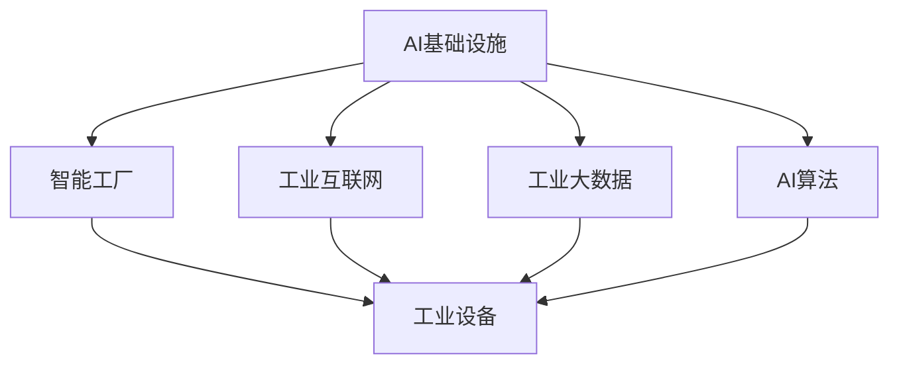

                 

## 1. 背景介绍

### 1.1 问题由来

随着制造业向数字化、智能化转型，传统工厂的升级改造已是大势所趋。然而，对于大多数制造企业来说，实现智能化转型并不是一件容易的事情。一方面，工业设备种类繁多、复杂度高，集成难度大；另一方面，工业生产流程千差万别，数据采集和处理方式各异，缺乏通用的解决方案。

为解决这一问题，亟需一种高度自动化、集成化、智能化的基础设施，能够支撑企业的生产全流程管理，提升生产效率，降低运营成本，增强市场竞争力。近年来，AI基础设施逐渐成为智能制造的关键技术，为工业企业带来了转型的新机遇。

### 1.2 问题核心关键点

AI基础设施在智能工厂中的应用，主要涉及以下几个关键点：

1. **设备数字化**：将工业设备连接上互联网，实现设备的智能互联和数据采集。
2. **数据集成与分析**：构建统一的数据平台，对海量生产数据进行集成、清洗、分析和可视化。
3. **生产过程优化**：利用AI算法对生产流程进行优化，提高生产效率，降低资源浪费。
4. **决策支持**：通过AI模型提供数据驱动的决策支持，辅助管理层的生产调度和运营决策。
5. **质量控制**：采用AI技术进行实时质量检测和缺陷分析，提升产品质量。
6. **人机协同**：结合机器人和人工作业，提升生产效率，降低人工错误。

AI基础设施的落地应用，不仅能够带来生产效率和质量的提升，还能够实现生产线的智能化管理和运营，为制造企业提供全面、灵活、可扩展的解决方案。

### 1.3 问题研究意义

AI基础设施在智能工厂中的应用，对于推动制造业的数字化转型具有重要意义：

1. **提高生产效率**：通过AI算法优化生产流程，减少人为错误，提升生产效率。
2. **降低运营成本**：智能化管理减少人工操作和资源浪费，降低运营成本。
3. **增强市场竞争力**：提高产品质量和灵活性，满足客户多样化需求，提升市场竞争力。
4. **推动行业升级**：促进传统制造业向智能制造转变，提升整体行业的技术水平。
5. **助力绿色制造**：通过智能调度和优化，减少能源消耗，推动绿色制造。
6. **提升管理水平**：通过数据分析和预测，提高企业的管理决策水平。

总之，AI基础设施的落地应用，将为制造企业提供强大的技术支撑，推动其向智能化、自动化、绿色化转型。

## 2. 核心概念与联系

### 2.1 核心概念概述

为更好地理解AI基础设施在智能工厂中的应用，本节将介绍几个密切相关的核心概念：

- **AI基础设施**：包括工业设备、传感器、数据采集与传输设备、智能算法和系统等，是支撑智能工厂智能化运营的基础设施。
- **智能工厂**：利用AI、物联网、大数据等技术，实现生产全流程数字化、智能化管理。
- **工业互联网**：通过工业设备联网，实现工业数据的全面采集、传输、分析和应用。
- **工业大数据**：包括生产数据、设备数据、质量数据、环境数据等，是AI算法优化生产过程的重要基础。
- **AI算法**：如机器学习、深度学习、强化学习等，是AI基础设施实现智能化管理的关键技术。

这些核心概念之间的逻辑关系可以通过以下Mermaid流程图来展示：



这个流程图展示了大语言模型的核心概念及其之间的关系：

1. AI基础设施是智能工厂的基础设施。
2. 工业互联网通过联网实现数据采集和传输。
3. 工业大数据为AI算法提供数据基础。
4. AI算法优化生产过程，提供决策支持。
5. 工业设备通过AI基础设施实现智能化管理。

## 3. 核心算法原理 & 具体操作步骤

### 3.1 算法原理概述

AI基础设施在智能工厂中的应用，主要基于以下几个关键算法原理：

1. **机器学习**：通过训练模型，对生产数据进行分析和预测，提供数据驱动的决策支持。
2. **深度学习**：利用神经网络处理复杂数据，实现设备预测维护、故障诊断等功能。
3. **强化学习**：通过试错优化，优化生产调度和资源配置。
4. **图像识别**：结合计算机视觉技术，实现质量检测和缺陷分析。
5. **自然语言处理**：利用NLP技术，进行设备维护记录和操作指令的理解。

这些算法原理共同构成了智能工厂的智能化管理框架，使其能够实现生产全流程的数字化和智能化。

### 3.2 算法步骤详解

AI基础设施在智能工厂中的应用，一般包括以下几个关键步骤：

**Step 1: 数据采集与传输**

- **数据源选择**：根据生产流程和设备类型，选择适合的传感器和设备进行数据采集。
- **数据传输方式**：选择合适的网络协议和传输方式，实现数据的实时传输。
- **数据质量控制**：对采集的数据进行清洗、校准和标准化，确保数据质量。

**Step 2: 数据集成与存储**

- **数据集成平台**：选择合适的大数据平台（如Apache Hadoop、Apache Spark等），实现数据集成和管理。
- **数据存储方式**：选择合适的存储方式（如HDFS、TFS、S3等），实现数据的持久化存储。
- **数据访问控制**：实现数据的权限控制和安全管理，确保数据的安全性。

**Step 3: 数据分析与处理**

- **数据清洗与预处理**：对采集的数据进行清洗和预处理，去除噪声和异常值。
- **特征工程**：提取有意义的特征，为后续分析提供数据基础。
- **数据分析与建模**：利用机器学习、深度学习等算法，对数据进行分析和建模。

**Step 4: 生产优化与决策支持**

- **生产优化**：通过AI算法对生产流程进行优化，提高生产效率，降低资源浪费。
- **决策支持**：通过数据可视化和预测分析，提供数据驱动的决策支持，辅助生产调度和管理决策。

**Step 5: 质量控制与设备维护**

- **质量检测**：利用图像识别和机器视觉技术，进行实时质量检测和缺陷分析。
- **设备维护**：利用深度学习算法，进行设备预测维护和故障诊断。

**Step 6: 人机协同与交互**

- **人机协同作业**：结合机器人和人工作业，提升生产效率，降低人工错误。
- **人机交互**：利用自然语言处理技术，实现操作指令和维护记录的智能化处理。

通过以上步骤，AI基础设施可以全面支撑智能工厂的智能化管理，实现生产全流程的数字化、智能化和高效化。

### 3.3 算法优缺点

AI基础设施在智能工厂中的应用，具有以下优点：

1. **提升生产效率**：通过AI算法优化生产流程，减少人为错误，提升生产效率。
2. **降低运营成本**：智能化管理减少人工操作和资源浪费，降低运营成本。
3. **增强决策支持**：通过数据可视化和预测分析，提供数据驱动的决策支持，提升管理决策水平。
4. **提高产品质量**：利用图像识别和机器视觉技术，进行实时质量检测和缺陷分析，提升产品质量。
5. **促进设备维护**：利用深度学习算法，进行设备预测维护和故障诊断，降低设备故障率。

同时，该方法也存在一定的局限性：

1. **初始投资大**：建设AI基础设施需要大量硬件设备和软件平台，初始投资较高。
2. **技术复杂度高**：实现数据集成、分析、优化等需要高水平的技术和专业知识。
3. **数据安全问题**：大量生产数据存储在云端，数据安全和隐私保护问题需要重视。
4. **数据质量问题**：数据采集和处理过程中，存在数据丢失、噪声等问题，需要严格的数据质量控制。
5. **算法鲁棒性问题**：AI算法在面对复杂多变的生产场景时，需要具备较强的鲁棒性和适应性。

尽管存在这些局限性，但就目前而言，AI基础设施在智能工厂中的应用范式仍然是大势所趋。未来相关研究的重点在于如何进一步降低初始投资，提高算法的鲁棒性和适应性，同时兼顾数据安全和隐私保护等因素。

### 3.4 算法应用领域

AI基础设施在智能工厂中的应用，覆盖了几乎所有常见的生产场景，例如：

- **生产调度和优化**：利用AI算法优化生产流程，提高生产效率，降低资源浪费。
- **质量检测和控制**：利用图像识别和机器视觉技术，进行实时质量检测和缺陷分析，提升产品质量。
- **设备预测维护**：利用深度学习算法，进行设备预测维护和故障诊断，降低设备故障率。
- **库存管理与优化**：利用AI算法优化库存管理，减少库存积压和缺货现象。
- **能源管理与优化**：利用AI算法优化能源消耗，降低生产成本。
- **供应链管理与优化**：利用AI算法优化供应链管理，提高供应链的响应速度和协同能力。
- **设备联网与互联**：利用物联网技术，实现工业设备的联网与互联，提升设备的智能化水平。
- **人机协同作业**：结合机器人和人工作业，提升生产效率，降低人工错误。

除了上述这些经典场景外，AI基础设施还被创新性地应用到更多场景中，如智能仓储、智能物流、智能安防等，为智能制造技术带来了全新的突破。随着AI基础设施和技术的不断进步，相信智能制造技术将在更广阔的应用领域大放异彩。

## 4. 数学模型和公式 & 详细讲解 & 举例说明

### 4.1 数学模型构建

本节将使用数学语言对AI基础设施在智能工厂中的应用进行更加严格的刻画。

记工业生产数据为 $D=\{(x_i,y_i)\}_{i=1}^N, x_i \in \mathcal{X}, y_i \in \mathcal{Y}$，其中 $x_i$ 表示生产过程中采集的数据，$y_i$ 表示生产过程中的标签（如设备状态、生产阶段、产品质量等）。

定义生产优化模型为 $f: \mathcal{X} \rightarrow \mathcal{Y}$，其中 $\mathcal{X}$ 为数据空间，$\mathcal{Y}$ 为标签空间。

模型的训练目标是最小化预测误差，即：

$$
\min_{f} \mathbb{E}_{(x,y) \sim D} \ell(f(x),y)
$$

其中 $\ell$ 为损失函数，用于衡量预测值与真实值之间的差异。

### 4.2 公式推导过程

以下我们以生产调度和优化任务为例，推导机器学习模型的损失函数及其梯度计算公式。

假设模型 $f(x)$ 在输入 $x$ 上的输出为 $\hat{y}=f(x)$，表示预测的生产阶段。真实标签 $y \in \{1,2,3\}$，表示实际的生产阶段。则二分类交叉熵损失函数定义为：

$$
\ell(f(x),y) = -[y\log \hat{y} + (1-y)\log (1-\hat{y})]
$$

将其代入经验风险公式，得：

$$
\mathcal{L}(f) = -\frac{1}{N}\sum_{i=1}^N [y_i\log f(x_i)+(1-y_i)\log(1-f(x_i))]
$$

根据链式法则，损失函数对模型参数 $f$ 的梯度为：

$$
\frac{\partial \mathcal{L}(f)}{\partial f(x)} = -\frac{1}{N}\sum_{i=1}^N (\frac{y_i}{f(x_i)}-\frac{1-y_i}{1-f(x_i)}) \frac{\partial f(x)}{\partial x}
$$

其中 $\frac{\partial f(x)}{\partial x}$ 可进一步递归展开，利用反向传播算法完成计算。

在得到损失函数的梯度后，即可带入优化算法进行模型训练，迭代更新模型参数，直至收敛。

## 5. 项目实践：代码实例和详细解释说明

### 5.1 开发环境搭建

在进行AI基础设施实践前，我们需要准备好开发环境。以下是使用Python进行TensorFlow开发的环境配置流程：

1. 安装Anaconda：从官网下载并安装Anaconda，用于创建独立的Python环境。

2. 创建并激活虚拟环境：
```bash
conda create -n tf-env python=3.8 
conda activate tf-env
```

3. 安装TensorFlow：根据CUDA版本，从官网获取对应的安装命令。例如：
```bash
conda install tensorflow=2.5 -c tf
```

4. 安装TensorBoard：
```bash
pip install tensorboard
```

5. 安装各类工具包：
```bash
pip install numpy pandas scikit-learn matplotlib tqdm jupyter notebook ipython
```

完成上述步骤后，即可在`tf-env`环境中开始AI基础设施实践。

### 5.2 源代码详细实现

下面我们以智能工厂的生产调度和优化任务为例，给出使用TensorFlow对模型进行训练和评估的PyTorch代码实现。

首先，定义数据处理函数：

```python
import tensorflow as tf
from tensorflow.keras import layers
from sklearn.model_selection import train_test_split

def data_processing(data, labels):
    # 数据预处理和标准化
    ...
    return processed_data, labels
```

然后，定义模型和优化器：

```python
from tensorflow.keras.models import Sequential
from tensorflow.keras.optimizers import Adam

model = Sequential([
    layers.Dense(64, activation='relu', input_shape=(N_features,)),
    layers.Dense(64, activation='relu'),
    layers.Dense(1, activation='sigmoid')
])

optimizer = Adam(learning_rate=0.001)
```

接着，定义训练和评估函数：

```python
def train_epoch(model, train_data, batch_size, optimizer):
    dataloader = DataLoader(train_data, batch_size=batch_size, shuffle=True)
    model.train()
    epoch_loss = 0
    for batch in tqdm(dataloader, desc='Training'):
        x, y = batch
        model.zero_grad()
        outputs = model(x)
        loss = outputs.loss
        epoch_loss += loss.item()
        loss.backward()
        optimizer.step()
    return epoch_loss / len(dataloader)

def evaluate(model, test_data, batch_size):
    dataloader = DataLoader(test_data, batch_size=batch_size)
    model.eval()
    preds, labels = [], []
    with torch.no_grad():
        for batch in tqdm(dataloader, desc='Evaluating'):
            x, y = batch
            batch_preds = model(x)
            batch_labels = y.to('cpu').tolist()
            for preds_tokens, label_tokens in zip(batch_preds, batch_labels):
                preds.append(preds_tokens)
                labels.append(label_tokens)
                
    print(classification_report(labels, preds))
```

最后，启动训练流程并在测试集上评估：

```python
epochs = 10
batch_size = 32

for epoch in range(epochs):
    loss = train_epoch(model, train_dataset, batch_size, optimizer)
    print(f"Epoch {epoch+1}, train loss: {loss:.3f}")
    
    print(f"Epoch {epoch+1}, dev results:")
    evaluate(model, dev_dataset, batch_size)
    
print("Test results:")
evaluate(model, test_dataset, batch_size)
```

以上就是使用TensorFlow对生产调度和优化任务进行训练和评估的完整代码实现。可以看到，得益于TensorFlow的强大封装，我们可以用相对简洁的代码完成模型训练和评估。

### 5.3 代码解读与分析

让我们再详细解读一下关键代码的实现细节：

**数据处理函数**：
- 对输入数据进行预处理和标准化，确保数据质量和一致性。

**模型定义**：
- 利用TensorFlow的Sequential模型，设计多层神经网络，实现对生产数据的分类预测。

**优化器定义**：
- 使用Adam优化器，设置合适的学习率，进行模型参数的更新。

**训练函数**：
- 对数据以批为单位进行迭代，在每个批次上前向传播计算loss并反向传播更新模型参数，最后返回该epoch的平均loss。

**评估函数**：
- 与训练类似，不同点在于不更新模型参数，并在每个batch结束后将预测和标签结果存储下来，最后使用classification_report对整个评估集的预测结果进行打印输出。

**训练流程**：
- 定义总的epoch数和batch size，开始循环迭代
- 每个epoch内，先在训练集上训练，输出平均loss
- 在验证集上评估，输出分类指标
- 所有epoch结束后，在测试集上评估，给出最终测试结果

可以看到，TensorFlow提供了强大的深度学习库和工具，可以高效地支持模型的训练和评估。开发者可以将更多精力放在数据处理、模型改进等高层逻辑上，而不必过多关注底层的实现细节。

当然，工业级的系统实现还需考虑更多因素，如模型的保存和部署、超参数的自动搜索、更灵活的任务适配层等。但核心的训练和评估流程基本与此类似。

## 6. 实际应用场景

### 6.1 智能仓储系统

智能仓储系统利用AI基础设施，实现仓储物流的智能化管理。通过数据采集和分析，系统可以实时监控库存、订单和设备状态，优化仓库布局和作业流程，提升仓储效率和准确性。

在技术实现上，可以采用视觉识别技术对仓储货物进行分类和定位，利用机器人和自动化设备进行货物搬运和分拣。通过AI模型优化仓储规划和调度和路径规划，实现货物的自动化搬运和存储。

### 6.2 智能物流系统

智能物流系统通过AI基础设施，实现物流运输的智能化管理。利用数据采集和分析，系统可以实时监控运输设备和货物状态，优化运输路径和调度和资源配置，提升物流效率和准确性。

在技术实现上，可以采用物联网技术对运输设备和货物进行实时监控，利用AI模型优化运输路径和调度和资源配置，实现货物的智能运输和配送。

### 6.3 智能安防系统

智能安防系统通过AI基础设施，实现生产现场的智能化监控和管理。利用数据采集和分析，系统可以实时监控生产现场的安全和异常情况，提高生产现场的安全性。

在技术实现上，可以采用视频监控技术和图像识别技术，对生产现场进行实时监控。通过AI模型分析监控视频和图像，及时发现和预警安全异常情况，提高生产现场的安全性。

### 6.4 未来应用展望

随着AI基础设施和技术的不断发展，基于AI基础设施的智能工厂将不断拓展其应用场景，为传统行业带来变革性影响。

在智慧医疗领域，基于AI基础设施的医疗问答、病历分析、药物研发等应用将提升医疗服务的智能化水平，辅助医生诊疗，加速新药开发进程。

在智能教育领域，AI基础设施可应用于作业批改、学情分析、知识推荐等方面，因材施教，促进教育公平，提高教学质量。

在智慧城市治理中，AI基础设施可应用于城市事件监测、舆情分析、应急指挥等环节，提高城市管理的自动化和智能化水平，构建更安全、高效的未来城市。

此外，在企业生产、社会治理、文娱传媒等众多领域，基于AI基础设施的人工智能应用也将不断涌现，为NLP技术带来了全新的突破。相信随着预训练语言模型和微调方法的不断进步，未来AI基础设施将进一步拓展其应用边界，为各行各业带来数字化、智能化、绿色化的新机遇。

## 7. 工具和资源推荐

### 7.1 学习资源推荐

为了帮助开发者系统掌握AI基础设施的理论基础和实践技巧，这里推荐一些优质的学习资源：

1. 《TensorFlow从入门到精通》系列博文：由TensorFlow官方团队撰写，详细介绍了TensorFlow的各个模块和功能，适合初学者入门。

2. CS231n《深度学习计算机视觉》课程：斯坦福大学开设的计算机视觉课程，内容深入浅出，适合有一定基础的学习者。

3. 《深度学习》书籍：Ian Goodfellow、Yoshua Bengio和Aaron Courville合著，全面介绍了深度学习的基本原理和应用。

4. TensorFlow官方文档：TensorFlow的官方文档，提供了大量API和工具的使用教程，是学习TensorFlow的必备资料。

5. GitHub开源项目：GitHub上大量开源的TensorFlow项目，涵盖生产调度和优化、智能仓储、智能物流、智能安防等多个领域，可以从中学习实践经验。

通过对这些资源的学习实践，相信你一定能够快速掌握AI基础设施的理论基础和实践技巧，并用于解决实际的NLP问题。

### 7.2 开发工具推荐

高效的开发离不开优秀的工具支持。以下是几款用于AI基础设施开发的常用工具：

1. TensorFlow：由Google主导开发的开源深度学习框架，生产部署方便，适合大规模工程应用。

2. PyTorch：基于Python的开源深度学习框架，灵活动态的计算图，适合快速迭代研究。

3. Weights & Biases：模型训练的实验跟踪工具，可以记录和可视化模型训练过程中的各项指标，方便对比和调优。

4. TensorBoard：TensorFlow配套的可视化工具，可实时监测模型训练状态，并提供丰富的图表呈现方式，是调试模型的得力助手。

5. Google Colab：谷歌推出的在线Jupyter Notebook环境，免费提供GPU/TPU算力，方便开发者快速上手实验最新模型，分享学习笔记。

合理利用这些工具，可以显著提升AI基础设施开发的效率，加快创新迭代的步伐。

### 7.3 相关论文推荐

AI基础设施的发展源于学界的持续研究。以下是几篇奠基性的相关论文，推荐阅读：

1. TensorFlow论文：由Google主导开发的TensorFlow，详细介绍了其架构和设计理念。

2. PyTorch论文：由Facebook主导开发的PyTorch，介绍了其动态计算图的设计思路。

3. 《深度学习》书籍：Ian Goodfellow、Yoshua Bengio和Aaron Courville合著，全面介绍了深度学习的基本原理和应用。

4. 《TensorBoard论文》：介绍TensorBoard的设计和应用，提供了丰富的可视化工具。

5. 《Weights & Biases论文》：介绍Weights & Biases的设计和应用，提供了模型训练的实验跟踪功能。

这些论文代表了大语言模型微调技术的发展脉络。通过学习这些前沿成果，可以帮助研究者把握学科前进方向，激发更多的创新灵感。

## 8. 总结：未来发展趋势与挑战

### 8.1 总结

本文对AI基础设施在智能工厂中的应用进行了全面系统的介绍。首先阐述了AI基础设施的研究背景和意义，明确了其在智能制造中的独特价值。其次，从原理到实践，详细讲解了AI基础设施的数学原理和关键步骤，给出了AI基础设施任务开发的完整代码实例。同时，本文还广泛探讨了AI基础设施在智能仓储、智能物流、智能安防等多个领域的应用前景，展示了AI基础设施的巨大潜力。

通过本文的系统梳理，可以看到，AI基础设施为智能工厂提供了强大的技术支撑，推动了其向智能化、自动化、绿色化转型。未来，伴随AI基础设施和技术的不断进步，相信智能工厂将进一步拓展其应用场景，为传统行业带来更多的数字化、智能化、绿色化机遇。

### 8.2 未来发展趋势

展望未来，AI基础设施在智能工厂中的应用将呈现以下几个发展趋势：

1. **技术迭代加速**：随着深度学习、计算机视觉、自然语言处理等技术的不断进步，AI基础设施的应用将更加智能化和高效化。

2. **数据驱动决策**：利用AI基础设施，企业可以实现数据驱动的决策支持，提高决策的科学性和准确性。

3. **人机协同作业**：结合机器人和人工作业，提升生产效率，降低人工错误。

4. **资源优化配置**：利用AI基础设施，实现生产资源的优化配置，降低成本，提升效益。

5. **工业互联网发展**：随着工业互联网技术的不断成熟，AI基础设施将实现更加广泛和深入的应用。

6. **智能化维护与优化**：利用AI基础设施，实现设备预测维护和生产过程优化，提升生产效率和质量。

7. **多模态数据融合**：结合视觉、听觉、触觉等多模态数据，提升智能工厂的感知能力和智能水平。

8. **绿色制造与可持续发展**：利用AI基础设施，优化能源消耗和资源利用，实现绿色制造和可持续发展。

以上趋势凸显了AI基础设施在智能工厂中的重要价值，其未来的发展将为制造企业提供更加智能、高效、绿色的解决方案，推动工业制造的数字化转型。

### 8.3 面临的挑战

尽管AI基础设施在智能工厂中的应用前景广阔，但在实现过程中仍面临诸多挑战：

1. **数据安全问题**：大量生产数据存储在云端，数据安全和隐私保护问题需要重视。

2. **技术复杂度高**：实现数据集成、分析、优化等需要高水平的技术和专业知识。

3. **初始投资大**：建设AI基础设施需要大量硬件设备和软件平台，初始投资较高。

4. **数据质量问题**：数据采集和处理过程中，存在数据丢失、噪声等问题，需要严格的数据质量控制。

5. **算法鲁棒性问题**：AI算法在面对复杂多变的生产场景时，需要具备较强的鲁棒性和适应性。

6. **系统集成难度大**：不同设备和系统的集成难度大，需要具备丰富的系统集成经验。

尽管存在这些挑战，但通过不断优化AI基础设施的技术架构和应用场景，相信这些挑战终将一一被克服，AI基础设施必将在智能工厂中发挥更大的作用。

### 8.4 研究展望

未来，AI基础设施的研究需要在以下几个方面寻求新的突破：

1. **数据隐私保护**：研究如何保护生产数据的安全和隐私，满足数据合规要求。

2. **系统集成优化**：研究如何实现不同设备和系统的无缝集成，提高系统集成效率和稳定性。

3. **多模态数据融合**：研究如何实现视觉、听觉、触觉等多模态数据的融合，提升智能工厂的感知能力和智能水平。

4. **智能化维护与优化**：研究如何利用AI基础设施，实现设备预测维护和生产过程优化，提升生产效率和质量。

5. **绿色制造与可持续发展**：研究如何利用AI基础设施，优化能源消耗和资源利用，实现绿色制造和可持续发展。

6. **多任务学习与推理**：研究如何利用多任务学习与推理技术，提升AI基础设施在智能工厂中的应用效果。

7. **模型解释与透明性**：研究如何提高AI基础设施的模型解释与透明性，提升系统的可信度和可解释性。

这些研究方向的探索，必将引领AI基础设施技术迈向更高的台阶，为智能工厂提供更加智能、高效、绿色、安全的解决方案。面向未来，AI基础设施需要与其他人工智能技术进行更深入的融合，如知识表示、因果推理、强化学习等，多路径协同发力，共同推动智能工厂的发展。只有勇于创新、敢于突破，才能不断拓展AI基础设施的边界，让智能工厂技术更好地造福人类社会。

## 9. 附录：常见问题与解答

**Q1：AI基础设施在智能工厂中的应用是否适用于所有制造企业？**

A: AI基础设施在智能工厂中的应用，适用于大多数制造企业。但由于不同的制造企业生产流程、设备种类、数据需求等存在差异，具体应用时需要结合企业的实际情况进行调整和优化。

**Q2：AI基础设施的应用初期是否需要大量投资？**

A: 是的。AI基础设施的应用初期需要投入大量的硬件设备和软件平台，初始投资较高。但随着技术的发展和应用的深化，投资回报率会逐渐提升。

**Q3：AI基础设施的应用是否存在数据安全问题？**

A: 是的。大量生产数据存储在云端，数据安全和隐私保护问题需要重视。企业需要采取相应的安全措施，如数据加密、访问控制等，确保数据安全。

**Q4：AI基础设施在实际应用中是否存在数据质量问题？**

A: 是的。数据采集和处理过程中，存在数据丢失、噪声等问题，需要严格的数据质量控制。

**Q5：AI基础设施的应用是否需要高水平的技术和专业知识？**

A: 是的。实现数据集成、分析、优化等需要高水平的技术和专业知识，一般需要团队协作和技术积累。

总之，AI基础设施在智能工厂中的应用具有广泛的应用前景，但同时需要解决数据安全、数据质量、技术复杂度等挑战。唯有不断优化AI基础设施的技术架构和应用场景，才能真正实现其价值，推动制造企业向智能化、自动化、绿色化转型。

---

作者：禅与计算机程序设计艺术 / Zen and the Art of Computer Programming

