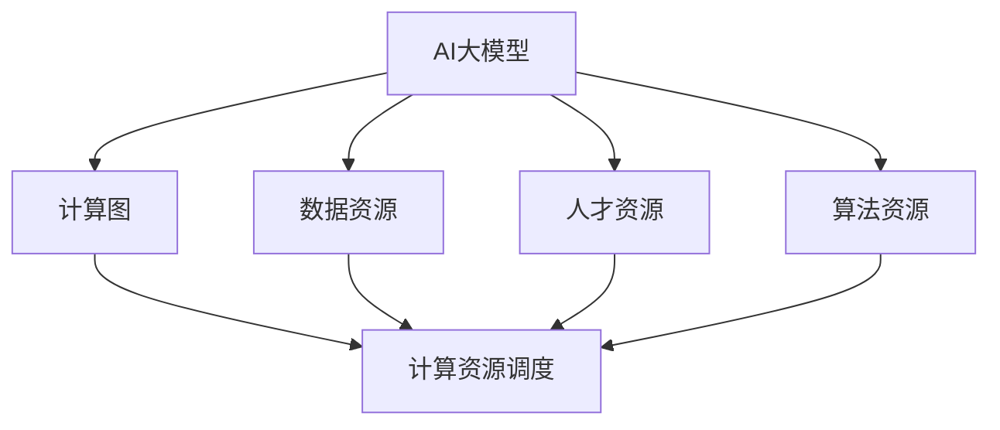

                 

## 1. 背景介绍

### 1.1 问题由来
在人工智能快速发展的大背景下，AI大模型逐渐成为了创业公司、初创企业和学术界关注的焦点。大模型往往基于大规模的预训练数据和复杂的算法架构，具有极高的计算需求和资源要求。如何有效利用这些资源，降低创业门槛，成为当前研究热点。

### 1.2 问题核心关键点
资源优势在大模型创业中主要体现在以下几个方面：
- **计算资源**：大模型训练通常需要高性能计算资源，如GPU、TPU等。
- **数据资源**：大模型往往需要大量的标注数据进行预训练和微调。
- **人才资源**：大模型的开发、训练和部署需要跨领域的专家知识，如数据科学、机器学习、软件工程等。
- **算法资源**：大模型的算法架构复杂，包括深度学习、分布式训练、优化算法等。

这些资源的优势为大模型创业带来了巨大挑战和机遇。如何在有限的资源条件下，最大化这些资源的优势，将决定创业公司的成功与否。

## 2. 核心概念与联系

### 2.1 核心概念概述

为了更深入理解如何利用资源优势，我们需要先清晰几个核心概念：

- **AI大模型**：指基于大规模预训练数据和复杂算法架构，能够执行特定AI任务的深度学习模型，如BERT、GPT等。
- **资源优势**：指创业公司拥有的高性能计算资源、海量数据、丰富人才和先进算法等优势资源。
- **计算图**：AI大模型通过计算图进行前向传播和反向传播，其优化和调试依赖于计算图的结构。
- **资源调度**：通过合理的资源分配和调度，提高计算资源利用率，加速模型训练和推理。

这些概念之间的关系可以通过以下Mermaid流程图展示：



## 3. 核心算法原理 & 具体操作步骤

### 3.1 算法原理概述

大模型创业中，利用资源优势的核心在于构建高效、可扩展的计算图，合理调度计算资源，最大化数据和人才的利用率。以下是基于计算图的大模型创业方法的核心算法原理：

1. **分布式训练**：通过多机多任务并行计算，加速模型训练。常见方法包括数据并行、模型并行、混合并行等。
2. **自动微分**：自动计算计算图梯度，简化计算过程。常见工具包括TensorFlow、PyTorch等。
3. **模型压缩与加速**：通过对计算图进行剪枝、量化、蒸馏等操作，减小模型大小，提高推理速度。
4. **资源调度与优化**：通过合理分配计算资源，避免资源浪费，提升计算效率。

### 3.2 算法步骤详解

以下是大模型创业的详细步骤，涵盖从模型构建到资源调度的全过程：

**Step 1: 数据准备与处理**
- 收集标注数据：根据应用场景选择合适的数据源，确保数据的多样性和代表性。
- 数据预处理：对数据进行清洗、标注、分片等预处理，为计算图提供输入。

**Step 2: 模型构建与优化**
- 设计计算图：选择合适的深度学习框架（如TensorFlow、PyTorch），构建计算图。
- 优化计算图：通过剪枝、量化、蒸馏等方法，优化计算图，减小模型规模。
- 模型训练与验证：在分布式计算环境中，使用自动微分工具，进行模型训练与验证。

**Step 3: 资源调度和优化**
- 资源分配：根据计算图和模型大小，合理分配计算资源。
- 资源调度：使用调度工具（如Kubernetes），动态调整计算资源。
- 性能优化：通过超参数调优、模型加速等手段，提高模型性能。

**Step 4: 应用部署与监控**
- 模型部署：将训练好的模型部署到目标环境中，如服务器、云端等。
- 性能监控：使用监控工具（如TensorBoard、Weights & Biases），实时监测模型性能。
- 模型优化：根据监控结果，对计算图和资源配置进行调整优化。

### 3.3 算法优缺点

**优点**：
1. **加速训练**：通过分布式训练和自动微分，显著缩短模型训练时间。
2. **提升性能**：通过模型压缩和优化，提高模型推理速度和准确率。
3. **灵活调度**：通过资源调度工具，动态调整计算资源，提高资源利用率。

**缺点**：
1. **技术门槛高**：需要深入理解计算图和分布式计算，掌握自动微分和资源调度等技术。
2. **成本高**：高性能计算资源和专业人才较为昂贵，初创企业难以负担。
3. **复杂度高**：计算图设计和优化较为复杂，需要花费大量时间和精力。

### 3.4 算法应用领域

大模型创业方法广泛应用于以下几个领域：

- **自然语言处理**：构建基于BERT、GPT等模型的NLP应用，如机器翻译、情感分析、对话系统等。
- **计算机视觉**：构建基于ResNet、DenseNet等模型的CV应用，如图像分类、目标检测、图像生成等。
- **语音识别**：构建基于Transformer、CTC等模型的ASR应用，如语音转文字、说话人识别等。
- **强化学习**：构建基于深度强化学习算法的游戏、机器人等应用。

## 4. 数学模型和公式 & 详细讲解 & 举例说明

### 4.1 数学模型构建

以一个简单的线性回归模型为例，构建计算图的基本框架：

1. **输入数据**：设输入数据为 $X=\{x_1, x_2, ..., x_n\}$。
2. **模型参数**：设模型参数为 $w=[w_1, w_2, ..., w_n]^T$。
3. **计算图**：线性回归模型计算图如图1所示。

图1：线性回归模型计算图

其中，$z$ 为模型的预测值，$b$ 为模型截距，$y$ 为实际输出值。

### 4.2 公式推导过程

假设模型输出 $y$ 与预测值 $z$ 之间存在线性关系 $y = \sigma(z)$，其中 $\sigma$ 为激活函数（如sigmoid、ReLU等）。则线性回归模型的损失函数可以表示为：

$$
\mathcal{L} = \frac{1}{2n} \sum_{i=1}^n (y_i - \sigma(z_i))^2
$$

其中 $y_i$ 为实际输出值，$\sigma(z_i) = w^T x_i + b$ 为模型预测值。

利用自动微分工具，如TensorFlow的`tf.GradientTape`，自动计算损失函数对模型参数 $w$ 的梯度：

$$
\frac{\partial \mathcal{L}}{\partial w} = \frac{1}{n} \sum_{i=1}^n (\sigma(z_i) - y_i) x_i
$$

### 4.3 案例分析与讲解

以一个简单的图像分类模型为例，展示如何利用计算图进行资源调度和优化。

1. **数据准备**：准备包含图像和标签的训练数据集，进行数据增强和预处理。
2. **模型构建**：使用PyTorch构建计算图，定义卷积层、池化层、全连接层等组件。
3. **模型训练**：在分布式计算环境中，使用`torch.distributed`模块进行数据并行训练。
4. **资源调度**：使用`torch.distributed.launch`启动多个训练进程，动态调整计算资源，优化性能。

## 5. 项目实践：代码实例和详细解释说明

### 5.1 开发环境搭建

以下是在PyTorch中进行分布式训练和资源调度的环境搭建步骤：

1. 安装PyTorch：
```bash
pip install torch torchvision torchaudio
```

2. 安装分布式训练工具：
```bash
pip install torch-distributed
```

3. 安装资源调度工具：
```bash
pip install slurm
```

4. 配置环境变量：
```bash
export SLURM_DIR=~/slurm
source slurm/batch.sh
```

5. 准备训练数据：
```bash
mkdir data
cd data
wget https://your-dataset-url
```

### 5.2 源代码详细实现

以下是一个基于PyTorch的简单图像分类模型的实现，展示如何使用分布式训练和资源调度：

```python
import torch
import torch.distributed as dist
import torch.distributed.launch as launch
from torch import nn, optim
from torchvision import datasets, transforms

# 定义计算图
class Net(nn.Module):
    def __init__(self):
        super(Net, self).__init__()
        self.conv1 = nn.Conv2d(3, 32, kernel_size=3, stride=1, padding=1)
        self.pool = nn.MaxPool2d(kernel_size=2, stride=2)
        self.fc1 = nn.Linear(32 * 8 * 8, 128)
        self.fc2 = nn.Linear(128, 10)

    def forward(self, x):
        x = nn.functional.relu(self.conv1(x))
        x = self.pool(x)
        x = nn.functional.relu(self.fc1(x.view(-1, 32 * 8 * 8)))
        x = self.fc2(x)
        return x

# 定义损失函数和优化器
net = Net()
criterion = nn.CrossEntropyLoss()
optimizer = optim.Adam(net.parameters())

# 训练函数
def train_epoch(net, data_loader, optimizer, device):
    net.train()
    loss = 0
    for batch_idx, (data, target) in enumerate(data_loader):
        data, target = data.to(device), target.to(device)
        optimizer.zero_grad()
        output = net(data)
        loss += criterion(output, target).item()
        loss.backward()
        optimizer.step()

# 分布式训练
def main():
    distributed = False
    if distributed:
        torch.distributed.init_process_group('gloo', rank=dist.get_rank(), world_size=2)
        net = Net().cuda().to(distributed_rank=dist.get_rank())

    train_loader = torch.utils.data.DataLoader(
        datasets.MNIST('.', train=True, download=True, transform=transforms.ToTensor()),
        batch_size=64, shuffle=True, num_workers=4)

    for epoch in range(5):
        train_epoch(net, train_loader, optimizer, device)

if __name__ == '__main__':
    launch.run(main)
```

### 5.3 代码解读与分析

- `torch.distributed`：用于分布式训练和资源调度，提供`init_process_group`等方法初始化分布式环境。
- `torch.distributed.launch`：启动多个训练进程，动态调整计算资源，优化性能。
- `torch.distributed`模块的`World`类和`Rank`类分别表示计算集群和当前进程的排名。

## 6. 实际应用场景

### 6.1 智能客服系统

利用大模型创业方法，可以构建智能客服系统。具体步骤如下：

1. **数据准备**：收集企业内部客服对话记录，进行数据清洗和标注。
2. **模型构建**：使用BERT或GPT等模型，构建计算图。
3. **分布式训练**：在分布式计算环境中，进行模型训练和验证。
4. **资源调度**：使用Kubernetes等工具，动态调整计算资源，优化系统性能。
5. **应用部署**：将训练好的模型部署到目标环境中，如云平台、服务器等。

### 6.2 金融舆情监测

在金融领域，利用大模型创业方法，可以构建舆情监测系统。具体步骤如下：

1. **数据准备**：收集金融领域的新闻、报道、评论等文本数据，进行数据清洗和标注。
2. **模型构建**：使用BERT等模型，构建计算图。
3. **分布式训练**：在分布式计算环境中，进行模型训练和验证。
4. **资源调度**：使用Kubernetes等工具，动态调整计算资源，优化系统性能。
5. **应用部署**：将训练好的模型部署到目标环境中，如云平台、服务器等。

### 6.3 个性化推荐系统

利用大模型创业方法，可以构建个性化推荐系统。具体步骤如下：

1. **数据准备**：收集用户浏览、点击、评论、分享等行为数据，进行数据清洗和标注。
2. **模型构建**：使用DeepFM、SAS等模型，构建计算图。
3. **分布式训练**：在分布式计算环境中，进行模型训练和验证。
4. **资源调度**：使用Kubernetes等工具，动态调整计算资源，优化系统性能。
5. **应用部署**：将训练好的模型部署到目标环境中，如云平台、服务器等。

## 7. 工具和资源推荐

### 7.1 学习资源推荐

1. **深度学习**：推荐阅读《深度学习》（Ian Goodfellow等著），全面介绍深度学习理论和实践。
2. **分布式计算**：推荐阅读《分布式系统：原理与范例》（George Coulouris等著），深入理解分布式计算原理和应用。
3. **资源调度**：推荐阅读《Kubernetes: Up and Running》（Heather Reigns等著），详细了解Kubernetes的使用方法。
4. **TensorFlow和PyTorch**：官方文档、教程和社区资源丰富，可以帮助快速上手。

### 7.2 开发工具推荐

1. **PyTorch**：功能强大、易于使用的深度学习框架，支持分布式计算和自动微分。
2. **TensorFlow**：开源的深度学习框架，支持多种分布式计算和资源调度方式。
3. **Kubernetes**：开源的容器编排系统，支持大规模分布式计算环境。
4. **TensorBoard**：可视化工具，可以实时监测模型训练和推理性能。
5. **Weights & Biases**：实验跟踪工具，帮助记录和分析模型训练和验证结果。

### 7.3 相关论文推荐

1. **分布式深度学习**：推荐阅读《Distributed Deep Learning》（Yanhua Zhang等著），介绍分布式深度学习理论和方法。
2. **模型压缩与加速**：推荐阅读《Pruning Neural Networks for Efficient Inference》（Xu et al.），介绍模型剪枝、量化、蒸馏等技术。
3. **资源调度和优化**：推荐阅读《Efficient Resource Allocation in Distributed Machine Learning Systems》（Arumugam et al.），介绍资源调度和优化方法。

## 8. 总结：未来发展趋势与挑战

### 8.1 总结

大模型创业方法利用资源优势，构建高效、可扩展的计算图，合理调度计算资源，最大化数据和人才的利用率。通过分布式训练、自动微分、模型压缩和优化等手段，显著缩短模型训练时间，提升模型推理速度和准确率，实现高性能的AI大模型应用。

### 8.2 未来发展趋势

未来大模型创业将呈现以下几个趋势：

1. **云计算普及**：随着云计算技术的发展，云计算平台将提供更加便捷、高效的计算资源。
2. **边缘计算应用**：边缘计算技术的应用将使大模型在低延迟、高带宽的场景下更加高效。
3. **模型泛化能力提升**：通过迁移学习和多模态学习，提升模型的泛化能力和适应性。
4. **模型压缩与优化**：模型压缩和优化技术将进一步降低计算成本，提高资源利用率。
5. **资源调度与优化**：资源调度工具将更加智能、高效，优化计算资源利用率。

### 8.3 面临的挑战

尽管大模型创业方法已经取得显著进展，但仍面临一些挑战：

1. **计算资源成本高**：高性能计算资源和专业人才成本较高，初创企业难以负担。
2. **数据隐私和安全**：数据隐私和安全问题亟需解决，确保数据和模型安全。
3. **模型复杂度高**：计算图设计和优化较为复杂，需要花费大量时间和精力。

### 8.4 研究展望

未来研究应重点关注以下几个方向：

1. **资源共享和协作**：建立跨企业、跨机构的资源共享和协作机制，降低计算成本。
2. **数据安全和隐私保护**：采用数据匿名化、差分隐私等技术，保护数据隐私和安全。
3. **模型自动化设计**：研究模型自动化设计和优化方法，降低模型设计门槛。
4. **边缘计算与云计算结合**：探索边缘计算与云计算的结合，实现高效计算资源分配。
5. **模型可解释性和可控性**：研究模型可解释性和可控性方法，确保模型应用的透明性和可靠性。

## 9. 附录：常见问题与解答

**Q1：大模型创业的计算资源成本是否很高？**

A: 是的，高性能计算资源和专业人才成本较高，初创企业可能难以负担。但随着云计算技术的发展，云计算平台将提供更加便捷、高效的计算资源，降低创业门槛。

**Q2：如何提高大模型的泛化能力？**

A: 可以通过迁移学习和多模态学习，提升模型的泛化能力和适应性。此外，利用多任务学习、自监督学习等技术，也能有效提高模型的泛化能力。

**Q3：如何降低大模型的计算成本？**

A: 可以通过模型压缩和优化技术，减小模型规模，降低计算成本。同时，利用分布式计算和边缘计算技术，提高计算资源利用率，优化系统性能。

**Q4：大模型的资源调度如何实现？**

A: 可以使用Kubernetes等资源调度工具，动态调整计算资源，优化系统性能。在分布式计算环境中，利用TensorFlow、PyTorch等框架的分布式计算能力，提高计算效率。

**Q5：大模型的资源调度和优化有哪些方法？**

A: 常见的资源调度和优化方法包括数据并行、模型并行、混合并行、梯度积累、混合精度训练等。此外，还可以利用模型压缩、量化、蒸馏等技术，减小模型规模，提高推理速度。

---

作者：禅与计算机程序设计艺术 / Zen and the Art of Computer Programming

