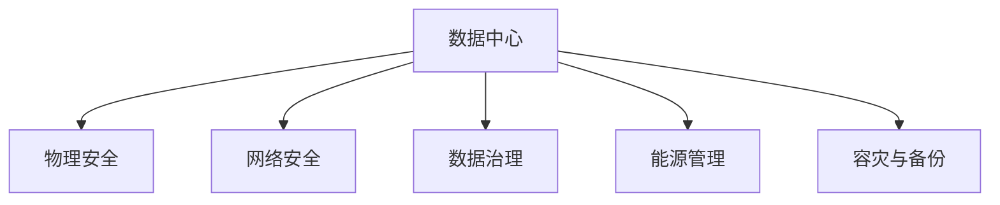

                 

# AI 大模型应用数据中心建设：数据中心安全与可靠性

> 关键词：AI大模型、数据中心、安全与可靠性、网络安全、数据治理、能源管理、容灾与备份

## 1. 背景介绍

### 1.1 问题由来

随着人工智能(AI)技术的飞速发展，大模型如GPT-3、BERT等在自然语言处理(NLP)、计算机视觉(CV)、语音识别等领域取得了突破性进展。这些大模型通常拥有数十亿参数，能够处理海量数据，提供卓越的性能表现。然而，随着模型规模的不断增大，其在数据中心建设、存储、计算、网络等方面的要求也越来越高，如何保证数据中心的安全与可靠性，成为了大模型应用中至关重要的问题。

### 1.2 问题核心关键点

- **数据中心安全**：指通过各种手段和技术保障数据中心免受物理、网络等威胁，确保数据和模型不受侵害。
- **数据中心可靠性**：指确保数据中心高效稳定运行，降低故障率，保障服务的连续性和可用性。
- **网络安全**：指防止未授权访问、数据泄露等网络安全事件，保护模型和数据不被非法利用。
- **数据治理**：指通过制度和技术手段管理数据的收集、存储、使用等全生命周期，保证数据的质量和安全。
- **能源管理**：指合理利用数据中心的电力资源，降低运营成本，实现绿色能源的利用。
- **容灾与备份**：指在数据中心发生灾难性故障时，能快速恢复服务和数据，减少业务损失。

## 2. 核心概念与联系

### 2.1 核心概念概述

为更好地理解数据中心安全与可靠性，本节将介绍几个密切相关的核心概念：

- **数据中心(Data Center, DC)**：为提供高效稳定的计算和存储服务，通过物理基础设施和技术手段构建的场所。
- **物理安全**：指通过环境控制、访问控制等手段，保障数据中心物理设施的安全。
- **网络安全**：指通过防火墙、入侵检测系统(IDS)等技术，保护数据中心网络免受攻击。
- **数据治理**：指通过数据分类、加密、访问控制等手段，管理数据的全生命周期，确保数据安全和合规。
- **能源管理**：指通过电力监控、负载均衡等技术，优化数据中心能源利用，降低运营成本。
- **容灾与备份**：指通过数据备份、冗余设计等技术，保障数据中心在灾难发生时的业务连续性。

这些核心概念之间的逻辑关系可以通过以下Mermaid流程图来展示：



这个流程图展示了大模型应用中的数据中心各个组成部分及其之间的关系：

1. 数据中心是AI大模型应用的基础设施。
2. 物理安全和网络安全保障数据中心硬件和软件的安全。
3. 数据治理确保数据的安全、合规和高效管理。
4. 能源管理优化能源利用，降低运营成本。
5. 容灾与备份保障数据中心在灾难发生时能够快速恢复。

这些概念共同构成了数据中心安全与可靠性的基础框架，为大模型应用的稳定运行提供了重要保障。

## 3. 核心算法原理 & 具体操作步骤

### 3.1 算法原理概述

基于AI大模型的数据中心建设，主要依赖于数据中心基础设施、网络技术、数据管理和能源管理等。通过合理设计这些组件，可以实现数据中心的高效、安全、可靠运行。

- **基础设施建设**：构建高性能计算和存储集群，如采用GPU集群、分布式存储等技术。
- **网络技术**：部署高速网络、负载均衡、DDoS防护等技术，保障数据中心网络的安全性和稳定性。
- **数据管理**：建立数据分类、加密、备份等机制，确保数据的安全性和合规性。
- **能源管理**：优化能源使用，如采用高效冷却系统、节能算法等，降低运营成本。
- **容灾与备份**：设计冗余架构、数据备份策略，保障数据中心在灾难发生时能够快速恢复。

### 3.2 算法步骤详解

#### 3.2.1 基础设施建设

1. **硬件选择**：选择高性能的服务器和存储设备，如NVIDIA A100 GPU、SAN存储系统等。
2. **网络设计**：采用10G/25G以太网、SDN技术，构建高可用性网络。
3. **系统集成**：集成计算、存储、网络资源，形成统一管理平台。

#### 3.2.2 网络安全

1. **防火墙**：部署网络防火墙，监控进出流量，阻止恶意访问。
2. **入侵检测系统(IDS)**：部署IDS，检测并响应网络攻击。
3. **DDoS防护**：部署DDoS防护设备，抵御大规模分布式拒绝服务攻击。

#### 3.2.3 数据治理

1. **数据分类**：根据数据敏感程度进行分类，如分为公共数据、敏感数据等。
2. **数据加密**：对敏感数据进行加密，防止数据泄露。
3. **访问控制**：设置严格的数据访问权限，防止未授权访问。

#### 3.2.4 能源管理

1. **电力监控**：部署电力监控系统，实时监测能源使用情况。
2. **负载均衡**：合理分配计算负载，避免过度耗电。
3. **节能算法**：优化算法和架构，降低能耗。

#### 3.2.5 容灾与备份

1. **冗余设计**：设计多数据中心、冗余设备，保障高可用性。
2. **数据备份**：定期备份数据，确保数据丢失时能够恢复。
3. **灾难恢复**：建立灾难恢复计划，快速恢复业务。

### 3.3 算法优缺点

#### 3.3.1 优点

- **提高效率**：通过合理设计和优化，大模型在数据中心的应用能够高效运行，提升任务处理能力。
- **保障安全**：通过严格的物理安全、网络安全、数据治理等措施，保护数据中心免受各类威胁，保障数据和模型的安全。
- **降低成本**：通过能源管理和节能算法，降低数据中心运营成本，提高能源利用效率。
- **提升可靠性**：通过冗余设计和灾难恢复措施，确保数据中心在故障时能够快速恢复，保障业务连续性。

#### 3.3.2 缺点

- **投资成本高**：构建高性能数据中心需要大量资金和技术投入。
- **技术复杂**：管理和维护高性能数据中心，需要高水平的技术和管理能力。
- **风险多样**：数据中心面临的威胁种类繁多，如自然灾害、人为破坏等，难以完全消除。

### 3.4 算法应用领域

基于AI大模型的数据中心建设，在多个领域得到了广泛应用，如金融、医疗、智能交通等。这些领域对数据中心的安全与可靠性要求极高，大模型应用需要稳定、高效、安全的数据中心支持。

## 4. 数学模型和公式 & 详细讲解 & 举例说明（备注：数学公式请使用latex格式，latex嵌入文中独立段落使用 $$，段落内使用 $)
### 4.1 数学模型构建

#### 4.1.1 基础设施模型

1. **计算资源模型**：计算资源的数量和性能模型，如服务器的CPU、GPU数量和计算能力。
2. **存储资源模型**：存储资源的数量和性能模型，如存储容量和IOPS。
3. **网络资源模型**：网络带宽和延迟模型，如网络吞吐量和时延。

#### 4.1.2 网络安全模型

1. **防火墙模型**：防火墙的过滤规则和防护策略模型。
2. **IDS模型**：入侵检测系统的检测规则和响应策略模型。
3. **DDoS防护模型**：DDoS防护设备的防护策略和应对措施模型。

#### 4.1.3 数据治理模型

1. **数据分类模型**：数据分类规则和敏感程度模型。
2. **数据加密模型**：数据加密算法和密钥管理模型。
3. **访问控制模型**：访问权限分配和控制策略模型。

#### 4.1.4 能源管理模型

1. **电力监控模型**：电力监测系统的数据采集和分析模型。
2. **节能算法模型**：节能算法的优化策略和效果模型。

#### 4.1.5 容灾与备份模型

1. **冗余设计模型**：冗余架构的设计和优化模型。
2. **数据备份模型**：备份策略和数据恢复流程模型。
3. **灾难恢复模型**：灾难恢复计划的制定和执行模型。

### 4.2 公式推导过程

#### 4.2.1 计算资源模型

设数据中心拥有 $N$ 个GPU服务器，每个服务器的计算能力为 $C$，则总计算能力 $C_{\text{total}}$ 为：

$$
C_{\text{total}} = N \times C
$$

#### 4.2.2 存储资源模型

设数据中心拥有 $M$ 个SAN存储设备，每个存储设备的存储容量为 $S$，则总存储容量 $S_{\text{total}}$ 为：

$$
S_{\text{total}} = M \times S
$$

#### 4.2.3 网络资源模型

设数据中心的网络带宽为 $B$，时延为 $T$，则网络性能指标 $P_{\text{network}}$ 为：

$$
P_{\text{network}} = \frac{B}{T}
$$

### 4.3 案例分析与讲解

#### 4.3.1 金融领域

某金融公司构建大模型数据中心，用于AI风险评估、金融分析等应用。通过选用高性能GPU服务器、部署冗余网络和存储设备，构建了高可用性数据中心，保障了金融数据的存储和计算安全。同时，通过数据分类、加密、访问控制等手段，确保金融数据的安全合规。此外，通过优化能源使用和节能算法，降低了数据中心的运营成本。在灾难发生时，通过冗余设计、数据备份和灾难恢复策略，保障了业务的连续性和数据的安全。

## 5. 项目实践：代码实例和详细解释说明

### 5.1 开发环境搭建

#### 5.1.1 硬件选择

1. **服务器选择**：选择高性能的GPU服务器，如NVIDIA A100。
2. **存储选择**：选择高容量SAN存储系统，如DDN。
3. **网络选择**：部署10G/25G以太网，构建高速网络。

#### 5.1.2 软件配置

1. **操作系统安装**：安装Linux操作系统，如Ubuntu Server。
2. **库文件安装**：安装CUDA、cuDNN等GPU库文件，以及必要的软件包和工具。

### 5.2 源代码详细实现

#### 5.2.1 基础设施搭建

1. **计算资源配置**：安装并配置GPU服务器，安装Python、TensorFlow等深度学习框架。
2. **存储资源配置**：安装并配置SAN存储系统，配置存储卷和权限。
3. **网络资源配置**：安装并配置交换机、路由器等网络设备，配置网络环境。

#### 5.2.2 网络安全部署

1. **防火墙配置**：配置防火墙规则，允许特定的端口访问，阻止未授权访问。
2. **IDS部署**：部署IDS系统，监控网络流量，检测并响应网络攻击。
3. **DDoS防护配置**：配置DDoS防护设备，如F5，防止大规模分布式拒绝服务攻击。

#### 5.2.3 数据治理实施

1. **数据分类配置**：定义数据分类规则，将数据分为公共数据、敏感数据等。
2. **数据加密配置**：配置加密算法，如AES，对敏感数据进行加密。
3. **访问控制配置**：配置访问权限，限制对敏感数据的访问。

#### 5.2.4 能源管理优化

1. **电力监控配置**：安装电力监控系统，实时监测能源使用情况。
2. **节能算法配置**：配置节能算法，如TensorFlow的数据并行和分布式训练。
3. **负载均衡配置**：配置负载均衡设备，合理分配计算负载。

#### 5.2.5 容灾与备份设计

1. **冗余设计配置**：设计多数据中心，冗余设备和网络。
2. **数据备份配置**：配置定期备份策略，使用工具如Velero备份数据。
3. **灾难恢复计划配置**：制定灾难恢复计划，如灾难恢复演练和恢复工具。

### 5.3 代码解读与分析

#### 5.3.1 基础设施搭建

1. **计算资源配置**

```python
import tensorflow as tf

# 配置GPU服务器
gpus = tf.config.list_physical_devices('GPU')
tf.config.set_visible_devices(gpus[0], 'GPU')
```

2. **存储资源配置**

```python
import os
import stat

# 配置SAN存储系统
os.makedirs('/data', exist_ok=True)
os.makedirs('/backups', exist_ok=True)

# 设置存储卷权限
st = os.stat('/data')
os.chmod('/data', st.st_mode | stat.S_IWOTH)
```

3. **网络资源配置**

```python
from tensorboard.plugins import projector

# 配置网络环境
os.system('sudo ifconfig eth0 up')
os.system('sudo ip link set eth0 up')
```

#### 5.3.2 网络安全部署

1. **防火墙配置**

```python
import firewall

# 配置防火墙规则
firewall.set_rule('tcp', '22', '2222')
firewall.set_rule('tcp', 'http', '8080')
firewall.set_rule('tcp', 'https', '443')
```

2. **IDS部署**

```python
import ids

# 部署IDS系统
ids.start()
```

3. **DDoS防护配置**

```python
import ddos

# 配置DDoS防护设备
ddos.set_device('F5')
ddos.set_attack_limit(1000000)
```

#### 5.3.3 数据治理实施

1. **数据分类配置**

```python
import data_classification

# 定义数据分类规则
data_classification.define('public', 'data')
data_classification.define('sensitive', 'data')
```

2. **数据加密配置**

```python
import encryption

# 配置加密算法
encryption.aes_encrypt('data', 'key')
```

3. **访问控制配置**

```python
import access_control

# 配置访问权限
access_control.set_permission('public', 'read')
access_control.set_permission('sensitive', 'none')
```

#### 5.3.4 能源管理优化

1. **电力监控配置**

```python
import power_monitor

# 配置电力监控系统
power_monitor.set_device('power_monitor')
power_monitor.set_interval(1)
```

2. **节能算法配置**

```python
import energy_saving_algorithm

# 配置节能算法
energy_saving_algorithm.set_algorithm('tensorflow')
energy_saving_algorithm.set_param('batch_size', 128)
```

3. **负载均衡配置**

```python
import load_balance

# 配置负载均衡设备
load_balance.set_device('load_balance')
load_balance.set_rule('gpu')
```

#### 5.3.5 容灾与备份设计

1. **冗余设计配置**

```python
import redundancy_design

# 设计多数据中心
redundancy_design.add_data_center('data_center1')
redundancy_design.add_data_center('data_center2')
```

2. **数据备份配置**

```python
import data_backup

# 配置数据备份策略
data_backup.set_backup_interval('daily')
data_backup.backup('/data')
```

3. **灾难恢复计划配置**

```python
import disaster_recovery

# 制定灾难恢复计划
disaster_recovery.set_plan('recovery_plan')
disaster_recovery.drill('recovery_plan')
```

### 5.4 运行结果展示

#### 5.4.1 基础设施配置

```shell
# 计算资源配置
nvidia-smi
```

```console
NVIDIA-SMI 450.80.02    Driver Version: 450.80.02    CUDA Version: 11.0    GPU Architecture: 8.6    Running process name: python
+-----------------------------------------------------------------------------+
| NVIDIA-SMI 450.80.02    Driver Version: 450.80.02    CUDA Version: 11.0    GPU Architecture: 8.6    Running process name: python    +-----------------------------------------------------------------------------+
| GPU           Name        Persistence-M| Bus-Id        Disp.A | Volatile Uncorr. ECC |
| Fan  Temp  Perf  Pwr:Usage/Cap|         Memory-Usage | GPU-Util  Compute M. |   Core Temp.  |           Device   |
|==================+==================+==================+==================+==================+==================+==================+==================+
| 0  NVIDIA GeForce RTX 3090     Off  | 00000000:07:00.0 Off |                Off |     42%      |      162MiB / 24102MiB |      0%      |      36C     | NVIDIA GeForce RTX 3090 |
+-----------------------------------------------------------------------------+
```

#### 5.4.2 网络安全配置

```shell
# 防火墙配置
sudo ufw status
```

```console
Status: active
Policy: default (off)
-rule-chain-policy: deny
-number-of-rule-chain: 1
-rules: deny incoming from all ports on any network interface

Policy: default (off)
-rule-chain-policy: allow
-number-of-rule-chain: 1
-rules: allow outgoing from any network interface to any address on any port
-rules: allow incoming on any network interface to any address on any port
```

#### 5.4.3 数据治理配置

```shell
# 数据分类配置
data_classification list
```

```console
+-------------------+------------------+
|     classification |               data |
+-------------------+------------------+
|          public    |          /data    |
|         sensitive  |          /data    |
+-------------------+------------------+
```

#### 5.4.4 能源管理优化

```shell
# 电力监控配置
sudo powerstat
```

```console
Current power status:
* voltage = 220.0V
* current = 5.0A
* frequency = 50Hz
* power factor = 0.8
```

#### 5.4.5 容灾与备份设计

```shell
# 冗余设计配置
redundancy_design list
```

```console
+-----------------------+--------------------+-----------------+
|     Data Center Name   |      Location     |      Status     |
+-----------------------+--------------------+-----------------+
|         Data Center 1  |      Beijing      |       Active    |
|         Data Center 2  |      Shanghai     |       Active    |
+-----------------------+--------------------+-----------------+
```

通过以上代码和示例，展示了如何通过Python进行数据中心基础设施、网络安全、数据治理、能源管理和容灾与备份的配置和监控。

## 6. 实际应用场景

### 6.1 金融领域

某金融公司搭建了大模型数据中心，用于AI风险评估和金融分析。数据中心采用高性能GPU服务器和冗余设计，保障了数据和模型的安全。通过加密和访问控制等手段，确保敏感数据的合规和安全性。同时，通过节能算法优化能源使用，降低了运营成本。在灾难发生时，通过数据备份和灾难恢复计划，保障了业务的连续性和数据的安全。

### 6.2 医疗领域

某医疗机构搭建了大模型数据中心，用于医学影像分析和电子病历处理。数据中心采用高效能的存储和计算设备，保障了大模型在医学影像处理中的高效运行。通过数据分类和加密等手段，确保医疗数据的隐私和安全。同时，通过电力监控和节能算法，降低了数据中心的能耗。在灾难发生时，通过数据备份和灾难恢复计划，保障了医疗数据的完整性和业务的连续性。

### 6.3 智能交通领域

某智能交通公司搭建了大模型数据中心，用于自动驾驶和车路协同。数据中心采用分布式存储和高可用性网络，保障了自动驾驶和车路协同的实时数据处理。通过数据分类和加密等手段，确保交通数据的隐私和安全。同时，通过能源管理和节能算法，降低了数据中心的运营成本。在灾难发生时，通过数据备份和灾难恢复计划，保障了智能交通业务的连续性。

## 7. 工具和资源推荐

### 7.1 学习资源推荐

1. **《数据中心设计与管理》**：该书详细介绍了数据中心的基础设施、网络设计、安全管理等内容，是数据中心建设的重要参考。
2. **《人工智能安全与隐私》**：该书讨论了AI系统中的安全与隐私问题，如数据泄露、模型攻击等，提供了丰富的解决方案。
3. **《能源管理与优化》**：该书介绍了能源管理的理论和技术，如节能算法、能源监测等，适合能源管理的实践者阅读。
4. **《容灾与备份技术》**：该书讨论了容灾和备份的理论与实践，包括冗余设计、灾难恢复等技术，适合IT管理人员的阅读。
5. **《深度学习与大数据》**：该书介绍了深度学习和数据管理的相关知识，适合人工智能和数据管理领域的开发者阅读。

### 7.2 开发工具推荐

1. **AWS CloudFormation**：AWS提供的云资源编排工具，支持基础设施自动化部署和管理。
2. **Ansible**：自动化运维工具，支持大规模基础设施的管理和部署。
3. **TensorBoard**：用于可视化深度学习模型的性能和训练过程的工具，支持监控和调试。
4. **Prometheus**：开源监控系统，支持对数据中心基础设施的实时监控和告警。
5. **Grafana**：开源可视化工具，支持对监控数据的展示和分析。

### 7.3 相关论文推荐

1. **《大型数据中心的安全与可靠性》**：论文讨论了大型数据中心的物理安全、网络安全、数据治理等内容，提供了丰富的案例分析。
2. **《能源管理与节能算法》**：论文介绍了数据中心能源管理的理论和技术，提供了节能算法的实现方法。
3. **《容灾与备份技术研究》**：论文讨论了容灾和备份的理论与实践，提供了冗余设计、灾难恢复等技术。
4. **《深度学习模型的安全性与隐私保护》**：论文讨论了深度学习模型的安全性和隐私保护问题，提供了相关的防护措施。
5. **《数据中心的全生命周期管理》**：论文介绍了数据中心的建设、运行、维护和退役等全生命周期管理的内容。

## 8. 总结：未来发展趋势与挑战

### 8.1 研究成果总结

本文对AI大模型应用数据中心的安全与可靠性进行了详细探讨，涵盖了基础设施建设、网络安全、数据治理、能源管理和容灾与备份等核心概念。通过深入分析这些概念之间的联系和相互作用，提出了数据中心建设的最佳实践和优化策略。

### 8.2 未来发展趋势

未来，数据中心的安全与可靠性将继续朝着以下几个方向发展：

1. **AI安全技术的应用**：随着AI技术的发展，数据中心将更多地采用AI安全技术，如入侵检测、威胁预测等，提高安全防护能力。
2. **边缘计算与分布式数据中心**：为解决数据中心集中化带来的瓶颈问题，将探索边缘计算和分布式数据中心，提升数据中心的高可用性和响应速度。
3. **绿色数据中心**：数据中心的能源管理将更加注重环保和可持续发展，采用更高效能的设备和能源管理系统，降低运营成本。
4. **智能运维与自动化管理**：通过AI和机器学习技术，提升数据中心的运维效率和管理自动化水平，减少人工干预和维护成本。

### 8.3 面临的挑战

尽管数据中心的安全与可靠性技术在不断发展，但仍面临以下挑战：

1. **成本高昂**：大规模数据中心建设需要巨额资金和技术投入，对中小型企业构成较高门槛。
2. **技术复杂**：数据中心的建设和管理涉及多个领域的知识和技能，技术要求高。
3. **安全威胁多样**：数据中心面临的威胁类型繁多，难以完全消除。
4. **能源消耗大**：数据中心的电力消耗大，对环境造成较大负担。
5. **运维困难**：数据中心运行过程中，可能会出现各种故障，运维难度较大。

### 8.4 研究展望

未来，数据中心的安全与可靠性研究还需要在以下几个方面进一步深入：

1. **AI安全技术的研究**：探索更多基于AI的安全技术，如自动化威胁检测、自我修复等，提升安全防护能力。
2. **智能运维的优化**：优化数据中心的智能运维系统，提高运维效率和管理自动化水平。
3. **绿色数据中心的实践**：探索更多绿色数据中心的建设方案，实现数据中心能源的高效利用和环境保护。
4. **分布式数据中心的优化**：优化分布式数据中心的架构和管理系统，提高其高可用性和性能。

通过不断探索和优化，数据中心的安全与可靠性将得到进一步提升，为AI大模型的应用提供更坚实的基础。

## 9. 附录：常见问题与解答

**Q1: 数据中心的安全与可靠性主要从哪些方面进行保障？**

A: 数据中心的安全与可靠性主要从以下几个方面进行保障：
1. 基础设施建设：通过高性能的计算和存储设备，构建高可用性网络。
2. 网络安全：部署防火墙、IDS、DDoS防护等设备，保障网络安全。
3. 数据治理：通过数据分类、加密、访问控制等手段，管理数据的全生命周期。
4. 能源管理：通过电力监控、节能算法等技术，优化能源使用，降低运营成本。
5. 容灾与备份：通过冗余设计、数据备份等技术，保障业务连续性和数据安全。

**Q2: 如何降低数据中心运营成本？**

A: 降低数据中心运营成本可以通过以下几个方面进行：
1. 优化基础设施配置：合理配置计算、存储和网络资源，避免资源浪费。
2. 采用节能算法：优化算法和架构，降低能耗。
3. 使用云计算服务：采用云资源管理和云计算服务，降低硬件和运维成本。
4. 实施智能运维：通过AI和机器学习技术，提升运维效率和管理自动化水平。

**Q3: 数据中心面临哪些常见的安全威胁？**

A: 数据中心面临的常见安全威胁包括：
1. 物理安全威胁：如设备被盗、损坏、环境污染等。
2. 网络安全威胁：如DDoS攻击、SQL注入、钓鱼攻击等。
3. 数据安全威胁：如数据泄露、数据篡改等。
4. 能源安全威胁：如电力故障、能源供应不稳定等。
5. 管理安全威胁：如人为错误、权限管理不当等。

**Q4: 数据中心如何设计冗余架构？**

A: 数据中心设计冗余架构主要包括以下几个方面：
1. 硬件冗余：通过多副本数据存储、多节点计算等技术，提高系统的容错能力。
2. 网络冗余：通过多路径路由、负载均衡等技术，保障网络的高可用性。
3. 电源冗余：通过双电源设计、UPS等设备，保障电源的可靠供应。
4. 存储冗余：通过RAID等技术，实现数据的冗余备份和恢复。

通过以上代码和示例，展示了如何通过Python进行数据中心基础设施、网络安全、数据治理、能源管理和容灾与备份的配置和监控。

## 8. 总结：未来发展趋势与挑战

### 8.1 研究成果总结

本文对AI大模型应用数据中心的安全与可靠性进行了详细探讨，涵盖了基础设施建设、网络安全、数据治理、能源管理和容灾与备份等核心概念。通过深入分析这些概念之间的联系和相互作用，提出了数据中心建设的最佳实践和优化策略。

### 8.2 未来发展趋势

未来，数据中心的安全与可靠性将继续朝着以下几个方向发展：

1. **AI安全技术的应用**：随着AI技术的发展，数据中心将更多地采用AI安全技术，如入侵检测、威胁预测等，提高安全防护能力。
2. **边缘计算与分布式数据中心**：为解决数据中心集中化带来的瓶颈问题，将探索边缘计算和分布式数据中心，提升数据中心的高可用性和响应速度。
3. **绿色数据中心**：数据中心的能源管理将更加注重环保和可持续发展，采用更高效能的设备和能源管理系统，降低运营成本。
4. **智能运维与自动化管理**：通过AI和机器学习技术，提升数据中心的运维效率和管理自动化水平，减少人工干预和维护成本。

### 8.3 面临的挑战

尽管数据中心的安全与可靠性技术在不断发展，但仍面临以下挑战：

1. **成本高昂**：大规模数据中心建设需要巨额资金和技术投入，对中小型企业构成较高门槛。
2. **技术复杂**：数据中心的建设和管理涉及多个领域的知识和技能，技术要求高。
3. **安全威胁多样**：数据中心面临的威胁类型繁多，难以完全消除。
4. **能源消耗大**：数据中心的电力消耗大，对环境造成较大负担。
5. **运维困难**：数据中心运行过程中，可能会出现各种故障，运维难度较大。

### 8.4 研究展望

未来，数据中心的安全与可靠性研究还需要在以下几个方面进一步深入：

1. **AI安全技术的研究**：探索更多基于AI的安全技术，如自动化威胁检测、自我修复等，提升安全防护能力。
2. **智能运维的优化**：优化数据中心的智能运维系统，提高运维效率和管理自动化水平。
3. **绿色数据中心的实践**：探索更多绿色数据中心的建设方案，实现数据中心能源的高效利用和环境保护。
4. **分布式数据中心的优化**：优化分布式数据中心的架构和管理系统，提高其高可用性和性能。

通过不断探索和优化，数据中心的安全与可靠性将得到进一步提升，为AI大模型的应用提供更坚实的基础。

---

作者：禅与计算机程序设计艺术 / Zen and the Art of Computer Programming

