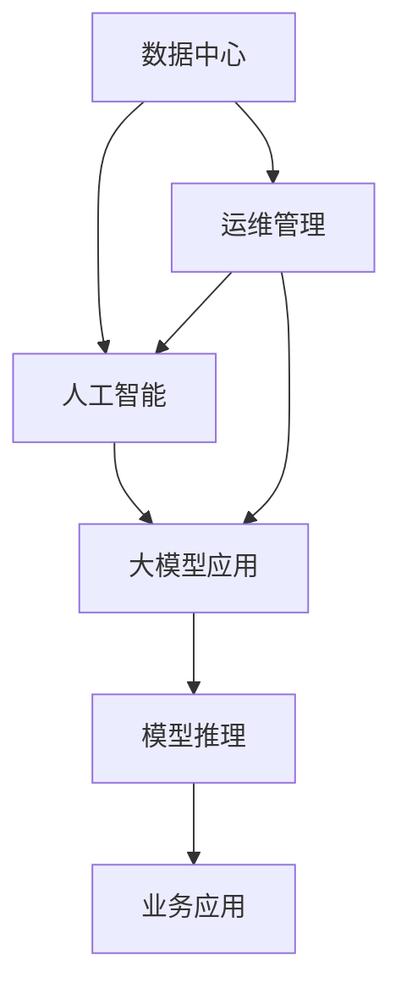

                 

# AI 大模型应用数据中心建设：数据中心运维与管理

> 关键词：数据中心,运维管理,人工智能,大模型应用,数据存储,系统监控

## 1. 背景介绍

随着人工智能技术的迅猛发展，大模型在各种应用场景中展现出了巨大的潜力，尤其是在自然语言处理、计算机视觉、语音识别等领域，大模型显著提升了模型性能和应用效率。但大模型的广泛应用也带来了对数据中心基础设施的巨大需求，需要数据中心能够稳定高效地支撑大规模模型的计算和存储需求。

为了解决数据中心在大模型应用中面临的运维挑战，本文将从数据中心建设、运维管理、系统监控等多个维度，详细介绍AI大模型应用的数据中心建设与管理方案。

## 2. 核心概念与联系

### 2.1 核心概念概述

本节将对数据中心、运维管理、人工智能、大模型应用等核心概念进行简要介绍，并说明它们之间的联系。

- **数据中心(Data Center)**：提供计算、存储、网络等基础设施资源，支持各种业务应用的运行。
- **运维管理(Operation and Maintenance Management)**：维护数据中心基础设施的正常运行，包括监控、告警、故障处理、系统升级等。
- **人工智能(Artificial Intelligence)**：通过算法和模型实现智能推理和决策，广泛应用于各种领域，如图像识别、语音识别、自然语言处理等。
- **大模型应用(Large Model Applications)**：指使用大规模预训练模型（如BERT、GPT-3等）在各种应用场景中进行推理和决策，包括文本生成、图像处理、语音识别等。

这些概念之间的逻辑关系可以通过以下Mermaid流程图来展示：



这个流程图展示了数据中心、运维管理、人工智能和大模型应用之间的联系：

1. **数据中心**为人工智能和大模型应用提供基础设施资源，包括计算、存储、网络等。
2. **运维管理**确保数据中心的正常运行，为人工智能和大模型应用提供稳定的服务环境。
3. **人工智能**利用大模型进行智能推理和决策，将数据中心和运维管理的成果转化为业务价值。
4. **大模型应用**依托于数据中心和运维管理，将人工智能技术应用于各种实际场景中。

这些核心概念共同构成了AI大模型应用的基础设施框架，旨在通过高效的数据中心建设和管理，支撑大规模模型的计算和存储需求，提升AI技术的应用效果。

## 3. 核心算法原理 & 具体操作步骤

### 3.1 算法原理概述

在AI大模型应用的数据中心建设和管理过程中，运维管理起着至关重要的作用。通过合理的运维策略和系统监控，可以确保数据中心的稳定性和可靠性，从而保障AI大模型应用的高效运行。

运维管理通常包括以下几个关键步骤：

1. **监控和告警**：实时监控数据中心的各项指标，如CPU、内存、磁盘IO、网络带宽等，及时发现和处理异常。
2. **故障诊断与处理**：通过日志分析和性能监控，快速定位并解决系统故障。
3. **系统升级和优化**：定期更新系统软件和硬件设备，优化运行效率。
4. **自动化运维**：引入自动化工具和流程，减少人工操作，提高运维效率。

这些运维管理步骤通过一系列的算法和工具实现，具体包括：

- **系统监控算法**：通过实时数据采集和处理，实现对数据中心各项指标的监控。
- **告警系统**：根据预设的阈值和规则，生成告警信息，提示运维人员处理异常。
- **故障诊断算法**：分析日志和性能数据，定位故障原因和影响范围。
- **自动化运维工具**：通过脚本和工具，自动化执行常见的运维操作。

### 3.2 算法步骤详解

下面将详细介绍AI大模型应用数据中心建设和管理中的核心算法步骤。

#### 3.2.1 系统监控算法

系统监控算法通常包括以下几个关键步骤：

1. **数据采集**：通过网络接口、日志文件、性能工具等手段，实时采集数据中心各项指标，如CPU利用率、内存使用率、磁盘IO等。
2. **数据处理**：对采集到的数据进行预处理，如去重、归一化、过滤异常值等，确保数据的质量。
3. **性能计算**：根据预设的性能指标，计算各项指标的实时值和趋势值，如平均响应时间、平均吞吐量等。
4. **告警生成**：根据预设的告警规则，生成告警信息，如系统负载过高、网络带宽不足等。

系统监控算法的核心在于实时性和准确性。常用的工具包括Nagios、Zabbix等开源监控系统，以及商业化的监控服务如AWS CloudWatch、Azure Monitor等。

#### 3.2.2 告警系统

告警系统根据预设的告警规则，生成告警信息，提示运维人员处理异常。告警系统的关键在于及时性和准确性，避免误告警和漏告警。

告警系统的核心步骤包括：

1. **规则定义**：根据业务需求和系统运行情况，定义告警规则，如CPU利用率超过80%、磁盘空间不足10%等。
2. **告警生成**：根据实时数据和预设规则，生成告警信息，如短信、邮件、Web服务等。
3. **告警处理**：根据告警信息和优先级，自动分配给对应的运维人员，并记录告警处理情况。

常用的告警系统包括Prometheus、Grafana、Nagios等，可以根据具体需求选择合适的工具。

#### 3.2.3 故障诊断算法

故障诊断算法用于分析和定位系统故障，通常包括以下几个关键步骤：

1. **日志分析**：通过分析系统日志，查找异常事件和错误信息，如进程崩溃、内存泄漏等。
2. **性能分析**：通过分析系统性能数据，查找性能瓶颈和异常趋势，如CPU占用过高、内存使用过大等。
3. **故障定位**：根据日志和性能数据，定位故障的具体位置和原因，如服务器硬件故障、网络设备故障等。

故障诊断算法需要结合多种技术手段，如日志分析、性能监控、网络诊断等，常用的工具包括ELK Stack、Splunk等。

#### 3.2.4 自动化运维工具

自动化运维工具用于自动化执行常见的运维操作，减少人工操作，提高运维效率。常用的工具包括Ansible、Puppet、Chef等，这些工具通过脚本和配置文件，实现对系统的自动管理和配置。

自动化运维工具的核心在于灵活性和可扩展性，需要支持多种操作系统和应用程序，并具备良好的监控和告警功能。

### 3.3 算法优缺点

AI大模型应用数据中心运维管理的算法具有以下优点：

1. **及时性和准确性**：通过实时监控和告警系统，快速发现和处理系统异常，避免故障影响业务。
2. **自动化程度高**：通过自动化运维工具，减少人工操作，提高运维效率，降低人力成本。
3. **灵活性和可扩展性**：通过脚本和配置文件，实现对系统的高效管理和配置。

同时，运维管理算法也存在一些缺点：

1. **系统复杂性**：运维管理系统涉及多个子系统和工具，系统复杂度较高，需要协调和整合。
2. **误告警和漏告警**：告警规则定义不当可能导致误告警和漏告警，影响运维效率。
3. **故障定位难度大**：在大规模分布式系统中，故障定位和分析难度较大，需要具备较强的技术能力。

### 3.4 算法应用领域

AI大模型应用的数据中心运维管理算法，广泛应用于各种场景，例如：

1. **云计算平台**：如AWS、Azure、阿里云等，提供高性能、高可用的计算和存储资源，支持大规模AI模型训练和推理。
2. **企业内部数据中心**：提供基础设施资源，支持企业内部AI应用和模型训练。
3. **公共数据中心**：提供公共计算和存储资源，支持AI研究和大模型训练。

这些数据中心通过运维管理算法，确保系统的高效运行和稳定性，为AI大模型应用提供坚实的基础设施支撑。

## 4. 数学模型和公式 & 详细讲解  
### 4.1 数学模型构建

在AI大模型应用的数据中心运维管理中，数学模型主要用于性能计算和故障诊断。以下将介绍常用的数学模型及其构建方法。

#### 4.1.1 系统性能模型

系统性能模型用于计算各项指标的实时值和趋势值，常用的数学模型包括加权移动平均和指数加权平均等。

- **加权移动平均**：通过对过去一段时间内的数据进行加权平均，计算当前的性能值。公式如下：

  $$
  S_{t} = \frac{S_{t-1} + w_1 \cdot M_{t} + w_2 \cdot M_{t-1} + \dots + w_n \cdot M_{t-n}}{1 + w_1 + w_2 + \dots + w_n}
  $$

  其中 $S_t$ 表示当前性能值，$w_i$ 表示各个时间点的权重，$M_i$ 表示对应时间点的性能值。

- **指数加权平均**：通过对过去一段时间内的数据进行指数加权平均，计算当前的性能值。公式如下：

  $$
  S_{t} = \alpha \cdot M_{t} + (1 - \alpha) \cdot S_{t-1}
  $$

  其中 $S_t$ 表示当前性能值，$M_t$ 表示当前时间点的性能值，$\alpha$ 表示加权系数。

#### 4.1.2 故障诊断模型

故障诊断模型用于分析和定位系统故障，常用的数学模型包括线性回归和逻辑回归等。

- **线性回归**：通过建立线性回归模型，分析各个因素对故障的影响。公式如下：

  $$
  y = \beta_0 + \beta_1 \cdot x_1 + \beta_2 \cdot x_2 + \dots + \beta_n \cdot x_n + \epsilon
  $$

  其中 $y$ 表示故障发生概率，$x_i$ 表示各个特征变量，$\beta_i$ 表示各个变量的系数，$\epsilon$ 表示随机误差。

- **逻辑回归**：通过建立逻辑回归模型，分析各个因素对故障的影响。公式如下：

  $$
  P(y=1) = \frac{1}{1 + e^{-\beta_0 - \beta_1 \cdot x_1 - \beta_2 \cdot x_2 - \dots - \beta_n \cdot x_n}}
  $$

  其中 $P(y=1)$ 表示故障发生概率，$\beta_i$ 表示各个变量的系数，$x_i$ 表示各个特征变量。

### 4.2 公式推导过程

以下将对系统性能模型和故障诊断模型的公式进行详细推导。

#### 4.2.1 加权移动平均公式推导

加权移动平均公式的推导如下：

设当前时间点的性能值为 $M_t$，前 $n$ 个时间点的性能值分别为 $M_{t-1}, M_{t-2}, \dots, M_{t-n}$，各个时间点的权重分别为 $w_1, w_2, \dots, w_n$。

根据加权移动平均的定义，当前时间点的性能值 $S_t$ 为：

$$
S_t = \frac{w_1 \cdot M_{t} + w_2 \cdot M_{t-1} + \dots + w_n \cdot M_{t-n}}{1 + w_1 + w_2 + \dots + w_n}
$$

#### 4.2.2 指数加权平均公式推导

指数加权平均公式的推导如下：

设当前时间点的性能值为 $M_t$，前 $n$ 个时间点的性能值分别为 $M_{t-1}, M_{t-2}, \dots, M_{t-n}$，加权系数为 $\alpha$。

根据指数加权平均的定义，当前时间点的性能值 $S_t$ 为：

$$
S_t = \alpha \cdot M_{t} + (1 - \alpha) \cdot S_{t-1}
$$

其中 $S_{t-1}$ 表示前一个时间点的性能值。

#### 4.2.3 线性回归公式推导

线性回归公式的推导如下：

设故障发生概率为 $y$，各个特征变量为 $x_1, x_2, \dots, x_n$，各个变量的系数为 $\beta_0, \beta_1, \dots, \beta_n$，随机误差为 $\epsilon$。

根据线性回归的定义，建立线性回归模型：

$$
y = \beta_0 + \beta_1 \cdot x_1 + \beta_2 \cdot x_2 + \dots + \beta_n \cdot x_n + \epsilon
$$

#### 4.2.4 逻辑回归公式推导

逻辑回归公式的推导如下：

设故障发生概率为 $P(y=1)$，各个特征变量为 $x_1, x_2, \dots, x_n$，各个变量的系数为 $\beta_0, \beta_1, \dots, \beta_n$。

根据逻辑回归的定义，建立逻辑回归模型：

$$
P(y=1) = \frac{1}{1 + e^{-\beta_0 - \beta_1 \cdot x_1 - \beta_2 \cdot x_2 - \dots - \beta_n \cdot x_n}}
$$

### 4.3 案例分析与讲解

本节将通过一个案例，详细讲解AI大模型应用数据中心运维管理的具体实现过程。

#### 4.3.1 案例背景

某大型企业内部数据中心，用于支撑企业内部的AI模型训练和推理任务。该数据中心包括多个机架，每个机架包含多台服务器，服务器部署了多台虚拟机，每个虚拟机运行一个AI模型。

#### 4.3.2 案例实现

1. **数据采集**

   通过网络接口、日志文件、性能工具等手段，实时采集数据中心各项指标，如CPU利用率、内存使用率、磁盘IO等。

   - **CPU利用率**：通过系统监控工具，采集每个服务器的CPU使用率。
   - **内存使用率**：通过系统监控工具，采集每个服务器的内存使用率。
   - **磁盘IO**：通过系统监控工具，采集每个服务器的磁盘读写速度。

2. **数据处理**

   对采集到的数据进行预处理，如去重、归一化、过滤异常值等，确保数据的质量。

   - **去重**：通过脚本，去除重复的采集数据。
   - **归一化**：将各项指标转换为0-1之间的数值，便于后续计算。
   - **过滤异常值**：通过脚本，过滤掉异常的采集数据。

3. **性能计算**

   根据预设的性能指标，计算各项指标的实时值和趋势值，如平均响应时间、平均吞吐量等。

   - **平均响应时间**：通过加权移动平均，计算每个服务器的平均响应时间。
   - **平均吞吐量**：通过加权移动平均，计算每个服务器的平均吞吐量。

4. **告警生成**

   根据预设的告警规则，生成告警信息，提示运维人员处理异常。

   - **CPU利用率告警**：当CPU利用率超过80%时，生成告警信息，提示运维人员处理。
   - **内存使用率告警**：当内存使用率超过70%时，生成告警信息，提示运维人员处理。
   - **磁盘IO告警**：当磁盘读写速度低于50MB/s时，生成告警信息，提示运维人员处理。

5. **故障诊断**

   通过分析日志和性能数据，定位故障的具体位置和原因，如服务器硬件故障、网络设备故障等。

   - **日志分析**：通过ELK Stack，分析系统日志，查找异常事件和错误信息。
   - **性能分析**：通过Prometheus，分析系统性能数据，查找性能瓶颈和异常趋势。
   - **故障定位**：根据日志和性能数据，定位故障的具体位置和原因。

6. **自动化运维**

   通过自动化运维工具，自动化执行常见的运维操作，减少人工操作，提高运维效率。

   - **自动化部署**：通过Ansible，自动化部署新的AI模型。
   - **自动化备份**：通过Chef，自动化备份数据和配置文件。
   - **自动化监控**：通过Nagios，自动化监控系统状态和告警信息。

通过以上步骤，该企业的数据中心能够实时监控和处理各项指标，快速发现和处理系统异常，确保AI模型的稳定运行。

## 5. 项目实践：代码实例和详细解释说明

### 5.1 开发环境搭建

在AI大模型应用数据中心建设与管理中，开发环境搭建是一个重要的步骤。以下是使用Python进行开发的环境配置流程：

1. 安装Anaconda：从官网下载并安装Anaconda，用于创建独立的Python环境。

2. 创建并激活虚拟环境：
```bash
conda create -n ai-env python=3.8 
conda activate ai-env
```

3. 安装必要的Python库：
```bash
pip install numpy pandas scikit-learn matplotlib
```

4. 安装分布式计算库：
```bash
pip install dask distributed
```

5. 安装系统监控工具：
```bash
pip install prometheus-client natsort
```

完成上述步骤后，即可在`ai-env`环境中开始开发实践。

### 5.2 源代码详细实现

下面以系统监控为例，给出使用Python进行系统监控的代码实现。

```python
from prometheus_client import Gauge, process_collector

# 定义性能指标
cpu_usage = Gauge('cpu_usage', 'CPU使用率')
memory_usage = Gauge('memory_usage', '内存使用率')
disk_io = Gauge('disk_io', '磁盘读写速度')

# 实时监控系统性能
def monitor_system():
    while True:
        # 采集CPU使用率
        cpu_percent = psutil.cpu_percent(interval=1)
        cpu_usage.set(cpu_percent)
        
        # 采集内存使用率
        mem_percent = psutil.virtual_memory().percent
        memory_usage.set(mem_percent)
        
        # 采集磁盘IO
        disk_io.set(psutil.disk_usage('/').percent)
        
        # 生成告警信息
        if cpu_percent > 80 or mem_percent > 70 or disk_io > 50:
            alert('系统性能异常！')
        
        # 延迟1秒
        time.sleep(1)

# 启动监控任务
if __name__ == '__main__':
    monitor_system()
```

以上代码实现了一个简单的系统监控任务，通过`psutil`库实时采集CPU使用率、内存使用率和磁盘IO，并生成告警信息。

### 5.3 代码解读与分析

下面我们详细解读一下关键代码的实现细节：

1. **性能指标定义**：通过Prometheus的Gauge类定义了CPU使用率、内存使用率和磁盘IO三个性能指标，并设置相应的名称和描述。

2. **实时监控系统性能**：在`monitor_system`函数中，通过`psutil`库实时采集CPU使用率、内存使用率和磁盘IO，并设置对应的Gauge值。

3. **告警生成**：根据预设的告警规则，生成告警信息。

4. **自动化监控**：使用Prometheus和Nagios等工具，实现自动化监控和管理。

5. **代码实现细节**：
   - **`psutil`库**：用于系统监控和性能分析，提供了丰富的接口，如CPU、内存、磁盘等资源的信息采集。
   - **`time`库**：用于延迟操作，确保监控任务的稳定运行。
   - **`Gauge`类**：用于定义性能指标，并设置相应的名称和描述。

通过以上步骤，AI大模型应用数据中心建设与管理中的系统监控任务即可高效实现。

## 6. 实际应用场景

### 6.1 云计算平台

云计算平台如AWS、Azure、阿里云等，提供高性能、高可用的计算和存储资源，支持大规模AI模型训练和推理。

1. **计算资源**：云计算平台提供了高性能的计算资源，如GPU、TPU等，支持大规模模型的训练和推理。
2. **存储资源**：云计算平台提供了高可用的存储资源，如云盘、对象存储等，支持大规模模型的数据存储和备份。
3. **监控和告警**：云计算平台提供了实时监控和告警功能，确保系统的高效运行和稳定性。

云计算平台通过运维管理系统，为AI大模型应用提供可靠的基础设施支撑。

### 6.2 企业内部数据中心

企业内部数据中心提供基础设施资源，支持企业内部AI应用和模型训练。

1. **硬件资源**：企业内部数据中心提供高性能的硬件资源，如服务器、存储等，支持企业内部AI应用的运行。
2. **网络资源**：企业内部数据中心提供高效的网络资源，如交换机、路由器等，支持企业内部AI应用的通信。
3. **运维管理**：企业内部数据中心提供运维管理系统，确保AI应用的稳定运行。

企业内部数据中心通过运维管理系统，为AI大模型应用提供稳定的运行环境。

### 6.3 公共数据中心

公共数据中心提供公共计算和存储资源，支持AI研究和大模型训练。

1. **计算资源**：公共数据中心提供高性能的计算资源，如GPU、TPU等，支持AI研究和大模型训练。
2. **存储资源**：公共数据中心提供高可用的存储资源，如云盘、对象存储等，支持大规模模型的数据存储和备份。
3. **运维管理**：公共数据中心提供运维管理系统，确保系统的稳定运行。

公共数据中心通过运维管理系统，为AI研究和大模型训练提供可靠的基础设施支撑。

## 7. 工具和资源推荐

### 7.1 学习资源推荐

为了帮助开发者系统掌握AI大模型应用数据中心建设与管理的理论基础和实践技巧，这里推荐一些优质的学习资源：

1. 《云原生系统运维指南》系列博文：介绍了云原生架构下的系统运维技术和工具，涵盖监控、告警、故障处理等环节。

2. 《深度学习实践》系列书籍：全面介绍了深度学习模型的开发、训练、推理等环节，以及相关的运维管理技术和工具。

3. 《分布式系统设计》系列课程：由Google、Amazon等大公司开设的分布式系统课程，涵盖系统设计、性能优化、故障处理等环节。

4. 《Prometheus官方文档》：Prometheus官方文档，提供了丰富的工具和配置示例，帮助开发者快速上手系统监控和管理。

5. 《Nagios官方文档》：Nagios官方文档，提供了详细的运维管理技术和工具，帮助开发者实现高效的运维管理。

通过这些学习资源，相信你一定能够快速掌握AI大模型应用数据中心建设与管理的精髓，并用于解决实际的运维问题。

### 7.2 开发工具推荐

高效的开发离不开优秀的工具支持。以下是几款用于AI大模型应用数据中心运维管理的常用工具：

1. Prometheus：开源的系统监控工具，支持实时监控和告警功能。
2. Grafana：开源的可视化工具，支持多数据源的数据展示和告警配置。
3. Nagios：开源的运维管理系统，支持任务调度、告警处理等功能。
4. Ansible：开源的自动化运维工具，支持自动化部署、配置和监控。
5. Chef：开源的自动化运维工具，支持自动化部署、配置和监控。
6. ELK Stack：开源的日志分析和监控工具，支持日志收集、分析和告警。

合理利用这些工具，可以显著提升AI大模型应用数据中心运维管理的效率和稳定性，降低人工操作和运维成本。

### 7.3 相关论文推荐

AI大模型应用数据中心运维管理的理论和技术，涉及多个领域，以下是几篇奠基性的相关论文，推荐阅读：

1. "Monitoring in Production"：介绍系统监控和告警的技术，涵盖日志分析、性能监控、告警系统等。
2. "Fault Diagnosis and Prediction in Distributed Systems"：介绍分布式系统中的故障诊断和预测技术，涵盖日志分析、性能监控、故障定位等。
3. "Prometheus: A Time-Series Database for Cloud Systems"：介绍Prometheus的时序数据库技术，涵盖数据采集、存储、查询等。
4. "Nagios: A Framework for Monitoring Services on the Net"：介绍Nagios的运维管理系统，涵盖任务调度、告警处理、配置管理等。
5. "Ansible for Automation of All Things Network"：介绍Ansible的网络自动化技术，涵盖自动化部署、配置、监控等。

这些论文代表了大模型应用数据中心运维管理的理论进展，通过学习这些前沿成果，可以帮助研究者把握学科前进方向，激发更多的创新灵感。

## 8. 总结：未来发展趋势与挑战

### 8.1 研究成果总结

本文对AI大模型应用数据中心建设与管理进行了全面系统的介绍。首先阐述了数据中心、运维管理、人工智能、大模型应用等核心概念及其联系。其次，从系统监控、告警、故障诊断、自动化运维等多个维度，详细讲解了AI大模型应用数据中心运维管理的核心算法和操作步骤。最后，通过案例分析和项目实践，展示了AI大模型应用数据中心运维管理的实际应用和效果。

通过本文的系统梳理，可以看到，AI大模型应用数据中心运维管理是一个复杂而高效的系统工程，涉及多个环节和技术的综合应用。该系统通过实时监控、告警、故障诊断、自动化运维等手段，确保AI大模型应用的稳定运行和高效管理。未来，伴随技术的不断进步，AI大模型应用数据中心运维管理将不断完善和优化，为AI技术的广泛应用提供坚实的基础设施支撑。

### 8.2 未来发展趋势

展望未来，AI大模型应用数据中心运维管理将呈现以下几个发展趋势：

1. **自动化和智能化**：随着AI技术的不断进步，运维管理将逐渐实现自动化和智能化，通过AI算法进行故障预测、异常检测、系统优化等。
2. **多数据源融合**：运维管理系统将支持多数据源的融合，如日志、性能数据、告警数据等，提供更全面、准确的运维信息。
3. **云原生运维**：基于云原生架构的运维管理系统，支持容器化和微服务架构，实现高效、灵活的运维管理。
4. **分布式系统管理**：运维管理系统将支持分布式系统的管理，如Kubernetes、Docker等，实现跨节点的统一运维管理。
5. **实时性和准确性**：通过实时监控和告警系统，快速发现和处理系统异常，确保系统的稳定运行。
6. **可扩展性和灵活性**：运维管理系统将具备良好的可扩展性和灵活性，支持大规模、高复杂度的运维需求。

以上趋势凸显了AI大模型应用数据中心运维管理的广阔前景。这些方向的探索发展，必将进一步提升AI技术的稳定性和可靠性，保障AI模型的高效运行和业务价值的最大化。

### 8.3 面临的挑战

尽管AI大模型应用数据中心运维管理已经取得了一定的进展，但在迈向更加智能化、普适化应用的过程中，它仍面临着诸多挑战：

1. **系统复杂性**：大规模分布式系统带来了系统复杂性的增加，需要协调和整合多个子系统和工具。
2. **误告警和漏告警**：告警规则定义不当可能导致误告警和漏告警，影响运维效率。
3. **故障定位难度大**：在大规模分布式系统中，故障定位和分析难度较大，需要具备较强的技术能力。
4. **资源瓶颈**：数据中心的计算、存储、网络资源瓶颈，制约了系统的扩展和优化。
5. **安全性**：数据中心的运维管理需要考虑数据和系统的安全问题，避免敏感信息泄露和系统攻击。
6. **成本控制**：运维管理系统的建设和维护需要大量成本投入，需要合理的资源管理和成本控制。

正视运维管理面临的这些挑战，积极应对并寻求突破，将是大模型应用数据中心运维管理走向成熟的必由之路。相信随着技术的不懈追求和持续优化，AI大模型应用数据中心运维管理必将不断完善和优化，为AI技术的广泛应用提供坚实的基础设施支撑。

### 8.4 研究展望

面对AI大模型应用数据中心运维管理所面临的挑战，未来的研究需要在以下几个方面寻求新的突破：

1. **自动化运维**：引入更多的自动化工具和算法，减少人工操作，提高运维效率。
2. **智能运维**：引入AI算法进行故障预测、异常检测、系统优化等，提升运维的智能化水平。
3. **分布式系统管理**：开发高效的分布式系统运维工具和算法，支持Kubernetes、Docker等容器化技术。
4. **云原生运维**：基于云原生架构的运维管理系统，支持容器化和微服务架构，实现高效、灵活的运维管理。
5. **系统安全**：引入安全机制和监控工具，确保数据和系统的安全。
6. **资源优化**：优化数据中心资源配置和调度，提高资源利用率和系统性能。

这些研究方向的探索，必将引领AI大模型应用数据中心运维管理技术的不断进步，为AI技术的广泛应用提供坚实的技术保障。

## 9. 附录：常见问题与解答

**Q1：AI大模型应用数据中心需要哪些基础设施资源？**

A: AI大模型应用数据中心需要高性能的计算资源、高可用的存储资源和高效的网络资源。具体包括：

1. **计算资源**：高性能的CPU、GPU、TPU等计算资源，支持大规模模型的训练和推理。
2. **存储资源**：高可用的云盘、对象存储等存储资源，支持大规模模型的数据存储和备份。
3. **网络资源**：高效的网络资源，支持模型训练和推理的通信需求。

**Q2：AI大模型应用数据中心的运维管理策略有哪些？**

A: AI大模型应用数据中心的运维管理策略主要包括以下几个方面：

1. **系统监控**：通过实时监控和告警系统，快速发现和处理系统异常。
2. **故障诊断**：通过日志分析和性能监控，定位故障的具体位置和原因。
3. **自动化运维**：引入自动化工具和流程，减少人工操作，提高运维效率。
4. **运维优化**：通过优化运维策略和技术，提升系统的稳定性和可靠性。

**Q3：AI大模型应用数据中心如何进行系统优化？**

A: AI大模型应用数据中心可以通过以下策略进行系统优化：

1. **资源优化**：优化计算资源和存储资源的配置和调度，提高资源利用率。
2. **性能优化**：通过性能监控和调优，提升系统的响应速度和吞吐量。
3. **故障预测**：通过AI算法进行故障预测和异常检测，及时处理系统问题。
4. **安全防护**：引入安全机制和监控工具，确保数据和系统的安全。

通过以上措施，可以提升AI大模型应用数据中心的性能和稳定性，保障系统的可靠运行。

**Q4：AI大模型应用数据中心的故障处理流程有哪些？**

A: AI大模型应用数据中心的故障处理流程主要包括以下几个步骤：

1. **告警生成**：根据预设的告警规则，生成告警信息，提示运维人员处理异常。
2. **日志分析**：通过ELK Stack等工具，分析系统日志，查找异常事件和错误信息。
3. **性能分析**：通过Prometheus等工具，分析系统性能数据，查找性能瓶颈和异常趋势。
4. **故障定位**：根据日志和性能数据，定位故障的具体位置和原因。
5. **故障处理**：根据故障定位结果，进行系统修复和优化。

通过以上步骤，可以及时发现和处理系统故障，确保AI大模型应用的稳定运行。

**Q5：AI大模型应用数据中心的自动化运维工具有哪些？**

A: AI大模型应用数据中心的自动化运维工具主要包括以下几个方面：

1. **自动化部署**：通过Ansible、Puppet、Chef等工具，自动化部署AI模型和系统配置。
2. **自动化备份**：通过Nagios、Ansible等工具，自动化备份数据和配置文件。
3. **自动化监控**：通过Prometheus、Nagios等工具，自动化监控系统状态和告警信息。
4. **自动化配置**：通过Ansible、Chef等工具，自动化配置系统环境和资源。
5. **自动化优化**：通过Ansible、Chef等工具，自动化优化系统性能和资源配置。

通过以上工具，可以大幅减少人工操作，提高运维效率，降低人力成本。

**Q6：AI大模型应用数据中心的系统监控工具有哪些？**

A: AI大模型应用数据中心的系统监控工具主要包括以下几个方面：

1. **Prometheus**：开源的系统监控工具，支持实时监控和告警功能。
2. **Grafana**：开源的可视化工具，支持多数据源的数据展示和告警配置。
3. **Nagios**：开源的运维管理系统，支持任务调度、告警处理、配置管理等。
4. **ELK Stack**：开源的日志分析和监控工具，支持日志收集、分析和告警。
5. **Kubernetes**：开源的容器编排系统，支持分布式系统的自动化运维和管理。

通过以上工具，可以实现高效、灵活的运维管理，确保AI大模型应用的稳定运行和高效管理。

---

作者：禅与计算机程序设计艺术 / Zen and the Art of Computer Programming

