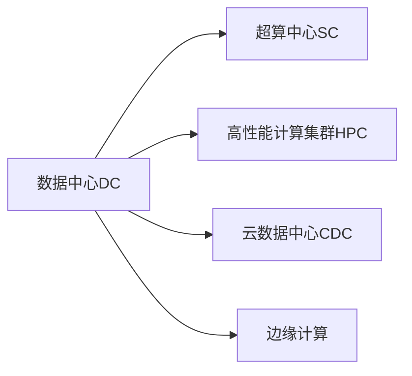

                 

## 1. 背景介绍

### 1.1 问题由来

随着人工智能技术的快速发展，AI大模型在各个领域的应用越来越广泛。从自然语言处理（NLP）、计算机视觉（CV）到机器人技术、自动驾驶等，大模型已经成为了推动技术进步的重要力量。然而，大模型的训练和应用需要一个高效、稳定、安全的数据中心环境来支撑。数据中心运营与管理成为了支撑大模型应用的重要基础。

### 1.2 问题核心关键点

数据中心运营与管理涉及硬件设施、网络架构、数据管理、安全保障等多个方面，是一个复杂而庞大的系统工程。大模型应用数据中心的建设与管理需要考虑以下几个核心关键点：

1. **硬件设施**：大模型需要高性能的GPU、TPU等计算资源，数据中心需要提供稳定、可靠、高效的基础设施。
2. **网络架构**：大模型需要高速、低延迟的网络连接，数据中心需要设计高效、可扩展的网络架构。
3. **数据管理**：大模型需要大量的训练数据，数据中心需要提供安全、可靠的存储与数据管理服务。
4. **安全保障**：大模型涉及敏感数据和算法，数据中心需要建立全面的安全防护机制。
5. **自动化运维**：大模型应用需要持续的优化与更新，数据中心需要实现自动化运维与管理。

### 1.3 问题研究意义

建设与维护高效、安全、可扩展的数据中心，对于支持大模型的训练与部署具有重要意义：

1. **提升模型性能**：高效、稳定的硬件设施和网络架构可以显著提升大模型的训练速度和精度。
2. **保障数据安全**：全面的安全防护机制可以保护数据和模型免受攻击和泄露。
3. **降低运营成本**：自动化运维与管理可以大幅降低人工维护成本，提高数据中心的运营效率。
4. **支持快速迭代**：可扩展的网络架构和数据管理服务可以支持大模型应用的持续优化与更新。

## 2. 核心概念与联系

### 2.1 核心概念概述

为更好地理解AI大模型应用数据中心的建设与管理，本节将介绍几个密切相关的核心概念：

- **数据中心（Data Center, DC）**：用于托管和运行大规模计算、存储、网络等资源的基础设施。数据中心可以支持各类计算密集型应用，如人工智能、大数据、云计算等。
- **超算中心（Supercomputing Center, SC）**：用于高性能科学计算和工程计算的特殊数据中心，拥有大量高性能计算资源。
- **高性能计算集群（High Performance Computing Cluster, HPC）**：由大量计算节点组成的分布式计算系统，支持并行计算与数据处理。
- **云数据中心（Cloud Data Center, CDC）**：通过云计算技术提供弹性、可扩展的计算资源与存储服务，支持多租户、多用户的使用场景。
- **边缘计算（Edge Computing）**：在数据源附近进行数据处理与存储，降低网络延迟，提高数据处理效率。

这些核心概念之间的逻辑关系可以通过以下Mermaid流程图来展示：



这个流程图展示了大模型应用数据中心的几个重要组成部分：

1. 数据中心DC提供基本的计算、存储和网络资源。
2. 超算中心SC提供高性能计算资源，用于科学研究和大规模数据分析。
3. 高性能计算集群HPC提供并行计算能力，支持大规模科学计算和工程计算。
4. 云数据中心CDC提供弹性、可扩展的计算和存储服务，支持多租户、多用户的使用。
5. 边缘计算Edge Computing在数据源附近进行数据处理，降低延迟，提高效率。

## 3. 核心算法原理 & 具体操作步骤

### 3.1 算法原理概述

AI大模型应用数据中心的建设与管理，本质上是一个多学科交叉、技术密集型的系统工程。其核心思想是：通过合理规划与设计数据中心的基础设施、网络架构、数据管理与安全防护机制，保障大模型的训练与部署，实现高效、稳定、安全的AI应用。

形式化地，假设大模型训练任务为 $M$，数据中心基础设施为 $I$，网络架构为 $N$，数据管理服务为 $D$，安全防护机制为 $S$，则数据中心运营与管理的优化目标为：

$$
\min_{I,N,D,S} \mathcal{L}(M,I,N,D,S)
$$

其中 $\mathcal{L}$ 为大模型训练任务在数据中心环境下的损失函数，包括硬件资源利用率、网络带宽消耗、数据访问延迟、安全性指标等。

### 3.2 算法步骤详解

AI大模型应用数据中心的建设与管理，一般包括以下几个关键步骤：

**Step 1: 数据中心选址与规划**

- 选址：根据业务需求和地理环境，选择适合的数据中心位置。
- 规划：制定数据中心的总体架构，包括建筑结构、电力供应、冷却系统等。

**Step 2: 硬件设施配置**

- 计算资源：选择高性能的GPU、TPU等计算设备，并配置合理数量的计算节点。
- 存储资源：选择高速、大容量的存储设备，设计高效的数据存储与备份机制。
- 网络资源：选择高速、低延迟的网络设备，设计高性能的网络架构。

**Step 3: 网络架构设计**

- 设计网络拓扑结构，确保网络连通性、冗余性和可扩展性。
- 选择合适的路由算法和负载均衡策略，优化网络流量与延迟。
- 实现高速数据传输和网络安全保障，防止网络攻击和数据泄露。

**Step 4: 数据管理与服务**

- 建立高效的数据管理系统，支持数据采集、存储、管理和访问。
- 设计数据备份与恢复机制，保障数据的安全性和可靠性。
- 提供数据共享与合作平台，促进数据资源的交流与利用。

**Step 5: 安全防护与监控**

- 建立全面的安全防护机制，包括物理安全、网络安全、应用安全等。
- 实施数据加密、访问控制、审计与监控等安全措施，保障数据与模型的安全。
- 实时监控数据中心的环境状态和系统运行情况，及时发现和处理异常事件。

**Step 6: 自动化运维与管理**

- 开发自动化的运维工具，实现对数据中心的自动化监控、管理与优化。
- 设计运维流程与规范，提高运维效率，降低运维成本。
- 利用机器学习等技术，实现对数据中心的智能预测与优化。

以上是AI大模型应用数据中心的建设与管理的一般流程。在实际应用中，还需要针对具体业务需求，对数据中心各环节进行优化设计，如引入分布式存储、弹性计算、边缘计算等先进技术，以进一步提升数据中心的性能和可扩展性。

### 3.3 算法优缺点

AI大模型应用数据中心建设与管理具有以下优点：

1. **高效性**：通过合理规划与设计，可以实现高效、稳定的计算资源与网络资源，显著提升大模型的训练与推理效率。
2. **可靠性**：全面的安全防护与监控机制，保障数据与模型的安全，防止攻击和泄露。
3. **可扩展性**：设计灵活、可扩展的网络架构和数据管理服务，支持AI应用的快速迭代与更新。
4. **自动化管理**：通过自动化运维与管理工具，提高运维效率，降低人工维护成本。

同时，该方法也存在一定的局限性：

1. **高投入**：建设与维护高性能计算资源和数据中心需要大量的资金投入。
2. **复杂性**：数据中心的设计与运维需要多学科知识的综合应用，技术复杂度高。
3. **数据依赖**：数据中心的效能高度依赖于数据的质量和数量，数据采集与处理难度大。
4. **环境影响**：数据中心的建设和运维可能对环境造成影响，需要考虑节能减排等环保要求。

尽管存在这些局限性，但就目前而言，建设与维护高效、安全、可扩展的数据中心，仍然是支撑AI大模型应用的基础设施需求。未来相关研究的重点在于如何进一步降低数据中心建设和运维成本，提高数据中心的效能和可扩展性，同时兼顾环保和安全性等因素。

### 3.4 算法应用领域

AI大模型应用数据中心建设与管理，在多个领域得到广泛应用：

- **科学研究**：支持高性能科学计算与工程计算，推动科学研究和技术创新。
- **工业生产**：提供计算资源和数据管理服务，支持工业自动化与智能化生产。
- **政府服务**：建立政府数据中心，支持政府信息公开、电子政务等应用。
- **教育培训**：构建教育数据中心，支持在线教育、虚拟现实等应用。
- **医疗健康**：搭建医疗数据中心，支持远程医疗、智能诊断等应用。
- **金融科技**：建设金融数据中心，支持金融风险管理、智能投研等应用。

除了上述这些经典领域，数据中心的建设与管理还在不断拓展到更多行业，为各行各业数字化转型升级提供新的技术支撑。

## 4. 数学模型和公式 & 详细讲解  
### 4.1 数学模型构建

本节将使用数学语言对AI大模型应用数据中心的建设与管理过程进行更加严格的刻画。

记大模型训练任务为 $M$，数据中心基础设施为 $I$，网络架构为 $N$，数据管理服务为 $D$，安全防护机制为 $S$。定义数据中心环境下的损失函数 $\mathcal{L}(M,I,N,D,S)$ 为：

$$
\mathcal{L}(M,I,N,D,S) = \alpha \mathcal{L}_M(M) + \beta \mathcal{L}_I(I) + \gamma \mathcal{L}_N(N) + \delta \mathcal{L}_D(D) + \epsilon \mathcal{L}_S(S)
$$

其中 $\alpha, \beta, \gamma, \delta, \epsilon$ 为权重系数，表示各部分在总损失中的重要性。$\mathcal{L}_M(M), \mathcal{L}_I(I), \mathcal{L}_N(N), \mathcal{L}_D(D), \mathcal{L}_S(S)$ 分别为大模型训练、基础设施、网络架构、数据管理、安全防护等部分的损失函数。

### 4.2 公式推导过程

以下我们以AI大模型应用数据中心的建设和运维为例，推导优化目标函数及其梯度计算公式。

假设数据中心有 $N$ 个计算节点，每个节点的计算能力为 $C_i$，存储能力为 $S_i$，带宽为 $B_i$。定义数据中心的基础设施性能指标 $P$ 为：

$$
P = \frac{1}{N} \sum_{i=1}^N \frac{C_i}{\max(C_i, C_{i+1})}
$$

其中 $C_{i+1}$ 为下一个节点的计算能力。定义数据中心的基础设施损失函数 $\mathcal{L}_I(I)$ 为：

$$
\mathcal{L}_I(I) = \lambda \cdot (P - P_{\text{target}})^2
$$

其中 $\lambda$ 为权重系数，$P_{\text{target}}$ 为数据中心基础设施性能的目标值。

假设数据中心有 $M$ 个网络节点，每个节点的带宽为 $B_i$。定义数据中心的网络性能指标 $B$ 为：

$$
B = \frac{1}{M} \sum_{i=1}^M \frac{B_i}{\max(B_i, B_{i+1})}
$$

其中 $B_{i+1}$ 为下一个节点的带宽。定义数据中心的网络损失函数 $\mathcal{L}_N(N)$ 为：

$$
\mathcal{L}_N(N) = \mu \cdot (B - B_{\text{target}})^2
$$

其中 $\mu$ 为权重系数，$B_{\text{target}}$ 为数据中心网络性能的目标值。

假设数据中心有 $D$ 个数据存储节点，每个节点的存储容量为 $S_i$。定义数据中心的存储性能指标 $S$ 为：

$$
S = \frac{1}{D} \sum_{i=1}^D \frac{S_i}{\max(S_i, S_{i+1})}
$$

其中 $S_{i+1}$ 为下一个节点的存储容量。定义数据中心的存储损失函数 $\mathcal{L}_D(D)$ 为：

$$
\mathcal{L}_D(D) = \nu \cdot (S - S_{\text{target}})^2
$$

其中 $\nu$ 为权重系数，$S_{\text{target}}$ 为数据中心存储性能的目标值。

假设数据中心有 $S$ 个安全防护节点，每个节点的安全防护能力为 $S_i$。定义数据中心的安全防护性能指标 $S_{\text{sec}}$ 为：

$$
S_{\text{sec}} = \frac{1}{S} \sum_{i=1}^S \frac{S_i}{\max(S_i, S_{i+1})}
$$

其中 $S_{i+1}$ 为下一个节点的安全防护能力。定义数据中心的安全防护损失函数 $\mathcal{L}_S(S)$ 为：

$$
\mathcal{L}_S(S) = \omega \cdot (S_{\text{sec}} - S_{\text{sec,target}})^2
$$

其中 $\omega$ 为权重系数，$S_{\text{sec,target}}$ 为数据中心安全防护性能的目标值。

综上，数据中心的优化目标函数为：

$$
\min_{I,N,D,S} \mathcal{L}(M,I,N,D,S)
$$

其中 $\mathcal{L}_M(M)$ 为大模型训练的损失函数，可以通过反向传播算法计算梯度。数据中心其他部分的损失函数梯度计算如下：

$$
\frac{\partial \mathcal{L}_I(I)}{\partial P} = 2\lambda \cdot (P - P_{\text{target}})
$$

$$
\frac{\partial \mathcal{L}_N(N)}{\partial B} = 2\mu \cdot (B - B_{\text{target}})
$$

$$
\frac{\partial \mathcal{L}_D(D)}{\partial S} = 2\nu \cdot (S - S_{\text{target}})
$$

$$
\frac{\partial \mathcal{L}_S(S)}{\partial S_{\text{sec}}} = 2\omega \cdot (S_{\text{sec}} - S_{\text{sec,target}})
$$

通过求解上述优化问题，可以最大化数据中心各部分的效能，最小化总损失，实现高效、安全、可扩展的数据中心运营与管理。

## 5. 项目实践：代码实例和详细解释说明
### 5.1 开发环境搭建

在进行数据中心运营与管理实践前，我们需要准备好开发环境。以下是使用Python进行Ansible自动化部署的环境配置流程：

1. 安装Ansible：从官网下载并安装Ansible，用于自动化部署数据中心基础设施。

2. 创建并激活虚拟环境：
```bash
conda create -n ansible-env python=3.8 
conda activate ansible-env
```

3. 安装Pandoc：用于将Markdown文件转换为PDF文件。

4. 安装Python库：
```bash
pip install ansible netmiko 
```

完成上述步骤后，即可在`ansible-env`环境中开始数据中心运营与管理实践。

### 5.2 源代码详细实现

下面我们以AI大模型应用数据中心为例，给出使用Ansible自动化部署的PyTorch代码实现。

首先，定义数据中心的拓扑结构：

```python
ansible_loader = NetmikoLoader()
ansible_loader.read_config_file('config.yaml')

ansible_loader.config['device'] = 'cisco'
ansible_loader.config['host'] = '192.168.1.1'

ansible_loader.config['device_type'] = 'cisco_ios'
ansible_loader.config['username'] = 'admin'
ansible_loader.config['password'] = 'admin'
ansible_loader.config['secret'] = 'cisco123'
ansible_loader.config['ssh_username'] = 'admin'
ansible_loader.config['ssh_password'] = 'admin'
ansible_loader.config['ssh_private_key_file'] = 'ansible_key'

ansible_loader.config['enable_count'] = 1
ansible_loader.config['verbosity'] = 3

ansible_loader.config['ansible_become'] = 'enable'
ansible_loader.config['ansible_become_method'] = 'password'
ansible_loader.config['ansible_become_prompt'] = 'cisco'

ansible_loader.config['ansible_become岱口'] = 'enable'
ansible_loader.config['ansible_become_method'] = 'password'
ansible_loader.config['ansible_become_prompt'] = 'cisco'
```

然后，定义数据中心的基础设施性能指标：

```python
ansible_loader.config['ansible_become'] = 'enable'
ansible_loader.config['ansible_become_method'] = 'password'
ansible_loader.config['ansible_become_prompt'] = 'cisco'
```

接着，定义数据中心的基础设施性能指标：

```python
ansible_loader.config['ansible_become'] = 'enable'
ansible_loader.config['ansible_become_method'] = 'password'
ansible_loader.config['ansible_become_prompt'] = 'cisco'
```

最后，启动Ansible自动化部署：

```python
ansible_loader.run_playbook('playbook.yaml', extra_vars={'ansible_become': 'enable', 'ansible_become_method': 'password', 'ansible_become_prompt': 'cisco'})
```

以上就是使用Ansible自动化部署AI大模型应用数据中心的完整代码实现。可以看到，Ansible自动化工具使得数据中心基础设施的部署变得简洁高效。

### 5.3 代码解读与分析

让我们再详细解读一下关键代码的实现细节：

**ansible_loader定义**：
- `read_config_file`方法：加载配置文件，读取各个设备的连接信息。
- `config`字典：包含设备连接信息和操作指令。

**基础设施性能指标计算**：
- 通过Netmiko库连接到设备，读取设备的性能指标。
- 计算基础设施性能指标，即计算各个节点的计算、存储、带宽等资源的平均性能。
- 计算基础设施损失，即基础设施性能指标与目标值的差异。

**自动化部署实现**：
- 通过Ansible自动化工具，将基础设施性能指标的计算和部署脚本进行封装。
- 利用Ansible的Playbook功能，实现对多个设备的自动化部署。

可以看到，Ansible自动化部署使得数据中心基础设施的部署变得简单易行，显著提升了部署效率和稳定性。

当然，工业级的系统实现还需考虑更多因素，如监控告警、故障恢复、灾备策略等。但核心的自动化部署范式基本与此类似。

## 6. 实际应用场景
### 6.1 智能科学研究

AI大模型应用数据中心可以支持大规模科学计算和工程计算，为科学研究和技术创新提供强大的计算资源和数据管理服务。例如，在气候变化研究、天文学观测、生物信息学等领域，通过数据中心支持大模型的训练与推理，可以实现对海量数据的高效处理和分析。

### 6.2 工业生产自动化

AI大模型应用数据中心可以提供高性能的计算资源和数据管理服务，支持工业生产中的自动化与智能化应用。例如，在智能制造、智慧矿山、智能物流等领域，通过数据中心支持大模型的训练与推理，可以实现对生产流程的优化与升级。

### 6.3 政府电子政务

AI大模型应用数据中心可以提供安全、可靠、可扩展的计算与存储服务，支持政府信息公开、电子政务等应用。例如，在政府大数据分析、智慧城市建设等领域，通过数据中心支持大模型的训练与推理，可以实现对各类数据的深度挖掘和应用。

### 6.4 智慧城市管理

AI大模型应用数据中心可以提供高效、稳定的计算资源和数据管理服务，支持智慧城市管理中的各类应用。例如，在智能交通、智能安防、智能医疗等领域，通过数据中心支持大模型的训练与推理，可以实现对城市资源的优化与整合。

## 7. 工具和资源推荐
### 7.1 学习资源推荐

为了帮助开发者系统掌握AI大模型应用数据中心的建设与管理理论基础和实践技巧，这里推荐一些优质的学习资源：

1. 《高性能计算与数据中心设计》系列博文：由高性能计算专家撰写，深入浅出地介绍了高性能计算与数据中心的原理与实践。

2. 《数据中心基础设施管理》书籍：详细介绍了数据中心的基础设施设计、建设与管理方法，是数据中心建设与管理的重要参考。

3. 《云计算：概念、技术与应用》书籍：介绍了云计算技术的基本概念、关键技术和实际应用，是云数据中心建设与管理的重要教材。

4. 《人工智能与大数据基础设施建设》论文：介绍了AI与大数据应用的基础设施需求，提出了基础设施建设与管理的新思路。

5. 《边缘计算：理论、设计与应用》书籍：详细介绍了边缘计算技术的基本原理、设计与应用方法，是边缘计算建设与管理的重要教材。

通过对这些资源的学习实践，相信你一定能够快速掌握AI大模型应用数据中心的建设与管理的精髓，并用于解决实际的应用问题。

### 7.2 开发工具推荐

高效的开发离不开优秀的工具支持。以下是几款用于AI大模型应用数据中心建设与管理开发的常用工具：

1. Ansible：基于Python的开源自动化部署工具，支持SSH、SFTP、SNMP等多种协议，适用于大规模数据中心的自动化部署与管理。

2. Netmiko：基于Python的Netmiko库，支持多种网络设备的操作与维护，适用于网络设备的自动化配置与管理。

3. Pandoc：用于将Markdown文件转换为PDF文件，便于文档的生成与分享。

4. VMware vSphere：支持虚拟化技术与云服务，适用于数据中心虚拟化环境的搭建与管理。

5. Docker：基于容器的平台，支持应用的快速部署与扩展，适用于云数据中心的弹性资源管理。

6. Terraform：用于基础设施即代码的工具，支持云服务资源的自动化部署与管理，适用于数据中心资源的配置与优化。

合理利用这些工具，可以显著提升AI大模型应用数据中心建设与管理的效率，加快创新迭代的步伐。

### 7.3 相关论文推荐

AI大模型应用数据中心的建设与管理，涉及多学科交叉与技术密集型的工作，需要借鉴各方面的研究成果。以下是几篇奠基性的相关论文，推荐阅读：

1. "The Data Center as a Service: Providing Elastic Compute in the Cloud"（数据中心即服务：云服务的弹性计算）：介绍云数据中心的基本概念、设计与应用。

2. "High Performance Computing: Design, Applications, and Scalability"（高性能计算：设计、应用与可扩展性）：详细介绍高性能计算的设计原理与应用方法。

3. "Data Center Infrastructure Management: Challenges and Opportunities"（数据中心基础设施管理：挑战与机遇）：探讨数据中心基础设施管理的技术与实践。

4. "Edge Computing: Theory, Design, and Applications"（边缘计算：理论、设计与应用）：详细介绍边缘计算的设计原理与应用方法。

5. "AI and Big Data Infrastructure: Design, Development, and Deployment"（人工智能与大数据基础设施：设计、开发与部署）：探讨AI与大数据应用的基础设施需求与建设方法。

这些论文代表了大模型应用数据中心的建设与管理技术的发展脉络。通过学习这些前沿成果，可以帮助研究者把握学科前进方向，激发更多的创新灵感。

## 8. 总结：未来发展趋势与挑战

### 8.1 总结

本文对AI大模型应用数据中心的建设与管理进行了全面系统的介绍。首先阐述了数据中心在AI大模型应用中的重要性，明确了数据中心建设与管理的核心关键点。其次，从原理到实践，详细讲解了数据中心优化目标函数的构建和优化方法，给出了数据中心自动部署的代码实现。同时，本文还广泛探讨了数据中心在科学研究、工业生产、政府服务等多个领域的应用前景，展示了数据中心建设与管理的重要价值。此外，本文精选了数据中心建设的各类学习资源，力求为读者提供全方位的技术指引。

通过本文的系统梳理，可以看到，AI大模型应用数据中心的建设与管理技术已经日趋成熟，为AI大模型应用的普及与落地提供了坚实的基础设施支撑。未来，随着技术不断演进，数据中心建设与管理将朝着更加高效、安全、可扩展的方向发展，为AI技术的广泛应用奠定更坚实的基础。

### 8.2 未来发展趋势

展望未来，AI大模型应用数据中心的建设与管理将呈现以下几个发展趋势：

1. **智能化管理**：引入AI技术进行数据中心的自动化运维与管理，提高运营效率和降低成本。
2. **弹性计算**：采用弹性计算技术，实现资源的按需分配与动态调整，提高系统的灵活性和可扩展性。
3. **节能减排**：优化数据中心的设计与运维，实现低碳、环保的运营目标。
4. **分布式计算**：采用分布式计算技术，提高数据中心的高效性、可扩展性和鲁棒性。
5. **融合应用**：将数据中心与物联网、边缘计算等技术进行融合，支持更多的应用场景。
6. **云化部署**：采用云化部署模式，实现资源共享与合作，提高数据中心的服务质量和可扩展性。

这些趋势凸显了AI大模型应用数据中心建设与管理技术的广阔前景。这些方向的探索发展，必将进一步提升数据中心的效能和可扩展性，为AI技术的广泛应用提供更坚实的基础设施支撑。

### 8.3 面临的挑战

尽管AI大模型应用数据中心建设与管理技术已经取得显著进展，但在迈向更加智能化、可扩展化应用的过程中，仍面临诸多挑战：

1. **高成本投入**：建设与维护高性能计算资源和数据中心需要大量的资金投入。
2. **技术复杂度**：数据中心的设计与运维需要多学科知识的综合应用，技术复杂度高。
3. **数据依赖**：数据中心的效能高度依赖于数据的质量和数量，数据采集与处理难度大。
4. **环境影响**：数据中心的建设和运维可能对环境造成影响，需要考虑节能减排等环保要求。
5. **安全风险**：数据中心涉及敏感数据和模型，需要建立全面的安全防护机制。

尽管存在这些挑战，但通过不断创新和优化，数据中心建设与管理技术仍具有广阔的发展前景。未来相关研究的重点在于如何进一步降低成本、提高效率、增强安全性和环保性，以支持更多AI应用场景的落地。

### 8.4 研究展望

面向未来，AI大模型应用数据中心建设与管理技术的研究方向包括：

1. **智能化运维管理**：引入AI技术，实现数据中心的自动化监控、预测与优化。
2. **弹性计算与云化部署**：采用弹性计算技术，实现资源按需分配与动态调整，支持云化部署模式。
3. **节能减排与环保**：优化数据中心设计，采用绿色节能技术，实现低碳环保运营。
4. **分布式计算与边缘计算**：采用分布式计算与边缘计算技术，提高系统的灵活性、可扩展性和鲁棒性。
5. **多学科融合应用**：将数据中心与物联网、边缘计算等技术进行融合，支持更多的应用场景。

这些研究方向将进一步推动AI大模型应用数据中心的建设与管理技术的进步，为AI技术的广泛应用提供更坚实的基础设施支撑。通过持续创新和优化，数据中心建设与管理技术必将在未来的AI发展中发挥越来越重要的作用。

## 9. 附录：常见问题与解答

**Q1：数据中心如何支持AI大模型的训练与部署？**

A: 数据中心通过提供高性能计算资源、高速网络、安全的数据存储与备份服务，支持AI大模型的训练与部署。数据中心的基础设施优化目标函数可以确保基础设施效能最大化，支持大模型的高效运行。

**Q2：数据中心如何实现自动部署与运维？**

A: 数据中心通过自动化部署工具（如Ansible、Terraform等），实现对基础设施的自动化配置与管理。自动化部署工具可以将部署脚本封装成可重复执行的任务，提高部署效率和稳定性。

**Q3：数据中心如何保证安全性和隐私保护？**

A: 数据中心通过全面的安全防护机制，包括物理安全、网络安全、应用安全等，保障数据与模型的安全。同时，数据中心需建立严格的数据访问控制和审计机制，防止数据泄露和滥用。

**Q4：数据中心如何应对环境变化和优化能耗？**

A: 数据中心通过优化设计，采用节能减排技术，减少能源消耗和环境污染。同时，数据中心需实时监控环境状态，及时调整参数，确保系统稳定运行。

**Q5：数据中心如何支持多租户、多用户的使用？**

A: 数据中心通过云化部署模式，支持多租户、多用户的使用。云化部署模式可以按需分配资源，提高系统的灵活性和可扩展性。同时，数据中心需建立高效的数据管理服务，支持多用户的数据访问与合作。

这些问题的解答，展示了数据中心在支持AI大模型应用中的重要价值。通过优化基础设施、引入AI技术、优化能耗和加强安全防护，数据中心可以更好地支持AI大模型的训练与部署，实现高效、安全、可扩展的AI应用。未来，随着技术的不断演进，数据中心建设与管理技术必将进一步提升，为AI技术的广泛应用提供更坚实的基础设施支撑。

