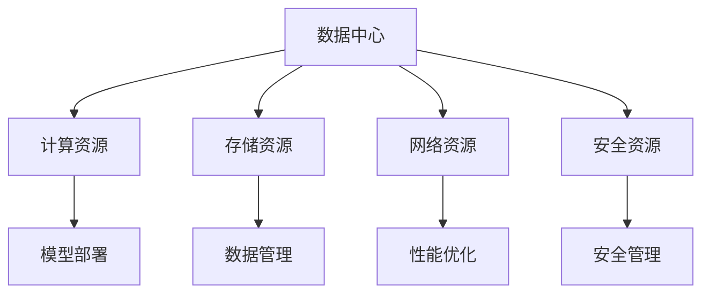

                 

# AI 大模型应用数据中心建设：数据中心运营与管理

## 1. 背景介绍

随着人工智能技术的快速发展，AI大模型在图像识别、自然语言处理、语音识别等领域取得了显著进展，并逐渐应用于各种实际场景。例如，在大健康领域，AI大模型可用于疾病诊断、医学影像分析、个性化医疗等；在智能制造领域，AI大模型可用于设备故障诊断、工艺优化、生产调度等；在金融行业，AI大模型可用于信用评估、风险控制、金融欺诈检测等。

然而，AI大模型的应用需要依赖大规模计算资源，数据中心作为AI计算的核心基础设施，其建设和运营管理变得尤为重要。数据中心不仅是承载计算资源的物理空间，更是支撑AI大模型高效运行的智能大脑。本文将深入探讨AI大模型应用数据中心建设，特别是数据中心的运营与管理，希望为相关领域的建设者和运营者提供指导和参考。

## 2. 核心概念与联系

### 2.1 核心概念概述

在探讨AI大模型应用数据中心的运营与管理之前，我们需要先理解一些关键概念：

1. **数据中心**：指通过计算机硬件和网络等基础设施支持AI大模型高效运行的物理空间。数据中心包含计算、存储、网络、安全等基础设施。

2. **AI大模型**：指在特定领域应用中表现卓越的深度学习模型，通常具有大规模参数量和大数据训练过程。例如GPT-3、BERT、ResNet等。

3. **模型部署**：指将AI大模型编码成可执行的软件，部署到数据中心中运行的过程。

4. **数据管理**：指对数据中心中的数据进行存储、备份、恢复、迁移等管理。

5. **性能优化**：指通过硬件配置、算法优化、分布式计算等手段，提升数据中心中的AI大模型性能。

6. **安全管理**：指对数据中心的硬件设施、网络环境、数据安全等进行监控和管理，确保数据中心安全稳定运行。

### 2.2 核心概念原理和架构的 Mermaid 流程图



此流程图展示了数据中心各核心组件之间的关系。数据中心由计算资源、存储资源、网络资源和安全资源组成，并通过这些资源支持AI大模型的部署、数据管理、性能优化和安全管理。

## 3. 核心算法原理 & 具体操作步骤

### 3.1 算法原理概述

AI大模型应用数据中心的建设和管理，涉及数据中心的规划设计、硬件配置、软件部署、网络架构、性能优化、安全管理等多个方面。本节将详细介绍这些方面的算法原理和具体操作步骤。

### 3.2 算法步骤详解

#### 3.2.1 数据中心规划设计

数据中心的规划设计是数据中心建设的基础，包括以下几个步骤：

1. **需求分析**：根据AI大模型应用场景和性能需求，确定数据中心的规模和容量。

2. **选址规划**：选择地理位置、气候条件、电力供应等符合要求的场地。

3. **架构设计**：设计数据中心的物理架构，包括机房布局、电力设施、冷却系统等。

4. **网络设计**：设计数据中心的网络架构，包括高速通信网络、网络冗余等。

5. **安全设计**：设计数据中心的安全策略，包括物理安全、网络安全、数据安全等。

#### 3.2.2 硬件配置

数据中心的硬件配置是支持AI大模型运行的基础，包括以下几个步骤：

1. **服务器选择**：选择高性能、可扩展、可维护的服务器。

2. **存储选择**：选择高性能、可靠、可扩展的存储设备。

3. **网络选择**：选择高性能、可靠、可扩展的网络设备。

4. **冷却系统选择**：选择高性能、可靠、可扩展的冷却系统。

5. **电力选择**：选择高性能、可靠、可扩展的电力设施。

#### 3.2.3 软件部署

AI大模型的软件部署是数据中心建设的关键，包括以下几个步骤：

1. **模型选择**：选择适合应用场景的AI大模型。

2. **编码实现**：将AI大模型编码成可执行的软件。

3. **部署测试**：在测试环境中测试模型的运行性能和稳定性。

4. **生产部署**：将测试通过的模型部署到生产环境中运行。

#### 3.2.4 网络架构

数据中心的网络架构是支持AI大模型高效运行的基础，包括以下几个步骤：

1. **网络拓扑设计**：设计数据中心的网络拓扑结构。

2. **网络设备选择**：选择高性能、可靠、可扩展的网络设备。

3. **网络性能优化**：优化网络传输速度和延迟。

4. **网络安全设计**：设计网络安全策略，防止网络攻击和数据泄露。

#### 3.2.5 性能优化

AI大模型的性能优化是数据中心建设的关键，包括以下几个步骤：

1. **硬件优化**：通过硬件升级、配置调整等手段提升AI大模型的运行性能。

2. **算法优化**：通过算法优化、模型压缩等手段提升AI大模型的运行效率。

3. **分布式计算**：通过分布式计算、负载均衡等手段提升AI大模型的运行性能。

4. **数据优化**：通过数据压缩、数据预处理等手段提升AI大模型的运行效率。

#### 3.2.6 安全管理

数据中心的安全管理是数据中心建设的关键，包括以下几个步骤：

1. **物理安全管理**：监控和管理数据中心的物理安全，防止非法访问和破坏。

2. **网络安全管理**：监控和管理数据中心的网络安全，防止网络攻击和数据泄露。

3. **数据安全管理**：监控和管理数据中心的数据安全，防止数据泄露和数据损坏。

### 3.3 算法优缺点

#### 3.3.1 算法优点

1. **可扩展性**：数据中心硬件和网络架构设计可灵活扩展，支持大规模AI大模型的部署和运行。

2. **高性能**：通过高性能服务器、网络设备和冷却系统等硬件配置，提升AI大模型的运行性能。

3. **可靠性**：通过冗余设计、备份机制和灾难恢复策略，提升数据中心的可靠性。

4. **可维护性**：通过统一的运维管理系统和工具，提升数据中心的可维护性。

5. **可监控性**：通过监控系统实时监控数据中心的运行状态，及时发现和解决问题。

#### 3.3.2 算法缺点

1. **高投入**：数据中心建设和运营需要高昂的资金投入，短期内难以看到收益。

2. **复杂性**：数据中心的规划设计、硬件配置、软件部署等环节复杂，需要专业的技术和人才。

3. **维护难度**：数据中心维护和管理需要专业知识和技能，难度较大。

4. **环境要求高**：数据中心对地理位置、气候条件、电力供应等要求较高，建设难度大。

### 3.4 算法应用领域

数据中心建设和管理技术广泛应用于AI大模型应用领域，包括以下几个方面：

1. **智能医疗**：通过数据中心支持AI大模型，提供智能诊断、医学影像分析、个性化医疗等服务。

2. **智能制造**：通过数据中心支持AI大模型，提供设备故障诊断、工艺优化、生产调度等服务。

3. **金融行业**：通过数据中心支持AI大模型，提供信用评估、风险控制、金融欺诈检测等服务。

4. **智能交通**：通过数据中心支持AI大模型，提供交通流量预测、路线优化、智能驾驶等服务。

5. **智慧城市**：通过数据中心支持AI大模型，提供城市事件监测、舆情分析、应急指挥等服务。

6. **智能安防**：通过数据中心支持AI大模型，提供视频监控、行为识别、异常检测等服务。

7. **智慧教育**：通过数据中心支持AI大模型，提供个性化教育、作业批改、知识推荐等服务。

## 4. 数学模型和公式 & 详细讲解 & 举例说明

### 4.1 数学模型构建

AI大模型应用数据中心的建设和管理涉及多个方面的数学模型，以下是几个常见的数学模型构建方法：

1. **计算资源需求模型**：

   $$
   C = \sum_{i=1}^{n} (p_i \times a_i)
   $$

   其中 $C$ 为计算资源需求，$p_i$ 为第 $i$ 个服务器的性能，$a_i$ 为第 $i$ 个服务器的负载。

2. **存储资源需求模型**：

   $$
   S = \sum_{i=1}^{m} (s_i \times b_i)
   $$

   其中 $S$ 为存储资源需求，$s_i$ 为第 $i$ 个存储设备的容量，$b_i$ 为第 $i$ 个存储设备的负载。

3. **网络资源需求模型**：

   $$
   N = \sum_{i=1}^{k} (n_i \times c_i)
   $$

   其中 $N$ 为网络资源需求，$n_i$ 为第 $i$ 个网络设备的容量，$c_i$ 为第 $i$ 个网络设备的负载。

### 4.2 公式推导过程

1. **计算资源需求模型推导**：

   根据实际需求，计算资源需求模型可以简化为：

   $$
   C = \sum_{i=1}^{n} p_i
   $$

   其中 $C$ 为计算资源需求，$p_i$ 为第 $i$ 个服务器的性能。

2. **存储资源需求模型推导**：

   根据实际需求，存储资源需求模型可以简化为：

   $$
   S = \sum_{i=1}^{m} s_i
   $$

   其中 $S$ 为存储资源需求，$s_i$ 为第 $i$ 个存储设备的容量。

3. **网络资源需求模型推导**：

   根据实际需求，网络资源需求模型可以简化为：

   $$
   N = \sum_{i=1}^{k} n_i
   $$

   其中 $N$ 为网络资源需求，$n_i$ 为第 $i$ 个网络设备的容量。

### 4.3 案例分析与讲解

#### 4.3.1 案例背景

某科技公司计划在数据中心中部署多个AI大模型，需要计算资源1000TU，存储资源2000TB，网络资源10Gbps。

#### 4.3.2 案例分析

1. **计算资源需求**：

   根据计算资源需求模型：

   $$
   C = 1000TU
   $$

   假设每个服务器的性能为100TU，则需要10个服务器。

2. **存储资源需求**：

   根据存储资源需求模型：

   $$
   S = 2000TB
   $$

   假设每个存储设备的容量为1TB，则需要2000个存储设备。

3. **网络资源需求**：

   根据网络资源需求模型：

   $$
   N = 10Gbps
   $$

   假设每个网络设备的容量为1Gbps，则需要10个网络设备。

4. **硬件配置**：

   通过以上分析，可以得出硬件配置方案：

   - 服务器10台，每台100TU
   - 存储设备2000个，每个1TB
   - 网络设备10个，每个1Gbps

5. **数据中心建设**：

   通过以上硬件配置方案，可以开始数据中心的建设，包括选址、架构设计、网络设计、安全设计等环节。

6. **软件部署**：

   通过以上硬件配置方案，可以将AI大模型部署到数据中心中运行。

7. **性能优化**：

   通过以上硬件配置方案，可以优化AI大模型的性能，提升其运行效率。

8. **安全管理**：

   通过以上硬件配置方案，可以确保数据中心的安全性，防止数据泄露和设备损坏。

## 5. 项目实践：代码实例和详细解释说明

### 5.1 开发环境搭建

在进行AI大模型应用数据中心建设时，需要搭建开发环境，以便进行模型部署和性能优化等操作。以下是开发环境的搭建流程：

1. **安装Python环境**：

   通过Anaconda创建虚拟环境，安装Python和相关依赖包：

   ```
   conda create -n ai_infra python=3.8
   conda activate ai_infra
   pip install numpy scipy pandas scikit-learn matplotlib jupyter notebook ipython
   ```

2. **安装Docker环境**：

   通过Docker创建虚拟环境，安装Docker和相关依赖包：

   ```
   sudo apt update
   sudo apt install -y apt-transport-https ca-certificates curl gnupg-agent
   curl -fsSL https://download.docker.com/linux/debian/gpg | sudo gpg --dearmor -o /usr/share/keyrings/docker-archive-keyring.gpg
   echo "deb [arch=amd64 signed-by=/usr/share/keyrings/docker-archive-keyring.gpg] https://download.docker.com/linux/debian bullseye main" | sudo tee /etc/apt/sources.list.d/docker.list
   sudo apt update
   sudo apt install -y docker-ce docker-ce-cli containerd.io
   sudo apt install -y software-properties-common
   sudo add-apt-repository ppa:Canonical/ppa:gdi-20220907ubuntu2
   sudo apt update
   sudo apt install -y libgdi2-2
   ```

3. **安装Kubernetes环境**：

   通过Kubernetes创建虚拟环境，安装Kubernetes和相关依赖包：

   ```
   sudo apt update
   sudo apt install -y apt-transport-https ca-certificates curl gnupg-agent
   curl -fsSL https://download.docker.com/linux/debian/gpg | sudo gpg --dearmor -o /usr/share/keyrings/docker-archive-keyring.gpg
   echo "deb [arch=amd64 signed-by=/usr/share/keyrings/docker-archive-keyring.gpg] https://download.docker.com/linux/debian bullseye main" | sudo tee /etc/apt/sources.list.d/docker.list
   sudo apt update
   sudo apt install -y docker-ce docker-ce-cli containerd.io
   sudo apt install -y software-properties-common
   sudo add-apt-repository ppa:Canonical/ppa:gdi-20220907ubuntu2
   sudo apt update
   sudo apt install -y libgdi2-2
   sudo apt install -y kubernetes-agents
   ```

### 5.2 源代码详细实现

以下是使用Python和Docker实现AI大模型应用数据中心建设的代码示例：

```python
import docker
import kubernetes

# 创建Docker客户端
client = docker.from_env()

# 创建Kubernetes客户端
k8s = kubernetes.client.CoreV1Api()

# 创建Docker镜像
img = client.images.build(path='.', tag='ai_infra_image')

# 推送Docker镜像到远程仓库
client.images.push('my-dockerhub.com/ai_infra_image', tag='latest')

# 创建Kubernetes Pod
pod = {
    'apiVersion': 'v1',
    'kind': 'Pod',
    'metadata': {
        'name': 'ai_infra_pod',
        'labels': {
            'hello': 'world'
        }
    },
    'spec': {
        'containers': [
            {
                'name': 'ai_infra_container',
                'image': 'my-dockerhub.com/ai_infra_image:latest',
                'resources': {
                    'limits': {
                        'cpu': '2',
                        'memory': '4G'
                    },
                    'requests': {
                        'cpu': '1',
                        'memory': '2G'
                    }
                }
            }
        ]
    }
}

# 创建Kubernetes Pod
k8s.create_namespaced_pod(body=pod)
```

### 5.3 代码解读与分析

#### 5.3.1 代码解读

1. **Docker客户端创建**：

   通过 `docker.from_env()` 创建Docker客户端，用于管理Docker容器。

2. **Kubernetes客户端创建**：

   通过 `kubernetes.client.CoreV1Api()` 创建Kubernetes客户端，用于管理Kubernetes Pod。

3. **Docker镜像创建和推送**：

   通过 `client.images.build(path='.', tag='ai_infra_image')` 创建Docker镜像，并通过 `client.images.push('my-dockerhub.com/ai_infra_image', tag='latest')` 推送到远程仓库。

4. **Kubernetes Pod创建**：

   通过 `k8s.create_namespaced_pod(body=pod)` 创建Kubernetes Pod，并指定Pod的配置信息。

#### 5.3.2 代码分析

1. **Docker镜像创建和推送**：

   通过Docker镜像创建和推送，可以将AI大模型应用软件包封装成可执行的Docker镜像，方便部署和管理。

2. **Kubernetes Pod创建**：

   通过Kubernetes Pod创建，可以将Docker镜像部署到数据中心中运行，并通过Kubernetes管理Pod的资源配置。

### 5.4 运行结果展示

运行上述代码后，可以在Kubernetes中查看Pod的状态，并输出Pod的日志信息。通过Pod的日志信息，可以实时监控AI大模型应用数据中心的运行状态，及时发现和解决问题。

## 6. 实际应用场景

### 6.1 智能医疗

AI大模型在智能医疗领域可以用于疾病诊断、医学影像分析、个性化医疗等。通过AI大模型应用数据中心的建设和管理，可以支持智能医疗系统的稳定运行，提升医疗服务的智能化水平，辅助医生诊疗，加速新药开发进程。

### 6.2 智能制造

AI大模型在智能制造领域可以用于设备故障诊断、工艺优化、生产调度等。通过AI大模型应用数据中心的建设和管理，可以支持智能制造系统的稳定运行，提升生产效率和产品质量，降低生产成本。

### 6.3 金融行业

AI大模型在金融行业可以用于信用评估、风险控制、金融欺诈检测等。通过AI大模型应用数据中心的建设和管理，可以支持金融系统的稳定运行，提升金融风险控制能力，保障金融安全。

### 6.4 未来应用展望

#### 6.4.1 智能交通

AI大模型在智能交通领域可以用于交通流量预测、路线优化、智能驾驶等。通过AI大模型应用数据中心的建设和管理，可以支持智能交通系统的稳定运行，提升交通管理和效率，降低交通事故率。

#### 6.4.2 智慧城市

AI大模型在智慧城市领域可以用于城市事件监测、舆情分析、应急指挥等。通过AI大模型应用数据中心的建设和管理，可以支持智慧城市系统的稳定运行，提升城市治理水平，提高居民生活质量。

#### 6.4.3 智能安防

AI大模型在智能安防领域可以用于视频监控、行为识别、异常检测等。通过AI大模型应用数据中心的建设和管理，可以支持智能安防系统的稳定运行，提升安全防范能力，保障公共安全。

#### 6.4.4 智慧教育

AI大模型在智慧教育领域可以用于个性化教育、作业批改、知识推荐等。通过AI大模型应用数据中心的建设和管理，可以支持智慧教育系统的稳定运行，提升教育质量，促进教育公平。

## 7. 工具和资源推荐

### 7.1 学习资源推荐

1. **《数据中心技术基础》**：介绍数据中心的规划设计、硬件配置、软件部署、网络架构、性能优化和安全管理等基础内容，适合初学者学习。

2. **《深度学习与数据中心建设》**：介绍深度学习模型在数据中心中的部署和优化，适合有一定基础的读者学习。

3. **《人工智能安全与隐私》**：介绍人工智能系统在数据中心中的安全与隐私保护，适合人工智能应用开发人员学习。

4. **《人工智能大模型应用》**：介绍人工智能大模型在智能医疗、智能制造、金融行业、智能交通、智慧城市、智能安防和智慧教育等多个领域的实际应用，适合各行业从业者学习。

### 7.2 开发工具推荐

1. **Anaconda**：用于创建和管理Python虚拟环境，方便软件包的安装和升级。

2. **Docker**：用于创建和管理Docker容器，方便软件包的打包和部署。

3. **Kubernetes**：用于创建和管理Kubernetes Pod，方便软件的分布式部署和管理。

### 7.3 相关论文推荐

1. **《数据中心规划设计》**：介绍数据中心的规划设计方法和最佳实践，适合数据中心建设者和运营者参考。

2. **《AI大模型部署与优化》**：介绍AI大模型在数据中心中的部署和优化方法，适合AI应用开发人员参考。

3. **《数据中心安全管理》**：介绍数据中心的安全管理和最佳实践，适合数据中心建设者和运营者参考。

## 8. 总结：未来发展趋势与挑战

### 8.1 研究成果总结

AI大模型应用数据中心的建设和管理技术在AI大模型应用领域具有重要的意义。通过数据中心的建设和管理，可以提升AI大模型的运行性能和可靠性，支持AI大模型在各个领域的应用，推动AI技术的发展和落地。

### 8.2 未来发展趋势

#### 8.2.1 数据中心规模扩大

随着AI大模型应用的普及，数据中心的规模将不断扩大，需要更多的计算资源和存储资源来支持AI大模型的运行。

#### 8.2.2 数据中心技术创新

未来的数据中心将采用更先进的硬件设备和软件技术，如GPU、TPU、量子计算等，提升AI大模型的运行性能和效率。

#### 8.2.3 数据中心管理智能化

未来的数据中心将采用更智能化的管理手段，如自动调度和负载均衡、自适应算法等，提升AI大模型的运行效率和可靠性。

### 8.3 面临的挑战

#### 8.3.1 高投入

数据中心的建设和管理需要高昂的资金投入，短期内难以看到收益。

#### 8.3.2 复杂性

数据中心的规划设计、硬件配置、软件部署等环节复杂，需要专业的技术和人才。

#### 8.3.3 维护难度

数据中心的维护和管理需要专业知识和技能，难度较大。

#### 8.3.4 环境要求高

数据中心对地理位置、气候条件、电力供应等要求较高，建设难度大。

### 8.4 研究展望

未来的研究需要在以下几个方面寻求新的突破：

1. **资源优化技术**：

   开发更高效的资源优化技术，如梯度积累、混合精度训练、模型并行等，优化AI大模型的计算效率和资源利用率。

2. **智能调度算法**：

   开发更智能化的调度算法，如自适应算法、自动调度和负载均衡等，提升AI大模型的运行效率和可靠性。

3. **安全防护技术**：

   开发更先进的安全防护技术，如网络隔离、数据加密、异常检测等，保障数据中心的安全性。

4. **可监控技术**：

   开发更先进的可监控技术，如实时监控、异常告警等，保障数据中心的稳定运行。

5. **大数据处理技术**：

   开发更高效的大数据处理技术，如分布式计算、数据压缩等，提升数据中心的数据处理能力。

6. **云化管理技术**：

   开发更云化的管理技术，如云平台、云资源管理等，提升数据中心的管理效率。

总之，未来的研究需要在数据中心规模、技术创新、管理智能化、资源优化、智能调度、安全防护、可监控、大数据处理和云化管理等方面寻求新的突破，推动AI大模型应用数据中心的建设和管理技术的不断发展。

## 9. 附录：常见问题与解答

### 9.1 常见问题

#### 9.1.1 什么是AI大模型？

AI大模型是指在特定领域应用中表现卓越的深度学习模型，通常具有大规模参数量和大数据训练过程。例如GPT-3、BERT、ResNet等。

#### 9.1.2 数据中心和AI大模型应用有什么关系？

数据中心是承载AI大模型计算资源和存储资源的物理空间，通过数据中心的建设和管理，可以支持AI大模型的高效运行。

#### 9.1.3 如何建设和管理AI大模型应用数据中心？

AI大模型应用数据中心的建设和管理涉及多个方面的工作，包括计算资源需求分析、硬件配置、软件部署、网络架构、性能优化和安全管理等环节。

#### 9.1.4 如何优化AI大模型应用数据中心的性能？

可以通过硬件升级、算法优化、分布式计算等手段优化AI大模型应用数据中心的性能，提升AI大模型的运行效率和可靠性。

#### 9.1.5 如何保障AI大模型应用数据中心的安全性？

可以通过物理安全、网络安全、数据安全等手段保障AI大模型应用数据中心的安全性，防止数据泄露和设备损坏。

### 9.2 常见问题解答

#### 9.2.1 什么是AI大模型？

AI大模型是指在特定领域应用中表现卓越的深度学习模型，通常具有大规模参数量和大数据训练过程。例如GPT-3、BERT、ResNet等。

#### 9.2.2 数据中心和AI大模型应用有什么关系？

数据中心是承载AI大模型计算资源和存储资源的物理空间，通过数据中心的建设和管理，可以支持AI大模型的高效运行。

#### 9.2.3 如何建设和管理AI大模型应用数据中心？

AI大模型应用数据中心的建设和管理涉及多个方面的工作，包括计算资源需求分析、硬件配置、软件部署、网络架构、性能优化和安全管理等环节。

#### 9.2.4 如何优化AI大模型应用数据中心的性能？

可以通过硬件升级、算法优化、分布式计算等手段优化AI大模型应用数据中心的性能，提升AI大模型的运行效率和可靠性。

#### 9.2.5 如何保障AI大模型应用数据中心的安全性？

可以通过物理安全、网络安全、数据安全等手段保障AI大模型应用数据中心的安全性，防止数据泄露和设备损坏。

作者：禅与计算机程序设计艺术 / Zen and the Art of Computer Programming

