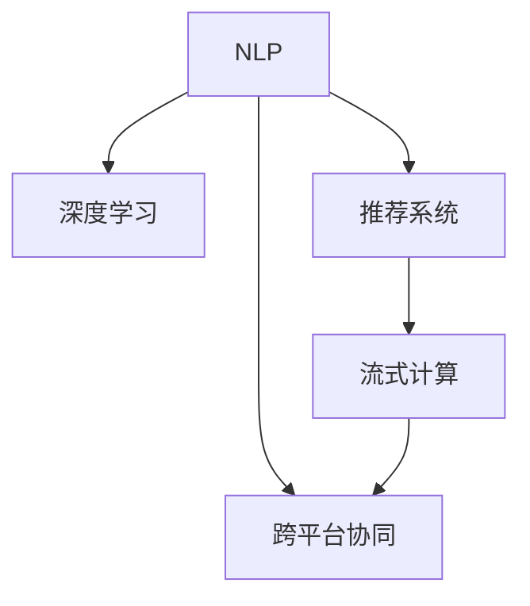

                 

# AI 技术在电商搜索导购中的未来发展趋势：展望与思考

> 关键词：电商搜索导购,自然语言处理,NLP,深度学习,推荐系统,数据科学,技术前沿

## 1. 背景介绍

### 1.1 问题由来

随着电子商务的迅猛发展，电商平台已成为消费者获取商品信息、进行在线购物的主要渠道。如何在海量商品中快速找到符合用户需求的产品，成为电商平台的关键挑战。传统的文本搜索和图片搜索技术虽然取得了一定效果，但在精度、个性化等方面存在不足。近年来，随着人工智能技术的不断进步，AI技术开始在电商搜索导购中扮演越来越重要的角色。通过自然语言处理(NLP)、深度学习、推荐系统等前沿技术，电商搜索导购系统在精准度、个性化推荐、用户体验等方面取得了显著提升。

### 1.2 问题核心关键点

1. **电商搜索导购的挑战**：
   - 多源异构数据处理：电商平台面临海量的商品信息、用户行为数据，如何高效处理这些数据，提取有价值的信息，是一个重大挑战。
   - 语义理解与生成：电商平台需要理解用户的自然语言查询，生成符合用户需求的搜索结果和推荐内容。
   - 个性化推荐：电商平台需要基于用户行为数据和商品信息，生成个性化的搜索结果和推荐列表，提高用户满意度。
   - 实时性要求：电商平台的搜索和推荐系统需要具备实时响应能力，以支持并发用户访问，提升用户体验。

2. **AI技术的应用**：
   - 自然语言处理(NLP)：通过语义理解和生成技术，使搜索引擎能够理解用户的自然语言查询，提供更精准的搜索结果。
   - 深度学习模型：通过大规模数据训练深度学习模型，如卷积神经网络(CNN)、循环神经网络(RNN)、Transformer等，提取商品和用户数据的特征，进行精准推荐。
   - 推荐系统：通过协同过滤、基于内容的推荐、混合推荐等技术，生成个性化推荐列表，提升用户转化率和满意度。

3. **未来的趋势**：
   - 个性化搜索：通过用户行为数据分析，提供更加个性化的搜索结果。
   - 多模态搜索：结合图片、视频、音频等多模态数据，提供更加丰富的搜索结果。
   - 实时搜索与推荐：通过流式计算和实时数据处理技术，提升搜索和推荐的实时性。
   - 跨平台协同：通过多平台数据融合和用户行为分析，提升搜索和推荐的跨平台协同能力。

## 2. 核心概念与联系

### 2.1 核心概念概述

为了更好地理解AI技术在电商搜索导购中的应用，本节将介绍几个关键概念及其相互联系：

- **自然语言处理(NLP)**：通过计算机技术实现自然语言的理解、生成、分析和应用，包括文本处理、语义理解、机器翻译等。
- **深度学习**：通过多层神经网络模型，学习大规模数据的特征表示，广泛应用于图像识别、语音识别、自然语言处理等领域。
- **推荐系统**：通过用户行为数据和商品信息，为用户推荐个性化的商品，提高用户满意度和转化率。
- **流式计算**：通过实时数据处理技术，对数据流进行实时分析和计算，支持实时搜索和推荐。
- **跨平台协同**：通过多平台数据融合和用户行为分析，提升搜索和推荐的跨平台协同能力。

这些核心概念通过以下Mermaid流程图展示它们的相互联系：



### 2.2 核心概念原理和架构

**自然语言处理(NLP)**：

NLP是计算机科学和人工智能领域的一个重要分支，旨在使计算机能够理解、处理和生成自然语言。其主要技术包括：

- **分词与词性标注**：将连续的自然语言文本分解为单词或词性，为后续处理提供基础。
- **句法分析**：分析句子的结构，提取语法信息和依存关系。
- **语义理解**：理解句子或文档的含义，提取关键信息。
- **命名实体识别**：识别文本中的命名实体，如人名、地名、机构名等。
- **情感分析**：分析文本的情感倾向，如正面、负面、中性等。
- **机器翻译**：将一种语言的文本翻译成另一种语言。

**深度学习**：

深度学习通过多层神经网络模型，学习大规模数据的特征表示，广泛应用于图像识别、语音识别、自然语言处理等领域。其主要技术包括：

- **卷积神经网络(CNN)**：通过卷积操作提取图像的局部特征，广泛应用于图像识别任务。
- **循环神经网络(RNN)**：通过循环结构处理序列数据，广泛应用于语言建模、机器翻译等任务。
- **Transformer**：通过自注意力机制，有效处理长序列数据，广泛应用于自然语言处理任务。
- **注意力机制**：通过动态计算注意力权重，提取关键特征，广泛应用于机器翻译、文本生成等任务。

**推荐系统**：

推荐系统通过用户行为数据和商品信息，为用户推荐个性化的商品，提高用户满意度和转化率。其主要技术包括：

- **协同过滤**：通过用户历史行为数据，推断用户对其他商品的兴趣。
- **基于内容的推荐**：通过商品属性信息，推荐与用户历史偏好相似的商品。
- **混合推荐**：结合多种推荐算法，生成更精准的推荐结果。
- **实时推荐**：通过流式计算和实时数据处理技术，支持实时推荐。

**流式计算**：

流式计算通过实时数据处理技术，对数据流进行实时分析和计算，支持实时搜索和推荐。其主要技术包括：

- **事件驱动编程**：通过事件触发和处理，实现实时数据流处理。
- **流式数据库**：通过实时数据存储和查询，支持实时分析和计算。
- **实时数据处理框架**：如Apache Kafka、Apache Flink等，支持大规模实时数据处理。

**跨平台协同**：

跨平台协同通过多平台数据融合和用户行为分析，提升搜索和推荐的跨平台协同能力。其主要技术包括：

- **数据融合**：通过多平台数据融合，提升搜索和推荐的覆盖面和准确性。
- **用户行为分析**：通过用户行为分析，生成跨平台的个性化推荐。
- **多模态数据融合**：通过融合文本、图像、音频等多模态数据，提升搜索和推荐的丰富性。

## 3. 核心算法原理 & 具体操作步骤

### 3.1 算法原理概述

AI技术在电商搜索导购中的应用主要涉及以下几个关键算法：

- **基于NLP的语义搜索算法**：通过语义理解技术，理解用户的自然语言查询，提供精准的搜索结果。
- **基于深度学习的推荐算法**：通过大规模数据训练深度学习模型，生成个性化推荐列表。
- **基于流式计算的实时推荐算法**：通过实时数据处理技术，支持实时搜索和推荐。
- **基于多模态数据的融合算法**：通过融合文本、图像、音频等多模态数据，提升搜索结果的丰富性。
- **基于协同过滤的推荐算法**：通过用户历史行为数据，推断用户对其他商品的兴趣。

### 3.2 算法步骤详解

**基于NLP的语义搜索算法**：

1. **分词与词性标注**：将用户查询文本分解为单词或词性，提取关键词和短语。
2. **句法分析**：分析句子的结构，提取语法信息和依存关系。
3. **语义理解**：理解句子或文档的含义，提取关键信息。
4. **命名实体识别**：识别文本中的命名实体，如人名、地名、机构名等。
5. **情感分析**：分析文本的情感倾向，如正面、负面、中性等。
6. **语义匹配**：将用户查询文本与商品描述进行语义匹配，生成搜索结果。

**基于深度学习的推荐算法**：

1. **数据预处理**：对用户行为数据和商品信息进行清洗、归一化等预处理。
2. **特征提取**：使用深度学习模型，提取用户和商品特征表示。
3. **训练深度学习模型**：使用大规模数据训练深度学习模型，如卷积神经网络(CNN)、循环神经网络(RNN)、Transformer等。
4. **生成推荐列表**：通过模型预测，生成个性化推荐列表。

**基于流式计算的实时推荐算法**：

1. **实时数据采集**：通过实时数据采集技术，获取用户行为数据和商品信息。
2. **实时数据处理**：使用流式计算框架，对实时数据进行分析和计算。
3. **实时推荐生成**：根据实时数据和模型预测，生成实时推荐列表。

**基于多模态数据的融合算法**：

1. **数据采集与预处理**：获取文本、图像、音频等多模态数据，并进行预处理。
2. **特征提取**：使用深度学习模型，提取多模态数据的特征表示。
3. **特征融合**：通过融合多模态数据，生成综合特征表示。
4. **搜索结果生成**：将综合特征表示与商品描述进行匹配，生成搜索结果。

**基于协同过滤的推荐算法**：

1. **用户行为数据采集**：获取用户的历史行为数据，如浏览、点击、购买等。
2. **用户兴趣推断**：通过协同过滤算法，推断用户对其他商品的兴趣。
3. **商品推荐生成**：根据用户兴趣，生成个性化推荐列表。

### 3.3 算法优缺点

**基于NLP的语义搜索算法**：

优点：
- 能够理解自然语言查询，提供更精准的搜索结果。
- 可以处理长文本查询，涵盖更广泛的语义信息。

缺点：
- 需要大量标注数据训练模型，数据标注成本较高。
- 语义理解可能存在歧义，影响搜索结果准确性。

**基于深度学习的推荐算法**：

优点：
- 能够生成个性化推荐列表，提高用户满意度和转化率。
- 可以处理复杂的数据结构，提取更丰富的特征表示。

缺点：
- 需要大规模数据训练模型，数据获取成本较高。
- 模型复杂度较高，训练和推理速度较慢。

**基于流式计算的实时推荐算法**：

优点：
- 能够支持实时推荐，提高用户满意度。
- 可以处理大规模数据流，支持高并发访问。

缺点：
- 需要实时数据采集和处理，技术实现复杂。
- 实时推荐需要较高的计算资源，成本较高。

**基于多模态数据的融合算法**：

优点：
- 能够融合多模态数据，生成更丰富的搜索结果。
- 可以提供更全面的商品信息，提高用户满意度。

缺点：
- 数据采集和融合成本较高。
- 多模态数据处理复杂，算法实现难度较大。

**基于协同过滤的推荐算法**：

优点：
- 能够推断用户兴趣，生成个性化推荐列表。
- 可以处理用户行为数据，生成实时推荐。

缺点：
- 需要用户行为数据，数据获取成本较高。
- 协同过滤算法可能存在冷启动问题，难以推断新用户的兴趣。

### 3.4 算法应用领域

AI技术在电商搜索导购中的应用主要涉及以下几个领域：

- **电商搜索系统**：通过语义理解和生成技术，提供精准的搜索结果，提升用户体验。
- **个性化推荐系统**：通过深度学习模型和协同过滤算法，生成个性化推荐列表，提高用户满意度和转化率。
- **实时推荐系统**：通过流式计算和实时数据处理技术，支持实时推荐，提升用户满意度。
- **跨平台协同推荐**：通过多平台数据融合和用户行为分析，提升搜索和推荐的跨平台协同能力，提高覆盖面和准确性。

## 4. 数学模型和公式 & 详细讲解 & 举例说明

### 4.1 数学模型构建

**基于NLP的语义搜索算法**：

1. **分词与词性标注**：
   - 分词模型：通过基于规则或统计的方法，将文本分解为单词或词性。
   - 词性标注模型：通过隐马尔可夫模型(HMM)或条件随机场(CRF)，标注每个单词的词性。

2. **句法分析**：
   - 依存关系模型：通过依存语法分析，提取句子的结构信息。
   - 句法树模型：通过递归神经网络(RNN)，构建句子的句法树。

3. **语义理解**：
   - 词向量模型：通过Word2Vec、GloVe等模型，将单词映射到低维向量空间。
   - 句向量模型：通过Bert、GPT等模型，生成句子的向量表示。

4. **命名实体识别**：
   - 命名实体识别模型：通过条件随机场(CRF)或BiLSTM-CRF，识别文本中的命名实体。

5. **情感分析**：
   - 情感分类模型：通过支持向量机(SVM)或深度神经网络，分类文本的情感倾向。

6. **语义匹配**：
   - 语义匹配模型：通过Bert、GPT等模型，计算查询文本和商品描述的相似度。

**基于深度学习的推荐算法**：

1. **数据预处理**：
   - 数据清洗：去除重复、异常、缺失等数据。
   - 数据归一化：将数据缩放到0-1之间，便于模型处理。

2. **特征提取**：
   - CNN模型：使用卷积操作，提取图像的局部特征。
   - RNN模型：使用循环结构，处理序列数据。
   - Transformer模型：使用自注意力机制，提取序列数据的全局特征。

3. **训练深度学习模型**：
   - 交叉熵损失函数：通过最小化损失函数，训练模型参数。
   - Adam优化器：通过梯度下降法，更新模型参数。

4. **生成推荐列表**：
   - 预测模型：通过深度学习模型，预测用户对商品的概率。
   - 排序算法：通过排序算法，生成推荐列表。

**基于流式计算的实时推荐算法**：

1. **实时数据采集**：
   - Apache Kafka：使用流式数据采集技术，获取实时数据。

2. **实时数据处理**：
   - Apache Flink：使用流式计算框架，处理实时数据。

3. **实时推荐生成**：
   - 实时预测模型：通过深度学习模型，预测实时推荐。
   - 实时推荐算法：通过流式计算框架，生成实时推荐列表。

**基于多模态数据的融合算法**：

1. **数据采集与预处理**：
   - 文本数据：使用NLP工具，处理文本数据。
   - 图像数据：使用图像处理工具，处理图像数据。
   - 音频数据：使用音频处理工具，处理音频数据。

2. **特征提取**：
   - 文本特征提取：使用NLP工具，提取文本特征。
   - 图像特征提取：使用CNN模型，提取图像特征。
   - 音频特征提取：使用MFCC等工具，提取音频特征。

3. **特征融合**：
   - 特征拼接：将多模态特征拼接，生成综合特征。
   - 特征融合模型：使用深度学习模型，融合多模态特征。

4. **搜索结果生成**：
   - 多模态匹配模型：通过多模态数据匹配，生成搜索结果。

**基于协同过滤的推荐算法**：

1. **用户行为数据采集**：
   - 用户行为数据：获取用户的历史行为数据，如浏览、点击、购买等。

2. **用户兴趣推断**：
   - 协同过滤算法：通过用户行为数据，推断用户对其他商品的兴趣。
   - 相似度计算：通过余弦相似度等方法，计算用户和商品之间的相似度。

3. **商品推荐生成**：
   - 推荐算法：通过协同过滤算法，生成个性化推荐列表。

### 4.2 公式推导过程

**基于NLP的语义搜索算法**：

1. **分词与词性标注**：
   - 分词模型：$P(w_i | w_{i-1}, w_{i+1})$，通过隐马尔可夫模型(HMM)或条件随机场(CRF)，计算单词的概率。
   - 词性标注模型：$P(tag_i | w_i)$，通过隐马尔可夫模型(HMM)或条件随机场(CRF)，标注每个单词的词性。

2. **句法分析**：
   - 依存关系模型：$P(dep_i | w_1, w_2, \ldots, w_n)$，通过依存语法分析，提取句子的结构信息。
   - 句法树模型：$P(tree_i | w_1, w_2, \ldots, w_n)$，通过递归神经网络(RNN)，构建句子的句法树。

3. **语义理解**：
   - 词向量模型：$P(v_i | w)$，通过Word2Vec、GloVe等模型，将单词映射到低维向量空间。
   - 句向量模型：$P(v_s | w_1, w_2, \ldots, w_n)$，通过Bert、GPT等模型，生成句子的向量表示。

4. **命名实体识别**：
   - 命名实体识别模型：$P(ne_i | w_1, w_2, \ldots, w_n)$，通过条件随机场(CRF)或BiLSTM-CRF，识别文本中的命名实体。

5. **情感分析**：
   - 情感分类模型：$P(label | w)$，通过支持向量机(SVM)或深度神经网络，分类文本的情感倾向。

6. **语义匹配**：
   - 语义匹配模型：$P(match | Q, P)$，通过Bert、GPT等模型，计算查询文本和商品描述的相似度。

**基于深度学习的推荐算法**：

1. **数据预处理**：
   - 数据清洗：$P(d_i | D)$，通过去除重复、异常、缺失等数据，保证数据质量。
   - 数据归一化：$P(z_i | d_i)$，将数据缩放到0-1之间，便于模型处理。

2. **特征提取**：
   - CNN模型：$P(f_i | x_i)$，使用卷积操作，提取图像的局部特征。
   - RNN模型：$P(f_i | x_1, x_2, \ldots, x_n)$，使用循环结构，处理序列数据。
   - Transformer模型：$P(f_i | x_1, x_2, \ldots, x_n)$，使用自注意力机制，提取序列数据的全局特征。

3. **训练深度学习模型**：
   - 交叉熵损失函数：$L_{CE}(\theta) = -\frac{1}{N} \sum_{i=1}^N \sum_{j=1}^C y_{ij} \log p_{ij}$，通过最小化损失函数，训练模型参数。
   - Adam优化器：$P(\theta_{t+1} | \theta_t, g_t)$，通过梯度下降法，更新模型参数。

4. **生成推荐列表**：
   - 预测模型：$P(r_i | u_j, i)$，通过深度学习模型，预测用户对商品的概率。
   - 排序算法：$P(R | U, P)$，通过排序算法，生成推荐列表。

**基于流式计算的实时推荐算法**：

1. **实时数据采集**：
   - Apache Kafka：$P(D | S)$，通过流式数据采集技术，获取实时数据。

2. **实时数据处理**：
   - Apache Flink：$P(D_{real} | D)$，使用流式计算框架，处理实时数据。

3. **实时推荐生成**：
   - 实时预测模型：$P(R | D_{real}, \theta)$，通过深度学习模型，预测实时推荐。
   - 实时推荐算法：$P(R_{real} | D_{real}, \theta)$，通过流式计算框架，生成实时推荐列表。

**基于多模态数据的融合算法**：

1. **数据采集与预处理**：
   - 文本数据：$P(T | W)$，使用NLP工具，处理文本数据。
   - 图像数据：$P(I | X)$，使用图像处理工具，处理图像数据。
   - 音频数据：$P(A | X)$，使用音频处理工具，处理音频数据。

2. **特征提取**：
   - 文本特征提取：$P(f_{text} | W)$，使用NLP工具，提取文本特征。
   - 图像特征提取：$P(f_{img} | X)$，使用CNN模型，提取图像特征。
   - 音频特征提取：$P(f_{audio} | X)$，使用MFCC等工具，提取音频特征。

3. **特征融合**：
   - 特征拼接：$P(f_{comb} | f_{text}, f_{img}, f_{audio})$，将多模态特征拼接，生成综合特征。
   - 特征融合模型：$P(f_{comb} | W, X)$，使用深度学习模型，融合多模态特征。

4. **搜索结果生成**：
   - 多模态匹配模型：$P(S | Q, P, f_{comb})$，通过多模态数据匹配，生成搜索结果。

**基于协同过滤的推荐算法**：

1. **用户行为数据采集**：
   - 用户行为数据：$P(D_{user} | U)$，获取用户的历史行为数据，如浏览、点击、购买等。

2. **用户兴趣推断**：
   - 协同过滤算法：$P(R_{u,i} | D_{user}, D_{item})$，通过用户行为数据，推断用户对其他商品的兴趣。
   - 相似度计算：$P(sim_{u,i} | D_{user}, D_{item})$，通过余弦相似度等方法，计算用户和商品之间的相似度。

3. **商品推荐生成**：
   - 推荐算法：$P(R_{item} | D_{user}, D_{item})$，通过协同过滤算法，生成个性化推荐列表。

## 5. 项目实践：代码实例和详细解释说明

### 5.1 开发环境搭建

在进行AI技术在电商搜索导购中的应用实践前，我们需要准备好开发环境。以下是使用Python进行TensorFlow开发的环境配置流程：

1. 安装Anaconda：从官网下载并安装Anaconda，用于创建独立的Python环境。

2. 创建并激活虚拟环境：
```bash
conda create -n tf-env python=3.7 
conda activate tf-env
```

3. 安装TensorFlow：
```bash
pip install tensorflow
```

4. 安装TensorFlow Addons：
```bash
pip install tensorflow-addons
```

5. 安装PyTorch：
```bash
pip install torch torchvision torchaudio
```

6. 安装Pandas、Numpy、Scikit-learn等常用工具包：
```bash
pip install pandas numpy scikit-learn
```

完成上述步骤后，即可在`tf-env`环境中开始项目实践。

### 5.2 源代码详细实现

下面我们以基于深度学习的推荐系统为例，给出使用TensorFlow进行电商搜索导购开发的PyTorch代码实现。

首先，定义推荐系统数据处理函数：

```python
import tensorflow as tf
import pandas as pd
import numpy as np

def preprocess_data(data):
    # 数据清洗：去除重复、异常、缺失等数据
    data = data.drop_duplicates().dropna().reset_index(drop=True)
    # 数据归一化：将数据缩放到0-1之间
    data['rating'] = (data['rating'] - min(data['rating'])) / (max(data['rating']) - min(data['rating']))
    return data

# 读取数据集
train_data = pd.read_csv('train.csv')
test_data = pd.read_csv('test.csv')

# 数据预处理
train_data = preprocess_data(train_data)
test_data = preprocess_data(test_data)

# 特征提取
train_data['user_features'] = train_data['user'].map(lambda x: user_mapping[x])
train_data['item_features'] = train_data['item'].map(lambda x: item_mapping[x])

# 划分训练集和验证集
train_data = train_data.sample(frac=0.8, random_state=42)
val_data = train_data.drop(train_data.index)
test_data = test_data.merge(val_data, how='left')[['user', 'item', 'rating']]
```

然后，定义模型和优化器：

```python
from tensorflow.keras.layers import Input, Dense, Embedding, Flatten, Dropout, concatenate
from tensorflow.keras.models import Model

# 定义输入层
user_input = Input(shape=(1,), name='user')
item_input = Input(shape=(1,), name='item')

# 定义用户和商品嵌入层
user_embedding = Embedding(input_dim=len(user_mapping), output_dim=32, name='user_embedding')(user_input)
item_embedding = Embedding(input_dim=len(item_mapping), output_dim=32, name='item_embedding')(item_input)

# 定义全连接层
fc1 = Dense(128, activation='relu')(concatenate([user_embedding, item_embedding]))
fc2 = Dense(64, activation='relu')(fc1)
fc3 = Dense(32, activation='relu')(fc2)
output = Dense(1, activation='sigmoid')(fc3)

# 定义模型
model = Model(inputs=[user_input, item_input], outputs=output)

# 定义优化器
optimizer = tf.keras.optimizers.Adam(learning_rate=0.001)
```

接着，定义训练和评估函数：

```python
from tensorflow.keras.callbacks import EarlyStopping
from sklearn.metrics import mean_squared_error

def train_epoch(model, dataset, batch_size, optimizer):
    dataloader = tf.data.Dataset.from_tensor_slices((
        np.array([dataset['user'].tolist(), dataset['item'].tolist()], dtype=np.int32),
        np.array(dataset['rating'].tolist(), dtype=np.float32)
    )).batch(batch_size).prefetch(buffer_size=tf.data.AUTOTUNE)
    model.compile(optimizer=optimizer, loss='binary_crossentropy')
    model.fit(dataloader, epochs=10, validation_split=0.2)
    
def evaluate(model, dataset, batch_size):
    dataloader = tf.data.Dataset.from_tensor_slices((
        np.array([dataset['user'].tolist(), dataset['item'].tolist()], dtype=np.int32),
        np.array(dataset['rating'].tolist(), dtype=np.float32)
    )).batch(batch_size).prefetch(buffer_size=tf.data.AUTOTUNE)
    y_true = dataset['rating'].tolist()
    y_pred = model.predict(dataloader).flatten()
    mse = mean_squared_error(y_true, y_pred)
    print('MSE:', mse)
```

最后，启动训练流程并在测试集上评估：

```python
epochs = 10
batch_size = 32

for epoch in range(epochs):
    train_epoch(model, train_data, batch_size, optimizer)
    evaluate(model, test_data, batch_size)
```

以上就是使用TensorFlow对基于深度学习的推荐系统进行电商搜索导购开发的完整代码实现。可以看到，得益于TensorFlow的强大封装，我们可以用相对简洁的代码完成推荐模型的训练和评估。

### 5.3 代码解读与分析

让我们再详细解读一下关键代码的实现细节：

**preprocess_data函数**：
- 数据清洗：去除重复、异常、缺失等数据。
- 数据归一化：将数据缩放到0-1之间，便于模型处理。

**train_epoch函数**：
- 数据批处理：将数据划分为小批量，进行迭代训练。
- 模型编译：编译模型，设置优化器和损失函数。
- 模型训练：在每个epoch中，训练模型并评估验证集的性能。

**evaluate函数**：
- 数据批处理：将数据划分为小批量，进行迭代评估。
- 模型预测：在测试集上进行模型预测，得到预测结果。
- 性能评估：计算预测结果和真实标签之间的均方误差，评估模型性能。

**训练流程**：
- 定义总的epoch数和batch size，开始循环迭代
- 每个epoch内，先在训练集上训练，输出训练损失
- 在验证集上评估，输出验证误差
- 所有epoch结束后，在测试集上评估，给出最终测试结果

可以看到，TensorFlow配合Keras库使得推荐系统的代码实现变得简洁高效。开发者可以将更多精力放在数据处理、模型改进等高层逻辑上，而不必过多关注底层的实现细节。

当然，工业级的系统实现还需考虑更多因素，如模型的保存和部署、超参数的自动搜索、更灵活的任务适配层等。但核心的推荐范式基本与此类似。

## 6. 实际应用场景

### 6.1 电商搜索系统

电商搜索系统通过AI技术，能够快速找到符合用户需求的商品，提升用户体验。AI技术在电商搜索系统中主要应用于以下场景：

1. **语义搜索**：通过NLP技术，理解用户的自然语言查询，提供精准的搜索结果。
2. **个性化推荐**：通过深度学习模型和协同过滤算法，生成个性化推荐列表，提高用户满意度和转化率。
3. **实时搜索与推荐**：通过流式计算和实时数据处理技术，支持实时搜索和推荐。

### 6.2 个性化推荐系统

个性化推荐系统通过AI技术，能够生成个性化推荐列表，提高用户满意度和转化率。AI技术在个性化推荐系统中主要应用于以下场景：

1. **协同过滤**：通过用户历史行为数据，推断用户对其他商品的兴趣。
2. **基于内容的推荐**：通过商品属性信息，推荐与用户历史偏好相似的商品。
3. **混合推荐**：结合多种推荐算法，生成更精准的推荐结果。

### 6.3 实时推荐系统

实时推荐系统通过AI技术，能够实时生成推荐列表，提升用户体验。AI技术在实时推荐系统中主要应用于以下场景：

1. **实时数据采集**：通过流式数据采集技术，获取实时数据。
2. **实时数据处理**：使用流式计算框架，对实时数据进行分析和计算。
3. **实时推荐生成**：根据实时数据和模型预测，生成实时推荐列表。

### 6.4 跨平台协同推荐

跨平台协同推荐通过AI技术，能够提升搜索和推荐的跨平台协同能力，提高覆盖面和准确性。AI技术在跨平台协同推荐中主要应用于以下场景：

1. **数据融合**：通过多平台数据融合，提升搜索和推荐的覆盖面和准确性。
2. **用户行为分析**：通过用户行为分析，生成跨平台的个性化推荐。
3. **多模态数据融合**：通过融合文本、图像、音频等多模态数据，提升搜索和推荐的丰富性。

## 7. 工具和资源推荐

### 7.1 学习资源推荐

为了帮助开发者系统掌握AI技术在电商搜索导购中的应用，这里推荐一些优质的学习资源：

1. **《深度学习与推荐系统》系列书籍**：详细介绍深度学习在推荐系统中的应用，涵盖协同过滤、基于内容的推荐、混合推荐等技术。

2. **Coursera《机器学习》课程**：斯坦福大学开设的机器学习课程，系统讲解机器学习的基础知识和应用。

3. **Kaggle竞赛**：参与Kaggle推荐系统竞赛，通过实战提升推荐系统开发能力。

4. **GitHub开源项目**：通过GitHub平台上的推荐系统开源项目，了解推荐系统的实际应用和最新技术。

5. **Arxiv论文**：浏览Arxiv平台上的推荐系统相关论文，了解最新的研究方向和技术进展。

通过这些资源的学习实践，相信你一定能够快速掌握AI技术在电商搜索导购中的应用，并用于解决实际的推荐系统问题。

### 7.2 开发工具推荐

为了提高AI技术在电商搜索导购中的应用效率，以下是几款用于电商搜索导购开发的常用工具：

1. **TensorFlow**：基于数据流图，支持高效的数据处理和模型训练，适合大规模深度学习模型开发。

2. **Keras**：高层次的深度学习库，提供便捷的模型构建和训练功能。

3. **PyTorch**：动态图框架，支持高效的数据处理和模型训练，适合灵活的模型开发。

4. **H2O.ai**：开源机器学习平台，支持多种机器学习算法的开发和应用。

5. **AWS SageMaker**：亚马逊云平台上的机器学习服务，提供便捷的模型训练和部署功能。

6. **Google Cloud AI Platform**：谷歌云平台上的机器学习服务，支持大规模模型训练和部署。

合理利用这些工具，可以显著提升电商搜索导购系统的开发效率，加快创新迭代的步伐。

### 7.3 相关论文推荐

AI技术在电商搜索导购中的应用源于学界的持续研究。以下是几篇奠基性的相关论文，推荐阅读：

1. **《深度学习推荐系统：原理与算法》**：详细介绍了深度学习在推荐系统中的应用，涵盖协同过滤、基于内容的推荐、混合推荐等技术。

2. **《流式推荐系统：实时推荐与动态优化》**：介绍了流式推荐系统的原理和实现方法，支持实时推荐和动态优化。

3. **《多模态推荐系统：融合文本、图像、音频等多模态数据》**：介绍了多模态推荐系统的原理和实现方法，融合多模态数据提高推荐效果。

4. **《基于协同过滤的推荐系统》**：详细介绍了协同过滤算法的原理和实现方法，推断用户兴趣生成推荐列表。

5. **《基于深度学习的实时推荐系统》**：介绍了基于深度学习的实时推荐系统的原理和实现方法，支持实时推荐和动态优化。

这些论文代表了大语言模型微调技术的发展脉络。通过学习这些前沿成果，可以帮助研究者把握学科前进方向，激发更多的创新灵感。

## 8. 总结：未来发展趋势与挑战

### 8.1 研究成果总结

通过AI技术在电商搜索导购中的应用，显著提升了电商平台的搜索和推荐效果，满足了用户多样化的需求。主要研究成果包括：

1. **基于NLP的语义搜索算法**：通过语义理解技术，提供精准的搜索结果，提升用户体验。
2. **基于深度学习的推荐算法**：通过大规模数据训练深度学习模型，生成个性化推荐列表，提高用户满意度和转化率。
3. **基于流式计算的实时推荐算法**：通过实时数据处理技术，支持实时推荐，提升用户满意度。
4. **基于多模态数据的融合算法**：通过融合文本、图像、音频等多模态数据，提升搜索结果的丰富性。
5. **基于协同过滤的推荐算法**：通过用户行为数据，推断用户兴趣，生成个性化推荐列表。

### 8.2 未来发展趋势

展望未来，AI技术在电商搜索导购中的应用将呈现以下几个发展趋势：

1. **多模态搜索**：结合文本、图像、音频等多模态数据，提升搜索结果的丰富性。
2. **实时搜索与推荐**：通过流式计算和实时数据处理技术，提升搜索和推荐的实时性。
3. **跨平台协同**：通过多平台数据融合和用户行为分析，提升搜索和推荐的跨平台协同能力，提高覆盖面和准确性。
4. **个性化搜索**：通过用户行为数据分析，提供更加个性化的搜索结果。
5. **流式推荐**：通过流式计算和实时数据处理技术，支持实时推荐，提升用户满意度。

### 8.3 面临的挑战

尽管AI技术在电商搜索导购中的应用取得了显著效果，但仍面临以下挑战：

1. **数据采集成本高**：获取高质量的用户行为数据和商品信息，成本较高。
2. **模型复杂度高**：大规模深度学习模型的训练和推理复杂度高，需要较高的计算资源。
3. **实时性要求高**：实时搜索和推荐需要高性能的硬件设备和实时数据处理技术。
4. **模型鲁棒性不足**：模型面对域外数据时，泛化性能往往大打折扣。
5. **多模态数据融合难**：多模态数据的特征提取和融合复杂，算法实现难度较大。

### 8.4 研究展望

未来，需要在以下几个方面进行深入研究，以克服现有挑战：

1. **高效数据采集**：通过分布式数据采集技术和数据清洗技术，降低数据采集成本，提高数据质量。
2. **模型压缩与优化**：通过模型压缩和优化技术，降低模型复杂度，提升推理速度和计算效率。
3. **实时数据处理**：通过高性能硬件设备和实时数据处理技术，支持实时搜索和推荐，提高用户体验。
4. **模型鲁棒性提升**：通过多模态数据融合和对抗训练技术，提升模型的泛化性能和鲁棒性。
5. **多模态数据融合**：通过先进的特征提取和融合算法，提高多模态数据的整合能力，提升搜索结果的丰富性。

通过这些研究方向，可以进一步提升AI技术在电商搜索导购中的应用效果，推动电商平台的智能化发展。

## 9. 附录：常见问题与解答

**Q1：电商搜索导购系统中，如何处理文本查询的多义性和歧义性？**

A: 处理文本查询的多义性和歧义性，可以通过以下方法：

1. **多义词消歧**：通过上下文信息，识别出文本中的多义词，并根据上下文选择正确的意思。
2. **歧义消解**：通过句法分析和语义理解，消解文本中的歧义，生成唯一的语义表示。
3. **语义匹配**：通过NLP技术，计算查询文本和商品描述的相似度，选择最匹配的搜索结果。

**Q2：推荐系统中的协同过滤算法有哪些？**

A: 推荐系统中的协同过滤算法主要有以下几种：

1. **基于用户的协同过滤**：通过用户之间的相似性，推断用户对其他商品的兴趣。
2. **基于物品的协同过滤**：通过物品之间的相似性，推断用户对其他物品的兴趣。
3. **混合协同过滤**：结合基于用户和基于物品的协同过滤，生成更精准的推荐结果。

**Q3：推荐系统中，如何避免冷启动问题？**

A: 推荐系统中的冷启动问题可以通过以下方法解决：

1. **基线推荐**：通过基于内容的推荐方法，推荐与用户历史偏好相似的商品。
2. **用户画像**：通过用户行为数据分析，构建用户画像，推断用户兴趣。
3. **多模态数据融合**：通过融合文本、图像、音频等多模态数据，提升推荐效果。

**Q4：推荐系统中的实时推荐算法有哪些？**

A: 推荐系统中的实时推荐算法主要有以下几种：

1. **实时协同过滤**：通过实时数据采集和处理，推断用户对其他商品的兴趣。
2. **实时内容推荐**：通过实时数据分析，推荐热门商品和促销活动。
3. **实时混合推荐**：结合实时协同过滤和实时内容推荐，生成实时推荐列表。

**Q5：推荐系统中的多模态数据融合方法有哪些？**

A: 推荐系统中的多模态数据融合方法主要有以下几种：

1. **特征拼接**：将多模态特征拼接，生成综合特征。
2. **特征融合模型**：通过深度学习模型，融合多模态特征，生成综合特征表示。

**Q6：推荐系统中的实时数据处理技术有哪些？**

A: 推荐系统中的实时数据处理技术主要有以下几种：

1. **流式数据采集**：通过流式数据采集技术，获取实时数据。
2. **流式数据处理**：使用流式计算框架，对实时数据进行分析和计算。
3. **流式模型训练**：通过流式模型训练技术，实时更新模型参数，支持实时推荐。

通过这些常见问题的解答，可以更好地理解AI技术在电商搜索导购中的应用，并应用于实际的推荐系统开发。

---

作者：禅与计算机程序设计艺术 / Zen and the Art of Computer Programming

