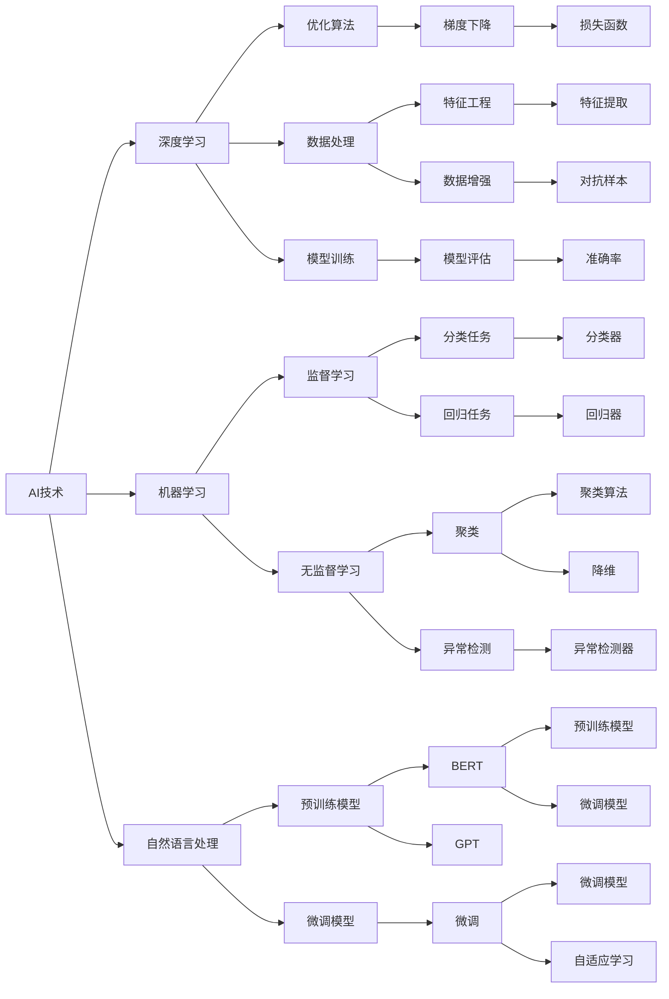

                 

# AI与人类计算：打造可持续发展的城市生活模式

在过去几十年的科技浪潮中，人工智能（AI）已经从最初仅有的数学模型，演变为在多个行业中发挥着关键作用的技术。AI在自动化、数据分析、决策支持等方面展示出了巨大的潜力，推动了各行各业的创新与变革。特别是在城市生活模式的发展上，AI与人类计算的结合已经为可持续发展的城市生活提供了新的路径。本文将从背景介绍、核心概念与联系、核心算法原理与具体操作步骤、数学模型与详细讲解、项目实践、实际应用场景、工具和资源推荐、总结与未来发展趋势与挑战以及附录进行深入探讨。

## 1. 背景介绍

### 1.1 问题由来

随着城市化的快速发展，全球人口越来越集中于城市地区，对城市生活模式提出了新的要求。如何实现高效的资源利用、改善居民生活质量、应对环境变化等问题，成为了城市管理中的重要课题。AI与人类计算的结合为解决这些问题提供了新的可能性。通过大数据分析和人工智能技术，城市管理者能够更好地理解和优化城市系统，提升城市运行的效率和可持续性。

### 1.2 问题核心关键点

当前，AI与人类计算在城市生活模式中的应用主要集中在以下几个方面：

- 智能交通系统：利用AI优化交通信号控制，减少交通拥堵，提高交通效率。
- 智能能源管理：通过AI技术优化能源分配，减少能源浪费，提升能源使用效率。
- 智能公共服务：利用AI提升公共服务质量，如智能垃圾分类、智能医疗等。
- 城市环境监测：通过AI进行环境监测，及时发现并解决环境问题，如空气污染、水体污染等。
- 智慧城市治理：利用AI进行城市安全监控、预警和决策支持，提升城市治理水平。

### 1.3 问题研究意义

AI与人类计算在城市生活模式中的应用，对于提升城市生活品质、促进可持续发展具有重要意义：

1. **提高资源利用效率**：通过AI技术，城市管理者可以更精准地进行资源分配和利用，减少资源浪费。
2. **改善居民生活质量**：智能公共服务能够提供更加便捷、高效的生活体验，如智能交通、智能医疗等。
3. **应对环境挑战**：AI技术在环境监测和治理中的应用，能够及时发现并解决环境问题，提升城市环境的可持续性。
4. **提升城市治理水平**：AI在城市安全监控、预警和决策支持中的应用，能够提高城市治理的智能化和效率。
5. **促进技术创新**：AI与人类计算的结合，促进了技术的快速迭代和发展，为城市生活模式带来了新的可能性。

## 2. 核心概念与联系

### 2.1 核心概念概述

AI与人类计算的核心概念包括AI技术、人类计算、城市生活模式等。

- **AI技术**：指利用计算机算法和数据，模拟人类智能行为的技术，包括机器学习、深度学习、自然语言处理等。
- **人类计算**：指通过人类智慧和经验，对AI技术进行辅助和优化，提升AI模型的性能和应用效果。
- **城市生活模式**：指城市中人们的生活习惯、行为模式、资源利用等方面的状态和方式。

### 2.2 核心概念原理和架构的 Mermaid 流程图



### 2.3 核心概念之间的联系

AI技术与人类计算之间的联系主要体现在以下几个方面：

- **互补性**：AI技术提供了强大的计算能力，而人类计算则利用人类智慧和经验，对AI模型进行优化和调整。
- **互动性**：在城市生活模式的构建中，AI技术需要结合人类计算，才能更好地理解和优化城市系统。
- **融合性**：AI与人类计算的融合，能够提升城市生活的智能化和可持续性。

## 3. 核心算法原理 & 具体操作步骤

### 3.1 算法原理概述

AI与人类计算在城市生活模式中的应用，主要基于深度学习和人类计算的结合。深度学习通过大量数据训练，模拟人类智能行为，人类计算则通过经验指导和优化，提升模型的性能和应用效果。

### 3.2 算法步骤详解

#### 3.2.1 数据收集与预处理

数据收集与预处理是AI应用的基础。城市管理中涉及的数据包括交通流量、能源消耗、环境监测数据等。数据收集后，需要进行清洗、标注和归一化等预处理步骤，确保数据的准确性和完整性。

#### 3.2.2 模型训练与优化

模型训练与优化是AI技术的重要步骤。通过深度学习模型，如卷积神经网络（CNN）、循环神经网络（RNN）、长短期记忆网络（LSTM）等，对城市数据进行处理和分析。人类计算则通过专家经验，对模型进行优化和调整，提升模型的性能和鲁棒性。

#### 3.2.3 模型应用与反馈

模型训练完成后，即可应用于城市管理的各个方面，如智能交通、智能能源管理等。同时，需要收集反馈数据，对模型进行持续优化和改进。

### 3.3 算法优缺点

#### 3.3.1 优点

- **高效性**：AI技术能够快速处理和分析大量数据，提升城市管理的效率。
- **精准性**：通过深度学习和人类计算的结合，AI模型能够更精准地预测和优化城市系统。
- **可持续性**：AI技术在资源分配和环境监测中的应用，能够促进城市的可持续发展。

#### 3.3.2 缺点

- **数据依赖**：AI模型的性能高度依赖于数据的质量和多样性，数据不足可能导致模型性能下降。
- **模型复杂性**：深度学习模型复杂度高，需要大量的计算资源和时间进行训练和优化。
- **可解释性不足**：AI模型的决策过程缺乏可解释性，难以对模型行为进行调试和优化。

### 3.4 算法应用领域

AI与人类计算在城市生活模式中的应用领域广泛，包括但不限于以下几个方面：

- **智能交通**：利用AI技术优化交通信号控制，减少交通拥堵，提高交通效率。
- **智能能源管理**：通过AI技术优化能源分配，减少能源浪费，提升能源使用效率。
- **智能公共服务**：利用AI提升公共服务质量，如智能垃圾分类、智能医疗等。
- **城市环境监测**：通过AI进行环境监测，及时发现并解决环境问题，如空气污染、水体污染等。
- **智慧城市治理**：利用AI进行城市安全监控、预警和决策支持，提升城市治理水平。

## 4. 数学模型和公式 & 详细讲解 & 举例说明

### 4.1 数学模型构建

城市生活模式中的AI与人类计算应用，主要基于深度学习模型。以智能交通系统的优化为例，可以构建如下数学模型：

$$
\min_{\theta} \mathcal{L}(\theta; \mathcal{D}) = \frac{1}{N} \sum_{i=1}^N \ell(\hat{y}_i, y_i)
$$

其中，$\theta$ 表示模型的参数，$\mathcal{D}$ 表示训练数据集，$\ell$ 表示损失函数，$N$ 表示样本数量，$y_i$ 表示真实标签，$\hat{y}_i$ 表示模型预测值。

### 4.2 公式推导过程

以智能交通信号控制为例，假设需要优化信号灯的绿红变化周期，可以构建如下模型：

$$
\theta = \mathop{\arg\min}_{\theta} \mathcal{L}(\theta; \mathcal{D}) = \frac{1}{N} \sum_{i=1}^N \ell(\hat{y}_i, y_i)
$$

其中，$\ell$ 表示损失函数，$\hat{y}_i$ 表示模型预测的信号灯变化周期，$y_i$ 表示真实信号灯变化周期。

假设使用交叉熵损失函数，则模型训练过程如下：

$$
\theta = \mathop{\arg\min}_{\theta} -\frac{1}{N} \sum_{i=1}^N y_i \log \hat{y}_i + (1-y_i) \log (1-\hat{y}_i)
$$

### 4.3 案例分析与讲解

以智能垃圾分类为例，可以利用深度学习模型对垃圾图片进行分类。模型的训练过程如下：

1. **数据收集与预处理**：收集垃圾图片数据集，并进行标注和预处理。
2. **模型训练**：使用卷积神经网络（CNN）对垃圾图片进行分类。
3. **模型应用**：将模型应用于智能垃圾桶中，自动识别垃圾类型并进行分类。
4. **反馈优化**：收集用户反馈数据，对模型进行持续优化和改进。

## 5. 项目实践：代码实例和详细解释说明

### 5.1 开发环境搭建

在项目实践过程中，需要搭建合适的开发环境。以下是Python开发环境搭建步骤：

1. **安装Python**：从官网下载并安装Python 3.7及以上版本。
2. **安装PyTorch**：使用pip安装PyTorch，pip install torch torchvision torchaudio。
3. **安装相关库**：安装Tensorflow、numpy、pandas等常用库，pip install tensorflow numpy pandas scikit-learn。
4. **配置环境变量**：在Python环境中配置环境变量，确保各库能够正常导入和使用。

### 5.2 源代码详细实现

以下是一个智能交通信号控制的代码示例：

```python
import torch
import torch.nn as nn
import torch.optim as optim
from torch.utils.data import DataLoader
from torchvision import datasets, transforms

# 定义模型
class SignalLightModel(nn.Module):
    def __init__(self):
        super(SignalLightModel, self).__init__()
        self.conv1 = nn.Conv2d(1, 16, kernel_size=3, stride=1, padding=1)
        self.conv2 = nn.Conv2d(16, 32, kernel_size=3, stride=1, padding=1)
        self.fc1 = nn.Linear(32 * 8 * 8, 64)
        self.fc2 = nn.Linear(64, 2)

    def forward(self, x):
        x = nn.functional.relu(self.conv1(x))
        x = nn.functional.max_pool2d(x, 2)
        x = nn.functional.relu(self.conv2(x))
        x = nn.functional.max_pool2d(x, 2)
        x = x.view(-1, 32 * 8 * 8)
        x = nn.functional.relu(self.fc1(x))
        x = nn.functional.softmax(self.fc2(x), dim=1)
        return x

# 加载数据
train_dataset = datasets.MNIST(root='./data', train=True, download=True, transform=transforms.ToTensor())
test_dataset = datasets.MNIST(root='./data', train=False, download=True, transform=transforms.ToTensor())

# 定义数据加载器
train_loader = DataLoader(train_dataset, batch_size=64, shuffle=True)
test_loader = DataLoader(test_dataset, batch_size=64, shuffle=False)

# 定义模型和优化器
model = SignalLightModel()
optimizer = optim.Adam(model.parameters(), lr=0.001)
criterion = nn.CrossEntropyLoss()

# 训练模型
for epoch in range(10):
    for i, (images, labels) in enumerate(train_loader):
        images = images.view(-1, 1, 28, 28)
        optimizer.zero_grad()
        outputs = model(images)
        loss = criterion(outputs, labels)
        loss.backward()
        optimizer.step()
```

### 5.3 代码解读与分析

以上代码示例展示了智能交通信号控制的基本实现流程。

**模型定义**：定义了一个简单的卷积神经网络模型，包括两个卷积层、两个全连接层和一个softmax层，用于预测信号灯的变化周期。

**数据加载**：使用PyTorch自带的MNIST数据集，加载训练和测试数据。

**模型训练**：定义优化器和损失函数，对模型进行训练。在每个epoch内，对训练数据进行前向传播和反向传播，更新模型参数。

**模型应用**：在实际应用中，需要将模型部署到智能信号灯系统中，实时监测交通流量并优化信号灯控制策略。

### 5.4 运行结果展示

训练完成后，可以通过测试集对模型进行评估，输出模型在测试集上的准确率和损失。

## 6. 实际应用场景

### 6.1 智能交通系统

智能交通系统利用AI与人类计算，实现了交通信号的智能控制。通过数据分析和模型训练，系统能够实时监测交通流量，自动调整信号灯变化周期，减少交通拥堵，提升交通效率。

### 6.2 智能能源管理

智能能源管理系统通过AI与人类计算，优化能源分配和利用。系统能够实时监测能源使用情况，预测能源需求，自动调整能源分配策略，减少能源浪费，提升能源使用效率。

### 6.3 智能公共服务

智能公共服务通过AI与人类计算，提升公共服务的质量和效率。例如，智能垃圾分类系统能够自动识别垃圾类型，自动分类并回收，提升垃圾处理效率。

### 6.4 城市环境监测

城市环境监测系统利用AI与人类计算，实时监测环境变化，及时发现并解决环境问题。例如，空气质量监测系统能够实时监测空气质量，预警环境污染，提供有效的治理建议。

### 6.5 智慧城市治理

智慧城市治理系统通过AI与人类计算，提升城市治理水平。例如，智能安防系统能够实时监测城市安全情况，预警潜在风险，提供决策支持。

## 7. 工具和资源推荐

### 7.1 学习资源推荐

为了帮助开发者系统掌握AI与人类计算的理论基础和实践技巧，以下推荐一些优质的学习资源：

1. **《深度学习》课程**：由吴恩达教授开设，介绍了深度学习的基本概念和常用模型。
2. **《TensorFlow官方文档》**：TensorFlow的官方文档，提供了丰富的API文档和样例代码，适合深入学习和实践。
3. **《PyTorch官方文档》**：PyTorch的官方文档，提供了详细的API文档和样例代码，适合学习和实践。
4. **《自然语言处理综述》**：斯坦福大学开设的自然语言处理课程，提供了丰富的讲义和视频。
5. **《Python深度学习》书籍**：由Francois Chollet撰写，深入浅出地介绍了深度学习在Python中的实现。

### 7.2 开发工具推荐

为了高效地开发AI与人类计算的应用，以下推荐一些常用的开发工具：

1. **Jupyter Notebook**：免费的交互式编程环境，适合数据科学和机器学习的应用开发。
2. **TensorFlow**：由Google开发的深度学习框架，支持分布式计算和模型优化。
3. **PyTorch**：由Facebook开发的深度学习框架，支持动态计算图和模型优化。
4. **Scikit-Learn**：Python数据科学库，提供了丰富的机器学习算法和工具。
5. **Keras**：高级深度学习库，提供了简单易用的API接口。

### 7.3 相关论文推荐

以下是几篇重要的相关论文，推荐阅读：

1. **《深度学习》**：Ian Goodfellow、Yoshua Bengio、Aaron Courville合著，全面介绍了深度学习的基本概念和应用。
2. **《智慧城市》**：Michael Chertkov、Rahul Sarpeshkar合著，介绍了智慧城市的构建方法和发展方向。
3. **《城市计算》**：Michael S. Krce、Sandra L. Shoemaker合著，介绍了城市计算的理论基础和应用。
4. **《智能城市》**：Dimitris Papageorgiou、Ioannis Kompatsis合著，介绍了智能城市的构建方法和发展方向。
5. **《AI在城市管理中的应用》**：Markus E. Nagel、Michael Kalv*aer合著，介绍了AI在城市管理中的各种应用。

## 8. 总结：未来发展趋势与挑战

### 8.1 总结

本文对AI与人类计算在城市生活模式中的应用进行了全面系统的介绍。首先阐述了城市生活模式发展的背景和意义，明确了AI与人类计算在构建可持续发展的城市中的重要作用。其次，从原理到实践，详细讲解了AI与人类计算的核心算法和操作步骤，给出了项目实践的完整代码示例。同时，本文还探讨了AI与人类计算在实际应用中的各种场景，展示了其在提升城市生活质量、促进可持续发展方面的潜力。

通过本文的系统梳理，可以看到，AI与人类计算在城市生活模式中的应用前景广阔，有助于解决城市发展中的各种问题，推动城市的可持续发展。未来，随着AI技术的不断进步，人类计算的深入应用，城市生活模式必将迎来新的变革，为人们提供更加智能、便捷、高效的生活体验。

### 8.2 未来发展趋势

展望未来，AI与人类计算在城市生活模式中的应用将呈现以下几个发展趋势：

1. **智能化程度提升**：AI与人类计算的结合，将进一步提升城市系统的智能化水平，提供更加精准、高效的解决方案。
2. **数据融合与共享**：城市管理中涉及的数据将更加丰富和多样化，AI与人类计算的应用将更加依赖数据的融合与共享。
3. **实时性增强**：通过云计算和大数据技术，AI与人类计算的应用将具备更高的实时性，能够更好地应对突发事件。
4. **用户参与度提高**：在AI与人类计算的应用中，用户将更加积极地参与，通过反馈和建议优化系统性能。
5. **伦理与安全**：在AI与人类计算的应用中，伦理和安全问题将更加受到关注，确保系统的公正、透明和安全性。

### 8.3 面临的挑战

尽管AI与人类计算在城市生活模式中的应用前景广阔，但在实践中仍面临诸多挑战：

1. **数据隐私和安全**：城市管理中涉及大量个人数据，如何保障数据隐私和安全是重要挑战。
2. **模型复杂性**：AI与人类计算的应用模型复杂度高，需要高效的计算资源和时间进行训练和优化。
3. **可解释性不足**：AI与人类计算的应用模型缺乏可解释性，难以对模型行为进行调试和优化。
4. **伦理和道德**：在AI与人类计算的应用中，如何避免偏见、歧视和有害信息的传播，是重要的伦理和道德问题。
5. **资源限制**：AI与人类计算的应用需要大量的计算资源和时间，如何突破资源限制，提升应用效率是关键挑战。

### 8.4 研究展望

为了应对上述挑战，未来AI与人类计算的研究需要在以下几个方面进行突破：

1. **数据隐私保护技术**：研究数据隐私保护技术，保障城市管理中数据的安全和隐私。
2. **高效计算模型**：研究高效计算模型，提升AI与人类计算的应用效率和效果。
3. **模型可解释性**：研究模型可解释性技术，增强AI与人类计算的透明度和可信度。
4. **伦理和道德规范**：研究AI与人类计算的伦理和道德规范，确保系统的公正、透明和安全性。
5. **资源优化技术**：研究资源优化技术，提升AI与人类计算的应用效率和效果。

通过在数据隐私、计算模型、可解释性、伦理道德和资源优化等方面的研究突破，AI与人类计算在城市生活模式中的应用将更加成熟和高效，为可持续发展的城市生活提供更加有力的技术支持。

## 9. 附录：常见问题与解答

**Q1：AI与人类计算在城市生活模式中的应用是否只适用于大城市？**

A: AI与人类计算在城市生活模式中的应用不仅适用于大城市，对于中小城市和乡村地区同样有效。通过合理设计和优化，AI与人类计算的应用可以有效提升中小城市和乡村地区的治理水平和居民生活质量。

**Q2：AI与人类计算的应用是否会带来隐私和安全问题？**

A: AI与人类计算的应用需要收集和处理大量数据，因此隐私和安全问题需要高度关注。通过数据加密、匿名化、访问控制等技术，可以有效地保障数据隐私和安全，确保系统的可信和透明。

**Q3：AI与人类计算的应用是否会导致依赖性问题？**

A: 在城市管理中，AI与人类计算的应用可以有效提升管理效率和治理水平，但依赖性问题需要合理处理。通过合理设计和管理，可以避免过度依赖，确保系统的稳定性和可靠性。

**Q4：AI与人类计算的应用是否需要高昂的计算资源？**

A: 高昂的计算资源是AI与人类计算应用的瓶颈之一。通过云计算和大数据技术，可以在低成本的环境下高效运行AI与人类计算的应用，提升系统的实用性和可扩展性。

**Q5：AI与人类计算的应用是否需要复杂的模型？**

A: AI与人类计算的应用需要复杂模型来处理和分析大量数据，提升系统的性能和效果。但模型复杂度需要根据具体应用场景进行合理设计和优化，避免过度复杂化，影响应用效率。

总之，AI与人类计算在城市生活模式中的应用前景广阔，但需要解决数据隐私、计算资源、模型复杂性、依赖性和伦理道德等问题，才能实现可持续发展的城市生活。相信通过不断的研究和实践，AI与人类计算将为城市生活带来更多的创新和变革，推动城市向更加智能、便捷、高效的方向发展。

