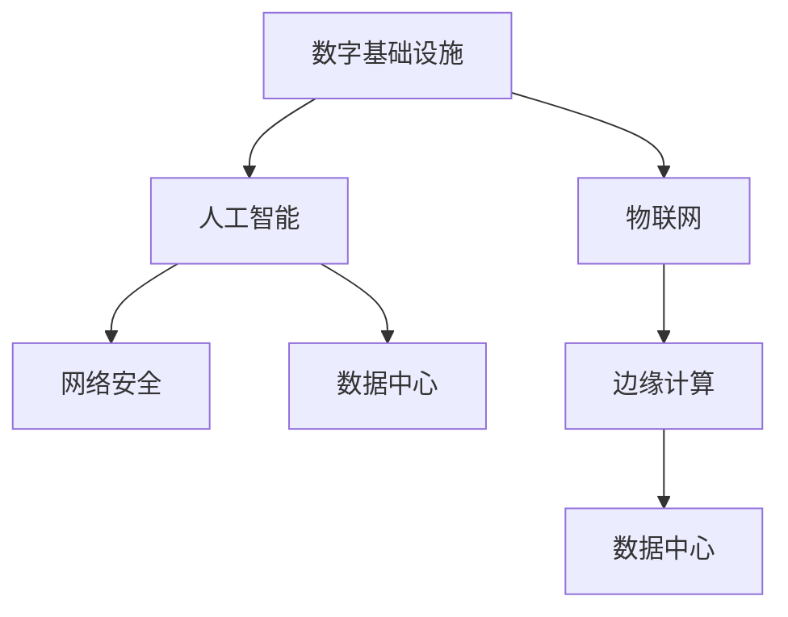

                 

## 1. 背景介绍

### 1.1 问题由来
随着人工智能(AI)技术的迅猛发展，其在数字基础设施中的应用变得越来越广泛。数字基础设施作为支持现代经济和社会的基石，涵盖了数据中心、通信网络、物联网(IoT)等多个方面。AI技术在其中发挥着关键作用，提升效率、优化决策、保障安全等方面提供了强大支持。本文将深入探讨AI在数字基础设施中的应用，分析其关键技术、实施方法及未来趋势。

### 1.2 问题核心关键点
AI在数字基础设施中的应用主要体现在以下几个关键点上：

- **数据中心优化**：通过AI算法优化数据中心的资源利用率，提升计算性能，降低能耗。
- **网络优化与预测**：利用AI进行网络流量预测，优化网络拓扑，提升通信效率。
- **物联网设备管理**：通过AI技术实现物联网设备的预测性维护、异常检测等。
- **安全防护**：利用AI进行威胁检测、入侵防御等，增强网络与数据安全。

这些应用不仅提高了数字基础设施的效率和安全性，也拓展了AI技术的实际应用场景，推动了AI技术的持续发展。

### 1.3 问题研究意义
AI在数字基础设施中的应用，对于提升基础设施的智能化水平、保障网络安全、优化资源利用等方面具有重要意义：

- **提升运营效率**：通过AI自动化优化，大大提升数据中心和网络的运营效率，降低人力成本。
- **保障数据安全**：利用AI进行实时威胁检测和防御，大幅提升网络与数据的安全性。
- **优化资源利用**：AI算法可有效预测设备运行状态，实现更精准的资源分配，降低能耗。
- **增强决策支持**：通过AI分析海量数据，为基础设施管理提供强大的决策支持，提升运营决策的科学性和准确性。

## 2. 核心概念与联系

### 2.1 核心概念概述

为更好地理解AI在数字基础设施中的应用，本节将介绍几个关键概念及其相互关系：

- **数字基础设施**：指支持现代信息技术应用的基础设施，包括数据中心、通信网络、物联网等。
- **人工智能**：利用机器学习、深度学习等技术，使计算机系统具备智能推理和自主决策能力。
- **物联网(IoT)**：通过互联网将物理设备连接起来，实现设备间的数据共享和交互。
- **网络安全**：保护网络免受未授权访问、破坏、更改、中断等威胁，保障网络与数据的安全性。
- **数据中心**：提供计算、存储、网络等基础设施，支持大规模数据处理和应用。
- **边缘计算**：将计算任务分布到靠近数据源的本地设备上，减少数据传输延迟。

这些概念之间的关系可以通过以下Mermaid流程图来展示：



这个流程图展示了几组关键概念之间的联系：

1. **人工智能**：AI通过分析数据中心、网络、物联网等基础设施的数据，实现自动化决策和优化。
2. **物联网**：IoT设备通过AI技术进行实时监测和预测性维护，提升设备利用率。
3. **网络安全**：AI算法用于威胁检测和防御，保障网络安全。
4. **数据中心**：数据中心通过AI优化资源利用，提升计算性能，降低能耗。
5. **边缘计算**：边缘计算结合AI技术，实现更高效的数据处理和响应速度。

这些概念共同构成了AI在数字基础设施中的关键应用框架，为AI技术的落地提供了坚实的基础。

## 3. 核心算法原理 & 具体操作步骤

### 3.1 算法原理概述

AI在数字基础设施中的应用主要涉及以下几个核心算法：

- **深度学习**：通过神经网络模型处理大规模数据，实现预测和分类等任务。
- **强化学习**：通过智能体与环境交互，优化决策过程，提升资源利用效率。
- **自然语言处理(NLP)**：利用NLP技术实现文本数据处理，提升设备间通信效率。
- **计算机视觉**：通过图像识别和处理技术，实现设备状态监测和异常检测。
- **时间序列分析**：通过分析时间序列数据，实现网络流量预测和异常检测。

这些算法通过与具体基础设施场景的结合，实现了对数字基础设施的全面优化。

### 3.2 算法步骤详解

AI在数字基础设施中的应用一般包括以下几个关键步骤：

**Step 1: 数据收集与预处理**
- 收集数字基础设施相关的数据，如网络流量数据、设备状态数据、环境监测数据等。
- 对数据进行清洗、归一化等预处理，保证数据的质量和一致性。

**Step 2: 模型训练与优化**
- 选择合适的AI算法模型，如深度学习、强化学习、NLP等。
- 利用训练数据对模型进行训练，并根据性能指标进行优化。

**Step 3: 部署与应用**
- 将训练好的模型部署到实际的生产环境中。
- 对数字基础设施进行实时监测和优化，提升资源利用效率和安全性。

**Step 4: 监控与维护**
- 实时监控模型运行状态，收集反馈信息。
- 根据反馈信息对模型进行调整和维护，确保长期稳定运行。

### 3.3 算法优缺点

AI在数字基础设施中的应用具有以下优点：

- **高效性**：通过自动化优化，大大提升资源利用效率，降低人力成本。
- **准确性**：利用大数据分析，提供精准的决策支持，提升运营决策的科学性。
- **安全性**：利用AI进行实时威胁检测和防御，提升网络与数据的安全性。

同时，AI技术在数字基础设施中也存在一定的局限性：

- **高成本**：初始投入的模型训练和优化成本较高，需要较高的技术门槛。
- **复杂性**：AI算法模型的构建和维护需要专业的知识背景，普通用户难以掌握。
- **数据依赖**：AI算法的表现依赖于数据质量，数据不足或偏差可能导致模型性能下降。

尽管存在这些局限性，但就目前而言，AI技术在数字基础设施中的应用已经成为提升基础设施智能化水平的重要手段。未来相关研究重点在于如何进一步降低技术门槛，提升模型的泛化能力和鲁棒性。

### 3.4 算法应用领域

AI在数字基础设施中的应用涉及多个领域，以下是一些主要应用场景：

- **数据中心**：通过AI算法优化服务器负载、预测设备故障、提升能效比等。
- **通信网络**：利用AI进行网络流量预测、优化网络拓扑、提升网络性能等。
- **物联网**：通过AI技术实现设备监测、预测性维护、异常检测等。
- **智能电网**：利用AI进行电力需求预测、智能调度、故障诊断等。
- **智慧城市**：通过AI技术实现交通管理、环境监测、公共安全等。

这些应用场景展示了AI技术在数字基础设施中的广泛适用性，为提升基础设施的智能化水平提供了强有力的技术支持。

## 4. 数学模型和公式 & 详细讲解 & 举例说明

### 4.1 数学模型构建

本节将使用数学语言对AI在数字基础设施中的应用进行更加严格的刻画。

假设我们有一个数据中心，需要对其中服务器的负载进行预测和优化。设服务器负载数据为 $\{x_t\}_{t=1}^T$，其中 $x_t$ 表示第 $t$ 时刻的负载值。我们希望利用AI模型预测未来的服务器负载，即求解最优预测模型 $f(x_t)$。

定义预测误差为：

$$
e_t = y_t - f(x_t)
$$

其中 $y_t$ 为实际负载值，$f(x_t)$ 为模型预测值。预测模型的目标是使预测误差最小化，即：

$$
\min_{f} \sum_{t=1}^T e_t^2
$$

其中 $e_t^2$ 为预测误差的平方。

### 4.2 公式推导过程

我们采用线性回归模型作为预测模型，即：

$$
f(x_t) = \theta_0 + \sum_{i=1}^n \theta_i x_{ti}
$$

其中 $\theta_0$ 为截距，$\theta_i$ 为回归系数，$n$ 为特征数。

将上述模型代入预测误差公式，得：

$$
e_t = y_t - (\theta_0 + \sum_{i=1}^n \theta_i x_{ti})
$$

平方预测误差，得：

$$
e_t^2 = (y_t - \theta_0 - \sum_{i=1}^n \theta_i x_{ti})^2
$$

将预测误差平方代入优化目标，得：

$$
\min_{\theta_0,\theta_i} \sum_{t=1}^T (y_t - \theta_0 - \sum_{i=1}^n \theta_i x_{ti})^2
$$

通过求解上述最优化问题，即可得到最优的预测模型参数。

### 4.3 案例分析与讲解

以智能电网为例，分析AI算法在电力需求预测中的应用。

设电网某区域的电力需求数据为 $\{d_t\}_{t=1}^T$，其中 $d_t$ 表示第 $t$ 时刻的电力需求值。我们希望利用AI算法预测未来的电力需求，即求解最优预测模型 $g(d_t)$。

假设我们采用时间序列模型进行预测，模型表达式为：

$$
g(d_t) = \alpha + \beta d_{t-1} + \gamma d_{t-2}
$$

其中 $\alpha$、$\beta$、$\gamma$ 为模型参数。

预测误差为：

$$
e_t = d_t - (\alpha + \beta d_{t-1} + \gamma d_{t-2})
$$

平方预测误差，得：

$$
e_t^2 = (d_t - \alpha - \beta d_{t-1} - \gamma d_{t-2})^2
$$

将预测误差平方代入优化目标，得：

$$
\min_{\alpha,\beta,\gamma} \sum_{t=1}^T (d_t - \alpha - \beta d_{t-1} - \gamma d_{t-2})^2
$$

通过求解上述最优化问题，即可得到最优的电力需求预测模型参数。

## 5. 项目实践：代码实例和详细解释说明

### 5.1 开发环境搭建

在进行AI在数字基础设施中的应用实践前，我们需要准备好开发环境。以下是使用Python进行TensorFlow开发的环境配置流程：

1. 安装Anaconda：从官网下载并安装Anaconda，用于创建独立的Python环境。

2. 创建并激活虚拟环境：
```bash
conda create -n tf-env python=3.8 
conda activate tf-env
```

3. 安装TensorFlow：根据CUDA版本，从官网获取对应的安装命令。例如：
```bash
conda install tensorflow=2.6 
```

4. 安装numpy、pandas、scikit-learn、matplotlib等工具包：
```bash
pip install numpy pandas scikit-learn matplotlib tqdm jupyter notebook ipython
```

完成上述步骤后，即可在`tf-env`环境中开始AI应用的实践。

### 5.2 源代码详细实现

下面我们以智能电网电力需求预测为例，给出使用TensorFlow进行AI算法实现的PyTorch代码实现。

首先，定义电力需求数据处理函数：

```python
import tensorflow as tf
from tensorflow.keras.models import Sequential
from tensorflow.keras.layers import Dense, LSTM

def preprocess_data(data, seq_length):
    X, y = [], []
    for i in range(len(data) - seq_length):
        X.append(data[i:i+seq_length])
        y.append(data[i+seq_length])
    return tf.stack(X, axis=0), tf.stack(y, axis=0)

# 定义时间序列数据
data = [1.2, 1.3, 1.5, 1.4, 1.6, 1.7, 1.8, 1.9, 2.0, 2.1, 2.2, 2.3]

# 数据预处理
seq_length = 3
X, y = preprocess_data(data, seq_length)

# 定义模型
model = Sequential()
model.add(LSTM(10, input_shape=(seq_length, 1)))
model.add(Dense(1))
model.compile(optimizer='adam', loss='mse')

# 训练模型
model.fit(X, y, epochs=100, batch_size=1)
```

然后，定义预测函数：

```python
def predict(model, seq_length, num_steps):
    predicted_values = []
    for i in range(len(data) - seq_length):
        inputs = data[i:i+seq_length]
        predicted_values.append(model.predict(tf.expand_dims(inputs, axis=0)))
    return predicted_values

# 预测未来5个时间步的电力需求
num_steps = 5
predictions = predict(model, seq_length, num_steps)
print(predictions)
```

以上代码实现了基于LSTM模型的电力需求预测，可以方便地应用于智能电网的其他场景。

### 5.3 代码解读与分析

让我们再详细解读一下关键代码的实现细节：

**preprocess_data函数**：
- 将原始的时间序列数据转化为适合LSTM模型的输入和输出形式。
- 每次将序列划分为3个时间步，每个时间步有1个特征值。

**定义模型**：
- 采用LSTM作为时间序列预测模型，层数为1，输出维度为1。
- 使用adam优化器和均方误差损失函数进行模型训练。

**预测函数**：
- 对输入数据进行预测，返回未来5个时间步的预测值。
- 使用expand_dims扩展输入数据维度，以便模型接受。

**主程序**：
- 定义时间序列数据。
- 预处理数据，提取特征。
- 定义和训练模型。
- 预测未来电力需求，并打印输出。

可以看到，TensorFlow提供了强大的计算图和模型构建工具，使得AI应用开发变得简洁高效。开发者可以将更多精力放在数据处理和模型设计上，而不必过多关注底层的实现细节。

当然，工业级的系统实现还需考虑更多因素，如模型的保存和部署、超参数的自动搜索、更灵活的任务适配层等。但核心的AI应用开发流程基本与此类似。

## 6. 实际应用场景

### 6.1 智能电网

AI在智能电网中的应用，主要体现在电力需求预测、智能调度和故障诊断等方面。通过AI技术，可以实现对电网负荷的精准预测，提升电网调度效率，保障电力供应的稳定性和可靠性。

**电力需求预测**：利用AI算法对历史电力需求数据进行分析，建立预测模型，实时预测未来电力需求。预测结果可用于智能调度，确保电网在高峰期有足够的电力供应。

**智能调度**：基于电力需求预测结果，优化电网调度策略，合理分配电力资源，避免因负载过高导致的电力中断。

**故障诊断**：通过AI技术实时监测电网状态，识别设备故障，快速定位问题，提高电网维护效率。

### 6.2 智能城市

AI在智慧城市中的应用，主要体现在交通管理、环境监测和公共安全等方面。通过AI技术，可以实现对城市资源的全面监测和优化，提升城市的智能化水平。

**交通管理**：利用AI算法对城市交通数据进行分析，预测交通流量和拥堵情况，优化交通信号灯控制，提升道路通行效率。

**环境监测**：通过AI技术实时监测空气质量、水质、温度等环境指标，分析环境变化趋势，提升环境治理效率。

**公共安全**：利用AI技术实时监测城市治安状况，预测犯罪热点，及时采取措施，提升公共安全水平。

### 6.3 智慧医疗

AI在智慧医疗中的应用，主要体现在患者诊断、药物研发和医疗资源优化等方面。通过AI技术，可以实现对医疗数据的深度分析，提升医疗服务质量和效率。

**患者诊断**：利用AI算法对患者病历数据进行分析，辅助医生进行诊断，提高诊断准确性和效率。

**药物研发**：通过AI技术分析生物数据，发现药物分子与疾病的关联，加速药物研发进程。

**医疗资源优化**：利用AI算法优化医疗资源分配，提升医院床位使用效率，减少医疗资源浪费。

### 6.4 未来应用展望

随着AI技术的不断进步，其在数字基础设施中的应用将更加广泛和深入。未来，AI技术将进一步提升基础设施的智能化水平，推动社会经济的可持续发展。

在智慧城市治理中，AI技术将用于交通管理、环境监测、公共安全等多个领域，提升城市治理效率，构建更安全、高效的未来城市。

在智慧医疗领域，AI技术将用于患者诊断、药物研发、医疗资源优化等多个方面，提升医疗服务质量和效率，为患者提供更精准、便捷的医疗服务。

在智能制造中，AI技术将用于生产计划优化、设备预测性维护、质量控制等多个环节，提升制造业的智能化水平，提高生产效率和产品质量。

总之，AI技术在数字基础设施中的应用前景广阔，必将为各行各业带来深刻的变革，推动社会经济的全面升级。

## 7. 工具和资源推荐
### 7.1 学习资源推荐

为了帮助开发者系统掌握AI在数字基础设施中的应用，这里推荐一些优质的学习资源：

1. 《深度学习》系列课程：由斯坦福大学开设的深度学习经典课程，系统讲解深度学习的基本概念和前沿技术，适合入门学习。

2. TensorFlow官方文档：TensorFlow的官方文档，提供丰富的示例代码和详细的使用指南，是学习TensorFlow的最佳资源。

3. TensorFlow Playground：TensorFlow的在线交互式工具，可方便地进行模型训练和可视化，适合快速实验和探索。

4. Kaggle：数据科学竞赛平台，提供海量数据集和模型应用案例，适合深入学习AI应用开发。

5. Coursera《深度学习专项课程》：由Coursera与DeepLearning.AI合作的深度学习专项课程，涵盖深度学习的基本原理和应用案例，适合系统学习。

通过对这些资源的学习实践，相信你一定能够快速掌握AI在数字基础设施中的应用，并用于解决实际的AI应用问题。
###  7.2 开发工具推荐

高效的开发离不开优秀的工具支持。以下是几款用于AI在数字基础设施中的应用开发的常用工具：

1. TensorFlow：由Google主导开发的开源深度学习框架，生产部署方便，适合大规模工程应用。支持多种设备（CPU、GPU、TPU等）的计算，适用于不同的应用场景。

2. PyTorch：基于Python的开源深度学习框架，灵活动态的计算图，适合快速迭代研究。提供丰富的预训练模型和优化算法，适用于各种AI应用开发。

3. Scikit-learn：基于Python的机器学习库，提供多种常用的机器学习算法和数据处理工具，适合快速实现机器学习应用。

4. Weights & Biases：模型训练的实验跟踪工具，可以记录和可视化模型训练过程中的各项指标，方便对比和调优。与主流深度学习框架无缝集成。

5. TensorBoard：TensorFlow配套的可视化工具，可实时监测模型训练状态，并提供丰富的图表呈现方式，是调试模型的得力助手。

6. Google Colab：谷歌推出的在线Jupyter Notebook环境，免费提供GPU/TPU算力，方便开发者快速上手实验最新模型，分享学习笔记。

合理利用这些工具，可以显著提升AI在数字基础设施中的应用开发效率，加快创新迭代的步伐。

### 7.3 相关论文推荐

AI在数字基础设施中的应用源于学界的持续研究。以下是几篇奠基性的相关论文，推荐阅读：

1. "Reinforcement Learning for Power Systems"：介绍AI技术在智能电网中的应用，特别是强化学习在电力需求预测和智能调度中的应用。

2. "Deep Learning for Natural Language Processing"：介绍AI技术在自然语言处理领域的应用，特别是基于深度学习的NLP模型在智能客服和对话系统中的应用。

3. "AI for Smart Cities"：介绍AI技术在智慧城市中的应用，特别是AI在交通管理、环境监测和公共安全中的应用。

4. "Deep Learning for Healthcare"：介绍AI技术在医疗领域的应用，特别是深度学习在患者诊断、药物研发和医疗资源优化中的应用。

这些论文代表了大语言模型微调技术的发展脉络。通过学习这些前沿成果，可以帮助研究者把握学科前进方向，激发更多的创新灵感。

## 8. 总结：未来发展趋势与挑战

### 8.1 总结

本文对AI在数字基础设施中的应用进行了全面系统的介绍。首先阐述了AI技术在数字基础设施中的研究背景和意义，明确了AI技术在提升基础设施智能化水平、保障网络安全、优化资源利用等方面的独特价值。其次，从原理到实践，详细讲解了AI在数字基础设施中的应用方法，给出了AI应用开发的完整代码实例。同时，本文还广泛探讨了AI在数字基础设施中的广泛应用场景，展示了AI技术的巨大潜力。最后，本文精选了AI应用的各类学习资源，力求为读者提供全方位的技术指引。

通过本文的系统梳理，可以看到，AI在数字基础设施中的应用已经成为推动数字经济发展的重要力量。AI技术的持续发展，将为数字基础设施的智能化升级提供强有力的技术支持，推动社会经济的全面进步。

### 8.2 未来发展趋势

展望未来，AI在数字基础设施中的应用将呈现以下几个发展趋势：

1. **深度融合**：AI技术将与数字基础设施深度融合，实现更精准的预测和优化，提升资源利用效率。
2. **边缘计算**：边缘计算结合AI技术，实现更高效的数据处理和响应速度，降低数据传输延迟。
3. **联邦学习**：通过联邦学习等隐私保护技术，实现模型在多设备上的分布式训练，提升数据安全性。
4. **实时优化**：基于实时数据流，实现动态优化，提升系统响应速度和灵活性。
5. **跨领域应用**：AI技术将跨领域应用，从电力、交通、医疗等领域，拓展到智慧城市、智能制造等更多领域，推动社会经济的全面升级。

这些趋势凸显了AI技术在数字基础设施中的广泛应用前景，为数字基础设施的智能化水平提升提供了新的动力。

### 8.3 面临的挑战

尽管AI在数字基础设施中的应用已经取得了瞩目成就，但在迈向更加智能化、普适化应用的过程中，它仍面临着诸多挑战：

1. **数据安全**：AI模型依赖海量数据进行训练，数据安全问题至关重要。如何保护数据隐私，防止数据泄露，是一个重要挑战。
2. **模型鲁棒性**：AI模型在面对数据分布变化时，容易出现过拟合或泛化能力下降的问题，如何提升模型鲁棒性是一个长期挑战。
3. **计算资源**：AI模型的训练和推理需要大量计算资源，如何在有限的计算资源下，实现高效的应用，是一个重要课题。
4. **技术复杂性**：AI应用的开发和维护需要专业的技术背景，如何降低技术门槛，提高应用的易用性，是一个重要研究方向。
5. **模型解释性**：AI模型的决策过程通常缺乏可解释性，如何提高模型的可解释性，提升用户信任度，是一个重要挑战。

这些挑战需要学界和产业界的共同努力，通过技术创新和应用实践，逐步克服。相信随着技术的进步，AI在数字基础设施中的应用将更加广泛和深入。

### 8.4 研究展望

面对AI在数字基础设施中面临的挑战，未来的研究需要在以下几个方面寻求新的突破：

1. **隐私保护技术**：引入隐私保护技术，如联邦学习、差分隐私等，确保数据在分布式训练中的安全性。
2. **模型优化算法**：开发高效模型优化算法，如梯度压缩、量化加速等，提升模型训练和推理效率。
3. **跨领域应用**：将AI技术应用于更多领域，如智慧城市、智能制造等，推动AI技术的广泛应用。
4. **模型解释性**：引入模型解释性技术，如因果推理、可解释AI等，提升模型的可解释性和用户信任度。
5. **跨模态融合**：将AI技术与计算机视觉、物联网等技术结合，实现跨模态数据的协同建模，提升系统的智能化水平。

这些研究方向的探索，必将引领AI在数字基础设施中的应用走向更高的台阶，为构建智能化的数字社会提供强有力的技术支持。面向未来，AI技术在数字基础设施中的应用将更加广泛和深入，必将为各行各业带来深刻的变革，推动社会经济的全面进步。

## 9. 附录：常见问题与解答

**Q1：AI在数字基础设施中的应用成本如何？**

A: AI在数字基础设施中的应用，虽然初期投入较大，但长期来看，可以显著提升资源利用效率，降低人力成本，从而带来更大的经济效益。同时，随着AI技术的不断进步，相关工具和平台的成本也在不断降低，逐步实现商业化应用。

**Q2：AI算法在数字基础设施中的应用有哪些局限性？**

A: AI算法在数字基础设施中的应用，尽管带来了诸多优势，但也存在一些局限性，如数据依赖、技术门槛高、计算资源需求大等。如何降低技术门槛，提高算法的易用性和可扩展性，是一个重要的研究方向。

**Q3：AI在数字基础设施中的应用前景如何？**

A: AI在数字基础设施中的应用前景非常广阔，涵盖电力、交通、医疗等多个领域。随着AI技术的不断进步，AI在数字基础设施中的应用将更加广泛和深入，推动社会经济的全面升级。

**Q4：AI在数字基础设施中的应用如何保障数据安全？**

A: AI在数字基础设施中的应用，需要高度重视数据安全问题。可以采用联邦学习等隐私保护技术，确保数据在分布式训练中的安全性。同时，合理设计数据访问权限，限制数据的使用范围，防止数据泄露。

**Q5：AI在数字基础设施中的应用如何提升资源利用效率？**

A: AI在数字基础设施中的应用，可以通过自动化优化，实现更精准的预测和优化，提升资源利用效率。例如，利用AI算法对电网负荷进行精准预测，优化电力调度策略，提升电网效率。

---

作者：禅与计算机程序设计艺术 / Zen and the Art of Computer Programming

