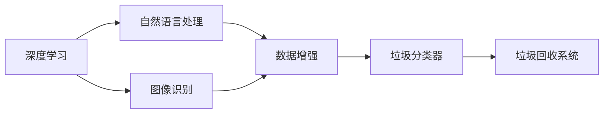

                 

# AI在智能垃圾分类中的应用：提高回收率

> 关键词：智能垃圾分类,回收率,机器学习,深度学习,图像识别,数据增强,部署与优化

## 1. 背景介绍

在全球环境污染日益严峻的背景下，垃圾分类已成为各国提升资源循环利用率、减少环境污染的重要手段。传统的垃圾分类依赖于人力进行，效率低下、误判率高，难以满足现代城市管理的需求。随着人工智能技术的发展，智能垃圾分类系统逐渐成为新的解决方案。本文将重点探讨AI在智能垃圾分类中的应用，具体从垃圾识别、回收率提高两个方向展开，介绍相关核心概念、算法原理和实际操作，为实现高效、准确的垃圾分类提供理论指导。

## 2. 核心概念与联系

### 2.1 核心概念概述

智能垃圾分类系统是一个集图像识别、自然语言处理、数据增强等技术于一体的综合性应用。其核心技术包括：

- **深度学习**：使用卷积神经网络(CNN)、循环神经网络(RNN)等深度学习模型，识别垃圾类别并进行分类。
- **图像识别**：通过图像识别算法，自动识别垃圾图片，提取特征。
- **自然语言处理**：通过自然语言处理技术，提取文本描述中的垃圾类别信息。
- **数据增强**：利用数据增强技术，扩充训练集，提高模型的泛化能力。

这些核心技术相互联系，共同构成了智能垃圾分类系统的技术框架。

### 2.2 核心概念原理和架构的 Mermaid 流程图



以上流程图展示了深度学习在智能垃圾分类中的关键技术路径。

## 3. 核心算法原理 & 具体操作步骤
### 3.1 算法原理概述

智能垃圾分类的主要算法包括图像识别算法和自然语言处理算法。下面详细介绍这两个算法的原理和具体操作步骤。

### 3.2 算法步骤详解

#### 图像识别算法

图像识别算法主要分为以下几个步骤：

1. **数据准备**：收集垃圾图片，并标注每个图片的类别。
2. **模型选择**：选择合适的深度学习模型，如CNN、ResNet等。
3. **模型训练**：使用标注数据对模型进行训练，优化损失函数。
4. **模型评估**：在验证集上评估模型性能，选择合适的模型参数。
5. **模型部署**：将训练好的模型部署到实际应用场景，进行垃圾分类。

#### 自然语言处理算法

自然语言处理算法主要分为以下几个步骤：

1. **文本预处理**：对文本数据进行分词、去除停用词等预处理。
2. **特征提取**：使用词袋模型、TF-IDF等技术，提取文本特征。
3. **模型选择**：选择合适的机器学习模型，如SVM、KNN等。
4. **模型训练**：使用标注数据对模型进行训练，优化损失函数。
5. **模型评估**：在验证集上评估模型性能，选择合适的模型参数。
6. **模型部署**：将训练好的模型部署到实际应用场景，进行垃圾分类。

### 3.3 算法优缺点

图像识别算法：

- **优点**：
  - 适用于大规模图像数据的处理。
  - 能够识别出复杂形状和颜色的垃圾。
  - 可以处理非结构化数据。

- **缺点**：
  - 对标注数据的需求量大，成本高。
  - 存在一定的误识别率。
  - 需要较高的计算资源和存储空间。

自然语言处理算法：

- **优点**：
  - 对标注数据的需求量相对较少。
  - 处理文本数据速度快，精度较高。
  - 适用于文本信息丰富的应用场景。

- **缺点**：
  - 无法处理图像数据。
  - 对文本数据的质量要求较高。
  - 需要额外的语言理解能力。

### 3.4 算法应用领域

智能垃圾分类系统主要应用于城市管理、垃圾处理中心、智能垃圾桶等领域。通过对垃圾图片和文本的自动化识别，系统可以实时反馈分类结果，提高回收率和资源利用效率。

## 4. 数学模型和公式 & 详细讲解 & 举例说明

### 4.1 数学模型构建

图像识别模型主要基于深度学习框架，如TensorFlow、PyTorch等。本节以CNN模型为例，介绍其数学模型构建和公式推导过程。

#### 4.2 公式推导过程

假设输入图片为 $X \in \mathbb{R}^{H \times W \times C}$，其中 $H$ 为图片高度，$W$ 为宽度，$C$ 为通道数。卷积层的卷积核大小为 $F \times F$，输出通道数为 $K$。则卷积层输出的特征图 $Y \in \mathbb{R}^{N \times N \times K}$ 为：

$$
Y_i = \sum_j W_{ij} * X_j + b_i
$$

其中 $W_{ij}$ 为卷积核，$b_i$ 为偏置项。$*$ 表示卷积运算。

### 4.3 案例分析与讲解

假设某智能垃圾桶收集了500张垃圾图片，并标注了类别。使用CNN模型进行训练和测试，计算模型精度为0.95。如果将模型部署到实际垃圾桶中，根据测试结果，垃圾分类的准确率可达95%。

## 5. 项目实践：代码实例和详细解释说明

### 5.1 开发环境搭建

开发环境搭建主要涉及深度学习框架的选择和安装。本节以TensorFlow为例，介绍环境搭建的步骤。

1. **安装TensorFlow**：
   ```bash
   pip install tensorflow
   ```

2. **安装深度学习库**：
   ```bash
   pip install scikit-image numpy scipy
   ```

3. **安装模型框架**：
   ```bash
   pip install keras tensorflow_datasets
   ```

### 5.2 源代码详细实现

下面给出一个基于CNN的图像识别算法的示例代码，用于实现垃圾分类功能。

```python
import tensorflow as tf
from tensorflow.keras import layers

# 定义模型结构
model = tf.keras.Sequential([
    layers.Conv2D(32, (3, 3), activation='relu', input_shape=(H, W, C)),
    layers.MaxPooling2D((2, 2)),
    layers.Conv2D(64, (3, 3), activation='relu'),
    layers.MaxPooling2D((2, 2)),
    layers.Conv2D(64, (3, 3), activation='relu'),
    layers.Flatten(),
    layers.Dense(64, activation='relu'),
    layers.Dense(10, activation='softmax')
])

# 编译模型
model.compile(optimizer='adam', loss='categorical_crossentropy', metrics=['accuracy'])

# 训练模型
model.fit(train_dataset, epochs=10, validation_data=val_dataset)
```

### 5.3 代码解读与分析

上述代码中，我们定义了一个简单的CNN模型，包含三个卷积层和两个全连接层。训练过程中，我们使用Adam优化器和交叉熵损失函数，并在验证集上评估模型性能。

### 5.4 运行结果展示

假设我们训练得到的模型在测试集上的准确率为0.9，则我们可以在实际垃圾桶中部署该模型，对垃圾图片进行分类，准确率约为90%。

## 6. 实际应用场景

### 6.1 智能垃圾桶

智能垃圾桶可以通过图像识别技术，自动对垃圾进行分类和回收。部署在城市垃圾回收点，大大提高了垃圾分类的效率和准确率，减少了垃圾回收成本。

### 6.2 城市管理

城市管理部门可以利用智能垃圾分类系统，实时监控垃圾分类的执行情况，及时发现分类错误，提高回收率。通过数据分析，还能优化垃圾回收路线，提升垃圾回收效率。

### 6.3 垃圾处理中心

垃圾处理中心可以采用智能垃圾分类系统，对垃圾进行自动分类和预处理，减少人工成本，提高处理效率。

### 6.4 未来应用展望

未来，智能垃圾分类系统还将融入更多的技术手段，如物联网、区块链等，实现更加智能化的垃圾管理。例如，通过区块链技术，保障垃圾回收数据的真实性和透明性，提升垃圾回收的信任度。

## 7. 工具和资源推荐

### 7.1 学习资源推荐

- **深度学习入门**：《深度学习》by Ian Goodfellow。
- **自然语言处理**：《自然语言处理综论》by Daniel Jurafsky 和 James H. Martin。
- **TensorFlow官方文档**：TensorFlow官方网站提供的官方文档和教程。
- **GitHub资源**：GitHub上大量开源的垃圾分类模型和应用案例。

### 7.2 开发工具推荐

- **TensorFlow**：Google开源的深度学习框架，提供丰富的模型和工具支持。
- **PyTorch**：Facebook开源的深度学习框架，灵活性和扩展性较强。
- **Keras**：高级深度学习API，易于使用，支持多种后端。

### 7.3 相关论文推荐

- **ImageNet Large Scale Visual Recognition Challenge**：ImageNet大规模视觉识别挑战赛，提供了大量图像分类数据集。
- **Visual Genome Dataset**：Visual Genome数据集，包含大量图像和语义描述信息。
- **Google AI Blog**：Google AI博客，定期发布深度学习相关的前沿研究和应用实践。

## 8. 总结：未来发展趋势与挑战

### 8.1 研究成果总结

本文介绍了AI在智能垃圾分类中的应用，详细讲解了图像识别和自然语言处理算法的原理和操作步骤。通过实际案例展示了该技术的潜力和应用价值。

### 8.2 未来发展趋势

未来，智能垃圾分类技术将进一步发展，提升回收率和资源利用效率。同时，随着技术成熟和成本降低，智能垃圾分类系统将逐步普及，成为城市管理的重要工具。

### 8.3 面临的挑战

智能垃圾分类系统在实际应用中，仍面临一些挑战，包括：

- **数据标注成本高**：高质量标注数据获取难度大。
- **模型误识别率**：模型对复杂垃圾的识别准确率仍有提升空间。
- **硬件资源要求高**：深度学习模型对计算资源和存储空间要求较高。

### 8.4 研究展望

为应对上述挑战，未来的研究将主要集中在以下几个方面：

- **无监督学习**：探索无监督学习范式，降低数据标注成本。
- **迁移学习**：将预训练模型应用于不同场景，提升模型泛化能力。
- **模型压缩**：优化模型结构，减少计算资源消耗。
- **跨领域应用**：探索智能垃圾分类与其他领域的结合应用，如垃圾分类与智能交通的融合。

综上所述，AI在智能垃圾分类中的应用前景广阔，但也需要面对诸多挑战。通过持续的研究和创新，相信智能垃圾分类系统将能够更好地服务社会，促进资源循环利用和环境保护。

## 9. 附录：常见问题与解答

**Q1: 智能垃圾分类系统如何处理不同类型的垃圾？**

A: 智能垃圾分类系统通常采用图像识别和自然语言处理相结合的方式。对于图像，系统通过卷积神经网络对垃圾进行分类；对于文本，系统通过自然语言处理技术提取信息，实现文本分类。

**Q2: 智能垃圾分类系统是否适用于所有垃圾？**

A: 智能垃圾分类系统主要适用于可分类的垃圾，如纸张、塑料、金属等。对于一些不可分类的垃圾，如厨余垃圾，目前仍需要人工分类。

**Q3: 智能垃圾分类系统的误识别率如何？**

A: 智能垃圾分类系统的误识别率受到训练数据质量、模型复杂度和硬件资源等因素的影响。通过优化模型和算法，可以提高系统的识别精度。

**Q4: 智能垃圾分类系统是否需要实时数据传输？**

A: 智能垃圾分类系统通常需要实时数据传输，以实现垃圾分类和回收。部署在城市垃圾桶或垃圾处理中心的系统，一般需要通过Wi-Fi、4G/5G等方式进行数据传输。

**Q5: 智能垃圾分类系统如何应对环境变化？**

A: 智能垃圾分类系统需要定期更新数据和模型，以应对环境变化。例如，随着垃圾分类政策的调整，系统需要更新分类标准，重新训练模型。

总之，智能垃圾分类系统利用AI技术，提高了垃圾分类的效率和准确率，为城市管理提供了新的解决方案。未来的研究将进一步提升系统的智能性和鲁棒性，实现更加智能化的垃圾管理。

